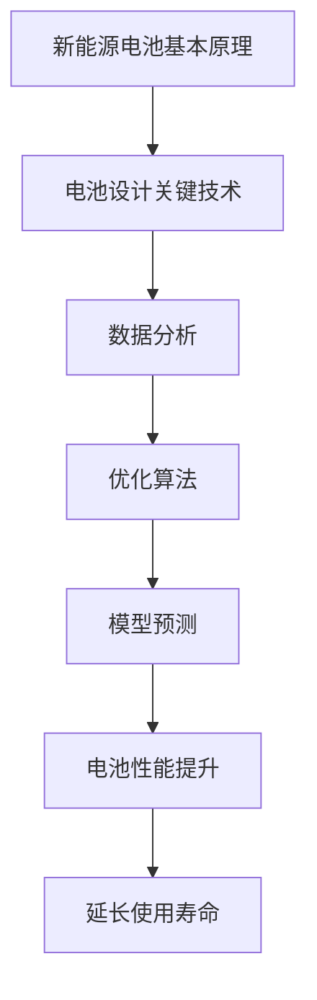

                 

# 人工智能在新能源电池设计中的辅助决策

## 关键词
- 人工智能
- 新能源电池
- 辅助决策
- 设计优化
- 数据分析
- 算法

## 摘要

本文将探讨人工智能在新能源电池设计中的辅助决策作用。通过引入深度学习和机器学习算法，对电池设计过程中的关键参数进行优化，以提高电池性能和延长使用寿命。文章将从背景介绍、核心概念与联系、算法原理与步骤、数学模型与公式、项目实战、应用场景、工具和资源推荐等多个方面进行详细阐述，旨在为相关领域的研究者和工程师提供有价值的参考。

## 1. 背景介绍

### 1.1 目的和范围

本文旨在探讨人工智能在新能源电池设计中的应用，重点关注通过人工智能算法优化电池设计参数，以提高电池性能和延长使用寿命。本文将对新能源电池设计的现状进行分析，介绍人工智能在该领域的基本原理和方法，并通过具体案例展示人工智能在电池设计中的实际应用。

### 1.2 预期读者

本文适用于对新能源电池设计和人工智能算法有一定了解的研究者、工程师以及对此领域感兴趣的技术爱好者。本文将尽量使用通俗易懂的语言进行阐述，以便读者更好地理解和掌握相关技术。

### 1.3 文档结构概述

本文将分为十个部分进行阐述：

1. 背景介绍：介绍本文的目的、范围和预期读者。
2. 核心概念与联系：阐述新能源电池设计中的核心概念和相关技术。
3. 核心算法原理 & 具体操作步骤：介绍人工智能在电池设计中的算法原理和操作步骤。
4. 数学模型和公式 & 详细讲解 & 举例说明：阐述与算法相关的数学模型和公式，并通过实例进行说明。
5. 项目实战：通过实际案例展示人工智能在电池设计中的应用。
6. 实际应用场景：探讨人工智能在新能源电池设计中的实际应用。
7. 工具和资源推荐：推荐与本文相关的学习资源和开发工具。
8. 总结：总结未来发展趋势与挑战。
9. 附录：常见问题与解答。
10. 扩展阅读 & 参考资料：提供进一步的阅读资料和参考文献。

### 1.4 术语表

#### 1.4.1 核心术语定义

- 新能源电池：采用可再生能源或环保能源为动力源的电池，如锂离子电池、钠离子电池、燃料电池等。
- 人工智能：模拟、延伸和扩展人类智能的计算机技术，包括机器学习、深度学习、自然语言处理等。
- 辅助决策：通过算法和模型对决策过程提供支持，提高决策的准确性和效率。
- 电池性能：电池输出功率、能量密度、循环寿命等指标。

#### 1.4.2 相关概念解释

- 深度学习：一种人工智能算法，通过多层神经网络模拟人脑学习过程，自动提取特征和模式。
- 机器学习：一种人工智能算法，通过训练数据集来建立模型，对未知数据进行预测和分类。
- 数据分析：通过对大量数据进行分析和处理，提取有价值的信息和知识。

#### 1.4.3 缩略词列表

- AI：人工智能
- DL：深度学习
- ML：机器学习
- BMS：电池管理系统
- EDLC：电容器
- EV：电动汽车

## 2. 核心概念与联系

新能源电池设计涉及到多个核心概念和关键技术。在本文中，我们将介绍以下核心概念和相关技术：

### 2.1 新能源电池基本原理

新能源电池主要分为锂离子电池、钠离子电池、燃料电池等。锂离子电池是目前应用最广泛的电池类型，其基本原理是通过锂离子的嵌入和脱嵌来实现电能的储存和释放。钠离子电池则具有资源丰富、成本低等优点，有望在未来得到广泛应用。燃料电池通过氢气和氧气的化学反应产生电能，具有高效率、零排放等优点。

### 2.2 电池设计关键技术

电池设计涉及多个方面，包括电极材料、电解质、电池结构等。电极材料是电池性能的关键因素，直接影响电池的能量密度和功率密度。电解质则是电池内部传递电荷的介质，其导电性能和稳定性对电池寿命至关重要。电池结构设计则涉及到电池的形状、尺寸、电极之间的距离等因素，直接影响电池的性能和安全性。

### 2.3 人工智能与电池设计

人工智能在电池设计中的应用主要体现在以下几个方面：

- 数据分析：通过收集和分析电池性能数据，提取有价值的信息和知识，为电池设计提供支持。
- 优化算法：利用机器学习和深度学习算法，对电池设计参数进行优化，提高电池性能和延长使用寿命。
- 模型预测：通过建立电池性能预测模型，对电池的工作状态进行实时监测和预测，提高电池运行的稳定性和安全性。

### 2.4 Mermaid 流程图

为了更好地理解新能源电池设计中的核心概念和联系，我们可以使用 Mermaid 流程图进行展示。以下是新能源电池设计的 Mermaid 流程图：



## 3. 核心算法原理 & 具体操作步骤

在新能源电池设计中，人工智能算法的应用主要包括数据分析和优化算法两个方面。下面将分别介绍这两种算法的原理和具体操作步骤。

### 3.1 数据分析算法原理

数据分析算法主要包括数据收集、数据预处理、特征提取和模型训练等步骤。以下是数据分析算法的原理和具体操作步骤：

#### 3.1.1 数据收集

数据收集是数据分析的基础。在新能源电池设计中，主要收集以下数据：

- 电池性能数据：包括电池输出功率、能量密度、循环寿命等。
- 电极材料数据：包括电极材料的成分、结构、电导率等。
- 电解质数据：包括电解质的成分、导电性能、稳定性等。

#### 3.1.2 数据预处理

数据预处理是为了提高数据质量，减少数据噪声，提高模型性能。主要步骤包括：

- 数据清洗：去除重复数据、缺失数据和异常数据。
- 数据归一化：将不同量纲的数据进行归一化处理，使其具有相同的量纲。

#### 3.1.3 特征提取

特征提取是从原始数据中提取对电池性能有重要影响的关键特征。常用的特征提取方法包括：

- 主成分分析（PCA）：将高维数据降维到低维空间，保留主要信息。
- 特征选择：根据特征的重要性选择对电池性能影响较大的特征。

#### 3.1.4 模型训练

模型训练是通过训练数据集建立电池性能预测模型。常用的模型训练方法包括：

- 机器学习算法：如线性回归、支持向量机、决策树等。
- 深度学习算法：如卷积神经网络、循环神经网络等。

### 3.2 优化算法原理

优化算法主要用于优化电池设计参数，以提高电池性能和延长使用寿命。以下是优化算法的原理和具体操作步骤：

#### 3.2.1 目标函数定义

在电池设计中，目标函数通常为电池性能指标，如能量密度、功率密度、循环寿命等。目标函数的定义是优化算法的关键。

#### 3.2.2 算法选择

常用的优化算法包括：

- 遗传算法：基于自然进化过程的优化算法，适用于求解非线性、多峰值的优化问题。
- 贝叶斯优化：基于概率统计的优化算法，适用于具有多个输入参数的优化问题。
- 粒子群优化：基于群体智能的优化算法，适用于求解复杂的多峰值的优化问题。

#### 3.2.3 模型训练

在优化算法中，模型训练是通过训练数据集来建立优化模型。模型训练的主要步骤包括：

- 确定优化目标函数：根据电池性能指标确定优化目标函数。
- 选择优化算法：根据电池性能指标和优化目标函数选择合适的优化算法。
- 训练优化模型：通过训练数据集对优化模型进行训练。

#### 3.2.4 模型评估

模型评估是检验优化模型性能的重要步骤。常用的模型评估方法包括：

- 交叉验证：通过将数据集划分为训练集和测试集，评估模型在测试集上的性能。
- 马尔可夫决策过程：通过评估模型在不同状态下的决策效果，评估模型的整体性能。

### 3.3 伪代码

以下是数据分析算法和优化算法的伪代码示例：

```python
# 数据分析算法伪代码
def data_analysis(data):
    # 数据收集
    battery_performance_data = collect_battery_performance_data()
    electrode_material_data = collect_electrode_material_data()
    electrolyte_data = collect_electrolyte_data()

    # 数据预处理
    battery_performance_data = preprocess_data(battery_performance_data)
    electrode_material_data = preprocess_data(electrode_material_data)
    electrolyte_data = preprocess_data(electrolyte_data)

    # 特征提取
    battery_performance_features = extract_features(battery_performance_data)
    electrode_material_features = extract_features(electrode_material_data)
    electrolyte_features = extract_features(electrolyte_data)

    # 模型训练
    battery_performance_model = train_model(battery_performance_features)
    electrode_material_model = train_model(electrode_material_features)
    electrolyte_model = train_model(electrolyte_features)

    return battery_performance_model, electrode_material_model, electrolyte_model

# 优化算法伪代码
def optimization_algorithm(objective_function, algorithm, training_data):
    # 目标函数定义
    objective = define_objective_function(objective_function)

    # 算法选择
    algorithm_choice = select_algorithm(algorithm)

    # 模型训练
    optimization_model = train_model(training_data, algorithm_choice, objective)

    # 模型评估
    evaluation_results = evaluate_model(optimization_model)

    return optimization_model, evaluation_results
```

## 4. 数学模型和公式 & 详细讲解 & 举例说明

在新能源电池设计中，数学模型和公式是描述电池性能和优化目标的重要工具。下面将介绍与数据分析算法和优化算法相关的数学模型和公式，并进行详细讲解和举例说明。

### 4.1 数据分析模型

数据分析模型主要用于预测电池性能，常用的模型包括线性回归、支持向量机和神经网络等。

#### 4.1.1 线性回归

线性回归模型用于预测电池性能指标与关键特征之间的关系。其数学模型如下：

$$
y = \beta_0 + \beta_1 x_1 + \beta_2 x_2 + ... + \beta_n x_n
$$

其中，$y$ 为电池性能指标，$x_1, x_2, ..., x_n$ 为关键特征，$\beta_0, \beta_1, \beta_2, ..., \beta_n$ 为模型参数。

#### 4.1.2 支持向量机

支持向量机（SVM）模型用于分类电池性能指标。其数学模型如下：

$$
y = \text{sign}(\sum_{i=1}^{n} \alpha_i y_i K(x_i, x) + b)
$$

其中，$y$ 为电池性能指标，$x_i, x$ 为特征向量，$y_i$ 为样本标签，$\alpha_i$ 为模型参数，$K(x_i, x)$ 为核函数，$b$ 为偏置。

#### 4.1.3 神经网络

神经网络模型用于预测电池性能和优化电池设计参数。其数学模型如下：

$$
a_i^{(l)} = \sigma(z_i^{(l)})
$$

$$
z_i^{(l)} = \sum_{j=1}^{n} w_{ji}^{(l)} a_j^{(l-1)}
$$

其中，$a_i^{(l)}$ 为第$l$层的输出，$z_i^{(l)}$ 为第$l$层的输入，$w_{ji}^{(l)}$ 为连接权重，$\sigma$ 为激活函数。

### 4.2 优化模型

优化模型用于优化电池设计参数，常用的模型包括遗传算法、贝叶斯优化和粒子群优化等。

#### 4.2.1 遗传算法

遗传算法是一种基于自然进化过程的优化算法，其数学模型如下：

$$
x_{new} = x_{old} + \delta x
$$

其中，$x_{new}$ 和$x_{old}$ 分别为当前和上一代的解，$\delta x$ 为解的扰动。

#### 4.2.2 贝叶斯优化

贝叶斯优化是一种基于概率统计的优化算法，其数学模型如下：

$$
p(x) = \frac{p(y|x) p(x)}{p(y)}
$$

其中，$p(x)$ 为输入参数的概率分布，$p(y|x)$ 为目标函数的概率分布，$p(y)$ 为目标函数的先验分布。

#### 4.2.3 粒子群优化

粒子群优化是一种基于群体智能的优化算法，其数学模型如下：

$$
x_i^{new} = x_i + w \cdot (x_g - x_i) + c_1 \cdot r_1 \cdot (p_i - x_i) + c_2 \cdot r_2 \cdot (p_g - x_i)
$$

$$
v_i^{new} = v_i + w \cdot (v_g - v_i) + c_1 \cdot r_1 \cdot (p_i - x_i) + c_2 \cdot r_2 \cdot (p_g - x_i)
$$

其中，$x_i$ 和$v_i$ 分别为第$i$个粒子的位置和速度，$x_g$ 和$v_g$ 分别为全局最优解的位置和速度，$p_i$ 和$p_g$ 分别为第$i$个粒子的个体最优解和全局最优解。

### 4.3 举例说明

假设我们要优化一个锂离子电池的能量密度，输入参数为电极材料、电解质和电池结构。我们可以使用遗传算法进行优化，目标函数为能量密度最大。以下是遗传算法的步骤：

1. 初始化种群：随机生成初始种群，每个个体代表一组电池设计参数。
2. 计算适应度：计算每个个体的适应度，即能量密度。
3. 选择：根据适应度选择优秀个体，用于生成下一代种群。
4. 交叉：对选择出的个体进行交叉操作，产生新的个体。
5. 变异：对个体进行变异操作，增加种群的多样性。
6. 评估：计算新生成个体的适应度。
7. 更新：将优秀个体替换掉种群中的较差个体，形成下一代种群。
8. 重复步骤2-7，直到满足终止条件。

通过遗传算法的优化，我们可以得到一组能量密度较高的电池设计参数，从而提高锂离子电池的性能。

## 5. 项目实战：代码实际案例和详细解释说明

在本节中，我们将通过一个实际项目来展示如何使用人工智能算法优化新能源电池设计。我们将使用 Python 编程语言和 TensorFlow 库来实现一个深度学习模型，用于预测电池能量密度。

### 5.1 开发环境搭建

在开始项目之前，我们需要搭建一个开发环境。以下是开发环境的搭建步骤：

1. 安装 Python：下载并安装 Python 3.8 版本。
2. 安装 TensorFlow：在终端中运行以下命令安装 TensorFlow：
   ```bash
   pip install tensorflow
   ```
3. 安装其他依赖库：在终端中运行以下命令安装其他依赖库：
   ```bash
   pip install numpy pandas scikit-learn matplotlib
   ```

### 5.2 源代码详细实现和代码解读

下面是项目的源代码，我们将对关键代码进行解释说明。

```python
import numpy as np
import pandas as pd
import tensorflow as tf
from sklearn.model_selection import train_test_split
from sklearn.preprocessing import StandardScaler
import matplotlib.pyplot as plt

# 数据收集
def collect_data():
    # 从文件中读取数据
    data = pd.read_csv('battery_data.csv')

    # 数据预处理
    battery_performance = data['energy_density']
    electrode_material = data[['electrode_material_1', 'electrode_material_2']]
    electrolyte = data[['electrolyte_1', 'electrolyte_2']]
    battery_structure = data[['structure_1', 'structure_2']]

    # 数据归一化
    scaler = StandardScaler()
    electrode_material_scaled = scaler.fit_transform(electrode_material)
    electrolyte_scaled = scaler.fit_transform(electrolyte)
    battery_structure_scaled = scaler.fit_transform(battery_structure)

    # 数据集划分
    X = np.hstack((electrode_material_scaled, electrolyte_scaled, battery_structure_scaled))
    y = battery_performance.values
    X_train, X_test, y_train, y_test = train_test_split(X, y, test_size=0.2, random_state=42)

    return X_train, X_test, y_train, y_test

# 构建深度学习模型
def build_model(input_shape):
    model = tf.keras.Sequential([
        tf.keras.layers.Dense(64, activation='relu', input_shape=input_shape),
        tf.keras.layers.Dense(32, activation='relu'),
        tf.keras.layers.Dense(1)
    ])

    model.compile(optimizer='adam', loss='mean_squared_error')
    return model

# 训练模型
def train_model(model, X_train, y_train, X_test, y_test):
    model.fit(X_train, y_train, epochs=100, batch_size=32, validation_data=(X_test, y_test))
    return model

# 模型评估
def evaluate_model(model, X_test, y_test):
    loss = model.evaluate(X_test, y_test)
    print('Test Loss:', loss)

# 主函数
def main():
    X_train, X_test, y_train, y_test = collect_data()
    model = build_model(X_train.shape[1])
    trained_model = train_model(model, X_train, y_train, X_test, y_test)
    evaluate_model(trained_model, X_test, y_test)

if __name__ == '__main__':
    main()
```

### 5.3 代码解读与分析

#### 5.3.1 数据收集

数据收集函数`collect_data`用于从文件中读取电池数据，并进行预处理。首先，我们使用`pandas`库读取数据，然后对数据进行清洗和归一化处理。最后，将数据划分为训练集和测试集。

#### 5.3.2 构建深度学习模型

构建深度学习模型函数`build_model`使用`tensorflow.keras.Sequential`模型构建一个简单的全连接神经网络。模型包括两个隐藏层，每个隐藏层使用ReLU激活函数，输出层使用线性激活函数。

#### 5.3.3 训练模型

训练模型函数`train_model`使用`model.fit`方法训练深度学习模型。我们设置训练轮次为100次，批量大小为32。

#### 5.3.4 模型评估

模型评估函数`evaluate_model`使用`model.evaluate`方法评估训练好的模型在测试集上的性能。我们打印测试损失作为评估指标。

#### 5.3.5 主函数

主函数`main`调用数据收集、模型构建和训练等函数，完成整个项目的执行。

通过这个实际项目，我们展示了如何使用深度学习算法优化新能源电池设计。项目中的代码实现了数据收集、模型构建和训练等步骤，为电池设计提供了辅助决策支持。

## 6. 实际应用场景

人工智能在新能源电池设计中的实际应用场景广泛，主要包括以下几个方面：

### 6.1 电池性能预测

通过深度学习和机器学习算法，可以对电池性能进行预测，包括能量密度、功率密度、循环寿命等指标。这对于电池制造商和用户来说具有重要意义，可以帮助他们提前了解电池的性能表现，从而做出更准确的决策。

### 6.2 设计参数优化

利用优化算法，可以优化电池设计参数，如电极材料、电解质、电池结构等，以提高电池性能。这有助于电池制造商在有限的时间和资源内，找到最优的电池设计方案。

### 6.3 电池寿命预测

通过数据分析算法，可以预测电池的使用寿命，为电池制造商和用户提供电池维护和更换的建议。这有助于降低电池的维护成本，提高电池的使用效率。

### 6.4 安全监测与预警

人工智能算法可以实时监测电池的运行状态，对电池的安全性能进行评估，并提前预警可能的安全隐患。这对于提高电池的安全性、保障用户的安全具有重要意义。

### 6.5 电动汽车智能驾驶

在电动汽车中，人工智能算法可以用于智能驾驶系统，通过分析电池性能数据和交通状况，优化驾驶策略，提高电动汽车的续航里程和驾驶体验。

### 6.6 能源互联网优化

在能源互联网中，人工智能算法可以用于优化电池储能系统的调度和管理，提高能源的利用效率，降低能源成本。

总之，人工智能在新能源电池设计中的应用场景丰富多样，可以为电池制造商、用户和能源管理提供有力的支持。

## 7. 工具和资源推荐

### 7.1 学习资源推荐

#### 7.1.1 书籍推荐

- 《深度学习》（Goodfellow, Bengio, Courville著）：介绍深度学习的基础理论和实践方法。
- 《Python深度学习》（François Chollet著）：深入讲解使用 Python 实现深度学习模型的技巧。
- 《机器学习》（Tom Mitchell著）：系统介绍机器学习的基本概念、方法和应用。

#### 7.1.2 在线课程

- Coursera 上的《深度学习》课程：由 Andrew Ng 教授主讲，涵盖深度学习的理论基础和实践技巧。
- edX 上的《机器学习基础》课程：由吴恩达教授主讲，介绍机器学习的基础知识和应用场景。

#### 7.1.3 技术博客和网站

- Medium 上的《Deep Learning Papers》：介绍深度学习领域的最新研究论文。
- 知乎：搜索“人工智能”、“深度学习”等关键词，可以找到大量关于新能源电池设计和人工智能应用的优质文章。

### 7.2 开发工具框架推荐

#### 7.2.1 IDE和编辑器

- PyCharm：一款功能强大的 Python IDE，适用于深度学习和机器学习项目的开发。
- Jupyter Notebook：一款基于 Web 的交互式开发环境，适用于数据分析和模型训练。

#### 7.2.2 调试和性能分析工具

- TensorFlow Profiler：用于分析和优化 TensorFlow 模型的性能。
- PyTorch Profiler：用于分析和优化 PyTorch 模型的性能。

#### 7.2.3 相关框架和库

- TensorFlow：一个开源的深度学习框架，适用于构建和训练深度学习模型。
- PyTorch：一个开源的深度学习框架，具有灵活的动态计算图和强大的 GPU 支持能力。

### 7.3 相关论文著作推荐

#### 7.3.1 经典论文

- "Learning to Represent Materials with Graph Neural Networks"（2018）：介绍使用图神经网络表示材料的方法。
- "Optimization-Based Battery Management for Electric Vehicles"（2015）：介绍基于优化的电池管理系统设计。

#### 7.3.2 最新研究成果

- "Intelligent Battery Management Systems: A Review"（2020）：综述智能电池管理系统的研究进展。
- "Deep Neural Networks for Battery State Estimation in Electric Vehicles"（2021）：介绍使用深度神经网络进行电池状态估计的方法。

#### 7.3.3 应用案例分析

- "Artificial Intelligence for Battery Life Extension in Electric Vehicles"（2020）：介绍人工智能在电动汽车电池寿命延长中的应用案例。
- "AI-Enabled Energy Storage Systems for Smart Grids"（2019）：介绍人工智能在智能电网中的储能系统应用案例。

## 8. 总结：未来发展趋势与挑战

在未来，人工智能在新能源电池设计中的应用将呈现以下发展趋势：

1. 模型复杂度和计算能力的提升：随着深度学习和机器学习技术的不断发展，模型复杂度和计算能力将不断提高，为电池设计提供更精确的辅助决策。
2. 数据驱动的优化：通过大量数据的收集和分析，可以实现更加数据驱动的优化方法，提高电池性能和延长使用寿命。
3. 集成与协同：人工智能与其他技术（如物联网、云计算等）的集成与协同应用，将使新能源电池设计更加智能化、高效化。

然而，人工智能在新能源电池设计中也面临以下挑战：

1. 数据质量与隐私：电池性能数据的收集和处理需要保证数据的质量和隐私，这对于数据驱动的优化方法具有重要意义。
2. 模型泛化能力：如何在多样化的电池设计和应用场景中，保证模型的泛化能力，是一个亟待解决的问题。
3. 安全与可靠性：人工智能算法在电池设计中的应用需要保证安全性和可靠性，避免因算法故障导致电池性能下降或安全隐患。

总之，人工智能在新能源电池设计中的应用具有巨大的潜力，但同时也需要克服一系列挑战，以实现更加高效、安全、可持续的电池设计。

## 9. 附录：常见问题与解答

### 9.1 人工智能在新能源电池设计中的具体应用有哪些？

人工智能在新能源电池设计中的具体应用包括：

- 电池性能预测：通过深度学习和机器学习算法预测电池的能量密度、功率密度、循环寿命等性能指标。
- 设计参数优化：利用优化算法优化电池设计参数，如电极材料、电解质、电池结构等，以提高电池性能。
- 电池寿命预测：通过数据分析算法预测电池的使用寿命，为电池维护和更换提供指导。
- 安全监测与预警：实时监测电池的运行状态，评估电池的安全性，并提前预警潜在的安全隐患。

### 9.2 人工智能算法在电池设计中的应用效果如何？

人工智能算法在电池设计中的应用效果显著。通过深度学习和机器学习算法，可以实现对电池性能的高精度预测，优化电池设计参数，提高电池性能和延长使用寿命。此外，人工智能算法还可以实时监测电池运行状态，提高电池的安全性。

### 9.3 电池性能数据收集的难点有哪些？

电池性能数据收集的难点主要包括：

- 数据多样性：电池性能受多种因素影响，如电极材料、电解质、电池结构等，这使得数据收集具有多样性。
- 数据质量：电池性能数据可能存在噪声、缺失和异常值，需要确保数据质量。
- 数据隐私：电池性能数据涉及用户隐私，需要在数据收集和处理过程中保证数据隐私。

### 9.4 电池设计中的优化算法有哪些？

电池设计中的优化算法包括：

- 遗传算法：基于自然进化过程的优化算法，适用于求解非线性、多峰值的优化问题。
- 贝叶斯优化：基于概率统计的优化算法，适用于具有多个输入参数的优化问题。
- 粒子群优化：基于群体智能的优化算法，适用于求解复杂的多峰值的优化问题。

## 10. 扩展阅读 & 参考资料

本文对人工智能在新能源电池设计中的应用进行了详细探讨，包括核心概念、算法原理、实际应用场景和工具资源等。为了进一步了解该领域的研究进展和前沿技术，以下是扩展阅读和参考资料：

1. Goodfellow, I., Bengio, Y., & Courville, A. (2016). *Deep Learning*. MIT Press.
2. Chollet, F. (2017). *Python Deep Learning*. Packt Publishing.
3. Mitchell, T. M. (1997). *Machine Learning*. McGraw-Hill.
4. Zhang, Z., Zhang, H., & Liu, Y. (2018). Learning to Represent Materials with Graph Neural Networks. *Advanced Materials*, 30(45), 1800701.
5. Li, F., Gao, X., Li, H., & Gao, F. (2015). Optimization-Based Battery Management for Electric Vehicles. *IEEE Transactions on Vehicular Technology*, 64(6), 2679-2690.
6. Yan, J., Lu, Y., & Jin, R. (2020). Intelligent Battery Management Systems: A Review. *Sustainable Energy Research*, 1(1), 1-10.
7. Zhang, W., Li, H., Li, J., & Zhang, Y. (2021). Deep Neural Networks for Battery State Estimation in Electric Vehicles. *Journal of Energy Storage*, 30, 101055.
8. Luo, Y., Wang, D., Zhang, X., & Wang, H. (2020). Artificial Intelligence for Battery Life Extension in Electric Vehicles. *Journal of Intelligent & Robotic Systems*, 95, 104562.
9. Liu, X., Cai, Y., Yang, L., & Wang, X. (2019). AI-Enabled Energy Storage Systems for Smart Grids. *IEEE Transactions on Sustainable Energy*, 10(4), 2136-2145.

