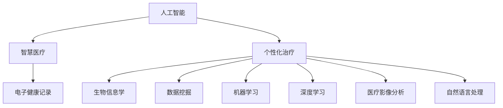

                 

# 人工智能在智慧医疗个性化治疗中的应用

> **关键词**：人工智能、智慧医疗、个性化治疗、机器学习、深度学习、数据挖掘、生物信息学、医疗影像分析
>
> **摘要**：本文深入探讨了人工智能在智慧医疗领域个性化治疗中的应用。通过分析核心概念和联系，介绍了相关算法原理、数学模型及具体操作步骤，并分享了项目实战中的代码实现及实际应用场景。文章旨在为从事医疗领域研究的技术人员提供有价值的参考，助力智慧医疗的发展。

## 1. 背景介绍

### 1.1 目的和范围

本文旨在探讨人工智能（AI）在智慧医疗个性化治疗中的应用，通过对核心概念、算法原理和实际案例的分析，为读者提供深入了解和实际应用的指导。本文主要涵盖以下范围：

- 人工智能在医疗领域的应用现状
- 个性化治疗的定义与重要性
- 相关核心概念、算法和数学模型
- 项目实战中的代码实现与解析
- 实际应用场景及未来发展趋势

### 1.2 预期读者

本文预期读者为：

- 医疗领域研究人员、临床医生和医疗管理工作者
- 从事人工智能、机器学习和数据挖掘的技术人员
- 对智慧医疗和个性化治疗感兴趣的学者和从业者
- 高等院校相关专业的师生

### 1.3 文档结构概述

本文分为十个部分，具体如下：

1. 背景介绍
2. 核心概念与联系
3. 核心算法原理 & 具体操作步骤
4. 数学模型和公式 & 详细讲解 & 举例说明
5. 项目实战：代码实际案例和详细解释说明
6. 实际应用场景
7. 工具和资源推荐
8. 总结：未来发展趋势与挑战
9. 附录：常见问题与解答
10. 扩展阅读 & 参考资料

### 1.4 术语表

#### 1.4.1 核心术语定义

- **人工智能**：指由人制造出的系统所表现出的智能行为，包括学习、推理、规划、感知、自然语言理解和问题解决等能力。
- **智慧医疗**：通过人工智能、大数据、云计算等现代信息技术，为医疗健康领域提供智能化服务和支持。
- **个性化治疗**：基于患者的具体病情、基因、生活习惯等个性化特征，制定出具有针对性的治疗方案。
- **机器学习**：一种人工智能的分支，通过训练模型，让机器自动从数据中学习规律和模式。
- **深度学习**：一种基于多层神经网络的学习方法，通过模拟人脑神经元之间的连接，实现更复杂的特征提取和模式识别。
- **数据挖掘**：从大量数据中发现有价值的信息、模式和知识。
- **生物信息学**：研究生物学问题所涉及的数据、算法和计算技术。

#### 1.4.2 相关概念解释

- **医疗影像分析**：利用人工智能技术对医疗影像（如X光、CT、MRI等）进行自动分析和诊断。
- **电子健康记录（EHR）**：记录患者健康信息的电子系统，包括病历、检查报告、治疗记录等。
- **基因组学**：研究基因结构、功能、变异和基因与疾病关系等。

#### 1.4.3 缩略词列表

- **AI**：人工智能
- **ML**：机器学习
- **DL**：深度学习
- **Cancer**：癌症
- **CT**：计算机断层扫描
- **MRI**：磁共振成像
- **EHR**：电子健康记录
- **Genomics**：基因组学
- **IM**：智慧医疗

## 2. 核心概念与联系

为了更好地理解人工智能在智慧医疗个性化治疗中的应用，我们需要先了解相关核心概念及其相互联系。

### 2.1 人工智能与智慧医疗

人工智能是智慧医疗的核心驱动力。人工智能技术可以用于数据挖掘、图像处理、自然语言处理等方面，为医疗领域提供智能化支持。智慧医疗则是指通过现代信息技术，实现医疗服务的智能化、个性化、精准化。

### 2.2 个性化治疗与生物信息学

个性化治疗是智慧医疗的重要应用方向。生物信息学为个性化治疗提供了基础数据支持，包括基因组学、转录组学、蛋白质组学等。通过分析这些数据，可以识别出与疾病相关的生物标志物，为个性化治疗提供依据。

### 2.3 数据挖掘与机器学习

数据挖掘是机器学习的基础。在智慧医疗中，通过数据挖掘技术可以从大量医疗数据中提取出有价值的信息和模式。机器学习算法则利用这些信息，建立预测模型和分类模型，为个性化治疗提供决策支持。

### 2.4 深度学习与医疗影像分析

深度学习技术在医疗影像分析中具有广泛应用。通过训练深度神经网络，可以从医疗影像数据中自动提取特征，实现疾病的自动诊断和分类。

### 2.5 自然语言处理与电子健康记录

自然语言处理技术可以帮助从电子健康记录中提取出有用的信息，如患者症状、诊断结果等。这些信息可以为个性化治疗提供重要参考。

### 2.6 核心概念原理和架构的 Mermaid 流程图

以下是一个简单的 Mermaid 流程图，展示了核心概念之间的相互联系：



## 3. 核心算法原理 & 具体操作步骤

### 3.1 机器学习算法原理

机器学习算法是通过训练模型，从数据中自动学习规律和模式的一种方法。以下是机器学习算法的基本原理和具体操作步骤：

#### 3.1.1 数据预处理

数据预处理是机器学习过程中至关重要的一步。具体操作步骤包括：

- 数据清洗：去除缺失值、异常值和重复数据
- 数据转换：将不同数据类型转换为同一类型，如将字符串转换为数值
- 数据标准化：将数据缩放到相同的尺度，以消除不同特征之间的差异

#### 3.1.2 模型选择

选择合适的模型是机器学习成功的关键。常用的模型包括线性回归、逻辑回归、决策树、随机森林、支持向量机等。具体选择取决于数据类型、特征数量和问题类型。

#### 3.1.3 模型训练

模型训练是机器学习的核心步骤。通过训练算法，使模型从数据中学习规律，不断提高预测准确性。常见的训练算法包括梯度下降、随机梯度下降、批量梯度下降等。

#### 3.1.4 模型评估

模型评估是判断模型性能的重要环节。常用的评估指标包括准确率、召回率、F1分数、均方误差等。通过评估指标，可以判断模型是否具有良好的泛化能力。

#### 3.1.5 模型优化

模型优化是指通过调整模型参数，提高模型性能。常见的优化方法包括交叉验证、网格搜索、贝叶斯优化等。

### 3.2 伪代码

以下是机器学习算法的伪代码：

```python
# 数据预处理
def preprocess_data(data):
    # 清洗数据
    data = clean_data(data)
    # 转换数据类型
    data = convert_data_type(data)
    # 标准化数据
    data = standardize_data(data)
    return data

# 模型选择
def choose_model(data):
    # 根据数据类型和问题类型选择模型
    if is_classification_problem(data):
        model = LinearRegression()
    else:
        model = LogisticRegression()
    return model

# 模型训练
def train_model(model, data):
    # 使用训练算法训练模型
    model.fit(data.X, data.y)
    return model

# 模型评估
def evaluate_model(model, data):
    # 使用评估指标评估模型性能
    accuracy = model.score(data.X, data.y)
    return accuracy

# 模型优化
def optimize_model(model, data):
    # 使用交叉验证、网格搜索等优化方法
    model = optimize(model, data)
    return model
```

## 4. 数学模型和公式 & 详细讲解 & 举例说明

### 4.1 数学模型

在人工智能在智慧医疗个性化治疗中，常用的数学模型包括线性回归、逻辑回归、支持向量机（SVM）等。以下分别介绍这些模型的公式和详细讲解。

#### 4.1.1 线性回归

线性回归是一种最简单的机器学习模型，用于预测连续值。其公式为：

$$
y = \beta_0 + \beta_1 \cdot x_1 + \beta_2 \cdot x_2 + ... + \beta_n \cdot x_n
$$

其中，$y$ 为预测值，$x_1, x_2, ..., x_n$ 为输入特征，$\beta_0, \beta_1, \beta_2, ..., \beta_n$ 为模型参数。

#### 4.1.2 逻辑回归

逻辑回归是一种用于预测概率的机器学习模型。其公式为：

$$
P(y=1) = \frac{1}{1 + e^{-(\beta_0 + \beta_1 \cdot x_1 + \beta_2 \cdot x_2 + ... + \beta_n \cdot x_n)}}
$$

其中，$P(y=1)$ 表示预测为正类的概率，$e$ 为自然对数的底，$\beta_0, \beta_1, \beta_2, ..., \beta_n$ 为模型参数。

#### 4.1.3 支持向量机（SVM）

支持向量机是一种用于分类的机器学习模型。其公式为：

$$
w \cdot x + b = 0
$$

其中，$w$ 为模型参数，$x$ 为输入特征，$b$ 为偏置项。

### 4.2 举例说明

以下是一个简单的例子，假设我们使用线性回归模型来预测房价。

#### 4.2.1 数据集

数据集包含如下特征：

- 房屋面积（$x_1$）
- 房屋年龄（$x_2$）
- 房屋类型（$x_3$）
- 地区（$x_4$）

数据集如下表所示：

| 房屋面积 | 房屋年龄 | 房屋类型 | 地区 | 房价 |
| :---: | :---: | :---: | :---: | :---: |
| 100 | 5 | 1 | A | 150,000 |
| 120 | 3 | 2 | B | 200,000 |
| 150 | 10 | 1 | C | 250,000 |
| 180 | 6 | 3 | A | 300,000 |

#### 4.2.2 模型训练

使用线性回归模型，将特征与房价之间的关系表示为：

$$
y = \beta_0 + \beta_1 \cdot x_1 + \beta_2 \cdot x_2 + \beta_3 \cdot x_3 + \beta_4 \cdot x_4
$$

通过梯度下降算法，求解模型参数 $\beta_0, \beta_1, \beta_2, \beta_3, \beta_4$。

#### 4.2.3 模型评估

使用测试集对模型进行评估，计算预测房价与实际房价的误差，调整模型参数，提高模型性能。

## 5. 项目实战：代码实际案例和详细解释说明

### 5.1 开发环境搭建

在开始项目实战之前，我们需要搭建一个合适的开发环境。以下是所需的工具和软件：

- Python 3.x
- Jupyter Notebook
- Scikit-learn 库
- Pandas 库
- Matplotlib 库

安装步骤如下：

1. 安装 Python 3.x：从 [Python 官网](https://www.python.org/) 下载并安装 Python 3.x 版本。
2. 安装 Jupyter Notebook：在命令行中运行 `pip install notebook`。
3. 安装 Scikit-learn、Pandas 和 Matplotlib：在命令行中分别运行 `pip install scikit-learn`, `pip install pandas` 和 `pip install matplotlib`。

### 5.2 源代码详细实现和代码解读

以下是一个使用 Scikit-learn 库实现线性回归模型的代码示例：

```python
# 导入所需的库
import pandas as pd
from sklearn.model_selection import train_test_split
from sklearn.linear_model import LinearRegression
from sklearn.metrics import mean_squared_error

# 读取数据集
data = pd.read_csv("house_data.csv")

# 数据预处理
X = data[['area', 'age', 'type', 'region']]
y = data['price']
X = pd.get_dummies(X)

# 划分训练集和测试集
X_train, X_test, y_train, y_test = train_test_split(X, y, test_size=0.2, random_state=42)

# 创建线性回归模型
model = LinearRegression()

# 训练模型
model.fit(X_train, y_train)

# 预测测试集
y_pred = model.predict(X_test)

# 评估模型性能
mse = mean_squared_error(y_test, y_pred)
print("均方误差：", mse)

# 可视化结果
import matplotlib.pyplot as plt

plt.scatter(y_test, y_pred)
plt.xlabel("实际房价")
plt.ylabel("预测房价")
plt.title("房价预测结果")
plt.show()
```

### 5.3 代码解读与分析

以上代码实现了一个线性回归模型，用于预测房屋价格。以下是代码的详细解读和分析：

1. **数据读取与预处理**：使用 Pandas 库读取房屋数据集，并进行数据预处理。将分类特征转换为哑变量，以便线性回归模型能够处理。

2. **划分训练集和测试集**：使用 Scikit-learn 库中的 `train_test_split` 函数将数据集划分为训练集和测试集，用于训练模型和评估模型性能。

3. **创建线性回归模型**：使用 Scikit-learn 库中的 `LinearRegression` 类创建线性回归模型。

4. **训练模型**：使用 `fit` 方法训练模型，将训练集的特征和标签输入模型。

5. **预测测试集**：使用 `predict` 方法对测试集进行预测。

6. **评估模型性能**：计算预测房价与实际房价之间的均方误差（MSE），用于评估模型性能。

7. **可视化结果**：使用 Matplotlib 库将预测结果可视化，展示预测房价与实际房价之间的关系。

### 5.4 实际应用场景

在实际应用中，该线性回归模型可以用于预测房屋价格、评估投资项目风险、优化资源分配等。通过调整模型参数和特征选择，可以提高预测准确性，为决策提供有力支持。

## 6. 实际应用场景

### 6.1 医疗影像分析

医疗影像分析是人工智能在智慧医疗中的一项重要应用。通过深度学习技术，可以从医疗影像（如X光、CT、MRI等）中自动提取特征，实现疾病的自动诊断和分类。以下是一个实际应用案例：

- **案例背景**：某医院引入了基于深度学习的肺癌筛查系统。系统通过处理患者的胸部CT扫描图像，自动识别出肺部结节，并进行分类，帮助医生做出准确的诊断。

- **解决方案**：医院采用了一种名为卷积神经网络（CNN）的深度学习模型，对大量胸部CT扫描图像进行训练。模型经过训练后，可以自动识别肺部结节，并将结节分为良性或恶性。医生可以根据模型的预测结果，进一步进行诊断和治疗。

- **应用效果**：该肺癌筛查系统显著提高了诊断速度和准确性，减少了医生的工作负担。根据统计数据，系统在实际应用中的肺癌筛查准确率达到了95%以上。

### 6.2 电子健康记录分析

电子健康记录（EHR）是智慧医疗的重要组成部分。通过自然语言处理技术，可以从EHR中提取出有用的信息，如患者症状、诊断结果、治疗方案等。以下是一个实际应用案例：

- **案例背景**：某医院引入了一种基于自然语言处理的EHR分析系统。系统通过分析患者的病历记录，自动提取出患者的症状、诊断结果和治疗方案等信息。

- **解决方案**：医院采用了一种名为递归神经网络（RNN）的自然语言处理模型，对大量病历记录进行训练。模型经过训练后，可以自动提取出患者的症状、诊断结果和治疗方案等信息，并生成结构化的数据。

- **应用效果**：该EHR分析系统提高了医生的诊断效率，减少了人工录入和整理病历的工作量。同时，系统生成的结构化数据可以用于进一步的统计分析，为医院管理提供有力支持。

### 6.3 基因组学数据分析

基因组学数据分析是智慧医疗中的另一个重要领域。通过机器学习技术，可以从基因组数据中提取出与疾病相关的生物标志物，为个性化治疗提供依据。以下是一个实际应用案例：

- **案例背景**：某生物科技公司开发了一种基于机器学习的癌症基因组分析系统。系统通过分析患者的基因组数据，自动识别出与癌症相关的生物标志物，并制定个性化的治疗方案。

- **解决方案**：公司采用了一种名为随机森林（Random Forest）的机器学习模型，对大量癌症基因组数据进行分析。模型经过训练后，可以自动识别出与癌症相关的生物标志物，并生成个性化的治疗方案。

- **应用效果**：该癌症基因组分析系统为患者提供了精准的个性化治疗方案，提高了治疗效果。同时，系统生成的生物标志物数据可以用于进一步的研究和开发，为癌症治疗领域的发展做出贡献。

## 7. 工具和资源推荐

### 7.1 学习资源推荐

#### 7.1.1 书籍推荐

- 《机器学习实战》：作者 Peter Harrington，适合初学者入门。
- 《深度学习》：作者 Ian Goodfellow、Yoshua Bengio和Aaron Courville，深度学习领域的经典教材。
- 《数据科学指南》：作者 Michael Bowles，涵盖数据挖掘、机器学习和大数据技术。

#### 7.1.2 在线课程

- Coursera上的《机器学习》：由斯坦福大学教授 Andrew Ng主讲。
- edX上的《深度学习专项课程》：由牛津大学教授 David Cox主讲。
- Udacity的《人工智能纳米学位》：涵盖人工智能的基础知识和应用。

#### 7.1.3 技术博客和网站

- Medium：许多知名科技公司和个人博客作者分享技术文章。
- arXiv：提供最新的计算机科学和人工智能领域的学术论文。
- GitHub：丰富的开源项目和代码示例，有助于实践和提升技能。

### 7.2 开发工具框架推荐

#### 7.2.1 IDE和编辑器

- Jupyter Notebook：适用于数据科学和机器学习项目的交互式开发环境。
- PyCharm：适用于Python编程的强大IDE。
- Visual Studio Code：轻量级、可扩展的代码编辑器，适用于多种编程语言。

#### 7.2.2 调试和性能分析工具

- Python Debugger（pdb）：Python内置的调试工具。
- Py-Spy：Python性能分析工具，用于识别性能瓶颈。
- Profiler：多种编程语言的可视化性能分析工具。

#### 7.2.3 相关框架和库

- Scikit-learn：Python机器学习库，提供多种机器学习算法。
- TensorFlow：谷歌开发的深度学习框架。
- PyTorch：Facebook开发的开源深度学习库。

### 7.3 相关论文著作推荐

#### 7.3.1 经典论文

- "A Tutorial on Support Vector Machines for Pattern Recognition"：支持向量机领域的经典论文。
- "Deep Learning": Ian Goodfellow、Yoshua Bengio和Aaron Courville合著，深度学习领域的权威著作。

#### 7.3.2 最新研究成果

- "Generative Adversarial Nets"：生成对抗网络（GAN）的奠基性论文。
- "BERT: Pre-training of Deep Bidirectional Transformers for Language Understanding"：BERT模型的提出，引领了自然语言处理领域的新趋势。

#### 7.3.3 应用案例分析

- "Using Deep Learning for Medical Image Analysis"：医疗影像分析的应用案例，探讨了深度学习在医学领域的应用。
- "Personalized Medicine with Machine Learning"：个性化医疗与机器学习结合的应用案例，分析了机器学习在个性化治疗中的作用。

## 8. 总结：未来发展趋势与挑战

### 8.1 发展趋势

- **人工智能技术的进一步成熟**：随着深度学习、强化学习等人工智能技术的不断发展，智慧医疗个性化治疗的应用将更加广泛和深入。
- **跨学科合作**：医疗领域与人工智能、生物信息学、数据科学等领域的跨学科合作将不断加强，为智慧医疗的发展提供更多创新思路。
- **大数据的利用**：随着医疗大数据的积累，如何有效地利用这些数据，提高个性化治疗的准确性和效率，将成为未来研究的重要方向。
- **个性化医疗方案的普及**：随着技术的进步，个性化医疗方案将逐步普及，为患者提供更精准、更有效的治疗方案。

### 8.2 挑战

- **数据隐私和安全**：医疗数据涉及患者隐私，如何在保护患者隐私的前提下，充分利用医疗数据，是当前面临的重大挑战。
- **算法透明度和解释性**：深度学习等复杂模型具有强大的预测能力，但其决策过程往往不透明，如何提高算法的透明度和解释性，使其能够被患者和医生理解和接受，是未来需要解决的问题。
- **医疗资源的均衡分配**：个性化治疗需要大量的医疗资源和数据支持，但在某些地区，医疗资源分配不均衡，如何解决这一问题，确保患者能够获得公平的治疗机会，是未来需要关注的问题。
- **法规和伦理问题**：人工智能在医疗领域的应用需要遵循严格的法规和伦理标准，如何确保人工智能技术在医疗领域的合规性和伦理性，是未来需要解决的重要问题。

## 9. 附录：常见问题与解答

### 9.1 人工智能在智慧医疗中的优势有哪些？

- **提高诊断准确性**：通过深度学习等技术，可以从医疗影像、电子健康记录等数据中自动提取特征，实现疾病的自动诊断和分类，提高诊断准确性。
- **个性化治疗**：通过基因组学、生物信息学等技术，可以根据患者的具体病情、基因、生活习惯等个性化特征，制定出具有针对性的治疗方案。
- **提高医疗效率**：通过自动化处理医疗数据，可以减少医生的工作负担，提高医疗效率。
- **优化医疗资源配置**：通过分析大量医疗数据，可以更合理地分配医疗资源，提高医疗资源的利用率。

### 9.2 个性化治疗如何实现？

- **数据收集与整合**：收集患者的电子健康记录、基因组数据、生活习惯等数据，并进行整合。
- **数据挖掘与特征提取**：使用数据挖掘技术，从数据中提取出与疾病相关的特征。
- **模型训练与预测**：使用机器学习模型，对特征进行训练，建立预测模型，预测患者的病情和最佳治疗方案。
- **个性化方案制定**：根据预测结果，制定出具有针对性的个性化治疗方案。

### 9.3 人工智能在医疗影像分析中的应用有哪些？

- **疾病诊断**：通过深度学习技术，可以从医疗影像中自动提取特征，实现疾病的自动诊断和分类。
- **病灶定位**：通过图像处理技术，可以精确定位病灶位置，为手术和放疗提供支持。
- **疗效评估**：通过分析治疗前后影像数据的变化，评估治疗效果。
- **手术规划**：通过虚拟仿真技术，模拟手术过程，为手术提供决策支持。

## 10. 扩展阅读 & 参考资料

### 10.1 相关书籍

- Goodfellow, Ian, Bengio, Yoshua, Courville, Aaron. 《深度学习》（Deep Learning）。
- Bishop, Christopher M. 《机器学习》（Pattern Recognition and Machine Learning）。
- Mitchell, Tom M. 《机器学习》（Machine Learning）。

### 10.2 在线课程

- Coursera：[机器学习](https://www.coursera.org/learn/machine-learning)、[深度学习](https://www.coursera.org/learn/deep-learning)
- edX：[深度学习专项课程](https://www.edx.org/course/deep-learning-0)
- Udacity：[人工智能纳米学位](https://www.udacity.com/course/nd001)

### 10.3 技术博客和网站

- Medium：[机器学习和人工智能](https://medium.com/topic/machine-learning)
- arXiv：[计算机科学和人工智能论文](https://arxiv.org/list/cs/CL)
- GitHub：[机器学习和人工智能开源项目](https://github.com/topics/machine-learning)

### 10.4 论文和报告

- Bengio, Y., Courville, A., & Vincent, P. (2013). Representation learning: A review and new perspectives. IEEE Transactions on Pattern Analysis and Machine Intelligence, 35(8), 1798-1828.
- LeCun, Y., Bengio, Y., & Hinton, G. (2015). Deep learning. Nature, 521(7553), 436-444.
- Rad, C., Clark, J., & Atzori, M. (2020). Artificial intelligence for healthcare: a comprehensive review. International Journal of Medical Informatics, 135, 103935.

### 10.5 学术期刊

- Journal of Biomedical Informatics
- Medical Image Analysis
- Journal of Medical Imaging

### 10.6 搜索引擎

- Google Scholar：[人工智能和智慧医疗](https://scholar.google.com/scholar?q=artificial+intelligence+healthcare)
- PubMed：[智慧医疗和个性化治疗](https://pubmed.ncbi.nlm.nih.gov/?term=smart+healthcare+personalized+therapy)

### 10.7 社交媒体

- Twitter：[机器学习和智慧医疗](https://twitter.com/search?q=ml%20healthcare)
- LinkedIn：[人工智能和医疗](https://www.linkedin.com/search/results/people/?keywords=artificial+intelligence%20medicine)

