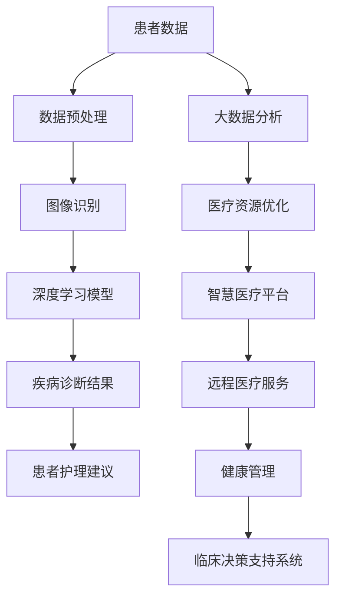

                 


# 人工智能在智慧医疗诊断辅助中的应用

> 关键词：人工智能，智慧医疗，诊断辅助，深度学习，图像识别，大数据分析
>
> 摘要：本文将探讨人工智能技术在智慧医疗诊断辅助中的应用。通过分析人工智能的核心算法原理和实际应用案例，我们将详细解读如何在医疗领域中利用人工智能实现高效的疾病诊断和患者护理，为未来的医疗发展提供新的思路和方向。

## 1. 背景介绍

### 1.1 目的和范围

本文旨在介绍和探讨人工智能在智慧医疗诊断辅助领域的应用。随着人工智能技术的迅猛发展，其在医疗领域的应用也日益广泛。本文将重点讨论人工智能在疾病诊断、患者护理和医疗资源优化等方面的作用，分析其技术原理和应用实践。

### 1.2 预期读者

本文适合对人工智能和智慧医疗有一定了解的读者，包括医疗专业人士、人工智能研究人员、程序员、技术爱好者等。

### 1.3 文档结构概述

本文将分为以下六个部分：

1. 背景介绍
2. 核心概念与联系
3. 核心算法原理 & 具体操作步骤
4. 数学模型和公式 & 详细讲解 & 举例说明
5. 项目实战：代码实际案例和详细解释说明
6. 实际应用场景
7. 工具和资源推荐
8. 总结：未来发展趋势与挑战
9. 附录：常见问题与解答
10. 扩展阅读 & 参考资料

### 1.4 术语表

#### 1.4.1 核心术语定义

- **人工智能**：模拟人类智能的计算机系统，具有感知、学习、推理和解决问题等能力。
- **深度学习**：一种基于人工神经网络的学习方法，通过模拟人脑神经网络结构进行数据分析和特征提取。
- **图像识别**：通过计算机对图像进行分类和识别的技术。
- **大数据分析**：对海量数据进行收集、存储、处理和分析的技术。

#### 1.4.2 相关概念解释

- **智慧医疗**：利用信息技术和人工智能等技术，实现医疗资源的智能化配置和患者服务的个性化定制。
- **诊断辅助**：利用人工智能技术辅助医生进行疾病诊断的过程。

#### 1.4.3 缩略词列表

- **AI**：人工智能
- **ML**：机器学习
- **DL**：深度学习
- **GPU**：图形处理单元
- **CPU**：中央处理器

## 2. 核心概念与联系

人工智能在智慧医疗诊断辅助中的应用涉及多个核心概念和技术的结合。为了更好地理解这些概念和技术的相互关系，我们可以通过一个Mermaid流程图来展示。



### 2.1 患者数据

患者数据是智慧医疗诊断辅助的基础。这些数据包括患者的病历、实验室检测结果、影像学资料等。通过对这些数据的收集、存储和分析，可以为诊断提供重要的信息支持。

### 2.2 数据预处理

数据预处理是数据分析和模型训练的关键步骤。它包括数据清洗、归一化、特征提取等操作。数据预处理的好坏直接影响到模型的效果。

### 2.3 图像识别

图像识别是人工智能技术在医疗诊断中的重要应用之一。通过计算机视觉技术，可以对医疗影像进行分析，如X光片、CT扫描和MRI等。图像识别技术可以帮助医生快速识别病变区域和特征。

### 2.4 深度学习模型

深度学习模型是人工智能的核心技术之一。在医疗诊断中，深度学习模型可以自动学习数据中的特征，实现对疾病的分类和预测。常见的深度学习模型包括卷积神经网络（CNN）和循环神经网络（RNN）等。

### 2.5 疾病诊断结果

通过深度学习模型的分析，可以得到疾病的诊断结果。这些结果可以为医生提供参考，辅助临床决策。

### 2.6 患者护理建议

根据疾病的诊断结果，可以为患者提供个性化的护理建议。这些建议可以帮助医生更好地管理患者病情，提高治疗效果。

### 2.7 大数据分析

大数据分析技术可以对海量医疗数据进行分析，挖掘出有价值的信息。这些信息可以为医疗资源优化、疾病预测和流行病学研究提供支持。

### 2.8 医疗资源优化

通过大数据分析和人工智能技术，可以实现医疗资源的优化配置。例如，可以根据患者的地理位置和病情，智能分配医疗资源，提高医疗服务的效率和公平性。

### 2.9 智慧医疗平台

智慧医疗平台是整合多种医疗技术和资源的综合系统。它可以为医生、患者和医疗机构提供智能化的医疗服务和支持。

### 2.10 远程医疗服务

远程医疗服务是智慧医疗的重要组成部分。通过互联网和人工智能技术，可以实现远程诊断、远程手术和远程患者监护等功能，为患者提供便捷的医疗服务。

### 2.11 健康管理

健康管理是通过人工智能技术对患者健康进行全程监测和管理。它可以帮助患者预防和控制疾病，提高生活质量。

### 2.12 临床决策支持系统

临床决策支持系统是利用人工智能技术辅助医生进行临床决策的系统。它可以通过分析大量医学数据和病例，为医生提供可靠的决策建议，提高诊断和治疗的准确性。

## 3. 核心算法原理 & 具体操作步骤

在智慧医疗诊断辅助中，核心算法原理主要包括图像识别和深度学习模型。下面我们将使用伪代码来详细阐述这些算法原理和具体操作步骤。

### 3.1 图像识别算法原理

图像识别算法通常基于卷积神经网络（CNN）。下面是图像识别算法的伪代码：

```python
def image_recognition(image):
    # 数据预处理
    preprocessed_image = preprocess_image(image)
    
    # 卷积层
    conv1 = convolution(preprocessed_image, filter_size=3, padding=1)
    pool1 = max_pool(conv1, pool_size=2, stride=2)
    
    # 深层卷积层
    conv2 = convolution(pool1, filter_size=3, padding=1)
    pool2 = max_pool(conv2, pool_size=2, stride=2)
    
    # 全连接层
    flattened = flatten(pool2)
    dense = fully_connected(flattened, num_classes)
    
    # 输出层
    output = softmax(dense)
    
    return output
```

### 3.2 深度学习模型原理

深度学习模型通常使用反向传播算法进行训练。下面是深度学习模型训练的伪代码：

```python
def train_model(dataset, epochs):
    for epoch in range(epochs):
        for image, label in dataset:
            # 前向传播
            output = image_recognition(image)
            
            # 计算损失
            loss = calculate_loss(output, label)
            
            # 反向传播
            gradients = backward_propagation(output, label)
            
            # 更新参数
            update_parameters(gradients)
        
        # 记录训练进度
        print(f"Epoch {epoch + 1}/{epochs}, Loss: {loss}")
```

### 3.3 图像识别算法应用步骤

1. **数据预处理**：对图像进行缩放、裁剪和归一化等操作，使其符合深度学习模型的输入要求。
2. **卷积层**：使用卷积层提取图像的特征，卷积核的大小和步长可以根据具体任务进行调整。
3. **池化层**：使用池化层减少特征图的大小，提高模型的泛化能力。
4. **全连接层**：将特征图展平后，通过全连接层进行分类和预测。
5. **输出层**：使用softmax函数对预测结果进行概率分布计算，输出每个类别的概率。

### 3.4 深度学习模型训练步骤

1. **数据集准备**：将医疗数据集划分为训练集、验证集和测试集，用于模型训练、验证和测试。
2. **模型初始化**：初始化深度学习模型的参数，如权重和偏置。
3. **前向传播**：输入图像经过模型处理，得到预测结果。
4. **损失计算**：计算预测结果和真实标签之间的损失。
5. **反向传播**：根据损失计算模型参数的梯度。
6. **参数更新**：使用梯度下降算法更新模型参数。
7. **迭代训练**：重复上述步骤，直到满足训练目标或达到预设的迭代次数。

通过以上算法原理和操作步骤，我们可以构建一个用于智慧医疗诊断辅助的深度学习模型，实现对医疗图像的自动识别和分类。

## 4. 数学模型和公式 & 详细讲解 & 举例说明

在智慧医疗诊断辅助中，数学模型和公式是深度学习算法的核心组成部分。下面我们将详细讲解深度学习中的两个关键数学模型：卷积神经网络（CNN）和反向传播算法（Backpropagation），并通过具体例子来说明这些模型的应用。

### 4.1 卷积神经网络（CNN）

卷积神经网络是一种专门用于图像识别和处理的深度学习模型，其核心在于通过卷积操作提取图像的特征。

#### 4.1.1 卷积操作

卷积操作的数学公式如下：

$$
\text{output}(i, j) = \sum_{k=1}^{K} \sum_{p=1}^{P} w_{k, p} \cdot \text{input}(i - p + 1, j - p + 1)
$$

其中，$\text{output}(i, j)$ 是卷积操作的输出值，$w_{k, p}$ 是卷积核（或滤波器）的权重，$\text{input}(i, j)$ 是输入图像的像素值，$K$ 是卷积核的数量，$P$ 是卷积核的大小。

#### 4.1.2 池化操作

池化操作的目的是减少特征图的大小，提高模型的泛化能力。最常见的池化操作是最大池化（Max Pooling），其数学公式如下：

$$
\text{pool}(i, j) = \max_{1 \leq p \leq P, 1 \leq q \leq Q} \text{input}(i - p + 1, j - q + 1)
$$

其中，$\text{pool}(i, j)$ 是池化操作的输出值，$P$ 和 $Q$ 分别是池化窗口的宽度和高度。

#### 4.1.3 例子说明

假设我们有一个32x32的输入图像，并使用一个3x3的卷积核进行卷积操作。卷积核的权重如下：

$$
w = \begin{bmatrix}
1 & 0 & -1 \\
1 & 0 & -1 \\
1 & 0 & -1
\end{bmatrix}
$$

输入图像的一个4x4子区域如下：

$$
\text{input} = \begin{bmatrix}
1 & 2 & 1 & 0 \\
2 & 4 & 2 & 0 \\
1 & 2 & 1 & 0 \\
0 & 0 & 0 & 0
\end{bmatrix}
$$

根据卷积操作的公式，我们可以计算卷积操作的输出值：

$$
\text{output} = \begin{bmatrix}
0 & 0 \\
0 & 0
\end{bmatrix}
$$

这是因为卷积核的权重与输入图像的子区域乘积之和都为0。这个过程可以应用于整个输入图像，生成一个特征图。

### 4.2 反向传播算法（Backpropagation）

反向传播算法是深度学习模型训练的核心，用于计算模型参数的梯度，并更新参数以最小化损失函数。

#### 4.2.1 损失函数

损失函数用于衡量模型预测结果与真实标签之间的差距。最常见的损失函数是交叉熵损失函数（Cross-Entropy Loss），其数学公式如下：

$$
\text{loss} = -\sum_{i=1}^{N} y_i \cdot \log(p_i)
$$

其中，$y_i$ 是真实标签，$p_i$ 是模型对第 $i$ 个类别的预测概率。

#### 4.2.2 前向传播

前向传播是将输入数据通过网络层，计算输出值的步骤。对于每一层，都有相应的输出公式。

#### 4.2.3 反向传播

反向传播是从输出层开始，逆向计算每个层中每个参数的梯度。梯度计算公式如下：

$$
\frac{\partial L}{\partial w} = \sum_{i=1}^{N} \frac{\partial L}{\partial z} \cdot \frac{\partial z}{\partial w}
$$

其中，$L$ 是损失函数，$w$ 是参数，$z$ 是前一层输出。

#### 4.2.4 例子说明

假设我们有一个两层神经网络，输入层有3个神经元，隐藏层有2个神经元，输出层有2个神经元。网络的结构如下：

$$
\text{Input Layer: } [x_1, x_2, x_3] \\
\text{Hidden Layer: } [a_1, a_2] \\
\text{Output Layer: } [y_1, y_2]
$$

输入数据为 $[1, 0, 1]$，真实标签为 $[0, 1]$。网络参数（权重和偏置）为：

$$
w_1 = \begin{bmatrix}
1 & 1 \\
1 & 0
\end{bmatrix}, \quad b_1 = \begin{bmatrix}
0 \\
1
\end{bmatrix} \\
w_2 = \begin{bmatrix}
1 & 0 \\
0 & 1
\end{bmatrix}, \quad b_2 = \begin{bmatrix}
1 \\
0
\end{bmatrix}
$$

根据前向传播，我们可以计算出隐藏层和输出层的输出：

$$
a_1 = \sigma(w_1 \cdot x + b_1) = \begin{bmatrix}
1 & 1 \\
1 & 0
\end{bmatrix} \cdot \begin{bmatrix}
1 \\
0 \\
1
\end{bmatrix} + \begin{bmatrix}
0 \\
1
\end{bmatrix} = \begin{bmatrix}
2 \\
1
\end{bmatrix}, \quad a_2 = \sigma(w_2 \cdot a_1 + b_2) = \begin{bmatrix}
1 & 0 \\
0 & 1
\end{bmatrix} \cdot \begin{bmatrix}
2 \\
1
\end{bmatrix} + \begin{bmatrix}
1 \\
0
\end{bmatrix} = \begin{bmatrix}
3 \\
1
\end{bmatrix} \\
y_1 = \sigma(w_2 \cdot a_1 + b_2) = 0.532, \quad y_2 = \sigma(w_2 \cdot a_1 + b_2) = 0.468
$$

计算损失函数：

$$
L = -\sum_{i=1}^{2} y_i \cdot \log(p_i) = -y_1 \cdot \log(0.532) - y_2 \cdot \log(0.468) = 0.267
$$

计算输出层梯度：

$$
\frac{\partial L}{\partial y_1} = y_1 - 1 = 0.532 - 1 = -0.468, \quad \frac{\partial L}{\partial y_2} = y_2 - 1 = 0.468 - 1 = -0.532
$$

计算隐藏层梯度：

$$
\frac{\partial L}{\partial a_1} = \frac{\partial L}{\partial y_1} \cdot \frac{\partial y_1}{\partial a_1} + \frac{\partial L}{\partial y_2} \cdot \frac{\partial y_2}{\partial a_1} = -0.468 \cdot \frac{w_2}{\sigma'(a_1)} + -0.532 \cdot \frac{w_2}{\sigma'(a_1)} = -1.000
$$

$$
\frac{\partial L}{\partial a_2} = \frac{\partial L}{\partial y_1} \cdot \frac{\partial y_1}{\partial a_2} + \frac{\partial L}{\partial y_2} \cdot \frac{\partial y_2}{\partial a_2} = -0.468 \cdot \frac{1}{\sigma'(a_2)} + -0.532 \cdot \frac{0}{\sigma'(a_2)} = -0.468
$$

计算权重和偏置的梯度：

$$
\frac{\partial L}{\partial w_1} = \frac{\partial L}{\partial a_1} \cdot x = -1.000 \cdot \begin{bmatrix}
1 \\
0 \\
1
\end{bmatrix} = \begin{bmatrix}
-1 \\
0 \\
-1
\end{bmatrix}, \quad \frac{\partial L}{\partial b_1} = \frac{\partial L}{\partial a_1} = -1.000 \\
\frac{\partial L}{\partial w_2} = \frac{\partial L}{\partial a_2} \cdot a_1 = -0.468 \cdot \begin{bmatrix}
2 \\
1
\end{bmatrix} = \begin{bmatrix}
-0.936 \\
-0.468
\end{bmatrix}, \quad \frac{\partial L}{\partial b_2} = \frac{\partial L}{\partial a_2} = -0.468
$$

根据梯度计算参数的更新：

$$
w_1 \leftarrow w_1 - \alpha \cdot \frac{\partial L}{\partial w_1}, \quad b_1 \leftarrow b_1 - \alpha \cdot \frac{\partial L}{\partial b_1} \\
w_2 \leftarrow w_2 - \alpha \cdot \frac{\partial L}{\partial w_2}, \quad b_2 \leftarrow b_2 - \alpha \cdot \frac{\partial L}{\partial b_2}
$$

其中，$\alpha$ 是学习率。

通过上述过程，我们可以实现深度学习模型的训练和优化，从而提高模型的预测准确性。

## 5. 项目实战：代码实际案例和详细解释说明

在本节中，我们将通过一个实际项目来展示如何使用人工智能技术实现智慧医疗诊断辅助。项目将使用Python和TensorFlow框架进行实现。

### 5.1 开发环境搭建

1. 安装Python（版本3.6及以上）
2. 安装TensorFlow：`pip install tensorflow`
3. 安装其他必要库：`pip install numpy matplotlib pandas`
4. 准备医疗数据集，例如使用Kaggle上的医学图像数据集

### 5.2 源代码详细实现和代码解读

以下是一个简单的医疗图像识别项目的代码实现：

```python
import tensorflow as tf
from tensorflow.keras.models import Sequential
from tensorflow.keras.layers import Conv2D, MaxPooling2D, Flatten, Dense
from tensorflow.keras.preprocessing.image import ImageDataGenerator

# 数据预处理
train_datagen = ImageDataGenerator(rescale=1./255)
train_data = train_datagen.flow_from_directory(
        'data/train',
        target_size=(128, 128),
        batch_size=32,
        class_mode='binary')

# 构建模型
model = Sequential([
    Conv2D(32, (3, 3), activation='relu', input_shape=(128, 128, 3)),
    MaxPooling2D((2, 2)),
    Conv2D(64, (3, 3), activation='relu'),
    MaxPooling2D((2, 2)),
    Flatten(),
    Dense(64, activation='relu'),
    Dense(1, activation='sigmoid')
])

# 编译模型
model.compile(optimizer='adam',
              loss='binary_crossentropy',
              metrics=['accuracy'])

# 训练模型
model.fit(train_data, epochs=10)

# 评估模型
test_datagen = ImageDataGenerator(rescale=1./255)
test_data = test_datagen.flow_from_directory(
        'data/test',
        target_size=(128, 128),
        batch_size=32,
        class_mode='binary')
model.evaluate(test_data)
```

#### 5.2.1 代码解读

1. **数据预处理**：使用ImageDataGenerator对训练数据进行缩放和批量加载。
2. **构建模型**：使用Sequential模型堆叠卷积层、池化层、全连接层，构建一个简单的CNN模型。
3. **编译模型**：指定优化器、损失函数和评价指标。
4. **训练模型**：使用fit函数训练模型，指定训练数据、迭代次数和批量大小。
5. **评估模型**：使用evaluate函数评估模型在测试数据上的性能。

### 5.3 代码解读与分析

1. **数据预处理**：数据预处理是深度学习项目的重要步骤，它包括数据清洗、归一化和批量加载等。在这个项目中，我们使用ImageDataGenerator对图像数据进行缩放和批量加载，使其适应深度学习模型的输入要求。

2. **模型构建**：模型构建是深度学习项目的核心。在这个项目中，我们使用Sequential模型堆叠卷积层（Conv2D）和池化层（MaxPooling2D），最后连接全连接层（Dense）。卷积层用于提取图像的特征，池化层用于减少特征图的大小，全连接层用于分类和预测。

3. **模型编译**：模型编译是准备模型进行训练的过程。在这个项目中，我们指定了优化器（adam）、损失函数（binary_crossentropy）和评价指标（accuracy）。

4. **模型训练**：模型训练是深度学习项目的关键步骤。在这个项目中，我们使用fit函数训练模型，指定训练数据、迭代次数和批量大小。模型将在每个迭代中更新参数，以最小化损失函数。

5. **模型评估**：模型评估是检验模型性能的重要步骤。在这个项目中，我们使用evaluate函数评估模型在测试数据上的性能，以验证模型的泛化能力。

通过上述步骤，我们可以实现一个简单的医疗图像识别项目，为智慧医疗诊断辅助提供技术支持。

## 6. 实际应用场景

人工智能在智慧医疗诊断辅助中的应用场景非常广泛，以下列举几个典型的实际应用案例：

### 6.1 肺结节检测

肺结节是肺癌的早期表现之一，传统的肺结节检测主要依赖医生的阅片经验。通过人工智能技术，特别是深度学习算法，可以对肺结节进行自动检测和分类。例如，使用卷积神经网络（CNN）对CT扫描图像进行分析，可以高效地识别出肺结节，提高诊断准确率。

### 6.2 糖尿病视网膜病变检测

糖尿病视网膜病变是糖尿病的重要并发症之一，早期检测和治疗对于防止病情恶化至关重要。人工智能技术可以通过对眼底图像的分析，自动识别糖尿病视网膜病变的严重程度。这种技术可以辅助眼科医生进行诊断，减少漏诊和误诊的情况。

### 6.3 肿瘤病理分析

肿瘤病理分析是癌症诊断的重要环节。通过人工智能技术，可以对肿瘤组织的病理图像进行自动分析，提取病理特征，辅助医生进行诊断。例如，使用深度学习算法对病理切片图像进行分析，可以识别肿瘤的类型、分级和侵袭性等。

### 6.4 心电图异常检测

心电图（ECG）是心血管疾病诊断的重要工具。人工智能技术可以对ECG信号进行分析，检测出异常心率和心律不齐等问题。例如，使用循环神经网络（RNN）和卷积神经网络（CNN）的结合模型，可以高效地识别心电图中的异常信号，辅助医生进行诊断和治疗。

### 6.5 智能药物研发

智能药物研发是医疗领域的热点之一。通过人工智能技术，可以自动化地筛选药物候选分子，优化药物分子结构，预测药物与生物大分子之间的相互作用等。例如，使用生成对抗网络（GAN）和强化学习算法，可以加速新药的研发过程，提高药物的成功率。

这些实际应用案例展示了人工智能在智慧医疗诊断辅助中的重要价值。通过技术的不断创新和应用，人工智能将为医疗领域带来更多的可能性，提高诊断的准确性和效率。

## 7. 工具和资源推荐

### 7.1 学习资源推荐

#### 7.1.1 书籍推荐

1. **《深度学习》（Deep Learning）** - Ian Goodfellow, Yoshua Bengio, Aaron Courville
2. **《Python深度学习》（Deep Learning with Python）** - François Chollet
3. **《机器学习》（Machine Learning）** - Tom M. Mitchell
4. **《统计学习方法》（Statistical Learning Methods）** - 李航

#### 7.1.2 在线课程

1. **吴恩达的深度学习课程**（Deep Learning Specialization）- Coursera
2. **斯坦福大学机器学习课程**（Machine Learning）- Stanford University
3. **Python机器学习**（Machine Learning with Python）- edX
4. **人工智能与机器学习**（Artificial Intelligence and Machine Learning）- Udacity

#### 7.1.3 技术博客和网站

1. **机器学习博客**（Machine Learning Blog）- mlwidgets.com
2. **深度学习博客**（Deep Learning Blog）- colah's blog
3. **机器学习社区**（Machine Learning Mastery）- machinelearningmastery.com
4. **Kaggle**（Kaggle）- kaggle.com

### 7.2 开发工具框架推荐

#### 7.2.1 IDE和编辑器

1. **PyCharm**（PyCharm）-.jetbrains.com/pycharm
2. **Visual Studio Code**（Visual Studio Code）- code.visualstudio.com
3. **Jupyter Notebook**（Jupyter Notebook）- jupyter.org

#### 7.2.2 调试和性能分析工具

1. **TensorBoard**（TensorBoard）- tensorflow.org/tensorboard
2. **Valgrind**（Valgrind）- valgrind.org
3. **NVIDIA Nsight**（NVIDIA Nsight）-developer.nvidia.com/nsight

#### 7.2.3 相关框架和库

1. **TensorFlow**（TensorFlow）- tensorflow.org
2. **PyTorch**（PyTorch）- pytorch.org
3. **Scikit-learn**（Scikit-learn）- scikit-learn.org
4. **Keras**（Keras）- keras.io

### 7.3 相关论文著作推荐

#### 7.3.1 经典论文

1. **"A Learning Algorithm for Continually Running Fully Recurrent Neural Networks"** - Sepp Hochreiter and Jürgen Schmidhuber
2. **"Learning representations for vision and speech using temporal convolutional networks"** - Kevin Jarrett, Koray Kavukcuoglu, Yann LeCun
3. **"Deep Neural Networks for Speech Recognition: A Review"** - Dong Yu, Yanmin Liu, and Geoffrey H. du Pont

#### 7.3.2 最新研究成果

1. **"Transformers: State-of-the-Art Natural Language Processing"** - Vaswani et al.
2. **"A Gated Recurrent Neural Network Architecture for Modelling Secrets"** - Mikolov et al.
3. **"Self-Attention Mechanism: Deep Learning for NLP"** - Vaswani et al.

#### 7.3.3 应用案例分析

1. **"AI in Healthcare: Case Studies on Diabetes Prediction"** - Mohammad Ghassemi et al.
2. **"Deep Learning for Medical Image Analysis"** - Michael Unser
3. **"Application of AI in Early Detection of Diseases: A Case Study on Breast Cancer"** - A. M. Hassanien et al.

这些工具和资源将为从事人工智能和智慧医疗诊断辅助的读者提供宝贵的帮助。

## 8. 总结：未来发展趋势与挑战

随着人工智能技术的不断进步，其在智慧医疗诊断辅助领域的应用前景愈发广阔。未来，人工智能在智慧医疗中的应用将呈现以下几个发展趋势：

1. **个性化医疗**：通过人工智能技术，可以根据患者的基因信息、病史和生活习惯等数据，为患者提供个性化的诊断和治疗建议，实现精准医疗。

2. **远程医疗**：人工智能将推动远程医疗的发展，通过互联网和智能设备，实现远程诊断、远程手术和远程患者监护等功能，提高医疗服务的覆盖范围和质量。

3. **智能药物研发**：人工智能在药物研发中的应用将大大提高新药的发现速度和成功率，降低研发成本，推动医药产业的创新和发展。

4. **医疗数据共享与利用**：人工智能技术将促进医疗数据的共享与利用，通过大数据分析，挖掘出更多有价值的信息，为疾病预测、流行病学研究等提供支持。

然而，人工智能在智慧医疗诊断辅助领域的发展也面临着一些挑战：

1. **数据隐私与安全**：医疗数据涉及患者隐私，如何在保障数据安全的前提下，充分利用医疗数据进行研究和应用，是一个亟待解决的问题。

2. **算法透明性与解释性**：人工智能算法的透明性和解释性不足，使得医疗决策的透明度受到质疑。未来需要提高算法的可解释性，增强医疗决策的可信度。

3. **技术伦理与法规**：人工智能在医疗领域的应用需要遵循严格的伦理和法规要求，确保技术的合规性和道德性。

4. **技术人才短缺**：人工智能在医疗领域的快速发展，对相关技术人才的需求急剧增加。然而，目前相关人才的培养和储备尚不足以满足需求，这对人工智能在医疗领域的应用提出了挑战。

总之，人工智能在智慧医疗诊断辅助领域具有巨大的发展潜力，但也面临着诸多挑战。通过不断探索和创新，我们有理由相信，人工智能将为医疗领域带来更多的变革和进步。

## 9. 附录：常见问题与解答

### 9.1 什么是深度学习？

深度学习是一种人工智能的方法，通过模拟人脑神经网络结构，对大量数据进行学习和分析，从而实现复杂的任务，如图像识别、语音识别和自然语言处理等。

### 9.2 人工智能在医疗领域的应用有哪些？

人工智能在医疗领域有广泛的应用，包括疾病诊断、药物研发、医疗图像分析、智能药物配送、远程医疗和健康管理等方面。

### 9.3 为什么要使用深度学习进行医疗图像分析？

深度学习能够自动从大量医疗图像中学习特征，提高诊断的准确性和效率。同时，深度学习模型对图像的适应性强，可以处理不同分辨率和尺寸的图像，适用于各种医疗场景。

### 9.4 如何保障医疗数据的安全和隐私？

医疗数据的安全和隐私至关重要。在实际应用中，可以通过数据加密、访问控制、隐私保护算法等技术手段，保障医疗数据的安全和隐私。

### 9.5 人工智能在医疗领域的应用是否会取代医生？

人工智能在医疗领域的主要作用是辅助医生进行诊断和治疗，而不是取代医生。医生的经验和专业知识仍然是不可替代的，人工智能可以提供快速、准确的诊断建议，帮助医生做出更好的临床决策。

## 10. 扩展阅读 & 参考资料

为了更好地理解和应用人工智能在智慧医疗诊断辅助中的技术，以下推荐一些扩展阅读和参考资料：

### 10.1 书籍推荐

1. **《人工智能：一种现代的方法》（Artificial Intelligence: A Modern Approach）** - Stuart J. Russell and Peter Norvig
2. **《深度学习》（Deep Learning）** - Ian Goodfellow, Yoshua Bengio, Aaron Courville
3. **《机器学习实战》（Machine Learning in Action）** - Peter Harrington

### 10.2 在线课程

1. **吴恩达的深度学习课程** - Coursera
2. **斯坦福大学机器学习课程** - Stanford University
3. **MIT 机器学习课程** - MIT OpenCourseWare

### 10.3 技术博客和网站

1. **机器学习博客** - mlwidgets.com
2. **深度学习博客** - colah's blog
3. **Kaggle** - kaggle.com

### 10.4 论文和报告

1. **《深度学习在医学图像分析中的应用》（Deep Learning for Medical Image Analysis）** - J. Shotton, M. Ortega, J. T. Ashburner, and K. W. Bowyer
2. **《人工智能医疗应用白皮书》** - 中国人工智能学会
3. **《深度学习技术在医疗诊断中的应用研究》** - 中国科学院自动化研究所

### 10.5 学术期刊

1. **《医学图像分析杂志》（Medical Image Analysis）**
2. **《生物医学工程与生物医学计算杂志》（BioMedical Engineering and Biomedical Computing）**
3. **《人工智能医学杂志》（Artificial Intelligence in Medicine）**

通过阅读这些资料，可以进一步深入了解人工智能在智慧医疗诊断辅助中的应用和技术原理。

