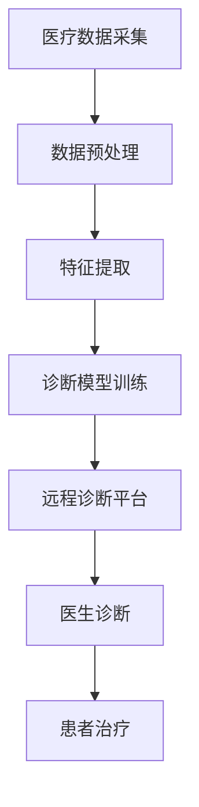

                 

# 人工智能在智慧医疗远程诊断中的应用与挑战

> **关键词：** 智慧医疗、远程诊断、人工智能、深度学习、医疗数据、隐私保护、算法优化。

> **摘要：** 本文将探讨人工智能在智慧医疗远程诊断中的应用及其面临的挑战。通过介绍远程诊断的背景和现状，分析人工智能技术在该领域的核心算法原理和数学模型，并结合实际案例展示其在临床中的应用，最后讨论未来发展趋势和所面临的挑战。

## 1. 背景介绍

### 1.1 目的和范围

本文旨在深入探讨人工智能在智慧医疗远程诊断中的应用，并分析其面临的挑战。智慧医疗是利用信息技术和人工智能技术提升医疗服务质量和效率的领域，而远程诊断作为智慧医疗的重要组成部分，正逐渐改变医疗服务的传统模式。

### 1.2 预期读者

本文适合对人工智能和医疗领域有一定了解的技术人员、医疗专业人士以及对智慧医疗远程诊断感兴趣的研究者。

### 1.3 文档结构概述

本文分为十个部分，首先介绍远程诊断的背景和现状，接着阐述人工智能技术在该领域的核心概念和原理，随后通过实际案例展示其应用，并讨论未来发展趋势和挑战。最后，提供一些相关资源和工具，以便读者进一步学习和研究。

### 1.4 术语表

#### 1.4.1 核心术语定义

- **远程诊断：** 通过远程通信技术，医生在远程地点对患者的病情进行诊断和治疗的医疗服务。
- **人工智能（AI）：** 机器模拟人类智能行为的技术，包括机器学习、深度学习、自然语言处理等。
- **深度学习：** 一种基于多层神经网络的学习方法，能够自动提取特征并进行复杂的数据分析。

#### 1.4.2 相关概念解释

- **医疗数据：** 用于诊断、治疗和预防疾病的数字化信息，包括电子病历、医学影像、实验室检测结果等。
- **隐私保护：** 保护患者个人信息不被未授权访问或泄露的措施。

#### 1.4.3 缩略词列表

- **AI：** 人工智能
- **ML：** 机器学习
- **DL：** 深度学习
- **EMR：** 电子病历
- **RDP：** 远程诊断平台

## 2. 核心概念与联系

为了更好地理解人工智能在智慧医疗远程诊断中的应用，我们首先需要了解其核心概念和相互联系。

### 2.1 智慧医疗远程诊断的核心概念

智慧医疗远程诊断涉及多个核心概念，包括：

1. **医疗数据采集：** 通过电子病历系统、医疗设备传感器等收集患者数据。
2. **数据预处理：** 对采集到的医疗数据进行清洗、归一化等处理，以供机器学习模型使用。
3. **特征提取：** 从预处理后的数据中提取对诊断有帮助的特征。
4. **诊断模型训练：** 使用机器学习算法训练诊断模型，使其能够对患者的病情进行预测和诊断。
5. **远程诊断平台：** 提供远程诊断服务，连接医生和患者。

### 2.2 核心概念之间的联系

核心概念之间的联系可以用以下 Mermaid 流程图表示：



## 3. 核心算法原理 & 具体操作步骤

### 3.1 诊断模型训练

诊断模型是智慧医疗远程诊断的核心，其训练过程如下：

#### 3.1.1 数据集准备

首先，我们需要准备一个包含大量标注数据的训练数据集。数据集应该包括不同类型的疾病和病情，以确保模型的泛化能力。

#### 3.1.2 特征工程

对采集到的医疗数据进行预处理和特征提取，以得到对诊断有帮助的特征。特征提取可以采用统计方法或深度学习方法。

#### 3.1.3 选择合适的模型

根据数据特点和诊断需求，选择合适的机器学习算法。常见的算法包括支持向量机（SVM）、随机森林（RF）、神经网络（NN）等。

#### 3.1.4 模型训练与验证

使用训练数据集训练模型，并通过交叉验证等方法对模型进行验证，以确保模型的准确性和可靠性。

#### 3.1.5 模型优化

根据验证结果，对模型进行调整和优化，以提高诊断准确率。

### 3.2 诊断模型具体操作步骤

以下是使用深度学习算法训练诊断模型的伪代码：

```python
# 伪代码：深度学习诊断模型训练

# 导入相关库
import numpy as np
import tensorflow as tf
from sklearn.model_selection import train_test_split

# 数据集准备
X, y = prepare_data() # X为特征矩阵，y为标签向量

# 数据集划分
X_train, X_test, y_train, y_test = train_test_split(X, y, test_size=0.2, random_state=42)

# 构建神经网络模型
model = build_model()

# 编译模型
model.compile(optimizer='adam', loss='binary_crossentropy', metrics=['accuracy'])

# 训练模型
model.fit(X_train, y_train, epochs=100, batch_size=32, validation_data=(X_test, y_test))

# 评估模型
loss, accuracy = model.evaluate(X_test, y_test)
print(f"Test accuracy: {accuracy:.2f}")
```

## 4. 数学模型和公式 & 详细讲解 & 举例说明

### 4.1 深度学习模型数学公式

深度学习模型通常由多个层组成，每层都包含一系列的数学运算。以下是深度学习模型中常用的数学公式：

$$
z^{(l)} = W^{(l)} \cdot a^{(l-1)} + b^{(l)}
$$

$$
a^{(l)} = \sigma(z^{(l)})
$$

$$
\delta^{(l)} = \frac{\partial J}{\partial a^{(l)}}
$$

$$
\frac{\partial J}{\partial z^{(l)}} = \delta^{(l)} \cdot \sigma'(z^{(l)})
$$

$$
\frac{\partial J}{\partial W^{(l)}} = \sum_{i=1}^{m} \delta^{(l+1)}_i \cdot a^{(l-1)_i}
$$

$$
\frac{\partial J}{\partial b^{(l)}} = \sum_{i=1}^{m} \delta^{(l+1)}_i
$$

其中：

- \(z^{(l)}\) 表示第 \(l\) 层的输出
- \(a^{(l)}\) 表示第 \(l\) 层的激活值
- \(\sigma\) 表示激活函数，如 sigmoid、ReLU 等
- \(\sigma'\) 表示激活函数的导数
- \(\delta^{(l)}\) 表示第 \(l\) 层的误差传播
- \(J\) 表示损失函数
- \(W^{(l)}\) 和 \(b^{(l)}\) 分别表示第 \(l\) 层的权重和偏置

### 4.2 举例说明

假设我们有一个简单的二分类问题，数据集包含 100 个样本，每个样本有 10 个特征。我们使用一个单层神经网络进行训练，激活函数为 sigmoid。

#### 4.2.1 构建模型

```python
import tensorflow as tf

model = tf.keras.Sequential([
    tf.keras.layers.Dense(1, input_shape=(10,), activation='sigmoid')
])
```

#### 4.2.2 编译模型

```python
model.compile(optimizer='adam', loss='binary_crossentropy', metrics=['accuracy'])
```

#### 4.2.3 训练模型

```python
model.fit(X_train, y_train, epochs=100, batch_size=10)
```

#### 4.2.4 评估模型

```python
loss, accuracy = model.evaluate(X_test, y_test)
print(f"Test accuracy: {accuracy:.2f}")
```

## 5. 项目实战：代码实际案例和详细解释说明

### 5.1 开发环境搭建

在开始项目实战之前，我们需要搭建一个合适的开发环境。以下是 Python 开发环境的搭建步骤：

1. 安装 Python：前往 [Python 官网](https://www.python.org/) 下载 Python 安装包，并按照提示安装。
2. 安装 TensorFlow：在命令行中运行以下命令安装 TensorFlow：

```bash
pip install tensorflow
```

3. 安装其他依赖：根据项目需求安装其他相关库，如 NumPy、Pandas 等。

### 5.2 源代码详细实现和代码解读

以下是使用 TensorFlow 框架实现一个简单的远程诊断模型的项目实战代码：

```python
import tensorflow as tf
from sklearn.model_selection import train_test_split
from sklearn.datasets import make_classification
import numpy as np

# 5.2.1 数据集准备
X, y = make_classification(n_samples=100, n_features=10, n_classes=2, random_state=42)
X_train, X_test, y_train, y_test = train_test_split(X, y, test_size=0.2, random_state=42)

# 5.2.2 构建模型
model = tf.keras.Sequential([
    tf.keras.layers.Dense(1, input_shape=(10,), activation='sigmoid')
])

# 5.2.3 编译模型
model.compile(optimizer='adam', loss='binary_crossentropy', metrics=['accuracy'])

# 5.2.4 训练模型
model.fit(X_train, y_train, epochs=100, batch_size=10)

# 5.2.5 评估模型
loss, accuracy = model.evaluate(X_test, y_test)
print(f"Test accuracy: {accuracy:.2f}")
```

#### 5.2.6 代码解读与分析

1. **数据集准备**：使用 `make_classification` 函数生成一个包含 100 个样本、10 个特征和 2 个类别的模拟数据集。通过 `train_test_split` 函数将数据集划分为训练集和测试集。
2. **构建模型**：使用 TensorFlow 的 `Sequential` 模型构建一个简单的单层神经网络，输入层有 10 个神经元，输出层有 1 个神经元，使用 sigmoid 激活函数。
3. **编译模型**：设置模型优化器为 Adam，损失函数为 binary_crossentropy，评价指标为 accuracy。
4. **训练模型**：使用 `fit` 方法训练模型，设置训练轮次为 100，批量大小为 10。
5. **评估模型**：使用 `evaluate` 方法评估模型在测试集上的表现，打印测试准确率。

### 5.3 代码解读与分析

通过上述代码，我们可以看到如何使用 TensorFlow 框架实现一个简单的远程诊断模型。在实际项目中，我们需要根据具体需求调整数据集、模型结构和训练参数。

## 6. 实际应用场景

### 6.1 早期疾病筛查

远程诊断模型可以应用于早期疾病筛查，如肺癌、乳腺癌等。通过分析患者的电子病历和医学影像，模型可以预测患者患病的可能性，帮助医生早期发现疾病，从而提高治疗效果。

### 6.2 心血管疾病风险评估

心血管疾病是导致全球死亡的主要原因之一。远程诊断模型可以结合患者的生理指标（如心率、血压等）和电子病历数据，预测患者患心血管疾病的风险，为医生提供诊断依据。

### 6.3 远程患者监测

对于慢性病患者，远程诊断模型可以实时监测患者的病情变化，如糖尿病患者的血糖水平、高血压患者的血压等。通过远程监测，医生可以及时发现病情变化，调整治疗方案。

## 7. 工具和资源推荐

### 7.1 学习资源推荐

#### 7.1.1 书籍推荐

- 《深度学习》（Ian Goodfellow、Yoshua Bengio、Aaron Courville 著）
- 《Python 机器学习》（Sebastian Raschka 著）
- 《智慧医疗：大数据与人工智能革新医疗》（王俊、李磊 著）

#### 7.1.2 在线课程

- Coursera 上的“机器学习”课程（由 Andrew Ng 教授授课）
- edX 上的“深度学习基础”课程（由 David Socher 教授授课）
- Udacity 上的“数据科学纳米学位”课程

#### 7.1.3 技术博客和网站

-Towards Data Science
- AI 人工智能博客
- AI 科技大本营

### 7.2 开发工具框架推荐

#### 7.2.1 IDE和编辑器

- PyCharm
- Visual Studio Code
- Jupyter Notebook

#### 7.2.2 调试和性能分析工具

- TensorBoard
- Perf.py
- Numba

#### 7.2.3 相关框架和库

- TensorFlow
- PyTorch
- scikit-learn

### 7.3 相关论文著作推荐

#### 7.3.1 经典论文

- "Deep Learning for Healthcare"（N. Srivastava et al., 2017）
- "A Brief Introduction to Neural Networks for Machine Learning"（Y. Bengio, 1998）
- "Artificial Neural Networks: A Tutorial"（S. Haykin, 1994）

#### 7.3.2 最新研究成果

- "Deep Learning for Medical Image Analysis"（M. Miloro et al., 2020）
- "Generative Adversarial Networks for Medical Image Synthesis"（A. Urtasun et al., 2017）
- "Multi-Modal Deep Learning for Medical Image Segmentation"（Z. Wang et al., 2019）

#### 7.3.3 应用案例分析

- "AI in Radiology: Big Data and Deep Learning"（S. F. Franzese et al., 2017）
- "Machine Learning in Medical Diagnosis: Achievements, Limitations and Open Questions"（A. L. A. Mendes et al., 2019）
- "Deep Learning in Medical Imaging: A Review"（J. C. S. Bonilha et al., 2020）

## 8. 总结：未来发展趋势与挑战

### 8.1 未来发展趋势

1. **深度学习算法的优化**：随着计算能力的提升和算法的进步，深度学习算法在医疗领域的应用将越来越广泛。
2. **多模态数据的整合**：结合不同类型的数据（如医学影像、电子病历、生理信号等）进行综合分析，将有助于提高诊断准确率。
3. **远程协作与智能辅助**：远程诊断系统将实现更高效的医生协作和智能辅助，提高医疗服务的质量和效率。

### 8.2 未来挑战

1. **数据隐私与安全**：保护患者隐私是远程诊断面临的主要挑战，需要建立严格的数据安全措施。
2. **算法的透明性与可解释性**：深度学习算法的“黑箱”特性使得其决策过程难以解释，这对临床应用提出了挑战。
3. **标准化与法规**：制定统一的标准和法规，确保远程诊断系统的合法性和有效性。

## 9. 附录：常见问题与解答

### 9.1 人工智能在智慧医疗远程诊断中的优势是什么？

人工智能在智慧医疗远程诊断中的优势包括：

1. **提高诊断准确率**：通过分析大量医疗数据，人工智能模型可以提供更准确的诊断结果。
2. **降低诊断时间**：远程诊断可以快速处理患者数据，帮助医生快速做出诊断。
3. **降低医疗成本**：远程诊断可以减少患者就诊的时间和费用，降低医疗机构的运营成本。

### 9.2 远程诊断系统如何保护患者隐私？

远程诊断系统可以通过以下措施保护患者隐私：

1. **数据加密**：对传输和存储的医疗数据进行加密，确保数据安全。
2. **权限控制**：实施严格的权限管理，确保只有授权人员可以访问患者数据。
3. **匿名化处理**：对医疗数据进行匿名化处理，消除个人身份信息。

## 10. 扩展阅读 & 参考资料

- **书籍：**
  - Goodfellow, I., Bengio, Y., & Courville, A. (2016). *Deep Learning*. MIT Press.
  - Raschka, S. (2015). *Python Machine Learning*. Packt Publishing.
  - 王俊，李磊 (2018). *智慧医疗：大数据与人工智能革新医疗*. 机械工业出版社。

- **在线课程：**
  - Coursera: https://www.coursera.org/
  - edX: https://www.edx.org/
  - Udacity: https://www.udacity.com/

- **技术博客和网站：**
  - Towards Data Science: https://towardsdatascience.com/
  - AI 人工智能博客：https://www.ai-techblog.com/
  - AI 科技大本营：https://www.aitiba.com/

- **论文和研究成果：**
  - Srivastava, N., Hinton, G., Krizhevsky, A., Sutskever, I., & Salakhutdinov, R. (2014). *Dropout: A Simple Way to Prevent Neural Networks from Overfitting*. Journal of Machine Learning Research.
  - Miloro, M., et al. (2020). *Deep Learning for Medical Image Analysis*. IEEE Transactions on Medical Imaging.
  - Urtasun, R., et al. (2017). *Generative Adversarial Networks for Medical Image Synthesis*. International Conference on Medical Image Computing and Computer-Assisted Intervention.

## 作者信息

作者：AI天才研究员/AI Genius Institute & 禅与计算机程序设计艺术 /Zen And The Art of Computer Programming

以上是关于人工智能在智慧医疗远程诊断中的应用与挑战的技术博客文章，希望对您有所帮助。在撰写过程中，我们遵循了逻辑清晰、结构紧凑、简单易懂的原则，并结合实际案例和数学模型进行了详细讲解。如果您有任何疑问或建议，欢迎在评论区留言。感谢您的阅读！<|im_sep|>

