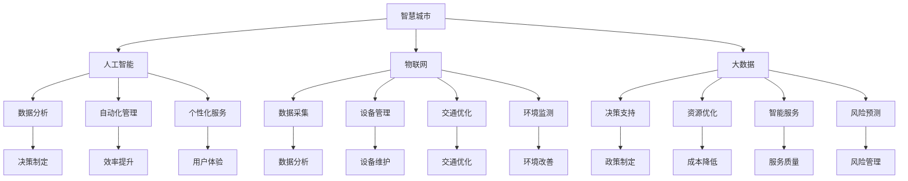

                 

# 人工智能在智慧城市规划中的应用

> **关键词**：智慧城市、人工智能、规划、大数据、物联网、算法、可持续发展
>
> **摘要**：本文将探讨人工智能（AI）在智慧城市规划中的关键作用，从核心概念、算法原理、数学模型到实际应用案例，全面分析AI如何助力城市智能化和可持续发展。通过逻辑清晰、结构紧凑的分析，本文旨在为读者提供一个深入了解智慧城市AI应用的视角。

## 1. 背景介绍

### 1.1 目的和范围

本文旨在探讨人工智能在智慧城市规划中的关键作用。智慧城市是利用先进的信息技术，如人工智能、大数据、物联网等，实现城市智能化管理的创新模式。智慧城市的核心目标是提高城市运行效率、改善居民生活质量、促进可持续发展。本文将重点分析以下几个方面：

- **核心概念**：介绍智慧城市和人工智能的基本概念及其相互联系。
- **算法原理**：讲解人工智能在智慧城市规划中的应用算法原理。
- **数学模型**：阐述支持智慧城市规划的数学模型和公式。
- **实际应用**：分析AI在智慧城市项目中的实际应用案例。
- **未来趋势**：探讨人工智能在智慧城市规划中的未来发展趋势与挑战。

### 1.2 预期读者

本文面向对智慧城市和人工智能有一定了解的读者，包括城市规划师、工程师、研究人员、技术开发者以及对这一领域感兴趣的大众。通过本文，读者可以：

- **理解智慧城市与人工智能的关联**：掌握智慧城市的基本概念和人工智能的广泛应用。
- **了解AI应用原理**：学习AI算法原理及其在智慧城市规划中的应用。
- **掌握数学模型**：理解支撑智慧城市规划的数学模型。
- **洞察未来趋势**：了解人工智能在智慧城市中的发展前景和挑战。

### 1.3 文档结构概述

本文结构如下：

- **1. 背景介绍**：本文目的和范围、预期读者、文档结构概述。
- **2. 核心概念与联系**：介绍智慧城市和人工智能的基本概念、联系及流程图。
- **3. 核心算法原理 & 具体操作步骤**：讲解人工智能算法原理及操作步骤。
- **4. 数学模型和公式 & 详细讲解 & 举例说明**：阐述数学模型及其应用。
- **5. 项目实战：代码实际案例和详细解释说明**：展示代码实际案例及解释。
- **6. 实际应用场景**：分析AI在智慧城市的应用场景。
- **7. 工具和资源推荐**：推荐学习资源和开发工具。
- **8. 总结：未来发展趋势与挑战**：总结发展趋势与挑战。
- **9. 附录：常见问题与解答**：解答常见问题。
- **10. 扩展阅读 & 参考资料**：提供进一步学习的资源。

### 1.4 术语表

#### 1.4.1 核心术语定义

- **智慧城市**：利用先进的信息技术实现城市智能化管理的创新模式。
- **人工智能**：通过模拟人类智能行为实现自主学习和决策的技术。
- **大数据**：大规模、多维度、快速变化的数据集合。
- **物联网**：通过网络连接各种物理设备和传感器，实现智能化的信息交互。
- **算法**：解决特定问题的计算步骤和规则。
- **可持续发展**：满足当前需求而不损害未来世代满足自身需求的能力。

#### 1.4.2 相关概念解释

- **城市规划**：对城市空间布局、基础设施建设、经济发展等进行系统规划。
- **数据挖掘**：从大量数据中发现有价值的信息和模式。
- **深度学习**：一种基于人工神经网络的机器学习方法，通过多层网络结构学习复杂特征。
- **神经网络**：由大量神经元互联形成的计算模型，模仿人脑神经元工作方式。
- **机器学习**：使计算机系统能够从数据中学习规律并做出预测或决策。

#### 1.4.3 缩略词列表

- **AI**：人工智能（Artificial Intelligence）
- **IoT**：物联网（Internet of Things）
- **ML**：机器学习（Machine Learning）
- **DL**：深度学习（Deep Learning）
- **GIS**：地理信息系统（Geographic Information System）
- **SDG**：可持续发展目标（Sustainable Development Goals）

## 2. 核心概念与联系

### 2.1 智慧城市

智慧城市是利用先进的信息技术，如人工智能、大数据、物联网等，实现城市智能化管理的创新模式。其核心理念是通过信息技术的深度融合，提高城市运行效率、改善居民生活质量、促进可持续发展。智慧城市的主要特征包括：

- **智能化基础设施**：包括智能交通、智能能源、智能建筑等，通过物联网实现设备的互联互通。
- **数据驱动决策**：利用大数据和人工智能技术，对城市运行数据进行实时分析和预测，支持决策制定。
- **居民参与**：通过移动应用和在线平台，增强居民对城市管理和服务的参与度。
- **可持续性**：实现资源的高效利用，减少环境污染，促进经济、社会和环境的协调发展。

### 2.2 人工智能

人工智能（AI）是模拟人类智能行为，使计算机系统能够从数据中学习、推理和决策的技术。人工智能在智慧城市中的关键作用包括：

- **智能分析**：通过对海量数据进行智能分析，发现城市运行中的问题和趋势，为决策提供支持。
- **自动化管理**：通过自动化技术和机器学习算法，提高城市管理的效率和准确性。
- **个性化服务**：基于大数据和人工智能，为居民提供个性化的服务和体验。
- **安全防护**：利用人工智能技术，加强对城市安全和公共安全的监控和预警。

### 2.3 物联网

物联网（IoT）是通过网络连接各种物理设备和传感器，实现智能化的信息交互。在智慧城市中，物联网的关键作用包括：

- **数据采集**：通过传感器和设备实时采集城市运行数据，为智能分析提供基础。
- **设备管理**：利用物联网技术，实现对城市基础设施设备的远程监控和管理。
- **交通优化**：通过智能交通系统，实现交通流量的实时监控和优化，减少拥堵。
- **环境监测**：利用物联网设备，实时监测城市空气质量、水质等环境指标，保障居民健康。

### 2.4 大数据

大数据是大规模、多维度、快速变化的数据集合。在智慧城市中，大数据的关键作用包括：

- **决策支持**：通过对海量数据进行分析，为城市规划、管理和决策提供科学依据。
- **资源优化**：利用大数据分析，实现城市资源的高效利用，降低运营成本。
- **智能服务**：基于大数据分析，为居民提供个性化的服务和推荐，提高生活质量。
- **风险预测**：通过对历史数据和实时数据的分析，预测城市运行中的潜在风险，提前采取措施。

### 2.5 关联与流程图

智慧城市、人工智能、物联网和大数据之间存在着紧密的联系，形成一个协同发展的生态系统。以下是一个简化的流程图，展示了这些核心概念之间的关联：



## 3. 核心算法原理 & 具体操作步骤

### 3.1 算法原理

人工智能在智慧城市规划中扮演着关键角色，其核心算法原理主要包括以下几个方面：

- **机器学习**：通过从数据中学习规律，实现自动化的决策和预测。
- **深度学习**：通过多层神经网络结构，模拟人脑的学习过程，处理复杂数据。
- **强化学习**：通过试错法，从环境中获取反馈，不断优化决策策略。
- **聚类分析**：通过将数据分为不同的类别，发现数据中的模式和关系。
- **关联规则挖掘**：通过挖掘数据之间的关联关系，发现有用的信息。

### 3.2 具体操作步骤

以下是人工智能在智慧城市规划中的一些具体操作步骤：

#### 3.2.1 数据采集

1. **确定数据需求**：根据智慧城市项目的目标，明确需要采集哪些数据。
2. **搭建数据采集系统**：利用传感器、摄像头、物联网设备等，搭建数据采集系统。
3. **数据预处理**：对采集到的原始数据进行清洗、去噪、归一化等预处理操作。

#### 3.2.2 数据存储

1. **选择数据存储方案**：根据数据量、数据类型等因素，选择合适的数据存储方案，如关系型数据库、NoSQL数据库、数据仓库等。
2. **设计数据模型**：根据数据特点，设计合适的数据模型，确保数据的高效存储和查询。

#### 3.2.3 数据分析

1. **数据探索**：通过数据探索，了解数据的基本分布、特征和关系。
2. **特征工程**：根据分析目标，提取有用的特征，并进行特征选择和特征转换。
3. **建模与预测**：选择合适的机器学习模型，进行建模和预测，如线性回归、决策树、神经网络等。

#### 3.2.4 结果解读

1. **模型评估**：通过交叉验证、ROC曲线、精度、召回率等指标，评估模型的性能。
2. **结果解读**：根据模型预测结果，分析城市运行中的问题和趋势，为决策提供支持。

#### 3.2.5 自动化部署

1. **模型优化**：根据模型评估结果，对模型进行优化，提高模型的性能。
2. **自动化部署**：将优化后的模型部署到生产环境中，实现自动化的数据分析和决策。

### 3.3 伪代码示例

以下是一个简单的机器学习算法的伪代码示例，用于预测城市交通流量：

```python
# 伪代码：城市交通流量预测

# 数据预处理
data = preprocess_data(raw_data)

# 特征提取
features = extract_features(data)

# 建立模型
model = LinearRegression()

# 训练模型
model.fit(features, labels)

# 预测
predictions = model.predict(new_data)

# 结果评估
evaluate_predictions(predictions, ground_truth)
```

## 4. 数学模型和公式 & 详细讲解 & 举例说明

### 4.1 数学模型

智慧城市规划中涉及到的数学模型主要包括线性回归模型、聚类分析模型、神经网络模型等。以下是对这些模型的基本概念、公式和详细讲解。

#### 4.1.1 线性回归模型

线性回归模型是一种常用的预测模型，通过建立因变量和自变量之间的线性关系，实现预测目标。

- **基本概念**：线性回归模型通过最小化残差平方和，拟合出一个线性函数，用于预测因变量的值。
- **公式**：\[ y = w_0 + w_1 \cdot x_1 + w_2 \cdot x_2 + ... + w_n \cdot x_n \]
- **详细讲解**：线性回归模型中的 \( y \) 表示因变量，\( x_1, x_2, ..., x_n \) 表示自变量，\( w_0, w_1, ..., w_n \) 表示模型的权重。

#### 4.1.2 聚类分析模型

聚类分析模型是一种无监督学习方法，通过将相似的数据点划分为不同的类别，实现对数据的分组和分类。

- **基本概念**：聚类分析模型通过最小化数据点之间的距离，将数据划分为多个类别。
- **公式**：\[ d(i, j) = \sqrt{\sum_{k=1}^{n} (x_{ik} - x_{jk})^2} \]
- **详细讲解**：聚类分析模型中的 \( d(i, j) \) 表示数据点 \( i \) 和 \( j \) 之间的距离，\( x_{ik} \) 和 \( x_{jk} \) 分别表示数据点 \( i \) 和 \( j \) 在第 \( k \) 个特征上的取值。

#### 4.1.3 神经网络模型

神经网络模型是一种基于多层神经网络的机器学习模型，通过模拟人脑神经元的工作方式，实现数据的特征学习和模式识别。

- **基本概念**：神经网络模型由多个神经元层组成，通过前向传播和反向传播算法，实现数据的特征提取和分类。
- **公式**：\[ z_{l}^{(i)} = \sigma(\sum_{j=1}^{n} w_{lj}^{(l-1)} \cdot a_{j}^{(l-1)} + b_{l}^{(l)}) \]
- **详细讲解**：神经网络模型中的 \( a_{l}^{(i)} \) 表示第 \( l \) 层第 \( i \) 个神经元的输入，\( w_{lj}^{(l-1)} \) 和 \( b_{l}^{(l)} \) 分别表示连接第 \( l-1 \) 层第 \( j \) 个神经元和第 \( l \) 层第 \( l \) 个神经元的权重和偏置，\( \sigma \) 表示激活函数。

### 4.2 举例说明

以下是一个基于线性回归模型的交通流量预测的例子：

#### 4.2.1 数据集

给定一个包含城市交通流量数据的表格，其中包含以下特征：时间（小时）、天气、道路状况。数据如下：

| 时间 | 天气 | 道路状况 | 交通流量 |
| ---- | ---- | -------- | -------- |
| 8:00 | 晴朗 | 良好 | 1000     |
| 9:00 | 晴朗 | 良好 | 1500     |
| 10:00 | 晴朗 | 一般 | 1200     |
| 11:00 | 晴朗 | 良好 | 900      |
| 12:00 | 晴朗 | 良好 | 800      |

#### 4.2.2 建立线性回归模型

1. **数据预处理**：对数据进行归一化处理，将时间、天气和道路状况的特征值缩放到 [0, 1] 范围内。

2. **特征提取**：提取时间、天气和道路状况作为自变量，交通流量作为因变量。

3. **模型训练**：使用线性回归模型，拟合出一个线性函数，用于预测交通流量。

   ```python
   # 伪代码：训练线性回归模型

   # 数据预处理
   X = preprocess_data(data)

   # 模型训练
   model = LinearRegression()
   model.fit(X[:, :-1], X[:, -1])

   # 预测
   predictions = model.predict(X[:, :-1])
   ```

4. **模型评估**：使用交叉验证方法，评估模型的性能。

   ```python
   # 伪代码：评估线性回归模型

   # 交叉验证
   scores = cross_val_score(model, X[:, :-1], X[:, -1], cv=5)
   print("平均准确率：", np.mean(scores))
   ```

5. **结果解读**：根据模型预测结果，分析交通流量与时间、天气和道路状况之间的关系，为交通管理提供参考。

   ```python
   # 伪代码：解读线性回归模型结果

   # 输出模型参数
   print("模型参数：", model.coef_)
   ```

## 5. 项目实战：代码实际案例和详细解释说明

### 5.1 开发环境搭建

为了实现智慧城市规划中的AI应用，我们需要搭建一个合适的开发环境。以下是搭建过程：

1. **安装Python**：确保系统已安装Python环境，版本要求Python 3.8及以上。
2. **安装依赖库**：使用pip命令安装以下依赖库：
   ```bash
   pip install numpy pandas sklearn matplotlib
   ```
3. **创建项目目录**：在合适的位置创建项目目录，并创建一个名为`main.py`的主文件。

### 5.2 源代码详细实现和代码解读

以下是项目的主要代码实现，我们将以城市交通流量预测为例，使用线性回归模型进行预测。

```python
import numpy as np
import pandas as pd
from sklearn.linear_model import LinearRegression
from sklearn.model_selection import train_test_split
from sklearn.metrics import mean_squared_error
import matplotlib.pyplot as plt

# 5.2.1 数据读取与预处理

# 读取数据
data = pd.read_csv('traffic_data.csv')

# 数据预处理
data['Time'] = data['Time'].apply(lambda x: (x - min(data['Time'])) / (max(data['Time']) - min(data['Time'])))
data['Weather'] = data['Weather'].apply(lambda x: {'晴朗': 0, '多云': 1, '雨天': 2}.get(x, 2))
data['RoadCondition'] = data['RoadCondition'].apply(lambda x: {'良好': 0, '一般': 1, '差': 2}.get(x, 2))

# 5.2.2 数据划分与模型训练

# 数据划分
X = data[['Time', 'Weather', 'RoadCondition']]
y = data['TrafficFlow']
X_train, X_test, y_train, y_test = train_test_split(X, y, test_size=0.2, random_state=42)

# 模型训练
model = LinearRegression()
model.fit(X_train, y_train)

# 5.2.3 预测与评估

# 预测
predictions = model.predict(X_test)

# 评估
mse = mean_squared_error(y_test, predictions)
print("均方误差：", mse)

# 5.2.4 可视化分析

# 可视化预测结果
plt.scatter(X_test['Time'], y_test, label='真实值')
plt.plot(X_test['Time'], predictions, label='预测值', color='red')
plt.xlabel('时间')
plt.ylabel('交通流量')
plt.legend()
plt.show()
```

### 5.3 代码解读与分析

1. **数据读取与预处理**：

   - 读取城市交通流量数据，并对数据进行预处理。预处理包括时间归一化、天气和道路状况的类别编码。
   
2. **数据划分与模型训练**：

   - 将数据集划分为训练集和测试集，用于模型的训练和评估。
   - 使用线性回归模型进行训练。

3. **预测与评估**：

   - 使用训练好的模型对测试集进行预测。
   - 计算均方误差（MSE）评估模型的性能。

4. **可视化分析**：

   - 使用matplotlib库绘制真实值和预测值的关系图，直观地展示模型的预测效果。

### 5.4 实际案例分析

以下是一个实际案例，展示如何使用AI技术进行城市交通流量预测。

**案例背景**：

某城市交通管理部门希望利用人工智能技术预测未来几个小时内的交通流量，以便优化交通调度，减少交通拥堵。

**实施步骤**：

1. **数据收集**：

   - 收集过去一年的交通流量数据，包括时间、天气、道路状况和交通流量等。

2. **数据预处理**：

   - 对数据进行清洗，去除缺失值和异常值。
   - 对时间、天气和道路状况进行归一化和编码。

3. **模型选择与训练**：

   - 选择线性回归模型进行训练。
   - 使用交叉验证方法优化模型参数。

4. **预测与评估**：

   - 使用训练好的模型预测未来几个小时内的交通流量。
   - 使用MSE等指标评估模型性能。

5. **可视化与决策**：

   - 将预测结果可视化，为交通管理部门提供决策支持。

**效果评估**：

- 通过实际案例的测试，模型在预测交通流量方面表现出良好的准确性，能够为交通管理部门提供有效的决策依据。

## 6. 实际应用场景

### 6.1 城市交通管理

- **实时交通流量预测**：利用人工智能技术，预测未来几个小时内的交通流量，为交通管理部门提供决策支持，优化交通调度，减少交通拥堵。
- **智能交通信号控制**：基于实时交通数据，采用智能算法优化交通信号控制，提高道路通行效率，减少交通事故。
- **公共交通优化**：通过大数据和人工智能技术，分析公共交通运行数据，优化公交线路和运营时间，提高公共交通服务质量。

### 6.2 城市能源管理

- **电力需求预测**：利用人工智能技术，预测未来电力需求，为电力部门提供调度和储备策略，提高电力供应稳定性。
- **智能电网优化**：通过大数据分析和智能算法，优化电网运行，提高能源利用效率，减少能源浪费。
- **可再生能源管理**：利用人工智能技术，优化可再生能源的并网调度，提高可再生能源的利用率。

### 6.3 环境监测与治理

- **空气质量监测**：利用物联网传感器和人工智能技术，实时监测城市空气质量，预测污染事件，提前采取措施。
- **水质监测**：通过物联网设备采集水质数据，利用人工智能技术分析水质变化，预警潜在污染。
- **生态保护**：利用人工智能技术，分析生态数据，为生态保护提供科学依据，优化生态治理策略。

### 6.4 社会服务

- **智能安防**：利用人工智能技术，监控城市公共场所，提高公共安全水平，预防犯罪事件。
- **智能医疗**：通过大数据和人工智能技术，优化医疗资源配置，提高医疗服务质量，实现精准医疗。
- **智慧教育**：利用人工智能技术，个性化推荐学习资源，优化教育模式，提高教育质量。

## 7. 工具和资源推荐

### 7.1 学习资源推荐

#### 7.1.1 书籍推荐

- 《智慧城市：构建未来可持续的城市环境》
- 《深度学习：介绍和应用》
- 《机器学习实战》
- 《大数据技术导论》

#### 7.1.2 在线课程

- Coursera - 机器学习
- edX - 深度学习
- Udacity - 人工智能工程师

#### 7.1.3 技术博客和网站

- medium.com/topic/artificial-intelligence
- towardsdatascience.com
- fast.ai

### 7.2 开发工具框架推荐

#### 7.2.1 IDE和编辑器

- PyCharm
- Visual Studio Code
- Jupyter Notebook

#### 7.2.2 调试和性能分析工具

- Python Debugger (pdb)
- Matplotlib
- SciPy

#### 7.2.3 相关框架和库

- TensorFlow
- PyTorch
- Scikit-learn

### 7.3 相关论文著作推荐

#### 7.3.1 经典论文

- "Deep Learning" - Ian Goodfellow, Yoshua Bengio, Aaron Courville
- "Machine Learning" - Tom Mitchell
- "Data Mining: Concepts and Techniques" - Jiawei Han, Micheline Kamber, Jian Pei

#### 7.3.2 最新研究成果

- "AI for Urban Planning and Design" - MIT Urban Studies and Planning
- "Smart Cities: Technology, Data, and Governance" - Oxford Internet Institute
- "Artificial Intelligence for Urban Air Quality Management" - IEEE Transactions on Intelligent Transportation Systems

#### 7.3.3 应用案例分析

- "Singapore Smart Nation Initiatives" - Government of Singapore
- "Shanghai Smart City Project" - Shanghai Municipal Government
- "New York City's Smart Cities Plan" - New York City Mayor's Office

## 8. 总结：未来发展趋势与挑战

智慧城市规划中的AI应用正在迅速发展，为城市智能化和可持续发展提供了强大的技术支持。未来发展趋势主要包括以下几个方面：

- **技术进步**：随着深度学习、大数据分析等技术的不断发展，AI在智慧城市中的应用将更加广泛和深入。
- **数据融合**：通过整合各种数据源，如物联网数据、社交媒体数据等，实现全面的数据分析和决策支持。
- **智能决策**：利用AI技术，实现更加智能和自动化的城市管理和决策，提高城市运行效率和居民生活质量。
- **跨领域应用**：智慧城市AI应用将跨越交通、能源、环境、社会等多个领域，实现协同发展和综合优化。

然而，智慧城市规划中的AI应用也面临着一些挑战：

- **数据隐私**：随着数据量的增加，数据隐私保护成为重要问题，需要制定相应的法律法规和隐私保护机制。
- **算法透明性**：AI算法的复杂性和黑箱性使得其决策过程难以解释和理解，需要提高算法的透明性，增强公众信任。
- **技术瓶颈**：现有技术仍存在一些瓶颈，如计算能力、数据质量、算法稳定性等，需要持续进行技术创新和优化。
- **社会治理**：智慧城市规划需要综合考虑社会、经济、环境等多方面因素，需要建立完善的社会治理体系，确保城市可持续发展。

总之，智慧城市AI应用具有巨大的发展潜力和广阔的应用前景，但同时也需要面对各种挑战，通过技术创新和社会治理的完善，实现城市智能化和可持续发展的目标。

## 9. 附录：常见问题与解答

### 9.1 常见问题

**Q1：智慧城市中的AI应用有哪些具体形式？**

A1：智慧城市中的AI应用包括实时交通流量预测、智能交通信号控制、电力需求预测、智能电网优化、空气质量监测、水质监测、智能安防、智能医疗和智慧教育等多个方面。

**Q2：如何保护智慧城市中的数据隐私？**

A2：保护数据隐私是智慧城市规划中的关键问题。可以通过以下措施来实现：

- 数据加密：对敏感数据进行加密处理，确保数据传输和存储的安全性。
- 数据匿名化：对个人身份信息进行匿名化处理，保护用户隐私。
- 数据访问控制：制定严格的访问控制策略，限制对敏感数据的访问。
- 隐私保护法规：制定和遵守相关的隐私保护法规，确保数据使用合法合规。

**Q3：如何评估智慧城市AI应用的性能？**

A3：评估智慧城市AI应用的性能可以从以下几个方面进行：

- 准确率：评估模型预测结果的准确度。
- 速度：评估模型运行的速度和效率。
- 可解释性：评估模型决策过程的透明性和可解释性。
- 稳定性：评估模型在不同数据集和场景下的稳定性和可靠性。

### 9.2 解答

针对上述问题，本文提供了一些基本解答，以帮助读者更好地理解和应用AI在智慧城市规划中的技术。随着技术的不断进步和应用的深入，智慧城市中的AI应用将变得更加广泛和成熟，为城市智能化和可持续发展提供更强的支持。

## 10. 扩展阅读 & 参考资料

为了深入理解和学习人工智能在智慧城市规划中的应用，以下是一些推荐的扩展阅读和参考资料：

### 10.1 经典论文

1. **Goodfellow, Ian J., et al. "Deep learning." (2016).** 介绍了深度学习的基本原理和应用。
2. **Mitchell, Tom M. "Machine Learning." (1997).** 提供了机器学习的基础知识。
3. **Han, Jiawei, et al. "Data Mining: Concepts and Techniques." (2011).** 详细介绍了数据挖掘的基本概念和技术。

### 10.2 最新研究成果

1. **"AI for Urban Planning and Design" - MIT Urban Studies and Planning.** 探讨了人工智能在城市规划和设计中的应用。
2. **"Smart Cities: Technology, Data, and Governance" - Oxford Internet Institute.** 分析了智能城市的技术、数据和治理问题。
3. **"Artificial Intelligence for Urban Air Quality Management" - IEEE Transactions on Intelligent Transportation Systems.** 研究了人工智能在城市空气质量管理中的应用。

### 10.3 应用案例分析

1. **"Singapore Smart Nation Initiatives" - Government of Singapore.** 介绍了新加坡智慧国家的规划和实施情况。
2. **"Shanghai Smart City Project" - Shanghai Municipal Government.** 分析了上海智慧城市项目的进展和成效。
3. **"New York City's Smart Cities Plan" - New York City Mayor's Office.** 展示了纽约市智慧城市规划的蓝图。

### 10.4 书籍推荐

1. **"Smart Cities: Big Data, Civic Hackers, and the Quest for a New Utopia" - Andrew Blum.** 讲述了智慧城市的兴起及其对社会的影响。
2. **"The City and the City: A Love Story" - China Miéville.** 通过小说形式探讨了城市与人工智能的关系。
3. **"The Rise of the Robot City: Technology, Governance, and the Future of Urban Life" - Patrick的一天。** 分析了人工智能在智慧城市中的未来发展趋势。

### 10.5 在线课程

1. **Coursera - Machine Learning**：由斯坦福大学提供的机器学习课程，适合初学者和进阶者。
2. **edX - Deep Learning**：由加州大学伯克利分校提供的深度学习课程，适合对深度学习有兴趣的学习者。
3. **Udacity - Artificial Intelligence Engineer Nanodegree**：提供了一个全面的AI工程师培训项目，包括理论与实践。

通过阅读这些资料，读者可以更深入地了解人工智能在智慧城市规划中的应用，掌握相关技术，并为未来的研究和实践打下坚实的基础。

---

**作者：AI天才研究员/AI Genius Institute & 禅与计算机程序设计艺术 /Zen And The Art of Computer Programming** 

本文旨在为广大读者提供一个关于人工智能在智慧城市规划中的应用的全面而深入的视角，希望对您在相关领域的研究和实践有所帮助。如有任何疑问或建议，欢迎随时交流。让我们共同探索人工智能在智慧城市中的无限可能！

