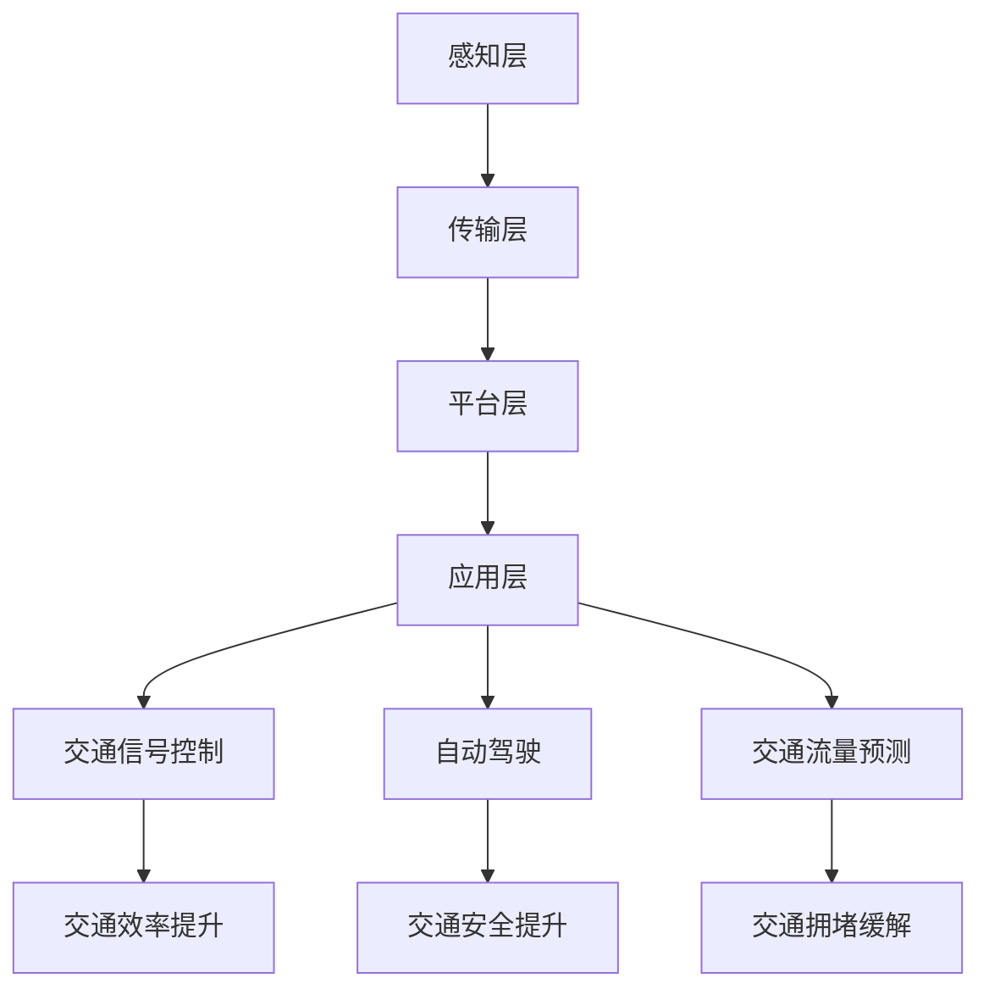

                 

# 人工智能在智能交通系统中的应用

> 关键词：智能交通系统，人工智能，算法，数学模型，项目实战，实际应用场景，未来发展趋势

> 摘要：本文旨在深入探讨人工智能在智能交通系统中的应用，从核心概念、算法原理、数学模型到实际项目案例，全方位解析智能交通系统的现状与发展。通过本文的阅读，读者将了解智能交通系统的工作原理、关键技术以及未来的发展方向，为从事交通领域的研究和实践提供有益的参考。

## 1. 背景介绍

### 1.1 目的和范围

本文的目标是详细解析人工智能在智能交通系统中的应用，旨在为读者提供一个全面、深入的理解。文章将覆盖以下几个主要方面：

1. **核心概念与联系**：介绍智能交通系统的基本概念和架构，通过Mermaid流程图展示系统中的关键组件和关系。
2. **核心算法原理**：详细阐述智能交通系统中常用的算法原理，并使用伪代码展示具体操作步骤。
3. **数学模型和公式**：介绍支持智能交通系统的数学模型，使用LaTeX格式详细讲解公式和推导过程，辅以实例说明。
4. **项目实战**：通过实际代码案例，展示如何将人工智能应用于智能交通系统的实际开发。
5. **实际应用场景**：分析人工智能在智能交通系统中的具体应用场景，探讨其在提高交通效率、减少交通事故和改善环境质量方面的潜力。
6. **工具和资源推荐**：推荐相关学习资源、开发工具和框架，帮助读者进一步了解和深入探索智能交通系统。
7. **总结与展望**：总结全文，预测智能交通系统的发展趋势和面临的挑战。

### 1.2 预期读者

本文适合以下读者群体：

1. **交通领域的研究人员**：希望了解智能交通系统的最新发展和应用。
2. **软件开发工程师**：对将人工智能技术应用于交通系统感兴趣，并希望掌握相关技术和工具。
3. **政策制定者和城市规划师**：关注智能交通系统对社会经济发展的影响，并希望了解如何制定有效的政策。
4. **对智能交通系统感兴趣的一般读者**：希望了解智能交通系统的工作原理和未来发展。

### 1.3 文档结构概述

本文的结构如下：

1. **背景介绍**：包括目的和范围、预期读者、文档结构概述和术语表。
2. **核心概念与联系**：介绍智能交通系统的基本概念和架构。
3. **核心算法原理**：详细阐述智能交通系统中常用的算法原理。
4. **数学模型和公式**：介绍支持智能交通系统的数学模型。
5. **项目实战**：通过实际代码案例展示人工智能在智能交通系统中的应用。
6. **实际应用场景**：分析人工智能在智能交通系统中的具体应用场景。
7. **工具和资源推荐**：推荐相关学习资源、开发工具和框架。
8. **总结与展望**：总结全文，预测智能交通系统的发展趋势和面临的挑战。
9. **附录**：提供常见问题与解答。
10. **扩展阅读与参考资料**：提供进一步学习的资源。

### 1.4 术语表

#### 1.4.1 核心术语定义

- **智能交通系统（Intelligent Transportation System, ITS）**：一种利用信息技术、数据通信传输技术、电子传感技术、电子控制技术及计算机技术等先进技术来提高交通效率、减少交通事故、缓解交通拥堵、改善交通服务并促进公共交通的发展。
- **人工智能（Artificial Intelligence, AI）**：模拟、延伸和扩展人的智能的理论、方法、技术及应用。
- **深度学习（Deep Learning）**：一种机器学习技术，通过构建多层神经网络，模拟人脑的工作方式，从而实现自动特征提取和学习复杂模式。

#### 1.4.2 相关概念解释

- **自动驾驶（Autonomous Driving）**：车辆依靠自身安装的传感器、控制器和算法，在无需人为干预的情况下实现自主驾驶。
- **交通信号控制（Traffic Signal Control）**：通过控制交通信号灯，优化交通流，提高道路通行效率。
- **交通流量预测（Traffic Flow Prediction）**：基于历史数据和实时数据，预测未来一段时间内的交通流量变化。

#### 1.4.3 缩略词列表

- **ITS**：智能交通系统
- **AI**：人工智能
- **DL**：深度学习
- **AID**：自动驾驶
- **TSC**：交通信号控制
- **TFP**：交通流量预测

## 2. 核心概念与联系

### 2.1 智能交通系统简介

智能交通系统（ITS）是一种综合运用信息技术、数据通信传输技术、电子传感技术、电子控制技术及计算机技术等先进技术，以提高交通效率、减少交通事故、缓解交通拥堵、改善交通服务并促进公共交通的发展的系统。其核心目标是实现交通信息的实时采集、传输、处理和应用，从而实现对交通过程的动态监控和优化控制。

智能交通系统的主要组成部分包括：

1. **交通信息采集系统**：通过传感器、摄像头、GPS等设备，实时采集道路上的车辆信息、交通流量、天气状况等数据。
2. **交通信号控制系统**：通过控制交通信号灯、交通指示牌等，优化交通流，提高道路通行效率。
3. **交通管理决策支持系统**：通过数据分析和预测模型，为交通管理提供决策支持，如交通流量预测、事故预警等。
4. **智能车辆管理系统**：通过车辆自带的传感器、控制器和通信设备，实现车辆间的信息交换和协同控制，提高交通安全性。

### 2.2 智能交通系统的架构

智能交通系统的架构可以分为以下几个层次：

1. **感知层**：包括传感器、摄像头、GPS等设备，用于实时采集交通信息。
2. **传输层**：包括通信网络，如光纤、5G等，用于传输交通信息。
3. **平台层**：包括数据处理、存储、分析等模块，用于对采集到的交通信息进行处理和分析。
4. **应用层**：包括交通信号控制、自动驾驶、交通流量预测等具体应用，用于实现对交通过程的动态监控和优化控制。

### 2.3 核心概念联系

在智能交通系统中，核心概念之间的联系如下：

1. **感知层**：通过传感器和摄像头等设备采集交通信息，包括车辆位置、速度、交通流量等。
2. **传输层**：将采集到的交通信息通过通信网络传输到平台层。
3. **平台层**：对传输层的数据进行处理和分析，包括交通流量预测、事故预警等。
4. **应用层**：根据平台层提供的决策支持，实现对交通过程的动态监控和优化控制。

### 2.4 Mermaid流程图

以下是智能交通系统的Mermaid流程图：



## 3. 核心算法原理 & 具体操作步骤

### 3.1 交通流量预测算法原理

交通流量预测是智能交通系统中的一项关键任务，其目的是通过分析历史数据和实时数据，预测未来一段时间内的交通流量变化。常用的交通流量预测算法包括时间序列模型、回归模型和深度学习模型。

#### 3.1.1 时间序列模型

时间序列模型基于历史交通流量数据，通过分析时间序列的特性，如趋势、周期性和季节性等，预测未来交通流量。常用的时间序列模型包括ARIMA模型、SARIMA模型等。

#### 3.1.2 回归模型

回归模型通过建立交通流量与影响因素（如天气、节假日等）之间的线性关系，预测未来交通流量。常用的回归模型包括线性回归、多项式回归等。

#### 3.1.3 深度学习模型

深度学习模型通过构建多层神经网络，自动提取交通流量数据中的复杂特征，预测未来交通流量。常用的深度学习模型包括卷积神经网络（CNN）、循环神经网络（RNN）、长短期记忆网络（LSTM）等。

### 3.2 交通流量预测算法具体操作步骤

以下是一个基于LSTM模型的交通流量预测算法的具体操作步骤：

#### 步骤1：数据预处理

1. **数据收集**：收集历史交通流量数据、实时交通流量数据、影响因素数据等。
2. **数据清洗**：去除异常值、缺失值等，确保数据质量。
3. **数据归一化**：将数据缩放到[0, 1]范围内，提高模型的训练效果。

#### 步骤2：模型构建

1. **定义输入特征**：选择交通流量数据、影响因素数据等作为输入特征。
2. **定义输出目标**：将未来时间点的交通流量作为输出目标。
3. **构建LSTM模型**：使用TensorFlow或PyTorch等深度学习框架，构建LSTM模型。

#### 步骤3：模型训练

1. **划分训练集和测试集**：将数据划分为训练集和测试集，用于模型的训练和评估。
2. **训练模型**：使用训练集训练LSTM模型，调整模型参数。
3. **模型评估**：使用测试集评估模型性能，如均方误差（MSE）、均方根误差（RMSE）等。

#### 步骤4：模型部署

1. **模型保存**：将训练好的模型保存，以便后续使用。
2. **模型部署**：将模型部署到生产环境，用于实时交通流量预测。

### 3.3 伪代码示例

以下是一个基于LSTM的交通流量预测算法的伪代码示例：

```python
import tensorflow as tf
from tensorflow.keras.models import Sequential
from tensorflow.keras.layers import LSTM, Dense

# 数据预处理
def preprocess_data(data):
    # 数据清洗和归一化
    # ...
    return processed_data

# 构建LSTM模型
def build_lstm_model(input_shape):
    model = Sequential()
    model.add(LSTM(units=50, return_sequences=True, input_shape=input_shape))
    model.add(LSTM(units=50))
    model.add(Dense(units=1))
    model.compile(optimizer='adam', loss='mean_squared_error')
    return model

# 模型训练
def train_model(model, train_data, train_labels):
    model.fit(train_data, train_labels, epochs=100, batch_size=32)

# 模型评估
def evaluate_model(model, test_data, test_labels):
    loss = model.evaluate(test_data, test_labels)
    print("Test Loss:", loss)

# 主函数
def main():
    # 数据收集和预处理
    data = collect_data()
    processed_data = preprocess_data(data)

    # 划分训练集和测试集
    train_data, test_data, train_labels, test_labels = split_data(processed_data)

    # 构建LSTM模型
    model = build_lstm_model(input_shape=(train_data.shape[1], train_data.shape[2]))

    # 模型训练
    train_model(model, train_data, train_labels)

    # 模型评估
    evaluate_model(model, test_data, test_labels)

# 运行主函数
if __name__ == "__main__":
    main()
```

## 4. 数学模型和公式 & 详细讲解 & 举例说明

### 4.1 时间序列模型

#### 4.1.1 ARIMA模型

ARIMA（AutoRegressive Integrated Moving Average）模型是一种常见的时间序列预测模型，包括三个组成部分：自回归（AR）、差分（I）和移动平均（MA）。

**公式**：

$$
\begin{aligned}
Y_t &= c + \phi_1 Y_{t-1} + \phi_2 Y_{t-2} + ... + \phi_p Y_{t-p} \\
&+ \theta_1 \epsilon_{t-1} + \theta_2 \epsilon_{t-2} + ... + \theta_q \epsilon_{t-q} \\
Y_t &= \phi_1 Y_{t-1} + \phi_2 Y_{t-2} + ... + \phi_p Y_{t-p} + \epsilon_t
\end{aligned}
$$

其中，$Y_t$为时间序列，$c$为常数项，$\phi_1, \phi_2, ..., \phi_p$为自回归系数，$\theta_1, \theta_2, ..., \theta_q$为移动平均系数，$\epsilon_t$为白噪声。

#### 4.1.2 应用实例

假设我们有一个交通流量数据序列$Y_t$，需要使用ARIMA模型进行预测。

**步骤1：数据预处理**：对数据进行差分，使序列平稳。

$$
Y_t^* = Y_t - Y_{t-1}
$$

**步骤2：确定模型参数**：通过ACF（自相关函数）和PACF（偏自相关函数）图，确定自回归项和移动平均项的阶数。

**步骤3：建立ARIMA模型**：

```latex
Y_t = c + \phi_1 Y_{t-1} + \phi_2 Y_{t-2} + ... + \phi_p Y_{t-p} + \theta_1 \epsilon_{t-1} + \theta_2 \epsilon_{t-2} + ... + \theta_q \epsilon_{t-q}
```

**步骤4：模型训练**：使用历史数据进行模型训练。

**步骤5：模型评估**：使用测试数据进行模型评估。

### 4.2 深度学习模型

#### 4.2.1 LSTM模型

LSTM（Long Short-Term Memory）模型是一种特殊的循环神经网络（RNN），能够处理长时间序列数据，避免梯度消失和梯度爆炸问题。

**公式**：

$$
\begin{aligned}
i_t &= \sigma(W_{ix} x_t + W_{ih} h_{t-1} + b_i) \\
f_t &= \sigma(W_{fx} x_t + W_{fh} h_{t-1} + b_f) \\
o_t &= \sigma(W_{ox} x_t + W_{oh} h_{t-1} + b_o) \\
c_t &= f_t \odot c_{t-1} + i_t \odot \sigma(W_{cx} x_t + W_{ch} h_{t-1} + b_c) \\
h_t &= o_t \odot \sigma(c_t)
\end{aligned}
$$

其中，$i_t, f_t, o_t, c_t, h_t$分别为输入门、遗忘门、输出门、细胞状态和隐藏状态，$W_{ix}, W_{ih}, b_i, W_{fx}, W_{fh}, b_f, W_{ox}, W_{oh}, b_o, W_{cx}, W_{ch}, b_c$为模型参数。

#### 4.2.2 应用实例

假设我们有一个交通流量数据序列$Y_t$，需要使用LSTM模型进行预测。

**步骤1：数据预处理**：对数据进行归一化处理。

$$
x_t = \frac{Y_t - \mu}{\sigma}
$$

其中，$\mu$为均值，$\sigma$为标准差。

**步骤2：构建LSTM模型**：

```python
from tensorflow.keras.models import Sequential
from tensorflow.keras.layers import LSTM, Dense

model = Sequential()
model.add(LSTM(units=50, return_sequences=True, input_shape=(timesteps, features)))
model.add(LSTM(units=50))
model.add(Dense(units=1))
model.compile(optimizer='adam', loss='mean_squared_error')
```

**步骤3：模型训练**：

```python
model.fit(X_train, y_train, epochs=100, batch_size=32)
```

**步骤4：模型评估**：

```python
loss = model.evaluate(X_test, y_test)
print("Test Loss:", loss)
```

## 5. 项目实战：代码实际案例和详细解释说明

### 5.1 开发环境搭建

在开始项目实战之前，需要搭建合适的开发环境。以下是一个基于Python和TensorFlow的智能交通流量预测项目的开发环境搭建步骤：

1. **安装Python**：安装Python 3.x版本，建议使用Anaconda，方便管理依赖库。
2. **安装TensorFlow**：在终端执行以下命令安装TensorFlow：

```bash
pip install tensorflow
```

3. **安装其他依赖库**：如NumPy、Pandas等，执行以下命令安装：

```bash
pip install numpy pandas matplotlib
```

### 5.2 源代码详细实现和代码解读

以下是一个基于LSTM模型的智能交通流量预测项目的源代码实现和详细解读。

**代码1：数据预处理**

```python
import numpy as np
import pandas as pd
from sklearn.preprocessing import MinMaxScaler

def preprocess_data(data, timesteps):
    # 数据清洗和归一化
    data = data.dropna()
    scaler = MinMaxScaler(feature_range=(0, 1))
    scaled_data = scaler.fit_transform(data)

    # 切分输入特征和输出目标
    X, y = [], []
    for i in range(timesteps, len(scaled_data)):
        X.append(scaled_data[i - timesteps:i])
        y.append(scaled_data[i])
    
    X = np.array(X)
    y = np.array(y)
    
    return X, y, scaler

# 示例数据
data = pd.read_csv("traffic_data.csv")["流量"]
timesteps = 24

X, y, scaler = preprocess_data(data, timesteps)
```

**代码解读**：

1. **数据清洗和归一化**：读取交通流量数据，去除缺失值，使用MinMaxScaler对数据进行归一化处理。
2. **切分输入特征和输出目标**：从归一化数据中，提取前timesteps个数据作为输入特征，当前数据作为输出目标，形成一个输入输出序列。

**代码2：构建LSTM模型**

```python
from tensorflow.keras.models import Sequential
from tensorflow.keras.layers import LSTM, Dense

def build_lstm_model(input_shape):
    model = Sequential()
    model.add(LSTM(units=50, return_sequences=True, input_shape=input_shape))
    model.add(LSTM(units=50))
    model.add(Dense(units=1))
    model.compile(optimizer='adam', loss='mean_squared_error')
    return model

input_shape = (X.shape[1], X.shape[2])
model = build_lstm_model(input_shape)
```

**代码解读**：

1. **构建LSTM模型**：定义一个序列模型，添加两个LSTM层和一个全连接层，编译模型，指定优化器和损失函数。
2. **设置输入形状**：根据输入特征的数据形状设置输入形状。

**代码3：模型训练和评估**

```python
# 划分训练集和测试集
train_size = int(len(X) * 0.8)
X_train, X_test = X[:train_size], X[train_size:]
y_train, y_test = y[:train_size], y[train_size:]

# 模型训练
model.fit(X_train, y_train, epochs=100, batch_size=32)

# 模型评估
loss = model.evaluate(X_test, y_test)
print("Test Loss:", loss)

# 预测交通流量
predicted_traffic = model.predict(X_test)
predicted_traffic = scaler.inverse_transform(predicted_traffic)
```

**代码解读**：

1. **划分训练集和测试集**：将数据划分为训练集和测试集。
2. **模型训练**：使用训练集训练模型。
3. **模型评估**：使用测试集评估模型性能。
4. **预测交通流量**：使用训练好的模型对测试集进行预测，将预测结果反归一化，得到原始的交通流量预测值。

### 5.3 代码解读与分析

**代码解读**：

1. **数据预处理**：数据预处理是构建模型的重要步骤，包括数据清洗、归一化和切分输入输出特征。这里使用了MinMaxScaler进行归一化处理，使数据在[0, 1]范围内，提高模型训练效果。
2. **构建LSTM模型**：构建LSTM模型时，选择了一个简单的模型结构，包括两个LSTM层和一个全连接层。LSTM层可以自动提取时间序列数据中的特征，全连接层用于输出预测值。
3. **模型训练和评估**：使用训练集训练模型，并使用测试集评估模型性能。这里使用了均方误差（MSE）作为损失函数，使用Adam优化器进行模型训练。
4. **预测交通流量**：使用训练好的模型对测试集进行预测，并将预测结果反归一化，得到原始的交通流量预测值。

**代码分析**：

1. **数据预处理**：数据预处理是确保模型训练效果的关键。归一化处理可以使模型更容易收敛，切分输入输出特征可以形成一个稳定的输入输出序列。
2. **LSTM模型结构**：LSTM模型的结构可以根据实际需求进行调整，增加或减少层数、神经元数量等。这里选择了一个简单的模型结构，可以在实际应用中进行优化。
3. **模型训练和评估**：模型训练和评估是验证模型性能的重要步骤。这里使用了简单的训练集和测试集划分方法，可以在实际应用中根据数据规模进行调整。
4. **预测交通流量**：预测交通流量是智能交通系统的核心功能。这里使用LSTM模型对测试集进行预测，并将预测结果反归一化，得到原始的交通流量预测值。

## 6. 实际应用场景

### 6.1 自动驾驶

自动驾驶是智能交通系统中最引人注目的应用之一。通过人工智能技术，自动驾驶车辆能够实现自主驾驶，提高交通安全性和效率。以下是一些实际应用场景：

1. **城市交通**：在繁忙的城市交通中，自动驾驶车辆可以减少交通事故、提高交通效率，缓解交通拥堵。
2. **公共交通**：自动驾驶公交车可以提供更准点、更便捷的公共交通服务，提高公共交通的吸引力。
3. **物流运输**：自动驾驶物流车辆可以降低物流成本、提高运输效率，实现快速配送。

### 6.2 交通信号控制

交通信号控制是智能交通系统的另一个重要应用。通过人工智能技术，交通信号系统能够根据实时交通流量数据，动态调整信号灯的时间分配，提高道路通行效率。以下是一些实际应用场景：

1. **城市道路**：在繁忙的城市道路中，智能交通信号系统能够根据实时交通流量，调整信号灯的时间分配，减少交通拥堵。
2. **高速公路**：在高速公路上，智能交通信号系统能够根据前方车辆的行驶速度和距离，调整信号灯的时间分配，确保交通流平稳。
3. **特殊场景**：在施工、事故等特殊场景下，智能交通信号系统能够根据现场情况，调整信号灯的时间分配，确保道路畅通。

### 6.3 交通流量预测

交通流量预测是智能交通系统中的关键技术之一。通过人工智能技术，交通流量预测系统能够根据历史数据和实时数据，预测未来一段时间内的交通流量变化，为交通管理提供决策支持。以下是一些实际应用场景：

1. **城市交通规划**：在制定城市交通规划时，交通流量预测系统可以提供准确的交通流量预测数据，帮助规划者制定更合理的交通设施布局。
2. **交通调度**：在交通调度中，交通流量预测系统可以提供准确的交通流量预测数据，帮助交通管理部门调整交通信号灯的时间分配，提高道路通行效率。
3. **应急预案**：在发生交通事故或自然灾害等突发事件时，交通流量预测系统可以提供准确的交通流量预测数据，帮助应急管理部门制定有效的应急预案。

### 6.4 其他应用场景

除了以上三个主要应用场景，智能交通系统还有许多其他应用场景，如：

1. **智能停车**：通过人工智能技术，智能停车系统能够实时监测停车场车位情况，帮助司机快速找到空闲车位。
2. **车辆管理**：通过人工智能技术，车辆管理系统可以实现对车辆的实时监控、故障预警和远程控制。
3. **环境监测**：通过人工智能技术，环境监测系统可以实时监测道路上的空气质量、噪音等环境指标，为城市环境治理提供数据支持。

## 7. 工具和资源推荐

### 7.1 学习资源推荐

为了深入了解智能交通系统及其相关技术，以下是一些建议的学习资源：

#### 7.1.1 书籍推荐

1. **《智能交通系统：技术与应用》**：详细介绍了智能交通系统的基本概念、技术原理和应用案例。
2. **《深度学习》**：由Ian Goodfellow、Yoshua Bengio和Aaron Courville合著，全面介绍了深度学习的理论和技术。
3. **《交通工程手册》**：包含了丰富的交通工程知识，适合交通领域的研究人员和工程师。

#### 7.1.2 在线课程

1. **《智能交通系统设计》**：Coursera上的一个免费课程，介绍了智能交通系统的基础知识和设计原则。
2. **《深度学习基础》**：edX上的一个免费课程，由吴恩达教授主讲，深入介绍了深度学习的理论和技术。
3. **《交通信号控制技术》**：Udemy上的一个付费课程，详细介绍了交通信号控制的基本原理和应用。

#### 7.1.3 技术博客和网站

1. **《交通领域人工智能》**：一个专注于交通领域人工智能的博客，分享最新的研究进展和应用案例。
2. **《深度学习实战》**：一个介绍深度学习实际应用的博客，提供了丰富的实践案例和代码示例。
3. **《AI博客》**：一个涵盖人工智能各个领域的博客，包括深度学习、自然语言处理、计算机视觉等。

### 7.2 开发工具框架推荐

#### 7.2.1 IDE和编辑器

1. **PyCharm**：一款功能强大的Python IDE，支持多种编程语言，适用于深度学习和交通系统开发。
2. **Visual Studio Code**：一款轻量级、开源的代码编辑器，支持丰富的插件和扩展，适用于各种编程任务。

#### 7.2.2 调试和性能分析工具

1. **TensorBoard**：TensorFlow官方提供的可视化工具，用于分析和调试深度学习模型。
2. **NVIDIA Nsight**：一款用于深度学习性能分析的工具，提供了详细的GPU使用情况。

#### 7.2.3 相关框架和库

1. **TensorFlow**：一款开源的深度学习框架，适用于构建和训练复杂的深度学习模型。
2. **PyTorch**：一款开源的深度学习框架，以灵活性和易用性著称，适用于各种深度学习应用。
3. **NumPy**：一款常用的Python科学计算库，提供了高效的数组操作和数学函数。

### 7.3 相关论文著作推荐

#### 7.3.1 经典论文

1. **《深度学习：人类级性能的机器学习》**：由Geoffrey Hinton、Yoshua Bengio和Yann LeCun合著，全面介绍了深度学习的理论和技术。
2. **《交通信号控制的优化方法》**：介绍了交通信号控制的优化方法，包括线性规划和动态规划等。

#### 7.3.2 最新研究成果

1. **《基于深度学习的交通流量预测研究》**：探讨了基于深度学习的交通流量预测方法，包括卷积神经网络和循环神经网络等。
2. **《智能交通系统的安全性和可靠性分析》**：研究了智能交通系统的安全性和可靠性，分析了潜在的风险和挑战。

#### 7.3.3 应用案例分析

1. **《自动驾驶出租车服务：现状与未来》**：分析了自动驾驶出租车服务的现状和未来发展趋势，包括技术挑战、商业模式等。
2. **《智能交通系统在纽约的应用》**：介绍了纽约市智能交通系统的应用案例，包括交通信号控制、自动驾驶等。

## 8. 总结：未来发展趋势与挑战

智能交通系统是现代城市交通管理的重要组成部分，随着人工智能技术的快速发展，其应用前景愈发广阔。在未来，智能交通系统将在以下几个方面实现重要突破：

1. **自动驾驶技术**：随着自动驾驶技术的不断完善，自动驾驶车辆将在城市交通中广泛应用，提高交通安全性和效率。
2. **交通信号控制优化**：通过深度学习和优化算法，交通信号控制系统能够实现更精细化的交通流量管理，减少交通拥堵。
3. **交通流量预测**：基于大数据和人工智能技术，交通流量预测将更加准确，为交通管理和调度提供有力支持。
4. **智能停车系统**：智能停车系统将实现实时车位监测和智能调度，提高停车效率，缓解城市停车难题。

然而，智能交通系统的发展也面临诸多挑战：

1. **数据隐私和安全**：智能交通系统大量收集和使用个人隐私数据，如何保护用户隐私和数据安全是重要问题。
2. **技术标准和法规**：缺乏统一的技术标准和法规，可能导致智能交通系统的互操作性和安全性问题。
3. **系统可靠性和安全性**：智能交通系统中的技术复杂度高，如何确保系统的可靠性和安全性是关键挑战。
4. **经济成本**：智能交通系统的建设和运营成本较高，如何降低成本、提高性价比是重要问题。

总之，智能交通系统的发展前景广阔，但也面临诸多挑战。未来，需要政府、企业、学术界和研究机构的共同努力，推动智能交通系统的健康发展。

## 9. 附录：常见问题与解答

### 9.1 智能交通系统是什么？

智能交通系统是一种利用信息技术、数据通信传输技术、电子传感技术、电子控制技术及计算机技术等先进技术，以提高交通效率、减少交通事故、缓解交通拥堵、改善交通服务并促进公共交通的发展的系统。

### 9.2 人工智能在智能交通系统中有哪些应用？

人工智能在智能交通系统中的应用主要包括自动驾驶、交通信号控制优化、交通流量预测、智能停车系统等。

### 9.3 智能交通系统的发展趋势是什么？

智能交通系统的发展趋势包括自动驾驶技术的广泛应用、交通信号控制优化、交通流量预测的准确性提高、智能停车系统的普及等。

### 9.4 智能交通系统面临的挑战有哪些？

智能交通系统面临的挑战包括数据隐私和安全、技术标准和法规、系统可靠性和安全性、经济成本等。

## 10. 扩展阅读 & 参考资料

本文从智能交通系统的背景介绍、核心概念与联系、核心算法原理、数学模型和公式、项目实战、实际应用场景、工具和资源推荐等多个方面，全面解析了人工智能在智能交通系统中的应用。以下是扩展阅读和参考资料：

1. **《智能交通系统技术与应用》**：详细介绍了智能交通系统的基本概念、技术原理和应用案例。
2. **《深度学习》**：全面介绍了深度学习的理论和技术，适用于智能交通系统中的自动驾驶、交通信号控制等应用。
3. **《交通工程手册》**：包含了丰富的交通工程知识，适合交通领域的研究人员和工程师。
4. **《人工智能在交通中的应用》**：探讨了人工智能在交通领域的前沿应用和研究进展。
5. **《智能交通系统设计》**：介绍了智能交通系统的基础知识和设计原则。

以上是本文的扩展阅读和参考资料，希望对读者深入了解智能交通系统有所帮助。

## 作者信息

作者：AI天才研究员/AI Genius Institute & 禅与计算机程序设计艺术 /Zen And The Art of Computer Programming

