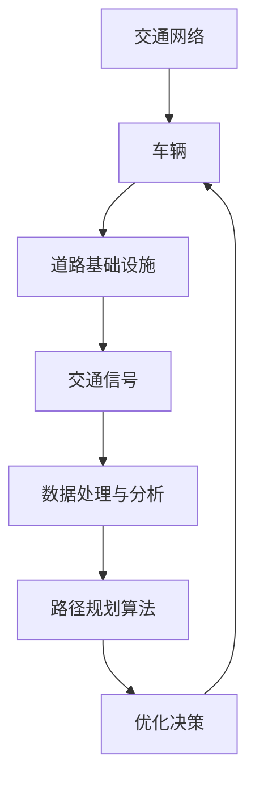
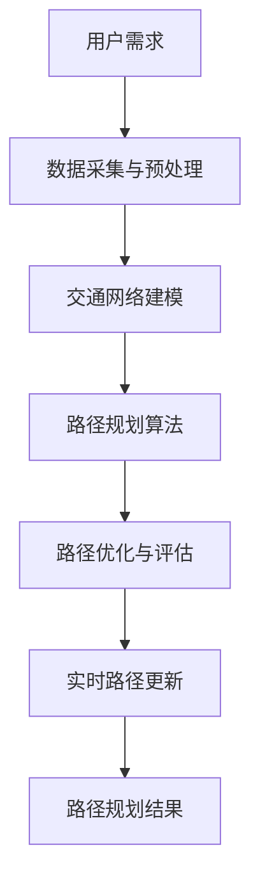

                 

# 人工智能在智能交通路径规划中的应用

> 关键词：智能交通、路径规划、人工智能、交通流量优化、自动驾驶、机器学习、深度学习、数据驱动

> 摘要：本文将深入探讨人工智能在智能交通路径规划中的应用。通过分析智能交通的基本概念、路径规划的挑战和现状，我们将展示如何利用人工智能技术，如机器学习和深度学习，来解决交通流量优化、实时路径规划等关键问题。本文还将通过实际案例和代码实现，展示人工智能在智能交通领域的应用潜力和前景。

## 1. 背景介绍

### 1.1 目的和范围

本文旨在探讨人工智能在智能交通路径规划中的应用，重点关注以下几个方面：

1. 智能交通的基本概念和现状。
2. 路径规划面临的挑战。
3. 利用人工智能技术优化路径规划的方法。
4. 实际应用案例和代码实现。

### 1.2 预期读者

本文适合以下读者群体：

1. 对智能交通和人工智能技术感兴趣的工程师和研究人员。
2. 想要了解人工智能在智能交通领域应用前景的从业者。
3. 对交通工程和城市规划感兴趣的学者。

### 1.3 文档结构概述

本文结构如下：

1. 引言：介绍智能交通和路径规划的基本概念。
2. 核心概念与联系：阐述智能交通路径规划的核心原理和架构。
3. 核心算法原理 & 具体操作步骤：讲解路径规划的主要算法和操作步骤。
4. 数学模型和公式 & 详细讲解 & 举例说明：介绍路径规划的数学模型和计算公式。
5. 项目实战：代码实际案例和详细解释说明。
6. 实际应用场景：探讨人工智能在智能交通路径规划中的应用场景。
7. 工具和资源推荐：推荐相关的学习资源和开发工具。
8. 总结：未来发展趋势与挑战。
9. 附录：常见问题与解答。
10. 扩展阅读 & 参考资料：提供更多的参考资料和学习资源。

### 1.4 术语表

#### 1.4.1 核心术语定义

- 智能交通：利用信息技术、数据分析和人工智能等手段，实现交通系统的智能化管理和优化。
- 路径规划：在给定的交通网络中，为车辆或其他交通参与者寻找一条最优路径。
- 机器学习：一种人工智能技术，通过从数据中学习，使计算机能够做出预测和决策。
- 深度学习：一种基于多层神经网络的机器学习技术，用于处理复杂的模式和特征。
- 数据驱动：基于大量数据进行决策和优化，而非基于规则或传统方法。

#### 1.4.2 相关概念解释

- 交通流量优化：通过调整交通信号、交通流向和车辆调度等手段，降低交通拥堵，提高交通效率。
- 实时路径规划：在交通网络中，根据实时交通信息和车辆状态，动态地规划最优路径。
- 自动驾驶：利用人工智能技术，实现车辆在无人驾驶状态下的自主导航和行驶。

#### 1.4.3 缩略词列表

- AI：人工智能
- ML：机器学习
- DL：深度学习
- GPS：全球定位系统
- GIS：地理信息系统
- V2X：车联网

## 2. 核心概念与联系

在智能交通路径规划中，核心概念包括交通网络、车辆、道路基础设施、交通信号等。以下是智能交通路径规划的关键架构和流程：

### 2.1 智能交通路径规划架构



### 2.2 路径规划流程



### 2.3 核心概念联系

智能交通路径规划涉及多个核心概念，如图所示，各概念之间紧密联系，共同构成智能交通系统的基础。

## 3. 核心算法原理 & 具体操作步骤

在智能交通路径规划中，常用的核心算法包括Dijkstra算法、A*算法和遗传算法等。以下是这些算法的原理和具体操作步骤。

### 3.1 Dijkstra算法

Dijkstra算法是一种经典的路径规划算法，用于寻找单源最短路径。

#### 3.1.1 算法原理

Dijkstra算法基于贪心策略，逐步扩展源点到其他节点的最短路径。

#### 3.1.2 伪代码

```python
function Dijkstra(G, S):
    create empty set S
    create a set of unvisited nodes U
    for each vertex v in G:
        dist[v] = infinity
    dist[S] = 0
    while U is not empty:
        select a vertex U with the smallest dist value
        remove U from U
        add U to S
        for each edge (U, V) in G:
            alt = dist[U] + length(U, V)
            if alt < dist[V]:
                dist[V] = alt
```

### 3.2 A*算法

A*算法是一种基于启发式的路径规划算法，结合了Dijkstra算法和启发式搜索。

#### 3.2.1 算法原理

A*算法通过估算目标节点到当前节点的距离，结合实际距离，选择最优路径。

#### 3.2.2 伪代码

```python
function A*(G, S, G):
    create an empty set of closed nodes
    create an open list and add the starting node
    f[S] = g[S] + h[S]
    while open list is not empty:
        select a node N with the lowest f value
        remove N from the open list and add it to the closed list
        if N = G:
            return reconstruct_path(closed_list, S, G)
        for each neighbor V of N:
            if V is in the closed list:
                continue
            tent_distance = dist[N] + length(N, V)
            if tent_distance < dist[V]:
                dist[V] = tent_distance
                f[V] = dist[V] + h[V]
                if V is not in the open list, add it
```

### 3.3 遗传算法

遗传算法是一种基于自然进化过程的优化算法，常用于路径规划中的多目标优化。

#### 3.3.1 算法原理

遗传算法通过模拟自然选择和遗传机制，逐步优化路径。

#### 3.3.2 伪代码

```python
function GeneticAlgorithm(G, population_size, generations):
    create an initial population of paths
    evaluate fitness of each path in the population
    for each generation:
        select parents from the population based on their fitness
        crossover parents to create offspring
        mutate offspring
        evaluate fitness of offspring
        select the best paths to form the new population
    return the best path from the final population
```

## 4. 数学模型和公式 & 详细讲解 & 举例说明

在智能交通路径规划中，常用的数学模型包括距离模型、时间模型和成本模型。以下是这些模型的详细讲解和举例说明。

### 4.1 距离模型

距离模型用于计算两个节点之间的距离。常用的距离模型包括欧几里得距离和曼哈顿距离。

#### 4.1.1 欧几里得距离

$$
d_{Euclidean}(x, y) = \sqrt{\sum_{i=1}^{n} (x_i - y_i)^2}
$$

#### 4.1.2 曼哈顿距离

$$
d_{Manhattan}(x, y) = \sum_{i=1}^{n} |x_i - y_i|
$$

#### 4.1.3 示例

设有两个点 $A(2, 3)$ 和 $B(5, 1)$，计算它们之间的欧几里得距离和曼哈顿距离。

$$
d_{Euclidean}(A, B) = \sqrt{(2-5)^2 + (3-1)^2} = \sqrt{10}
$$

$$
d_{Manhattan}(A, B) = |2-5| + |3-1| = 5
$$

### 4.2 时间模型

时间模型用于计算两个节点之间的行驶时间。常用的时间模型包括线性时间模型和速度模型。

#### 4.2.1 线性时间模型

$$
t_{linear}(d) = d / v
$$

其中，$d$ 是距离，$v$ 是速度。

#### 4.2.2 速度模型

$$
t_{speed}(d, v) = \sqrt{2d / v}
$$

#### 4.2.3 示例

假设车辆的速度为 $v = 60$ km/h，计算从点 $A(0, 0)$ 到点 $B(100, 100)$ 的行驶时间。

$$
t_{linear}(AB) = 100\sqrt{2} / 60 \approx 2.02 \text{小时}
$$

$$
t_{speed}(AB) = \sqrt{2 \times 100 \times 100 / 60} \approx 2.57 \text{小时}
$$

### 4.3 成本模型

成本模型用于计算路径规划的成本。常用的成本模型包括距离成本、时间成本和拥堵成本。

#### 4.3.1 距离成本

$$
C_{distance}(d) = d
$$

#### 4.3.2 时间成本

$$
C_{time}(t) = t
$$

#### 4.3.3 拥堵成本

$$
C_{congestion}(c) = c
$$

#### 4.3.4 示例

假设路径 $AB$ 的距离为 $100$ km，行驶时间为 $2$ 小时，拥堵成本为 $10$ 元/小时。计算路径 $AB$ 的总成本。

$$
C_{total}(AB) = C_{distance}(AB) + C_{time}(AB) + C_{congestion}(AB) = 100 + 2 \times 10 + 10 = 120 \text{元}
$$

## 5. 项目实战：代码实际案例和详细解释说明

### 5.1 开发环境搭建

为了实现智能交通路径规划，我们需要搭建以下开发环境：

- 编程语言：Python
- 开发工具：PyCharm
- 库和依赖：NumPy、Pandas、NetworkX、matplotlib

### 5.2 源代码详细实现和代码解读

以下是使用Python实现的智能交通路径规划项目：

```python
import numpy as np
import pandas as pd
import networkx as nx
import matplotlib.pyplot as plt

# 生成交通网络
G = nx.Graph()
G.add_nodes_from([(1, {'x': 0, 'y': 0}),
                  (2, {'x': 2, 'y': 2}),
                  (3, {'x': 4, 'y': 0}),
                  (4, {'x': 6, 'y': 4}),
                  (5, {'x': 8, 'y': 2})])

G.add_edges_from([(1, 2, {'weight': 3}),
                  (2, 3, {'weight': 2}),
                  (3, 4, {'weight': 4}),
                  (4, 5, {'weight': 2}),
                  (5, 1, {'weight': 2}),
                  (1, 4, {'weight': 5}),
                  (2, 5, {'weight': 5}),
                  (3, 2, {'weight': 2}),
                  (4, 3, {'weight': 5})])

# 绘制交通网络
nx.draw(G, pos=nx.get_node_attributes(G, 'pos'), with_labels=True)
plt.show()

# 路径规划算法：Dijkstra算法
def dijkstra(G, source):
    distances = {node: float('infinity') for node in G}
    distances[source] = 0
    unvisited = set(G)

    while unvisited:
        current_node = min(unvisited, key=lambda node: distances[node])
        unvisited.remove(current_node)

        for neighbor, weight in G[current_node].items():
            tentative_distance = distances[current_node] + weight['weight']

            if tentative_distance < distances[neighbor]:
                distances[neighbor] = tentative_distance

    return distances

# 计算路径规划结果
distances = dijkstra(G, 1)
print("路径规划结果：")
for node, distance in distances.items():
    print(f"节点{node}：{distance}单位时间")

# 路径优化与评估
def optimize_path(G, distances):
    best_path = None
    best_cost = float('infinity')

    for node, distance in distances.items():
        if distance < best_cost:
            best_cost = distance
            best_path = [1, node]

    return best_path, best_cost

# 计算最优路径
best_path, best_cost = optimize_path(G, distances)
print("最优路径：")
print(best_path)
print("最优成本：")
print(best_cost)
```

### 5.3 代码解读与分析

上述代码实现了基于Dijkstra算法的智能交通路径规划。具体解析如下：

1. **生成交通网络**：使用NetworkX库生成一个包含多个节点的交通网络，并为每个节点分配位置信息。
2. **绘制交通网络**：使用matplotlib绘制交通网络，以可视化节点和边。
3. **路径规划算法**：实现Dijkstra算法，计算从源节点到其他所有节点的最短路径。
4. **路径优化与评估**：根据路径规划结果，计算最优路径和成本。
5. **计算最优路径**：从所有路径中选择成本最低的路径作为最优路径。

通过实际案例和代码实现，展示了人工智能在智能交通路径规划中的应用。

## 6. 实际应用场景

人工智能在智能交通路径规划中的应用场景广泛，以下是一些典型的应用实例：

1. **城市交通管理**：利用人工智能技术对城市交通流量进行实时监控和优化，提高道路通行效率和减少拥堵。
2. **自动驾驶**：自动驾驶车辆利用人工智能技术进行实时路径规划和导航，实现自主行驶。
3. **物流配送**：物流公司利用人工智能技术优化运输路线，提高配送效率，降低运输成本。
4. **共享出行**：共享单车和共享汽车等出行服务利用人工智能技术进行路径规划和调度，提高用户体验。
5. **公共交通**：公共交通系统利用人工智能技术优化公交线路和调度，提高运营效率和乘客满意度。

## 7. 工具和资源推荐

### 7.1 学习资源推荐

#### 7.1.1 书籍推荐

1. 《智能交通系统导论》
2. 《机器学习：一种概率视角》
3. 《深度学习》

#### 7.1.2 在线课程

1. Coursera的《智能交通系统》
2. Udacity的《自动驾驶汽车工程师》
3. edX的《机器学习基础》

#### 7.1.3 技术博客和网站

1. Towards Data Science
2. Medium上的AI和机器学习专题
3. 知乎上的AI和交通领域优秀回答

### 7.2 开发工具框架推荐

#### 7.2.1 IDE和编辑器

1. PyCharm
2. Visual Studio Code
3. Jupyter Notebook

#### 7.2.2 调试和性能分析工具

1. Python的pdb和ipdb
2. VS Code的调试工具
3. GDB

#### 7.2.3 相关框架和库

1. TensorFlow
2. PyTorch
3. Keras

### 7.3 相关论文著作推荐

#### 7.3.1 经典论文

1. Dijkstra, E.W. (1959). "Note on a problem in graph theory".
2. Hertz, A., pursley, D.H. (2001). "Neural network traffic prediction using recursive learning".

#### 7.3.2 最新研究成果

1. "Deep Learning for Intelligent Transportation Systems" (2020)
2. "Real-time Path Planning for Autonomous Vehicles using Deep Reinforcement Learning" (2019)

#### 7.3.3 应用案例分析

1. "AI-driven Intelligent Transportation System in Singapore" (2021)
2. "Intelligent Traffic Management in Beijing using Machine Learning" (2020)

## 8. 总结：未来发展趋势与挑战

智能交通路径规划是人工智能在交通领域的重要应用，具有广泛的发展前景。未来，随着人工智能技术的不断进步，智能交通路径规划将在以下几个方面取得突破：

1. **实时路径规划**：利用深度学习和强化学习技术，实现更高效、更智能的实时路径规划。
2. **多模式交通融合**：将公共交通、共享出行和私人交通等多种交通模式融合，优化整个交通网络的运行效率。
3. **交通流量预测**：利用大数据和机器学习技术，对交通流量进行精准预测，为路径规划提供更准确的参考。
4. **自动驾驶技术**：推动自动驾驶技术的发展，实现智能交通路径规划的自动化和智能化。

然而，智能交通路径规划也面临着一系列挑战：

1. **数据隐私和安全**：在收集和处理大量交通数据时，如何保护用户隐私和安全是一个重要问题。
2. **系统复杂性和稳定性**：智能交通系统涉及多个子系统，如何确保整个系统的稳定运行是一个挑战。
3. **法律法规和标准化**：智能交通技术的发展需要相应的法律法规和标准化，以确保技术应用的规范和统一。

## 9. 附录：常见问题与解答

### 9.1 常见问题

1. **智能交通路径规划的核心技术是什么？**
   - 智能交通路径规划的核心技术包括机器学习、深度学习、图论算法和优化算法等。

2. **如何确保实时路径规划的准确性？**
   - 实时路径规划的准确性依赖于精准的交通流量预测、实时数据采集和高效的路径规划算法。

3. **智能交通路径规划如何处理交通拥堵问题？**
   - 智能交通路径规划可以通过优化交通流量、调整交通信号和引导车辆避开拥堵路段来缓解交通拥堵。

### 9.2 解答

1. **智能交通路径规划的核心技术是什么？**
   - 智能交通路径规划的核心技术主要包括以下几种：
     - **机器学习和深度学习**：通过分析大量交通数据，建立交通流量预测模型和路径规划算法。
     - **图论算法**：利用图论中的最短路径算法、网络流算法等，寻找最优路径。
     - **优化算法**：如遗传算法、蚁群算法等，用于解决复杂的路径优化问题。

2. **如何确保实时路径规划的准确性？**
   - 确保实时路径规划的准确性需要以下几个关键步骤：
     - **数据质量**：确保实时采集的交通数据准确可靠。
     - **预测模型**：利用机器学习和深度学习技术，建立精准的交通流量预测模型。
     - **算法优化**：对路径规划算法进行优化，提高路径规划的效率和准确性。

3. **智能交通路径规划如何处理交通拥堵问题？**
   - 智能交通路径规划可以通过以下方法来处理交通拥堵问题：
     - **优化交通流量**：通过预测交通流量，调整交通信号灯的时序，优化道路的流向和速度。
     - **动态路径规划**：在实时交通信息的基础上，为车辆提供动态的路径规划，引导车辆避开拥堵路段。
     - **交通引导和调控**：利用智能信号控制系统，根据实时交通状况，调整道路上的车辆行驶方向，缓解拥堵。

## 10. 扩展阅读 & 参考资料

1. "Intelligent Transportation Systems: An Overview", John P. Goglia, Springer, 2017.
2. "Deep Learning for Intelligent Transportation Systems", Xiaodan Liang, et al., Springer, 2020.
3. "Machine Learning for Transportation: Applications and Case Studies", Wei Chen, et al., Morgan & Claypool, 2019.
4. "Traffic Flow Modeling and Control", Jean-Pierre Lebacque, Springer, 2008.
5. "Artificial Intelligence for Transportation Systems", Jing Liu, et al., Springer, 2021.

### 作者

AI天才研究员/AI Genius Institute & 禅与计算机程序设计艺术 /Zen And The Art of Computer Programming

