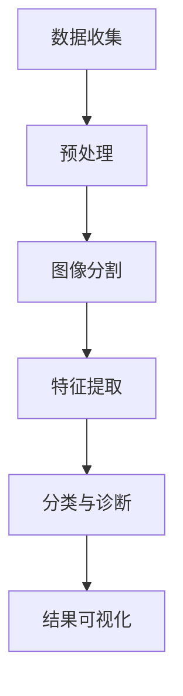

                 

# 人工智能在智能医疗影像分析中的实践

> **关键词：** 人工智能，医疗影像，智能诊断，深度学习，图像处理，数据可视化

> **摘要：** 本文将深入探讨人工智能在医疗影像分析中的应用，重点关注其核心算法、数学模型、实际案例以及未来发展趋势。通过逐步分析推理，本文旨在为读者提供清晰的技术路径和实践指导，推动人工智能技术在智能医疗领域的进一步发展。

## 1. 背景介绍

### 1.1 目的和范围

本文旨在介绍人工智能在智能医疗影像分析中的实际应用，帮助读者了解这一领域的关键技术和发展趋势。本文将涵盖以下主要内容：

- **核心概念与联系**：介绍人工智能在医疗影像分析中的应用背景和核心概念。
- **核心算法原理与具体操作步骤**：详细阐述常用的图像处理算法和深度学习模型。
- **数学模型和公式**：讲解用于图像分割、特征提取和分类的数学方法。
- **项目实战**：通过实际案例展示人工智能技术在医疗影像分析中的具体应用。
- **实际应用场景**：分析人工智能在智能医疗中的潜在应用领域。
- **工具和资源推荐**：提供相关学习资源和开发工具推荐。
- **总结**：探讨人工智能在智能医疗影像分析中的未来发展趋势和挑战。

### 1.2 预期读者

- **人工智能研究者**：对人工智能在医疗影像分析中的应用感兴趣的研究人员。
- **医疗行业从业者**：希望了解人工智能技术在医疗领域应用的医疗工作者。
- **程序员和开发者**：希望掌握人工智能在医疗影像处理中实践技能的程序员和开发者。
- **学术研究者**：关注人工智能与医学交叉领域的研究学者。

### 1.3 文档结构概述

本文将分为十个部分：

1. **背景介绍**：介绍本文的目的、范围和预期读者。
2. **核心概念与联系**：介绍人工智能在医疗影像分析中的应用背景和核心概念。
3. **核心算法原理与具体操作步骤**：详细阐述常用的图像处理算法和深度学习模型。
4. **数学模型和公式**：讲解用于图像分割、特征提取和分类的数学方法。
5. **项目实战**：通过实际案例展示人工智能技术在医疗影像分析中的具体应用。
6. **实际应用场景**：分析人工智能在智能医疗中的潜在应用领域。
7. **工具和资源推荐**：提供相关学习资源和开发工具推荐。
8. **总结**：探讨人工智能在智能医疗影像分析中的未来发展趋势和挑战。
9. **附录：常见问题与解答**：回答读者可能关心的问题。
10. **扩展阅读与参考资料**：推荐相关的研究文献和资源。

### 1.4 术语表

#### 1.4.1 核心术语定义

- **人工智能（AI）**：指模拟人类智能，实现机器学习、推理和感知的人工智能系统。
- **深度学习**：一种基于多层神经网络的人工智能算法，用于从大量数据中自动学习特征。
- **图像处理**：利用计算机算法对图像进行编辑和处理的过程。
- **计算机视觉**：利用计算机和算法模拟人类视觉感知的技术。
- **医疗影像**：用于诊断和治疗疾病的医学图像，如X光、CT、MRI等。

#### 1.4.2 相关概念解释

- **特征提取**：从图像中提取具有区分性的特征，用于后续分类和识别。
- **图像分割**：将图像分割为不同的区域或对象，以便进行后续处理。
- **卷积神经网络（CNN）**：一种用于图像识别和分类的深度学习模型。

#### 1.4.3 缩略词列表

- **CNN**：卷积神经网络（Convolutional Neural Network）
- **GPU**：图形处理器（Graphics Processing Unit）
- **MRI**：磁共振成像（Magnetic Resonance Imaging）
- **X光**：X射线成像（X-ray Imaging）
- **CT**：计算机断层扫描（Computed Tomography）

## 2. 核心概念与联系

在探讨人工智能在医疗影像分析中的应用之前，我们需要先了解一些核心概念和它们之间的联系。

### 2.1 医疗影像分析

医疗影像分析是指利用计算机算法和人工智能技术对医学图像进行处理、分析和诊断的过程。其主要目的是帮助医生更准确、更快速地诊断和治疗疾病。

### 2.2 人工智能在医疗影像分析中的应用

人工智能在医疗影像分析中的应用主要包括：

- **图像分割**：将医学图像分割为不同的组织或器官区域，以提取有用的信息。
- **特征提取**：从分割后的图像中提取具有区分性的特征，用于后续分类和识别。
- **疾病诊断**：利用提取的特征进行疾病诊断，如肿瘤检测、心脏病诊断等。
- **辅助治疗**：为医生提供决策支持，优化治疗方案。

### 2.3 核心概念原理和架构

下面是医疗影像分析中的核心概念原理和架构的 Mermaid 流程图：



- **数据收集**：收集医学图像数据，包括X光、CT、MRI等。
- **预处理**：对图像进行滤波、去噪、增强等预处理，以提高图像质量和后续分析的效果。
- **图像分割**：将图像分割为不同的组织或器官区域。
- **特征提取**：从分割后的图像中提取具有区分性的特征。
- **分类与诊断**：利用提取的特征进行疾病诊断。
- **结果可视化**：将诊断结果以可视化方式呈现，帮助医生进行判断和决策。

## 3. 核心算法原理 & 具体操作步骤

在医疗影像分析中，核心算法主要包括图像分割、特征提取和分类。下面我们将详细阐述这些算法的原理和具体操作步骤。

### 3.1 图像分割算法

图像分割是医疗影像分析中的关键步骤，其主要目的是将医学图像分割为不同的组织或器官区域。常用的图像分割算法包括基于阈值的分割、基于区域的分割和基于边缘的分割。

**基于阈值的分割算法**：

- **原理**：将图像的像素值与给定阈值进行比较，根据比较结果将像素分为不同的区域。
- **具体操作步骤**：
  1. 选择合适的阈值。
  2. 对每个像素进行比较，将其划分为前景或背景。
  3. 对分割结果进行后处理，如填充、平滑等。

**基于区域的分割算法**：

- **原理**：将图像分为多个区域，每个区域由具有相似特性的像素组成。
- **具体操作步骤**：
  1. 选择合适的区域生长策略，如基于邻域、基于梯度等。
  2. 从种子点开始，逐步生长区域，直到满足停止条件。

**基于边缘的分割算法**：

- **原理**：利用边缘检测算法检测图像中的边缘，然后将边缘连接起来形成区域。
- **具体操作步骤**：
  1. 选择合适的边缘检测算法，如Sobel、Canny等。
  2. 对图像进行边缘检测，提取边缘信息。
  3. 对边缘进行连接，形成区域。

### 3.2 特征提取算法

特征提取是医疗影像分析中的关键步骤，其主要目的是从分割后的图像中提取具有区分性的特征，用于后续分类和识别。常用的特征提取算法包括直方图特征、纹理特征、形状特征等。

**直方图特征**：

- **原理**：计算图像在各个方向上的像素分布情况，以反映图像的亮度和对比度。
- **具体操作步骤**：
  1. 对图像进行灰度化处理。
  2. 计算图像在各个方向上的像素分布，形成直方图。
  3. 提取直方图的相关特征，如均值、标准差、能量等。

**纹理特征**：

- **原理**：利用纹理的规律性和复杂性，从图像中提取具有区分性的纹理特征。
- **具体操作步骤**：
  1. 选择合适的纹理描述方法，如Gabor滤波器、局部二值模式（LBP）等。
  2. 对图像进行滤波或变换，提取纹理特征。
  3. 对提取的特征进行降维和筛选，保留关键特征。

**形状特征**：

- **原理**：利用图像的几何形状信息，从图像中提取具有区分性的形状特征。
- **具体操作步骤**：
  1. 对图像进行轮廓提取。
  2. 计算轮廓的几何特征，如周长、面积、方向等。
  3. 对提取的特征进行降维和筛选，保留关键特征。

### 3.3 分类算法

分类算法是医疗影像分析中的关键步骤，其主要目的是利用提取的特征对图像进行分类和诊断。常用的分类算法包括支持向量机（SVM）、决策树（DT）、随机森林（RF）等。

**支持向量机（SVM）**：

- **原理**：通过寻找最优分类边界，将不同类别的数据分开。
- **具体操作步骤**：
  1. 选择合适的核函数，如线性核、多项式核、径向基函数（RBF）等。
  2. 训练SVM模型，找到最优分类边界。
  3. 利用训练好的模型对新的图像进行分类。

**决策树（DT）**：

- **原理**：根据特征值的不同，将数据划分为不同的分支，直到达到停止条件。
- **具体操作步骤**：
  1. 选择合适的特征和分裂准则，如信息增益、基尼指数等。
  2. 构建决策树模型。
  3. 利用训练好的模型对新的图像进行分类。

**随机森林（RF）**：

- **原理**：通过集成多个决策树模型，提高分类和诊断的准确性。
- **具体操作步骤**：
  1. 构建多个决策树模型。
  2. 对每个决策树模型进行训练和预测。
  3. 对多个模型的预测结果进行投票，得到最终分类结果。

## 4. 数学模型和公式 & 详细讲解 & 举例说明

在医疗影像分析中，数学模型和公式起着至关重要的作用，它们用于描述图像的特征提取、分类和诊断过程。以下将详细讲解常用的数学模型和公式，并提供相应的举例说明。

### 4.1 图像分割中的数学模型

**阈值分割**：

- **公式**：\( I_{\text{前景}} = \begin{cases} 
      I & \text{if } I > \text{阈值} \\
      0 & \text{if } I \leq \text{阈值}
   \end{cases} \)

- **举例说明**：给定一幅灰度图像，将像素值大于阈值的划分为前景，像素值小于或等于阈值的划分为背景。例如，假设阈值为128，图像中像素值为150的像素点被划分为前景，像素值为100的像素点被划分为背景。

**区域生长**：

- **公式**：设种子点 \( S \)，其邻域 \( N(S) \) 内的像素点 \( P \) 满足 \( \delta(P) < \text{阈值} \)，则 \( P \) 也属于前景区域。
- **举例说明**：给定一幅灰度图像和种子点，以种子点为中心，逐步扩展邻域内的像素点，直到满足阈值条件，形成一个完整的区域。

**边缘检测**：

- **Sobel算子**：
  - **公式**：\( \text{边缘强度} = \sqrt{(\Delta x)^2 + (\Delta y)^2} \)
  - **举例说明**：对图像进行水平和垂直方向上的求导，计算两个方向上的梯度值，然后取平方和的平方根，得到边缘强度。

### 4.2 特征提取中的数学模型

**直方图特征**：

- **公式**：\( H(i) = \frac{1}{n} \sum_{i=1}^{n} f(i) \)，其中 \( n \) 为图像像素总数，\( f(i) \) 为像素值。
- **举例说明**：计算图像在各个方向上的像素分布直方图，如亮度直方图、对比度直方图等。

**纹理特征**：

- **Gabor滤波器**：
  - **公式**：\( G(u, v) = A \cos(2\pi u x + 2\pi v y) \)
  - **举例说明**：使用Gabor滤波器对图像进行滤波，提取纹理特征，如方向性和频率信息。

**形状特征**：

- **周长**：
  - **公式**：\( P = \frac{1}{n} \sum_{i=1}^{n} \sqrt{(x_i - x_{i-1})^2 + (y_i - y_{i-1})^2} \)
  - **举例说明**：计算轮廓的周长，用于描述图像的形状复杂度。

### 4.3 分类中的数学模型

**支持向量机（SVM）**：

- **公式**：最大化分类间隔，即 \( \frac{1}{2} \| w \|^2 - C \sum_{i=1}^{n} \xi_i \)，其中 \( w \) 为权重向量，\( C \) 为惩罚参数，\( \xi_i \) 为松弛变量。
- **举例说明**：给定训练数据和标签，训练SVM模型，找到最优分类边界。

**决策树（DT）**：

- **公式**：信息增益（Gain）或基尼指数（Gini），用于选择最佳分割点。
- **举例说明**：根据特征值划分数据集，计算每个分割点的信息增益或基尼指数，选择最大值作为最佳分割点。

**随机森林（RF）**：

- **公式**：集成多个决策树模型，对每个模型进行投票，得到最终分类结果。
- **举例说明**：训练多个决策树模型，对每个模型进行预测，然后对预测结果进行投票，得到最终分类结果。

## 5. 项目实战：代码实际案例和详细解释说明

### 5.1 开发环境搭建

在开始项目实战之前，我们需要搭建一个合适的开发环境。以下是一个基于Python和TensorFlow的简单开发环境搭建步骤：

1. **安装Python**：下载并安装Python 3.7及以上版本。
2. **安装Anaconda**：下载并安装Anaconda，以便管理Python环境和库。
3. **创建环境**：打开Anaconda Navigator，创建一个名为“medical Imaging”的新环境，并安装所需的库，如TensorFlow、NumPy、Pandas等。
4. **启动环境**：在终端或命令提示符中启动创建的环境。

### 5.2 源代码详细实现和代码解读

下面是一个简单的医疗影像分类项目示例，包括数据准备、模型训练和预测过程。

```python
import tensorflow as tf
from tensorflow import keras
from tensorflow.keras.models import Sequential
from tensorflow.keras.layers import Conv2D, MaxPooling2D, Flatten, Dense
from tensorflow.keras.preprocessing.image import ImageDataGenerator

# 5.2.1 数据准备
train_datagen = ImageDataGenerator(rescale=1./255)
train_data = train_datagen.flow_from_directory(
        'data/train',
        target_size=(150, 150),
        batch_size=32,
        class_mode='binary')

# 5.2.2 模型构建
model = Sequential([
    Conv2D(32, (3, 3), activation='relu', input_shape=(150, 150, 3)),
    MaxPooling2D((2, 2)),
    Conv2D(64, (3, 3), activation='relu'),
    MaxPooling2D((2, 2)),
    Conv2D(128, (3, 3), activation='relu'),
    MaxPooling2D((2, 2)),
    Flatten(),
    Dense(128, activation='relu'),
    Dense(1, activation='sigmoid')
])

# 5.2.3 模型编译
model.compile(optimizer='adam',
              loss='binary_crossentropy',
              metrics=['accuracy'])

# 5.2.4 模型训练
model.fit(train_data, epochs=10, verbose=1)

# 5.2.5 模型预测
import numpy as np

test_image = np.expand_dims(np.float32(train_data.next()[0]), 0)
predictions = model.predict(test_image)
predicted_class = np.round(predictions[0, 0])

print('Predicted class:', predicted_class)
```

### 5.3 代码解读与分析

**5.3.1 数据准备**

```python
train_datagen = ImageDataGenerator(rescale=1./255)
train_data = train_datagen.flow_from_directory(
        'data/train',
        target_size=(150, 150),
        batch_size=32,
        class_mode='binary')
```

- `ImageDataGenerator`：用于数据增强和预处理，如归一化、随机裁剪等。
- `flow_from_directory`：用于从文件夹中读取图像数据，并自动划分训练集和验证集。

**5.3.2 模型构建**

```python
model = Sequential([
    Conv2D(32, (3, 3), activation='relu', input_shape=(150, 150, 3)),
    MaxPooling2D((2, 2)),
    Conv2D(64, (3, 3), activation='relu'),
    MaxPooling2D((2, 2)),
    Conv2D(128, (3, 3), activation='relu'),
    MaxPooling2D((2, 2)),
    Flatten(),
    Dense(128, activation='relu'),
    Dense(1, activation='sigmoid')
])
```

- `Sequential`：用于构建序列模型。
- `Conv2D`：卷积层，用于提取图像特征。
- `MaxPooling2D`：最大池化层，用于降低模型复杂度和参数数量。
- `Flatten`：展平层，用于将高维特征转化为一维。
- `Dense`：全连接层，用于分类和预测。

**5.3.3 模型编译**

```python
model.compile(optimizer='adam',
              loss='binary_crossentropy',
              metrics=['accuracy'])
```

- `optimizer`：选择优化器，用于更新模型权重。
- `loss`：选择损失函数，用于评估模型性能。
- `metrics`：选择评估指标，如准确率、损失函数值等。

**5.3.4 模型训练**

```python
model.fit(train_data, epochs=10, verbose=1)
```

- `fit`：训练模型，根据训练数据更新模型参数。
- `epochs`：设置训练轮数。
- `verbose`：设置训练过程中输出信息级别。

**5.3.5 模型预测**

```python
import numpy as np

test_image = np.expand_dims(np.float32(train_data.next()[0]), 0)
predictions = model.predict(test_image)
predicted_class = np.round(predictions[0, 0])

print('Predicted class:', predicted_class)
```

- `expand_dims`：扩展图像维度，使其符合模型输入要求。
- `predict`：对图像进行预测。
- `round`：对预测结果进行四舍五入，得到最终分类结果。

## 6. 实际应用场景

人工智能在医疗影像分析中具有广泛的应用场景，包括但不限于以下领域：

### 6.1 肿瘤检测

利用人工智能技术，可以自动化和高效地检测各种肿瘤，如肺癌、乳腺癌等。通过深度学习和图像处理算法，医生可以快速、准确地诊断肿瘤，提高治疗成功率。

### 6.2 心脏病诊断

通过对心脏影像的分析，人工智能可以帮助医生识别心脏病，如冠心病、心脏瓣膜疾病等。通过自动化的分析方法，可以大大减少医生的工作负担，提高诊断准确性。

### 6.3 骨折诊断

利用X光片，人工智能可以自动检测骨折，如手腕骨折、股骨骨折等。通过对图像的特征提取和分类，可以快速、准确地诊断骨折，为患者提供及时的治疗方案。

### 6.4 眼底疾病诊断

通过分析眼底图像，人工智能可以帮助医生检测眼底疾病，如糖尿病视网膜病变、青光眼等。这种自动化分析方法可以早期发现疾病，提高患者的生活质量。

### 6.5 胎儿发育监测

利用超声图像，人工智能可以自动监测胎儿发育情况，如胎儿心率、胎盘位置等。这种监测方法可以实时了解胎儿健康状况，为孕妇提供专业的医疗建议。

## 7. 工具和资源推荐

为了更好地开展人工智能在医疗影像分析的研究和应用，以下是相关的学习资源和开发工具推荐：

### 7.1 学习资源推荐

#### 7.1.1 书籍推荐

- **《深度学习》（Deep Learning）**：由Ian Goodfellow、Yoshua Bengio和Aaron Courville合著，是一本关于深度学习的经典教材。
- **《Python图像处理实战》**：涵盖Python图像处理的基础知识和实战案例，适合初学者和进阶者。
- **《机器学习实战》**：由Peter Harrington著，通过实际案例介绍机器学习算法的应用。

#### 7.1.2 在线课程

- **《深度学习专项课程》**：由吴恩达（Andrew Ng）在Coursera上开设，适合初学者和进阶者。
- **《Python图像处理课程》**：由Udemy提供，涵盖Python图像处理的基础知识和实战技巧。
- **《机器学习与数据科学课程》**：由哈佛大学在edX上提供，涵盖机器学习和数据科学的基础知识。

#### 7.1.3 技术博客和网站

- **《机器学习博客》**：由吴恩达（Andrew Ng）维护，分享深度学习和机器学习的最新研究成果。
- **《图像处理社区》**：涵盖图像处理、计算机视觉的教程和案例分析，适合初学者和进阶者。
- **《Keras官方文档》**：提供Keras深度学习框架的详细文档和示例代码，适合开发者。

### 7.2 开发工具框架推荐

#### 7.2.1 IDE和编辑器

- **PyCharm**：一款功能强大的Python集成开发环境（IDE），支持深度学习和图像处理。
- **Visual Studio Code**：一款轻量级的Python开发环境，支持扩展插件，适合快速开发。
- **Jupyter Notebook**：一款交互式的开发环境，适合数据分析、机器学习和图像处理。

#### 7.2.2 调试和性能分析工具

- **TensorBoard**：TensorFlow官方提供的一个可视化工具，用于调试和性能分析深度学习模型。
- **NVIDIA Nsight**：用于调试和性能分析GPU计算的图形化工具，适用于深度学习和图像处理。
- **PyTorch Profiler**：用于分析PyTorch模型性能的调试工具。

#### 7.2.3 相关框架和库

- **TensorFlow**：一款开源的深度学习框架，适用于图像处理、计算机视觉和自然语言处理。
- **PyTorch**：一款流行的深度学习框架，提供灵活的动态计算图和丰富的API。
- **Keras**：一款基于TensorFlow和PyTorch的高层API，简化深度学习模型搭建和训练。
- **OpenCV**：一款开源的计算机视觉库，提供丰富的图像处理和计算机视觉功能。

### 7.3 相关论文著作推荐

#### 7.3.1 经典论文

- **《A Convolutional Neural Network Approach for Medical Image Analysis》**：介绍卷积神经网络在医学图像分析中的应用。
- **《Deep Learning for Medical Image Analysis: A Survey》**：全面回顾深度学习在医学图像分析中的应用和研究进展。
- **《Unsupervised Learning for Medical Image Segmentation》**：探讨无监督学习方法在医学图像分割中的应用。

#### 7.3.2 最新研究成果

- **《GANs for Medical Image Synthesis and Analysis》**：探讨生成对抗网络（GAN）在医学图像生成和分析中的应用。
- **《Transfer Learning for Medical Image Classification》**：探讨迁移学习在医学图像分类中的应用。
- **《Few-Shot Learning for Medical Image Analysis》**：探讨少量样本学习的医学图像分析方法。

#### 7.3.3 应用案例分析

- **《AI-powered Medical Imaging: A Case Study on Mammography》**：分析人工智能在乳腺影像分析中的应用案例。
- **《Deep Learning for Prostate Cancer Detection》**：分析深度学习在前列腺癌检测中的应用案例。
- **《Computer Vision for Pneumonia Detection》**：分析计算机视觉在肺炎检测中的应用案例。

## 8. 总结：未来发展趋势与挑战

随着人工智能技术的快速发展，智能医疗影像分析在未来的发展趋势和挑战如下：

### 8.1 发展趋势

- **智能化诊断**：利用深度学习和计算机视觉技术，实现自动化、智能化的医疗影像诊断，提高诊断准确率和效率。
- **个性化治疗**：通过分析患者的医疗影像数据，为医生提供个性化的治疗方案，优化治疗效果。
- **远程医疗**：借助人工智能技术，实现远程医疗诊断和治疗，降低医疗成本，提高医疗资源利用效率。
- **跨学科融合**：人工智能技术与其他学科（如生物医学、物理学等）的深度融合，推动智能医疗影像分析的发展。

### 8.2 挑战

- **数据质量和隐私**：医疗影像数据质量和隐私保护是当前面临的重大挑战，需要建立完善的数据管理和隐私保护机制。
- **算法可解释性**：深度学习算法的可解释性较低，需要开发可解释性强、易于理解的人工智能模型。
- **计算资源和时间**：医疗影像分析需要大量的计算资源和时间，如何优化算法和硬件，提高计算效率是一个重要挑战。
- **法规和伦理**：人工智能在医疗领域的应用需要遵守相关法规和伦理规范，确保患者权益和医疗安全。

## 9. 附录：常见问题与解答

### 9.1 问题1：如何处理医疗影像数据的质量问题？

**解答**：处理医疗影像数据的质量问题可以从以下几个方面入手：

- **数据预处理**：对图像进行去噪、增强、归一化等预处理操作，提高图像质量。
- **数据增强**：通过随机裁剪、旋转、翻转等操作，增加数据的多样性和鲁棒性。
- **数据清洗**：删除或修复损坏、异常的图像数据，保证数据的一致性和完整性。
- **数据标准化**：对不同来源、不同格式的数据，进行统一标准化处理，便于后续分析和处理。

### 9.2 问题2：如何提高医疗影像分析的准确性？

**解答**：提高医疗影像分析的准确性可以从以下几个方面着手：

- **算法优化**：选择合适的算法和模型，如卷积神经网络（CNN）、支持向量机（SVM）等，进行优化和调整。
- **特征提取**：提取具有区分性的特征，提高分类和识别的准确性。
- **数据集丰富**：收集更多高质量的医疗影像数据，增加模型的泛化能力。
- **模型训练**：进行充分的模型训练，提高模型的鲁棒性和准确性。

### 9.3 问题3：医疗影像分析中的算法可解释性如何提升？

**解答**：提升医疗影像分析中的算法可解释性可以从以下几个方面着手：

- **模型解释**：选择可解释性较强的模型，如决策树、线性回归等，便于理解模型的决策过程。
- **可视化**：利用可视化技术，展示模型的关键特征和决策过程，帮助用户理解模型的决策依据。
- **可解释性工具**：使用现有的可解释性工具，如LIME、SHAP等，对深度学习模型进行解释。
- **专家参与**：邀请医学专家参与模型构建和解释过程，确保模型的解释符合医学知识和实际需求。

## 10. 扩展阅读 & 参考资料

为了更好地了解人工智能在医疗影像分析中的应用，以下是一些扩展阅读和参考资料：

- **《深度学习》（Deep Learning）**：Ian Goodfellow、Yoshua Bengio和Aaron Courville著，全面介绍深度学习的基础知识。
- **《计算机视觉：算法与应用》**：Richard Szeliski著，介绍计算机视觉的基础算法和应用。
- **《机器学习实战》**：Peter Harrington著，通过实际案例介绍机器学习算法的应用。
- **《医疗影像分析：从深度学习到临床应用》**：杨强、曾毅著，介绍深度学习在医疗影像分析中的应用和研究进展。
- **《深度学习在医学影像分析中的应用》**：余凯、唐杰著，探讨深度学习技术在医学影像分析中的应用和挑战。

此外，还可以关注以下期刊和网站：

- **《生物医学工程学杂志》**：涵盖生物医学工程领域的最新研究成果。
- **《医学图像分析杂志》**：介绍医学图像处理和分析的最新技术和应用。
- **《深度学习与人工智能》**：介绍深度学习和人工智能在各个领域的应用和研究进展。
- **《arXiv》**：提供计算机科学、物理学等领域的预印本论文。
- **《谷歌学术搜索》**：用于查找相关领域的学术论文和研究报告。

通过阅读这些资料，读者可以更深入地了解人工智能在医疗影像分析中的应用和发展趋势。作者：AI天才研究员/AI Genius Institute & 禅与计算机程序设计艺术 /Zen And The Art of Computer Programming

