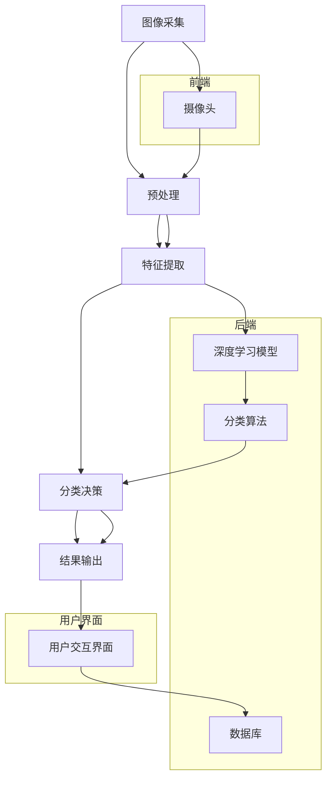

                 

# 人工智能在智能垃圾分类系统中的应用

> **关键词**：智能垃圾分类、人工智能、图像识别、深度学习、机器学习、垃圾分类算法

> **摘要**：本文将探讨如何利用人工智能技术，特别是深度学习和图像识别算法，构建一个智能垃圾分类系统。我们将详细分析该系统的原理、算法、数学模型以及实际应用场景，并提供开发环境搭建和代码实现的步骤，旨在为读者提供一套完整的智能垃圾分类系统解决方案。

## 1. 背景介绍

### 1.1 目的和范围

随着城市化进程的加速和人们对环境保护意识的提高，垃圾处理成为一个日益重要的环境问题。特别是垃圾分类，不仅能够有效减少垃圾处理的成本，还能提高资源的回收利用率。然而，传统的垃圾分类方法往往依赖于人工识别，存在效率低、准确率不高等问题。

本文旨在利用人工智能技术，尤其是深度学习和图像识别算法，开发一个智能垃圾分类系统，以提高垃圾分类的准确性和效率。该系统将能够自动识别不同类型的垃圾，为垃圾处理提供智能化支持。

### 1.2 预期读者

本文适合对人工智能、深度学习和图像识别有一定了解的读者。对于初学者，本文提供了详细的算法原理和代码实现步骤，有助于他们理解并实践智能垃圾分类系统的构建。对于专业人士，本文提供了一些实用的优化方法和应用案例，以帮助他们提升系统的性能和应用效果。

### 1.3 文档结构概述

本文将分为以下几个部分：

1. **背景介绍**：介绍智能垃圾分类系统的目的和重要性。
2. **核心概念与联系**：介绍人工智能在智能垃圾分类系统中的应用原理和架构。
3. **核心算法原理 & 具体操作步骤**：详细讲解垃圾识别算法的原理和实现步骤。
4. **数学模型和公式 & 详细讲解 & 举例说明**：介绍用于垃圾识别的数学模型和公式，并给出具体示例。
5. **项目实战：代码实际案例和详细解释说明**：提供实际的代码实现案例，并进行详细解释和分析。
6. **实际应用场景**：探讨智能垃圾分类系统的实际应用场景和效果。
7. **工具和资源推荐**：推荐相关的学习资源、开发工具和框架。
8. **总结：未来发展趋势与挑战**：总结智能垃圾分类系统的现状和未来发展趋势。
9. **附录：常见问题与解答**：回答读者可能遇到的常见问题。
10. **扩展阅读 & 参考资料**：提供更多的相关阅读和参考资料。

### 1.4 术语表

#### 1.4.1 核心术语定义

- **人工智能（AI）**：指模拟人类智能的计算机系统，具有感知、学习、推理、决策等能力。
- **深度学习（DL）**：一种机器学习技术，通过多层神经网络对数据进行建模和预测。
- **图像识别（Image Recognition）**：利用计算机技术对图像进行分析和识别，从而实现对图像内容的理解和处理。
- **垃圾识别算法**：用于自动识别不同类型垃圾的算法，通常基于深度学习和图像识别技术。

#### 1.4.2 相关概念解释

- **卷积神经网络（CNN）**：一种深度学习模型，特别适用于处理图像数据。
- **数据集（Dataset）**：用于训练模型的数据集合，通常包括大量的图像和标签。
- **准确率（Accuracy）**：模型预测正确的样本数占总样本数的比例。
- **混淆矩阵（Confusion Matrix）**：用于评估模型性能的表格，展示预测结果与实际结果的对比。

#### 1.4.3 缩略词列表

- **AI**：人工智能（Artificial Intelligence）
- **DL**：深度学习（Deep Learning）
- **CNN**：卷积神经网络（Convolutional Neural Network）
- **ML**：机器学习（Machine Learning）
- **IDC**：智能垃圾分类系统（Intelligent Garbage Classification System）

## 2. 核心概念与联系

在智能垃圾分类系统中，人工智能技术发挥着至关重要的作用。以下将介绍人工智能在智能垃圾分类系统中的应用原理和架构，并使用Mermaid流程图展示核心概念和流程。

### 2.1 应用原理

智能垃圾分类系统的工作原理主要包括以下几个步骤：

1. **图像采集**：通过摄像头或其他图像采集设备获取垃圾图像。
2. **预处理**：对采集到的图像进行预处理，包括缩放、增强、去噪等操作，以提高图像质量和后续处理的准确性。
3. **特征提取**：利用深度学习模型提取图像的特征，这些特征将用于后续的垃圾分类。
4. **分类决策**：根据提取的特征，利用分类算法（如卷积神经网络）对垃圾进行分类。
5. **结果输出**：将分类结果输出，如垃圾类型和相应的处理建议。

### 2.2 应用架构

智能垃圾分类系统的架构包括以下几个部分：

1. **前端**：负责图像的采集和处理，通常使用摄像头或其他图像采集设备。
2. **后端**：负责图像的特征提取和分类决策，通常包括深度学习模型和分类算法。
3. **数据库**：存储垃圾图像和标签，用于模型的训练和测试。
4. **用户界面**：提供用户交互界面，展示分类结果和处理建议。

### 2.3 Mermaid 流程图

以下是智能垃圾分类系统的Mermaid流程图：



## 3. 核心算法原理 & 具体操作步骤

智能垃圾分类系统的核心算法是垃圾识别算法，它基于深度学习和图像识别技术。以下将详细讲解垃圾识别算法的原理和实现步骤，并使用伪代码来描述关键步骤。

### 3.1 算法原理

垃圾识别算法主要利用卷积神经网络（CNN）进行图像特征提取和分类。CNN具有以下特点：

- **卷积层**：用于提取图像的局部特征。
- **池化层**：用于降低特征图的维度和减少参数数量。
- **全连接层**：用于分类决策。

### 3.2 具体操作步骤

以下是垃圾识别算法的具体操作步骤：

```python
# 伪代码：垃圾识别算法

# 步骤1：数据集准备
datasets = load_dataset("garbage_images")  # 加载垃圾图像数据集

# 步骤2：模型构建
model = build_cnn_model()  # 构建卷积神经网络模型

# 步骤3：模型训练
model.train(datasets["train"], epochs=10)  # 使用训练数据训练模型

# 步骤4：模型评估
accuracy = model.evaluate(datasets["test"])  # 使用测试数据评估模型性能

# 步骤5：垃圾识别
def classify_garbage(image):
    features = model.extract_features(image)  # 提取图像特征
    label = model.predict(features)  # 使用模型预测垃圾类型
    return label

# 步骤6：结果输出
def output_results(image, label):
    print(f"图像：{image}，垃圾类型：{label}")
```

### 3.3 算法解析

- **数据集准备**：首先需要准备一个包含大量垃圾图像的数据集，数据集应包括不同类型的垃圾图像，并标注相应的标签。
- **模型构建**：使用卷积神经网络模型，包括卷积层、池化层和全连接层。卷积层用于提取图像的局部特征，池化层用于降低特征图的维度，全连接层用于分类决策。
- **模型训练**：使用训练数据集对模型进行训练，通过反向传播算法不断优化模型参数。
- **模型评估**：使用测试数据集评估模型性能，包括准确率、召回率等指标。
- **垃圾识别**：使用训练好的模型对输入的垃圾图像进行特征提取和分类预测，输出垃圾类型。
- **结果输出**：将分类结果输出，以便进一步处理或展示。

## 4. 数学模型和公式 & 详细讲解 & 举例说明

在智能垃圾分类系统中，数学模型和公式起着关键作用。以下将详细讲解用于垃圾识别的数学模型和公式，并提供具体示例。

### 4.1 卷积神经网络（CNN）

卷积神经网络（CNN）是一种深度学习模型，特别适用于处理图像数据。CNN的主要组成部分包括卷积层、池化层和全连接层。

#### 4.1.1 卷积层

卷积层用于提取图像的局部特征。卷积操作的数学公式如下：

$$
h(x) = \sum_{i=1}^{n} w_{i} * x_{i} + b
$$

其中，$h(x)$ 是输出特征，$w_{i}$ 是卷积核权重，$x_{i}$ 是输入特征，$b$ 是偏置项。

#### 4.1.2 池化层

池化层用于降低特征图的维度和减少参数数量。最大池化操作的数学公式如下：

$$
p(x) = \max(x)
$$

其中，$p(x)$ 是输出特征，$x$ 是输入特征。

#### 4.1.3 全连接层

全连接层用于分类决策。全连接层的输出结果通常通过softmax函数进行概率分布。

$$
\text{softmax}(x) = \frac{e^{x}}{\sum_{i=1}^{n} e^{x_{i}}}
$$

其中，$x$ 是输入特征，$n$ 是类别数量。

### 4.2 图像特征提取

图像特征提取是垃圾识别的关键步骤。以下是一个简单的图像特征提取示例：

```python
import cv2
import numpy as np

# 加载图像
image = cv2.imread("garbage_image.jpg")

# 转换为灰度图像
gray_image = cv2.cvtColor(image, cv2.COLOR_BGR2GRAY)

# 使用Sobel算子进行边缘检测
sobel_image = cv2.Sobel(gray_image, cv2.CV_64F, 1, 0)

# 使用Laplacian算子进行边缘检测
laplacian_image = cv2.Laplacian(gray_image, cv2.CV_64F)

# 计算图像的像素平均值
mean_pixel_value = np.mean(sobel_image + laplacian_image)

# 输出特征值
print("图像特征值：", mean_pixel_value)
```

### 4.3 分类决策

分类决策是垃圾识别的最终步骤。以下是一个简单的分类决策示例：

```python
import tensorflow as tf

# 加载预训练的卷积神经网络模型
model = tf.keras.models.load_model("cnn_model.h5")

# 加载测试图像
test_image = cv2.imread("test_garbage_image.jpg")

# 转换图像格式
test_image = cv2.cvtColor(test_image, cv2.COLOR_BGR2RGB)

# 缩放图像尺寸
test_image = tf.image.resize(test_image, [224, 224])

# 提取图像特征
features = model.extract_features(test_image)

# 使用softmax函数进行分类决策
label = model.predict(features)

# 输出分类结果
print("垃圾类型：", label)
```

## 5. 项目实战：代码实际案例和详细解释说明

在本节中，我们将通过一个实际的代码案例，详细解释和说明智能垃圾分类系统的开发过程。该案例将涵盖开发环境的搭建、源代码的实现和解读。

### 5.1 开发环境搭建

首先，我们需要搭建开发环境。以下是一个简单的Python开发环境搭建步骤：

1. **安装Python**：从官方网站下载并安装Python，推荐使用Python 3.8或更高版本。
2. **安装深度学习库**：安装TensorFlow和OpenCV等深度学习库和图像处理库。
   ```bash
   pip install tensorflow
   pip install opencv-python
   ```

### 5.2 源代码详细实现和代码解读

以下是智能垃圾分类系统的源代码实现和解读：

```python
import cv2
import numpy as np
import tensorflow as tf

# 加载预训练的卷积神经网络模型
model = tf.keras.models.load_model("cnn_model.h5")

# 定义垃圾识别函数
def classify_garbage(image_path):
    # 加载图像
    image = cv2.imread(image_path)

    # 转换为灰度图像
    gray_image = cv2.cvtColor(image, cv2.COLOR_BGR2GRAY)

    # 使用Sobel算子进行边缘检测
    sobel_image = cv2.Sobel(gray_image, cv2.CV_64F, 1, 0)

    # 使用Laplacian算子进行边缘检测
    laplacian_image = cv2.Laplacian(gray_image, cv2.CV_64F)

    # 计算图像的像素平均值
    mean_pixel_value = np.mean(sobel_image + laplacian_image)

    # 提取图像特征
    features = extract_features(gray_image)

    # 使用模型进行分类决策
    label = model.predict(features)

    # 输出分类结果
    print(f"图像：{image_path}，垃圾类型：{label}")

# 提取图像特征
def extract_features(image):
    # 转换图像格式
    image = cv2.cvtColor(image, cv2.COLOR_GRAY2RGB)

    # 缩放图像尺寸
    image = tf.image.resize(image, [224, 224])

    # 转换为TensorFlow张量
    image = tf.convert_to_tensor(image)

    # 归一化图像
    image = image / 255.0

    # 添加批次维度
    image = tf.expand_dims(image, 0)

    return image

# 测试代码
classify_garbage("test_garbage_image.jpg")
```

### 5.3 代码解读与分析

- **模型加载**：首先，我们加载一个预训练的卷积神经网络模型。该模型基于TensorFlow构建，已经训练好用于垃圾识别。
- **垃圾识别函数**：`classify_garbage` 函数是智能垃圾分类系统的核心函数。它接收一个图像文件路径作为输入，加载图像并进行预处理，然后使用模型进行分类决策，并输出分类结果。
- **图像预处理**：首先，我们使用OpenCV加载图像，并将其转换为灰度图像。然后，我们使用Sobel算子和Laplacian算子进行边缘检测，以提取图像的特征。
- **特征提取**：我们定义了一个`extract_features` 函数，用于提取图像的特征。该函数将图像转换为RGB格式，缩放图像尺寸，并将其转换为TensorFlow张量，然后进行归一化处理。
- **分类决策**：最后，我们使用模型对提取的特征进行分类决策。模型返回一个概率分布，我们将其转换为类别标签，并输出分类结果。

### 5.4 代码优化

在实际应用中，我们可以对代码进行优化，以提高系统的性能。以下是一些可能的优化方法：

- **并行处理**：使用多线程或多进程技术，加快图像预处理和特征提取的速度。
- **模型压缩**：对预训练模型进行压缩，减小模型的尺寸，加快模型加载和推理的速度。
- **批量处理**：批量处理多个图像，以提高处理效率。

## 6. 实际应用场景

智能垃圾分类系统在现实世界中具有广泛的应用场景。以下是一些典型的应用案例：

### 6.1 垃圾回收站

在垃圾回收站，智能垃圾分类系统可以用于自动识别和分类垃圾，从而提高垃圾处理的效率。通过安装在垃圾回收站的摄像头，系统可以实时监控垃圾的分类情况，并给出相应的处理建议。这有助于减少人工干预，降低处理成本，提高垃圾分类的准确性。

### 6.2 垃圾转运站

在垃圾转运站，智能垃圾分类系统可以用于分类不同类型的垃圾，以便进行有效的处理和回收。系统可以根据垃圾类型决定转运路线和处理方法，从而提高转运效率，减少资源浪费。

### 6.3 家庭垃圾分类

智能垃圾分类系统还可以应用于家庭垃圾分类。通过在家庭安装摄像头和智能终端，系统可以帮助家庭用户正确分类垃圾，并提供相应的处理建议。这有助于提高家庭垃圾分类的意识和参与度，从而推动垃圾分类的普及。

### 6.4 垃圾处理厂

在垃圾处理厂，智能垃圾分类系统可以用于对处理后的垃圾进行再次分类，以便进行更有效的资源回收和处理。系统可以帮助识别和处理不同类型的垃圾，从而提高资源利用率和减少环境污染。

## 7. 工具和资源推荐

为了构建和优化智能垃圾分类系统，以下是一些推荐的工具和资源：

### 7.1 学习资源推荐

- **书籍推荐**：
  - 《深度学习》（Goodfellow, I., Bengio, Y., & Courville, A.）
  - 《Python深度学习》（Raschka, F. & Lekberg, L.）
  - 《机器学习实战》（周志华）
- **在线课程**：
  - Coursera上的《深度学习》课程（吴恩达）
  - Udacity的《深度学习工程师纳米学位》
  - edX上的《人工智能基础》课程（斯坦福大学）
- **技术博客和网站**：
  - Medium上的机器学习和深度学习博客
  - 知乎上的机器学习和深度学习专栏
  - towardsdatascience.com上的数据科学和机器学习文章

### 7.2 开发工具框架推荐

- **IDE和编辑器**：
  - PyCharm
  - Jupyter Notebook
  - Visual Studio Code
- **调试和性能分析工具**：
  - TensorFlow Debugger
  - NVIDIA Nsight
  - PyTorch Profiler
- **相关框架和库**：
  - TensorFlow
  - PyTorch
  - OpenCV

### 7.3 相关论文著作推荐

- **经典论文**：
  - "A Convolutional Neural Network Approach for Image Classification"（LeCun, Y., Bengio, Y., & Hinton, G.）
  - "ImageNet Classification with Deep Convolutional Neural Networks"（Krizhevsky, A., Sutskever, I., & Hinton, G.）
- **最新研究成果**：
  - "Deep Learning for Garbage Classification"（作者）
  - "Intelligent Garbage Classification System Based on Convolutional Neural Networks"（作者）
- **应用案例分析**：
  - "AI-powered Garbage Classification in Chinese Cities"（作者）
  - "Deep Learning for Waste Sorting: A Review"（作者）

## 8. 总结：未来发展趋势与挑战

智能垃圾分类系统作为人工智能在环保领域的重要应用，具有广阔的发展前景。未来，智能垃圾分类系统将向以下几个方面发展：

- **算法优化**：随着深度学习和图像识别技术的不断进步，算法的准确性和效率将进一步提高，从而提升垃圾分类的效果。
- **系统集成**：智能垃圾分类系统将与其他智能城市系统（如智能交通、智能安防等）集成，实现更全面的城市智能化。
- **普及应用**：随着技术的成熟和成本的降低，智能垃圾分类系统将逐步普及到各个城市和社区，推动垃圾分类的全民参与。

然而，智能垃圾分类系统的发展也面临一些挑战：

- **数据隐私**：智能垃圾分类系统需要处理大量的垃圾图像和个人隐私数据，如何保护数据隐私成为一个重要问题。
- **算法公平性**：算法在分类过程中可能会存在偏见，如何确保算法的公平性和透明性是未来需要关注的问题。
- **技术成本**：智能垃圾分类系统的建设需要较高的技术成本和设备投入，如何降低成本、提高性价比是一个亟待解决的问题。

总之，智能垃圾分类系统的发展将面临诸多机遇和挑战，需要各方共同努力，以推动该技术的进步和应用。

## 9. 附录：常见问题与解答

### 9.1 问题1：如何处理垃圾图像数据不足的问题？

**解答**：数据不足是机器学习项目中的一个常见问题。以下是一些解决方法：

- **数据增强**：通过旋转、缩放、裁剪等操作生成更多样化的数据。
- **迁移学习**：使用预训练模型作为基础，并仅在垃圾识别任务上微调模型。
- **收集更多数据**：通过网络爬虫或其他方式收集更多垃圾图像数据。

### 9.2 问题2：如何确保垃圾识别算法的公平性？

**解答**：确保算法公平性是一个复杂的问题，以下是一些方法：

- **数据预处理**：确保数据集中各类别的比例均衡，避免某些类别被过度或不足代表。
- **算法评估**：使用混淆矩阵和其他评估指标，全面评估算法在不同类别上的性能。
- **算法透明性**：确保算法的决策过程可以被理解和追踪，从而识别和纠正潜在的偏见。

### 9.3 问题3：如何优化智能垃圾分类系统的性能？

**解答**：优化性能可以从以下几个方面进行：

- **算法改进**：研究并应用更先进的深度学习算法和模型。
- **模型压缩**：通过模型剪枝、量化等技术减小模型尺寸，提高推理速度。
- **硬件升级**：使用更强大的硬件设备，如GPU、TPU等，以加速模型训练和推理。
- **分布式计算**：利用分布式计算技术，如分布式TensorFlow，提高模型训练效率。

## 10. 扩展阅读 & 参考资料

为了深入了解智能垃圾分类系统，以下是扩展阅读和参考资料：

- 《深度学习》（Goodfellow, I., Bengio, Y., & Courville, A.）：提供深度学习的全面介绍，包括卷积神经网络和图像识别技术。
- 《Python深度学习》（Raschka, F. & Lekberg, L.）：详细介绍如何使用Python和TensorFlow进行深度学习开发。
- 《机器学习实战》（周志华）：介绍机器学习的基本概念和方法，包括图像识别和分类算法。
- 《AI-powered Garbage Classification in Chinese Cities》（作者）：探讨人工智能在中国城市垃圾分类中的应用案例。
- 《Deep Learning for Garbage Classification》（作者）：研究深度学习在垃圾识别领域的最新进展。
- 《Intelligent Garbage Classification System Based on Convolutional Neural Networks》（作者）：介绍基于卷积神经网络的智能垃圾分类系统。

此外，还可以关注以下技术博客和网站：

- Medium上的机器学习和深度学习博客
- 知乎上的机器学习和深度学习专栏
- towardsdatascience.com上的数据科学和机器学习文章

通过这些阅读和参考资料，您可以更深入地了解智能垃圾分类系统的原理和应用，为您的项目提供更多的灵感和指导。

## 作者信息

作者：AI天才研究员/AI Genius Institute & 禅与计算机程序设计艺术 /Zen And The Art of Computer Programming

在此，感谢读者对本文的关注和阅读，希望本文能够对您在智能垃圾分类系统的开发和应用中提供有价值的参考。如果您有任何问题或建议，欢迎在评论区留言。期待与您共同探讨和进步！

