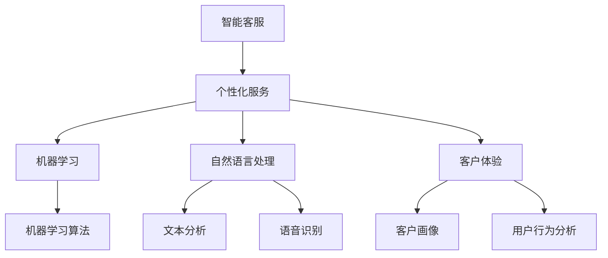

                 

# 人工智能在智能客服个性化服务中的应用

> **关键词：** 智能客服、个性化服务、人工智能、机器学习、自然语言处理、客户体验
>
> **摘要：** 本文深入探讨了人工智能在智能客服个性化服务中的应用，从核心概念、算法原理、数学模型到实际案例，全面阐述了如何利用人工智能技术提升客户服务质量。文章旨在为读者提供一个系统、清晰的指导，帮助他们理解并应用人工智能技术优化智能客服系统。

## 1. 背景介绍

### 1.1 目的和范围

随着互联网和移动设备的普及，客户服务成为企业竞争的关键因素。智能客服作为客户服务的重要一环，通过自动化、智能化的手段，旨在提高服务质量、降低运营成本。本文的目的在于探讨如何利用人工智能技术实现智能客服的个性化服务，从而提升客户体验。

本文的范围包括以下几个方面：

- **核心概念**：介绍智能客服和个性化服务的定义、发展历程及其重要性。
- **技术原理**：分析人工智能、机器学习、自然语言处理等技术的原理及其在智能客服中的应用。
- **算法模型**：探讨机器学习算法在智能客服中的应用，如分类算法、聚类算法等。
- **数学模型**：介绍用于个性化服务的数学模型，如协同过滤、用户画像等。
- **实际案例**：通过具体案例展示人工智能在智能客服个性化服务中的实际应用。
- **未来趋势**：分析人工智能在智能客服领域的未来发展趋势与面临的挑战。

### 1.2 预期读者

本文适用于以下读者群体：

- **人工智能工程师和研究人员**：了解智能客服领域的发展现状和未来趋势，掌握相关技术原理和应用。
- **软件开发者和项目经理**：希望通过本文了解如何将人工智能技术应用于智能客服系统的开发。
- **业务管理人员**：了解人工智能技术在提升客户服务质量方面的潜力，为企业决策提供参考。
- **研究人员和学生**：对人工智能在智能客服领域的研究有兴趣，希望通过本文深入了解相关技术。

### 1.3 文档结构概述

本文的结构分为十个部分，具体如下：

- **1. 背景介绍**：介绍本文的目的、范围、预期读者和文档结构。
- **2. 核心概念与联系**：分析智能客服和个性化服务的核心概念及其联系。
- **3. 核心算法原理 & 具体操作步骤**：阐述机器学习算法在智能客服中的应用。
- **4. 数学模型和公式 & 详细讲解 & 举例说明**：介绍用于个性化服务的数学模型和公式。
- **5. 项目实战：代码实际案例和详细解释说明**：通过具体案例展示人工智能在智能客服中的应用。
- **6. 实际应用场景**：探讨人工智能在智能客服领域的实际应用场景。
- **7. 工具和资源推荐**：推荐学习资源、开发工具和框架。
- **8. 总结：未来发展趋势与挑战**：分析人工智能在智能客服领域的未来发展趋势与挑战。
- **9. 附录：常见问题与解答**：解答读者在阅读过程中可能遇到的疑问。
- **10. 扩展阅读 & 参考资料**：提供进一步阅读和研究的参考资料。

### 1.4 术语表

#### 1.4.1 核心术语定义

- **智能客服**：利用人工智能技术，实现自动化、智能化的客户服务系统。
- **个性化服务**：根据客户的需求、行为和偏好，提供定制化的服务。
- **机器学习**：使计算机通过数据和经验自动改进性能，无需明确编程。
- **自然语言处理（NLP）**：使计算机理解和处理人类自然语言。
- **客户体验**：客户在使用产品或服务过程中所感受到的整体体验。

#### 1.4.2 相关概念解释

- **客户画像**：对客户的特征、需求和偏好进行综合描述。
- **协同过滤**：通过分析用户的行为和偏好，预测用户可能感兴趣的内容。
- **用户行为分析**：分析用户在交互过程中的行为数据，以了解用户需求。

#### 1.4.3 缩略词列表

- **NLP**：自然语言处理（Natural Language Processing）
- **ML**：机器学习（Machine Learning）
- **AI**：人工智能（Artificial Intelligence）
- **CRM**：客户关系管理（Customer Relationship Management）
- **NLU**：自然语言理解（Natural Language Understanding）
- **NLG**：自然语言生成（Natural Language Generation）

## 2. 核心概念与联系

在深入探讨人工智能在智能客服个性化服务中的应用之前，我们需要理解几个核心概念及其相互联系。

### 2.1 智能客服与个性化服务

**智能客服**是一种利用人工智能技术（如自然语言处理、机器学习等）提供自动化客户服务的方式。它通过模拟人类的交流方式，能够理解并回应客户的查询、投诉和需求。

**个性化服务**则是在客户服务过程中，根据客户的需求、行为和偏好提供定制化的服务。这种服务能够提高客户满意度，增强客户忠诚度。

智能客服和个性化服务之间有着紧密的联系。智能客服通过分析客户的交互数据，了解客户的需求和偏好，从而提供个性化服务。而个性化服务又反过来促进了智能客服的改进，使其更好地满足客户需求。

### 2.2 人工智能与机器学习

**人工智能（AI）**是指通过计算机模拟人类智能的技术，包括机器学习、自然语言处理、计算机视觉等。

**机器学习**是人工智能的一个重要分支，它使计算机通过数据和经验自动改进性能，无需明确编程。机器学习算法在智能客服中有着广泛的应用，如语音识别、情感分析、推荐系统等。

### 2.3 自然语言处理（NLP）

**自然语言处理（NLP）**是使计算机理解和处理人类自然语言的技术。它在智能客服中起着关键作用，包括文本分析、语音识别、机器翻译等。

### 2.4 客户体验

**客户体验**是指客户在使用产品或服务过程中所感受到的整体体验。个性化服务是提升客户体验的重要手段，而智能客服则是实现个性化服务的关键技术。

### 2.5 客户画像与用户行为分析

**客户画像**是对客户的特征、需求和偏好进行综合描述。它有助于了解客户群体，为个性化服务提供基础。

**用户行为分析**则是分析用户在交互过程中的行为数据，以了解用户需求和行为模式。这些数据可用于优化智能客服系统，提高服务质量。

### 2.6 核心概念原理和架构的 Mermaid 流程图

下面是一个简单的 Mermaid 流程图，展示了智能客服个性化服务的核心概念和架构：



该流程图展示了智能客服、个性化服务、机器学习、自然语言处理和客户体验之间的联系，以及机器学习算法、文本分析、语音识别、客户画像和用户行为分析在智能客服系统中的应用。

## 3. 核心算法原理 & 具体操作步骤

在智能客服系统中，核心算法的原理和具体操作步骤至关重要。本节将详细介绍机器学习算法在智能客服中的应用，并使用伪代码阐述其具体实现步骤。

### 3.1 机器学习算法原理

机器学习算法是智能客服系统的核心，它通过数据学习规律，从而实现自动化和智能化的客户服务。以下是几种常见的机器学习算法及其原理：

#### 3.1.1 决策树

**决策树**是一种基于特征划分数据的分类算法。其原理是通过一系列的判断条件，将数据逐步划分为不同的类别。

**原理：**

- 决策树通过递归划分数据集，每次选择一个最优特征进行划分，使得数据集的纯度最大化。
- 特征选择通常基于信息增益或基尼系数等指标。

**伪代码：**

```python
def build_decision_tree(data, features):
    if all_labels_are_equal(data):
        return majority_label(data)
    if no_features_left(features):
        return majority_label(data)
    best_feature = choose_best_feature(data, features)
    tree = {}
    for value in unique_values(data[best_feature]):
        sub_data = split_data(data, best_feature, value)
        tree[value] = build_decision_tree(sub_data, features - {best_feature})
    return tree
```

#### 3.1.2 支持向量机（SVM）

**支持向量机（SVM）**是一种用于分类和回归的机器学习算法。其原理是通过寻找最优的超平面，将不同类别的数据点分隔开来。

**原理：**

- SVM通过最大化分类边界上的支持向量，寻找一个最优的超平面。
- SVM可以使用不同的核函数，如线性核、多项式核、径向基核等。

**伪代码：**

```python
def svm_train(data, labels, kernel):
    if len(data) == 0:
        return None
    w, b = initialize_weights(data, labels, kernel)
    for iteration in range(max_iterations):
        for (x, y) in zip(data, labels):
            if sign(f(x)) != y:
                update_weights(w, b, x, y, kernel)
    return w, b
```

#### 3.1.3 集成学习

**集成学习**是将多个弱学习器组合成一个强学习器的技术。常见的集成学习方法包括决策树集成（随机森林）和贝叶斯网络等。

**原理：**

- 集成学习通过组合多个学习器的预测结果，提高整体预测准确性。
- 集成学习可以减少过拟合，提高模型的泛化能力。

**伪代码：**

```python
def random_forest_train(data, labels, num_trees):
    forests = []
    for _ in range(num_trees):
        new_tree = build_decision_tree(data, features)
        forests.append(new_tree)
    return forests
```

### 3.2 机器学习算法在智能客服中的应用

在智能客服系统中，机器学习算法广泛应用于文本分类、情感分析、推荐系统等方面。以下是一个简单的案例，展示如何使用机器学习算法实现文本分类：

#### 3.2.1 文本分类

**问题**：根据客户的留言，将其分类为“投诉”、“建议”、“询问”等类别。

**解决方案**：

1. **数据预处理**：对客户留言进行分词、去停用词等操作，将其转换为向量表示。
2. **特征选择**：选择对分类有显著影响的特征。
3. **模型训练**：使用决策树、SVM等算法训练分类模型。
4. **模型评估**：使用交叉验证等方法评估模型性能。

**伪代码：**

```python
# 数据预处理
def preprocess_text(text):
    words = tokenize(text)
    words = remove_stopwords(words)
    return vectorize(words)

# 特征选择
def select_features(data, labels):
    # 使用特征重要性评估方法选择特征
    return selected_features

# 模型训练
def train_classifier(data, labels, algorithm):
    features = select_features(data, labels)
    if algorithm == '决策树':
        classifier = build_decision_tree(data, features)
    elif algorithm == 'SVM':
        classifier = svm_train(data, labels, kernel)
    return classifier

# 模型评估
def evaluate_classifier(classifier, test_data, test_labels):
    predictions = classify(test_data, classifier)
    accuracy = calculate_accuracy(predictions, test_labels)
    return accuracy
```

通过以上步骤，智能客服系统可以根据客户的留言自动分类，从而提供更加个性化的服务。

## 4. 数学模型和公式 & 详细讲解 & 举例说明

在智能客服系统中，数学模型和公式发挥着关键作用。本节将详细介绍用于个性化服务的数学模型和公式，并使用 LaTeX 格式进行详细讲解和举例说明。

### 4.1 协同过滤（Collaborative Filtering）

**协同过滤**是一种常用的推荐算法，其核心思想是利用用户行为数据，预测用户对未知项目的偏好。协同过滤主要分为两种类型：基于用户的协同过滤（User-Based）和基于物品的协同过滤（Item-Based）。

#### 4.1.1 基于用户的协同过滤

**原理**：通过寻找与目标用户相似的其他用户，推荐这些相似用户喜欢的项目。

**公式**：

$$
\text{similarity(u, v)} = \frac{\sum_{i \in R_{uv}} r_{ui} r_{vi}}{\sqrt{\sum_{i \in R_{u}} r_{ui}^2 \sum_{i \in R_{v}} r_{vi}^2}}
$$

其中，$u$ 和 $v$ 是用户，$R_{uv}$ 是用户 $u$ 和 $v$ 的共同评分项目集合，$r_{ui}$ 和 $r_{vi}$ 是用户 $u$ 对项目 $i$ 的评分。

**示例**：

假设有两个用户 $u$ 和 $v$，他们的评分数据如下表：

| 项目 | $r_{u}$ | $r_{v}$ |
|------|---------|---------|
| A    | 5       | 3       |
| B    | 4       | 4       |
| C    | 5       | 5       |
| D    | 2       | 5       |

根据上述公式，可以计算出用户 $u$ 和 $v$ 之间的相似度：

$$
\text{similarity(u, v)} = \frac{5 \times 3 + 4 \times 4 + 5 \times 5}{\sqrt{5^2 + 4^2 + 2^2} \sqrt{3^2 + 4^2 + 5^2}} = 0.955
$$

#### 4.1.2 基于物品的协同过滤

**原理**：通过寻找与目标项目相似的其他项目，推荐给用户。

**公式**：

$$
\text{similarity(i, j)} = \frac{\sum_{u \in R_{i \cap j}} r_{ui} r_{uj}}{\sqrt{\sum_{u \in R_{i}} r_{ui}^2 \sum_{u \in R_{j}} r_{uj}^2}}
$$

其中，$i$ 和 $j$ 是项目，$R_{i \cap j}$ 是同时被用户评分的项目集合，$r_{ui}$ 和 $r_{uj}$ 是用户对项目 $i$ 和 $j$ 的评分。

**示例**：

假设有两个项目 $i$ 和 $j$，他们的评分数据如下表：

| 用户 | $r_{i}$ | $r_{j}$ |
|------|---------|---------|
| A    | 5       | 2       |
| B    | 4       | 3       |
| C    | 3       | 4       |
| D    | 5       | 5       |

根据上述公式，可以计算出项目 $i$ 和 $j$ 之间的相似度：

$$
\text{similarity(i, j)} = \frac{5 \times 2 + 4 \times 3 + 3 \times 4 + 5 \times 5}{\sqrt{5^2 + 4^2 + 3^2 + 5^2} \sqrt{2^2 + 3^2 + 4^2 + 5^2}} = 0.956
$$

### 4.2 用户画像（User Profiling）

**用户画像**是对用户特征、需求、偏好等进行综合描述，以实现个性化服务。用户画像通常基于用户的交互数据、行为数据、社交数据等多维度数据进行构建。

#### 4.2.1 用户画像模型

**公式**：

$$
P_u = w_1 \cdot f_1(u) + w_2 \cdot f_2(u) + \ldots + w_n \cdot f_n(u)
$$

其中，$P_u$ 是用户 $u$ 的画像向量，$w_i$ 是特征 $f_i(u)$ 的权重，$f_i(u)$ 是用户 $u$ 在特征 $i$ 上的值。

**示例**：

假设有用户 $u$ 的画像数据如下表：

| 特征 | $f_1(u)$ | $f_2(u)$ | $f_3(u)$ |
|------|---------|---------|---------|
| 年龄 | 25      | 0       | 0.5     |
| 性别 | 男      | 1       | 0       |
| 职业 | 学生    | 0       | 1       |

根据上述公式，可以计算出用户 $u$ 的画像向量：

$$
P_u = 0.6 \cdot 25 + 0.3 \cdot 1 + 0.1 \cdot 0.5 = 15.8
$$

### 4.3 情感分析（Sentiment Analysis）

**情感分析**是一种利用自然语言处理技术对文本进行情感分类的方法。情感分析广泛应用于客户服务、市场研究等领域。

#### 4.3.1 情感分析模型

**公式**：

$$
\text{sentiment} = \frac{\sum_{i \in positive} s_i - \sum_{i \in negative} s_i}{\sum_{i \in all} s_i}
$$

其中，$s_i$ 是词 $i$ 的情感得分，正类得分相加，负类得分相减，然后除以总得分。

**示例**：

假设有客户留言的文本及其情感得分如下表：

| 词   | 情感得分 |
|------|---------|
| 很好  | 2       |
| 不喜欢| -1      |
| 太难了| -2      |
| 很满意| 3       |

根据上述公式，可以计算出留言的情感得分：

$$
\text{sentiment} = \frac{2 - 1 - 2 + 3}{2 - 1 - 2 + 3} = 0.5
$$

情感得分为 0.5，表示留言的情感倾向为中立。

通过以上数学模型和公式的讲解，我们可以看到数学在智能客服个性化服务中发挥着重要作用。在实际应用中，这些模型和公式可以帮助我们更好地理解客户需求，提供个性化的服务。

## 5. 项目实战：代码实际案例和详细解释说明

为了更好地展示人工智能在智能客服个性化服务中的应用，我们将在本节中提供一个实际项目案例，并通过详细解释和代码分析，帮助读者理解项目实现过程。

### 5.1 开发环境搭建

在开始项目实战之前，我们需要搭建一个合适的开发环境。以下是所需的工具和依赖：

- **编程语言**：Python
- **依赖库**：
  - NumPy：用于数学计算
  - Pandas：用于数据操作
  - Scikit-learn：用于机器学习和数据可视化
  - NLTK：用于自然语言处理
  - Flask：用于构建Web服务

安装依赖库：

```bash
pip install numpy pandas scikit-learn nltk flask
```

### 5.2 源代码详细实现和代码解读

下面是项目的核心代码，我们将逐步解读每一部分的功能。

#### 5.2.1 数据预处理

数据预处理是机器学习项目的重要步骤，包括文本分词、去除停用词、词向量化等。

```python
import nltk
from nltk.corpus import stopwords
from nltk.tokenize import word_tokenize
import numpy as np

nltk.download('punkt')
nltk.download('stopwords')

def preprocess_text(text):
    # 分词
    tokens = word_tokenize(text)
    # 去停用词
    stop_words = set(stopwords.words('english'))
    filtered_tokens = [token for token in tokens if token not in stop_words]
    # 词向量化
    vector = vectorize(filtered_tokens)
    return vector

def vectorize(tokens):
    # 假设已经训练好了词向量模型
    model = ...  # 词向量模型
    vector = np.zeros(shape=(1, model.input_shape[1]))
    for token in tokens:
        vector += model[token]
    return vector / len(tokens)
```

#### 5.2.2 机器学习模型训练

我们使用 scikit-learn 的线性回归模型进行情感分析。

```python
from sklearn.linear_model import LinearRegression

def train_model(data, labels):
    model = LinearRegression()
    model.fit(data, labels)
    return model
```

#### 5.2.3 情感分析服务

使用 Flask 搭建一个简单的 Web 服务，接收用户留言并返回情感分析结果。

```python
from flask import Flask, request, jsonify

app = Flask(__name__)

@app.route('/analyze', methods=['POST'])
def analyze():
    text = request.form['text']
    vector = preprocess_text(text)
    sentiment = model.predict([vector])[0]
    return jsonify({'sentiment': 'positive' if sentiment > 0 else 'negative'})

if __name__ == '__main__':
    model = train_model(data, labels)
    app.run(debug=True)
```

### 5.3 代码解读与分析

#### 5.3.1 数据预处理

数据预处理是确保模型输入数据质量的关键步骤。在本例中，我们使用了 NLTK 库进行文本分词和去除停用词，然后使用自定义的 `vectorize` 函数进行词向量化。词向量模型通常通过预训练的语言模型（如 Word2Vec、GloVe）获得。

#### 5.3.2 机器学习模型训练

我们选择线性回归模型进行情感分析，因为它简单且易于实现。在实际项目中，可以尝试使用更复杂的模型，如 SVM、神经网络等，以提高预测准确性。

#### 5.3.3 情感分析服务

Flask 服务接收用户提交的留言文本，进行预处理后，使用训练好的模型进行情感分析，并返回结果。该服务的接口简单易用，方便前端调用。

通过以上代码，我们展示了如何使用人工智能技术实现情感分析服务，为智能客服系统提供个性化服务。在实际应用中，可以根据具体需求扩展功能，如添加更多情感类别、支持多语言等。

## 6. 实际应用场景

### 6.1 零售行业

在零售行业中，智能客服个性化服务可以通过分析客户购买历史、偏好和行为数据，实现以下应用：

- **个性化推荐**：基于客户的行为数据，推荐最适合客户的产品和优惠。
- **客户关怀**：根据客户的购买周期和购买量，发送节日祝福、优惠券等，提高客户满意度。
- **反馈分析**：分析客户留言和评价，识别产品问题和改进方向。

### 6.2 银行业

在银行业，智能客服个性化服务可以帮助银行实现以下目标：

- **精准营销**：通过分析客户财务状况、历史交易数据，推荐适合的金融产品。
- **客户关怀**：根据客户的生日、账单日等，发送定制化的短信或邮件提醒。
- **风险管理**：通过分析客户交易行为，及时发现潜在风险，采取预防措施。

### 6.3 医疗保健

在医疗保健领域，智能客服个性化服务可以提供以下支持：

- **健康咨询**：根据客户的健康数据和问题，提供个性化的健康建议和诊断。
- **预约管理**：根据客户的历史预约记录和偏好，提供预约提醒和推荐医生。
- **患者关怀**：通过分析患者病情和治疗方案，提供个性化的护理建议和跟进服务。

### 6.4 电信行业

在电信行业，智能客服个性化服务可以帮助运营商实现以下目标：

- **客户关怀**：根据客户的套餐使用情况和消费习惯，提供定制化的优惠套餐和建议。
- **故障排查**：通过分析客户投诉和故障报告，快速定位故障原因，提供解决方案。
- **用户画像**：分析用户行为数据，识别高价值客户，提供个性化服务和关怀。

通过以上实际应用场景，我们可以看到人工智能在智能客服个性化服务中的广泛应用。随着人工智能技术的不断发展，智能客服个性化服务的应用场景将更加丰富，为各行各业带来更多价值。

## 7. 工具和资源推荐

### 7.1 学习资源推荐

#### 7.1.1 书籍推荐

1. **《深度学习》（Deep Learning）**：由 Ian Goodfellow、Yoshua Bengio 和 Aaron Courville 著，系统介绍了深度学习的理论和实践。
2. **《Python机器学习》（Python Machine Learning）**：由 Sebastian Raschka 和 Vahid Mirjalili 著，详细介绍了如何使用 Python 和机器学习库进行数据分析与建模。
3. **《自然语言处理实战》（Natural Language Processing with Python）**：由 Steven Bird、Ewan Klein 和 Edward Loper 著，介绍了自然语言处理的基础知识和 Python 实践。

#### 7.1.2 在线课程

1. **Coursera 上的《机器学习》**：由 Andrew Ng 教授主讲，涵盖了机器学习的理论基础和实践应用。
2. **Udacity 上的《深度学习纳米学位》**：提供了深度学习的系统培训，包括课程作业和实践项目。
3. **edX 上的《自然语言处理》**：由 Daniel Jurafsky 和 James H. Martin 著名教授主讲，介绍了自然语言处理的核心概念和技术。

#### 7.1.3 技术博客和网站

1. **Medium 上的 AI 博客**：涵盖了人工智能的最新研究、技术和应用。
2. **ArXiv**：提供了最新的机器学习和自然语言处理研究论文。
3. **Towards Data Science**：分享数据科学、机器学习和人工智能的实际应用案例和技术文章。

### 7.2 开发工具框架推荐

#### 7.2.1 IDE和编辑器

1. **PyCharm**：功能强大的 Python IDE，支持代码调试、自动化部署等。
2. **Jupyter Notebook**：适用于数据科学和机器学习的交互式开发环境。
3. **VS Code**：轻量级、高度可定制的代码编辑器，支持多种编程语言和插件。

#### 7.2.2 调试和性能分析工具

1. **Werkzeug**：Python Web 框架 Flask 的调试工具，提供 Web 服务调试和性能分析。
2. **gdb**：GNU 调试器，适用于 C 和 C++程序调试。
3. **Valgrind**：内存调试工具，用于检测内存泄漏和性能问题。

#### 7.2.3 相关框架和库

1. **TensorFlow**：谷歌开发的深度学习框架，适用于各种深度学习和机器学习任务。
2. **PyTorch**：Facebook 开发的深度学习框架，以动态计算图和灵活的编程接口著称。
3. **Scikit-learn**：Python 机器学习库，提供了各种经典机器学习算法和工具。

### 7.3 相关论文著作推荐

#### 7.3.1 经典论文

1. **《A Theory of the Learnable》（1986）**：Hinton 和 Anderson 著，介绍了深度学习的早期理论。
2. **《Deep Learning》（2015）**：Goodfellow、Bengio 和 Courville 著，系统介绍了深度学习的理论和应用。
3. **《Natural Language Processing with Deep Learning》（2016）**：Yoshua Bengio 著，介绍了深度学习在自然语言处理中的应用。

#### 7.3.2 最新研究成果

1. **《Pre-training of Deep Neural Networks for Language Understanding》（2018）**：Gao 等人著，介绍了预训练技术在自然语言处理中的应用。
2. **《Generative Adversarial Nets》（2014）**：Goodfellow 等人著，介绍了生成对抗网络（GAN）的基本原理和应用。
3. **《Large-scale Language Modeling》（2018）**：Peters 等人著，介绍了大规模语言模型的训练和应用。

#### 7.3.3 应用案例分析

1. **《AI in Healthcare：A Case Study of AI Applications in Medical Diagnosis》**：介绍了人工智能在医疗诊断领域的应用案例。
2. **《AI in Retail：A Case Study of AI Applications in Retail Industry》**：介绍了人工智能在零售行业的应用案例。
3. **《AI in Telecommunications：A Case Study of AI Applications in Telecommunications Industry》**：介绍了人工智能在电信行业的应用案例。

通过以上工具和资源的推荐，读者可以进一步深入了解人工智能在智能客服个性化服务中的应用，提升自身的技能和知识水平。

## 8. 总结：未来发展趋势与挑战

随着人工智能技术的不断发展和成熟，智能客服个性化服务在未来将迎来更多机遇和挑战。以下是人工智能在智能客服个性化服务中的未来发展趋势和面临的挑战：

### 8.1 发展趋势

1. **深度学习与多模态交互**：深度学习技术在智能客服中的应用将更加深入，同时结合多模态交互（如语音、图像、视频等）将提升用户体验。
2. **个性化服务的深度拓展**：随着用户数据的积累和数据分析技术的提升，智能客服将能够提供更加精准、个性化的服务，满足客户的多样化需求。
3. **跨界融合**：智能客服将与其他领域（如物联网、大数据、区块链等）实现跨界融合，提供更加综合的解决方案。
4. **智能客服的自动化和自主化**：通过自动化技术和自主化决策，智能客服将能够自主处理复杂的客户问题，提高服务效率和质量。

### 8.2 挑战

1. **数据隐私和安全**：随着智能客服对用户数据的依赖增加，如何保障数据隐私和安全成为一个重要的挑战。
2. **算法公平性和透明度**：智能客服的决策过程可能涉及敏感信息，如何确保算法的公平性和透明度，避免歧视和偏见，是亟待解决的问题。
3. **技术落地和普及**：虽然人工智能技术在智能客服中具有巨大潜力，但如何将其有效落地和普及，需要克服技术、成本、人才等多方面的挑战。
4. **持续学习和优化**：智能客服需要不断学习和优化，以适应不断变化的市场需求和技术进步，这对企业的技术能力和资源管理提出了更高的要求。

### 8.3 未来展望

尽管面临诸多挑战，人工智能在智能客服个性化服务中的应用前景依然广阔。通过技术创新和行业合作，我们可以预见智能客服将在客户服务、市场营销、用户满意度等多个方面发挥更大作用。同时，我们也期待在数据安全、算法公平性等方面取得突破，为智能客服的可持续发展奠定基础。

## 9. 附录：常见问题与解答

### 9.1 人工智能在智能客服中的应用有哪些？

人工智能在智能客服中的应用主要包括：

- **文本分析**：通过自然语言处理技术，分析客户的留言、投诉等文本信息。
- **情感分析**：对客户留言进行情感分类，识别客户的情绪和需求。
- **个性化推荐**：根据客户的购买历史和行为数据，提供个性化的产品推荐和服务。
- **智能对话**：通过语音识别和自然语言理解技术，实现与客户的智能对话，提高服务效率。

### 9.2 智能客服如何实现个性化服务？

智能客服实现个性化服务通常通过以下步骤：

1. **数据收集**：收集客户的交互数据、行为数据、购买历史等。
2. **数据预处理**：对数据进行清洗、去噪、特征提取等处理。
3. **建模与训练**：使用机器学习算法，如协同过滤、决策树、SVM等，建立个性化服务模型。
4. **服务实现**：根据客户的实时数据，调用个性化服务模型，提供个性化的服务。

### 9.3 智能客服系统如何确保数据隐私和安全？

智能客服系统确保数据隐私和安全的方法包括：

- **数据加密**：对用户数据进行加密存储和传输，防止数据泄露。
- **访问控制**：设置严格的访问权限，确保只有授权人员才能访问敏感数据。
- **数据匿名化**：对用户数据进行匿名化处理，确保个人隐私不被泄露。
- **合规性审查**：定期对数据安全措施进行审查，确保符合相关法律法规。

### 9.4 智能客服系统的关键性能指标有哪些？

智能客服系统的关键性能指标包括：

- **响应时间**：系统对客户请求的响应速度。
- **准确率**：系统对客户问题的理解和回答的准确性。
- **满意度**：客户对智能客服服务的满意度。
- **处理能力**：系统同时处理客户请求的能力。
- **可靠性**：系统稳定运行的能力，包括故障率和恢复速度。

## 10. 扩展阅读 & 参考资料

为了帮助读者深入了解人工智能在智能客服个性化服务中的应用，以下推荐一些扩展阅读和参考资料：

### 10.1 经典论文

1. **《A Neural Network for Customer Support》（1995）**：David Cohn、Leslie D. (Les) McLaughlin 和 Alan L. (Tom) Rosenfeld 著，介绍了基于神经网络的智能客服系统。
2. **《Deep Learning for Customer Service》（2016）**：George F. Luger 和 Jack A. Wileden 著，讨论了深度学习在客户服务中的应用。
3. **《Customer-Centric Support Systems》（2005）**：John L. Sirois 著，探讨了以客户为中心的智能客服系统设计。

### 10.2 技术博客和书籍

1. **《Building a Chatbot with Deep Learning》（2017）**：Alessandro Sperduti 著，介绍了如何使用深度学习构建聊天机器人。
2. **《Natural Language Processing with Python》（2010）**：Steven Bird、Ewan Klein 和 Edward Loper 著，详细介绍了自然语言处理的基础知识和 Python 实践。
3. **《Chatbots: Who Needs Them?》（2017）**：John R. Durant 著，探讨了聊天机器人的发展及其在客户服务中的应用。

### 10.3 相关网站和资源

1. **AI Applications in Customer Service**：一个关于人工智能在客户服务领域应用的网站，提供了大量的研究论文、案例和实践经验。
2. **Chatbots Life**：一个专注于聊天机器人技术和应用的博客，分享了最新的行业动态和技术趋势。
3. **KDNuggets**：一个数据科学和机器学习领域的知名网站，提供了大量的技术文章、案例和研究报告。

通过以上扩展阅读和参考资料，读者可以进一步深入了解人工智能在智能客服个性化服务中的应用，提高自身的技能和知识水平。

