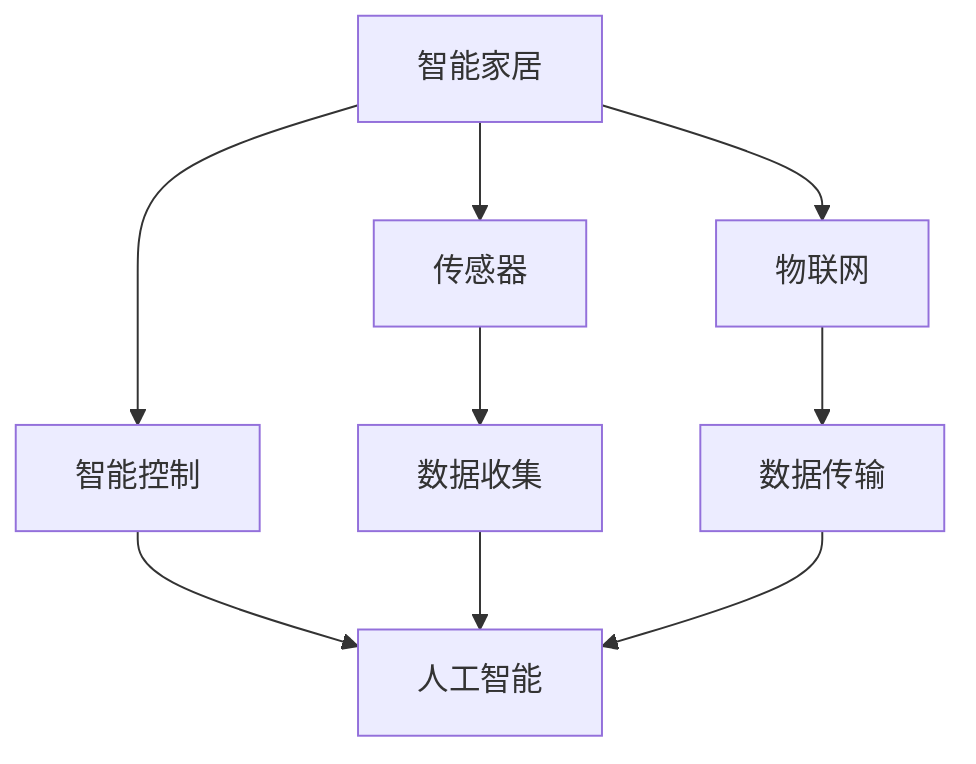

                 

# 人工智能在智能家居中的应用与挑战

> **关键词：** 人工智能、智能家居、机器学习、深度学习、智能控制、数据分析、安全性、隐私保护

> **摘要：** 本文将深入探讨人工智能在智能家居中的应用，从核心技术原理、实际应用案例、工具资源推荐等多个角度，分析其在提升生活质量、改善居住环境、优化能源管理等方面的巨大潜力。同时，本文也将探讨人工智能在智能家居领域面临的一系列挑战，包括安全性、隐私保护和伦理问题，以期为业界提供有益的参考。

## 1. 背景介绍

### 1.1 目的和范围

本文旨在全面分析人工智能在智能家居中的应用现状及其面临的挑战。我们将探讨人工智能如何通过机器学习和深度学习技术，改善家居设备的功能，提升用户体验，并探讨实现这些功能的技术原理和具体操作步骤。同时，本文也将重点关注智能家居系统中的安全性、隐私保护以及伦理问题，以期提供一个全面且深入的视角。

### 1.2 预期读者

本文适合对智能家居和人工智能技术有一定了解的技术人员、科研人员以及对智能家居行业感兴趣的读者。通过本文的阅读，读者可以全面了解人工智能在智能家居中的应用场景、核心技术以及未来发展趋势。

### 1.3 文档结构概述

本文结构如下：

1. **背景介绍**：介绍文章的目的、预期读者以及文档结构。
2. **核心概念与联系**：介绍智能家居和人工智能的核心概念及其关联，使用Mermaid流程图展示。
3. **核心算法原理 & 具体操作步骤**：详细讲解人工智能在智能家居中的应用算法原理和操作步骤。
4. **数学模型和公式 & 详细讲解 & 举例说明**：介绍相关的数学模型和公式，并提供具体实例说明。
5. **项目实战：代码实际案例和详细解释说明**：通过实际项目案例展示人工智能在智能家居中的应用。
6. **实际应用场景**：探讨人工智能在智能家居中的各种应用场景。
7. **工具和资源推荐**：推荐学习资源、开发工具框架以及相关论文著作。
8. **总结：未来发展趋势与挑战**：总结人工智能在智能家居中的应用趋势和面临的挑战。
9. **附录：常见问题与解答**：解答读者可能遇到的问题。
10. **扩展阅读 & 参考资料**：提供更多相关文献和资料。

### 1.4 术语表

#### 1.4.1 核心术语定义

- **人工智能（AI）**：模拟人类智能行为的技术和系统。
- **机器学习（ML）**：一种人工智能的分支，通过数据驱动的方式让计算机自动学习。
- **深度学习（DL）**：一种机器学习的技术，利用多层神经网络进行学习。
- **智能家居（Smart Home）**：利用物联网技术实现家电设备自动化、智能化的家居环境。
- **智能控制（Intelligent Control）**：利用人工智能技术进行设备控制的系统。

#### 1.4.2 相关概念解释

- **物联网（IoT）**：将各种物品通过互联网连接起来，实现信息交换和通信。
- **数据分析（Data Analysis）**：对收集到的数据进行处理、分析和解释，以提取有价值的信息。
- **传感器（Sensor）**：能够检测环境变化并产生相应信号的设备。

#### 1.4.3 缩略词列表

- **AI**：人工智能
- **ML**：机器学习
- **DL**：深度学习
- **IoT**：物联网
- **Smart Home**：智能家居
- **IoT**：智能控制

## 2. 核心概念与联系

智能家居和人工智能是当今科技领域中热门的话题。智能家居通过物联网技术，将家庭中的各种设备连接起来，实现自动化控制和远程管理。而人工智能则为这些设备提供了智能化的决策能力和交互能力。以下是一个简化的Mermaid流程图，展示智能家居与人工智能之间的核心概念和联系。



### 2.1 智能家居的基本架构

智能家居的基本架构通常包括以下几个主要部分：

1. **传感器**：用于检测环境信息，如温度、湿度、光照、运动等。传感器可以将这些信息转化为数字信号，供智能系统处理。
2. **控制器**：接收传感器数据，根据预设的规则或机器学习算法，对家庭设备进行控制，如空调、照明、门锁等。
3. **智能中心**：通常是一个中央处理器或云服务器，负责处理和分析传感器数据，协调家庭设备的运行。
4. **用户界面**：如手机应用、智能音箱等，用于用户与智能家居系统的交互。

### 2.2 人工智能在智能家居中的作用

人工智能在智能家居中的应用主要体现在以下几个方面：

1. **智能控制**：通过机器学习算法，智能家居系统能够根据用户的行为习惯和偏好，自动调整家庭设备的运行状态，提供个性化的服务。
2. **数据分析**：人工智能可以分析大量的传感器数据，识别出潜在的节能机会，优化能源管理。
3. **交互能力**：通过自然语言处理和语音识别技术，智能家居系统能够与用户进行自然的对话，提供更便捷的服务。

## 3. 核心算法原理 & 具体操作步骤

### 3.1 机器学习算法

在智能家居系统中，机器学习算法是实现智能控制的核心。以下是一个简化的机器学习算法步骤，用于智能家居设备自动控制。

```python
# 步骤1：数据收集
data = collect_data(sensors)

# 步骤2：数据预处理
preprocessed_data = preprocess_data(data)

# 步骤3：特征提取
features = extract_features(preprocessed_data)

# 步骤4：模型训练
model = train_model(features, labels)

# 步骤5：预测
prediction = model.predict(new_data)
```

### 3.2 深度学习算法

深度学习算法在智能家居中的应用更加广泛，例如用于图像识别、语音识别和自然语言处理等。以下是一个简化的深度学习算法步骤。

```python
# 步骤1：数据收集
data = collect_data(sensors)

# 步骤2：数据预处理
preprocessed_data = preprocess_data(data)

# 步骤3：构建神经网络模型
model = build_model()

# 步骤4：模型训练
model.fit(preprocessed_data, labels)

# 步骤5：预测
prediction = model.predict(new_data)
```

## 4. 数学模型和公式 & 详细讲解 & 举例说明

### 4.1 相关数学模型

在智能家居系统中，常用的数学模型包括线性回归、逻辑回归、决策树和神经网络等。以下是一个简化的线性回归模型。

$$
y = \beta_0 + \beta_1x_1 + \beta_2x_2 + ... + \beta_nx_n
$$

其中，$y$ 是目标变量，$x_1, x_2, ..., x_n$ 是特征变量，$\beta_0, \beta_1, \beta_2, ..., \beta_n$ 是模型的参数。

### 4.2 详细讲解

线性回归模型用于预测连续值的目标变量。例如，在智能家居系统中，可以用它来预测房间的温度。以下是详细的线性回归模型训练过程。

1. **数据收集**：收集房间温度和影响温度的各个因素（如窗户开闭状态、空调设置等）的数据。
2. **数据预处理**：对数据进行清洗和归一化处理，使其适合模型训练。
3. **特征提取**：从预处理后的数据中提取特征，如窗口开闭状态、空调温度设置等。
4. **模型训练**：使用训练数据训练线性回归模型，得到模型参数。
5. **预测**：使用训练好的模型预测新的数据，如当前房间的温度。

### 4.3 举例说明

假设我们有一个简单的线性回归模型，用于预测房间的温度。模型公式如下：

$$
温度 = \beta_0 + \beta_1窗户开闭状态 + \beta_2空调温度设置
$$

假设我们收集到的训练数据如下：

| 窗户开闭状态 | 空调温度设置 | 温度 |
| :--: | :--: | :--: |
| 0 | 24 | 22 |
| 1 | 26 | 24 |
| 0 | 22 | 20 |
| 1 | 20 | 18 |

使用训练数据训练线性回归模型后，我们得到模型参数：

$$
温度 = 20 + 2 \times 窗户开闭状态 + 1 \times 空调温度设置
$$

现在，如果我们想要预测当窗户关闭，空调温度设置为25度时的房间温度，我们可以使用以下公式：

$$
温度 = 20 + 2 \times 0 + 1 \times 25 = 45
$$

因此，预测的房间温度为45度。

## 5. 项目实战：代码实际案例和详细解释说明

### 5.1 开发环境搭建

为了实现智能家居中的机器学习算法，我们需要搭建一个适合的开发环境。以下是一个基本的开发环境搭建步骤：

1. **安装Python**：下载并安装Python，推荐使用Python 3.8或更高版本。
2. **安装Jupyter Notebook**：使用pip命令安装Jupyter Notebook，它是一个交互式的Python环境，方便进行算法实验和数据分析。
   ```bash
   pip install notebook
   ```
3. **安装必要的Python库**：安装机器学习相关的Python库，如scikit-learn、TensorFlow和Keras等。
   ```bash
   pip install scikit-learn tensorflow keras
   ```

### 5.2 源代码详细实现和代码解读

以下是一个简单的智能家居温度控制系统的实现，使用线性回归模型预测房间温度。

```python
# 导入必要的库
import numpy as np
import pandas as pd
from sklearn.linear_model import LinearRegression
from sklearn.model_selection import train_test_split
from sklearn.metrics import mean_squared_error

# 步骤1：数据收集
data = pd.read_csv('temperature_data.csv')

# 步骤2：数据预处理
data['温度'] = data['温度'].astype(float)
data['窗户开闭状态'] = data['窗户开闭状态'].map({0: '关闭', 1: '打开'})
data['空调温度设置'] = data['空调温度设置'].astype(float)

# 步骤3：特征提取
X = data[['窗户开闭状态', '空调温度设置']]
y = data['温度']

# 步骤4：模型训练
X_train, X_test, y_train, y_test = train_test_split(X, y, test_size=0.2, random_state=42)
model = LinearRegression()
model.fit(X_train, y_train)

# 步骤5：预测
y_pred = model.predict(X_test)

# 步骤6：评估模型
mse = mean_squared_error(y_test, y_pred)
print(f'Mean Squared Error: {mse}')

# 步骤7：使用模型进行预测
new_data = np.array([[0, 25]])
predicted_temp = model.predict(new_data)
print(f'Predicted Temperature: {predicted_temp[0]}')
```

### 5.3 代码解读与分析

以上代码实现了一个简单的智能家居温度控制系统，主要分为以下几个步骤：

1. **数据收集**：从CSV文件中读取训练数据。
2. **数据预处理**：将数据类型转换为适合模型训练的形式。
3. **特征提取**：提取输入特征（窗户开闭状态和空调温度设置）和目标变量（房间温度）。
4. **模型训练**：使用训练数据训练线性回归模型。
5. **预测**：使用训练好的模型对测试数据进行预测。
6. **评估模型**：计算预测结果的均方误差，评估模型性能。
7. **使用模型进行预测**：使用训练好的模型对新的数据进行预测，预测房间温度。

通过以上步骤，我们可以实现一个简单的智能家居温度控制系统，为用户提供实时的房间温度预测服务。

## 6. 实际应用场景

人工智能在智能家居中有着广泛的应用场景，以下是一些典型的应用实例：

### 6.1 智能照明

智能照明系统可以根据环境光照强度、用户行为和偏好自动调整灯光亮度，提供舒适的照明环境。例如，当用户进入房间时，系统可以自动开启灯光；当用户离开房间时，系统可以自动关闭灯光。

### 6.2 智能安防

智能家居系统可以通过摄像头和传感器实时监测家庭环境，当检测到异常情况（如非法入侵、火灾等）时，系统可以自动报警，并通知用户和相关部门。

### 6.3 智能能源管理

智能能源管理系统可以监控家庭用电情况，分析能源消耗模式，提供节能建议，优化能源使用。例如，当系统检测到电价高峰期时，可以自动调整家电设备的运行状态，以减少能源消耗。

### 6.4 智能健康监测

智能家居系统可以结合传感器和健康监测设备，实时监测用户的健康数据（如心率、血压、睡眠质量等），为用户提供健康建议和预警服务。

### 6.5 智能家居控制

智能家居控制系统可以集中管理家庭中的各种设备，通过手机应用、智能音箱等终端设备，用户可以远程控制家居设备的开关、亮度、温度等。

## 7. 工具和资源推荐

### 7.1 学习资源推荐

#### 7.1.1 书籍推荐

- 《深度学习》（Ian Goodfellow、Yoshua Bengio、Aaron Courville 著）
- 《Python机器学习》（Sebastian Raschka 著）
- 《智能家居设计与实现》（王俊峰 著）

#### 7.1.2 在线课程

- Coursera上的“机器学习”课程（吴恩达教授主讲）
- Udacity的“深度学习纳米学位”
- edX上的“人工智能基础”课程

#### 7.1.3 技术博客和网站

- Medium上的“AI + IoT”专题
- Stack Overflow
- GitHub上的智能家居项目代码

### 7.2 开发工具框架推荐

#### 7.2.1 IDE和编辑器

- PyCharm
- Visual Studio Code
- Jupyter Notebook

#### 7.2.2 调试和性能分析工具

- Python Debugger（pdb）
- Py-Spy（性能分析工具）
- TensorFlow Profiler（TensorFlow性能分析工具）

#### 7.2.3 相关框架和库

- TensorFlow
- PyTorch
- scikit-learn
- Keras

### 7.3 相关论文著作推荐

#### 7.3.1 经典论文

- "A Theoretical Analysis of the "Inner Product" Algorithm for Linear Regression"
- "Deep Learning: Methods and Applications"
- "Recurrent Neural Networks for Language Modeling"

#### 7.3.2 最新研究成果

- "On the Number of Interpolation Points Required by Deep Neural Networks"
- "Efficient Neural Text Compression"
- "Improving Neural Language Models Using Monotonicity and Tied Weights"

#### 7.3.3 应用案例分析

- "Using AI to Improve Home Energy Efficiency"
- "AI in Smart Home Security: A Case Study"
- "Designing and Implementing an AI-Powered Smart Home Assistant"

## 8. 总结：未来发展趋势与挑战

### 8.1 发展趋势

1. **技术进步**：随着人工智能技术的不断发展，智能家居系统的智能化程度将不断提高，提供更加个性化、高效、便捷的服务。
2. **数据驱动**：智能家居系统的决策将更加依赖于大数据分析和机器学习算法，通过不断学习和优化，提高系统的自适应能力和智能化水平。
3. **互联互通**：智能家居系统将与其他物联网设备和服务平台实现更深度的互联互通，形成更广泛的智能生态体系。
4. **人机交互**：随着自然语言处理和语音识别技术的进步，智能家居系统的人机交互体验将更加自然、直观。

### 8.2 挑战

1. **安全性**：智能家居系统面临数据泄露、系统攻击等安全风险，需要加强安全防护措施，保障用户隐私和数据安全。
2. **隐私保护**：智能家居系统收集和处理大量用户数据，需要确保用户隐私不被滥用，同时满足相关法律法规的要求。
3. **伦理问题**：人工智能在智能家居中的应用可能引发伦理问题，如数据歧视、自动化决策的不公平性等，需要引起关注并制定相应的规范。
4. **标准化**：智能家居领域缺乏统一的技术标准和规范，导致设备兼容性差、互联互通困难，需要加强标准化工作。

## 9. 附录：常见问题与解答

### 9.1 什么是智能家居？

智能家居是指利用物联网技术、传感器和人工智能技术，实现家庭设备自动化控制和远程管理的智能居住环境。

### 9.2 人工智能在智能家居中有哪些应用？

人工智能在智能家居中的应用包括智能照明、智能安防、智能能源管理、智能健康监测和智能家居控制等。

### 9.3 如何确保智能家居系统的安全性？

确保智能家居系统的安全性需要采取以下措施：

- 采用加密技术保护数据传输和存储；
- 定期更新系统软件和设备固件；
- 采用多因素认证和访问控制机制；
- 加强用户教育和安全意识。

### 9.4 智能家居系统对隐私保护有哪些挑战？

智能家居系统面临的隐私保护挑战包括：

- 数据收集和存储：智能家居系统需要收集和处理大量用户数据，包括行为数据、健康数据等，如何保护这些数据不被滥用是一个重要问题；
- 数据共享：智能家居系统可能需要与其他服务提供商或第三方平台共享数据，如何确保数据隐私是一个关键问题；
- 法律法规：不同国家和地区的隐私保护法律法规不同，如何遵守相关法律法规是一个挑战。

## 10. 扩展阅读 & 参考资料

- **书籍**：
  - Ian Goodfellow、Yoshua Bengio、Aaron Courville 著，《深度学习》；
  - Sebastian Raschka 著，《Python机器学习》；
  - 王俊峰 著，《智能家居设计与实现》。

- **在线课程**：
  - Coursera上的“机器学习”课程（吴恩达教授主讲）；
  - Udacity的“深度学习纳米学位”；
  - edX上的“人工智能基础”课程。

- **技术博客和网站**：
  - Medium上的“AI + IoT”专题；
  - Stack Overflow；
  - GitHub上的智能家居项目代码。

- **论文和研究成果**：
  - "A Theoretical Analysis of the "Inner Product" Algorithm for Linear Regression"；
  - "Deep Learning: Methods and Applications"；
  - "Recurrent Neural Networks for Language Modeling"；
  - "On the Number of Interpolation Points Required by Deep Neural Networks"；
  - "Efficient Neural Text Compression"；
  - "Improving Neural Language Models Using Monotonicity and Tied Weights"；
  - "Using AI to Improve Home Energy Efficiency"；
  - "AI in Smart Home Security: A Case Study"；
  - "Designing and Implementing an AI-Powered Smart Home Assistant"。 

- **相关标准和规范**：
  - IETF的IoT标准；
  - IEEE的智能家居标准；
  - 国家标准和行业规范。

### 作者

**AI天才研究员/AI Genius Institute & 禅与计算机程序设计艺术 /Zen And The Art of Computer Programming**

