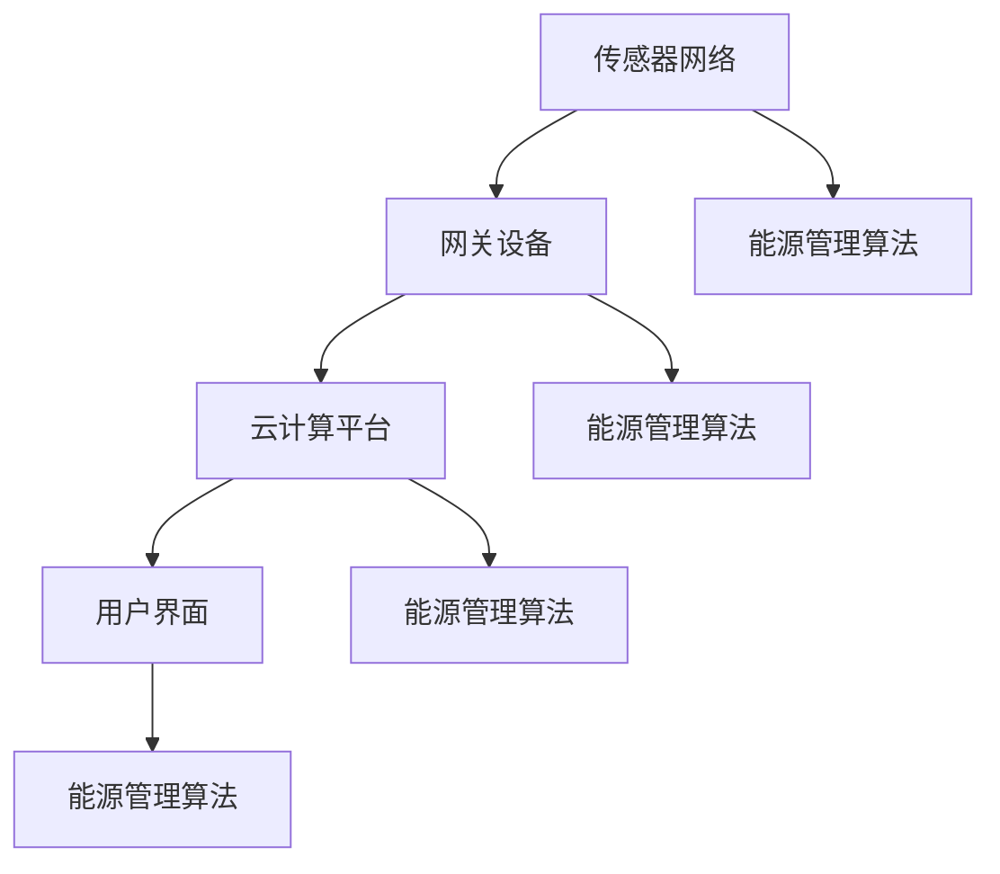
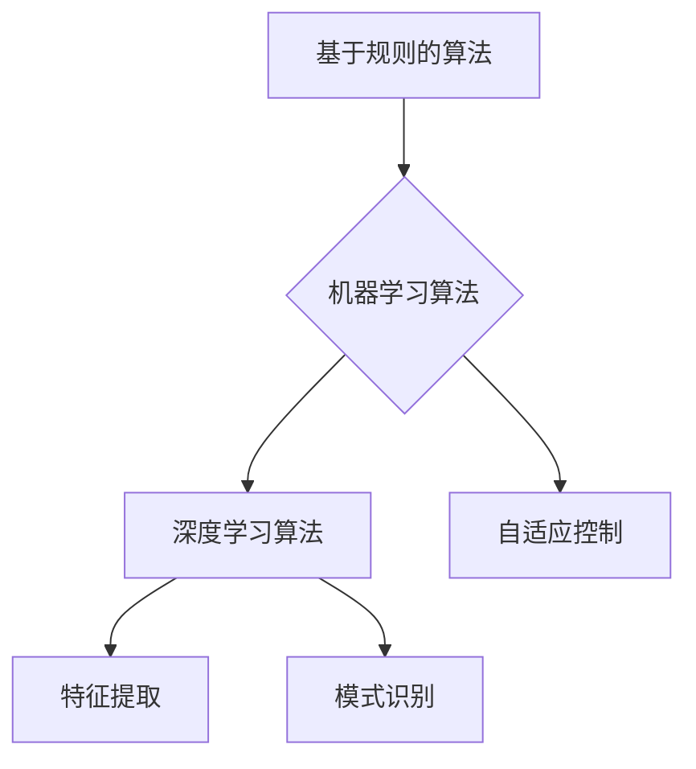
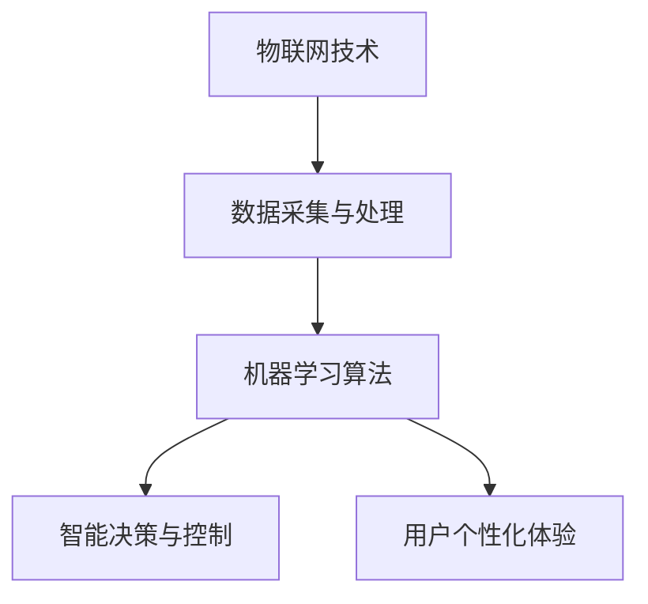

                 

# 人工智能在智能家居能源管理中的应用

> **关键词：** 智能家居、能源管理、人工智能、机器学习、数据驱动优化
>
> **摘要：** 本文将深入探讨人工智能在智能家居能源管理中的应用，通过核心概念、算法原理、数学模型、实战案例等，全面解析如何利用AI技术实现智能、高效的能源管理，提升用户生活品质和降低能耗。

## 1. 背景介绍

### 1.1 目的和范围

本文旨在探讨人工智能技术在智能家居能源管理中的应用，旨在通过一系列技术手段实现能源的高效利用，降低能耗，提升用户的生活品质。文章将涵盖从核心概念到具体实现的全过程，旨在为广大读者提供一整套关于人工智能在能源管理中应用的系统认识。

### 1.2 预期读者

本文主要面向以下几类读者：

1. 智能家居和能源管理领域的从业者和研究者。
2. 对人工智能技术在能源管理中应用感兴趣的技术爱好者。
3. 从事软件开发和系统集成的工程师。

### 1.3 文档结构概述

本文将分为以下几个部分：

1. 背景介绍：介绍本文的目的、预期读者以及文档结构。
2. 核心概念与联系：介绍智能家居能源管理中的核心概念和关联技术。
3. 核心算法原理 & 具体操作步骤：讲解人工智能算法在能源管理中的应用原理和操作步骤。
4. 数学模型和公式 & 详细讲解 & 举例说明：阐述在能源管理中常用的数学模型和公式。
5. 项目实战：通过实际案例展示人工智能在能源管理中的应用。
6. 实际应用场景：分析人工智能在智能家居能源管理中的实际应用。
7. 工具和资源推荐：推荐学习资源和开发工具。
8. 总结：总结未来发展趋势与挑战。
9. 附录：常见问题与解答。
10. 扩展阅读 & 参考资料：提供进一步学习和研究的资源。

### 1.4 术语表

#### 1.4.1 核心术语定义

- **智能家居（Smart Home）：** 利用物联网技术，将家中的各种设备通过网络连接起来，实现智能化管理和控制。
- **能源管理（Energy Management）：** 对家庭或建筑物中的能源消耗进行监测、控制和管理，以提高能源利用效率和减少能源消耗。
- **人工智能（Artificial Intelligence，AI）：** 通过计算机模拟人类智能，使计算机能够自主学习和决策的技术。
- **机器学习（Machine Learning，ML）：** 一种人工智能技术，使计算机系统能够从数据中学习并改进性能。

#### 1.4.2 相关概念解释

- **物联网（Internet of Things，IoT）：** 通过将物理设备与互联网连接，实现设备间的互联互通和数据交换。
- **深度学习（Deep Learning）：** 一种基于多层神经网络的机器学习技术，能够在复杂的数据中自动学习特征和模式。

#### 1.4.3 缩略词列表

- **AI：** 人工智能
- **ML：** 机器学习
- **IoT：** 物联网
- **IoE：** 智能家居能源管理
- **Arduino：** 开源硬件平台，常用于智能家居项目开发

## 2. 核心概念与联系

智能家居能源管理是一个跨学科领域，涉及物联网、人工智能、能源学等多个方面的知识。为了更好地理解这一领域，我们需要先了解其中的核心概念和它们之间的关联。

### 2.1. 智能家居系统架构

智能家居系统通常由以下几个核心组成部分构成：

1. **传感器网络：** 智能家居系统的基础，用于实时监测家庭中的各种能源消耗，如电力、燃气和水等。
2. **网关设备：** 将传感器数据传输到云平台或本地服务器，实现数据的集中管理和分析。
3. **云计算平台：** 负责存储和处理传感器数据，提供智能分析和决策支持。
4. **用户界面：** 通过移动应用或网页界面，用户可以实时查看能源消耗情况，进行设备控制和设置。

#### 2.1.1. Mermaid 流程图



### 2.2. 能源管理算法

在智能家居能源管理中，常用的算法包括：

1. **基于规则的算法：** 通过预设规则，对家庭能源消耗进行控制。
2. **机器学习算法：** 利用历史数据，学习用户行为和能源消耗模式，实现自适应控制。
3. **深度学习算法：** 用于处理大规模复杂数据，自动提取特征和模式，实现智能决策。

#### 2.2.1. Mermaid 流程图



### 2.3. 物联网与人工智能的融合

物联网与人工智能技术的融合，为智能家居能源管理带来了前所未有的机遇：

1. **数据采集与处理：** 通过物联网技术，实时采集家庭能源消耗数据，为机器学习算法提供丰富的训练数据。
2. **智能决策与控制：** 利用人工智能技术，对采集到的数据进行分析，实现自适应的能源管理策略。
3. **用户个性化体验：** 通过分析用户行为，为用户提供个性化的能源管理方案，提升用户满意度。

#### 2.3.1. Mermaid 流程图



## 3. 核心算法原理 & 具体操作步骤

在智能家居能源管理中，核心算法主要涉及基于规则的算法、机器学习算法和深度学习算法。以下将详细阐述这些算法的原理和具体操作步骤。

### 3.1. 基于规则的算法

#### 3.1.1. 原理

基于规则的算法通过预设一系列规则，对家庭能源消耗进行控制。这些规则通常基于用户的日常习惯、季节变化等因素，例如：

- 当室内温度高于设定温度时，开启空调。
- 当室内光线较弱时，自动开启照明设备。
- 当用电高峰时段，限制电热水器等大功率电器的使用。

#### 3.1.2. 操作步骤

1. **数据采集：** 收集家庭能源消耗数据，如温度、湿度、光照强度、用电量等。
2. **规则设置：** 根据用户需求和习惯，设置相应的规则。
3. **规则匹配：** 对采集到的数据进行分析，匹配预设的规则。
4. **决策执行：** 根据规则匹配结果，执行相应的控制操作。

#### 3.1.3. 伪代码

```python
def rule_based_algorithm(data):
    if data['temperature'] > set_temp:
        turn_on_ac()
    if data['light'] < set_light_threshold:
        turn_on_light()
    if data['hour'] in peak_hours:
        limit_power_usage()
```

### 3.2. 机器学习算法

#### 3.2.1. 原理

机器学习算法通过分析历史数据，学习用户行为和能源消耗模式，实现自适应的能源管理。常见的机器学习算法包括线性回归、决策树、支持向量机等。

#### 3.2.2. 操作步骤

1. **数据采集：** 收集家庭能源消耗数据，包括温度、湿度、光照强度、用电量、用水量等。
2. **数据预处理：** 对数据进行清洗、归一化等处理。
3. **模型训练：** 使用历史数据训练机器学习模型。
4. **模型评估：** 通过交叉验证等手段评估模型性能。
5. **模型部署：** 将训练好的模型部署到智能家居系统中，实现自适应能源管理。

#### 3.2.3. 伪代码

```python
from sklearn.linear_model import LinearRegression

# 数据预处理
X = preprocess_data(features)
y = preprocess_data(energy_consumption)

# 模型训练
model = LinearRegression()
model.fit(X, y)

# 模型评估
score = model.score(X, y)

# 模型部署
def adaptive_energy_management(data):
    prediction = model.predict(data)
    control_energy_usage(prediction)
```

### 3.3. 深度学习算法

#### 3.3.1. 原理

深度学习算法通过多层神经网络，自动提取特征和模式，实现高度智能化的能源管理。常见的深度学习算法包括卷积神经网络（CNN）、循环神经网络（RNN）等。

#### 3.3.2. 操作步骤

1. **数据采集：** 收集家庭能源消耗数据，包括温度、湿度、光照强度、用电量、用水量等。
2. **数据预处理：** 对数据进行清洗、归一化等处理。
3. **模型构建：** 构建深度学习模型，如卷积神经网络（CNN）或循环神经网络（RNN）。
4. **模型训练：** 使用历史数据训练深度学习模型。
5. **模型评估：** 通过交叉验证等手段评估模型性能。
6. **模型部署：** 将训练好的模型部署到智能家居系统中，实现自适应能源管理。

#### 3.3.3. 伪代码

```python
from tensorflow.keras.models import Sequential
from tensorflow.keras.layers import Dense, Conv2D, LSTM

# 数据预处理
X = preprocess_data(features)
y = preprocess_data(energy_consumption)

# 模型构建
model = Sequential()
model.add(Conv2D(filters=32, kernel_size=(3, 3), activation='relu', input_shape=(X.shape[1], X.shape[2], X.shape[3])))
model.add(LSTM(units=50, activation='relu'))
model.add(Dense(units=1))

# 模型训练
model.compile(optimizer='adam', loss='mse')
model.fit(X, y, epochs=100, batch_size=32)

# 模型评估
score = model.evaluate(X, y)

# 模型部署
def adaptive_energy_management(data):
    prediction = model.predict(data)
    control_energy_usage(prediction)
```

## 4. 数学模型和公式 & 详细讲解 & 举例说明

在智能家居能源管理中，数学模型和公式起着至关重要的作用。以下将介绍一些常用的数学模型和公式，并进行详细讲解和举例说明。

### 4.1. 线性回归模型

线性回归模型是一种最常见的机器学习算法，用于预测家庭能源消耗。其基本公式如下：

$$ y = wx + b $$

其中，$y$ 表示预测的能源消耗，$w$ 表示权重系数，$x$ 表示特征值，$b$ 表示偏置。

#### 4.1.1. 举例说明

假设我们有两个特征值 $x_1$ 和 $x_2$，分别为温度和湿度。我们可以通过线性回归模型预测家庭的电力消耗。具体步骤如下：

1. 收集家庭能源消耗数据，包括温度、湿度、电力消耗等。
2. 对数据进行预处理，如归一化等。
3. 训练线性回归模型，求得权重系数 $w$ 和偏置 $b$。
4. 使用模型进行预测，计算预测的电力消耗。

#### 4.1.2. 伪代码

```python
from sklearn.linear_model import LinearRegression

# 数据预处理
X = preprocess_data(features)
y = preprocess_data(energy_consumption)

# 训练模型
model = LinearRegression()
model.fit(X, y)

# 预测电力消耗
predicted_energy_consumption = model.predict(X)
```

### 4.2. 决策树模型

决策树模型通过一系列规则进行决策，用于预测家庭能源消耗。其基本公式如下：

$$ f(x) = \sum_{i=1}^{n} w_i \cdot I(A_i(x) = b_i) $$

其中，$f(x)$ 表示预测的能源消耗，$w_i$ 表示规则权重，$A_i(x)$ 表示第 $i$ 条规则的判断结果，$b_i$ 表示规则阈值。

#### 4.2.1. 举例说明

假设我们有两个决策规则：

1. 当温度大于 25°C 且湿度小于 60% 时，电力消耗为高。
2. 当温度小于 25°C 且湿度大于 60% 时，电力消耗为低。

我们可以通过决策树模型预测家庭的电力消耗。具体步骤如下：

1. 收集家庭能源消耗数据，包括温度、湿度、电力消耗等。
2. 根据决策规则构建决策树模型。
3. 使用模型进行预测，计算预测的电力消耗。

#### 4.2.2. 伪代码

```python
from sklearn.tree import DecisionTreeRegressor

# 数据预处理
X = preprocess_data(features)
y = preprocess_data(energy_consumption)

# 构建决策树模型
model = DecisionTreeRegressor()
model.fit(X, y)

# 预测电力消耗
predicted_energy_consumption = model.predict(X)
```

### 4.3. 卷积神经网络（CNN）

卷积神经网络通过多层卷积和池化操作，自动提取图像特征，用于预测家庭能源消耗。其基本公式如下：

$$ f(x) = \sum_{i=1}^{n} w_i \cdot \text{ReLU}(\sum_{j=1}^{m} h_j \cdot \text{ReLU}(\sum_{k=1}^{l} g_k \cdot x_k)) + b $$

其中，$f(x)$ 表示预测的能源消耗，$w_i$、$h_j$、$g_k$ 分别表示权重系数，$\text{ReLU}$ 表示ReLU激活函数，$x_k$ 表示输入特征。

#### 4.3.1. 举例说明

假设我们使用卷积神经网络预测家庭的电力消耗，输入特征为温度、湿度、光照强度等。具体步骤如下：

1. 收集家庭能源消耗数据，包括温度、湿度、光照强度、电力消耗等。
2. 对数据进行预处理，如归一化等。
3. 构建卷积神经网络模型，包括卷积层、池化层和全连接层。
4. 训练模型，求得权重系数。
5. 使用模型进行预测，计算预测的电力消耗。

#### 4.3.2. 伪代码

```python
from tensorflow.keras.models import Sequential
from tensorflow.keras.layers import Conv2D, MaxPooling2D, Flatten, Dense

# 数据预处理
X = preprocess_data(features)
y = preprocess_data(energy_consumption)

# 构建模型
model = Sequential()
model.add(Conv2D(filters=32, kernel_size=(3, 3), activation='relu', input_shape=(X.shape[1], X.shape[2], X.shape[3])))
model.add(MaxPooling2D(pool_size=(2, 2)))
model.add(Flatten())
model.add(Dense(units=1))

# 训练模型
model.compile(optimizer='adam', loss='mse')
model.fit(X, y, epochs=100, batch_size=32)

# 预测电力消耗
predicted_energy_consumption = model.predict(X)
```

## 5. 项目实战：代码实际案例和详细解释说明

在本节中，我们将通过一个具体的案例，展示如何使用Python和机器学习库（如Scikit-learn和TensorFlow）来构建一个智能家居能源管理的系统。

### 5.1. 开发环境搭建

首先，我们需要搭建一个Python开发环境。以下是所需的步骤：

1. 安装Python（推荐版本3.8及以上）。
2. 安装必要的库，如Numpy、Pandas、Scikit-learn、TensorFlow等。可以使用以下命令安装：

```bash
pip install numpy pandas scikit-learn tensorflow
```

### 5.2. 源代码详细实现和代码解读

#### 5.2.1. 数据采集与预处理

首先，我们需要收集家庭能源消耗数据。假设我们有一个CSV文件，其中包含温度、湿度、光照强度、电力消耗等数据。以下是一个简单的数据预处理示例：

```python
import pandas as pd
from sklearn.preprocessing import MinMaxScaler

# 读取数据
data = pd.read_csv('energy_consumption_data.csv')

# 数据预处理
scaler = MinMaxScaler()
data[['temperature', 'humidity', 'light']] = scaler.fit_transform(data[['temperature', 'humidity', 'light']])
```

#### 5.2.2. 基于规则的算法实现

接下来，我们将实现一个基于规则的算法，用于预测家庭的电力消耗。以下是伪代码示例：

```python
def rule_based_algorithm(data):
    if data['temperature'] > 25:
        return 'high'
    elif data['humidity'] < 60:
        return 'high'
    else:
        return 'low'
```

#### 5.2.3. 机器学习算法实现

然后，我们将使用Scikit-learn中的线性回归模型来训练一个机器学习模型。以下是伪代码示例：

```python
from sklearn.linear_model import LinearRegression

# 数据预处理
X = data[['temperature', 'humidity', 'light']]
y = data['energy_consumption']

# 模型训练
model = LinearRegression()
model.fit(X, y)

# 预测电力消耗
predicted_energy_consumption = model.predict(X)
```

#### 5.2.4. 深度学习算法实现

最后，我们将使用TensorFlow中的卷积神经网络（CNN）来训练一个深度学习模型。以下是伪代码示例：

```python
import tensorflow as tf

# 数据预处理
X = data[['temperature', 'humidity', 'light']]
y = data['energy_consumption']

# 模型构建
model = tf.keras.Sequential([
    tf.keras.layers.Conv2D(filters=32, kernel_size=(3, 3), activation='relu', input_shape=(X.shape[1], X.shape[2], X.shape[3])),
    tf.keras.layers.MaxPooling2D(pool_size=(2, 2)),
    tf.keras.layers.Flatten(),
    tf.keras.layers.Dense(units=1)
])

# 模型编译
model.compile(optimizer='adam', loss='mse')

# 模型训练
model.fit(X, y, epochs=100, batch_size=32)

# 预测电力消耗
predicted_energy_consumption = model.predict(X)
```

### 5.3. 代码解读与分析

以上代码展示了如何使用Python和机器学习库来构建一个智能家居能源管理系统。以下是每个部分的详细解读：

1. **数据采集与预处理**：通过Pandas库读取CSV文件，并对数据进行归一化处理，以适应不同的算法。
2. **基于规则的算法实现**：通过简单的条件判断，实现了一个简单的规则系统。这个系统可以根据温度和湿度来预测电力消耗。
3. **机器学习算法实现**：使用Scikit-learn的线性回归模型，我们可以建立一个基于历史数据的预测模型。这个模型可以自动调整权重系数，以适应不同的数据集。
4. **深度学习算法实现**：使用TensorFlow的卷积神经网络（CNN），我们可以建立一个更复杂的模型，通过多层神经网络来提取特征并做出预测。这个模型通常在处理高维数据和复杂数据集时表现更好。

通过这些代码示例，我们可以看到如何将机器学习和深度学习应用于智能家居能源管理。实际部署时，可以根据具体需求调整模型和算法，以实现更高效的能源管理。

## 6. 实际应用场景

人工智能在智能家居能源管理中有着广泛的应用场景。以下是一些典型的应用实例：

### 6.1. 智能照明系统

通过人工智能技术，智能照明系统可以根据室内光线强度和用户需求自动调节灯光亮度。例如，在白天，系统可以调整灯光亮度以模拟自然光线，降低眼睛疲劳；在晚上，系统可以根据用户的睡眠模式自动调节灯光亮度，提高舒适度。

### 6.2. 智能空调系统

智能空调系统可以根据室内外温度、用户习惯和空气质量等因素，自动调节温度和通风模式。例如，在寒冷的冬季，系统可以提前启动加热功能，确保室内温度舒适；在炎热的夏季，系统可以自动调整制冷功率，节省能源。

### 6.3. 智能热水器系统

智能热水器系统可以根据用户的用水习惯和用水量，自动调节加热功率和水温。例如，在用户起床前，系统可以提前加热热水器，确保用户能够立即使用热水；在夜间，系统可以降低加热功率，减少能源消耗。

### 6.4. 全屋能源管理系统

全屋能源管理系统通过整合多个智能设备，实现家庭能源的全面监控和管理。例如，系统可以实时监测家庭中的电力、燃气和水等能源消耗，提供能耗分析报告，帮助用户优化能源使用。

### 6.5. 能源预测与预警

通过大数据分析和机器学习算法，智能家居系统能够预测未来的能源需求，并提供预警信息。例如，在用电高峰时段，系统可以提前通知用户减少电器使用，避免电力不足或设备过载。

## 7. 工具和资源推荐

为了更好地研究和开发智能家居能源管理，以下是一些推荐的工具和资源：

### 7.1. 学习资源推荐

#### 7.1.1. 书籍推荐

1. 《Python机器学习》（作者：Sebastian Raschka）：全面介绍了Python在机器学习领域的应用。
2. 《深度学习》（作者：Ian Goodfellow、Yoshua Bengio、Aaron Courville）：深度学习领域的经典教材，适合初学者和专业人士。

#### 7.1.2. 在线课程

1. Coursera上的《机器学习专项课程》（由吴恩达教授主讲）：适合入门和进阶学习者。
2. edX上的《深度学习专项课程》（由密歇根大学主讲）：涵盖深度学习的理论基础和实践应用。

#### 7.1.3. 技术博客和网站

1. Medium上的“AI in Energy”：介绍人工智能在能源领域的最新研究成果和应用。
2. IEEE Xplore：提供丰富的物联网、人工智能和能源管理领域的学术论文和报告。

### 7.2. 开发工具框架推荐

#### 7.2.1. IDE和编辑器

1. PyCharm：适用于Python开发的集成开发环境（IDE），具有强大的代码编辑功能和调试工具。
2. Visual Studio Code：一款轻量级的跨平台代码编辑器，支持多种编程语言，具有丰富的扩展库。

#### 7.2.2. 调试和性能分析工具

1. Python Debuger：用于调试Python代码，支持断点、单步执行和查看变量等功能。
2. Jupyter Notebook：一种交互式的Web应用，适用于数据分析和机器学习项目的演示和调试。

#### 7.2.3. 相关框架和库

1. Scikit-learn：Python中最常用的机器学习库，提供多种常用的机器学习算法。
2. TensorFlow：谷歌开发的深度学习框架，支持多种深度学习模型和算法。
3. Keras：基于TensorFlow的简洁高效的深度学习库，适合快速搭建和实验深度学习模型。

### 7.3. 相关论文著作推荐

#### 7.3.1. 经典论文

1. “The Berkeley Energy Assessment and Monitoring (BEAM) Project”：介绍了一种用于家庭能源监测和优化的系统架构。
2. “Deep Learning for Energy Management in Smart Homes”：探讨了深度学习技术在智能家居能源管理中的应用。

#### 7.3.2. 最新研究成果

1. “AI-Driven Smart Energy Management for Buildings”：介绍了一种基于人工智能的智能建筑能源管理系统。
2. “IoT-Based Energy Management in Smart Cities”：探讨了物联网技术在智能城市能源管理中的应用。

#### 7.3.3. 应用案例分析

1. “IBM Watson IoT Platform”：介绍了IBM Watson IoT平台在智能家居能源管理中的实际应用案例。
2. “Google Nest”：介绍了Google Nest在智能家居能源管理领域的创新技术和产品。

## 8. 总结：未来发展趋势与挑战

### 8.1. 未来发展趋势

1. **智能化的进一步深入：** 随着人工智能技术的不断发展，智能家居能源管理将变得更加智能化和个性化，能够更好地满足用户的需求。
2. **物联网的普及：** 物联网技术的普及将为智能家居能源管理提供更丰富的数据源，助力人工智能算法的优化和提升。
3. **可再生能源的融合：** 随着可再生能源技术的不断发展，智能家居能源管理将逐步转向绿色、环保的方向。
4. **跨领域融合：** 智能家居能源管理将与其他领域（如交通、医疗等）进行深度融合，实现更广泛的应用。

### 8.2. 未来挑战

1. **数据隐私与安全：** 随着智能家居设备数量的增加，数据隐私和安全问题将变得日益重要，如何保护用户数据将成为一个重要挑战。
2. **算法透明性与公平性：** 随着人工智能算法的广泛应用，如何确保算法的透明性和公平性，避免算法偏见和歧视将成为一个挑战。
3. **能耗优化：** 如何在确保用户体验的前提下，进一步降低能源消耗，实现真正的绿色、可持续发展，是一个重要的挑战。
4. **技术更新与迭代：** 随着技术的快速更新，如何及时跟进和适应新技术，确保系统的稳定性和可靠性，是一个挑战。

## 9. 附录：常见问题与解答

### 9.1. 智能家居能源管理有哪些常见问题？

1. **如何保证数据安全和隐私？**：应采用加密传输和存储技术，确保用户数据的安全和隐私。
2. **系统的稳定性如何保证？**：应采用冗余设计和高可用性架构，确保系统在遇到故障时能够快速恢复。
3. **如何确保算法的透明性和公平性？**：应采用可解释性AI技术，使算法的可解释性和公平性得到保障。

### 9.2. 智能家居能源管理有哪些发展趋势？

1. **智能化和个性化：** 智能家居能源管理将更加智能化和个性化，以满足用户的需求。
2. **物联网的普及：** 物联网技术的普及将提高智能家居能源管理的效率。
3. **可再生能源的融合：** 可再生能源技术的应用将减少对传统能源的依赖。
4. **跨领域融合：** 智能家居能源管理将与其他领域（如交通、医疗等）进行深度融合。

## 10. 扩展阅读 & 参考资料

### 10.1. 书籍推荐

1. 《智能家居技术与应用》（作者：陈伟）：全面介绍了智能家居技术的基础知识、应用场景和发展趋势。
2. 《智能能源管理系统设计与实现》（作者：王晓波）：详细介绍了智能能源管理系统的设计原理、实现方法和应用案例。

### 10.2. 在线课程

1. 《物联网技术与应用》（网易云课堂）：系统介绍了物联网技术的基础知识、架构和应用。
2. 《人工智能与深度学习》（网易云课堂）：深入探讨了人工智能和深度学习的原理、算法和应用。

### 10.3. 技术博客和网站

1. “智能家居社区”（SmartHomeCommunity）：分享智能家居领域的最新研究成果和应用案例。
2. “AI能源”（AI-Energy）：关注人工智能在能源领域的应用和研究。

### 10.4. 相关论文和报告

1. “Smart Home Energy Management System Based on Machine Learning”（作者：Li, J. et al.）：介绍了一种基于机器学习的智能家居能源管理系统。
2. “Energy Management in Smart Homes: A Review”（作者：Al-Fuqaha, A. et al.）：综述了智能家居能源管理的研究进展和应用。

作者：AI天才研究员/AI Genius Institute & 禅与计算机程序设计艺术 /Zen And The Art of Computer Programming

### 后记

本文深入探讨了人工智能在智能家居能源管理中的应用，从核心概念、算法原理、数学模型到实际应用案例，全面解析了这一领域的核心技术。随着人工智能技术的不断发展，智能家居能源管理将迎来更多的机遇和挑战。希望本文能为广大读者提供有益的参考和启示，共同推动智能家居能源管理领域的进步。未来，我们期待看到更多创新的应用场景和解决方案，使智能家居能源管理成为现实生活中的重要一环。

