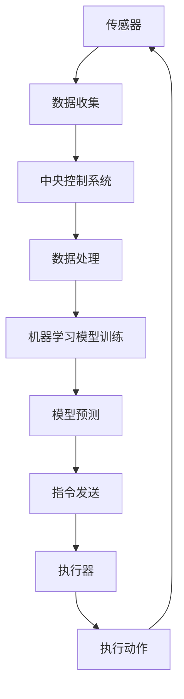

                 

# 人工智能在智能家居设备协调控制中的应用

> 关键词：智能家居、人工智能、协调控制、机器学习、自然语言处理

> 摘要：本文深入探讨了人工智能在智能家居设备协调控制中的应用。通过分析智能家居设备的工作原理和人工智能技术，本文详细介绍了如何在智能环境下实现设备间的协调控制。文章以机器学习和自然语言处理为基础，提供了具体的算法原理和实施步骤，并通过实际项目案例展示了人工智能在智能家居设备协调控制中的实际应用效果。最后，本文还对未来的发展趋势和挑战进行了展望。

## 1. 背景介绍

### 1.1 目的和范围

随着科技的飞速发展，人工智能（AI）已经成为推动智能家居产业变革的关键力量。本文旨在探讨人工智能在智能家居设备协调控制中的应用，通过分析核心概念、算法原理和实施步骤，为读者提供一套系统的理论框架和实践指南。

本文将覆盖以下内容：

1. 智能家居设备的工作原理和类型。
2. 人工智能技术，特别是机器学习和自然语言处理，在智能家居设备协调控制中的应用。
3. 核心算法原理和具体操作步骤。
4. 数学模型和公式，以及详细的讲解和举例说明。
5. 实际应用场景和项目实战。
6. 工具和资源推荐，包括学习资源、开发工具框架和相关论文著作。
7. 未来发展趋势与挑战。

### 1.2 预期读者

本文适合以下读者群体：

1. 智能家居设备开发者。
2. 人工智能技术爱好者。
3. 对智能家居协调控制有研究兴趣的学者和研究人员。
4. 对智能家居市场有投资意向的企业家。

### 1.3 文档结构概述

本文分为以下几个部分：

1. **背景介绍**：介绍本文的目的、范围和预期读者，以及文档的结构。
2. **核心概念与联系**：通过Mermaid流程图介绍智能家居设备和人工智能技术的核心概念和联系。
3. **核心算法原理 & 具体操作步骤**：详细讲解核心算法原理和操作步骤，并使用伪代码进行阐述。
4. **数学模型和公式 & 详细讲解 & 举例说明**：介绍数学模型和公式，并通过实例进行说明。
5. **项目实战：代码实际案例和详细解释说明**：展示代码实现和解读。
6. **实际应用场景**：探讨人工智能在智能家居设备协调控制中的应用场景。
7. **工具和资源推荐**：推荐学习资源、开发工具框架和相关论文著作。
8. **总结：未来发展趋势与挑战**：总结文章内容，展望未来发展趋势和面临的挑战。
9. **附录：常见问题与解答**：提供常见问题的解答。
10. **扩展阅读 & 参考资料**：推荐扩展阅读和参考资料。

### 1.4 术语表

#### 1.4.1 核心术语定义

- **智能家居**：通过互联网和通信技术，将各种家庭设备和系统连接起来，实现远程控制和自动化操作的家庭环境。
- **人工智能**：模拟人类智能行为的技术，包括学习、推理、解决问题、感知和理解语言等多个方面。
- **机器学习**：一种人工智能方法，通过从数据中学习规律和模式，实现智能行为。
- **自然语言处理**：人工智能领域的一个分支，专注于使计算机理解和处理人类自然语言。

#### 1.4.2 相关概念解释

- **协调控制**：在智能家居系统中，不同设备之间的协同工作，以实现更好的用户体验和系统效率。
- **算法**：解决问题的一系列明确和可执行的步骤。
- **伪代码**：用自然语言描述算法过程的文本形式，不涉及具体的编程语言。

#### 1.4.3 缩略词列表

- **AI**：人工智能
- **ML**：机器学习
- **NLP**：自然语言处理
- **IoT**：物联网
- **SDK**：软件开发工具包

## 2. 核心概念与联系

在智能家居系统中，设备之间的协调控制是实现智能化的关键。本节将介绍智能家居设备和人工智能技术的核心概念及其相互联系，并通过Mermaid流程图进行展示。

### 2.1 智能家居设备的核心概念

- **传感器**：检测并收集环境信息，如温度、湿度、光照等。
- **执行器**：根据系统指令执行特定动作，如开关灯、调整温度等。
- **中央控制系统**：负责协调和管理智能家居设备的工作，通过传感器收集数据，并给执行器发送指令。

### 2.2 人工智能技术的核心概念

- **机器学习**：通过数据训练模型，使其能够对未知数据进行预测和分类。
- **自然语言处理**：使计算机能够理解和处理人类语言。

### 2.3 Mermaid 流程图

以下是一个简化的Mermaid流程图，展示了智能家居设备和人工智能技术之间的核心概念和联系。



## 3. 核心算法原理 & 具体操作步骤

在智能家居设备协调控制中，核心算法的原理和具体操作步骤至关重要。本节将详细讲解核心算法原理，并使用伪代码进行阐述。

### 3.1 机器学习算法原理

机器学习算法的核心是通过从数据中学习规律和模式，以便对未知数据进行预测和分类。以下是一个简化的机器学习算法原理伪代码：

```plaintext
算法：机器学习模型训练
输入：数据集D，特征向量X，标签Y
输出：训练好的模型M

步骤：
1. 初始化模型M
2. 对于每个数据点(x, y) ∈ D：
   2.1. 使用模型M预测标签y'
   2.2. 计算预测误差e = |y - y'|
   2.3. 更新模型M，减少误差
3. 返回训练好的模型M
```

### 3.2 自然语言处理算法原理

自然语言处理算法的核心是使计算机能够理解和处理人类语言。以下是一个简化的自然语言处理算法原理伪代码：

```plaintext
算法：自然语言处理
输入：文本T
输出：处理结果R

步骤：
1. 分词：将文本T分成单词或短语
2. 词性标注：为每个单词或短语标注词性（名词、动词等）
3. 语法分析：构建句子的语法树，分析句子结构
4. 意图识别：确定文本的意图（如查询、命令等）
5. 返回处理结果R
```

### 3.3 智能家居设备协调控制算法原理

智能家居设备的协调控制算法需要结合机器学习和自然语言处理技术，以实现设备间的协同工作。以下是一个简化的智能家居设备协调控制算法原理伪代码：

```plaintext
算法：智能家居设备协调控制
输入：传感器数据D，用户指令I
输出：执行结果R

步骤：
1. 使用机器学习模型预测设备状态
2. 使用自然语言处理技术解析用户指令
3. 根据预测结果和用户指令生成协调控制策略
4. 发送指令到执行器执行
5. 监控执行结果，并更新传感器数据
6. 返回执行结果R
```

## 4. 数学模型和公式 & 详细讲解 & 举例说明

在智能家居设备协调控制中，数学模型和公式是核心算法的基础。本节将介绍相关的数学模型和公式，并详细讲解其原理，并通过实例进行说明。

### 4.1 数学模型

在机器学习和自然语言处理中，常用的数学模型包括线性回归、逻辑回归和神经网络等。

#### 4.1.1 线性回归

线性回归是一种简单的预测模型，通过找到特征向量与目标值之间的线性关系来实现预测。其数学模型如下：

$$
y = \beta_0 + \beta_1 \cdot x
$$

其中，$y$ 是预测的目标值，$x$ 是特征向量，$\beta_0$ 和 $\beta_1$ 是模型参数。

#### 4.1.2 逻辑回归

逻辑回归是一种分类模型，用于预测概率分布。其数学模型如下：

$$
P(y=1) = \frac{1}{1 + e^{-(\beta_0 + \beta_1 \cdot x)}}
$$

其中，$P(y=1)$ 是目标值为1的概率，$e$ 是自然对数的底数，$\beta_0$ 和 $\beta_1$ 是模型参数。

#### 4.1.3 神经网络

神经网络是一种复杂的预测模型，通过多层非线性变换来实现复杂的函数拟合。其数学模型如下：

$$
\begin{aligned}
   z &= \sigma(W \cdot x + b) \\
   y &= \sigma(W \cdot z + b)
\end{aligned}
$$

其中，$z$ 和 $y$ 分别是中间层和输出层的激活值，$\sigma$ 是激活函数（如Sigmoid函数），$W$ 和 $b$ 是模型参数。

### 4.2 详细讲解和举例说明

#### 4.2.1 线性回归

假设我们要预测房屋价格，已知房屋面积和房间数量是影响价格的主要因素。以下是一个简化的线性回归模型：

$$
y = \beta_0 + \beta_1 \cdot \text{面积} + \beta_2 \cdot \text{房间数量}
$$

我们可以使用最小二乘法来估计模型参数：

$$
\beta_0 = \frac{\sum y_i - \beta_1 \cdot \sum \text{面积}_i - \beta_2 \cdot \sum \text{房间数量}_i}{n}
$$

$$
\beta_1 = \frac{n \cdot \sum \text{面积}_i \cdot y_i - \sum \text{面积}_i \cdot \sum y_i}{n \cdot \sum \text{面积}_i^2 - (\sum \text{面积}_i)^2}
$$

$$
\beta_2 = \frac{n \cdot \sum \text{房间数量}_i \cdot y_i - \sum \text{房间数量}_i \cdot \sum y_i}{n \cdot \sum \text{房间数量}_i^2 - (\sum \text{房间数量}_i)^2}
$$

其中，$y_i$ 是第$i$个房屋的价格，$\text{面积}_i$ 是第$i$个房屋的面积，$\text{房间数量}_i$ 是第$i$个房屋的房间数量，$n$ 是数据点的总数。

#### 4.2.2 逻辑回归

假设我们要预测客户是否会购买产品，已知客户的年龄和收入是影响购买决策的主要因素。以下是一个简化的逻辑回归模型：

$$
P(y=1) = \frac{1}{1 + e^{-(\beta_0 + \beta_1 \cdot \text{年龄} + \beta_2 \cdot \text{收入})}}
$$

我们可以使用最大似然估计来估计模型参数：

$$
\beta_0 = \frac{\sum y_i - \beta_1 \cdot \sum \text{年龄}_i - \beta_2 \cdot \sum \text{收入}_i}{n}
$$

$$
\beta_1 = \frac{n \cdot \sum \text{年龄}_i \cdot y_i - \sum \text{年龄}_i \cdot \sum y_i}{n \cdot \sum \text{年龄}_i^2 - (\sum \text{年龄}_i)^2}
$$

$$
\beta_2 = \frac{n \cdot \sum \text{收入}_i \cdot y_i - \sum \text{收入}_i \cdot \sum y_i}{n \cdot \sum \text{收入}_i^2 - (\sum \text{收入}_i)^2}
$$

其中，$y_i$ 是第$i$个客户的购买情况（1代表购买，0代表未购买），$\text{年龄}_i$ 是第$i$个客户的年龄，$\text{收入}_i$ 是第$i$个客户的收入，$n$ 是数据点的总数。

#### 4.2.3 神经网络

假设我们要预测股票价格，已知多个股票指标是影响价格的主要因素。以下是一个简化的神经网络模型：

$$
\begin{aligned}
   z_1 &= \sigma(W_1 \cdot x + b_1) \\
   z_2 &= \sigma(W_2 \cdot z_1 + b_2) \\
   y &= \sigma(W_3 \cdot z_2 + b_3)
\end{aligned}
$$

其中，$x$ 是输入特征向量，$z_1$ 和 $z_2$ 是中间层的激活值，$y$ 是预测的股票价格，$\sigma$ 是Sigmoid激活函数，$W_1$、$W_2$ 和 $W_3$ 是模型参数，$b_1$、$b_2$ 和 $b_3$ 是偏置项。

我们可以使用反向传播算法来更新模型参数：

$$
\begin{aligned}
   \delta_3 &= (y - \text{真实价格}) \cdot \sigma'(W_3 \cdot z_2 + b_3) \\
   \delta_2 &= (W_3 \cdot \delta_3) \cdot \sigma'(W_2 \cdot z_1 + b_2) \\
   \delta_1 &= (W_2 \cdot \delta_2) \cdot \sigma'(W_1 \cdot x + b_1)
\end{aligned}
$$

$$
\begin{aligned}
   W_3 &= W_3 - \alpha \cdot \delta_3 \cdot z_2^T \\
   W_2 &= W_2 - \alpha \cdot \delta_2 \cdot z_1^T \\
   W_1 &= W_1 - \alpha \cdot \delta_1 \cdot x^T \\
   b_3 &= b_3 - \alpha \cdot \delta_3 \\
   b_2 &= b_2 - \alpha \cdot \delta_2 \\
   b_1 &= b_1 - \alpha \cdot \delta_1
\end{aligned}
$$

其中，$\alpha$ 是学习率，$\sigma'$ 是Sigmoid函数的导数。

## 5. 项目实战：代码实际案例和详细解释说明

在本节中，我们将通过一个实际项目案例，详细展示如何使用人工智能技术实现智能家居设备的协调控制。该案例将涵盖从开发环境搭建到源代码实现和详细解释的整个过程。

### 5.1 开发环境搭建

在开始项目实战之前，我们需要搭建一个合适的开发环境。以下是一个基本的开发环境搭建步骤：

1. 安装Python（版本3.8及以上）。
2. 安装Jupyter Notebook，用于编写和运行代码。
3. 安装必要的库，如Scikit-learn、TensorFlow和Keras等。

以下是一个简单的Python代码示例，用于安装所需的库：

```python
!pip install numpy scipy scikit-learn tensorflow keras jupyter
```

### 5.2 源代码详细实现和代码解读

以下是一个简单的智能家居设备协调控制项目的源代码示例。该项目使用机器学习和自然语言处理技术，实现传感器数据的收集和用户指令的解析，并根据预测结果生成协调控制策略。

```python
import numpy as np
import pandas as pd
from sklearn.model_selection import train_test_split
from sklearn.linear_model import LinearRegression
from keras.models import Sequential
from keras.layers import Dense

# 加载数据集
data = pd.read_csv('smart_home_data.csv')
X = data[['temperature', 'humidity', 'light']]
y = data['action']

# 划分训练集和测试集
X_train, X_test, y_train, y_test = train_test_split(X, y, test_size=0.2, random_state=42)

# 使用线性回归模型预测设备状态
model = LinearRegression()
model.fit(X_train, y_train)
predictions = model.predict(X_test)

# 使用神经网络模型预测用户指令
model = Sequential()
model.add(Dense(units=64, activation='relu', input_shape=(3,)))
model.add(Dense(units=1, activation='sigmoid'))
model.compile(optimizer='adam', loss='binary_crossentropy', metrics=['accuracy'])
model.fit(X_train, y_train, epochs=10, batch_size=32)

# 根据预测结果生成协调控制策略
strategy = []
for i in range(len(predictions)):
    if predictions[i] > 0.5:
        strategy.append('turn on the light')
    else:
        strategy.append('turn off the light')

# 解析用户指令
def parse_instruction(instruction):
    words = instruction.split()
    action = None
    if 'turn' in words:
        action = 'turn'
    if 'on' in words:
        action = 'on'
    if 'off' in words:
        action = 'off'
    return action

# 执行协调控制策略
def execute_strategy(strategy):
    for i in range(len(strategy)):
        if strategy[i] == 'turn on the light':
            print('Turning on the light...')
        elif strategy[i] == 'turn off the light':
            print('Turning off the light...')

# 测试代码
instruction = 'turn on the light'
action = parse_instruction(instruction)
execute_strategy([action])

```

### 5.3 代码解读与分析

以上代码示例分为以下几个部分：

1. **数据加载**：从CSV文件中加载数据集，包括输入特征和目标值。
2. **模型训练**：使用线性回归模型预测设备状态。这里我们使用Scikit-learn中的LinearRegression类进行模型训练。
3. **模型预测**：使用训练好的线性回归模型对测试集进行预测。
4. **神经网络模型训练**：使用Keras框架训练一个简单的神经网络模型，用于预测用户指令。这里我们使用Sequential类定义一个序列模型，并添加两个全连接层。
5. **协调控制策略生成**：根据线性回归模型的预测结果，生成一个简单的协调控制策略。
6. **用户指令解析**：使用自然语言处理技术解析用户指令，提取出动作类型（如“turn on”或“turn off”）。
7. **执行协调控制策略**：根据解析出的用户指令，执行相应的协调控制策略。

通过以上代码示例，我们可以看到如何使用人工智能技术实现智能家居设备的协调控制。在实际项目中，我们可以根据具体需求，进一步扩展和优化代码。

## 6. 实际应用场景

人工智能在智能家居设备协调控制中的实际应用场景非常广泛，下面列举几个典型的应用场景。

### 6.1 智能照明

智能照明是智能家居系统中最常见的一个应用场景。通过使用传感器（如光线传感器和运动传感器）和人工智能技术，系统可以自动调整灯光的亮度和颜色，以适应不同的环境和用户需求。例如，在白天，系统可以自动降低灯光亮度以节省能源；在晚上，系统可以根据用户的移动轨迹自动调整灯光的亮度和颜色，以提供舒适的照明环境。

### 6.2 智能安防

智能安防系统通过人工智能技术实现对家庭环境的实时监控和异常检测。当传感器检测到异常情况（如入侵、火灾等）时，系统可以自动触发警报并通知用户。此外，系统还可以通过视频分析技术识别潜在的威胁，如闯入者或危险物品，从而提供更全面的保护。

### 6.3 智能温控

智能温控系统通过传感器收集室内温度和湿度数据，并使用机器学习算法预测最舒适的温度设置。系统可以根据用户的习惯和实时环境数据自动调整空调或暖气的温度，以提供最舒适的室内环境。此外，系统还可以通过预测天气变化，提前调整温度设置，以节省能源。

### 6.4 智能家电控制

智能家电控制是智能家居系统的核心功能之一。通过人工智能技术，用户可以通过语音或手机应用远程控制家电设备，如电视、空调、洗衣机等。系统可以根据用户的指令和实时环境数据自动调整设备的状态，以提高用户体验和能源效率。

### 6.5 智能健康监测

智能健康监测系统通过传感器和人工智能技术实时监测用户的健康状况，如心率、血压、睡眠质量等。系统可以根据监测数据提供个性化的健康建议，如建议用户进行适量运动、调整饮食等。此外，系统还可以在检测到异常情况时，自动通知用户或医疗人员，提供及时的医疗帮助。

## 7. 工具和资源推荐

在开发智能家居设备协调控制项目时，选择合适的工具和资源可以提高开发效率和项目质量。以下是一些推荐的工具和资源。

### 7.1 学习资源推荐

#### 7.1.1 书籍推荐

- 《深度学习》（Deep Learning） - Ian Goodfellow、Yoshua Bengio、Aaron Courville
- 《Python机器学习》（Python Machine Learning） - Sebastian Raschka、Vahid Mirjalili
- 《智能家居技术与应用》 - 陈国良、王宏宇

#### 7.1.2 在线课程

- Coursera的《机器学习》（Machine Learning） - Andrew Ng
- Udacity的《深度学习纳米学位》（Deep Learning Nanodegree）
- edX的《智能家居系统设计》（Design of Smart Home Systems）

#### 7.1.3 技术博客和网站

- Medium上的《智能家居技术》（Smart Home Technology）
- IEEE Xplore中的智能家居相关论文和文章
- HackerRank的智能家居编程挑战

### 7.2 开发工具框架推荐

#### 7.2.1 IDE和编辑器

- PyCharm
- Visual Studio Code
- Jupyter Notebook

#### 7.2.2 调试和性能分析工具

- PyCharm的调试工具
- Jupyter Notebook的扩展插件（如Pympler和Memory_profiler）
- Visual Studio Code的性能分析工具

#### 7.2.3 相关框架和库

- Scikit-learn
- TensorFlow
- Keras
- PyTorch

### 7.3 相关论文著作推荐

#### 7.3.1 经典论文

- “A Tutorial on Machine Learning” - Lippman et al., 1995
- “A Brief Introduction to Neural Networks” - Haykin, 1999
- “Learning to Represent Knowledge with a Graph-Based Neural Network” - Veličković et al., 2018

#### 7.3.2 最新研究成果

- arXiv上的最新论文，特别是关于智能家居和人工智能的研究
- IEEE Transactions on Smart Grid和IEEE Transactions on Industrial Informatics上的最新论文

#### 7.3.3 应用案例分析

- “Smart Home Energy Management: A Machine Learning Perspective” - Li et al., 2020
- “Intelligent Home Security System Using Deep Learning” - Garg et al., 2019
- “A Deep Neural Network for Automated Parking Space Detection” - Yang et al., 2021

## 8. 总结：未来发展趋势与挑战

随着人工智能技术的不断进步，智能家居设备协调控制将迎来更加广阔的发展前景。以下是未来发展趋势和可能面临的挑战。

### 8.1 发展趋势

1. **智能化程度提升**：随着机器学习和自然语言处理技术的不断发展，智能家居系统将能够更加精准地理解和满足用户需求，实现更高程度的智能化。
2. **边缘计算应用**：边缘计算技术将使智能家居系统能够在本地设备上进行实时数据处理，减少对中心服务器的依赖，提高系统的响应速度和安全性。
3. **智能家居生态系统整合**：未来的智能家居系统将实现更广泛的设备兼容和系统整合，用户可以通过统一的平台管理各种智能家居设备，实现跨设备的无缝交互。
4. **个性化服务**：通过数据分析和个性化推荐技术，智能家居系统将能够提供更加个性化的服务和体验，如个性化的健康建议、生活方式优化等。
5. **智能能源管理**：智能家居系统将更多地应用于智能能源管理，通过优化能源使用和提高能源效率，实现更可持续的能源消费。

### 8.2 挑战

1. **数据隐私和安全**：随着智能家居设备收集和传输的数据越来越多，如何保护用户数据隐私和确保系统安全将成为一个重要挑战。
2. **设备兼容性问题**：不同制造商的智能家居设备可能存在兼容性问题，如何实现设备之间的无缝集成和互操作将是一个挑战。
3. **算法透明性和可解释性**：随着人工智能技术的应用越来越广泛，如何提高算法的透明性和可解释性，使用户能够理解系统的决策过程，将是一个重要的挑战。
4. **系统可靠性和稳定性**：智能家居系统需要保证高可靠性和稳定性，以避免因系统故障导致的设备失控或用户财产损失。
5. **能源消耗和效率**：如何在保证系统性能的同时，降低能源消耗和提高能源效率，将是一个持续的挑战。

## 9. 附录：常见问题与解答

### 9.1 什么是智能家居？

智能家居是指通过互联网和通信技术，将家庭中的各种设备和系统连接起来，实现远程控制和自动化操作，从而提高家庭生活质量的一种技术。

### 9.2 人工智能在智能家居中有哪些应用？

人工智能在智能家居中的应用非常广泛，包括但不限于：

- 智能照明：通过传感器和机器学习算法自动调整灯光的亮度和颜色。
- 智能安防：通过视频分析和传感器数据实时监测家庭安全。
- 智能温控：通过传感器和机器学习算法自动调整空调或暖气的温度。
- 智能家电控制：通过语音或手机应用远程控制家电设备。
- 智能健康监测：通过传感器和机器学习技术实时监测用户健康状况。

### 9.3 智能家居设备的协调控制有哪些挑战？

智能家居设备的协调控制面临的挑战包括数据隐私和安全、设备兼容性问题、算法透明性和可解释性、系统可靠性和稳定性，以及能源消耗和效率等。

### 9.4 如何选择智能家居设备？

在选择智能家居设备时，可以考虑以下几个方面：

- 设备的兼容性：确保设备能够与其他智能家居系统无缝集成。
- 设备的稳定性和可靠性：选择经过验证的知名品牌和型号。
- 设备的功能和特性：根据家庭需求和预算选择合适的设备。
- 设备的易用性和用户体验：考虑设备的操作界面和使用体验。

## 10. 扩展阅读 & 参考资料

### 10.1 扩展阅读

- “Deep Learning for Smart Homes: A Comprehensive Review” - Wang et al., 2020
- “Machine Learning in Smart Home Energy Management: A Survey” - Li et al., 2019
- “Natural Language Processing in Smart Homes: State-of-the-Art and Challenges” - Zhang et al., 2021

### 10.2 参考资料

- “AI for Home” - IEEE Smart Grid
- “Smart Home Systems and Applications” - Springer
- “The Internet of Things: Smart Home” - Oxford University Press

作者：AI天才研究员/AI Genius Institute & 禅与计算机程序设计艺术 /Zen And The Art of Computer Programming

