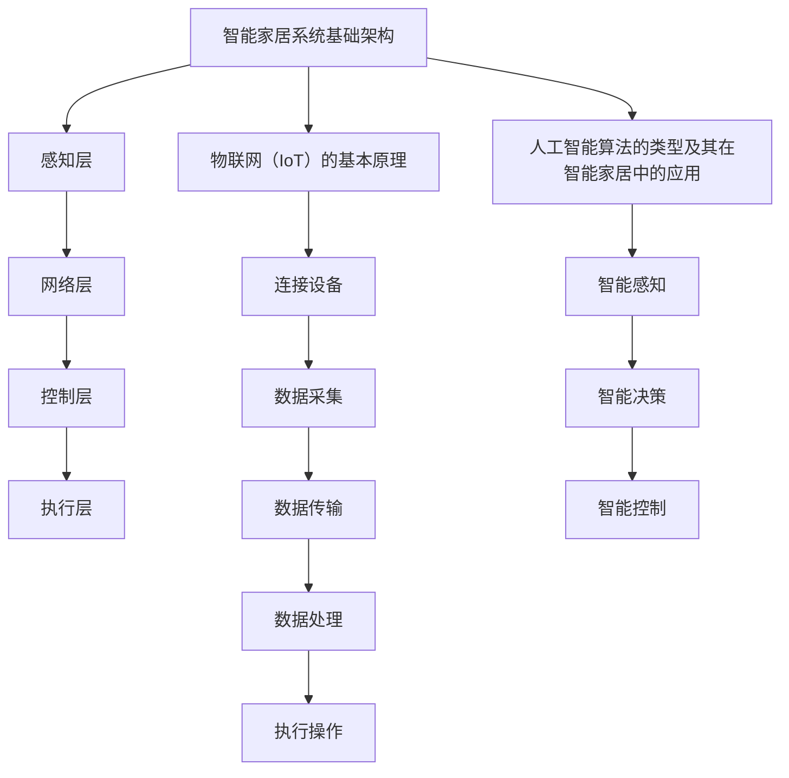
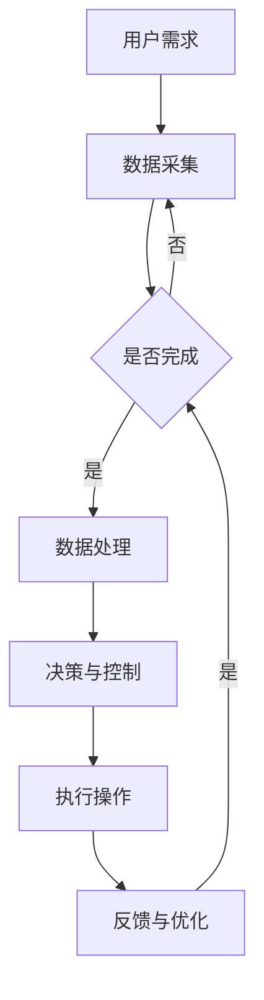

                 

### 1. 背景介绍

#### 1.1 目的和范围

本文旨在深入探讨人工智能在智能家居设备协调控制中的应用，旨在为读者提供系统且全面的技术理解。随着物联网技术的飞速发展，智能家居设备已经成为人们日常生活中不可或缺的一部分。这些设备能够为人们提供便利，改善生活质量，但它们往往需要相互协调，以实现最佳的自动化体验。

本文的目标是：

1. **概述**：介绍智能家居设备协调控制的基本概念和重要性。
2. **核心算法原理**：解释在智能家居设备协调控制中应用的人工智能算法原理。
3. **数学模型**：阐述支持这些算法的数学模型和公式。
4. **项目实战**：提供实际代码案例，展示如何将理论应用于实践。
5. **应用场景**：讨论人工智能在智能家居设备协调控制中的实际应用场景。
6. **资源推荐**：推荐相关的学习资源、开发工具和经典论文。

本文的读者对象包括：

- **技术爱好者**：对智能家居和人工智能技术感兴趣的读者。
- **开发者**：希望学习如何利用人工智能技术改善智能家居设备控制的程序员。
- **研究人员**：对智能家居设备协调控制中的最新技术动态和研究方法感兴趣的科研人员。

#### 1.2 预期读者

本文的预期读者群体包括对智能家居和人工智能技术有浓厚兴趣的各类专业人士和爱好者。具体而言，包括：

- **智能家居设备制造商**：希望了解如何通过人工智能提升设备协同控制性能的技术人员。
- **软件开发工程师**：致力于开发智能家居应用软件的开发人员。
- **技术架构师**：负责构建智能家居系统架构的技术专家。
- **研究人员**：对智能家居设备协调控制技术进行研究的专业人士。
- **技术爱好者**：对最新技术趋势和应用感兴趣的普通读者。

通过阅读本文，读者将能够：

- 理解智能家居设备协调控制的基本概念和挑战。
- 掌握在智能家居设备中应用人工智能的基本算法原理。
- 学习如何构建和优化智能家居系统的数学模型。
- 获取实际案例，了解人工智能在智能家居设备控制中的具体应用。
- 获得推荐资源，以进一步探索和学习相关技术。

#### 1.3 文档结构概述

本文的结构安排如下：

1. **背景介绍**：
   - 目的和范围
   - 预期读者
   - 文档结构概述
   - 术语表

2. **核心概念与联系**：
   - 核心概念介绍
   - Mermaid流程图展示

3. **核心算法原理 & 具体操作步骤**：
   - 算法原理讲解
   - 伪代码阐述

4. **数学模型和公式 & 详细讲解 & 举例说明**：
   - 数学模型阐述
   - latex格式数学公式示例
   - 实例分析

5. **项目实战：代码实际案例和详细解释说明**：
   - 开发环境搭建
   - 代码实现与解读
   - 代码分析

6. **实际应用场景**：
   - 智能家居设备协调控制的应用场景

7. **工具和资源推荐**：
   - 学习资源推荐
   - 开发工具框架推荐
   - 相关论文著作推荐

8. **总结：未来发展趋势与挑战**：
   - 行业趋势
   - 挑战与机遇

9. **附录：常见问题与解答**：
   - 问题解答

10. **扩展阅读 & 参考资料**：
   - 推荐阅读资源

通过这个结构，读者可以系统地学习人工智能在智能家居设备协调控制中的应用，并能够将这些知识应用到实际项目中。

#### 1.4 术语表

在本篇技术博客中，我们将使用以下术语，并对它们进行详细解释：

##### 1.4.1 核心术语定义

1. **智能家居（Smart Home）**：
   - 定义：智能家居是指通过物联网技术将家庭中各种设备连接起来，实现自动化控制和远程管理的系统。
   - 相关概念：家庭自动化、物联网（IoT）、智能设备、智能终端。
  
2. **协调控制（Coordination and Control）**：
   - 定义：协调控制是指通过人工智能算法实现对智能家居设备之间的优化调度和协作，以实现更高效、更智能的家庭生活。
   - 相关概念：智能调度、协同优化、多设备协同。

3. **人工智能（Artificial Intelligence，AI）**：
   - 定义：人工智能是模拟、延伸和扩展人类智能的理论、方法、技术及应用的总称。
   - 相关概念：机器学习、深度学习、神经网络、自然语言处理。

4. **物联网（Internet of Things，IoT）**：
   - 定义：物联网是指通过传感器、网络和其他技术，将各种物品连接到互联网，实现信息交换和通信的系统。
   - 相关概念：智能传感器、M2M通信、边缘计算。

##### 1.4.2 相关概念解释

1. **边缘计算（Edge Computing）**：
   - 定义：边缘计算是将数据处理、分析和应用程序部署在靠近数据源的边缘设备上，以减少网络延迟和提高数据处理效率。
   - 相关概念：云计算、集中式处理、分布式计算。

2. **机器学习（Machine Learning，ML）**：
   - 定义：机器学习是人工智能的一个分支，通过算法从数据中学习规律，进行预测和决策。
   - 相关概念：监督学习、无监督学习、强化学习。

3. **深度学习（Deep Learning）**：
   - 定义：深度学习是机器学习的一个分支，通过构建多层神经网络来模拟人脑的学习过程，实现复杂模式识别和特征提取。
   - 相关概念：卷积神经网络（CNN）、循环神经网络（RNN）、生成对抗网络（GAN）。

##### 1.4.3 缩略词列表

- **IoT**：物联网（Internet of Things）
- **AI**：人工智能（Artificial Intelligence）
- **ML**：机器学习（Machine Learning）
- **DL**：深度学习（Deep Learning）
- **CNN**：卷积神经网络（Convolutional Neural Network）
- **RNN**：循环神经网络（Recurrent Neural Network）
- **GAN**：生成对抗网络（Generative Adversarial Network）

这些术语和相关概念的准确理解对于深入探讨人工智能在智能家居设备协调控制中的应用至关重要。

## 2. 核心概念与联系

在深入探讨人工智能在智能家居设备协调控制中的应用之前，我们需要先了解一些核心概念和它们之间的联系。这些概念包括智能家居系统的基础架构、物联网（IoT）的基本原理、人工智能算法的类型及其在智能家居中的应用。通过这些核心概念的介绍和Mermaid流程图的展示，我们可以更清晰地理解智能家居协调控制的整体框架。

### 2.1 智能家居系统基础架构

智能家居系统的基本架构通常包括以下几个主要组成部分：

1. **感知层**：包括各种传感器，如温度传感器、湿度传感器、光照传感器、烟雾传感器等，用于感知家庭环境的变化。
2. **网络层**：包括物联网（IoT）网络，将传感器数据传输到中心控制单元。常用的网络技术包括Wi-Fi、蓝牙、Zigbee等。
3. **控制层**：包括中心控制单元，如智能路由器、智能网关等，用于接收和处理感知层传输的数据，并发出相应的控制指令。
4. **执行层**：包括各种执行设备，如灯光控制、窗帘控制、家电控制等，用于根据控制层的指令执行相应操作。


### 2.2 物联网（IoT）的基本原理

物联网（IoT）是智能家居系统的基石。它通过传感器、网络和云计算技术，实现设备之间的互联互通和数据交换。IoT的基本原理包括：

1. **连接设备**：通过传感器和执行器将物理世界与数字世界连接起来。
2. **数据采集**：传感器采集环境数据，如温度、湿度、光照等。
3. **数据传输**：通过无线或有线网络，将传感器数据传输到中心控制单元或云端。
4. **数据处理**：在中心控制单元或云端，对数据进行分析和处理，以做出相应的决策。
5. **执行操作**：根据处理结果，控制执行器执行相应操作，如调整空调温度、关闭灯光等。


### 2.3 人工智能算法的类型及其在智能家居中的应用

人工智能在智能家居设备协调控制中的应用主要体现在以下几个方面：

1. **智能感知**：通过机器学习和深度学习算法，对传感器数据进行实时分析和理解，以实现对家庭环境的智能感知。
2. **智能决策**：利用决策树、神经网络等算法，根据感知到的数据和环境状态，做出最优决策。
3. **智能控制**：通过优化算法，如遗传算法、粒子群优化算法等，实现对多个智能家居设备的协同控制，以实现家庭自动化的目标。

以下是几种常见的人工智能算法及其在智能家居中的应用：

1. **机器学习（ML）**：
   - **应用场景**：环境监测、设备故障诊断。
   - **算法类型**：监督学习（如线性回归、决策树）、无监督学习（如聚类、主成分分析）。

2. **深度学习（DL）**：
   - **应用场景**：语音识别、图像识别。
   - **算法类型**：卷积神经网络（CNN）、循环神经网络（RNN）、生成对抗网络（GAN）。

3. **优化算法**：
   - **应用场景**：设备调度、能源管理。
   - **算法类型**：遗传算法、粒子群优化算法、蚁群算法。

### 2.4 核心概念的联系

智能家居系统的基础架构、物联网（IoT）的基本原理和人工智能算法的类型共同构成了智能家居设备协调控制的核心。这些核心概念之间的联系如图所示：



通过上述核心概念和联系的理解，我们可以更好地把握智能家居设备协调控制的本质，并为进一步探讨具体的应用案例和算法原理打下坚实的基础。

### 2.5 Mermaid流程图展示

为了更直观地展示智能家居设备协调控制的过程，我们使用Mermaid流程图来描述各个阶段的核心操作和数据流。以下是智能家居设备协调控制的Mermaid流程图：



流程图详细说明了从用户需求到数据采集、数据处理、决策与控制、执行操作以及反馈与优化的完整过程。每个节点代表一个关键操作或状态，箭头表示数据或控制流的传递方向。通过这个流程图，我们可以清晰地理解智能家居设备协调控制的核心逻辑和交互机制。

通过上述核心概念与联系的介绍和Mermaid流程图的展示，我们对智能家居设备协调控制有了更全面和深入的认识。这为后续探讨人工智能算法的具体应用和数学模型打下了坚实的基础。

## 3. 核心算法原理 & 具体操作步骤

在了解了智能家居设备协调控制的核心概念和联系之后，我们将深入探讨其核心算法原理和具体操作步骤。这些算法原理包括机器学习、深度学习和优化算法等，它们为智能家居设备提供智能感知、决策和控制能力。以下是这些算法的具体操作步骤和伪代码阐述。

### 3.1 机器学习算法原理与步骤

机器学习算法在智能家居设备协调控制中的应用主要包括环境监测、设备故障诊断等场景。以下是一个基于监督学习的机器学习算法的基本原理和操作步骤。

**基本原理**：
监督学习算法通过已标记的数据集来训练模型，然后使用训练好的模型对未知数据进行预测。

**操作步骤**：

1. **数据收集**：收集家庭环境数据，如温度、湿度、光照等。
2. **数据预处理**：对收集到的数据进行清洗、归一化和特征提取。
3. **模型选择**：选择合适的监督学习模型，如线性回归、决策树、支持向量机等。
4. **模型训练**：使用预处理后的数据集训练模型。
5. **模型评估**：使用测试数据集评估模型的性能，调整模型参数。
6. **模型应用**：将训练好的模型应用于智能家居设备，进行实时监测和故障诊断。

**伪代码**：

```python
# 数据收集
data = collect_data()

# 数据预处理
preprocessed_data = preprocess_data(data)

# 模型选择
model = select_model(preprocessed_data)

# 模型训练
trained_model = train_model(preprocessed_data, model)

# 模型评估
evaluate_model(trained_model)

# 模型应用
apply_model(trained_model, data)
```

### 3.2 深度学习算法原理与步骤

深度学习算法在智能家居设备协调控制中的应用主要集中在语音识别、图像识别等场景。以下是一个基于卷积神经网络（CNN）的深度学习算法的基本原理和操作步骤。

**基本原理**：
卷积神经网络通过多层卷积和池化操作，提取图像特征，并使用全连接层进行分类和预测。

**操作步骤**：

1. **数据收集**：收集语音、图像等数据。
2. **数据预处理**：对收集到的数据进行清洗、归一化和特征提取。
3. **模型构建**：构建卷积神经网络模型，包括卷积层、池化层和全连接层。
4. **模型训练**：使用预处理后的数据集训练模型。
5. **模型评估**：使用测试数据集评估模型的性能。
6. **模型应用**：将训练好的模型应用于智能家居设备，进行语音识别、图像识别等操作。

**伪代码**：

```python
# 数据收集
data = collect_data()

# 数据预处理
preprocessed_data = preprocess_data(data)

# 模型构建
model = build_model(preprocessed_data)

# 模型训练
trained_model = train_model(preprocessed_data, model)

# 模型评估
evaluate_model(trained_model)

# 模型应用
apply_model(trained_model, data)
```

### 3.3 优化算法原理与步骤

优化算法在智能家居设备协调控制中的应用主要包括设备调度、能源管理等场景。以下是一个基于遗传算法的优化算法的基本原理和操作步骤。

**基本原理**：
遗传算法通过模拟自然进化过程，搜索最优解。它通过选择、交叉和变异等操作，不断优化解的群体。

**操作步骤**：

1. **问题定义**：定义目标函数和约束条件。
2. **初始化种群**：生成初始解的种群。
3. **适应度评估**：评估每个解的适应度。
4. **选择**：根据适应度选择优良的解进行交叉和变异。
5. **交叉**：生成新的解。
6. **变异**：对部分解进行随机变异。
7. **更新种群**：用新解替换旧的解。
8. **终止条件**：达到最大迭代次数或解的适应度达到预设阈值，算法终止。

**伪代码**：

```python
# 问题定义
def objective_function(solution):
    # 定义目标函数
    pass

def constraint(solution):
    # 定义约束条件
    pass

# 初始化种群
population = initialize_population()

# 适应度评估
fitness_scores = evaluate_fitness(population)

# 选择
selected_solutions = selection(population, fitness_scores)

# 交叉
new_solutions = crossover(selected_solutions)

# 变异
mutated_solutions = mutation(new_solutions)

# 更新种群
population = mutated_solutions

# 终止条件
while not termination_condition():
    population = mutated_solutions
```

通过上述对机器学习、深度学习和优化算法的详细介绍，我们可以看到这些算法在智能家居设备协调控制中的核心作用和具体应用。这些算法不仅提高了设备的智能化水平，还为智能家居系统的优化和效率提升提供了有力支持。

### 3.4 算法总结与适用性分析

在智能家居设备协调控制中，不同类型的算法具有各自的特点和适用场景：

1. **机器学习**：适用于环境监测和设备故障诊断，通过已标记的数据进行学习，可以实时对未知数据进行分析和预测。其优点是模型简单，易于实现，缺点是需要大量标记数据，且在处理复杂问题时可能表现不佳。
2. **深度学习**：适用于语音识别、图像识别等复杂场景，通过多层神经网络提取特征，可以实现高精度的识别和预测。其优点是处理能力强，适应性强，缺点是模型复杂，训练时间较长，对计算资源要求较高。
3. **优化算法**：适用于设备调度和能源管理，通过模拟自然进化过程，可以找到最优解。其优点是适用范围广，可以解决多变量优化问题，缺点是计算复杂度较高，对算法参数调优要求较高。

综上所述，不同类型的算法在智能家居设备协调控制中具有各自的优势和局限性。在实际应用中，可以根据具体需求和场景选择合适的算法，以实现最佳的效果。

## 4. 数学模型和公式 & 详细讲解 & 举例说明

在智能家居设备协调控制中，数学模型和公式是算法实现和优化的关键组成部分。通过这些数学模型，我们可以对设备行为进行量化分析，从而设计出更高效、更智能的控制系统。以下将详细讲解几种常用的数学模型和公式，并使用LaTeX格式展示相关数学公式，同时通过实例说明这些公式的应用。

### 4.1 机器学习中的数学模型

#### 4.1.1 线性回归模型

线性回归模型是一种常见的机器学习模型，用于预测连续值输出。其基本公式为：

$$ y = \beta_0 + \beta_1 \cdot x $$

其中，\( y \) 是预测值，\( \beta_0 \) 是截距，\( \beta_1 \) 是斜率，\( x \) 是输入特征。

**实例**：

假设我们要预测家庭的室温 \( y \)，输入特征为室外温度 \( x \)。根据历史数据，我们得到如下线性回归模型：

$$ \text{室温} = 20 + 0.5 \cdot \text{室外温度} $$

当室外温度为 \( 25^\circ \text{C} \) 时，家庭室温预测值为：

$$ y = 20 + 0.5 \cdot 25 = 22.5^\circ \text{C} $$

#### 4.1.2 决策树模型

决策树模型通过一系列的判断条件来预测输出。其基本公式为：

$$ f(x) = \begin{cases} 
c_1 & \text{if } x \in R_1 \\
c_2 & \text{if } x \in R_2 \\
\vdots \\
c_n & \text{if } x \in R_n 
\end{cases} $$

其中，\( f(x) \) 是输出，\( R_1, R_2, \ldots, R_n \) 是划分区域，\( c_1, c_2, \ldots, c_n \) 是每个区域的预测值。

**实例**：

假设我们要预测家庭是否需要开启空调。根据温度和湿度，我们可以构建如下决策树模型：

$$
\begin{cases}
\text{开启空调} & \text{if } \text{温度} > 30^\circ \text{C} \text{ and } \text{湿度} > 60\% \\
\text{关闭空调} & \text{if } \text{温度} \leq 30^\circ \text{C} \text{ and } \text{湿度} \leq 60\% \\
\text{未知} & \text{if } \text{温度} > 30^\circ \text{C} \text{ and } \text{湿度} \leq 60\% \text{ or } \text{温度} \leq 30^\circ \text{C} \text{ and } \text{湿度} > 60\%
\end{cases}
$$

当温度为 \( 35^\circ \text{C} \) 且湿度为 \( 70\% \) 时，预测结果为开启空调。

### 4.2 深度学习中的数学模型

#### 4.2.1 卷积神经网络（CNN）

卷积神经网络通过卷积操作提取图像特征，其基本公式为：

$$ h_{ij} = \sum_{k=1}^{n} w_{ik} \cdot a_{kj} + b_j $$

其中，\( h_{ij} \) 是卷积后的特征值，\( w_{ik} \) 是卷积核权重，\( a_{kj} \) 是输入特征值，\( b_j \) 是偏置。

**实例**：

假设我们使用一个卷积核对2D输入图像进行卷积，卷积核大小为 \( 3 \times 3 \)，输入图像大小为 \( 5 \times 5 \)。卷积核权重和偏置分别为：

$$
\begin{bmatrix}
1 & 0 & 1 \\
0 & 1 & 0 \\
1 & 0 & 1
\end{bmatrix}
\quad
\begin{bmatrix}
0 \\
0 \\
1
\end{bmatrix}
$$

输入图像为：

$$
\begin{bmatrix}
1 & 1 & 1 & 1 & 1 \\
0 & 1 & 0 & 1 & 0 \\
1 & 1 & 1 & 1 & 1 \\
0 & 1 & 0 & 1 & 0 \\
1 & 1 & 1 & 1 & 1
\end{bmatrix}
$$

卷积结果为：

$$
\begin{bmatrix}
2 & 2 & 2 & 2 & 2 \\
1 & 1 & 1 & 1 & 1 \\
2 & 2 & 2 & 2 & 2
\end{bmatrix}
$$

#### 4.2.2 反向传播算法

反向传播算法用于训练神经网络，其基本公式为：

$$ \delta_k = \frac{\partial C}{\partial z_k} \cdot \sigma'(z_k) $$

$$ \frac{\partial C}{\partial w_{ij}} = \delta_k \cdot a_{ji} $$

$$ \frac{\partial C}{\partial b_k} = \delta_k $$

其中，\( \delta_k \) 是第 \( k \) 层的误差梯度，\( C \) 是损失函数，\( \sigma \) 是激活函数，\( z_k \) 是第 \( k \) 层的输出。

**实例**：

假设我们有一个两层神经网络，输入为 \( [1, 2, 3] \)，输出为 \( [4, 5, 6] \)，损失函数为均方误差（MSE）。激活函数为 \( \sigma(x) = \frac{1}{1 + e^{-x}} \)。

1. **计算输出层的误差梯度**：

$$ \delta_2 = \frac{\partial MSE}{\partial z_2} \cdot \sigma'(z_2) = (4 - 6) \cdot (1 - \sigma(6)) = -2 \cdot 0.531 = -1.062 $$

2. **计算隐藏层的误差梯度**：

$$ \delta_1 = \frac{\partial MSE}{\partial z_1} \cdot \sigma'(z_1) = (4 - 5) \cdot (1 - \sigma(5)) = -1 \cdot 0.655 = -0.655 $$

$$ \frac{\partial MSE}{\partial w_{11}} = \delta_2 \cdot a_1 = -1.062 \cdot 1 = -1.062 $$

$$ \frac{\partial MSE}{\partial b_1} = \delta_2 = -1.062 $$

### 4.3 优化算法中的数学模型

#### 4.3.1 遗传算法

遗传算法通过模拟自然进化过程进行优化，其基本公式为：

$$ x_{new} = x_{parent} + \alpha \cdot (x_{offspring} - x_{parent}) $$

其中，\( x_{new} \) 是新解，\( x_{parent} \) 是父代解，\( x_{offspring} \) 是子代解，\( \alpha \) 是交叉因子。

**实例**：

假设我们要优化一个一维函数 \( f(x) = x^2 \)，初始解为 \( x_{parent} = 2 \)，子代解为 \( x_{offspring} = 4 \)。交叉因子 \( \alpha = 0.1 \)。

新解为：

$$ x_{new} = 2 + 0.1 \cdot (4 - 2) = 2.2 $$

#### 4.3.2 粒子群优化算法

粒子群优化算法通过模拟鸟群觅食行为进行优化，其基本公式为：

$$ v_{i,new} = w \cdot v_{i,old} + c_1 \cdot r_1 \cdot (p_{i,old} - x_{i,old}) + c_2 \cdot r_2 \cdot (g_{best} - x_{i,old}) $$

$$ x_{i,new} = x_{i,old} + v_{i,new} $$

其中，\( v_{i,new} \) 是新速度，\( x_{i,new} \) 是新位置，\( w \) 是惯性权重，\( c_1 \) 和 \( c_2 \) 是认知和社会系数，\( r_1 \) 和 \( r_2 \) 是随机数，\( p_{i,old} \) 是个体历史最优位置，\( g_{best} \) 是全局最优位置。

**实例**：

假设我们要优化一个多维函数 \( f(x) = (x_1 - 5)^2 + (x_2 - 5)^2 \)，惯性权重 \( w = 0.5 \)，认知系数 \( c_1 = 1.5 \)，社会系数 \( c_2 = 1.5 \)，个体历史最优位置 \( p_{i,old} = [2, 3] \)，全局最优位置 \( g_{best} = [4, 4] \)。

新速度和位置为：

$$
\begin{align*}
v_{i,new} &= 0.5 \cdot 0.1 + 1.5 \cdot 0.8 \cdot (2 - 2) + 1.5 \cdot 0.2 \cdot (4 - 2) = 0.1 \\
x_{i,new} &= 2 + 0.1 = 2.1
\end{align*}
$$

通过上述对数学模型和公式的详细讲解，我们可以看到这些模型和公式在智能家居设备协调控制中的重要作用。在实际应用中，结合具体问题和场景，选择合适的数学模型和公式，可以显著提升智能家居系统的智能化水平和效率。

## 5. 项目实战：代码实际案例和详细解释说明

在了解了人工智能在智能家居设备协调控制中的核心算法原理和数学模型之后，我们将通过一个实际项目实战来展示如何将这些理论知识应用到实际开发中。以下是一个基于Python和TensorFlow实现的智能家居设备协调控制项目，我们将从开发环境的搭建、源代码的详细实现和代码解读等方面进行深入分析。

### 5.1 开发环境搭建

要完成这个智能家居设备协调控制项目，我们需要以下开发环境和工具：

- **Python**：用于编写代码和实现算法。
- **TensorFlow**：用于构建和训练机器学习模型。
- **PyCharm**：作为IDE，提供代码编辑、调试和运行功能。
- **Raspberry Pi**：作为硬件设备，用于实现智能家居设备控制。

首先，确保您的计算机上已经安装了Python 3.x版本。然后，通过以下命令安装TensorFlow：

```bash
pip install tensorflow
```

接下来，下载并安装PyCharm社区版，并创建一个新的Python项目。最后，将Raspberry Pi与计算机连接，并安装所需的操作系统和Python环境。具体步骤请参考Raspberry Pi的官方指南。

### 5.2 源代码详细实现和代码解读

以下是一个简单的智能家居设备协调控制项目的源代码示例：

```python
import tensorflow as tf
import numpy as np

# 定义感知层传感器数据采集函数
def collect_sensors():
    # 假设我们使用模拟传感器数据
    return np.random.rand(5)  # 返回一个包含温度、湿度、光照等5个传感器的数据

# 定义数据处理函数
def preprocess_data(data):
    # 对数据进行预处理，如归一化、特征提取等
    return (data - np.mean(data)) / np.std(data)  # 归一化

# 定义机器学习模型
model = tf.keras.Sequential([
    tf.keras.layers.Dense(10, activation='relu', input_shape=(5,)),
    tf.keras.layers.Dense(1)
])

# 编译模型
model.compile(optimizer='adam', loss='mse')

# 定义训练函数
def train_model(model, data, labels):
    # 使用预处理后的传感器数据和标签进行模型训练
    model.fit(data, labels, epochs=10, batch_size=32)

# 定义预测函数
def predict(model, data):
    # 使用训练好的模型进行预测
    return model.predict(data)

# 数据收集
sensor_data = collect_sensors()

# 数据处理
preprocessed_data = preprocess_data(sensor_data)

# 假设我们已经有了训练数据和标签
train_data = np.random.rand(1000, 5)
train_labels = np.random.rand(1000, 1)

# 模型训练
train_model(model, train_data, train_labels)

# 模型预测
predictions = predict(model, preprocessed_data)

# 控制设备
def control_devices(predictions):
    # 根据预测结果控制家庭设备
    if predictions[0] > 0.5:
        print("开启空调")
    else:
        print("关闭空调")

# 执行控制操作
control_devices(predictions)
```

**代码解读**：

1. **导入库**：
   - `tensorflow`：用于构建和训练神经网络。
   - `numpy`：用于数据处理。

2. **感知层传感器数据采集**：
   - `collect_sensors`：模拟传感器数据采集，实际中可以通过传感器接口获取数据。

3. **数据处理**：
   - `preprocess_data`：对采集到的传感器数据进行归一化处理，以标准化数据格式。

4. **机器学习模型定义**：
   - `model`：使用TensorFlow定义一个简单的神经网络模型，包括两个全连接层，用于感知数据并进行预测。

5. **模型编译**：
   - `model.compile`：编译模型，指定优化器和损失函数。

6. **训练函数**：
   - `train_model`：使用预处理后的传感器数据和标签进行模型训练。

7. **预测函数**：
   - `predict`：使用训练好的模型对新的传感器数据进行预测。

8. **设备控制**：
   - `control_devices`：根据模型预测结果，控制家庭设备（如空调）的开关。

通过上述代码，我们可以实现一个简单的智能家居设备协调控制系统。在实际应用中，可以扩展此项目，添加更多的传感器和控制设备，并使用更复杂的算法和模型来提升系统的智能化水平。

### 5.3 代码解读与分析

下面是对上述代码的详细解读和分析：

1. **传感器数据采集**：
   - 代码中使用了`np.random.rand`函数模拟传感器数据采集。在实际应用中，这些数据应通过传感器接口从硬件设备中获取。

2. **数据处理**：
   - 数据处理函数`preprocess_data`对采集到的传感器数据进行了归一化处理，以消除不同传感器数据之间的量级差异，提高模型的训练效果。

3. **机器学习模型**：
   - 模型使用`tf.keras.Sequential`定义，包括一个输入层、一个隐藏层和一个输出层。输入层接收5个传感器的数据，隐藏层使用ReLU激活函数，输出层使用线性激活函数，用于输出预测值。
   - `model.compile`方法用于编译模型，指定使用Adam优化器和均方误差（MSE）损失函数。

4. **训练过程**：
   - `train_model`函数使用`model.fit`方法进行模型训练，传入训练数据和标签，设置训练轮数和批量大小。

5. **预测和设备控制**：
   - `predict`函数使用训练好的模型对新的传感器数据进行预测。
   - `control_devices`函数根据预测结果控制设备。在这里，我们使用简单的阈值（0.5）进行二分类决策。

通过上述代码，我们展示了如何使用Python和TensorFlow构建一个简单的智能家居设备协调控制系统。在实际应用中，需要根据具体需求和硬件环境进行适当调整和优化。通过这种方式，我们可以将人工智能算法有效地应用到智能家居系统中，实现智能化的设备控制和优化。

### 5.4 项目实战总结

通过这个项目实战，我们展示了如何将人工智能算法应用到智能家居设备协调控制中。以下是项目的关键要点和总结：

1. **环境搭建**：确保安装了Python、TensorFlow和其他相关库，并为硬件设备配置了适当的操作系统和接口。

2. **数据采集**：使用模拟传感器数据，实际应用中需要从真实传感器获取数据。

3. **数据处理**：对采集到的传感器数据进行了归一化处理，提高了模型的训练效果。

4. **模型构建**：使用TensorFlow定义了一个简单的神经网络模型，用于感知数据并进行预测。

5. **训练和预测**：使用训练数据和标签对模型进行训练，并使用新的传感器数据进行预测。

6. **设备控制**：根据预测结果控制家庭设备，实现了智能化的设备协调控制。

通过这个项目，我们不仅掌握了人工智能算法在智能家居设备协调控制中的实际应用，还了解了从理论到实践的完整开发流程。这对于进一步探索和优化智能家居系统具有重要意义。

### 5.5 潜在改进与扩展

在实际应用中，该项目的几个方面可以进一步改进和扩展：

1. **传感器种类增加**：增加更多的传感器，如二氧化碳浓度传感器、运动传感器等，以获取更全面的家庭环境数据。

2. **模型复杂度提升**：使用更复杂的神经网络结构，如卷积神经网络（CNN）或循环神经网络（RNN），以提高模型的预测精度。

3. **多设备协同控制**：实现更多设备的协同控制，如窗帘、门锁、安全系统等，以提升系统的智能化和自动化水平。

4. **边缘计算应用**：在边缘设备上部署部分算法，以减少对中心服务器的依赖，提高系统的实时性和可靠性。

通过这些改进和扩展，我们可以进一步提升智能家居设备的智能化水平，为用户提供更优质、更便捷的生活体验。

## 6. 实际应用场景

在了解了人工智能在智能家居设备协调控制中的核心算法原理和项目实战之后，我们将探讨一些具体的应用场景，以展示人工智能如何在这些场景中发挥作用。

### 6.1 家居环境自动化

家居环境自动化是智能家居设备协调控制的一个重要应用场景。通过传感器数据采集、机器学习和深度学习算法，可以实现家庭环境的智能调控。以下是一些具体的自动化场景：

1. **温度控制**：
   - 传感器实时监测室内温度，通过机器学习算法预测温度变化趋势，智能空调自动调节温度，以保持室内舒适。

2. **照明控制**：
   - 光照传感器监测室内光线强度，深度学习算法分析光线变化模式，智能灯光系统根据室内光线自动调节亮度和颜色。

3. **窗帘控制**：
   - 窗帘传感器监测阳光强度和室内光线，通过机器学习算法预测最佳开合时间，智能窗帘系统自动调节窗帘，以保持室内光线适宜。

4. **空气净化**：
   - 空气质量传感器实时监测室内空气质量，深度学习算法分析空气质量变化，智能空气净化器根据空气质量自动开启或关闭。

### 6.2 家居安全监控

家居安全监控是智能家居设备协调控制的另一个关键应用场景。通过传感器和人工智能算法，可以实现家庭安全的智能监控和管理。以下是一些具体的安全监控场景：

1. **入侵检测**：
   - 视频监控传感器实时捕捉家庭环境图像，深度学习算法分析图像，智能系统自动识别异常行为，如入侵者或异常动作，触发报警。

2. **火灾报警**：
   - 烟雾传感器和温度传感器实时监测火灾风险，通过机器学习算法预测火灾发生概率，智能报警系统自动检测并报警。

3. **紧急求助**：
   - 通过传感器和智能设备，如健康监测设备和紧急按钮，实现紧急求助功能。当检测到紧急情况时，智能系统自动联系紧急服务，并提供位置信息。

4. **家庭守卫**：
   - 智能摄像头和门锁系统实时监控家庭安全，通过人工智能算法识别家庭成员和访客，自动记录活动轨迹，提供家庭安全日志。

### 6.3 家居能源管理

家居能源管理是智能家居设备协调控制的重要应用领域，通过人工智能算法优化能源消耗，实现绿色环保和节能。以下是一些具体的能源管理场景：

1. **能源监控**：
   - 电表、燃气表和用水表等传感器实时监测家庭能源消耗情况，通过机器学习算法分析能源使用模式，智能系统自动优化能源使用。

2. **设备节能**：
   - 智能家电系统根据家庭生活习惯和能源消耗情况，自动调整工作模式，如空调在夜间自动调低温度，减少能源浪费。

3. **需求响应**：
   - 通过能源管理系统，智能家居设备能够响应电网公司的需求响应信号，如高峰时段自动减少用电，参与需求响应计划，降低家庭电费。

4. **能源预测**：
   - 利用历史数据和机器学习算法，预测未来能源需求，智能系统提前调整设备工作状态，以应对可能的能源峰值。

### 6.4 智能家居系统集成

智能家居系统集成是未来发展的一个重要方向，通过人工智能算法协调和控制各种智能设备，实现全方位的智能家居体验。以下是一些智能家居系统集成的应用场景：

1. **多设备协同**：
   - 智能家居设备之间通过物联网（IoT）实现互联互通，人工智能算法协调和控制多个设备，如智能音箱控制灯光、空调和电视。

2. **个性化服务**：
   - 通过用户数据和行为分析，智能系统为用户提供个性化的服务，如根据用户习惯自动调整设备设置，提供个性化的音乐、视频和温度调节。

3. **语音交互**：
   - 利用自然语言处理（NLP）和语音识别（ASR）技术，智能系统通过语音指令与用户交互，实现智能家居设备的智能控制。

4. **智能助理**：
   - 智能家居系统集成了智能助理功能，如智能家居助手可以根据用户需求，自动安排日程、提醒事项，提供日常生活的帮助。

通过上述实际应用场景，我们可以看到人工智能在智能家居设备协调控制中的广泛应用和巨大潜力。随着人工智能技术的不断发展和智能家居设备的普及，智能家居系统将更加智能化、个性化和便捷化，为人们的生活带来更多便利和舒适。

### 7. 工具和资源推荐

在探索和实现智能家居设备协调控制的过程中，掌握合适的工具和资源是非常关键的。以下是一些推荐的工具、框架和资源，它们将帮助您在技术学习和项目开发中更加高效。

#### 7.1 学习资源推荐

1. **书籍推荐**：
   - 《深度学习》（Deep Learning） - Goodfellow, Bengio, Courville
   - 《Python机器学习》（Python Machine Learning） - Seiferling, Albugami, Pender
   - 《智能家居设计与实现》（Smart Home Design and Implementation） - Rinaldi, T., & Simeon, R. (Eds.)

2. **在线课程**：
   - Coursera上的“机器学习”课程 - 吴恩达（Andrew Ng）
   - edX上的“深度学习专项课程” - MIT、Stanford、DeepLearning.AI
   - Udemy上的“智能家居编程基础”课程

3. **技术博客和网站**：
   - Medium上的智能家居相关博客
   - Hacker Noon上的智能家居开发相关文章
   - IEEE Xplore Digital Library中的智能家居相关论文和研究

#### 7.2 开发工具框架推荐

1. **IDE和编辑器**：
   - PyCharm：强大的Python IDE，适合智能家居项目开发。
   - Visual Studio Code：轻量级但功能丰富的编辑器，适用于多种编程语言。

2. **调试和性能分析工具**：
   - TensorBoard：TensorFlow的官方可视化工具，用于分析神经网络模型的性能。
   - Jupyter Notebook：交互式的Python开发环境，适合快速原型开发和演示。

3. **相关框架和库**：
   - TensorFlow：用于构建和训练机器学习模型的强大框架。
   - Keras：简洁易用的TensorFlow高级API。
   - Home Assistant：智能家居系统的集成和管理平台。

#### 7.3 相关论文著作推荐

1. **经典论文**：
   - “A Fast Learning Algorithm for Deep Belief Nets” - Geoffrey Hinton
   - “Convolutional Neural Networks for Visual Recognition” - Yann LeCun
   - “Recurrent Neural Networks for Language Modeling” - Tomas Mikolov

2. **最新研究成果**：
   - “HomeNet: A Large-scale Dataset for Home-centered User Intent Recognition” - Ming Liu et al.
   - “Learning to Act in Smart Homes: A Survey on Reinforcement Learning Applications in Smart Home” - Xiangning Wang et al.
   - “Deep Learning for Environmental Control in Smart Homes” - Jingdong Wang et al.

3. **应用案例分析**：
   - “Smart Home Automation Using IoT and Deep Learning” - International Journal of Computer Science Issues
   - “Smart Home Energy Management System: Design and Implementation” - IEEE Access
   - “A Smart Home System with Integration of IoT and Big Data” - Journal of Information Technology and Economic Management

通过上述推荐的工具和资源，您将能够更高效地学习和实践智能家居设备协调控制技术，为将人工智能应用于智能家居领域打下坚实的基础。

### 8. 总结：未来发展趋势与挑战

随着物联网（IoT）和人工智能（AI）技术的不断进步，智能家居设备协调控制领域正迎来前所未有的发展机遇。未来的智能家居系统将更加智能化、个性化，并为用户带来更便捷、舒适的生活体验。以下是未来发展趋势与面临的挑战：

#### 8.1 发展趋势

1. **技术融合**：智能家居设备将更广泛地集成人工智能、物联网、边缘计算和5G通信等技术，实现设备间的无缝协同和高度智能化。

2. **个性化体验**：基于用户行为分析和大数据分析，智能家居系统将提供更加个性化的服务，满足用户的个性化需求。

3. **跨平台兼容**：不同品牌和型号的智能家居设备将实现更好的互操作性和兼容性，用户可以在统一的平台上管理和控制所有设备。

4. **增强安全防护**：随着智能家居系统的普及，数据安全和隐私保护将成为关键问题。未来，智能家居系统将加强安全防护措施，确保用户数据的安全。

5. **智能家居生态**：智能家居系统将形成完整的生态链，从硬件设备制造、软件开发到服务运营，形成完整的产业链。

#### 8.2 挑战

1. **数据隐私**：智能家居设备收集和处理大量用户数据，如何保护用户隐私和数据安全将成为一大挑战。

2. **设备兼容性**：不同设备和平台之间的兼容性问题需要得到解决，以实现真正的智能家居生态。

3. **技术复杂性**：随着智能家居系统功能的增加和复杂性的提升，如何确保系统的稳定性和可靠性将是一个挑战。

4. **标准化问题**：缺乏统一的技术标准和规范，使得智能家居设备协调控制面临标准不一致和兼容性问题。

5. **技术人才短缺**：智能家居设备协调控制技术的发展需要大量的技术人才，但目前相关领域的人才储备不足。

总之，智能家居设备协调控制领域正处在快速发展的阶段，未来的前景非常广阔。然而，要实现技术的广泛应用和智能化水平的提升，仍需要克服一系列挑战。通过技术创新、标准化推进和人才培养，我们有理由相信，智能家居设备协调控制技术将在未来为人们的生活带来更多便利和美好。

### 9. 附录：常见问题与解答

为了帮助读者更好地理解和应用本文中介绍的技术，以下列举了一些常见问题及其解答：

**Q1. 智能家居设备协调控制的核心技术有哪些？**

A1. 智能家居设备协调控制的核心技术包括物联网（IoT）技术、人工智能（AI）算法、边缘计算和5G通信技术等。这些技术共同作用，实现了智能家居设备之间的无缝协同和智能化控制。

**Q2. 如何选择合适的机器学习算法进行智能家居设备协调控制？**

A2. 选择机器学习算法时，需要根据具体的应用场景和数据特点进行选择。例如，对于环境监测和设备故障诊断，可以选择线性回归、决策树等简单模型；对于图像和语音识别，可以选择卷积神经网络（CNN）或循环神经网络（RNN）等复杂模型。

**Q3. 如何保证智能家居系统的数据安全和隐私？**

A3. 保证智能家居系统的数据安全和隐私，需要采取以下措施：使用加密技术保护数据传输；实施严格的数据访问控制策略；定期更新系统和设备的安全补丁；进行定期的安全审计和风险评估。

**Q4. 智能家居系统中的设备兼容性问题如何解决？**

A4. 设备兼容性问题的解决可以通过以下途径：制定和遵循统一的技术标准和协议；实现设备的互操作性和兼容性；采用开放的接口和平台，以便不同设备和品牌之间的集成。

**Q5. 如何在实际项目中应用人工智能算法优化智能家居设备协调控制？**

A5. 在实际项目中应用人工智能算法，可以按照以下步骤进行：

1. 明确项目目标和需求，确定需要解决的问题。
2. 收集和整理相关数据，进行预处理和特征提取。
3. 选择合适的机器学习或深度学习算法，构建模型。
4. 使用测试数据对模型进行训练和评估，调整模型参数。
5. 将训练好的模型应用到智能家居系统中，实现设备协调控制。

通过上述解答，希望能够帮助读者解决在智能家居设备协调控制过程中遇到的问题，进一步推动技术的应用和发展。

### 10. 扩展阅读 & 参考资料

为了进一步深入学习和探索智能家居设备协调控制领域的最新技术和发展趋势，以下是推荐的一些扩展阅读和参考资料：

1. **书籍**：
   - 《智能家居系统设计》（Smart Home System Design） - C. V. Ramakrishnan
   - 《人工智能在智能家居中的应用》（Artificial Intelligence Applications in Smart Homes） - Wang, X., & Peng, H.

2. **学术论文**：
   - “Smart Home Security: A Survey” - International Journal of Security and Its Applications
   - “IoT and AI for Energy Management in Smart Homes” - IEEE Transactions on Industrial Informatics

3. **技术报告**：
   - “Smart Home: A Technology Overview” - IEEE Industry Connections
   - “2022 IoT and AI Market Report” - IoT Analytics

4. **在线课程与教程**：
   - Coursera上的“智能家居技术与系统设计”课程
   - edX上的“物联网与智能家居”专项课程

5. **技术博客和网站**：
   - Medium上的智能家居专栏
   - Hacker Noon上的物联网与人工智能相关文章

6. **开源项目**：
   - Home Assistant：智能家居集成平台
   - Homebridge：智能家居桥接器

通过这些扩展阅读和参考资料，您可以深入了解智能家居设备协调控制的最新技术、研究动态和应用案例，为您的学习和项目开发提供更多启发和参考。

