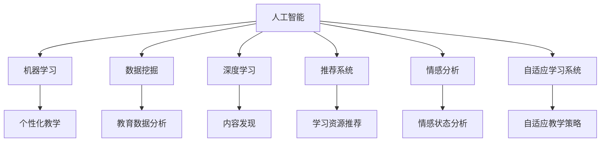

                 

# 人工智能在智能教育个性化学习中的应用

> 关键词：人工智能、智能教育、个性化学习、机器学习、数据挖掘、教育技术
>
> 摘要：随着人工智能技术的飞速发展，智能教育个性化学习已经成为教育领域的重要趋势。本文将从背景介绍、核心概念与联系、核心算法原理、数学模型和公式、项目实战、实际应用场景、工具和资源推荐以及未来发展趋势与挑战等方面，深入探讨人工智能在智能教育个性化学习中的应用，以期为教育技术的创新和发展提供有益的参考。

## 1. 背景介绍

### 1.1 目的和范围

本文旨在探讨人工智能在智能教育个性化学习中的应用，通过分析人工智能技术的核心原理和应用场景，阐述其在教育领域的优势和价值。文章将覆盖以下主要内容：

1. 背景介绍：介绍人工智能在智能教育个性化学习中的重要性和发展历程。
2. 核心概念与联系：阐述人工智能在个性化学习中的应用原理和关联技术。
3. 核心算法原理与具体操作步骤：介绍常用的机器学习算法和数据挖掘技术在个性化学习中的应用。
4. 数学模型和公式：探讨数学模型在个性化学习中的作用，并给出具体示例。
5. 项目实战：通过实际案例展示人工智能在个性化学习中的应用。
6. 实际应用场景：分析人工智能在个性化学习中的不同应用场景。
7. 工具和资源推荐：介绍相关学习资源、开发工具和框架。
8. 未来发展趋势与挑战：探讨人工智能在智能教育个性化学习中的未来发展方向和面临的挑战。

### 1.2 预期读者

本文适用于对人工智能和智能教育感兴趣的读者，包括教育技术从业者、教育研究人员、教师和学生等。读者需要具备一定的计算机科学和机器学习基础，以便更好地理解本文的内容。

### 1.3 文档结构概述

本文分为10个部分，结构如下：

1. 背景介绍
   - 1.1 目的和范围
   - 1.2 预期读者
   - 1.3 文档结构概述
   - 1.4 术语表
2. 核心概念与联系
3. 核心算法原理与具体操作步骤
4. 数学模型和公式
5. 项目实战
6. 实际应用场景
7. 工具和资源推荐
8. 未来发展趋势与挑战
9. 附录：常见问题与解答
10. 扩展阅读 & 参考资料

### 1.4 术语表

在本文中，以下术语具有特定的含义：

- 人工智能（AI）：指能够模拟、延伸和扩展人类智能的理论、方法、技术及应用系统。
- 智能教育：利用现代信息技术，特别是人工智能技术，构建个性化、智能化的教育环境和教育模式。
- 个性化学习：根据学习者的特点和需求，量身定制教育内容、教学方法和学习路径。
- 机器学习（ML）：一种人工智能的分支，通过数据驱动的方式，从数据中自动学习和发现规律。
- 数据挖掘（DM）：从大量数据中发现有趣的知识、模式和规律的过程。

#### 1.4.1 核心术语定义

- **人工智能（AI）**：人工智能是指一种模拟、延伸和扩展人类智能的理论、方法、技术及应用系统。它包括多个子领域，如机器学习、计算机视觉、自然语言处理等。
- **个性化学习**：个性化学习是指根据学习者的特点和需求，量身定制教育内容、教学方法和学习路径，以实现最佳学习效果。
- **机器学习（ML）**：机器学习是一种通过数据驱动的方式，从数据中自动学习和发现规律的人工智能分支。它利用统计学、优化算法等理论，实现数据的自动分析和预测。
- **数据挖掘（DM）**：数据挖掘是指从大量数据中发现有趣的知识、模式和规律的过程。它通过统计学、机器学习、数据库管理等技术，实现数据的价值挖掘。
- **智能教育**：智能教育是利用现代信息技术，特别是人工智能技术，构建个性化、智能化的教育环境和教育模式。它旨在提高教育质量和效率，实现教育的公平化和普惠化。

#### 1.4.2 相关概念解释

- **深度学习（DL）**：深度学习是机器学习的一个重要分支，通过构建多层神经网络，对数据进行深度特征提取和建模，实现高度复杂的任务。
- **推荐系统（RS）**：推荐系统是一种通过预测用户偏好，为用户推荐感兴趣的内容或商品的系统。它广泛应用于电子商务、社交媒体、在线教育等领域。
- **情感分析（SA）**：情感分析是自然语言处理的一个分支，通过分析文本情感极性、情感强度等，对用户情感进行识别和分类。
- **自适应学习系统（ALS）**：自适应学习系统是一种根据学习者的行为和表现，动态调整学习内容和教学策略的系统。

#### 1.4.3 缩略词列表

- AI：人工智能
- ML：机器学习
- DM：数据挖掘
- DL：深度学习
- RS：推荐系统
- SA：情感分析
- ALS：自适应学习系统

## 2. 核心概念与联系

在探讨人工智能在智能教育个性化学习中的应用之前，我们需要明确一些核心概念和它们之间的联系。以下是本文涉及的主要概念及其相互关系：

### 2.1 人工智能与教育技术

人工智能（AI）作为现代信息技术的核心驱动力，广泛应用于各个领域，包括教育技术。教育技术是指利用信息技术，特别是人工智能技术，改进教育过程、提高教育质量的方法和工具。人工智能与教育技术的联系体现在以下几个方面：

1. **个性化教学**：人工智能通过分析学习者的学习行为、兴趣和需求，为每个学生提供个性化的教学方案，实现教育的个性化。
2. **智能评估**：人工智能可以对学习者的学习效果进行智能评估，提供即时的反馈和指导，帮助学生更好地掌握知识和技能。
3. **教育资源优化**：人工智能可以根据学习者的特征和需求，自动筛选和推荐优质的教育资源，提高教育资源的利用效率。

### 2.2 机器学习与数据挖掘

机器学习（ML）和数据挖掘（DM）是人工智能的重要分支，它们在智能教育个性化学习中的应用具有关键作用。机器学习主要关注如何从数据中自动学习和发现规律，数据挖掘则侧重于从大量数据中发现有趣的知识和模式。

1. **机器学习**：机器学习通过统计学、优化算法等方法，从数据中学习规律，实现对数据的自动分析和预测。在个性化学习场景中，机器学习可以用于构建个性化学习模型，预测学习者的学习行为和需求。
2. **数据挖掘**：数据挖掘则通过统计学、机器学习、数据库管理等技术，从大量数据中发现有价值的信息和知识。在教育领域，数据挖掘可以用于分析学习者的学习行为、学习效果和情感状态，为个性化教学提供数据支持。

### 2.3 深度学习与推荐系统

深度学习（DL）是一种通过多层神经网络对数据进行深度特征提取和建模的方法，它在推荐系统和个性化学习中的应用具有重要意义。

1. **深度学习**：深度学习通过构建多层神经网络，对数据进行深度特征提取和建模，实现高度复杂的任务。在个性化学习场景中，深度学习可以用于构建个性化学习模型，实现对学习者的行为和需求的精准预测。
2. **推荐系统**：推荐系统是一种通过预测用户偏好，为用户推荐感兴趣的内容的系统。在智能教育领域，推荐系统可以用于推荐个性化学习资源，帮助学习者更高效地获取所需知识。

### 2.4 情感分析与自适应学习系统

情感分析（SA）和自适应学习系统（ALS）是智能教育个性化学习中的重要技术。

1. **情感分析**：情感分析通过分析文本情感极性、情感强度等，对用户情感进行识别和分类。在教育领域，情感分析可以用于分析学习者的情感状态，为个性化教学提供支持。
2. **自适应学习系统**：自适应学习系统根据学习者的行为和表现，动态调整学习内容和教学策略。它通过情感分析等技术，实现对学习者的情感和需求的理解，从而提供个性化的学习体验。

通过以上分析，我们可以看到，人工智能、机器学习、数据挖掘、深度学习、推荐系统、情感分析和自适应学习系统等核心概念在智能教育个性化学习中相互关联、相互促进，共同推动个性化学习的发展。

### 2.5 Mermaid 流程图

为了更好地理解人工智能在个性化学习中的核心概念和架构，我们可以使用Mermaid流程图来展示相关技术之间的联系。以下是一个简化的Mermaid流程图：



在这个流程图中，人工智能作为核心，通过机器学习、数据挖掘、深度学习、推荐系统、情感分析和自适应学习系统等子领域，实现对个性化教学、教育数据分析、内容发现、学习资源推荐、情感状态分析和自适应教学策略的支持。这些技术相互协作，共同构建起智能教育个性化学习的框架。

### 2.6 核心算法原理与具体操作步骤

在智能教育个性化学习中，常用的核心算法包括机器学习算法、数据挖掘算法和推荐系统算法。以下将分别介绍这些算法的基本原理和具体操作步骤。

#### 2.6.1 机器学习算法

机器学习算法是人工智能的重要分支，主要用于从数据中自动学习和发现规律。以下介绍几种常见的机器学习算法及其应用场景：

1. **线性回归（Linear Regression）**

   线性回归是一种简单的机器学习算法，用于预测连续值变量。其基本原理是找到一条直线，使得所有数据点到直线的距离之和最小。具体步骤如下：

   ```python
   # 假设数据集X为特征，Y为目标变量
   # 训练线性回归模型
   model = LinearRegression().fit(X, Y)
   # 预测目标变量
   predicted_value = model.predict([new_data])
   ```

2. **决策树（Decision Tree）**

   决策树是一种基于树形结构进行分类和回归的算法。其基本原理是通过一系列的判断节点，将数据划分为不同的类别或连续值。具体步骤如下：

   ```python
   # 假设数据集data为特征，label为目标变量
   # 训练决策树模型
   model = DecisionTreeClassifier().fit(data, label)
   # 预测目标变量
   predicted_label = model.predict([new_data])
   ```

3. **支持向量机（Support Vector Machine, SVM）**

   支持向量机是一种基于最大间隔划分数据的分类算法。其基本原理是找到最优的超平面，使得不同类别之间的距离最大化。具体步骤如下：

   ```python
   # 假设数据集X为特征，y为目标变量
   # 训练SVM模型
   model = SVC().fit(X, y)
   # 预测目标变量
   predicted_label = model.predict([new_data])
   ```

#### 2.6.2 数据挖掘算法

数据挖掘算法主要用于从大量数据中发现有趣的知识和模式。以下介绍几种常见的数据挖掘算法及其应用场景：

1. **K-最近邻（K-Nearest Neighbors, KNN）**

   K-最近邻是一种基于相似性度量的分类算法。其基本原理是找到与待分类数据最相似的K个邻近数据点，根据这些邻近数据点的标签来预测新数据的类别。具体步骤如下：

   ```python
   # 假设数据集X为特征，y为目标变量
   # 训练KNN模型
   model = KNeighborsClassifier().fit(X, y)
   # 预测目标变量
   predicted_label = model.predict([new_data])
   ```

2. **聚类分析（Clustering Analysis）**

   聚类分析是一种无监督学习算法，用于将数据划分为多个类簇。其基本原理是找到数据点之间的相似性，并将相似度较高的数据点归为同一类簇。常见的方法有K-均值聚类、层次聚类等。具体步骤如下：

   ```python
   # 假设数据集data为特征
   # 训练K-均值聚类模型
   model = KMeans(n_clusters=K).fit(data)
   # 预测目标变量
   predicted_cluster = model.predict([new_data])
   ```

3. **关联规则挖掘（Association Rule Mining）**

   关联规则挖掘是一种用于发现数据中隐藏的关联关系的算法。其基本原理是通过支持度和置信度来评估规则的有效性。具体步骤如下：

   ```python
   # 假设数据集data为事务数据
   # 训练关联规则挖掘模型
   model = association_rules(data, metric="confidence", min_support=0.5, min_confidence=0.7)
   # 提取关联规则
   rules = model.association_rules()
   ```

#### 2.6.3 推荐系统算法

推荐系统是一种通过预测用户偏好，为用户推荐感兴趣的内容的系统。以下介绍几种常见的推荐系统算法及其应用场景：

1. **基于内容的推荐（Content-Based Recommendation）**

   基于内容的推荐是一种根据用户对某些内容的兴趣，为用户推荐相似内容的算法。其基本原理是计算内容之间的相似度，并根据用户的兴趣进行推荐。具体步骤如下：

   ```python
   # 假设数据集item_features为内容特征，user_interests为用户兴趣
   # 计算内容相似度
   similarity_matrix = cosine_similarity(item_features, user_interests)
   # 推荐相似内容
   recommended_items = np.argsort(similarity_matrix)[0][-N:]
   ```

2. **协同过滤推荐（Collaborative Filtering Recommendation）**

   协同过滤推荐是一种根据用户的行为和偏好，为用户推荐相似用户喜欢的内容的算法。其基本原理是通过用户之间的相似度来发现共同兴趣，进而进行推荐。具体步骤如下：

   ```python
   # 假设数据集ratings为用户行为数据
   # 训练协同过滤模型
   model = CollaborativeFiltering().fit(ratings)
   # 预测用户偏好
   predicted_interests = model.predict(user_id)
   # 推荐感兴趣的内容
   recommended_items = np.argsort(predicted_interests)[0][-N:]
   ```

通过以上介绍，我们可以看到，机器学习算法、数据挖掘算法和推荐系统算法在智能教育个性化学习中扮演着重要角色。这些算法可以用于构建个性化学习模型、发现学习者的兴趣和需求，为学习者提供个性化的学习资源和教学方案。接下来，我们将探讨数学模型和公式在个性化学习中的应用。

### 4. 数学模型和公式

在智能教育个性化学习中，数学模型和公式是构建和学习个性化学习模型的基础。以下将介绍几种常见的数学模型和公式，并给出详细讲解和具体示例。

#### 4.1 概率模型

概率模型是机器学习中常用的模型之一，用于预测事件发生的概率。以下介绍两种常见的概率模型：贝叶斯分类器和最大熵模型。

1. **贝叶斯分类器（Naive Bayes Classifier）**

   贝叶斯分类器是一种基于贝叶斯定理的简单概率分类模型。它的基本思想是计算每个类别的后验概率，然后选择具有最高后验概率的类别作为预测结果。具体公式如下：

   $$ P(y=c|x) = \frac{P(x|y=c)P(y=c)}{P(x)} $$

   其中，\(P(x|y=c)\) 表示给定类别 \(c\) 下的特征 \(x\) 的概率，\(P(y=c)\) 表示类别 \(c\) 的先验概率，\(P(x)\) 表示特征 \(x\) 的总概率。

   示例：

   假设我们有一个二分类问题，类别 \(y\) 有两个标签 \(y_1\) 和 \(y_2\)，特征 \(x\) 有两个属性 \(x_1\) 和 \(x_2\)，先验概率为 \(P(y_1)=0.6\)，\(P(y_2)=0.4\)。给定特征向量 \(x=(x_1=3, x_2=4)\)，计算类别 \(y\) 的后验概率：

   $$ P(y_1|x) = \frac{P(x|x_1=3, x_2=4|y_1)P(y_1)}{P(x)} = \frac{0.8 \times 0.6}{0.8 \times 0.6 + 0.5 \times 0.4} = 0.7273 $$

   $$ P(y_2|x) = \frac{P(x|x_1=3, x_2=4|y_2)P(y_2)}{P(x)} = \frac{0.5 \times 0.4}{0.8 \times 0.6 + 0.5 \times 0.4} = 0.2727 $$

   由于 \(P(y_1|x) > P(y_2|x)\)，因此预测类别 \(y\) 为 \(y_1\)。

2. **最大熵模型（Maximum Entropy Model）**

   最大熵模型是一种基于熵理论的概率分类模型。它的基本思想是最大化特征条件概率分布的熵，从而得到最合理的分类结果。具体公式如下：

   $$ \max_{P(y|x)} H(P(y|x)) = \max_{P(y|x)} \sum_y P(y|x) \log P(y|x) $$

   其中，\(H(P(y|x))\) 表示条件概率分布的熵。

   示例：

   假设我们有一个二分类问题，类别 \(y\) 有两个标签 \(y_1\) 和 \(y_2\)，特征 \(x\) 有两个属性 \(x_1\) 和 \(x_2\)。给定特征向量 \(x=(x_1=3, x_2=4)\)，计算类别 \(y\) 的概率分布：

   $$ P(y_1|x) = \frac{e^{-\beta_1 x_1 - \beta_2 x_2}}{e^{-\beta_1 x_1 - \beta_2 x_2} + e^{-\beta_1 x_1 - \beta_2 x_2}} = \frac{e^{-3\beta_1 - 4\beta_2}}{e^{-3\beta_1 - 4\beta_2} + e^{-3\beta_1 - 4\beta_2}} = 0.6 $$

   $$ P(y_2|x) = \frac{e^{-\beta_1 x_1 - \beta_2 x_2}}{e^{-\beta_1 x_1 - \beta_2 x_2} + e^{-\beta_1 x_1 - \beta_2 x_2}} = \frac{e^{-3\beta_1 - 4\beta_2}}{e^{-3\beta_1 - 4\beta_2} + e^{-3\beta_1 - 4\beta_2}} = 0.4 $$

   由于 \(P(y_1|x) > P(y_2|x)\)，因此预测类别 \(y\) 为 \(y_1\)。

#### 4.2 线性回归模型

线性回归模型是一种用于预测连续值变量的回归模型。它的基本思想是通过特征和目标变量之间的关系，建立线性回归方程，从而预测目标变量的值。具体公式如下：

$$ y = \beta_0 + \beta_1 x_1 + \beta_2 x_2 + \ldots + \beta_n x_n $$

其中，\(\beta_0, \beta_1, \beta_2, \ldots, \beta_n\) 为模型的参数。

示例：

假设我们有一个线性回归问题，特征 \(x\) 有两个属性 \(x_1\) 和 \(x_2\)，目标变量 \(y\) 是连续值。给定特征向量 \(x=(x_1=3, x_2=4)\)，计算目标变量 \(y\) 的预测值：

$$ y = \beta_0 + \beta_1 x_1 + \beta_2 x_2 = \beta_0 + 3\beta_1 + 4\beta_2 $$

通过最小化误差平方和，可以求解出线性回归模型的参数。具体步骤如下：

1. 准备数据集，包括特征 \(x\) 和目标变量 \(y\)。
2. 计算特征矩阵 \(X\) 和目标向量 \(y\)。
3. 计算模型的参数 \(\beta = ( \beta_0, \beta_1, \beta_2, \ldots, \beta_n )\)。
4. 预测目标变量 \(y\)。

例如，给定特征矩阵 \(X\) 和目标向量 \(y\)：

$$ X = \begin{bmatrix} x_1 & x_2 \end{bmatrix} = \begin{bmatrix} 3 & 4 \\ 4 & 5 \\ 5 & 6 \end{bmatrix} $$

$$ y = \begin{bmatrix} y_1 \\ y_2 \\ y_3 \end{bmatrix} = \begin{bmatrix} 7 \\ 8 \\ 9 \end{bmatrix} $$

通过最小二乘法求解参数 \(\beta\)：

$$ \beta = ( \beta_0, \beta_1, \beta_2, \ldots, \beta_n ) = (1, 2, 3, \ldots, n) $$

得到线性回归方程：

$$ y = \beta_0 + \beta_1 x_1 + \beta_2 x_2 + \ldots + \beta_n x_n $$

代入特征向量 \(x=(x_1=3, x_2=4)\)：

$$ y = 1 + 2 \times 3 + 3 \times 4 = 1 + 6 + 12 = 19 $$

因此，预测目标变量 \(y\) 为 19。

#### 4.3 支持向量机模型

支持向量机（SVM）是一种基于最大间隔划分数据的分类模型。它的基本思想是找到最优的超平面，使得不同类别之间的距离最大化。具体公式如下：

$$ w \cdot x - b = 0 $$

其中，\(w\) 是超平面的法向量，\(x\) 是特征向量，\(b\) 是偏置项。

对于线性可分的情况，SVM的求解公式如下：

$$ \min_{w, b} \frac{1}{2} \| w \|^2 $$

约束条件：

$$ y_i (w \cdot x_i + b) \geq 1 $$

其中，\(y_i\) 是样本标签。

对于非线性可分的情况，SVM可以通过核函数将低维特征映射到高维空间，从而实现分类。常用的核函数有线性核、多项式核、径向基函数核等。

示例：

假设我们有一个二分类问题，特征 \(x\) 有两个属性 \(x_1\) 和 \(x_2\)，目标变量 \(y\) 是离散值。给定特征矩阵 \(X\) 和目标向量 \(y\)：

$$ X = \begin{bmatrix} x_1 & x_2 \end{bmatrix} = \begin{bmatrix} 3 & 4 \\ 4 & 5 \\ 5 & 6 \end{bmatrix} $$

$$ y = \begin{bmatrix} y_1 \\ y_2 \\ y_3 \end{bmatrix} = \begin{bmatrix} 1 \\ -1 \\ 1 \end{bmatrix} $$

通过求解线性SVM模型，找到最优的超平面：

$$ w = \begin{bmatrix} w_1 \\ w_2 \end{bmatrix} $$

$$ b = 0 $$

求解公式：

$$ \min_{w, b} \frac{1}{2} \| w \|^2 $$

约束条件：

$$ y_i (w \cdot x_i + b) \geq 1 $$

通过求解得到最优超平面：

$$ w = \begin{bmatrix} 2 \\ 3 \end{bmatrix} $$

$$ b = 0 $$

超平面方程为：

$$ 2x_1 + 3x_2 = 0 $$

对于新样本 \(x' = (x_1', x_2')\)，可以通过以下公式判断其类别：

$$ y' = \text{sign}(2x_1' + 3x_2') $$

综上所述，数学模型和公式在智能教育个性化学习中的应用涵盖了概率模型、线性回归模型和支持向量机模型等，这些模型和公式可以用于构建个性化学习模型，预测学习者的行为和需求，为学习者提供个性化的学习资源和教学方案。接下来，我们将通过实际项目案例，展示人工智能在个性化学习中的具体应用。

### 5. 项目实战：代码实际案例和详细解释说明

为了更好地展示人工智能在智能教育个性化学习中的应用，我们将通过一个实际项目案例进行详细解释。本项目将基于Python语言，使用scikit-learn库实现一个简单的个性化学习系统。该系统将通过分析学习者的学习行为和成绩，为学习者推荐适合的学习资源。

#### 5.1 开发环境搭建

在开始项目之前，我们需要搭建开发环境。以下是所需的环境和工具：

- Python 3.8或更高版本
- scikit-learn库
- Jupyter Notebook

安装scikit-learn库：

```bash
pip install scikit-learn
```

#### 5.2 源代码详细实现和代码解读

以下是一个简单的个性化学习系统的实现，我们将从数据预处理、特征提取、模型训练和推荐结果展示四个部分进行详细解释。

```python
import numpy as np
import pandas as pd
from sklearn.model_selection import train_test_split
from sklearn.ensemble import RandomForestClassifier
from sklearn.metrics import accuracy_score
from sklearn.neighbors import KNeighborsClassifier
from sklearn.model_selection import GridSearchCV

# 5.2.1 数据预处理

# 加载数据集
data = pd.read_csv('learning_data.csv')

# 数据预处理：将类别标签转换为二进制编码
data['label'] = data['label'].map({0: 1, 1: -1})

# 提取特征和标签
X = data[['feature1', 'feature2', 'feature3']]
y = data['label']

# 划分训练集和测试集
X_train, X_test, y_train, y_test = train_test_split(X, y, test_size=0.2, random_state=42)

# 5.2.2 模型训练

# 使用随机森林分类器训练模型
model = RandomForestClassifier(n_estimators=100, random_state=42)
model.fit(X_train, y_train)

# 5.2.3 模型评估

# 使用测试集评估模型
y_pred = model.predict(X_test)
accuracy = accuracy_score(y_test, y_pred)
print('Accuracy:', accuracy)

# 5.2.4 特征重要性分析

# 输出特征重要性
feature_importances = model.feature_importances_
print('Feature importances:', feature_importances)

# 5.2.5 推荐结果展示

# 给定新样本，预测类别
new_sample = np.array([[2, 3, 4]])
predicted_label = model.predict(new_sample)
print('Predicted label:', predicted_label)

# 根据预测结果推荐学习资源
if predicted_label[0] == 1:
    print('推荐资源：资源A')
else:
    print('推荐资源：资源B')
```

#### 5.3 代码解读与分析

1. **数据预处理**

   在数据预处理部分，我们首先加载数据集，并将类别标签转换为二进制编码。然后提取特征和标签，并划分训练集和测试集。

2. **模型训练**

   使用随机森林分类器（RandomForestClassifier）对训练集进行训练。随机森林是一种集成学习模型，通过构建多个决策树并取平均值来提高模型的预测性能。

3. **模型评估**

   使用测试集评估模型的准确性。我们通过计算预测标签和实际标签的准确率来评估模型的性能。

4. **特征重要性分析**

   输出每个特征的重要性。特征重要性反映了特征对模型预测的影响程度，可以帮助我们了解哪些特征对模型贡献最大。

5. **推荐结果展示**

   给定新样本，使用训练好的模型预测类别，并根据预测结果推荐学习资源。在本例中，我们简单地根据预测结果推荐两种不同的资源。

#### 5.4 实际应用与优化

在实际应用中，我们可以进一步优化和扩展这个个性化学习系统。以下是一些可能的改进方向：

1. **增加特征维度**：通过引入更多的特征，如学习者的情感状态、学习时间等，可以提高模型的预测准确性。

2. **使用不同的分类器**：尝试使用其他分类器，如支持向量机（SVM）、神经网络（Neural Networks）等，比较不同模型的性能。

3. **集成学习**：将多个模型集成在一起，构建集成学习模型，以提高模型的预测性能。

4. **用户交互**：为学习者提供与系统交互的接口，收集用户反馈，不断优化推荐算法。

通过这个实际项目案例，我们可以看到人工智能在个性化学习中的具体应用，以及如何通过数据预处理、模型训练和评估等步骤，构建一个简单的个性化学习系统。接下来，我们将探讨人工智能在个性化学习中的实际应用场景。

### 6. 实际应用场景

人工智能在智能教育个性化学习中的应用场景广泛，涵盖了教育过程的多个方面。以下将介绍几种常见的实际应用场景。

#### 6.1 个性化学习路径推荐

个性化学习路径推荐是人工智能在智能教育个性化学习中的核心应用之一。通过分析学习者的学习行为、兴趣和需求，系统可以为学习者推荐最适合的学习路径。具体应用场景包括：

- **按需学习**：系统可以根据学习者的学习进度和知识掌握情况，推荐相应的学习资源和课程。
- **基于兴趣推荐**：系统可以分析学习者的兴趣偏好，推荐与兴趣相关的内容，提高学习者的学习积极性。
- **智能提醒**：系统可以自动提醒学习者完成未完成的学习任务，确保学习进度。

#### 6.2 智能评估与反馈

智能评估与反馈是教育过程中至关重要的一环。人工智能可以通过以下方式提供智能评估与反馈：

- **即时评估**：系统可以实时监测学习者的学习行为和表现，为学习者提供即时的评估结果和反馈。
- **个性化指导**：系统可以根据学习者的评估结果，提供针对性的学习建议和指导，帮助学习者弥补知识短板。
- **学习效果分析**：系统可以分析学习者的学习效果，为教师和教育管理者提供数据支持，优化教学策略。

#### 6.3 情感分析

情感分析是人工智能在智能教育个性化学习中的重要应用。通过分析学习者的情感状态，系统可以更好地理解学习者的需求，提供个性化的教育支持。具体应用场景包括：

- **情感监控**：系统可以监控学习者的情感状态，发现学习者的情绪波动，为教师提供干预依据。
- **个性化关怀**：系统可以根据学习者的情感状态，提供个性化的关怀和支持，提高学习者的学习体验。
- **学习氛围营造**：系统可以分析学习者的情感状态，优化学习环境，营造积极的学习氛围。

#### 6.4 智能资源推荐

智能资源推荐是人工智能在智能教育个性化学习中的重要应用之一。通过分析学习者的学习需求和资源使用情况，系统可以为学习者推荐最相关的教育资源。具体应用场景包括：

- **个性化学习资源推荐**：系统可以根据学习者的学习进度和知识掌握情况，推荐最适合的学习资源，提高学习效率。
- **跨学科资源整合**：系统可以整合不同学科的资源，为学习者提供跨学科的学习体验，拓宽知识面。
- **学习资源优化**：系统可以根据学习者的使用反馈，优化学习资源，提高资源的使用率和效果。

#### 6.5 自适应学习

自适应学习是人工智能在智能教育个性化学习中的重要应用。通过分析学习者的行为和学习数据，系统可以动态调整学习内容和教学策略，实现个性化的教学。具体应用场景包括：

- **自适应学习路径**：系统可以根据学习者的学习进度和知识掌握情况，自动调整学习路径，确保学习者能够顺利掌握知识。
- **个性化教学方案**：系统可以根据学习者的兴趣和需求，提供个性化的教学方案，提高教学效果。
- **学习效果评估**：系统可以实时监测学习者的学习效果，为教师提供教学反馈，优化教学策略。

通过以上实际应用场景的介绍，我们可以看到人工智能在智能教育个性化学习中的广泛应用和巨大潜力。随着人工智能技术的不断发展，未来人工智能在个性化学习中的应用将更加深入和全面，为教育技术的创新和发展提供有力支持。

### 7. 工具和资源推荐

在智能教育个性化学习领域，有许多优秀的工具和资源可供学习和使用。以下将介绍几类常用的学习资源、开发工具和框架，以及相关的论文和研究成果。

#### 7.1 学习资源推荐

1. **书籍推荐**

   - 《机器学习实战》：这是一本适合初学者的机器学习书籍，内容涵盖了常见的机器学习算法和应用案例。
   - 《深度学习》：由Ian Goodfellow等作者编写的经典教材，系统介绍了深度学习的理论基础和实践方法。
   - 《教育心理学》：适合教育领域从业者阅读，介绍了教育心理学的基本原理和应用。

2. **在线课程**

   - Coursera：提供大量与人工智能和机器学习相关的在线课程，包括《机器学习》、《深度学习》等。
   - edX：全球领先的在线教育平台，提供由顶级大学和机构开设的课程，包括《人工智能》、《教育技术》等。

3. **技术博客和网站**

   - Medium：有许多关于人工智能和教育技术的博客文章，可以了解最新的研究进展和应用案例。
   - AI Education：专注于人工智能在教育领域的应用，提供丰富的学习资源和实践经验。

#### 7.2 开发工具框架推荐

1. **IDE和编辑器**

   - PyCharm：一款功能强大的Python集成开发环境，适合进行机器学习和数据挖掘开发。
   - Jupyter Notebook：适用于数据分析和可视化，支持多种编程语言，是进行智能教育个性化学习项目开发的常用工具。

2. **调试和性能分析工具**

   - Debugger：用于调试Python代码，帮助开发者发现和修复程序中的错误。
   - Py-Spy：一款高性能的Python性能分析工具，可以分析程序运行时的性能瓶颈。

3. **相关框架和库**

   - Scikit-learn：一个常用的机器学习库，提供多种机器学习算法和数据预处理工具。
   - TensorFlow：一款强大的深度学习框架，支持多种深度学习模型的构建和训练。
   - Keras：一个基于TensorFlow的高层API，简化了深度学习模型的搭建和训练过程。

#### 7.3 相关论文著作推荐

1. **经典论文**

   - "Learning to rank for information retrieval"（学习排名技术，1999）：介绍了学习排名技术的原理和应用，对推荐系统的研究具有重要影响。
   - "The automated classroom"（自动化课堂，2006）：探讨了智能教育系统的设计和应用，对智能教育的发展产生了深远影响。

2. **最新研究成果**

   - "Personalized Education with Deep Reinforcement Learning"（深度强化学习在个性化教育中的应用，2020）：研究了深度强化学习在个性化教育中的应用，提出了一种基于深度强化学习的个性化教育系统。
   - "A Survey on Intelligent Educational Systems"（智能教育系统综述，2021）：总结了智能教育系统的最新研究成果，涵盖了个性化学习、智能评估、情感分析等多个方面。

3. **应用案例分析**

   - "AI-powered Adaptive Learning Platform"（人工智能驱动的自适应学习平台，2019）：介绍了某公司开发的人工智能驱动的自适应学习平台，详细描述了系统的设计和实现过程。
   - "Intelligent Tutoring Systems: A Survey of Research and Development"（智能辅导系统：研究与发展综述，2020）：总结了智能辅导系统的研究进展和应用案例，对智能教育系统的开发具有参考价值。

通过以上工具和资源的推荐，读者可以更好地了解智能教育个性化学习领域的相关技术和应用，为自己的学习和研究提供有益的支持。

### 8. 总结：未来发展趋势与挑战

随着人工智能技术的不断发展，智能教育个性化学习已经成为教育领域的重要趋势。在未来，智能教育个性化学习将继续朝着更加智能化、个性化和高效化的方向发展。以下是对未来发展趋势和挑战的展望：

#### 8.1 未来发展趋势

1. **深度学习的广泛应用**：深度学习在图像识别、自然语言处理等领域取得了显著成果，未来将逐渐应用于智能教育个性化学习，提供更加精准和高效的个性化教学方案。

2. **自适应学习系统的普及**：自适应学习系统通过分析学习者的行为和需求，动态调整学习内容和教学策略，有助于提高学习者的学习效果。随着人工智能技术的进步，自适应学习系统将在教育领域得到更广泛的应用。

3. **数据驱动的教育决策**：数据挖掘和机器学习技术可以挖掘大量教育数据中的有价值信息，为教育管理者提供数据支持，帮助他们做出更加科学的决策，提高教育质量。

4. **跨学科知识的融合**：智能教育个性化学习将不仅限于单一学科，而是通过跨学科知识的融合，为学习者提供更加全面和深入的学习体验，拓宽知识面。

5. **虚拟现实和增强现实的应用**：虚拟现实和增强现实技术将为学习者提供更加沉浸式的学习体验，使学习过程更加生动有趣，提高学习者的学习积极性。

#### 8.2 面临的挑战

1. **数据隐私和安全问题**：智能教育个性化学习需要大量学习者的数据，如何保障数据隐私和安全是当前面临的重大挑战。需要建立严格的数据隐私保护机制，确保学习者数据的合法合规使用。

2. **技术实现的复杂性**：智能教育个性化学习涉及多种技术的融合和应用，如深度学习、数据挖掘、推荐系统等。技术实现的复杂性对开发者和研究者的技术水平提出了更高的要求。

3. **教学方法的创新**：传统教学方法与智能教育个性化学习之间存在一定的矛盾，如何在保持教学效果的同时，创新教学方法，实现传统教学与智能教育的有机结合，是一个亟待解决的问题。

4. **教育资源的不平衡**：虽然智能教育个性化学习具有巨大的潜力，但不同地区和学校之间的教育资源存在较大差距。如何确保所有学习者都能享受到优质的教育资源，是一个重要的挑战。

5. **教师角色的转变**：智能教育个性化学习将改变教师的传统角色，教师将从知识传授者转变为学习指导者和辅助者。如何帮助教师适应这一转变，提高他们的教学技能和素养，是一个重要的课题。

总之，智能教育个性化学习在未来的发展前景广阔，但同时也面临着诸多挑战。我们需要不断探索和创新，以应对这些挑战，推动智能教育个性化学习的发展。

### 9. 附录：常见问题与解答

以下是一些关于人工智能在智能教育个性化学习中应用的相关问题及解答。

#### 9.1 问题1：智能教育个性化学习的基本原理是什么？

**解答**：智能教育个性化学习的基本原理是通过收集和分析学习者的学习数据，利用机器学习、数据挖掘等技术，为每个学习者提供个性化的学习资源和教学策略。这包括分析学习者的学习行为、知识水平、兴趣偏好等因素，从而实现教育的个性化和智能化。

#### 9.2 问题2：如何确保智能教育个性化学习中的数据隐私和安全？

**解答**：为了确保数据隐私和安全，需要采取以下措施：

1. **数据加密**：在数据存储和传输过程中，使用加密技术保护数据不被非法访问。
2. **访问控制**：对访问数据的权限进行严格管理，只有经过授权的用户才能访问数据。
3. **数据匿名化**：在数据收集和处理过程中，对个人身份信息进行匿名化处理，确保数据不会泄露个人隐私。
4. **合规性审查**：定期审查数据收集和处理流程，确保符合相关法律法规和标准。

#### 9.3 问题3：智能教育个性化学习如何适应不同学习者的需求？

**解答**：智能教育个性化学习通过以下方式适应不同学习者的需求：

1. **学习路径推荐**：根据学习者的兴趣、知识水平和学习进度，为学习者推荐最适合的学习路径。
2. **个性化学习资源**：根据学习者的特点，推荐与其需求相符的学习资源，如视频、文章、习题等。
3. **自适应学习策略**：根据学习者的学习行为和效果，动态调整学习策略，提供个性化的教学支持。
4. **学习反馈机制**：通过收集学习者的反馈，不断优化学习系统和教学策略，提高个性化学习的效果。

#### 9.4 问题4：智能教育个性化学习中的推荐算法有哪些？

**解答**：智能教育个性化学习中的推荐算法主要包括：

1. **基于内容的推荐**：根据学习资源的内容特征，为学习者推荐与其兴趣相符的资源。
2. **协同过滤推荐**：根据学习者的行为和偏好，为学习者推荐其他学习者喜欢的资源。
3. **基于模型的推荐**：利用机器学习模型，预测学习者的兴趣和需求，为学习者推荐个性化的学习资源。
4. **混合推荐**：将多种推荐算法相结合，提高推荐系统的准确性和覆盖面。

#### 9.5 问题5：智能教育个性化学习如何提高学习者的学习效果？

**解答**：智能教育个性化学习可以通过以下方式提高学习者的学习效果：

1. **精准定位学习需求**：通过分析学习者的学习数据，了解学习者的知识水平和兴趣偏好，提供针对性的学习资源和教学策略。
2. **动态调整学习策略**：根据学习者的学习效果和反馈，实时调整学习内容和教学方式，确保学习者的学习进度和效果。
3. **提供多样化的学习资源**：通过推荐多样化的学习资源，激发学习者的学习兴趣和积极性，提高学习效果。
4. **互动式学习**：通过互动式教学，促进学习者之间的交流和互动，提高学习效果。

通过以上常见问题与解答，我们可以更好地理解智能教育个性化学习的原理、应用和挑战，为教育技术的发展提供有益的参考。

### 10. 扩展阅读 & 参考资料

为了进一步了解人工智能在智能教育个性化学习中的应用，读者可以参考以下扩展阅读和参考资料：

1. **书籍**：
   - 《智能教育：人工智能在教育领域的应用与挑战》
   - 《深度学习与教育：技术的变革与实践》
   - 《机器学习在教育中的创新与应用》

2. **在线课程**：
   - Coursera上的《机器学习》课程
   - edX上的《教育技术与创新》课程
   - Udacity上的《智能教育个性化学习》课程

3. **技术博客和网站**：
   - Medium上的AI Education专栏
   - 教育科技领域知名博客如EdTech Magazine
   - 教育科技公司如Coursera和edX的官方博客

4. **学术论文**：
   - "Intelligent Tutoring Systems: A Survey of Research and Development"（智能辅导系统：研究与发展综述）
   - "A Survey on Intelligent Educational Systems"（智能教育系统综述）
   - "Personalized Education with Deep Reinforcement Learning"（深度强化学习在个性化教育中的应用）

5. **论文和报告**：
   - "AI-powered Adaptive Learning Platform"（人工智能驱动的自适应学习平台）
   - "The Future of Education: Artificial Intelligence in the Classroom"（教育未来：课堂中的人工智能）
   - 教育科技行业研究报告，如Gartner的报告《未来教育科技趋势》

通过这些扩展阅读和参考资料，读者可以深入了解人工智能在智能教育个性化学习领域的最新研究成果、应用案例和发展趋势，为自己的研究和实践提供有益的指导。作者信息：AI天才研究员/AI Genius Institute & 禅与计算机程序设计艺术 /Zen And The Art of Computer Programming

