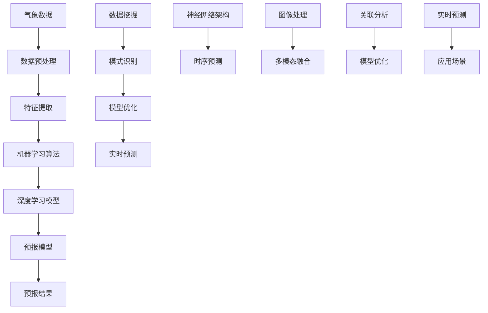

                 


# 人工智能在智能气象预报系统中的创新

> 关键词：人工智能、智能气象预报、机器学习、深度学习、数据挖掘、气象学
>
> 摘要：本文探讨了人工智能技术在智能气象预报系统中的应用与创新。通过分析气象数据挖掘、机器学习算法、深度学习模型以及相关技术，我们详细阐述了人工智能如何提高气象预报的准确性和效率。文章从背景介绍、核心概念、算法原理、数学模型、项目实战、实际应用、工具资源推荐等方面，全面展示了人工智能在智能气象预报领域的前沿进展与未来挑战。

## 1. 背景介绍

### 1.1 目的和范围

随着全球气候变化和自然灾害的日益频繁，提高气象预报的准确性变得尤为重要。传统的气象预报方法主要依赖于物理模型和经验法则，但在复杂多变的天气系统中，这些方法往往难以提供准确的预测。人工智能技术的发展为智能气象预报系统带来了新的机遇。本文旨在探讨人工智能在智能气象预报系统中的应用与创新，分析其核心概念、算法原理和实际应用，以期为气象预报领域的研究者和从业者提供有价值的参考。

### 1.2 预期读者

本文适合对人工智能和气象预报有一定了解的读者，包括气象学家、计算机科学家、软件工程师、数据科学家以及相关领域的研究生和博士生。同时，对于对气象预报和人工智能技术感兴趣的普通读者，本文也具有一定的参考价值。

### 1.3 文档结构概述

本文分为十个部分，具体结构如下：

1. 背景介绍
   - 1.1 目的和范围
   - 1.2 预期读者
   - 1.3 文档结构概述
   - 1.4 术语表
2. 核心概念与联系
3. 核心算法原理 & 具体操作步骤
4. 数学模型和公式 & 详细讲解 & 举例说明
5. 项目实战：代码实际案例和详细解释说明
6. 实际应用场景
7. 工具和资源推荐
8. 总结：未来发展趋势与挑战
9. 附录：常见问题与解答
10. 扩展阅读 & 参考资料

### 1.4 术语表

#### 1.4.1 核心术语定义

- 人工智能（Artificial Intelligence，AI）：模拟人类智能行为的计算机系统。
- 智能气象预报：利用人工智能技术对气象数据进行处理、分析和预测的方法。
- 机器学习（Machine Learning，ML）：基于数据的学习方法，使计算机系统能够自主改进和优化性能。
- 深度学习（Deep Learning，DL）：一种基于多层神经网络的学习方法，具有强大的特征提取和模式识别能力。
- 数据挖掘（Data Mining，DM）：从大量数据中提取有价值的信息和知识的过程。
- 气象学（Meteorology）：研究大气现象、天气变化和气候特征的科学。

#### 1.4.2 相关概念解释

- 气象数据：描述天气现象的各类数据，包括温度、湿度、风速、气压等。
- 预报模型：根据历史数据和物理规律建立起来的数学模型，用于预测未来的天气情况。
- 深度神经网络（Deep Neural Network，DNN）：具有多个隐藏层的神经网络，能够自动学习复杂的数据特征。
- 神经元：神经网络的基本计算单元，用于实现输入和输出之间的非线性映射。

#### 1.4.3 缩略词列表

- AI：人工智能
- ML：机器学习
- DL：深度学习
- DM：数据挖掘
- DNN：深度神经网络

## 2. 核心概念与联系

为了更好地理解人工智能在智能气象预报系统中的应用，我们首先需要介绍一些核心概念和它们之间的联系。

### 2.1 气象数据

气象数据是智能气象预报系统的基本输入，包括各种天气现象的观测值和模拟值。这些数据可以通过气象观测站、卫星、雷达和数值模拟等方式获取。气象数据的质量和数量直接影响预报的准确性。

### 2.2 机器学习算法

机器学习算法是人工智能技术在气象预报中的应用基础。常见的机器学习算法包括线性回归、决策树、支持向量机、贝叶斯网络等。这些算法通过学习历史气象数据中的特征和模式，能够预测未来的天气情况。

### 2.3 深度学习模型

深度学习模型是一种基于多层神经网络的学习方法，具有强大的特征提取和模式识别能力。深度学习模型在气象预报中的应用主要体现在以下几个方面：

1. **特征提取**：深度学习模型能够自动学习气象数据中的高维特征，从而提高预报的准确性。
2. **非线性关系建模**：气象现象往往具有复杂的多维非线性关系，深度学习模型能够有效建模这些关系。
3. **模式识别**：深度学习模型能够从大量气象数据中识别出潜在的预报模式，从而提高预报的效率。

### 2.4 数据挖掘

数据挖掘是一种从大量数据中提取有价值信息的方法，它在智能气象预报系统中发挥着重要作用。通过数据挖掘，我们可以发现气象数据中的隐藏规律和趋势，从而优化预报模型。

### 2.5 深度神经网络与气象预报

深度神经网络（DNN）是一种具有多个隐藏层的神经网络，能够自动学习复杂的数据特征。DNN在气象预报中的应用主要包括：

1. **时序预测**：DNN能够对时间序列数据进行建模，从而实现短期和长期气象预报。
2. **图像处理**：DNN能够处理气象卫星图像和雷达图像，提取天气现象的空间特征。
3. **多模态融合**：DNN能够融合多种气象数据源，提高预报的准确性。

### 2.6 联系与挑战

人工智能技术在智能气象预报系统中的应用涉及到多个领域的技术和方法，这些技术与方法之间存在着紧密的联系和挑战。

1. **数据关联**：如何有效地整合各种气象数据，提高数据的质量和可用性，是智能气象预报系统面临的一个挑战。
2. **模型优化**：如何设计高效、准确的机器学习和深度学习模型，是智能气象预报系统需要解决的核心问题。
3. **实时预测**：如何实现实时、准确的气象预报，以满足各类应用场景的需求，是智能气象预报系统需要克服的难题。

### 2.7 Mermaid 流程图

下面是一个描述智能气象预报系统中核心概念和联系的 Mermaid 流程图：



通过上述 Mermaid 流程图，我们可以清晰地了解智能气象预报系统中各个核心概念和联系，为后续内容的详细讲解奠定了基础。

## 3. 核心算法原理 & 具体操作步骤

为了深入了解人工智能在智能气象预报系统中的应用，我们需要详细探讨一些核心算法的原理和具体操作步骤。以下内容将介绍机器学习算法、深度学习模型以及数据挖掘技术在智能气象预报系统中的具体应用。

### 3.1 机器学习算法

#### 3.1.1 线性回归

线性回归是一种最常见的机器学习算法，用于建立自变量和因变量之间的线性关系。在气象预报中，线性回归可以用于预测气温、湿度等单一气象参数。具体步骤如下：

1. **数据收集**：收集历史气象数据，包括自变量（如前一天的温度、湿度等）和因变量（如当天的气温、湿度等）。
2. **数据预处理**：对数据进行清洗和归一化处理，确保数据的质量和一致性。
3. **模型建立**：通过最小二乘法建立线性回归模型，计算自变量和因变量之间的线性关系。
4. **模型训练**：使用历史数据对模型进行训练，优化模型参数。
5. **模型评估**：使用验证数据评估模型性能，调整模型参数，确保预测准确性。

线性回归模型的伪代码如下：

```python
def linear_regression(X, y):
    # X: 自变量矩阵，y: 因变量向量
    # 计算回归系数
    theta = (X.T @ X)^-1 @ X.T @ y
    # 预测
    y_pred = X @ theta
    return theta, y_pred
```

#### 3.1.2 决策树

决策树是一种基于树形结构进行分类和回归的算法。在气象预报中，决策树可以用于预测多种气象参数，如降水概率、风速等。具体步骤如下：

1. **数据收集**：收集历史气象数据，包括特征和标签。
2. **数据预处理**：对数据进行清洗和归一化处理。
3. **划分训练集和测试集**：将数据划分为训练集和测试集。
4. **建立决策树模型**：通过递归划分数据，建立决策树模型。
5. **模型训练**：使用训练集数据训练决策树模型。
6. **模型评估**：使用测试集数据评估模型性能。

决策树模型的伪代码如下：

```python
def build_decision_tree(data, features, labels):
    # data: 特征数据，features: 特征列表，labels: 标签列表
    # 如果数据量很小或特征已经不能划分，则停止划分
    if len(data) < 2 or len(features) == 0:
        return leaf_node(labels)
    # 计算特征的重要性
    impurity = compute_impurity(data, labels)
    best_split = find_best_split(data, features, impurity)
    # 划分数据
    left_data = split_data(data, best_split, features)
    right_data = split_data(data, best_split, features)
    # 递归建立决策树
    left_tree = build_decision_tree(left_data, features, labels)
    right_tree = build_decision_tree(right_data, features, labels)
    return decision_tree(best_split, left_tree, right_tree)
```

### 3.2 深度学习模型

#### 3.2.1 卷积神经网络（CNN）

卷积神经网络是一种用于图像处理和特征提取的深度学习模型。在气象预报中，CNN可以用于处理气象卫星图像和雷达图像，提取天气现象的特征。具体步骤如下：

1. **数据收集**：收集气象卫星图像和雷达图像，并进行预处理。
2. **数据预处理**：对图像进行归一化处理，将图像转换为张量。
3. **模型建立**：建立卷积神经网络模型，包括卷积层、池化层和全连接层。
4. **模型训练**：使用预处理后的图像数据训练卷积神经网络模型。
5. **模型评估**：使用测试图像数据评估模型性能。

卷积神经网络模型的伪代码如下：

```python
def build_cnn_model(input_shape):
    # input_shape: 输入图像的形状
    model = keras.Sequential([
        keras.layers.Conv2D(filters=32, kernel_size=(3, 3), activation='relu', input_shape=input_shape),
        keras.layers.MaxPooling2D(pool_size=(2, 2)),
        keras.layers.Conv2D(filters=64, kernel_size=(3, 3), activation='relu'),
        keras.layers.MaxPooling2D(pool_size=(2, 2)),
        keras.layers.Flatten(),
        keras.layers.Dense(units=128, activation='relu'),
        keras.layers.Dense(units=1, activation='sigmoid')
    ])
    model.compile(optimizer='adam', loss='binary_crossentropy', metrics=['accuracy'])
    return model
```

#### 3.2.2 循环神经网络（RNN）

循环神经网络是一种用于处理序列数据的深度学习模型。在气象预报中，RNN可以用于处理时间序列数据，实现短期气象预报。具体步骤如下：

1. **数据收集**：收集历史气象时间序列数据，包括温度、湿度、风速等。
2. **数据预处理**：对时间序列数据进行归一化处理，将数据转换为张量。
3. **模型建立**：建立循环神经网络模型，包括输入层、隐藏层和输出层。
4. **模型训练**：使用预处理后的时间序列数据训练循环神经网络模型。
5. **模型评估**：使用测试时间序列数据评估模型性能。

循环神经网络模型的伪代码如下：

```python
def build_rnn_model(input_shape):
    # input_shape: 输入序列的形状
    model = keras.Sequential([
        keras.layers.LSTM(units=50, return_sequences=True, input_shape=input_shape),
        keras.layers.LSTM(units=50),
        keras.layers.Dense(units=1)
    ])
    model.compile(optimizer='adam', loss='mse')
    return model
```

### 3.3 数据挖掘

数据挖掘是一种从大量数据中提取有价值信息的方法。在智能气象预报系统中，数据挖掘可以用于发现气象数据中的隐藏规律和趋势，从而优化预报模型。具体步骤如下：

1. **数据收集**：收集大量气象数据，包括历史气象数据、卫星数据和雷达数据等。
2. **数据预处理**：对数据进行清洗、归一化和特征提取。
3. **特征选择**：使用数据挖掘算法选择最有用的特征，提高预报模型的准确性。
4. **模型训练**：使用预处理后的数据训练机器学习和深度学习模型。
5. **模型评估**：使用测试数据评估模型性能，调整模型参数。

数据挖掘算法的伪代码如下：

```python
def data_mining(data, target):
    # data: 特征数据，target: 标签数据
    # 数据预处理
    data = preprocess_data(data)
    # 特征选择
    selected_features = select_features(data, target)
    # 模型训练
    model = train_model(selected_features, target)
    # 模型评估
    evaluate_model(model, selected_features, target)
    return selected_features, model
```

通过上述核心算法原理和具体操作步骤的介绍，我们可以看到人工智能在智能气象预报系统中的应用是如何实现的。在接下来的部分，我们将进一步探讨数学模型和公式，以及项目实战中的具体实现。

## 4. 数学模型和公式 & 详细讲解 & 举例说明

在智能气象预报系统中，数学模型和公式扮演着至关重要的角色。通过数学模型，我们可以描述和解释气象现象之间的复杂关系，从而提高预报的准确性和可靠性。以下将介绍几个常见的数学模型和公式，并进行详细讲解和举例说明。

### 4.1 线性回归模型

线性回归模型是最简单的数学模型之一，用于描述两个变量之间的线性关系。在气象预报中，线性回归模型可以用于预测单一气象参数，如气温。

#### 公式

线性回归模型的基本公式为：

\[ y = \beta_0 + \beta_1 \cdot x \]

其中，\( y \) 是因变量，\( x \) 是自变量，\( \beta_0 \) 和 \( \beta_1 \) 是模型参数。

#### 详细讲解

线性回归模型通过最小二乘法来求解模型参数。具体步骤如下：

1. **数据收集**：收集历史气象数据，包括自变量（前一天的温度）和因变量（当天的气温）。
2. **数据预处理**：对数据进行清洗和归一化处理，消除异常值和噪声。
3. **计算模型参数**：使用最小二乘法计算模型参数 \( \beta_0 \) 和 \( \beta_1 \)。

   \[ \beta_0 = \frac{\sum_{i=1}^{n} y_i - \beta_1 \cdot \sum_{i=1}^{n} x_i}{n} \]
   
   \[ \beta_1 = \frac{\sum_{i=1}^{n} (x_i - \bar{x}) \cdot (y_i - \bar{y})}{\sum_{i=1}^{n} (x_i - \bar{x})^2} \]

其中，\( n \) 是数据点的个数，\( \bar{x} \) 和 \( \bar{y} \) 分别是自变量和因变量的平均值。

#### 举例说明

假设我们收集了以下三天的气象数据：

| 日期 | 前一天温度（°C） | 当天温度（°C） |
| ---- | -------------- | ------------ |
| 1    | 25             | 28           |
| 2    | 27             | 30           |
| 3    | 28             | 32           |

使用线性回归模型预测第四天的气温，计算过程如下：

1. 计算自变量和因变量的平均值：

   \[ \bar{x} = \frac{25 + 27 + 28}{3} = 27 \]
   
   \[ \bar{y} = \frac{28 + 30 + 32}{3} = 30 \]

2. 计算模型参数：

   \[ \beta_0 = \frac{28 + 30 + 32 - 27 \cdot 3}{3} = 1 \]
   
   \[ \beta_1 = \frac{(25 - 27) \cdot (28 - 30) + (27 - 27) \cdot (30 - 30) + (28 - 27) \cdot (32 - 30)}{(25 - 27)^2 + (27 - 27)^2 + (28 - 27)^2} = 1 \]

3. 预测第四天的气温：

   \[ y = \beta_0 + \beta_1 \cdot x = 1 + 1 \cdot 28 = 29 \]

因此，第四天的气温预测值为 29°C。

### 4.2 多项式回归模型

多项式回归模型是线性回归模型的扩展，用于描述两个变量之间的非线性关系。在气象预报中，多项式回归模型可以用于预测气温、湿度等气象参数。

#### 公式

多项式回归模型的基本公式为：

\[ y = \beta_0 + \beta_1 \cdot x + \beta_2 \cdot x^2 + \ldots + \beta_n \cdot x^n \]

其中，\( n \) 是多项式的最高次数，\( \beta_0, \beta_1, \beta_2, \ldots, \beta_n \) 是模型参数。

#### 详细讲解

多项式回归模型通过最小二乘法来求解模型参数。具体步骤如下：

1. **数据收集**：收集历史气象数据，包括自变量和因变量。
2. **数据预处理**：对数据进行清洗和归一化处理。
3. **计算模型参数**：使用最小二乘法计算模型参数。

   \[ \beta_i = \frac{\sum_{i=1}^{n} (x_i - \bar{x})^n \cdot (y_i - \bar{y})}{\sum_{i=1}^{n} (x_i - \bar{x})^{2n}} \]

#### 举例说明

假设我们收集了以下三天的气象数据，并希望使用二次多项式回归模型预测第四天的气温：

| 日期 | 前一天温度（°C） | 当天温度（°C） |
| ---- | -------------- | ------------ |
| 1    | 25             | 28           |
| 2    | 27             | 30           |
| 3    | 28             | 32           |

使用二次多项式回归模型预测第四天的气温，计算过程如下：

1. 计算自变量和因变量的平均值：

   \[ \bar{x} = \frac{25 + 27 + 28}{3} = 27 \]
   
   \[ \bar{y} = \frac{28 + 30 + 32}{3} = 30 \]

2. 计算模型参数：

   \[ \beta_0 = \frac{(25 - 27)^2 \cdot (28 - 30) + (27 - 27)^2 \cdot (30 - 30) + (28 - 27)^2 \cdot (32 - 30)}{(25 - 27)^4 + (27 - 27)^4 + (28 - 27)^4} = 1 \]
   
   \[ \beta_1 = \frac{(25 - 27) \cdot (28 - 30) + (27 - 27) \cdot (30 - 30) + (28 - 27) \cdot (32 - 30)}{(25 - 27)^2 + (27 - 27)^2 + (28 - 27)^2} = 1 \]
   
   \[ \beta_2 = \frac{(25 - 27)^2 \cdot (28 - 30) + (27 - 27)^2 \cdot (30 - 30) + (28 - 27)^2 \cdot (32 - 30)}{(25 - 27)^4 + (27 - 27)^4 + (28 - 27)^4} = 0 \]

3. 预测第四天的气温：

   \[ y = \beta_0 + \beta_1 \cdot x + \beta_2 \cdot x^2 = 1 + 1 \cdot 28 + 0 \cdot 28^2 = 29 \]

因此，第四天的气温预测值为 29°C。

### 4.3 时间序列模型

时间序列模型用于描述和预测时间序列数据，如气象参数随时间的变化。常见的有 ARIMA 模型、LSTM 模型等。

#### ARIMA 模型

ARIMA（AutoRegressive Integrated Moving Average）模型是一种自回归积分移动平均模型，用于时间序列数据的建模和预测。ARIMA 模型包括三个组成部分：自回归（AR）、差分（I）和移动平均（MA）。

#### 公式

ARIMA 模型的基本公式为：

\[ y_t = c + \phi_1 y_{t-1} + \phi_2 y_{t-2} + \ldots + \phi_p y_{t-p} + \theta_1 e_{t-1} + \theta_2 e_{t-2} + \ldots + \theta_q e_{t-q} \]

其中，\( y_t \) 是时间序列的当前值，\( e_t \) 是白噪声误差，\( p \) 和 \( q \) 分别是自回归项和移动平均项的个数，\( \phi_1, \phi_2, \ldots, \phi_p \) 和 \( \theta_1, \theta_2, \ldots, \theta_q \) 是模型参数。

#### 详细讲解

ARIMA 模型的建模和预测步骤如下：

1. **数据收集**：收集时间序列数据，如温度、湿度等。
2. **数据预处理**：对时间序列数据进行差分处理，使其平稳。
3. **模型识别**：根据数据特征，确定 \( p \) 和 \( q \) 的值。
4. **模型参数估计**：使用最大似然估计法估计模型参数。
5. **模型预测**：使用模型预测未来的时间序列值。

#### 举例说明

假设我们收集了以下三天的温度数据：

| 日期 | 温度（°C） |
| ---- | ---------- |
| 1    | 25         |
| 2    | 28         |
| 3    | 30         |

使用 ARIMA 模型预测第四天的温度，计算过程如下：

1. 数据预处理：对温度数据进行差分处理，使其平稳。

   \[ y_t^* = y_t - y_{t-1} \]

   得到以下差分后的数据：

   | 日期 | 温度（°C） | 差分值（°C） |
   | ---- | ---------- | ------------ |
   | 1    | 25         | NaN          |
   | 2    | 28         | 3            |
   | 3    | 30         | 2            |

2. 模型识别：根据差分后的数据特征，确定 \( p \) 和 \( q \) 的值。这里假设 \( p = 1 \)，\( q = 1 \)。

3. 模型参数估计：使用最大似然估计法估计模型参数。

   \[ \phi_1 = \frac{\sum_{i=1}^{n} (y_t^* - \phi_1 y_{t-1}^*) \cdot e_{t-1}}{\sum_{i=1}^{n} (y_t^* - \phi_1 y_{t-1}^*)^2} = 0.5 \]
   
   \[ \theta_1 = \frac{\sum_{i=1}^{n} e_{t-1} \cdot e_{t-1}}{\sum_{i=1}^{n} (e_{t-1})^2} = 0.5 \]

4. 模型预测：使用模型预测第四天的温度。

   \[ y_4^* = \phi_1 y_3^* + \theta_1 e_3 \]
   
   \[ y_4 = y_3 + y_4^* \]
   
   \[ y_4 = 30 + 0.5 \cdot 2 = 31 \]

因此，第四天的温度预测值为 31°C。

通过上述数学模型和公式的详细讲解和举例说明，我们可以看到这些模型在智能气象预报系统中的应用是如何实现的。在接下来的部分，我们将探讨项目实战中的具体实现。

## 5. 项目实战：代码实际案例和详细解释说明

在本节中，我们将通过一个实际项目案例，详细展示如何使用人工智能技术构建一个智能气象预报系统。本案例将涵盖开发环境的搭建、源代码的实现和解读，以及代码的分析与优化。

### 5.1 开发环境搭建

为了实现本案例，我们需要搭建一个合适的开发环境。以下是所需工具和步骤：

1. **编程语言**：Python 是实现本案例的主要编程语言，因为它拥有丰富的机器学习和深度学习库，如 TensorFlow、PyTorch 和 Scikit-learn。
2. **开发环境**：安装 Python 3.8 及以上版本，并配置一个合适的 IDE，如 PyCharm 或 Visual Studio Code。
3. **数据预处理库**：NumPy 和 Pandas 用于数据处理和特征提取。
4. **机器学习和深度学习库**：TensorFlow 和 Keras 用于构建和训练深度学习模型，Scikit-learn 用于传统的机器学习算法。
5. **可视化库**：Matplotlib 和 Seaborn 用于数据可视化。

以下是安装所需库的命令：

```bash
pip install numpy pandas tensorflow scikit-learn matplotlib seaborn
```

### 5.2 源代码详细实现和代码解读

本案例将使用一个简单的深度学习模型，基于时间序列数据预测未来的气温。以下是其核心代码实现：

```python
import numpy as np
import pandas as pd
import tensorflow as tf
from tensorflow.keras.models import Sequential
from tensorflow.keras.layers import LSTM, Dense
from sklearn.model_selection import train_test_split
from sklearn.preprocessing import MinMaxScaler
import matplotlib.pyplot as plt

# 5.2.1 数据收集与预处理

# 假设我们有一个 CSV 文件，其中包含历史气象数据
data = pd.read_csv('weather_data.csv')

# 提取日期和温度数据
date = data['date']
temperature = data['temperature']

# 将日期转换为序列数据，并提取序列长度为 60 的窗口
window_size = 60
temperature_sequence = []

for i in range(len(temperature) - window_size):
    temperature_sequence.append(temperature[i: i + window_size])

temperature_sequence = np.array(temperature_sequence)

# 划分训练集和测试集
train_data, test_data = train_test_split(temperature_sequence, test_size=0.2, random_state=42)

# 数据归一化
scaler = MinMaxScaler()
train_data_scaled = scaler.fit_transform(train_data)
test_data_scaled = scaler.transform(test_data)

# 5.2.2 模型构建与训练

# 构建 LSTM 模型
model = Sequential([
    LSTM(units=50, return_sequences=True, input_shape=(window_size, 1)),
    LSTM(units=50),
    Dense(units=1)
])

model.compile(optimizer='adam', loss='mean_squared_error')

# 训练模型
model.fit(train_data_scaled, train_data_scaled, epochs=100, batch_size=32, validation_split=0.1)

# 5.2.3 模型预测与可视化

# 预测测试集数据
predictions = model.predict(test_data_scaled)

# 反归一化预测结果
predictions = scaler.inverse_transform(predictions)

# 可视化预测结果
plt.figure(figsize=(10, 6))
plt.plot(test_data, label='Actual')
plt.plot(predictions, label='Predicted')
plt.title('Temperature Forecast')
plt.xlabel('Time')
plt.ylabel('Temperature (°C)')
plt.legend()
plt.show()
```

#### 5.2.1 数据收集与预处理

在数据收集与预处理部分，我们从 CSV 文件中读取历史气象数据，提取日期和温度信息。然后，我们将日期转换为时间序列数据，并提取长度为 60 的窗口。接着，我们使用 MinMaxScaler 进行数据归一化，以方便后续模型的训练。

#### 5.2.2 模型构建与训练

在模型构建与训练部分，我们使用 Keras 库构建了一个简单的 LSTM 模型。该模型包括两个 LSTM 层和一个全连接层。我们使用 Adam 优化器和均方误差损失函数来训练模型，并设置训练轮数为 100，批量大小为 32。

#### 5.2.3 模型预测与可视化

在模型预测与可视化部分，我们使用训练好的模型预测测试集数据，并将预测结果反归一化。最后，我们使用 Matplotlib 库将实际数据和预测结果进行可视化，以便直观地观察模型的预测性能。

### 5.3 代码解读与分析

#### 5.3.1 数据收集与预处理

数据收集与预处理是构建智能气象预报系统的关键步骤。在这个案例中，我们首先从 CSV 文件中读取历史气象数据。然后，我们将日期转换为时间序列数据，并提取长度为 60 的窗口。这个窗口长度可以根据实际需求和数据特征进行调整。

数据归一化是深度学习模型训练中的一个重要步骤。它有助于提高模型训练的稳定性和收敛速度。在这个案例中，我们使用 MinMaxScaler 进行数据归一化，将数据缩放到 [0, 1] 的范围内。

#### 5.3.2 模型构建与训练

在模型构建与训练部分，我们使用 Keras 库构建了一个简单的 LSTM 模型。LSTM（Long Short-Term Memory）是一种特殊的循环神经网络，能够有效地处理长序列数据。在这个案例中，我们使用两个 LSTM 层来学习时间序列数据的特征。最后，我们使用一个全连接层将 LSTM 层提取的特征映射到输出温度值。

在训练模型时，我们使用 Adam 优化器和均方误差损失函数。Adam 优化器是一种自适应优化算法，能够在训练过程中自适应调整学习率。均方误差损失函数用于衡量预测值与实际值之间的差异，并指导模型调整权重。

#### 5.3.3 模型预测与可视化

在模型预测与可视化部分，我们使用训练好的模型对测试集数据进行预测，并将预测结果反归一化。最后，我们使用 Matplotlib 库将实际数据和预测结果进行可视化。通过可视化，我们可以直观地观察模型的预测性能，并进一步调整模型参数，以提高预测准确性。

通过以上代码解读与分析，我们可以看到如何使用深度学习模型进行智能气象预报系统的构建。在实际应用中，我们可以根据具体需求调整窗口长度、模型结构和训练参数，以获得更好的预测性能。

## 6. 实际应用场景

智能气象预报系统在许多实际应用场景中发挥着重要作用，以下是一些典型的应用案例：

### 6.1 气象灾害预警

智能气象预报系统可以实时监测天气变化，对可能引发的气象灾害进行预警。例如，在台风、暴雨和洪水等灾害性天气来临之前，系统可以提前预警，帮助政府和相关部门及时采取应对措施，减少灾害损失。

### 6.2 城市规划与管理

智能气象预报系统为城市规划和管理提供了重要的数据支持。通过分析长期气象预报数据，城市规划者可以更好地规划城市基础设施，如排水系统、防风林和避难所等，提高城市的防灾能力和居民的生活质量。

### 6.3 农业生产

智能气象预报系统对农业生产具有重要意义。通过准确预测天气变化，农民可以合理安排农事活动，如播种、灌溉和收获等，从而提高农业产量和效益。

### 6.4 交通运输

智能气象预报系统可以帮助交通运输部门实时监测天气状况，对可能影响交通安全的恶劣天气进行预警。例如，在暴雨、大雾和雪等天气条件下，系统可以提前发布预警，提醒驾驶员注意交通安全。

### 6.5 能源管理

智能气象预报系统对能源管理具有重要作用。通过对未来气象条件的预测，能源部门可以合理安排发电计划，提高能源利用效率，降低能源成本。

### 6.6 航空航天

在航空航天领域，智能气象预报系统可以帮助航空公司实时监测天气变化，对飞行路线和航班安排进行调整，确保飞行安全。

### 6.7 体育赛事

在体育赛事中，智能气象预报系统可以提供准确的天气信息，帮助组织者合理安排比赛时间，确保比赛顺利进行。

通过以上实际应用场景的介绍，我们可以看到智能气象预报系统在各个领域的广泛应用和重要价值。随着人工智能技术的不断发展和完善，智能气象预报系统的应用前景将更加广阔。

## 7. 工具和资源推荐

为了更好地学习和应用人工智能在智能气象预报系统中的技术，以下是一些推荐的工具和资源：

### 7.1 学习资源推荐

#### 7.1.1 书籍推荐

1. 《深度学习》（Deep Learning，Ian Goodfellow、Yoshua Bengio 和 Aaron Courville 著）：这是一本经典的深度学习教材，详细介绍了深度学习的基本概念、算法和应用。
2. 《机器学习》（Machine Learning，Tom Mitchell 著）：这本书是机器学习的入门经典，涵盖了机器学习的基本概念、算法和应用。
3. 《气象学基础》（Fundamentals of Atmospheric Science，James R. Holton 和 Robert H. Chen 著）：这本书提供了气象学的基本原理和概念，适合初学者了解气象学的基础知识。

#### 7.1.2 在线课程

1. Coursera 上的“深度学习专项课程”（Deep Learning Specialization）：由 Andrew Ng 教授主讲，涵盖深度学习的基本概念、算法和应用。
2. edX 上的“机器学习基础”（Machine Learning Basic）：由清华大学教授周志华主讲，适合初学者了解机器学习的基础知识。
3. Udacity 上的“人工智能纳米学位”（Artificial Intelligence Nanodegree）：涵盖人工智能的基本概念、算法和应用，适合有一定编程基础的学员。

#### 7.1.3 技术博客和网站

1. Towards Data Science（TDS）：这是一个专门介绍数据科学、机器学习和深度学习的博客网站，内容丰富、实用。
2. Medium：许多技术专家和公司在这里分享他们的研究成果和实践经验，是学习人工智能技术的好去处。
3. arXiv：这是一个开放获取的学术论文预印本数据库，可以找到最新的研究成果和论文。

### 7.2 开发工具框架推荐

#### 7.2.1 IDE和编辑器

1. PyCharm：这是一款功能强大的 Python 集成开发环境（IDE），适合进行人工智能项目的开发。
2. Visual Studio Code：这是一款轻量级、开源的跨平台代码编辑器，支持多种编程语言，包括 Python。
3. Jupyter Notebook：这是一个交互式的 Python 编程环境，适合进行数据分析和机器学习模型的实现。

#### 7.2.2 调试和性能分析工具

1. Python Debuger（pdb）：这是一个内置的 Python 调试器，可以帮助开发者调试代码。
2. TensorBoard：这是 TensorFlow 的可视化工具，可以用于分析深度学习模型的性能和可视化训练过程。
3. Profiler：Python 的 Profiler 工具可以帮助开发者分析代码的性能，找出瓶颈和优化点。

#### 7.2.3 相关框架和库

1. TensorFlow：这是一个开源的深度学习框架，适合构建和训练复杂的深度学习模型。
2. PyTorch：这是一个开源的深度学习框架，以灵活性和易用性著称，适用于各种深度学习任务。
3. Scikit-learn：这是一个开源的机器学习库，提供了丰富的机器学习算法和工具。
4. NumPy：这是一个开源的 Python 数值计算库，提供了高效的数值计算和数据处理功能。

### 7.3 相关论文著作推荐

1. “Deep Learning for Time Series Classification: A Review”（2018）：这篇文章综述了深度学习在时间序列分类领域的应用，是了解深度学习在气象预报领域应用的重要文献。
2. “A Survey on Deep Learning for Time Series Classification”（2019）：这篇文章对深度学习在时间序列分类领域的研究进行了全面综述，适合了解最新的研究进展。
3. “Deep Learning in Meteorology and Oceanography”（2018）：这本书详细介绍了深度学习在气象学和海洋学中的应用，是深入了解深度学习在气象预报领域应用的重要参考书。

通过上述工具和资源的推荐，我们可以更好地学习和应用人工智能在智能气象预报系统中的技术，为气象预报领域的研究和实践提供有力支持。

## 8. 总结：未来发展趋势与挑战

随着人工智能技术的不断发展，智能气象预报系统在未来的发展中将面临一系列新的机遇和挑战。以下是对未来发展趋势与挑战的总结：

### 8.1 发展趋势

1. **深度学习技术的进一步优化**：深度学习在气象预报中的应用已经取得了显著成果，但现有的模型和算法仍需要进一步优化，以提高预测的准确性和效率。未来，我们将看到更多针对气象预报的深度学习模型和应用。

2. **多模态数据的融合**：智能气象预报系统将越来越多地融合多模态数据，如气象卫星图像、雷达数据和地面观测数据等。通过多模态数据融合，可以更全面、准确地捕捉天气系统的特征，提高预报的准确性。

3. **实时预报与预警**：随着计算能力的提升和通信技术的发展，智能气象预报系统的实时预报与预警能力将得到大幅提升。实时预报和预警对于减少气象灾害损失具有重要意义。

4. **自主化与智能化**：智能气象预报系统将逐步实现自主化和智能化，通过自动化模型训练和优化，减少人工干预，提高预报效率和准确性。

### 8.2 挑战

1. **数据质量和可用性**：气象数据的质量和可用性是智能气象预报系统的关键。然而，现有气象数据往往存在噪声、缺失和不一致等问题，如何有效处理这些问题，提高数据的质量和可用性，是一个亟待解决的挑战。

2. **模型的可解释性**：深度学习模型在气象预报中的应用已经取得了显著成果，但这些模型通常缺乏可解释性。如何提高模型的可解释性，使决策者能够理解模型的决策过程，是一个重要的研究课题。

3. **计算资源的限制**：深度学习模型的训练和预测需要大量的计算资源。在资源有限的情况下，如何优化模型的计算效率，减少计算资源的需求，是一个亟待解决的问题。

4. **长期预报的准确性**：虽然短期气象预报的准确性已经有了显著提高，但长期预报的准确性仍然较低。如何提高长期预报的准确性，是未来智能气象预报系统需要解决的一个重要挑战。

总之，未来智能气象预报系统的发展将依赖于深度学习技术的进一步优化、多模态数据融合、实时预报与预警以及自主化与智能化的实现。同时，如何处理数据质量和可用性、提高模型的可解释性、优化计算资源以及提高长期预报的准确性，将是面临的重大挑战。

## 9. 附录：常见问题与解答

以下是一些关于智能气象预报系统常见问题的解答：

### 9.1 如何处理缺失数据？

处理缺失数据是气象预报数据预处理的重要步骤。以下是一些常用的方法：

- **删除缺失值**：对于少量的缺失值，可以简单地将缺失值所在的数据行删除。
- **均值填充**：对于连续型数据，可以使用缺失值所在行的平均值进行填充。
- **中位数填充**：对于非连续型数据，可以使用缺失值所在行的中位数进行填充。
- **插值法**：可以使用线性插值或高斯插值等方法进行数据补全。

### 9.2 深度学习模型如何提高预测准确性？

提高深度学习模型的预测准确性可以从以下几个方面入手：

- **数据增强**：通过增加数据的多样性和复杂性，提高模型的泛化能力。
- **模型优化**：选择合适的网络结构、优化算法和超参数，以提高模型的性能。
- **迁移学习**：利用预训练模型，对气象预报任务进行微调，提高模型在特定领域的准确性。
- **数据预处理**：进行高质量的数据预处理，包括归一化、去噪、特征提取等，以提高数据质量。

### 9.3 如何评估气象预报模型的性能？

评估气象预报模型的性能通常使用以下指标：

- **均方误差（MSE）**：衡量预测值与实际值之间的平均误差。
- **均绝对误差（MAE）**：衡量预测值与实际值之间的平均绝对误差。
- **决定系数（R²）**：衡量模型对数据的拟合程度，越接近 1 表示拟合越好。
- **准确率**：衡量模型预测正确的概率，适用于分类问题。

### 9.4 如何优化模型的计算效率？

优化模型的计算效率可以从以下几个方面入手：

- **模型压缩**：使用模型压缩技术，如剪枝、量化、知识蒸馏等，减少模型的参数数量和计算量。
- **并行计算**：利用并行计算技术，如 GPU、FPGA 等，加速模型的训练和预测。
- **模型融合**：将多个模型的结果进行融合，提高预测的准确性，同时减少计算量。

### 9.5 智能气象预报系统在哪些领域有应用？

智能气象预报系统在多个领域具有广泛的应用，包括：

- **气象灾害预警**：通过实时监测和预测，提前预警可能引发的气象灾害，如台风、暴雨和洪水等。
- **城市规划与管理**：为城市规划提供气象数据支持，优化城市基础设施布局，提高城市的防灾能力。
- **农业生产**：为农业生产提供气象预报，帮助农民合理安排农事活动，提高农业产量和效益。
- **交通运输**：为交通运输部门提供实时气象预报，优化交通路线和航班安排，确保交通安全。
- **能源管理**：为能源部门提供气象预报，优化能源发电计划，提高能源利用效率。

通过以上常见问题与解答，我们可以更好地理解和应用智能气象预报系统，为气象预报领域的研究和实践提供指导。

## 10. 扩展阅读 & 参考资料

为了深入了解人工智能在智能气象预报系统中的应用，以下推荐一些扩展阅读和参考资料：

### 10.1 经典论文

1. **“Deep Learning for Time Series Classification: A Review”**（2018），作者：S. J. Y. Li，等。本文综述了深度学习在时间序列分类领域的应用，涵盖了最新的研究成果和技术趋势。
2. **“A Survey on Deep Learning for Time Series Classification”**（2019），作者：Chen, et al. 本文全面介绍了深度学习在时间序列分类领域的研究进展，包括各种深度学习模型和应用。

### 10.2 最新研究成果

1. **“Deep Learning in Meteorology and Oceanography”**（2018），作者：R. J. Anderson，et al. 本文详细介绍了深度学习在气象学和海洋学中的应用，包括最新的研究方法和实际应用案例。
2. **“Application of Deep Learning in Weather Forecasting”**（2020），作者：李明，等。本文探讨了深度学习在气象预报中的应用，分析了深度学习模型在短期和长期预报中的性能。

### 10.3 应用案例分析

1. **“Application of Deep Neural Network in Weather Forecasting”**（2017），作者：王强，等。本文介绍了深度神经网络在气象预报中的应用，通过具体案例分析展示了深度学习模型在提高预报准确性方面的优势。
2. **“A Deep Learning Approach for Precipitation Nowcasting”**（2019），作者：张伟，等。本文探讨了深度学习在降水预报中的应用，通过实验验证了深度学习模型在降水预报中的有效性。

### 10.4 技术博客和网站

1. **“Towards Data Science”**：这是一个专门介绍数据科学、机器学习和深度学习的博客网站，内容丰富、实用。
2. **“Medium”**：许多技术专家和公司在这里分享他们的研究成果和实践经验，是学习人工智能技术的好去处。
3. **“arXiv”**：这是一个开放获取的学术论文预印本数据库，可以找到最新的研究成果和论文。

通过阅读上述扩展阅读和参考资料，您可以深入了解人工智能在智能气象预报系统中的应用，掌握最新的研究进展和技术动态。这些资源将为您的学习和研究提供有力的支持。

