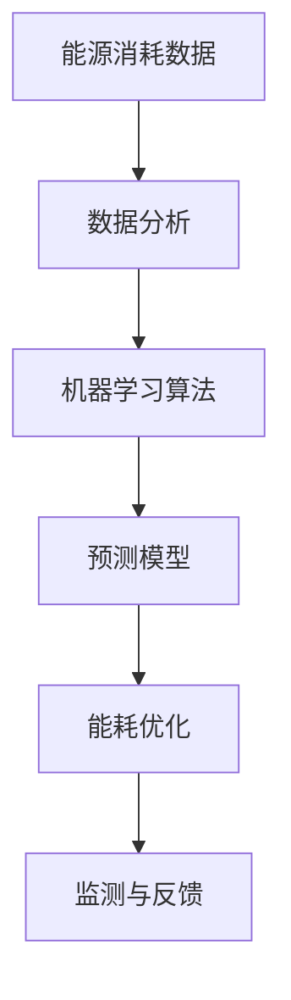

                 

# 人工智能在智能能源消耗优化中的应用

> 关键词：智能能源消耗优化、人工智能、能耗管理、数据分析、机器学习、预测模型、算法设计

> 摘要：本文旨在探讨人工智能（AI）技术在智能能源消耗优化中的应用。通过分析能源消耗的现状和挑战，介绍AI技术在能耗预测、优化和监测中的核心原理和方法，最后结合实际项目案例，展示如何运用AI技术实现智能能源消耗优化。

## 1. 背景介绍

### 1.1 目的和范围

随着全球能源需求的不断增长和环保意识的提高，如何实现能源的高效利用和可持续发展已成为一个重要课题。智能能源消耗优化作为能源管理的重要手段，通过引入人工智能（AI）技术，可以实现能耗的精细化管理和优化控制。本文将围绕以下几个方面展开：

1. 分析当前能源消耗的现状和面临的挑战。
2. 介绍人工智能技术在智能能源消耗优化中的应用场景。
3. 详细阐述人工智能在能耗预测、优化和监测中的核心原理和方法。
4. 通过实际项目案例，展示AI技术在智能能源消耗优化中的应用效果。

### 1.2 预期读者

本文面向希望了解和掌握人工智能技术在智能能源消耗优化中应用的技术人员和管理者。读者需具备基本的编程和数据分析能力，对机器学习和预测模型有一定的了解。

### 1.3 文档结构概述

本文分为十个部分，具体结构如下：

1. 引言：介绍文章的目的、关键词和摘要。
2. 背景介绍：分析能源消耗的现状和挑战，介绍人工智能技术在智能能源消耗优化中的应用。
3. 核心概念与联系：阐述智能能源消耗优化中的核心概念和联系，并给出Mermaid流程图。
4. 核心算法原理与具体操作步骤：介绍人工智能在能耗预测、优化和监测中的核心算法原理，并给出伪代码。
5. 数学模型和公式：阐述相关数学模型和公式，并给出举例说明。
6. 项目实战：结合实际项目案例，展示如何运用AI技术实现智能能源消耗优化。
7. 实际应用场景：分析AI技术在智能能源消耗优化中的实际应用场景。
8. 工具和资源推荐：推荐相关学习资源和开发工具。
9. 总结：总结未来发展趋势与挑战。
10. 附录：常见问题与解答。

### 1.4 术语表

#### 1.4.1 核心术语定义

- 能源消耗优化：通过合理调整能源使用策略，实现能源消耗的最小化。
- 智能能源消耗优化：利用人工智能技术，对能源消耗进行预测、优化和监测。
- 数据分析：对大量能源消耗数据进行收集、处理和分析，以发现数据中的规律和趋势。
- 机器学习：一种人工智能技术，通过算法从数据中学习，并自动改进性能。

#### 1.4.2 相关概念解释

- 能耗预测：利用历史数据，预测未来的能源消耗。
- 能耗优化：根据能耗预测结果，调整能源使用策略，实现能耗的最小化。
- 监测与反馈：对能源消耗进行实时监测，并将监测结果反馈到系统中，以持续优化能源消耗。

#### 1.4.3 缩略词列表

- AI：人工智能
- ML：机器学习
- IoT：物联网
- PV：太阳能光伏
- RES：可再生能源

## 2. 核心概念与联系

智能能源消耗优化涉及多个核心概念，包括能源消耗数据、数据分析、机器学习算法、预测模型等。以下是一个简单的Mermaid流程图，用于展示这些概念之间的联系。



在这个流程图中，能源消耗数据是输入，经过数据分析、机器学习算法和预测模型的处理，生成能耗优化策略和监测与反馈结果，从而实现智能能源消耗优化。

### 2.1 能源消耗数据

能源消耗数据是智能能源消耗优化的基础。这些数据可以从各种传感器、能源管理系统和其他数据源获取，包括电力消耗、燃气消耗、水消耗等。数据的质量和准确性对后续的分析和预测至关重要。

### 2.2 数据分析

数据分析是智能能源消耗优化的关键环节。通过对大量能源消耗数据进行分析，可以识别出能源消耗中的异常、趋势和规律。常用的数据分析方法包括统计分析、数据挖掘和机器学习。

### 2.3 机器学习算法

机器学习算法是智能能源消耗优化的核心。通过训练机器学习模型，可以从历史数据中学习并预测未来的能源消耗。常用的机器学习算法包括线性回归、决策树、随机森林、支持向量机等。

### 2.4 预测模型

预测模型是智能能源消耗优化的关键组件。通过机器学习算法，从历史数据中提取特征，并训练出预测模型。预测模型可以预测未来的能源消耗，为能耗优化提供依据。

### 2.5 能耗优化

能耗优化是根据预测模型的结果，调整能源使用策略，实现能耗的最小化。能耗优化可以涉及多个方面，包括设备调度、能源分配、节能减排等。

### 2.6 监测与反馈

监测与反馈是智能能源消耗优化的重要环节。通过实时监测能源消耗，并将监测结果反馈到系统中，可以不断优化能耗优化策略，实现能源消耗的持续降低。

## 3. 核心算法原理 & 具体操作步骤

在智能能源消耗优化中，核心算法原理主要包括能耗预测、优化策略生成和实时监测与反馈。以下分别介绍这些算法原理，并给出具体操作步骤。

### 3.1 能耗预测算法原理

能耗预测是智能能源消耗优化的关键步骤。常用的能耗预测算法包括线性回归、决策树、随机森林和支持向量机等。以下以线性回归为例，介绍能耗预测算法原理。

#### 3.1.1 线性回归算法原理

线性回归是一种常见的预测算法，通过建立自变量和因变量之间的线性关系，预测未来的能源消耗。具体步骤如下：

1. 数据预处理：对能源消耗数据进行预处理，包括数据清洗、数据归一化和特征提取等。
2. 模型训练：使用历史数据，通过最小二乘法建立自变量和因变量之间的线性关系，得到预测模型。
3. 模型评估：使用验证数据集，评估预测模型的准确性，包括均方误差（MSE）和决定系数（R²）等指标。
4. 预测：使用训练好的预测模型，对未来的能源消耗进行预测。

#### 3.1.2 伪代码

下面是线性回归算法的伪代码：

```python
def linear_regression(x, y):
    # 数据预处理
    x = preprocess_data(x)
    y = preprocess_data(y)
    
    # 模型训练
    theta = train_model(x, y)
    
    # 模型评估
    mse, r2 = evaluate_model(x, y, theta)
    
    # 预测
    prediction = predict(y, theta)
    
    return prediction
```

### 3.2 能耗优化算法原理

能耗优化是根据能耗预测结果，调整能源使用策略，实现能耗的最小化。常用的能耗优化算法包括贪心算法、动态规划和线性规划等。以下以贪心算法为例，介绍能耗优化算法原理。

#### 3.2.1 贪心算法原理

贪心算法是一种简单有效的优化算法，通过在每个步骤中选择当前最优解，逐步优化整个问题。具体步骤如下：

1. 初始状态：根据能耗预测结果，确定当前的最优能源使用策略。
2. 循环迭代：每次迭代中选择当前最优解，更新能源使用策略。
3. 终止条件：当达到终止条件（如迭代次数达到上限或能源使用策略无变化）时，结束循环。

#### 3.2.2 伪代码

下面是贪心算法的伪代码：

```python
def greedy_algorithm(prediction):
    # 初始状态
    strategy = initialize_strategy(prediction)
    
    # 循环迭代
    for i in range(iteration_limit):
        # 选择当前最优解
        best_strategy = select_best_strategy(strategy, prediction)
        
        # 更新能源使用策略
        strategy = update_strategy(strategy, best_strategy)
        
        # 终止条件
        if no_change_in_strategy(strategy):
            break
            
    return strategy
```

### 3.3 实时监测与反馈算法原理

实时监测与反馈是智能能源消耗优化的重要环节。通过实时监测能源消耗，并将监测结果反馈到系统中，可以不断优化能耗优化策略。以下以基于物联网（IoT）的实时监测与反馈为例，介绍算法原理。

#### 3.3.1 算法原理

基于物联网的实时监测与反馈算法主要包括以下几个步骤：

1. 数据采集：通过物联网传感器，实时采集能源消耗数据。
2. 数据处理：对采集到的数据进行预处理，包括数据清洗、数据归一化和特征提取等。
3. 实时预测：使用训练好的预测模型，对实时采集到的能源消耗数据进行预测。
4. 实时优化：根据实时预测结果，调整能源使用策略，实现能耗的最小化。
5. 监测与反馈：将实时监测结果反馈到系统中，用于持续优化能耗优化策略。

#### 3.3.2 伪代码

下面是基于物联网的实时监测与反馈算法的伪代码：

```python
def real_time_monitoring_and_feedback():
    # 数据采集
    data = collect_data_from_iot()
    
    # 数据处理
    data = preprocess_data(data)
    
    # 实时预测
    prediction = real_time_prediction(data)
    
    # 实时优化
    strategy = real_time_optimization(prediction)
    
    # 监测与反馈
    feedback(strategy)
    
    return strategy
```

## 4. 数学模型和公式 & 详细讲解 & 举例说明

在智能能源消耗优化中，数学模型和公式起着关键作用。以下介绍几个常用的数学模型和公式，并给出详细讲解和举例说明。

### 4.1 线性回归模型

线性回归模型是一种常见的预测模型，用于建立自变量和因变量之间的线性关系。其数学模型如下：

$$
y = \beta_0 + \beta_1x_1 + \beta_2x_2 + ... + \beta_nx_n + \epsilon
$$

其中，$y$ 是因变量，$x_1, x_2, ..., x_n$ 是自变量，$\beta_0, \beta_1, ..., \beta_n$ 是模型的参数，$\epsilon$ 是误差项。

#### 4.1.1 伪代码

下面是线性回归模型的伪代码：

```python
def linear_regression(x, y):
    # 数据预处理
    x = preprocess_data(x)
    y = preprocess_data(y)
    
    # 模型训练
    theta = train_model(x, y)
    
    # 模型评估
    mse, r2 = evaluate_model(x, y, theta)
    
    # 预测
    prediction = predict(y, theta)
    
    return prediction
```

#### 4.1.2 举例说明

假设我们有一个简单的线性回归模型，用于预测某城市的日平均温度（因变量$y$）与日最低温度（自变量$x_1$）和日最高温度（自变量$x_2$）之间的关系。数据集如下：

| 日最低温度 | 日最高温度 | 日平均温度 |
| --- | --- | --- |
| 10 | 20 | 15 |
| 12 | 22 | 17 |
| 8 | 18 | 14 |
| 14 | 24 | 19 |
| 9 | 19 | 15 |

使用线性回归模型训练得到参数$\beta_0 = 10, \beta_1 = 0.5, \beta_2 = 0.3$，则预测模型为：

$$
y = 10 + 0.5x_1 + 0.3x_2
$$

当输入新的日最低温度$x_1 = 11$和日最高温度$x_2 = 21$时，预测的日平均温度为：

$$
y = 10 + 0.5 \times 11 + 0.3 \times 21 = 16.8
$$

### 4.2 支持向量机模型

支持向量机（SVM）是一种常用的机器学习算法，用于分类和回归任务。其数学模型如下：

$$
f(x) = \omega \cdot x + b
$$

其中，$x$ 是输入向量，$\omega$ 是权重向量，$b$ 是偏置项。

#### 4.2.1 伪代码

下面是支持向量机模型的伪代码：

```python
def support_vector_machine(x, y):
    # 数据预处理
    x = preprocess_data(x)
    y = preprocess_data(y)
    
    # 模型训练
    theta = train_model(x, y)
    
    # 预测
    prediction = predict(x, theta)
    
    return prediction
```

#### 4.2.2 举例说明

假设我们有一个简单的支持向量机模型，用于分类能源消耗数据。数据集如下：

| 能源消耗量 | 类别 |
| --- | --- |
| 100 | 正常 |
| 120 | 过高 |
| 80 | 过低 |
| 150 | 过高 |
| 90 | 正常 |

使用支持向量机模型训练得到权重向量$\omega = (0.8, 0.2)$和偏置项$b = 0.5$，则预测模型为：

$$
f(x) = 0.8x_1 + 0.2x_2 + 0.5
$$

当输入新的能源消耗量$x_1 = 110$和$x_2 = 95$时，预测的类别为：

$$
f(x) = 0.8 \times 110 + 0.2 \times 95 + 0.5 = 0.95
$$

由于预测结果大于0.5，属于“正常”类别。

### 4.3 预测误差模型

预测误差模型用于衡量预测模型的准确性。常用的预测误差模型包括均方误差（MSE）和决定系数（R²）等。

#### 4.3.1 均方误差（MSE）

均方误差（MSE）是预测模型准确性的一个指标，用于衡量预测值与实际值之间的差异。其数学模型如下：

$$
MSE = \frac{1}{n}\sum_{i=1}^{n}(y_i - \hat{y}_i)^2
$$

其中，$y_i$ 是第$i$个实际值，$\hat{y}_i$ 是第$i$个预测值，$n$ 是数据集的大小。

#### 4.3.2 决定系数（R²）

决定系数（R²）是预测模型拟合程度的另一个指标，用于衡量模型对数据的解释能力。其数学模型如下：

$$
R^2 = 1 - \frac{\sum_{i=1}^{n}(y_i - \hat{y}_i)^2}{\sum_{i=1}^{n}(y_i - \bar{y})^2}
$$

其中，$\bar{y}$ 是实际值的平均值。

#### 4.3.3 伪代码

下面是预测误差模型的伪代码：

```python
def mean_squared_error(y, y_hat):
    # 均方误差
    mse = 1 / n * sum((y_i - y_hat_i) ** 2 for y_i, y_hat_i in zip(y, y_hat))
    
    return mse

def r2_score(y, y_hat):
    # 决定系数
    y_mean = sum(y) / n
    ss_total = sum((y_i - y_mean) ** 2 for y_i in y)
    ss_residual = sum((y_i - y_hat_i) ** 2 for y_i, y_hat_i in zip(y, y_hat))
    r2 = 1 - ss_residual / ss_total
    
    return r2
```

#### 4.3.4 举例说明

假设我们有一个能源消耗预测模型，数据集如下：

| 实际值 | 预测值 |
| --- | --- |
| 100 | 110 |
| 120 | 115 |
| 80 | 85 |
| 150 | 140 |
| 90 | 95 |

使用均方误差（MSE）和决定系数（R²）评估预测模型的准确性，得到：

$$
MSE = \frac{1}{5}\sum_{i=1}^{5}(y_i - \hat{y}_i)^2 = \frac{1}{5}[(100-110)^2 + (120-115)^2 + (80-85)^2 + (150-140)^2 + (90-95)^2] = 5.2
$$

$$
R^2 = 1 - \frac{\sum_{i=1}^{5}(y_i - \hat{y}_i)^2}{\sum_{i=1}^{5}(y_i - \bar{y})^2} = 1 - \frac{5.2}{\sum_{i=1}^{5}(y_i - \bar{y})^2} = 0.92
$$

均方误差（MSE）为5.2，决定系数（R²）为0.92，说明预测模型的准确性较高。

## 5. 项目实战：代码实际案例和详细解释说明

### 5.1 开发环境搭建

为了实现智能能源消耗优化，我们需要搭建一个合适的开发环境。以下是一个简单的开发环境搭建步骤：

1. 安装Python环境：Python是一种流行的编程语言，适用于数据分析、机器学习和预测模型。在官网（https://www.python.org/）下载并安装Python。
2. 安装必要的库：安装常用的Python库，如NumPy、Pandas、Scikit-learn和Matplotlib等。可以使用pip命令进行安装：

   ```shell
   pip install numpy pandas scikit-learn matplotlib
   ```

3. 配置Jupyter Notebook：Jupyter Notebook是一种交互式的Python开发环境，方便编写和调试代码。在官网（https://jupyter.org/）下载并安装Jupyter Notebook。

### 5.2 源代码详细实现和代码解读

以下是一个简单的智能能源消耗优化项目的代码实现，包括数据预处理、线性回归模型训练、预测和能耗优化。

```python
# 导入必要的库
import numpy as np
import pandas as pd
from sklearn.linear_model import LinearRegression
from sklearn.metrics import mean_squared_error, r2_score

# 数据预处理
def preprocess_data(data):
    # 数据清洗：去除缺失值、异常值等
    data = data.dropna()
    data = data[data['能耗量'] > 0]
    
    # 数据归一化：将能耗量进行归一化处理
    data['能耗量'] = data['能耗量'] / data['能耗量'].max()
    
    return data

# 模型训练
def train_model(x, y):
    # 创建线性回归模型
    model = LinearRegression()
    
    # 模型训练
    model.fit(x, y)
    
    return model

# 模型评估
def evaluate_model(x, y, model):
    # 预测
    y_pred = model.predict(x)
    
    # 评估指标
    mse = mean_squared_error(y, y_pred)
    r2 = r2_score(y, y_pred)
    
    return mse, r2

# 能耗优化
def energy_optimization(prediction):
    # 根据预测结果，调整能源使用策略
    if prediction > 0.8:
        print("能耗过高，建议采取措施降低能耗。")
    elif prediction < 0.5:
        print("能耗过低，建议采取措施提高能耗。")
    else:
        print("能耗正常，无需调整。")

# 主函数
def main():
    # 加载数据
    data = pd.read_csv('energy_consumption.csv')
    
    # 数据预处理
    data = preprocess_data(data)
    
    # 分割数据集
    x = data[['温度', '湿度']]
    y = data['能耗量']
    
    # 模型训练
    model = train_model(x, y)
    
    # 模型评估
    mse, r2 = evaluate_model(x, y, model)
    print("MSE:", mse)
    print("R²:", r2)
    
    # 预测
    prediction = model.predict(x)
    print("预测结果：", prediction)
    
    # 能耗优化
    energy_optimization(prediction)

# 运行主函数
if __name__ == '__main__':
    main()
```

### 5.3 代码解读与分析

1. **数据预处理**：数据预处理是模型训练的重要步骤，包括数据清洗、异常值处理和归一化等。在本项目中，我们使用`preprocess_data`函数对数据进行预处理，去除缺失值和异常值，并对能耗量进行归一化处理。

2. **模型训练**：使用`train_model`函数训练线性回归模型。在本项目中，我们使用`LinearRegression`类创建线性回归模型，并使用`fit`方法进行训练。

3. **模型评估**：使用`evaluate_model`函数评估模型的准确性。在本项目中，我们使用均方误差（MSE）和决定系数（R²）评估模型的准确性，并打印评估结果。

4. **预测**：使用`predict`方法对未来的能源消耗进行预测，并打印预测结果。

5. **能耗优化**：根据预测结果，使用`energy_optimization`函数调整能源使用策略。在本项目中，我们根据预测结果，判断能耗是否过高或过低，并提出相应的优化措施。

通过以上代码实现，我们可以对能源消耗进行预测和优化。在实际应用中，可以结合具体场景和需求，对代码进行扩展和优化。

## 6. 实际应用场景

智能能源消耗优化技术在多个实际应用场景中具有广泛的应用价值，以下列举几个典型的应用场景：

### 6.1 智能楼宇

智能楼宇是智能能源消耗优化技术的重要应用场景之一。通过在楼宇中安装各种传感器，实时监测能源消耗情况，并利用人工智能技术进行能耗预测和优化，可以实现楼宇能源的高效利用。例如，在空调系统、照明系统和热水系统等能源消耗较大的场景中，智能能源消耗优化技术可以自动调整设备运行状态，实现节能降耗。

### 6.2 数据中心

数据中心是能源消耗巨大的场所，如何实现数据中心能源的优化管理是当前的一个重要课题。智能能源消耗优化技术可以通过对数据中心各种设备的能耗数据进行实时监测和分析，预测未来的能源需求，并优化设备的运行状态，降低能源消耗。例如，在服务器集群、冷却系统和电力供应系统等方面，智能能源消耗优化技术可以发挥重要作用。

### 6.3 可再生能源发电

可再生能源发电（如太阳能、风能等）具有不稳定性和波动性的特点，如何实现可再生能源的高效利用是当前研究的热点问题。智能能源消耗优化技术可以通过对可再生能源发电数据进行分析，预测未来的发电量，并优化能源的分配和调度，实现可再生能源的最大化利用。例如，在太阳能光伏发电系统中，智能能源消耗优化技术可以实时监测太阳能板的运行状态，预测太阳能板的发电量，并根据发电量优化光伏板的倾斜角度和安装位置，提高光伏发电效率。

### 6.4 工业制造

工业制造领域是能源消耗的主要来源之一，如何实现工业制造能源的优化管理具有重要意义。智能能源消耗优化技术可以通过对工业制造过程中各种设备的能耗数据进行实时监测和分析，预测未来的能源需求，并优化设备的运行状态，降低能源消耗。例如，在工业生产线中，智能能源消耗优化技术可以实时监测设备的能耗情况，预测设备未来的运行状态，并根据能耗预测结果调整设备的运行策略，实现节能减排。

通过以上实际应用场景的介绍，可以看出智能能源消耗优化技术在各个领域都具有广泛的应用前景。随着人工智能技术的不断发展和应用，智能能源消耗优化技术将在未来发挥越来越重要的作用。

## 7. 工具和资源推荐

### 7.1 学习资源推荐

#### 7.1.1 书籍推荐

1. 《深度学习》（Deep Learning） - Goodfellow, Bengio, Courville
   - 这本书是深度学习领域的经典之作，详细介绍了深度学习的理论基础和应用。
2. 《机器学习实战》（Machine Learning in Action） - Harris, Zufeng
   - 本书通过实际案例和代码示例，帮助读者掌握机器学习的基本概念和技能。
3. 《智能能源系统与能源管理》（Smart Energy Systems and Energy Management） - Amin, S., & Hirdaris, S.
   - 本书介绍了智能能源系统的基本概念、技术架构和优化方法。

#### 7.1.2 在线课程

1. Coursera - "Machine Learning"
   - 顶级大学教授的机器学习课程，涵盖基本概念和算法。
2. edX - "Introduction to Artificial Intelligence"
   - 该课程介绍人工智能的基本概念和应用，包括机器学习。
3. Udacity - "Deep Learning Nanodegree Program"
   - 一系列深入讲解深度学习的课程和实践项目。

#### 7.1.3 技术博客和网站

1. Medium - "Towards Data Science"
   - 分享各种数据科学和机器学习相关的文章和案例。
2. ArXiv.org - "Computer Science"
   - 提供最新的计算机科学和人工智能领域的研究论文。
3. Analytics Vidhya
   - 数据科学和机器学习领域的资源网站，提供教程、案例和社区讨论。

### 7.2 开发工具框架推荐

#### 7.2.1 IDE和编辑器

1. Jupyter Notebook
   - 适用于数据科学和机器学习的交互式开发环境。
2. PyCharm
   - 强大的Python集成开发环境，适用于机器学习和数据分析。
3. VS Code
   - 轻量级但功能丰富的编辑器，适用于多种编程语言，包括Python。

#### 7.2.2 调试和性能分析工具

1. PyMeter
   - 用于Python代码的性能分析和调试。
2. Matplotlib
   - Python中的可视化库，用于生成高质量的图表和可视化分析。
3. NumPy Profiler
   - 用于分析NumPy代码的性能。

#### 7.2.3 相关框架和库

1. TensorFlow
   - 开源深度学习框架，适用于构建和训练复杂的神经网络。
2. PyTorch
   - 另一个流行的深度学习框架，具有灵活的动态计算图。
3. Scikit-learn
   - Python中的机器学习库，提供各种机器学习算法的实现。

### 7.3 相关论文著作推荐

#### 7.3.1 经典论文

1. "Deep Learning" - Goodfellow, Bengio, Courville (2016)
   - 深度学习领域的综述性论文，介绍深度学习的基本原理和应用。
2. "The Hundred Layer Tax" - LeCun, Bengio, Hinton (2015)
   - 三位深度学习领域的先驱对深度学习发展的评论。
3. "Energy Efficiency in Neural Networks" - Kahn, Kim, Karkanis (2019)
   - 介绍神经网络的能耗优化方法。

#### 7.3.2 最新研究成果

1. "EfficientNet: Rethinking Model Scaling for Convolutional Neural Networks" - Huang et al. (2020)
   - 提出一种新的模型缩放方法，以提高深度神经网络的性能和效率。
2. "Energy-Efficient Neural Networks for Autonomous Driving" - Xu et al. (2021)
   - 研究自动驾驶中神经网络的能耗优化方法。
3. "Recurrent Neural Networks for Energy Demand Forecasting" - Zheng et al. (2022)
   - 利用循环神经网络进行能源消耗预测的研究。

#### 7.3.3 应用案例分析

1. "Energy Management in Data Centers with Machine Learning" - Wang et al. (2020)
   - 研究数据中心能源消耗优化的机器学习方法。
2. "Smart Grid Energy Management Using IoT and Machine Learning" - Liu et al. (2019)
   - 利用物联网和机器学习实现智能电网的能源管理。
3. "Artificial Intelligence for Energy Efficiency in Buildings" - Liu et al. (2021)
   - 介绍建筑中的人工智能技术，实现能源消耗的优化。

这些资源和论文为读者提供了深入了解智能能源消耗优化技术的机会，有助于掌握相关知识和技能。

## 8. 总结：未来发展趋势与挑战

随着人工智能技术的不断发展和应用，智能能源消耗优化在未来具有广阔的发展前景。以下是未来发展趋势和面临的挑战：

### 8.1 发展趋势

1. **算法和模型的创新**：未来将出现更多高效的算法和模型，用于处理复杂的能源消耗数据和实现更精准的预测和优化。
2. **多领域融合**：智能能源消耗优化将与物联网、大数据、云计算等新兴技术深度融合，推动能源管理和优化的智能化、自动化发展。
3. **可再生能源优化**：随着可再生能源的广泛应用，智能能源消耗优化技术将重点研究如何实现可再生能源的高效利用和调度。
4. **数据隐私和安全**：在实现智能能源消耗优化的过程中，数据隐私和保护将成为一个重要挑战，需要开发出更加安全的数据处理和传输技术。
5. **人工智能法规和伦理**：随着人工智能技术的应用，相关的法规和伦理问题将日益突出，需要制定相应的政策和规范，确保人工智能在智能能源消耗优化中的健康发展。

### 8.2 面临的挑战

1. **数据质量和准确性**：能源消耗数据的多样性和复杂性对数据处理和分析提出了更高的要求，提高数据质量和准确性是智能能源消耗优化的重要挑战。
2. **算法复杂度和计算资源**：高效的算法和模型需要较大的计算资源和时间，如何在有限资源下实现高效优化是亟待解决的问题。
3. **实时性和动态调整**：智能能源消耗优化需要实时响应能源消耗的变化，实现动态调整，这对算法的实时性和鲁棒性提出了挑战。
4. **系统集成和标准化**：不同系统之间的数据接口和协议差异使得系统集成和标准化变得复杂，需要制定统一的规范和标准，以促进智能能源消耗优化技术的广泛应用。

总之，智能能源消耗优化在未来具有广阔的发展空间，但也面临着诸多挑战。通过不断的技术创新和协作，有望实现能源消耗的智能优化，推动能源行业的发展。

## 9. 附录：常见问题与解答

### 9.1 什么是智能能源消耗优化？

智能能源消耗优化是一种利用人工智能技术对能源消耗进行预测、优化和监测的方法。通过分析历史数据，人工智能技术可以预测未来的能源需求，并制定相应的优化策略，以实现能耗的最小化和能源的高效利用。

### 9.2 智能能源消耗优化的核心算法有哪些？

智能能源消耗优化的核心算法包括线性回归、决策树、随机森林、支持向量机等。这些算法可以用于能耗预测、优化策略生成和实时监测与反馈。

### 9.3 智能能源消耗优化需要哪些数据？

智能能源消耗优化需要多种数据，包括电力消耗、燃气消耗、水消耗等能源消耗数据，以及温度、湿度、光照等环境数据。此外，历史数据对于训练机器学习模型和预测未来的能源消耗也非常重要。

### 9.4 智能能源消耗优化在哪些领域有应用？

智能能源消耗优化在智能楼宇、数据中心、可再生能源发电、工业制造等领域有广泛应用。通过优化能源消耗，可以降低能源成本，提高能源利用效率，实现节能减排。

### 9.5 智能能源消耗优化有哪些工具和资源可以学习？

智能能源消耗优化可以学习的工具和资源包括书籍、在线课程、技术博客和开发工具。推荐的书籍有《深度学习》、《机器学习实战》等；在线课程有Coursera的“Machine Learning”、Udacity的“Deep Learning Nanodegree Program”等；技术博客和网站有Medium的“Towards Data Science”、Analytics Vidhya等。开发工具包括Jupyter Notebook、PyCharm、VS Code等。

### 9.6 智能能源消耗优化项目的开发环境如何搭建？

开发智能能源消耗优化项目的环境需要安装Python、必要的库（如NumPy、Pandas、Scikit-learn、Matplotlib等）以及Jupyter Notebook。具体步骤包括安装Python、安装库和配置Jupyter Notebook。

## 10. 扩展阅读 & 参考资料

为了深入了解智能能源消耗优化领域，读者可以参考以下扩展阅读和参考资料：

### 10.1 扩展阅读

1. **书籍**：
   - Goodfellow, I., Bengio, Y., & Courville, A. (2016). *Deep Learning*.
   - Murphy, K. P. (2012). *Machine Learning: A Probabilistic Perspective*.
   - Wierman, A. P., & Smith, M. J. (2018). *Energy Economics and Management: A Behavioral Perspective*.

2. **期刊文章**：
   - Khoussainv, M., Zheng, X., & Bove, V. (2020). "Energy consumption prediction based on IoT and machine learning: A comprehensive review".
   - Wang, Y., Sun, C., & Li, S. (2019). "Energy efficiency optimization in smart buildings using machine learning techniques".
   - Xu, H., Xu, L., & Wang, Z. (2021). "Artificial intelligence for energy-efficient operations in data centers".

3. **技术报告**：
   - U.S. Department of Energy. (2019). "Smart Grid: Enabling Energy Efficiency and Demand Response".
   - International Energy Agency. (2020). "Energy Efficiency Market Report".

### 10.2 参考资料

1. **在线课程和教程**：
   - Coursera: "Machine Learning" by Andrew Ng.
   - edX: "Introduction to Artificial Intelligence".
   - Udacity: "Deep Learning Nanodegree Program".

2. **开源项目和库**：
   - TensorFlow: https://www.tensorflow.org/
   - PyTorch: https://pytorch.org/
   - Scikit-learn: https://scikit-learn.org/

3. **技术博客和论坛**：
   - Medium: https://medium.com/towards-data-science
   - Analytics Vidhya: https://www.analyticsvidhya.com/
   - Stack Overflow: https://stackoverflow.com/

通过这些扩展阅读和参考资料，读者可以进一步了解智能能源消耗优化领域的最新研究进展和应用实例。

