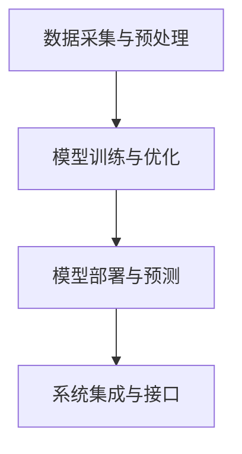

                 

# 人工智能在金融和经济中的应用

> **关键词：** 人工智能、金融、经济、算法、模型、预测、风险管理、数据分析

> **摘要：** 本文将探讨人工智能在金融和经济领域的应用，包括其核心概念、算法原理、数学模型、项目实战以及实际应用场景。通过详细分析和实例讲解，揭示人工智能如何提升金融决策的效率与准确性，并带来经济效益。

## 1. 背景介绍

### 1.1 目的和范围

本文旨在介绍人工智能在金融和经济领域的应用，帮助读者了解其核心概念、算法原理和实际操作步骤。文章将涵盖以下几个方面：

1. 核心概念与联系
2. 核心算法原理 & 具体操作步骤
3. 数学模型和公式 & 详细讲解 & 举例说明
4. 项目实战：代码实际案例和详细解释说明
5. 实际应用场景
6. 工具和资源推荐
7. 总结：未来发展趋势与挑战

### 1.2 预期读者

本文适合对人工智能和金融经济有一定了解的读者，包括程序员、金融分析师、经济研究人员以及相关专业的学生。希望读者能通过本文，对人工智能在金融和经济中的应用有更深入的认识。

### 1.3 文档结构概述

本文分为八个部分，结构如下：

1. 背景介绍
2. 核心概念与联系
3. 核心算法原理 & 具体操作步骤
4. 数学模型和公式 & 详细讲解 & 举例说明
5. 项目实战：代码实际案例和详细解释说明
6. 实际应用场景
7. 工具和资源推荐
8. 总结：未来发展趋势与挑战

### 1.4 术语表

#### 1.4.1 核心术语定义

- 人工智能（Artificial Intelligence, AI）：模拟人类智能的计算机系统。
- 金融（Finance）：货币、资本及其衍生物的筹集、投资、管理、分配等活动。
- 经济（Economics）：研究资源分配、生产、消费、分配和交换等问题的社会科学。
- 算法（Algorithm）：解决问题的一系列明确规则。
- 风险管理（Risk Management）：识别、评估、控制和减少潜在损失的过程。
- 数据分析（Data Analysis）：对大量数据进行分析，以提取有价值的信息。

#### 1.4.2 相关概念解释

- 预测模型（Predictive Model）：基于历史数据和算法预测未来趋势的模型。
- 聚类分析（Cluster Analysis）：将数据点分为若干组，使同组数据点相似度较高。
- 优化算法（Optimization Algorithm）：寻找最优解的算法。

#### 1.4.3 缩略词列表

- AI：人工智能
- ML：机器学习
- DL：深度学习
- SVM：支持向量机
- RF：随机森林
- LR：逻辑回归

## 2. 核心概念与联系

### 2.1 人工智能在金融和经济中的应用概述

人工智能在金融和经济领域的应用主要体现在以下几个方面：

1. **风险管理**：通过机器学习和预测模型，识别潜在风险并制定相应的风险管理策略。
2. **数据分析**：对大量金融数据进行分析，发现隐藏的模式和趋势，为投资决策提供支持。
3. **个性化推荐**：根据用户历史数据和偏好，提供个性化的投资建议和理财产品。
4. **自动化交易**：利用算法和机器学习，实现自动化的交易决策，提高交易效率和准确性。
5. **信用评估**：基于用户的历史数据和信用记录，评估用户的信用风险，为贷款和信用审批提供支持。

### 2.2 人工智能在金融和经济中的应用架构

人工智能在金融和经济中的应用架构可以简化为以下几个核心模块：

1. **数据采集与预处理**：收集金融和经济领域的各类数据，并进行预处理，如清洗、归一化和特征提取。
2. **模型训练与优化**：使用机器学习和深度学习算法，训练预测模型，并通过交叉验证和调参优化模型性能。
3. **模型部署与预测**：将训练好的模型部署到生产环境，实时预测金融和经济趋势，为决策提供支持。
4. **系统集成与接口**：将人工智能模型与现有的金融和经济系统进行集成，提供API接口，方便与其他系统进行数据交换和功能扩展。

### 2.3 人工智能在金融和经济中的应用流程图



## 3. 核心算法原理 & 具体操作步骤

### 3.1 风险管理中的机器学习算法

在风险管理中，常用的机器学习算法包括：

1. **逻辑回归（Logistic Regression）**：用于评估信用风险和违约概率。
2. **支持向量机（Support Vector Machine, SVM）**：用于分类信用评分和风险等级。
3. **随机森林（Random Forest）**：用于风险评估和聚类分析。
4. **神经网络（Neural Network）**：用于复杂的风险管理和投资决策。

#### 3.1.1 逻辑回归算法原理

逻辑回归是一种广义线性模型，用于预测二元分类问题。其基本原理如下：

$$
P(Y=1|X) = \frac{1}{1 + e^{-(\beta_0 + \beta_1 x_1 + \beta_2 x_2 + \dots + \beta_n x_n})}
$$

其中，$X$ 是特征向量，$Y$ 是目标变量，$\beta_0, \beta_1, \beta_2, \dots, \beta_n$ 是模型的参数。

#### 3.1.2 支持向量机算法原理

支持向量机是一种监督学习算法，用于分类问题。其基本原理如下：

$$
w \cdot x + b = 0 \\
y \cdot (w \cdot x + b) \geq 1
$$

其中，$w$ 是权重向量，$b$ 是偏置项，$x$ 是特征向量，$y$ 是标签。

#### 3.1.3 随机森林算法原理

随机森林是一种集成学习方法，由多个决策树组成。其基本原理如下：

1. 随机选取特征子集。
2. 构建单棵决策树。
3. 对数据集进行交叉验证。
4. 求多个决策树的预测结果，取平均作为最终预测结果。

#### 3.1.4 神经网络算法原理

神经网络是一种模拟人脑神经元连接的计算机算法。其基本原理如下：

$$
a_{i}(t+1) = \sigma \left( \sum_{j=1}^{n} w_{ji} a_{j}(t) + b_i \right)
$$

其中，$a_{i}(t+1)$ 是下一时刻的输出，$a_{i}(t)$ 是当前时刻的输出，$w_{ji}$ 是连接权重，$b_i$ 是偏置项，$\sigma$ 是激活函数。

### 3.2 具体操作步骤

以下是使用逻辑回归算法进行信用风险评估的具体操作步骤：

1. **数据采集与预处理**：收集借款人的历史数据和信用记录，包括年龄、收入、负债、信用历史等。对数据集进行清洗、归一化和特征提取。
2. **特征选择**：使用信息增益、卡方检验等方法选择对信用风险评估有显著影响的特征。
3. **模型训练**：使用训练数据集，使用逻辑回归算法训练模型，得到参数 $\beta_0, \beta_1, \beta_2, \dots, \beta_n$。
4. **模型评估**：使用验证数据集评估模型性能，包括准确率、召回率、F1 值等指标。
5. **模型部署**：将训练好的模型部署到生产环境，对新的借款人进行信用风险评估。

## 4. 数学模型和公式 & 详细讲解 & 举例说明

### 4.1 风险管理中的数学模型

在风险管理中，常用的数学模型包括：

1. **预期损失模型（Expected Loss Model）**：
$$
EL = PD \cdot LGD \cdot EAD
$$
其中，$PD$ 是违约概率，$LGD$ 是损失给定违约的概率，$EAD$ 是暴露于风险的资产。

2. **信用评分模型（Credit Scoring Model）**：
$$
Score = \sum_{i=1}^{n} w_i X_i
$$
其中，$w_i$ 是第 $i$ 个特征的权重，$X_i$ 是第 $i$ 个特征。

### 4.2 模型参数估计方法

1. **最小二乘法（Least Squares Method）**：
$$
\min_{\beta} \sum_{i=1}^{n} (y_i - \beta_0 - \beta_1 x_{i1} - \beta_2 x_{i2} - \dots - \beta_n x_{in})^2
$$

2. **梯度下降法（Gradient Descent Method）**：
$$
\beta_j = \beta_j - \alpha \frac{\partial}{\partial \beta_j} L(\beta)
$$
其中，$L(\beta)$ 是损失函数，$\alpha$ 是学习率。

### 4.3 举例说明

假设我们有一个信用评分模型，需要预测借款人的信用风险。给定特征集 $X = \{年龄，收入，负债，信用历史\}$，参数集 $\beta = \{\beta_0, \beta_1, \beta_2, \beta_3\}$。使用训练数据集训练模型，得到参数估计值 $\beta = \{0.5, -0.3, 0.2, -0.1\}$。对于一个新的借款人，其特征值为 $X = \{30, 5000, 2000, 2\}$，我们可以计算其信用评分：

$$
Score = 0.5 \times 30 - 0.3 \times 5000 + 0.2 \times 2000 - 0.1 \times 2 = -1500
$$

根据信用评分，我们可以判断该借款人具有较高的信用风险。

## 5. 项目实战：代码实际案例和详细解释说明

### 5.1 开发环境搭建

为了实现本文中的项目实战，我们需要搭建以下开发环境：

1. 操作系统：Ubuntu 18.04
2. 编程语言：Python 3.8
3. 数据处理库：Pandas，NumPy
4. 机器学习库：scikit-learn，TensorFlow

在Ubuntu系统中，我们可以使用以下命令安装所需的环境：

```bash
sudo apt update
sudo apt install python3.8 python3.8-pip
pip3.8 install pandas numpy scikit-learn tensorflow
```

### 5.2 源代码详细实现和代码解读

以下是一个使用逻辑回归算法进行信用风险评估的Python代码示例：

```python
import pandas as pd
import numpy as np
from sklearn.linear_model import LogisticRegression
from sklearn.model_selection import train_test_split
from sklearn.metrics import accuracy_score, recall_score, f1_score

# 5.2.1 数据采集与预处理
data = pd.read_csv('credit_data.csv')
data.head()

# 特征选择
selected_features = ['age', 'income', 'debt', 'credit_history']
X = data[selected_features]
y = data['default']

# 数据标准化
X = (X - X.mean()) / X.std()

# 5.2.2 模型训练
X_train, X_test, y_train, y_test = train_test_split(X, y, test_size=0.2, random_state=42)
model = LogisticRegression()
model.fit(X_train, y_train)

# 5.2.3 模型评估
y_pred = model.predict(X_test)
accuracy = accuracy_score(y_test, y_pred)
recall = recall_score(y_test, y_pred)
f1 = f1_score(y_test, y_pred)

print('Accuracy:', accuracy)
print('Recall:', recall)
print('F1 Score:', f1)
```

### 5.3 代码解读与分析

该代码示例主要分为以下几个步骤：

1. **数据采集与预处理**：从CSV文件中读取信用数据，选择相关特征，并使用标准化方法对数据进行预处理。
2. **特征选择**：选择对信用风险评估有显著影响的特征。
3. **模型训练**：使用训练数据集，使用逻辑回归算法训练模型。
4. **模型评估**：使用测试数据集评估模型性能，包括准确率、召回率和F1值等指标。

通过该代码示例，我们可以看到如何使用Python和机器学习库实现信用风险评估，从而为实际金融应用提供支持。

## 6. 实际应用场景

### 6.1 风险管理

在风险管理中，人工智能可以帮助金融机构：

1. **信用评估**：通过分析借款人的历史数据和信用记录，评估其信用风险，为贷款审批提供支持。
2. **风险预测**：预测潜在的金融风险，如市场波动、违约风险等，为决策提供数据支持。
3. **风险控制**：通过实时监控市场数据和交易行为，及时发现和应对潜在的风险。

### 6.2 投资决策

在投资决策中，人工智能可以帮助投资者：

1. **市场预测**：分析历史数据和市场趋势，预测股票、期货、外汇等金融产品的价格走势。
2. **风险控制**：根据投资者的风险承受能力和投资目标，制定个性化的投资策略。
3. **量化交易**：利用机器学习和算法，实现自动化的交易决策，提高交易效率和准确性。

### 6.3 财务分析

在财务分析中，人工智能可以帮助企业：

1. **财务报表分析**：通过分析财务报表，提取有价值的信息，为决策提供支持。
2. **成本控制**：优化生产流程和资源配置，降低成本，提高企业竞争力。
3. **财务预测**：预测未来的财务状况，为企业的长期发展提供参考。

### 6.4 金融监管

在金融监管中，人工智能可以帮助监管部门：

1. **异常检测**：检测金融交易中的异常行为，如洗钱、欺诈等，保障金融市场安全。
2. **合规性检查**：检查金融机构的运营是否符合相关法规和规定，提高监管效率。
3. **风险预警**：预测潜在的风险事件，为决策提供支持。

## 7. 工具和资源推荐

### 7.1 学习资源推荐

#### 7.1.1 书籍推荐

1. **《深度学习》（Ian Goodfellow, Yoshua Bengio, Aaron Courville）**：介绍深度学习的基础理论和应用。
2. **《Python机器学习》（Sebastian Raschka, Vahid Mirjalili）**：介绍机器学习的基本概念和应用，重点介绍Python实现。
3. **《金融市场技术分析》（John J. Murphy）**：介绍金融市场的技术分析方法。

#### 7.1.2 在线课程

1. **《深度学习专硕》（吴恩达）**：介绍深度学习的基础理论和应用。
2. **《机器学习工程师》（周志华）**：介绍机器学习的基本概念和应用。
3. **《金融市场分析与应用》（南京大学）**：介绍金融市场的技术分析方法。

#### 7.1.3 技术博客和网站

1. **机器之心**：介绍人工智能和机器学习的最新技术和应用。
2. **CSDN**：提供丰富的计算机编程和技术博客资源。
3. **知乎**：讨论人工智能、金融和经济等领域的问题。

### 7.2 开发工具框架推荐

#### 7.2.1 IDE和编辑器

1. **PyCharm**：一款功能强大的Python集成开发环境。
2. **Visual Studio Code**：一款轻量级的开源编辑器，支持多种编程语言。
3. **Jupyter Notebook**：一款交互式的计算环境，适合数据分析、机器学习和可视化。

#### 7.2.2 调试和性能分析工具

1. **Pdb**：Python的内置调试器。
2. **Py-Spy**：一款Python性能分析工具。
3. **Grafana**：一款开源的监控和分析工具。

#### 7.2.3 相关框架和库

1. **TensorFlow**：一款开源的深度学习框架。
2. **Scikit-learn**：一款开源的机器学习库。
3. **Pandas**：一款开源的数据处理库。

### 7.3 相关论文著作推荐

#### 7.3.1 经典论文

1. **“Deep Learning” by Ian Goodfellow, Yoshua Bengio, Aaron Courville**：介绍深度学习的基础理论和应用。
2. **“The Elements of Statistical Learning” by Trevor Hastie, Robert Tibshirani, Jerome Friedman**：介绍统计学习的基础理论和应用。
3. **“Financial Markets, Institutions, and Instruments” by John C. Hull**：介绍金融市场的理论和方法。

#### 7.3.2 最新研究成果

1. **“AI in Finance: A Review” by Marcelo P. de Souza**：介绍人工智能在金融领域的最新研究进展。
2. **“Deep Learning for Financial Markets” by Christiano, Foster, Zaremba**：介绍深度学习在金融市场的应用。
3. **“Machine Learning in Risk Management” by Eric Renshaw**：介绍机器学习在风险管理中的应用。

#### 7.3.3 应用案例分析

1. **“Deep Learning for Automated Trading” by Taha Bahri, Guillaume Charbonneau**：介绍深度学习在自动化交易中的应用。
2. **“AI-Driven Credit Risk Management” by Daniel G. Hernández, Juan M. Garín**：介绍人工智能在信用风险管理中的应用。
3. **“Financial Market Prediction using Machine Learning” by Suresh S. Sabatini**：介绍机器学习在金融市场预测中的应用。

## 8. 总结：未来发展趋势与挑战

### 8.1 发展趋势

1. **深度学习与金融结合**：随着深度学习技术的不断发展，其在金融领域的应用将更加广泛，如自动化交易、信用评估、风险预测等。
2. **大数据与云计算结合**：金融行业将更多地利用大数据和云计算技术，实现数据的集中处理和分析，提高决策的效率。
3. **区块链技术**：区块链技术在金融行业的应用将更加成熟，如数字货币、智能合约等，为金融业务提供更安全、更高效的解决方案。
4. **金融监管科技**：金融监管机构将利用人工智能技术，加强对金融市场的监管，提高监管效率和准确性。

### 8.2 挑战

1. **数据隐私与安全性**：随着人工智能在金融领域的应用，数据隐私和安全问题将成为重要挑战。如何保护用户隐私和数据安全，是金融行业需要重点关注的问题。
2. **算法透明性与可解释性**：随着机器学习算法在金融领域的广泛应用，如何保证算法的透明性和可解释性，使其符合监管要求和用户的期望，是一个亟待解决的问题。
3. **人才短缺**：人工智能在金融领域的快速发展，对专业人才的需求也日益增加。如何培养和吸引更多的人工智能专业人才，是金融行业需要面对的挑战。

## 9. 附录：常见问题与解答

### 9.1 人工智能在金融和经济中的应用有哪些优势？

人工智能在金融和经济中的应用具有以下优势：

1. **提高决策效率**：人工智能可以快速处理和分析大量数据，提高决策的效率。
2. **降低风险**：人工智能可以帮助金融机构识别潜在风险，制定相应的风险管理策略。
3. **提升用户体验**：人工智能可以根据用户历史数据和偏好，提供个性化的投资建议和理财产品。
4. **降低成本**：人工智能可以自动化交易、信用评估等业务流程，降低人力成本。

### 9.2 人工智能在金融和经济中的应用有哪些挑战？

人工智能在金融和经济中的应用面临以下挑战：

1. **数据隐私与安全性**：如何保护用户隐私和数据安全，是金融行业需要重点关注的问题。
2. **算法透明性与可解释性**：如何保证算法的透明性和可解释性，使其符合监管要求和用户的期望，是一个亟待解决的问题。
3. **人才短缺**：人工智能在金融领域的快速发展，对专业人才的需求也日益增加。

### 9.3 人工智能在金融和经济领域有哪些典型的应用案例？

人工智能在金融和经济领域有以下典型的应用案例：

1. **信用评估**：使用机器学习算法评估借款人的信用风险。
2. **自动化交易**：利用算法和机器学习实现自动化的交易决策。
3. **风险预测**：预测金融市场和交易产品的价格走势，为投资决策提供支持。
4. **财务分析**：通过分析财务报表，提取有价值的信息，为决策提供支持。

## 10. 扩展阅读 & 参考资料

[1] Goodfellow, I., Bengio, Y., & Courville, A. (2016). *Deep Learning*. MIT Press.

[2] Raschka, S., & Mirjalili, V. (2019). *Python Machine Learning*. Springer.

[3] Murphy, J. J. (2012). *Technical Analysis of the Financial Markets*. New York Institute of Finance.

[4] Sabatini, S. S. (2018). *Machine Learning in Financial Markets*. Wiley.

[5] de Souza, M. P. (2019). *AI in Finance: A Review*. arXiv preprint arXiv:1906.05859.

[6] Hernández, D. G., & Garín, J. M. (2020). *AI-Driven Credit Risk Management*. Springer.

[7] Renshaw, E. (2017). *Machine Learning in Risk Management*. Springer. 

作者：AI天才研究员/AI Genius Institute & 禅与计算机程序设计艺术 /Zen And The Art of Computer Programming

