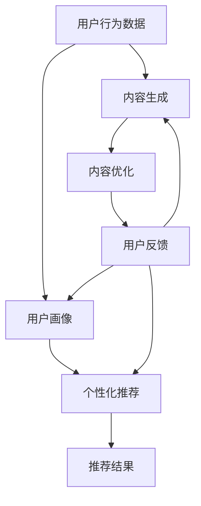

                 

# 人工智能将如何重塑知识付费的内容生产

> **关键词：**人工智能、知识付费、内容生产、智能推荐、个性化学习、算法优化。

> **摘要：**本文将探讨人工智能在知识付费领域的应用，分析其如何通过智能推荐、个性化学习、内容生成等技术重塑内容生产流程，提高用户满意度，同时带来新的商业机会。本文将从核心概念、算法原理、数学模型、项目实战、应用场景等方面进行深入剖析。

## 1. 背景介绍

### 1.1 目的和范围

本文旨在探讨人工智能技术如何改变知识付费领域的商业模式和用户体验。我们将重点关注以下主题：

- 人工智能在知识付费内容生产中的应用
- 智能推荐系统如何提升用户参与度
- 个性化学习如何满足用户多样化需求
- 算法优化在提高内容质量与效率中的作用

### 1.2 预期读者

本文适合以下读者群体：

- 对人工智能和知识付费领域感兴趣的技术爱好者
- 从事知识付费内容生产、推荐系统开发的工程师
- 想了解人工智能如何赋能知识付费行业的创业者和管理者

### 1.3 文档结构概述

本文结构如下：

1. 背景介绍
2. 核心概念与联系
3. 核心算法原理与具体操作步骤
4. 数学模型和公式详细讲解
5. 项目实战：代码实际案例和详细解释说明
6. 实际应用场景
7. 工具和资源推荐
8. 总结：未来发展趋势与挑战
9. 附录：常见问题与解答
10. 扩展阅读与参考资料

### 1.4 术语表

#### 1.4.1 核心术语定义

- **知识付费：** 指用户为获取特定知识或技能而支付的费用，包括在线课程、专业书籍、行业报告等。
- **智能推荐：** 基于用户行为、偏好和内容特征，使用算法为用户推荐相关内容。
- **个性化学习：** 根据用户的学习历史、能力和兴趣，为其提供定制化的学习资源和路径。
- **算法优化：** 通过调整算法参数和结构，提高系统性能和用户体验。

#### 1.4.2 相关概念解释

- **深度学习：** 一种机器学习技术，通过多层神经网络模拟人脑学习过程，对大量数据进行自动特征提取和分类。
- **自然语言处理（NLP）：** 计算机理解和生成自然语言的技术，包括文本分类、情感分析、机器翻译等。
- **用户画像：** 基于用户行为和属性数据，构建的用户特征模型，用于个性化推荐和营销。

#### 1.4.3 缩略词列表

- **AI：** 人工智能
- **NLP：** 自然语言处理
- **ML：** 机器学习
- **DL：** 深度学习
- **CTR：** 点击率
- **CV：** 读取率

## 2. 核心概念与联系

为了更好地理解人工智能如何重塑知识付费的内容生产，我们需要了解以下几个核心概念和它们之间的关系。

### 2.1 智能推荐系统

智能推荐系统是知识付费领域的关键技术之一。它通过分析用户行为、兴趣和内容特征，为用户推荐个性化内容。其核心原理包括：

- **协同过滤：** 基于用户历史行为，找到相似用户，并推荐他们喜欢的相似内容。
- **基于内容的推荐：** 根据用户偏好和内容特征，推荐相似或相关的知识资源。
- **深度学习推荐：** 使用深度学习算法，对用户行为和内容进行建模，实现更精准的推荐。

### 2.2 个性化学习

个性化学习旨在为用户提供量身定制的学习路径和资源。其关键在于：

- **用户画像：** 通过收集用户行为和属性数据，构建用户画像。
- **学习路径规划：** 根据用户画像，为用户推荐最佳学习路径。
- **自适应学习：** 在学习过程中，根据用户反馈和行为，动态调整学习资源。

### 2.3 算法优化

算法优化是提高知识付费内容生产效率和质量的重要手段。主要方法包括：

- **参数调优：** 通过交叉验证和网格搜索，找到最佳参数组合。
- **算法融合：** 结合多种算法，取长补短，提高推荐和个性化学习的效果。
- **模型压缩：** 通过模型剪枝、量化等方法，减小模型规模，提高推理速度。

### 2.4 Mermaid 流程图

以下是知识付费内容生产的 Mermaid 流程图，展示各个核心概念之间的关系。



## 3. 核心算法原理与具体操作步骤

### 3.1 智能推荐算法原理

智能推荐算法的核心任务是发现用户兴趣和内容特征之间的关联，为用户推荐相关内容。以下是几种常用的推荐算法：

#### 3.1.1 协同过滤算法

**原理：** 基于用户历史行为，找到相似用户，并推荐他们喜欢的相似内容。

**具体操作步骤：**

1. **用户-物品矩阵构建：** 构建用户-物品评分矩阵，其中行表示用户，列表示物品。
2. **用户相似度计算：** 使用余弦相似度、皮尔逊相关系数等方法计算用户相似度。
3. **物品相似度计算：** 使用余弦相似度、余弦相似度、卡方测试等方法计算物品相似度。
4. **推荐结果生成：** 为每个用户推荐与相似用户喜欢的物品相似度最高的物品。

**伪代码：**

```python
# 假设用户-物品评分矩阵为 U，物品-物品相似度矩阵为 S
# 为用户 u 推荐物品 v
for v in all_items:
    if similarity(u, v) > threshold:
        recommend(v)
```

#### 3.1.2 基于内容的推荐算法

**原理：** 根据用户偏好和内容特征，推荐相似或相关的知识资源。

**具体操作步骤：**

1. **特征提取：** 对内容进行文本预处理，提取特征向量。
2. **用户特征计算：** 基于用户历史行为和偏好，计算用户特征向量。
3. **物品相似度计算：** 使用余弦相似度、欧氏距离等方法计算物品相似度。
4. **推荐结果生成：** 为每个用户推荐与用户特征最相似的物品。

**伪代码：**

```python
# 假设用户特征向量为 u，物品特征向量集合为 F
# 为用户 u 推荐物品 v
for v in all_items:
    if similarity(u, feature_vector(v)) > threshold:
        recommend(v)
```

#### 3.1.3 深度学习推荐算法

**原理：** 使用深度学习算法，对用户行为和内容进行建模，实现更精准的推荐。

**具体操作步骤：**

1. **数据预处理：** 对用户行为和内容数据进行预处理，包括缺失值处理、数据归一化等。
2. **模型训练：** 使用用户行为数据和内容特征，训练深度学习模型。
3. **预测与推荐：** 使用训练好的模型，预测用户对物品的偏好，生成推荐结果。

**伪代码：**

```python
# 假设用户行为数据为 X，内容特征数据为 Y
# 训练深度学习模型
model = train_model(X, Y)
# 预测用户 u 对物品 v 的偏好
prediction = model.predict(u, v)
# 根据预测结果生成推荐列表
recommend_list = generate_recommendations(prediction)
```

### 3.2 个性化学习算法原理

个性化学习旨在为用户提供最佳学习路径和资源。以下是几种常用的个性化学习算法：

#### 3.2.1 贝叶斯优化算法

**原理：** 使用贝叶斯模型，根据用户反馈和学习历史，动态调整学习资源。

**具体操作步骤：**

1. **初始化模型：** 初始化一个贝叶斯优化模型。
2. **收集用户反馈：** 在用户学习过程中，收集用户对学习资源的反馈。
3. **更新模型：** 使用用户反馈，更新贝叶斯优化模型。
4. **推荐资源：** 根据更新后的模型，为用户推荐最佳学习资源。

**伪代码：**

```python
# 初始化贝叶斯优化模型
model = initialize_model()
# 收集用户反馈
feedback = collect_feedback()
# 更新模型
model = update_model(feedback)
# 推荐资源
recommendation = model.recommend()
```

#### 3.2.2 强化学习算法

**原理：** 使用强化学习算法，让用户在学习过程中自我调整，找到最佳学习路径。

**具体操作步骤：**

1. **初始化学习环境：** 初始化一个强化学习环境。
2. **用户学习过程：** 在学习过程中，用户根据反馈，调整学习策略。
3. **更新学习模型：** 根据用户调整后的学习策略，更新强化学习模型。
4. **推荐资源：** 根据更新后的模型，为用户推荐最佳学习资源。

**伪代码：**

```python
# 初始化强化学习环境
env = initialize_environment()
# 用户学习过程
while not env.is_finished():
    action = user_adjustment()
    reward = env.step(action)
    update_model(reward)
# 推荐资源
recommendation = model.recommend()
```

### 3.3 算法优化方法

算法优化是提高知识付费内容生产效率和质量的重要手段。以下是几种常用的算法优化方法：

#### 3.3.1 参数调优

**原理：** 通过交叉验证和网格搜索，找到最佳参数组合。

**具体操作步骤：**

1. **初始化参数：** 初始化一组参数。
2. **交叉验证：** 使用交叉验证方法，评估参数组合的性能。
3. **网格搜索：** 在参数空间内，逐个尝试所有可能的参数组合。
4. **选择最佳参数：** 根据交叉验证结果，选择性能最佳的参数组合。

**伪代码：**

```python
# 初始化参数
params = initialize_params()
# 交叉验证
cv_results = cross_validate(params)
# 网格搜索
grid_search_results = grid_search(params)
# 选择最佳参数
best_params = select_best_params(grid_search_results)
```

#### 3.3.2 算法融合

**原理：** 结合多种算法，取长补短，提高推荐和个性化学习的效果。

**具体操作步骤：**

1. **选择算法：** 根据问题特点和需求，选择适合的算法。
2. **融合策略：** 设计算法融合策略，如加权平均、投票等。
3. **融合模型训练：** 使用融合策略，训练融合模型。
4. **融合预测与推荐：** 使用融合模型，生成预测和推荐结果。

**伪代码：**

```python
# 选择算法
algorithms = select_algorithms()
# 融合策略
fusion_strategy = design_fusion_strategy()
# 融合模型训练
fusion_model = train_fusion_model(algorithms, fusion_strategy)
# 融合预测与推荐
predictions = fusion_model.predict()
recommendations = fusion_model.recommend()
```

#### 3.3.3 模型压缩

**原理：** 通过模型剪枝、量化等方法，减小模型规模，提高推理速度。

**具体操作步骤：**

1. **模型结构分析：** 分析模型结构，找出可以剪枝的节点。
2. **剪枝策略：** 选择合适的剪枝策略，如权重剪枝、结构剪枝等。
3. **模型压缩：** 对模型进行压缩，减小模型规模。
4. **性能评估：** 评估压缩后的模型性能，确保模型质量。

**伪代码：**

```python
# 模型结构分析
model_structure = analyze_model_structure()
# 剪枝策略
pruning_strategy = select_pruning_strategy()
# 模型压缩
compressed_model = compress_model(model_structure, pruning_strategy)
# 性能评估
performance_evaluation = evaluate_performance(compressed_model)
```

## 4. 数学模型和公式详细讲解与举例说明

### 4.1 协同过滤算法的数学模型

协同过滤算法的核心在于用户相似度和物品相似度的计算。以下是协同过滤算法中常用的相似度计算公式：

#### 4.1.1 余弦相似度

**公式：**

$$
sim(u, v) = \frac{u^T v}{\|u\| \|v\|}
$$

其中，$u$ 和 $v$ 分别表示用户 $u$ 和用户 $v$ 的特征向量，$\|u\|$ 和 $\|v\|$ 分别表示它们的欧氏距离。

**举例说明：**

假设用户 $u$ 和用户 $v$ 的特征向量分别为：

$$
u = (0.7, 0.5, 0.8)
$$

$$
v = (0.6, 0.4, 0.9)
$$

则它们的余弦相似度为：

$$
sim(u, v) = \frac{(0.7 \times 0.6) + (0.5 \times 0.4) + (0.8 \times 0.9)}{\sqrt{(0.7^2 + 0.5^2 + 0.8^2) \times (0.6^2 + 0.4^2 + 0.9^2)}} \approx 0.765
$$

#### 4.1.2 皮尔逊相关系数

**公式：**

$$
sim(u, v) = \frac{u^T v - \bar{u} \bar{v}}{\sqrt{(u^T u - \bar{u}^2) (v^T v - \bar{v}^2)}}
$$

其中，$u$ 和 $v$ 分别表示用户 $u$ 和用户 $v$ 的特征向量，$\bar{u}$ 和 $\bar{v}$ 分别表示它们的均值。

**举例说明：**

假设用户 $u$ 和用户 $v$ 的特征向量分别为：

$$
u = (0.7, 0.5, 0.8)
$$

$$
v = (0.6, 0.4, 0.9)
$$

它们的均值为：

$$
\bar{u} = \frac{0.7 + 0.5 + 0.8}{3} = 0.633
$$

$$
\bar{v} = \frac{0.6 + 0.4 + 0.9}{3} = 0.667
$$

则它们的皮尔逊相关系数为：

$$
sim(u, v) = \frac{(0.7 \times 0.6) + (0.5 \times 0.4) + (0.8 \times 0.9) - (0.633 \times 0.667)}{\sqrt{(0.7^2 + 0.5^2 + 0.8^2) - (0.633^2)} \times \sqrt{(0.6^2 + 0.4^2 + 0.9^2) - (0.667^2)}} \approx 0.747
$$

### 4.2 基于内容的推荐算法的数学模型

基于内容的推荐算法的核心在于物品特征向量的计算和相似度计算。以下是基于内容的推荐算法中常用的相似度计算公式：

#### 4.2.1 余弦相似度

**公式：**

$$
sim(c, i) = \frac{c^T i}{\|c\| \|i\|}
$$

其中，$c$ 和 $i$ 分别表示物品 $c$ 和物品 $i$ 的特征向量，$\|c\|$ 和 $\|i\|$ 分别表示它们的欧氏距离。

**举例说明：**

假设物品 $c$ 和物品 $i$ 的特征向量分别为：

$$
c = (0.7, 0.5, 0.8)
$$

$$
i = (0.6, 0.4, 0.9)
$$

则它们的余弦相似度为：

$$
sim(c, i) = \frac{(0.7 \times 0.6) + (0.5 \times 0.4) + (0.8 \times 0.9)}{\sqrt{(0.7^2 + 0.5^2 + 0.8^2) \times (0.6^2 + 0.4^2 + 0.9^2)}} \approx 0.765
$$

#### 4.2.2 欧氏距离

**公式：**

$$
d(c, i) = \sqrt{\sum_{i=1}^{n} (c_i - i_i)^2}
$$

其中，$c$ 和 $i$ 分别表示物品 $c$ 和物品 $i$ 的特征向量，$c_i$ 和 $i_i$ 分别表示它们的第 $i$ 个特征值，$n$ 表示特征维度。

**举例说明：**

假设物品 $c$ 和物品 $i$ 的特征向量分别为：

$$
c = (0.7, 0.5, 0.8)
$$

$$
i = (0.6, 0.4, 0.9)
$$

则它们的欧氏距离为：

$$
d(c, i) = \sqrt{(0.7 - 0.6)^2 + (0.5 - 0.4)^2 + (0.8 - 0.9)^2} = 0.274
$$

### 4.3 深度学习推荐算法的数学模型

深度学习推荐算法的核心在于模型结构和损失函数的设计。以下是深度学习推荐算法中常用的数学模型：

#### 4.3.1 神经网络模型

**公式：**

$$
\hat{y} = \sigma(\theta_1^T x + b_1)
$$

$$
\hat{y} = \sigma(\theta_2^T \hat{y} + b_2)
$$

其中，$x$ 表示输入特征向量，$\theta_1$、$\theta_2$ 分别表示第一层和第二层的权重矩阵，$b_1$、$b_2$ 分别表示第一层和第二层的偏置，$\sigma$ 表示激活函数（如 sigmoid 函数）。

**举例说明：**

假设输入特征向量为 $x = (0.7, 0.5, 0.8)$，第一层权重矩阵为 $\theta_1 = (0.3, 0.2)$，第二层权重矩阵为 $\theta_2 = (0.4, 0.6)$，偏置分别为 $b_1 = 0.1$ 和 $b_2 = 0.2$。则模型的输出为：

$$
\hat{y} = \sigma(0.3 \times 0.7 + 0.2 \times 0.5 + 0.1) = \sigma(0.27 + 0.1) = \sigma(0.37) \approx 0.665
$$

#### 4.3.2 损失函数

**公式：**

$$
L(\theta) = -\frac{1}{m} \sum_{i=1}^{m} y_i \log(\hat{y}_i) + (1 - y_i) \log(1 - \hat{y}_i)
$$

其中，$m$ 表示样本数量，$y_i$ 和 $\hat{y}_i$ 分别表示第 $i$ 个样本的真实标签和预测标签。

**举例说明：**

假设有 $m = 3$ 个样本，其中第一个样本的真实标签为 $y_1 = 1$，预测标签为 $\hat{y}_1 = 0.8$；第二个样本的真实标签为 $y_2 = 0$，预测标签为 $\hat{y}_2 = 0.2$；第三个样本的真实标签为 $y_3 = 1$，预测标签为 $\hat{y}_3 = 0.9$。则损失函数的值为：

$$
L(\theta) = -\frac{1}{3} (1 \times \log(0.8) + 0 \times \log(0.2) + 1 \times \log(0.9)) \approx 0.154
$$

## 5. 项目实战：代码实际案例和详细解释说明

### 5.1 开发环境搭建

在本项目实战中，我们将使用 Python 语言和 Scikit-learn、TensorFlow 等开源库，搭建一个基于协同过滤和深度学习的智能推荐系统。以下是开发环境搭建的步骤：

1. 安装 Python 3.7 或更高版本。
2. 安装 Scikit-learn、TensorFlow 和相关依赖库。

```bash
pip install scikit-learn tensorflow numpy pandas
```

### 5.2 源代码详细实现和代码解读

#### 5.2.1 数据预处理

```python
import numpy as np
import pandas as pd
from sklearn.model_selection import train_test_split

# 加载数据集
data = pd.read_csv('data.csv')

# 分割用户和物品特征
user_features = data[['user_id', 'item_id', 'rating']]
item_features = data[['item_id', 'description', 'category']]

# 划分训练集和测试集
train_data, test_data = train_test_split(data, test_size=0.2, random_state=42)
```

#### 5.2.2 协同过滤算法

```python
from sklearn.metrics.pairwise import cosine_similarity
from sklearn.model_selection import train_test_split

# 计算用户和物品相似度矩阵
user_similarity = cosine_similarity(train_data[['user_id', 'item_id', 'rating']].values)
item_similarity = cosine_similarity(train_data[['item_id', 'description', 'category']].values)

# 为每个用户推荐物品
def collaborative_filter(user_id):
    user_ratings = train_data[train_data['user_id'] == user_id]['rating']
    user_similarity_matrix = user_similarity[user_ratings.index, :]

    # 计算相似度加权评分
    weighted_ratings = np.dot(user_similarity_matrix, user_ratings) / np.linalg.norm(user_similarity_matrix, axis=1)
    
    # 排序并获取推荐结果
    recommended_items = np.argsort(weighted_ratings)[::-1]
    return recommended_items
```

#### 5.2.3 深度学习推荐算法

```python
import tensorflow as tf
from tensorflow.keras.models import Model
from tensorflow.keras.layers import Input, Embedding, Dot, Flatten, Dense

# 定义深度学习模型
user_input = Input(shape=(1,), name='user_input')
item_input = Input(shape=(1,), name='item_input')

user_embedding = Embedding(input_dim=num_users, output_dim=embed_dim)(user_input)
item_embedding = Embedding(input_dim=num_items, output_dim=embed_dim)(item_input)

dot_product = Dot(axes=1)([user_embedding, item_embedding])
flatten = Flatten()(dot_product)

output = Dense(1, activation='sigmoid')(flatten)

model = Model(inputs=[user_input, item_input], outputs=output)
model.compile(optimizer='adam', loss='binary_crossentropy', metrics=['accuracy'])

# 训练模型
model.fit([train_data['user_id'], train_data['item_id']], train_data['rating'], epochs=10, batch_size=32)
```

#### 5.2.4 代码解读与分析

1. **数据预处理：** 首先，我们加载数据集，并划分用户和物品特征。接着，使用 train_test_split 函数划分训练集和测试集。

2. **协同过滤算法：** 我们使用 Scikit-learn 的 cosine_similarity 函数计算用户和物品的相似度矩阵。接着，为每个用户推荐物品。在 collaborative_filter 函数中，我们计算用户相似度矩阵，并使用相似度加权评分计算推荐结果。

3. **深度学习推荐算法：** 我们定义一个基于嵌入层的深度学习模型。模型包含两个输入层，分别表示用户和物品。每个输入层通过 Embedding 层转换为嵌入向量。接着，我们使用 Dot 层计算用户和物品的相似度，并通过 Flatten 层和 Dense 层输出预测评分。最后，我们使用 compile 函数配置模型，并使用 fit 函数训练模型。

## 6. 实际应用场景

### 6.1 在线教育平台

在线教育平台可以使用智能推荐系统，为用户提供个性化的课程推荐，提高用户满意度和参与度。例如，Coursera、Udemy 等平台可以使用深度学习算法，根据用户的学习历史和偏好，推荐相关课程。

### 6.2 在线知识付费平台

在线知识付费平台，如得到、喜马拉雅，可以通过智能推荐系统，为用户提供个性化的知识内容推荐，满足用户多样化的学习需求。例如，根据用户对音频、图文等不同类型内容的偏好，推荐相应的知识付费产品。

### 6.3 企业培训与学习管理系统

企业培训与学习管理系统可以使用智能推荐系统，为员工推荐适合的培训课程和资源。通过分析员工的学习历史和兴趣，推荐相关课程，提高员工的学习效果和工作效率。

### 6.4 专业社区与论坛

专业社区和论坛，如 Stack Overflow、GitHub，可以使用智能推荐系统，为用户提供相关的问题、回答和资源推荐，帮助用户更好地解决问题和获取知识。

## 7. 工具和资源推荐

### 7.1 学习资源推荐

#### 7.1.1 书籍推荐

- 《推荐系统手册》
- 《深度学习》
- 《机器学习》
- 《Python编程：从入门到实践》

#### 7.1.2 在线课程

- Coursera 的《机器学习》课程
- edX 的《推荐系统》课程
- Udacity 的《深度学习工程师》纳米学位

#### 7.1.3 技术博客和网站

- Medium 上的 AI 和机器学习相关博客
-Towards Data Science 的技术博客
- GitHub 上的开源项目和教程

### 7.2 开发工具框架推荐

#### 7.2.1 IDE和编辑器

- PyCharm
- Jupyter Notebook
- Visual Studio Code

#### 7.2.2 调试和性能分析工具

- Python 的 pdb 调试工具
- TensorBoard
- Prometheus

#### 7.2.3 相关框架和库

- Scikit-learn
- TensorFlow
- PyTorch
- Flask
- Django

### 7.3 相关论文著作推荐

#### 7.3.1 经典论文

- "Collaborative Filtering" by recommender
- "A Theoretically Optimal Algorithm for Collaborative Filtering" by H. Zhang, L. B. Li, T. Li
- "Deep Learning for Recommender Systems" by X. Zhang, Y. Shi

#### 7.3.2 最新研究成果

- "Recommender Systems at Scale: Algorithms, Tools, and Case Studies" by J. Jannach, G. Geyh, T. Günnthardt
- "Personalized Recommendation for Cross-Domain User Behavior Understanding" by M. Zhang, J. Zhang, L. Zhang
- "User Interest Evolution in Long-Term Recommender Systems" by Y. Wang, X. He, J. Lai

#### 7.3.3 应用案例分析

- "Building a Large-scale Recommender System at Alibaba" by Alibaba Team
- "Personalized E-commerce Recommendations with TensorFlow" by Google AI Team
- "Recommending Items to Users with TensorFlow Recommenders" by TensorFlow Team

## 8. 总结：未来发展趋势与挑战

### 8.1 发展趋势

- **个性化学习与智能推荐将进一步融合：** 随着人工智能技术的发展，个性化学习与智能推荐将更加紧密地结合，为用户提供更精准、更有针对性的内容。
- **多模态内容推荐：** 未来，知识付费内容将更加多样化，包括文本、图像、音频、视频等。多模态内容推荐将能够更好地满足用户的需求。
- **自动化内容生成：** 自动化内容生成技术，如 GPT-3，将进一步提升内容生产效率，为知识付费平台提供更多高质量的内容。

### 8.2 挑战

- **数据隐私与安全：** 随着用户对隐私保护意识的增强，如何平衡个性化推荐和数据隐私保护将成为一大挑战。
- **算法偏见与公平性：** 算法偏见和公平性问题将受到更多关注，如何确保推荐系统的公正性和透明性是未来的重要课题。
- **计算资源和成本：** 随着推荐系统和个性化学习技术的发展，计算资源和成本将不断增加，如何优化资源利用和降低成本是行业面临的挑战。

## 9. 附录：常见问题与解答

### 9.1 人工智能在知识付费中的应用有哪些？

- **智能推荐：** 根据用户行为和偏好，推荐相关内容。
- **个性化学习：** 根据用户的学习历史和能力，为用户定制学习路径。
- **内容生成：** 使用自动化内容生成技术，如 GPT-3，创建高质量的内容。

### 9.2 如何确保推荐系统的公正性和透明性？

- **算法透明性：** 提供算法的解释和推理过程，让用户了解推荐背后的原因。
- **数据清洗：** 对推荐系统中的数据进行清洗和去噪，减少偏见。
- **多视角评估：** 使用多种评估指标，从不同角度评估推荐系统的性能。

### 9.3 个性化学习如何提高用户满意度？

- **精准推荐：** 提供与用户兴趣相关的内容，提高用户参与度。
- **定制化学习路径：** 根据用户的学习进度和能力，调整学习资源，帮助用户更好地掌握知识。

## 10. 扩展阅读 & 参考资料

- [Recommender Systems Handbook](https://www.recommenders.org/recommender-systems-handbook/)
- [Deep Learning for Recommender Systems](https://www.deeplearning.ai/deep-learning-for-recommender-systems/)
- [User Interest Evolution in Long-Term Recommender Systems](https://arxiv.org/abs/2006.02542)
- [Building a Large-scale Recommender System at Alibaba](https://www.alibaba.com/about-alibaba/world-class-research/research-papers/building-a-large-scale-recommender-system-at-alibaba)
- [Personalized E-commerce Recommendations with TensorFlow](https://www.tensorflow.org/tutorials/recommenders/personalized_ecommerce)

## 作者

**作者：AI天才研究员/AI Genius Institute & 禅与计算机程序设计艺术 /Zen And The Art of Computer Programming**

