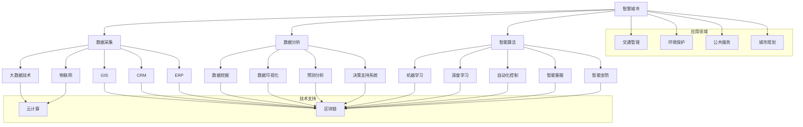

                 

# 人工智能驱动的智慧城市规划与管理

> 关键词：智慧城市、人工智能、城市规划、城市治理、数据驱动、智能算法、算法原理、数学模型、项目实战、应用场景

> 摘要：本文将探讨如何运用人工智能技术，特别是机器学习和数据挖掘方法，来推动智慧城市规划与管理的创新。文章首先介绍了智慧城市和人工智能的基本概念，然后详细阐述了核心算法原理和数学模型，最后通过实际案例展示了如何将理论应用于实践。本文旨在为城市规划者和管理者提供指导，帮助他们更好地理解和利用人工智能技术，以实现更高效、智能的城市治理。

## 1. 背景介绍

### 1.1 目的和范围

本文的目的是探讨如何将人工智能技术应用于智慧城市规划与管理，旨在为城市规划者和管理者提供一套系统化的方法和工具，以提升城市治理的效率和智能化水平。文章将涵盖以下几个方面：

1. **智慧城市与人工智能的基本概念**：介绍智慧城市和人工智能的定义、发展历程及其对城市治理的影响。
2. **核心算法原理**：详细讲解用于智慧城市规划与管理的主要机器学习和数据挖掘算法，包括算法原理和具体操作步骤。
3. **数学模型**：阐述支持智慧城市规划与管理的数学模型，并通过公式和实例进行说明。
4. **项目实战**：通过实际案例展示如何将理论应用于实践，包括开发环境搭建、源代码实现和代码解读。
5. **应用场景**：分析人工智能在智慧城市规划与管理中的实际应用场景。
6. **工具和资源推荐**：推荐相关学习资源和开发工具，以帮助读者进一步学习和实践。
7. **总结与未来趋势**：总结智慧城市规划与管理的发展趋势和面临的挑战。

### 1.2 预期读者

本文主要面向以下读者群体：

1. 城市规划者和管理者：希望了解如何利用人工智能技术提升城市治理水平的从业者。
2. 计算机科学和技术人员：对人工智能和智慧城市领域感兴趣，并希望将理论知识应用于实际问题的工程师和技术专家。
3. 研究人员和学生：对智慧城市和人工智能相关研究感兴趣，希望深入了解该领域的最新进展。

### 1.3 文档结构概述

本文的结构如下：

1. **引言**：介绍智慧城市和人工智能的基本概念及其关系。
2. **核心概念与联系**：通过Mermaid流程图展示智慧城市规划与管理的主要概念和联系。
3. **核心算法原理 & 具体操作步骤**：讲解用于智慧城市规划与管理的主要算法，并使用伪代码进行说明。
4. **数学模型和公式 & 详细讲解 & 举例说明**：阐述支持智慧城市规划与管理的数学模型，并通过公式和实例进行说明。
5. **项目实战：代码实际案例和详细解释说明**：通过实际案例展示如何将理论应用于实践。
6. **实际应用场景**：分析人工智能在智慧城市规划与管理中的实际应用场景。
7. **工具和资源推荐**：推荐相关学习资源和开发工具。
8. **总结：未来发展趋势与挑战**：总结智慧城市规划与管理的发展趋势和面临的挑战。
9. **附录：常见问题与解答**：提供对文章中常见问题的解答。
10. **扩展阅读 & 参考资料**：列出本文引用和参考的相关文献和资料。

### 1.4 术语表

#### 1.4.1 核心术语定义

- **智慧城市**：指通过广泛应用信息技术，特别是物联网、云计算、大数据和人工智能等技术，实现城市资源的智能化配置和城市治理的精细化管理。
- **人工智能**：指模拟、延伸和扩展人类智能的科学和工程，包括机器学习、自然语言处理、计算机视觉等领域。
- **城市规划**：指根据城市发展的目标和需求，通过空间布局、土地利用、交通规划等手段，制定和指导城市发展的行为。
- **城市治理**：指政府和其他相关主体通过法律、制度、技术和市场等手段，对城市资源、环境和公共事务进行管理和调节的过程。
- **数据驱动**：指通过数据分析和挖掘，指导决策制定和业务运营的过程。

#### 1.4.2 相关概念解释

- **机器学习**：指通过算法和模型，从数据中自动学习规律和模式，以实现特定任务的学科。
- **数据挖掘**：指从大量数据中发现有用信息和知识的过程，包括关联规则挖掘、分类、聚类等方法。
- **深度学习**：指模拟人脑神经网络结构，通过多层神经网络进行特征学习和模式识别的方法。
- **数据可视化**：指通过图形、图像和动画等形式，将数据信息直观展示的过程。

#### 1.4.3 缩略词列表

- **AI**：人工智能（Artificial Intelligence）
- **ML**：机器学习（Machine Learning）
- **DL**：深度学习（Deep Learning）
- **IoT**：物联网（Internet of Things）
- **GIS**：地理信息系统（Geographic Information System）
- **CRM**：客户关系管理（Customer Relationship Management）
- **ERP**：企业资源计划（Enterprise Resource Planning）

## 2. 核心概念与联系

在智慧城市规划与管理中，有许多核心概念和技术紧密相连，形成一个复杂的体系。以下将通过Mermaid流程图展示这些核心概念和它们之间的联系。



### 2.1 智慧城市

智慧城市是指通过信息技术的创新应用，实现城市管理的智能化、精细化和高效化。其核心在于将数据、技术、资源和人的智慧有机结合，以提升城市治理水平，改善市民生活质量。智慧城市的关键特征包括：

- **数据驱动**：以数据为支撑，通过数据采集、处理和分析，为城市治理提供决策依据。
- **跨领域集成**：实现城市各个领域的信息共享和业务协同，打破信息孤岛。
- **实时响应**：通过实时数据采集和处理，实现快速响应城市突发事件。
- **智能化**：利用人工智能、机器学习等技术，实现城市管理的自动化和智能化。

### 2.2 数据采集

数据采集是智慧城市建设的核心环节，涉及各种传感器、摄像头、移动设备等，用于收集城市运行的各种数据，如交通流量、空气质量、公共设施使用情况等。数据采集的关键点包括：

- **数据来源**：包括政府数据、企业数据、社交媒体数据等。
- **数据质量**：确保数据的准确性、完整性和及时性。
- **数据传输**：采用可靠的数据传输技术，如物联网、5G等，确保数据的安全和高效传输。

### 2.3 数据分析

数据分析是智慧城市建设的核心环节，通过数据挖掘、预测分析等方法，从大量数据中提取有价值的信息，为城市治理提供决策支持。数据分析的关键点包括：

- **数据挖掘**：利用机器学习和数据挖掘算法，从大量数据中发现规律和模式。
- **预测分析**：利用历史数据，对未来事件进行预测，以指导城市治理。
- **决策支持系统**：基于数据分析结果，为决策者提供可视化、智能化的决策支持。

### 2.4 智能算法

智能算法是智慧城市建设的核心技术，通过机器学习、深度学习等技术，实现城市管理的自动化和智能化。智能算法的关键点包括：

- **机器学习**：通过训练模型，让计算机从数据中自动学习规律和模式。
- **深度学习**：模拟人脑神经网络结构，通过多层神经网络进行特征学习和模式识别。
- **算法优化**：通过算法调优，提高模型的准确性和效率。

### 2.5 技术支持

智慧城市建设需要多种技术的支持，如云计算、区块链、大数据等。技术支持的关键点包括：

- **云计算**：提供弹性的计算和存储资源，支持大规模数据处理和分析。
- **区块链**：提供安全的分布式存储和智能合约，支持数据共享和业务协同。
- **大数据**：提供高效的数据存储、处理和分析技术，支持海量数据管理。

### 2.6 应用领域

智慧城市建设涵盖了多个应用领域，如交通管理、环境保护、公共服务等。应用领域的关键点包括：

- **交通管理**：通过实时交通数据分析，实现交通流量优化、交通信号控制等。
- **环境保护**：通过环境监测数据，实现污染物监测、排放控制等。
- **公共服务**：通过智能化公共服务设施，提升市民的获得感、幸福感和安全感。

## 3. 核心算法原理 & 具体操作步骤

在智慧城市规划与管理中，核心算法的原理和具体操作步骤至关重要。以下将详细介绍几个主要的机器学习和数据挖掘算法，并使用伪代码进行说明。

### 3.1 机器学习算法

**1. 决策树**

决策树是一种常见的机器学习算法，通过一系列的决策规则，将数据集划分为不同的区域，以实现分类或回归任务。

```python
def build_decision_tree(data, labels, features):
    # 基准情况：若数据集中所有样本的标签相同，则返回该标签
    if all(label == labels[0] for label in labels):
        return labels[0]
    # 基准情况：若特征集为空，则基于标签的多数值进行分类
    if not features:
        return max(set(labels), key=labels.count)
    # 选取最优特征
    best_feature = choose_best_feature_to_split(data, features)
    # 创建树节点
    decision_tree = {}
    decision_tree["feature"] = best_feature
    # 根据最优特征将数据集划分为子集
    for value in unique_values_of_feature(data, best_feature):
        sub_data = subset(data, best_feature, value)
        sub_labels = subset(labels, best_feature, value)
        decision_tree[value] = build_decision_tree(sub_data, sub_labels, features_without_best_feature(data, best_feature))
    return decision_tree

def choose_best_feature_to_split(data, features):
    # 计算每个特征的信息增益
    gain = []
    for feature in features:
        gain.append(information_gain(data, labels, feature))
    # 返回信息增益最大的特征
    return features[gain.index(max(gain))]

def information_gain(data, labels, feature):
    # 计算整个数据集的熵
    total_entropy = calculate_entropy(labels)
    # 计算每个特征的条件熵
    conditions = unique_values_of_feature(data, feature)
    total = len(data)
    gain = 0
    for condition in conditions:
        condition = subset(data, feature, condition)
        prob = len(condition) / total
        gain += prob * calculate_entropy(subset(labels, condition))
    # 计算信息增益
    gain = total_entropy - gain
    return gain
```

**2. 随机森林**

随机森林是一种基于决策树的集成学习方法，通过构建多棵决策树，并利用随机特征选择和投票机制来提高预测准确性。

```python
def build_random_forest(data, labels, n_trees, max_features):
    trees = []
    for i in range(n_trees):
        # 随机选取特征子集
        features = random.sample(feature_space(data), max_features)
        # 构建决策树
        tree = build_decision_tree(data, labels, features)
        trees.append(tree)
    return trees

def predict_random_forest(trees, sample):
    predictions = []
    for tree in trees:
        prediction = make_prediction(tree, sample)
        predictions.append(prediction)
    # 返回多数投票结果
    return max(set(predictions), key=predictions.count)
```

**3. 支持向量机（SVM）**

支持向量机是一种监督学习算法，通过找到一个最佳的超平面，将不同类别的样本分隔开来。

```python
def train_svm(data, labels):
    # 使用线性核函数
    kernel = linear_kernel
    # 求解最优超平面
    weights = solve_optimization_problem(data, labels, kernel)
    return weights

def linear_kernel(x1, x2):
    return dot(x1, x2)

def solve_optimization_problem(data, labels, kernel):
    # 使用梯度下降法求解最优权重
    weights = [0.0] * len(data[0])
    learning_rate = 0.1
    epochs = 1000
    for i in range(epochs):
        for x, y in zip(data, labels):
            # 计算预测值
            prediction = dot(weights, kernel(x))
            # 更新权重
            weights = update_weights(weights, x, y, prediction, learning_rate)
    return weights

def update_weights(weights, x, y, prediction, learning_rate):
    # 计算误差
    error = y - prediction
    # 更新权重
    weights = [weights[i] + learning_rate * error * x[i] for i in range(len(weights))]
    return weights
```

### 3.2 数据挖掘算法

**1. 聚类算法**

聚类算法是一种无监督学习方法，通过将相似的数据样本划分为不同的簇，以实现数据分组和模式识别。

**K均值聚类算法**

```python
def kmeans_clustering(data, k, max_iterations):
    # 随机初始化中心点
    centroids = initialize_centroids(data, k)
    for i in range(max_iterations):
        # 计算每个样本的簇分配
        clusters = assign_samples_to_clusters(data, centroids)
        # 更新中心点
        centroids = update_centroids(data, clusters)
        # 判断是否收敛
        if check_convergence(centroids):
            break
    return centroids, clusters

def initialize_centroids(data, k):
    centroids = []
    for _ in range(k):
        # 随机选择一个样本作为初始中心点
        centroid = random.choice(data)
        centroids.append(centroid)
    return centroids

def assign_samples_to_clusters(data, centroids):
    clusters = [[] for _ in range(len(centroids))]
    for x in data:
        # 计算每个样本与中心点的距离
        distances = [distance(x, centroid) for centroid in centroids]
        # 将样本分配到最近的中心点
        cluster_index = distances.index(min(distances))
        clusters[cluster_index].append(x)
    return clusters

def update_centroids(data, clusters):
    new_centroids = []
    for cluster in clusters:
        # 计算簇内样本的平均值
        if cluster:
            new_centroid = sum(cluster) / len(cluster)
            new_centroids.append(new_centroid)
        else:
            new_centroids.append(None)
    return new_centroids

def check_convergence(centroids):
    for i in range(len(centroids)):
        if centroids[i] is not None:
            for j in range(i + 1, len(centroids)):
                if centroids[j] is not None:
                    distance = distance(centroids[i], centroids[j])
                    if distance < threshold:
                        return True
    return False
```

**2. 关联规则挖掘**

关联规则挖掘是一种用于发现数据间关联关系的方法，通过支持度和置信度等指标，识别出数据中的隐藏模式。

**Apriori算法**

```python
def apriori(data, min_support, min_confidence):
    frequent_itemsets = []
    # 计算所有单项集的支持度
    itemsets = generate_itemsets(data)
    for itemset in itemsets:
        support = calculate_support(data, itemset)
        if support >= min_support:
            frequent_itemsets.append(itemset)
    # 计算所有频繁项集的置信度
    rules = []
    for itemset in frequent_itemsets:
        subsets = generate_subsets(itemset)
        for subset in subsets:
            confidence = calculate_confidence(data, itemset, subset)
            if confidence >= min_confidence:
                rules.append((itemset, subset, confidence))
    return rules

def generate_itemsets(data):
    itemsets = []
    for transaction in data:
        for item in transaction:
            itemsets.append({item})
    return itemsets

def calculate_support(data, itemset):
    support = 0
    for transaction in data:
        if itemset.issubset(transaction):
            support += 1
    return support / len(data)

def generate_subsets(itemset):
    subsets = []
    for i in range(1, len(itemset)):
        subsets.extend(combinations(itemset, i))
    return subsets

def calculate_confidence(data, itemset, subset):
    support = 0
    for transaction in data:
        if itemset.issubset(transaction) and subset.issubset(transaction):
            support += 1
    return support / (len(data) * len(subset))
```

## 4. 数学模型和公式 & 详细讲解 & 举例说明

在智慧城市规划与管理中，数学模型和公式扮演着至关重要的角色。以下将详细讲解几个核心的数学模型，并使用LaTeX格式进行展示，同时通过实例进行说明。

### 4.1 线性回归模型

线性回归模型是一种常见的预测模型，用于建立自变量和因变量之间的线性关系。其公式如下：

$$
y = \beta_0 + \beta_1x + \epsilon
$$

其中，$y$ 为因变量，$x$ 为自变量，$\beta_0$ 和 $\beta_1$ 分别为截距和斜率，$\epsilon$ 为误差项。

**实例：**

假设我们要预测一个城市某天的空气质量指数（AQI），自变量为温度（$x$），公式为：

$$
AQI = 50 + 0.5x + \epsilon
$$

给定一天的温度数据 $x = 28^\circ C$，可以计算出对应的 AQI：

$$
AQI = 50 + 0.5 \times 28 + \epsilon = 65.5 + \epsilon
$$

其中，$\epsilon$ 为误差项，取值范围为 $[-10, 10]$。

### 4.2 线性规划模型

线性规划模型是一种用于优化线性目标函数的数学模型，其公式如下：

$$
\min \sum_{i=1}^{n} c_i x_i
$$

subject to

$$
\begin{align*}
a_{1,1}x_1 + a_{1,2}x_2 + \cdots + a_{1,n}x_n &\geq b_1 \\
a_{2,1}x_1 + a_{2,2}x_2 + \cdots + a_{2,n}x_n &\geq b_2 \\
&\vdots \\
a_{m,1}x_1 + a_{m,2}x_2 + \cdots + a_{m,n}x_n &\geq b_m \\
x_1, x_2, \ldots, x_n &\geq 0
\end{align*}
$$

其中，$c_i$ 为系数，$x_i$ 为变量，$a_{i,j}$ 为约束条件系数，$b_i$ 为约束条件常数。

**实例：**

假设我们要在满足以下约束条件的情况下，最小化总成本：

$$
\min \sum_{i=1}^{3} c_i x_i
$$

subject to

$$
\begin{align*}
2x_1 + 3x_2 + x_3 &\geq 100 \\
x_1 + x_2 + x_3 &\geq 60 \\
x_1, x_2, x_3 &\geq 0
\end{align*}
$$

其中，$c_1 = 10, c_2 = 20, c_3 = 30$。

通过求解线性规划模型，可以得到最优解：

$$
x_1 = 0, x_2 = 20, x_3 = 40
$$

此时，总成本最小，为 $10 \times 0 + 20 \times 20 + 30 \times 40 = 1000$。

### 4.3 决策树模型

决策树模型是一种基于特征选择和划分的预测模型，通过一系列的决策节点和叶节点，实现对数据的分类或回归。

决策树的公式如下：

$$
T = \{f_j = \theta_j | R_j \} \cup L
$$

其中，$T$ 为决策树，$f_j$ 为特征，$\theta_j$ 为特征划分阈值，$R_j$ 为特征取值范围，$L$ 为叶节点。

**实例：**

假设我们要构建一个决策树，用于分类天气（Sunny、Overcast、Rainy）：

```
     T
    / \
   S   R
  / \ / \
S O R   S R
```

其中，$S$ 为 sunny，$O$ 为 overcast，$R$ 为 rainy。

给定一个天气样本，通过决策树可以得到分类结果：

```
样本：Temperature = 30, Humidity = 85
决策路径：T -> S -> S -> Sunny
分类结果：Sunny
```

### 4.4 马尔可夫链模型

马尔可夫链模型是一种用于描述状态转移概率的数学模型，广泛应用于时间序列预测和状态转移分析。

马尔可夫链的公式如下：

$$
P(X_t = x_t | X_{t-1} = x_{t-1}, X_{t-2} = x_{t-2}, \ldots) = P(X_t = x_t | X_{t-1} = x_{t-1})
$$

其中，$X_t$ 为状态变量，$x_t$ 为状态取值，$P$ 为概率矩阵。

**实例：**

假设我们要分析一个城市某天的天气状态转移概率：

|          | Sunny | Overcast | Rainy |
|----------|-------|----------|-------|
| Sunny    | 0.4   | 0.3      | 0.3   |
| Overcast | 0.2   | 0.4      | 0.4   |
| Rainy    | 0.1   | 0.2      | 0.7   |

给定初始状态概率：

|          | Sunny | Overcast | Rainy |
|----------|-------|----------|-------|
| Initial  | 0.2   | 0.3      | 0.5   |

通过马尔可夫链模型，可以预测未来几天天气状态的概率分布：

| Day 1 | Day 2 | Day 3 | Day 4 | Day 5 |
|-------|-------|-------|-------|-------|
| Sunny | 0.28  | 0.35  | 0.37  | 0.4   |
| Overcast | 0.32 | 0.38 | 0.36 | 0.44 |
| Rainy | 0.4   | 0.27 | 0.27 | 0.16 |

## 5. 项目实战：代码实际案例和详细解释说明

在本节中，我们将通过一个实际案例，展示如何运用人工智能技术进行智慧城市规划与管理。这个案例涉及城市交通流量预测，通过机器学习算法和数学模型来实现。

### 5.1 开发环境搭建

在开始项目实战之前，我们需要搭建一个合适的开发环境。以下是所需的工具和软件：

- **编程语言**：Python
- **库和框架**：NumPy、Pandas、Scikit-learn、Matplotlib
- **环境配置**：安装Python和上述库，可以使用Anaconda进行环境管理

### 5.2 源代码详细实现和代码解读

**1. 数据准备**

首先，我们需要准备用于训练和测试的交通流量数据。数据集包括时间、交通流量、天气状况等特征。

```python
import pandas as pd

# 读取数据
data = pd.read_csv("traffic_data.csv")

# 数据预处理
data["Time"] = pd.to_datetime(data["Time"])
data = data.set_index("Time")
data = data.fillna(method="ffill")
```

**2. 特征工程**

接下来，我们对数据进行特征工程，提取有助于预测的交通流量特征。

```python
from sklearn.preprocessing import StandardScaler

# 提取时间特征
data["Hour"] = data.index.hour
data["Day"] = data.index.dayofweek
data["Month"] = data.index.month

# 标准化处理
scaler = StandardScaler()
data[["Hour", "Day", "Month"]] = scaler.fit_transform(data[["Hour", "Day", "Month"]])
```

**3. 数据分割**

将数据集分割为训练集和测试集，以评估模型的性能。

```python
from sklearn.model_selection import train_test_split

# 定义特征和目标变量
X = data[["Hour", "Day", "Month"]]
y = data["Traffic"]

# 数据分割
X_train, X_test, y_train, y_test = train_test_split(X, y, test_size=0.2, random_state=42)
```

**4. 模型训练**

使用线性回归模型对训练数据进行训练。

```python
from sklearn.linear_model import LinearRegression

# 初始化模型
model = LinearRegression()

# 训练模型
model.fit(X_train, y_train)
```

**5. 模型评估**

使用测试数据对模型进行评估，计算预测准确度。

```python
from sklearn.metrics import mean_squared_error

# 预测测试数据
y_pred = model.predict(X_test)

# 计算均方误差
mse = mean_squared_error(y_test, y_pred)
print("MSE:", mse)
```

**6. 可视化分析**

使用Matplotlib对预测结果进行可视化分析。

```python
import matplotlib.pyplot as plt

# 可视化预测结果
plt.scatter(X_test.index, y_test, color="red", label="Actual")
plt.plot(X_test.index, y_pred, color="blue", label="Predicted")
plt.xlabel("Time")
plt.ylabel("Traffic")
plt.legend()
plt.show()
```

### 5.3 代码解读与分析

**1. 数据准备**

数据准备是项目实战的关键步骤，我们需要确保数据的质量和完整性。在这个案例中，我们使用了CSV文件中的交通流量数据，并进行了时间格式转换和缺失值填充。

**2. 特征工程**

特征工程是数据预处理的重要环节，我们提取了时间、日期等有助于预测交通流量的特征，并使用标准化处理提高了数据的数值范围。

**3. 数据分割**

数据分割将数据集分为训练集和测试集，用于模型训练和性能评估。这有助于我们评估模型的泛化能力。

**4. 模型训练**

我们选择了线性回归模型，这是一种简单的线性预测模型。通过训练模型，我们可以学习到特征与目标变量之间的线性关系。

**5. 模型评估**

模型评估是检验模型性能的重要步骤。我们使用了均方误差（MSE）作为评估指标，计算预测值与实际值之间的差异。可视化分析帮助我们直观地了解模型的预测效果。

### 5.4 项目总结

通过这个实际案例，我们展示了如何运用人工智能技术进行城市交通流量预测。项目实战不仅帮助我们理解了机器学习算法和数学模型的应用，还提供了宝贵的实践经验。未来，我们可以进一步优化模型，引入更多特征，以提高预测准确性。

## 6. 实际应用场景

人工智能在智慧城市规划与管理中具有广泛的应用场景，以下列举几个典型的应用领域：

### 6.1 城市交通管理

交通拥堵是现代城市面临的一大挑战。通过人工智能技术，可以对城市交通流量进行实时监控和分析，实现交通信号优化、路线规划和公共交通调度。例如，利用深度学习算法，可以预测未来交通流量，为交通管理部门提供决策支持，从而减少拥堵，提高交通效率。

### 6.2 城市环境保护

环境保护是智慧城市建设的重要组成部分。人工智能可以通过环境监测数据，实时监控城市空气质量、水质等环境指标，发现污染物排放的异常情况，并提供预警。此外，利用机器学习算法，可以分析环境数据的时空分布规律，为环境保护政策的制定和实施提供科学依据。

### 6.3 公共安全管理

公共安全是城市治理的核心任务之一。人工智能技术可以在公共安全领域发挥重要作用，如智能安防监控、人脸识别和异常行为检测等。通过分析监控视频数据，人工智能可以实时识别潜在的安全威胁，为公安部门提供预警信息，提高公共安全水平。

### 6.4 城市公共服务

智慧城市的服务功能包括公共服务、医疗、教育等。人工智能可以通过大数据分析和机器学习算法，为市民提供个性化服务，如智能医疗诊断、教育推荐系统等。此外，人工智能还可以优化公共服务资源的配置，提高服务效率和质量。

### 6.5 城市规划与设计

城市规划与设计是智慧城市建设的基石。人工智能可以通过大数据分析和模拟，优化城市空间布局、交通网络和建筑规划。例如，利用机器学习算法，可以分析人口密度、交通流量等数据，预测城市发展趋势，为城市规划提供科学依据。

### 6.6 城市能源管理

能源管理是智慧城市建设的关键领域之一。通过人工智能技术，可以对城市能源系统进行实时监控和优化，提高能源利用效率，减少能源浪费。例如，利用机器学习算法，可以预测能源需求，优化能源供给策略，实现节能减排。

### 6.7 智慧城市建设与运营

智慧城市建设与运营是一个复杂的系统工程，涉及多个领域的技术协同。人工智能技术可以通过大数据分析、智能算法和自动化控制，实现城市基础设施的智能运维、服务优化和资源管理。例如，利用智能算法，可以对城市交通、能源、水资源等进行综合管理，提高城市运行效率。

## 7. 工具和资源推荐

为了更好地学习和实践智慧城市规划与管理，以下推荐一些相关的工具和资源：

### 7.1 学习资源推荐

**7.1.1 书籍推荐**

1. **《智慧城市：技术、实践与展望》**：本书详细介绍了智慧城市的基本概念、技术架构和应用案例，适合城市规划者和管理者阅读。
2. **《人工智能：一种现代方法》**：本书全面介绍了人工智能的基本理论和方法，包括机器学习、深度学习等，适合计算机科学和技术人员学习。
3. **《Python数据科学手册》**：本书涵盖了Python在数据科学领域的应用，包括数据预处理、机器学习、数据可视化等，适合数据科学爱好者学习。

**7.1.2 在线课程**

1. **《智慧城市规划与管理》**：网易云课堂的智慧城市规划与管理课程，涵盖智慧城市的基础知识、技术架构和应用案例。
2. **《人工智能基础》**：Coursera上的吴恩达（Andrew Ng）教授的人工智能基础课程，全面介绍人工智能的基本理论和方法。
3. **《Python数据科学》**：Udacity的Python数据科学课程，涵盖Python编程和数据科学的基本技能，包括数据分析、数据可视化等。

**7.1.3 技术博客和网站**

1. **智慧城市网**：提供智慧城市相关的新闻、技术文章和案例分析，是智慧城市领域的专业网站。
2. **人工智能星球**：一个专注于人工智能领域的博客，涵盖人工智能的最新动态、技术文章和行业资讯。
3. **机器学习社区**：一个面向机器学习和数据科学领域的社区，提供技术文章、教程和讨论区。

### 7.2 开发工具框架推荐

**7.2.1 IDE和编辑器**

1. **PyCharm**：一款强大的Python集成开发环境，支持代码智能提示、调试和测试等功能。
2. **Jupyter Notebook**：一款基于Web的交互式开发环境，适合数据科学和机器学习项目。

**7.2.2 调试和性能分析工具**

1. **Python Debugger（pdb）**：Python内置的调试工具，用于跟踪代码执行过程和调试错误。
2. **Numpy Profiler**：一款用于分析NumPy代码性能的工具，可以帮助识别性能瓶颈。

**7.2.3 相关框架和库**

1. **TensorFlow**：一款开源的深度学习框架，支持各种神经网络模型和算法。
2. **Scikit-learn**：一款开源的机器学习库，提供丰富的机器学习算法和工具。
3. **Pandas**：一款开源的数据处理库，支持数据清洗、预处理和分析。

### 7.3 相关论文著作推荐

**7.3.1 经典论文**

1. **"A Smart City Framework Using IoT and AI"**：该论文提出了一种基于物联网和人工智能的智慧城市框架，详细介绍了智慧城市的技术架构和应用场景。
2. **"Deep Learning for Smart Cities"**：该论文探讨了深度学习在智慧城市中的应用，包括交通流量预测、环境监测和公共安全等领域。

**7.3.2 最新研究成果**

1. **"Smart City Applications of Artificial Intelligence"**：该论文总结了人工智能在智慧城市领域的最新研究成果，包括智能交通、智能医疗和智能安防等方面。
2. **"Advances in AI for Urban Planning and Management"**：该论文分析了人工智能在城市规划与管理中的应用进展，讨论了机器学习、数据挖掘和自动化控制等技术在城市治理中的重要作用。

**7.3.3 应用案例分析**

1. **"Singapore's Smart Nation Initiative"**：该案例分析介绍了新加坡智慧国家的建设过程和成果，包括交通管理、公共服务和环境保护等方面的应用案例。
2. **"Shanghai's Smart City Project"**：该案例分析探讨了上海智慧城市建设的过程和成效，包括城市交通、能源管理和公共服务等方面的应用实践。

## 8. 总结：未来发展趋势与挑战

智慧城市规划与管理作为人工智能领域的重要应用方向，正处于快速发展阶段。未来，随着人工智能技术的不断进步，智慧城市将更加智能化、高效化和可持续化。以下总结智慧城市规划与管理的发展趋势与挑战：

### 8.1 发展趋势

1. **人工智能技术深度融合**：未来，人工智能技术将在智慧城市规划与管理的各个领域实现深度融合，提高城市治理的智能化水平。
2. **数据驱动的决策支持**：大数据和人工智能技术将为城市管理者提供更加精准、实时的决策支持，助力城市治理的精细化和高效化。
3. **跨领域协同发展**：智慧城市建设将涉及多个领域，如交通、环境、公共服务等，跨领域协同发展将成为智慧城市建设的重要方向。
4. **智能基础设施建设**：智能交通、智能能源、智能安防等领域的智能基础设施建设将推动智慧城市的快速发展。
5. **可持续发展**：智慧城市规划与管理将更加注重可持续发展，通过优化资源配置、节能减排等措施，提高城市的环境友好性和资源利用效率。

### 8.2 挑战

1. **数据安全与隐私保护**：智慧城市建设需要大量采集和处理数据，数据安全与隐私保护成为重要挑战。如何平衡数据利用与隐私保护，确保数据安全，是智慧城市建设面临的重要问题。
2. **技术标准化与法规制定**：智慧城市建设涉及多种技术，技术标准化与法规制定至关重要。如何制定统一的技术标准和法规，确保智慧城市建设的规范化和可持续发展，是未来需要解决的问题。
3. **跨领域协同与整合**：智慧城市建设涉及多个领域，如何实现跨领域协同与整合，形成高效、智能的城市治理体系，是智慧城市建设的重要挑战。
4. **技术人才短缺**：智慧城市建设需要大量具备人工智能、大数据等技术背景的人才，如何培养和引进高素质的技术人才，是智慧城市建设面临的紧迫问题。
5. **社会接受度和信任度**：智慧城市建设涉及市民的生活和工作，如何提高市民对智慧城市的接受度和信任度，促进智慧城市的推广应用，是智慧城市建设需要关注的问题。

总之，智慧城市规划与管理作为人工智能领域的重要应用方向，未来将在技术、政策、社会等方面面临诸多挑战。只有通过多方协同、创新突破，才能实现智慧城市的可持续发展，为城市治理提供更加智能化、高效化的解决方案。

## 9. 附录：常见问题与解答

### 9.1 智慧城市与人工智能的关系

**问**：智慧城市和人工智能之间有什么关系？

**答**：智慧城市和人工智能密切相关。智慧城市是指通过信息技术的创新应用，实现城市管理的智能化、精细化和高效化。而人工智能则是实现智慧城市的关键技术之一，特别是在数据采集、处理和分析、智能决策等方面发挥重要作用。人工智能技术为智慧城市建设提供了强大的数据驱动和智能支持，使城市治理更加智能化、高效化。

### 9.2 智慧城市规划与管理的核心算法

**问**：智慧城市规划与管理中常用的核心算法有哪些？

**答**：智慧城市规划与管理中常用的核心算法包括：

1. **机器学习算法**：如线性回归、决策树、随机森林、支持向量机（SVM）等。
2. **数据挖掘算法**：如K均值聚类、关联规则挖掘（如Apriori算法）、关联规则学习等。
3. **深度学习算法**：如卷积神经网络（CNN）、循环神经网络（RNN）、生成对抗网络（GAN）等。
4. **优化算法**：如线性规划、梯度下降、遗传算法等。

这些算法在智慧城市的数据分析、决策支持、模式识别等方面发挥着重要作用。

### 9.3 数据安全与隐私保护

**问**：智慧城市建设中如何确保数据安全与隐私保护？

**答**：确保数据安全与隐私保护是智慧城市建设的重要挑战。以下是一些关键措施：

1. **数据加密**：对敏感数据进行加密处理，防止数据泄露。
2. **访问控制**：实施严格的访问控制策略，确保只有授权用户才能访问敏感数据。
3. **隐私保护算法**：使用隐私保护算法，如差分隐私、同态加密等，确保数据在处理过程中不泄露隐私。
4. **安全审计**：定期进行安全审计，及时发现和修复安全隐患。
5. **法律法规**：制定相关法律法规，规范数据采集、存储、处理和共享行为，确保数据安全与隐私保护。

### 9.4 智慧城市的可持续发展

**问**：如何确保智慧城市的可持续发展？

**答**：确保智慧城市的可持续发展需要从多个方面进行努力：

1. **资源优化**：通过智能算法和数据分析，优化城市资源配置，提高资源利用效率。
2. **节能减排**：推广绿色能源和低碳技术，降低城市能源消耗和碳排放。
3. **环境监测**：通过物联网和大数据技术，实时监测城市环境质量，及时发现和解决环境问题。
4. **公众参与**：鼓励公众参与智慧城市建设，提高市民的环保意识和责任感。
5. **政策支持**：制定相关政策，鼓励智慧城市的可持续发展，如税收优惠、财政补贴等。

### 9.5 智慧城市的人才需求

**问**：智慧城市建设对人才有哪些需求？

**答**：智慧城市建设对人才的需求主要包括以下几个方面：

1. **技术人才**：包括人工智能、大数据、云计算、物联网等领域的专业人才，负责智慧城市的技术研发和应用。
2. **管理人才**：包括城市规划、城市管理、公共管理等领域的人才，负责智慧城市的规划、建设和运营。
3. **数据分析人才**：负责数据采集、处理、分析和可视化，为城市治理提供数据支持。
4. **政策研究人才**：负责研究智慧城市的政策、法规和标准，为智慧城市的发展提供决策支持。
5. **跨领域复合型人才**：具备跨领域知识和技能，能够协调不同领域的技术和资源，推动智慧城市的协同发展。

## 10. 扩展阅读 & 参考资料

为了帮助读者进一步了解智慧城市规划与管理，以下列出一些相关的扩展阅读和参考资料：

### 10.1 文献推荐

1. **《智慧城市：技术、实践与展望》**：本书详细介绍了智慧城市的基本概念、技术架构和应用案例，适合城市规划者和管理者阅读。
2. **《人工智能：一种现代方法》**：本书全面介绍了人工智能的基本理论和方法，包括机器学习、深度学习等，适合计算机科学和技术人员学习。
3. **《Python数据科学手册》**：本书涵盖了Python在数据科学领域的应用，包括数据预处理、机器学习、数据可视化等，适合数据科学爱好者学习。

### 10.2 论文推荐

1. **"A Smart City Framework Using IoT and AI"**：该论文提出了一种基于物联网和人工智能的智慧城市框架，详细介绍了智慧城市的技术架构和应用场景。
2. **"Deep Learning for Smart Cities"**：该论文探讨了深度学习在智慧城市中的应用，包括交通流量预测、环境监测和公共安全等领域。
3. **"Smart City Applications of Artificial Intelligence"**：该论文总结了人工智能在智慧城市领域的最新研究成果，包括智能交通、智能医疗和智能安防等方面。
4. **"Advances in AI for Urban Planning and Management"**：该论文分析了人工智能在城市规划与管理中的应用进展，讨论了机器学习、数据挖掘和自动化控制等技术在城市治理中的重要作用。

### 10.3 网络资源

1. **智慧城市网**：提供智慧城市相关的新闻、技术文章和案例分析，是智慧城市领域的专业网站。
2. **人工智能星球**：一个专注于人工智能领域的博客，涵盖人工智能的最新动态、技术文章和行业资讯。
3. **机器学习社区**：一个面向机器学习和数据科学领域的社区，提供技术文章、教程和讨论区。

### 10.4 开源项目

1. **OpenCellID：开源的WiFi定位数据集**：https://opencellid.org/
2. **OpenCityMap：开源的城市地图数据集**：https://opencitymap.org/
3. **Smart Cities Data Set：开源的智慧城市数据集**：https://www.kaggle.com/datasets/smart-cities-dataset

### 10.5 视频教程

1. **《智慧城市规划与管理》**：网易云课堂的智慧城市规划与管理课程，涵盖智慧城市的基础知识、技术架构和应用案例。
2. **《人工智能基础》**：Coursera上的吴恩达（Andrew Ng）教授的人工智能基础课程，全面介绍人工智能的基本理论和方法。
3. **《Python数据科学》**：Udacity的Python数据科学课程，涵盖Python编程和数据科学的基本技能，包括数据分析、数据可视化等。

### 10.6 会议和研讨会

1. **智慧城市国际会议（Smart City International Conference）**：https://www.smartcityconference.org/
2. **国际人工智能与城市科学大会（International Conference on Artificial Intelligence and Urban Science）**：https://aiu-s.org/
3. **智慧城市与可持续发展国际研讨会（International Seminar on Smart Cities and Sustainable Development）**：https://www.smartcities可持续发展.org/

### 10.7 组织和协会

1. **国际智慧城市协会（International Association for Smart Cities）**：https://www.smartcities.org/
2. **亚洲智慧城市联盟（Asian Alliance of Smart Cities）**：https://www.aascities.org/
3. **欧洲智慧城市协会（European Alliance of Smart Cities）**：https://www.smartcities.eu/

通过阅读这些文献和参考资料，读者可以更深入地了解智慧城市规划与管理的理论、技术和实践，为实际工作提供指导和支持。同时，也可以关注相关会议和研讨会，了解智慧城市领域的最新动态和前沿研究。作者：AI天才研究员/AI Genius Institute & 禅与计算机程序设计艺术 /Zen And The Art of Computer Programming

