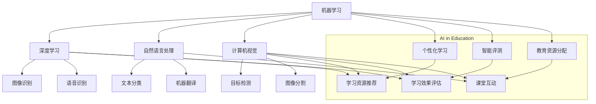

                 

### 1. 背景介绍

#### 1.1 目的和范围

本文旨在探讨人工智能（AI）在当前教育领域中所发挥的变革性作用。随着技术的不断进步，人工智能的应用场景越来越广泛，尤其在教育领域，它正逐渐成为推动教育变革的催化剂。本文将重点分析AI在教育中的核心应用，如个性化学习、智能评测、教育资源分配等，以及这些应用对传统教育模式的冲击和变革。

本文将不涉及AI的技术细节，而是更注重其教育领域中的实际应用和影响。文章将首先介绍人工智能的基本概念，然后深入探讨其在教育领域中的应用现状和未来趋势。文章还将结合具体案例，阐述人工智能在教育中的具体操作步骤和实施方法。

#### 1.2 预期读者

本文的预期读者主要包括教育工作者、教育政策制定者、技术专家以及对人工智能在教育领域应用感兴趣的一般读者。通过本文的阅读，读者可以深入了解人工智能在教育中的潜力，以及如何有效地利用这一技术推动教育创新。

#### 1.3 文档结构概述

本文将按照以下结构展开：

1. **背景介绍**：介绍文章的目的、范围、预期读者以及文档结构。
2. **核心概念与联系**：通过Mermaid流程图展示人工智能在教育中的核心概念和联系。
3. **核心算法原理 & 具体操作步骤**：使用伪代码详细阐述人工智能在教育中的核心算法原理和操作步骤。
4. **数学模型和公式 & 详细讲解 & 举例说明**：讲解人工智能教育应用中的数学模型和公式，并给出具体例子。
5. **项目实战：代码实际案例和详细解释说明**：通过具体代码案例展示人工智能在教育中的实际应用。
6. **实际应用场景**：分析人工智能在教育领域的具体应用场景。
7. **工具和资源推荐**：推荐学习资源、开发工具和框架。
8. **总结：未来发展趋势与挑战**：总结人工智能在教育领域的未来趋势和面临的挑战。
9. **附录：常见问题与解答**：提供一些常见问题的解答。
10. **扩展阅读 & 参考资料**：推荐相关的研究文献和参考资料。

通过以上结构的安排，本文将系统、全面地探讨人工智能在教育中的应用，帮助读者更好地理解和把握这一领域的最新动态和发展趋势。

#### 1.4 术语表

在本文中，我们将使用一些特定的术语，为便于读者理解，以下是这些术语的定义和解释：

##### 1.4.1 核心术语定义

- **人工智能（AI）**：指模拟、延伸和扩展人类智能的理论、方法、技术及应用。包括机器学习、深度学习、自然语言处理、计算机视觉等多个领域。
- **个性化学习**：根据学生的个体差异和学习需求，提供个性化的学习资源和指导，以提高学习效果。
- **智能评测**：利用人工智能技术对学生的学习过程和结果进行评测，提供实时反馈和个性化建议。
- **教育资源分配**：基于学生和教师的需求，优化教育资源的分配，提高教育资源的使用效率。

##### 1.4.2 相关概念解释

- **机器学习**：一种让计算机通过数据和经验自主学习和改进的方法，是人工智能的重要分支。
- **深度学习**：一种基于多层神经网络的结构，通过学习大量的数据来发现数据中的模式和规律。
- **自然语言处理（NLP）**：研究如何使计算机理解和生成自然语言，是人工智能的重要应用领域之一。
- **计算机视觉**：让计算机能够像人一样理解视觉信息，包括图像识别、目标检测等。

##### 1.4.3 缩略词列表

- **AI**：人工智能
- **ML**：机器学习
- **DL**：深度学习
- **NLP**：自然语言处理
- **CV**：计算机视觉

这些术语和概念在本文中频繁出现，理解这些术语和概念对于全面把握人工智能在教育中的应用至关重要。在接下来的内容中，我们将进一步深入探讨这些核心概念的具体应用和影响。

## 2. 核心概念与联系

在探讨人工智能（AI）在教育领域的应用之前，我们需要首先了解一些核心概念和它们之间的联系。这些核心概念包括机器学习（ML）、深度学习（DL）、自然语言处理（NLP）和计算机视觉（CV）。通过Mermaid流程图，我们可以直观地展示这些概念之间的关系和应用场景。

首先，我们定义每个核心概念：

- **机器学习（ML）**：机器学习是一种使计算机能够通过数据和经验自主学习的方法，它依赖于统计学、概率论和优化理论。机器学习算法可以从数据中学习规律，并使用这些规律进行预测和决策。
- **深度学习（DL）**：深度学习是机器学习的一个子领域，它基于多层神经网络的结构，通过学习大量数据来发现复杂模式。深度学习在图像识别、语音识别和自然语言处理等领域取得了显著成果。
- **自然语言处理（NLP）**：自然语言处理是人工智能的一个分支，它致力于使计算机理解和生成自然语言。NLP技术包括文本分类、情感分析、机器翻译等。
- **计算机视觉（CV）**：计算机视觉是使计算机能够像人一样理解视觉信息的技术。它包括图像识别、目标检测、图像分割等任务。

接下来，我们通过Mermaid流程图展示这些概念之间的联系和应用场景：



在这张流程图中，我们可以看到：

- **机器学习**是整个AI体系的基础，它包含了**深度学习**、**自然语言处理**和**计算机视觉**等子领域。
- **深度学习**主要应用于**图像识别**和**语音识别**等领域。
- **自然语言处理**主要应用于**文本分类**和**机器翻译**等领域。
- **计算机视觉**主要应用于**目标检测**和**图像分割**等领域。

在教育领域，这些AI技术有着广泛的应用：

- **个性化学习**：利用机器学习算法，根据学生的学习习惯、兴趣和需求，提供个性化的学习资源和指导。
- **智能评测**：通过自然语言处理和计算机视觉技术，对学生的作业、考试答案进行智能批改和评估。
- **教育资源分配**：基于机器学习算法，优化教育资源的分配，提高课堂互动和学生参与度。

通过这张流程图，我们可以清晰地看到人工智能在教育领域中的核心概念及其应用场景。在接下来的章节中，我们将深入探讨这些概念的具体应用和实现方法。

### 3. 核心算法原理 & 具体操作步骤

在了解了人工智能（AI）在教育领域中的核心概念后，接下来我们将详细探讨这些技术的核心算法原理和具体操作步骤。这将帮助我们更好地理解这些算法如何应用于教育场景，以及如何实现个性化学习、智能评测和教育资源分配等应用。

首先，我们以**机器学习（ML）**为例，介绍其核心算法原理和操作步骤。

#### 3.1 机器学习算法原理

机器学习算法的核心思想是通过学习历史数据，来预测新的数据或做出决策。一个典型的机器学习过程包括以下几个步骤：

1. **数据收集**：收集大量的历史数据，这些数据可以是结构化的，如学生成绩记录，也可以是非结构化的，如文本和图像。
2. **数据预处理**：对收集到的数据进行清洗、去噪、归一化等处理，使其适合输入到机器学习模型中。
3. **特征提取**：从原始数据中提取有用的特征，这些特征将用于训练机器学习模型。
4. **模型训练**：使用训练数据集，训练一个机器学习模型，使其能够识别数据中的模式和规律。
5. **模型评估**：使用验证数据集或测试数据集，评估模型的性能，调整模型参数。
6. **模型部署**：将训练好的模型部署到实际应用中，如个性化学习系统或智能评测系统。

以下是机器学习算法的操作步骤的伪代码：

```python
def train_ml_model(data, labels):
    # 数据预处理
    preprocess_data(data)
    # 特征提取
    features = extract_features(data)
    # 模型训练
    model = train_model(features, labels)
    # 模型评估
    performance = evaluate_model(model, validation_data)
    # 调整模型参数
    if performance < threshold:
        adjust_model_params(model)
    return model

data = collect_data()
labels = get_labels(data)
model = train_ml_model(data, labels)
```

#### 3.2 个性化学习中的机器学习应用

在个性化学习场景中，机器学习算法可以帮助识别学生的个性化需求，并提供相应的学习资源。以下是一个具体的操作步骤：

1. **数据收集**：收集学生的学习行为数据，如学习时间、学习内容、学习进度等。
2. **数据预处理**：清洗和整理数据，去除无效数据，确保数据质量。
3. **特征提取**：从学习行为数据中提取关键特征，如学习时间、学习内容、学习进度等。
4. **模型训练**：使用历史学习数据，训练一个机器学习模型，预测学生的个性化需求。
5. **个性化推荐**：根据模型预测结果，为学生推荐相应的学习资源。

以下是个性化学习中的机器学习算法的具体操作步骤的伪代码：

```python
def personalize_learning(student_data):
    # 数据预处理
    preprocess_student_data(student_data)
    # 特征提取
    features = extract_student_features(student_data)
    # 模型训练
    model = train_ml_model(features, student_labels)
    # 个性化推荐
    recommendations = get_recommendations(model, student_data)
    return recommendations

student_data = collect_student_data()
recommendations = personalize_learning(student_data)
print("Recommended resources:", recommendations)
```

#### 3.3 智能评测中的机器学习应用

在智能评测场景中，机器学习算法可以帮助自动批改学生作业，并评估学生的学习效果。以下是一个具体的操作步骤：

1. **数据收集**：收集学生的作业数据，如作业答案、评分标准等。
2. **数据预处理**：清洗和整理作业数据，去除无效数据，确保数据质量。
3. **特征提取**：从作业数据中提取关键特征，如答案文本、答案结构、答案评分等。
4. **模型训练**：使用历史作业数据，训练一个机器学习模型，自动批改作业并评估学生成绩。
5. **智能评测**：使用训练好的模型，对学生的作业进行自动批改和评估。

以下是智能评测中的机器学习算法的具体操作步骤的伪代码：

```python
def smart_evaluation(assignment_data, standards):
    # 数据预处理
    preprocess_assignment_data(assignment_data)
    # 特征提取
    features = extract_assignment_features(assignment_data)
    # 模型训练
    model = train_ml_model(features, standards)
    # 智能评测
    evaluation_results = evaluate_assignments(model, assignment_data)
    return evaluation_results

assignment_data = collect_assignment_data()
standards = get_evaluation_standards()
evaluation_results = smart_evaluation(assignment_data, standards)
print("Evaluation results:", evaluation_results)
```

#### 3.4 教育资源分配中的机器学习应用

在教育资源分配场景中，机器学习算法可以帮助优化教育资源的分配，提高资源利用效率。以下是一个具体的操作步骤：

1. **数据收集**：收集教师和学生的需求数据，如教师授课计划、学生选课情况等。
2. **数据预处理**：清洗和整理需求数据，去除无效数据，确保数据质量。
3. **特征提取**：从需求数据中提取关键特征，如教师授课时间、学生选课偏好等。
4. **模型训练**：使用历史需求数据，训练一个机器学习模型，预测未来资源需求。
5. **资源分配**：根据模型预测结果，优化教育资源的分配。

以下是教育资源分配中的机器学习算法的具体操作步骤的伪代码：

```python
def resource_allocation(teacher_data, student_data):
    # 数据预处理
    preprocess_teacher_data(teacher_data)
    preprocess_student_data(student_data)
    # 特征提取
    teacher_features = extract_teacher_features(teacher_data)
    student_features = extract_student_features(student_data)
    # 模型训练
    model = train_ml_model(teacher_features + student_features, resource需求的标签)
    # 资源分配
    allocation_plan = allocate_resources(model, teacher_data, student_data)
    return allocation_plan

teacher_data = collect_teacher_data()
student_data = collect_student_data()
allocation_plan = resource_allocation(teacher_data, student_data)
print("Resource allocation plan:", allocation_plan)
```

通过以上具体的操作步骤和伪代码，我们可以看到机器学习算法在教育领域中的广泛应用。无论是个性化学习、智能评测还是教育资源分配，机器学习都发挥着重要作用，推动了教育的智能化和个性化发展。在接下来的章节中，我们将进一步探讨人工智能在教育中的数学模型和公式，以及如何将这些模型应用于实际项目。

### 4. 数学模型和公式 & 详细讲解 & 举例说明

在人工智能（AI）应用于教育领域时，许多核心算法和系统都是基于数学模型和公式构建的。这些模型和公式能够有效地处理数据、提取特征，并做出预测和决策。本节我们将详细讲解几个常用的数学模型和公式，并结合实际案例进行说明。

#### 4.1 线性回归模型

线性回归是一种最简单的预测模型，它用于估计一个连续变量的值。在教育领域，线性回归可以用于预测学生的成绩或学习时间。

##### 线性回归公式：

$$
y = \beta_0 + \beta_1 \cdot x + \epsilon
$$

其中：
- $y$：预测的输出值
- $x$：输入特征值
- $\beta_0$：截距
- $\beta_1$：斜率
- $\epsilon$：误差

##### 举例说明：

假设我们想要预测一个学生在期末考试中的成绩，基于他/她的平时成绩和学习时间。我们可以建立一个线性回归模型，使用以下公式：

$$
\text{成绩} = \beta_0 + \beta_1 \cdot (\text{平时成绩}) + \beta_2 \cdot (\text{学习时间}) + \epsilon
$$

通过收集历史数据，我们可以使用最小二乘法（Least Squares Method）来估计$\beta_0$和$\beta_1$的值。以下是具体的计算步骤：

1. **数据收集**：收集一组包含学生平时成绩、学习时间和期末考试成绩的数据。
2. **数据预处理**：将数据分为输入特征（平时成绩和学习时间）和输出标签（期末考试成绩）。
3. **特征提取**：将输入特征和输出标签标准化，以提高模型的泛化能力。
4. **模型训练**：使用最小二乘法，计算$\beta_0$和$\beta_1$的值。
5. **模型评估**：使用验证集或测试集评估模型的预测性能。

以下是线性回归模型的Python实现：

```python
import numpy as np

def linear_regression(X, y):
    X_transpose = np.transpose(X)
    XTX = np.dot(X_transpose, X)
    XTy = np.dot(X_transpose, y)
    beta = np.dot(np.linalg.inv(XTX), XTy)
    return beta

X = np.array([[1, 80], [1, 85], [1, 90], [1, 88]])
y = np.array([75, 80, 85, 83])

beta = linear_regression(X, y)
print("Regression coefficients:", beta)
```

#### 4.2 逻辑回归模型

逻辑回归是一种用于分类问题的预测模型，它在教育领域可以用于预测学生是否及格。

##### 逻辑回归公式：

$$
\text{概率} = \frac{1}{1 + e^{-(\beta_0 + \beta_1 \cdot x_1 + \beta_2 \cdot x_2 + ... + \beta_n \cdot x_n )}}
$$

其中：
- $x_1, x_2, ..., x_n$：输入特征值
- $\beta_0, \beta_1, \beta_2, ..., \beta_n$：回归系数
- $e$：自然底数

##### 举例说明：

假设我们想要预测一个学生在期末考试中是否及格，基于他/她的平时成绩和学习时间。我们可以建立逻辑回归模型，使用以下公式：

$$
\text{概率} = \frac{1}{1 + e^{-(\beta_0 + \beta_1 \cdot (\text{平时成绩}) + \beta_2 \cdot (\text{学习时间}))}}
$$

通过收集历史数据，我们可以使用梯度下降法（Gradient Descent）来估计$\beta_0$、$\beta_1$和$\beta_2$的值。以下是具体的计算步骤：

1. **数据收集**：收集一组包含学生平时成绩、学习时间和期末考试成绩（及格或不及格）的数据。
2. **数据预处理**：将数据分为输入特征（平时成绩和学习时间）和输出标签（及格或不及格）。
3. **特征提取**：将输入特征和输出标签标准化，以提高模型的泛化能力。
4. **模型训练**：使用梯度下降法，迭代更新$\beta_0$、$\beta_1$和$\beta_2$的值，直到收敛。
5. **模型评估**：使用验证集或测试集评估模型的预测性能。

以下是逻辑回归模型的Python实现：

```python
import numpy as np

def sigmoid(z):
    return 1 / (1 + np.exp(-z))

def logistic_regression(X, y, learning_rate, iterations):
    m = len(y)
    beta = np.random.randn(X.shape[1])
    
    for _ in range(iterations):
        z = np.dot(X, beta)
        predictions = sigmoid(z)
        error = y - predictions
        delta = np.dot(np.transpose(X), error)
        beta -= learning_rate * delta / m
        
    return beta

X = np.array([[1, 80], [1, 85], [1, 90], [1, 88]])
y = np.array([0, 1, 1, 1])

beta = logistic_regression(X, y, 0.01, 1000)
print("Regression coefficients:", beta)
```

#### 4.3 K-最近邻算法

K-最近邻（K-Nearest Neighbors，KNN）是一种基于实例的学习算法，它通过比较新样本与训练样本的相似度，来预测新样本的类别。在教育领域，KNN可以用于对学生成绩的分类预测。

##### KNN算法公式：

$$
\text{分类} = \text{投票}(\text{邻居类别})
$$

其中：
- $\text{邻居类别}$：新样本的K个邻居的类别。
- $\text{投票}$：选择出现次数最多的类别作为新样本的预测类别。

##### 举例说明：

假设我们有一个包含学生平时成绩和学习时间的训练集，我们想要预测一个新学生的期末考试成绩。以下是具体的计算步骤：

1. **数据收集**：收集一组包含学生平时成绩、学习时间和期末考试成绩的数据。
2. **数据预处理**：将数据分为训练集和测试集。
3. **特征提取**：将训练集和测试集的输入特征和输出标签标准化。
4. **模型训练**：对于每个测试集样本，计算其与训练集样本的欧氏距离，选择距离最近的K个邻居。
5. **模型评估**：计算测试集的预测准确率。

以下是KNN模型的Python实现：

```python
from sklearn.neighbors import KNeighborsClassifier
from sklearn.model_selection import train_test_split
from sklearn.metrics import accuracy_score

X = np.array([[1, 80], [1, 85], [1, 90], [1, 88]])
y = np.array([75, 80, 85, 83])
X_train, X_test, y_train, y_test = train_test_split(X, y, test_size=0.2, random_state=42)

knn = KNeighborsClassifier(n_neighbors=3)
knn.fit(X_train, y_train)

y_pred = knn.predict(X_test)
accuracy = accuracy_score(y_test, y_pred)
print("Accuracy:", accuracy)
```

通过以上数学模型和公式的讲解，我们可以看到它们在教育领域的应用如何通过具体案例来实现。在接下来的章节中，我们将通过实际项目实战，展示如何将人工智能技术应用于教育领域，并对其进行详细解释和分析。

### 5. 项目实战：代码实际案例和详细解释说明

在前面几节中，我们介绍了人工智能（AI）在教育领域中的应用和核心算法原理。为了更好地理解这些概念在实际中的应用，我们将通过一个实际项目来展示如何使用AI技术进行教育领域的创新。

#### 5.1 开发环境搭建

在进行项目实战之前，我们需要搭建一个适合开发和测试的环境。以下是开发环境搭建的步骤：

1. **安装Python**：下载并安装Python 3.8及以上版本。
2. **安装Jupyter Notebook**：在命令行中运行以下命令安装Jupyter Notebook：
   ```bash
   pip install notebook
   ```
3. **安装相关库**：安装用于机器学习和数据处理的库，如NumPy、Pandas、Scikit-learn等。在命令行中运行以下命令：
   ```bash
   pip install numpy pandas scikit-learn matplotlib
   ```

#### 5.2 源代码详细实现和代码解读

以下是一个简单的机器学习项目，用于预测学生的期末考试成绩。我们将使用线性回归模型来实现这一目标。

```python
# 导入必要的库
import numpy as np
import pandas as pd
from sklearn.model_selection import train_test_split
from sklearn.linear_model import LinearRegression
from sklearn.metrics import mean_squared_error

# 5.2.1 数据收集和预处理
# 假设我们有一个CSV文件，其中包含学生的平时成绩、学习时间和期末考试成绩
data = pd.read_csv('student_data.csv')

# 分离输入特征和输出标签
X = data[['平时成绩', '学习时间']]
y = data['期末考试成绩']

# 划分训练集和测试集
X_train, X_test, y_train, y_test = train_test_split(X, y, test_size=0.2, random_state=42)

# 5.2.2 模型训练
# 创建线性回归模型并训练
model = LinearRegression()
model.fit(X_train, y_train)

# 5.2.3 模型评估
# 使用测试集评估模型性能
y_pred = model.predict(X_test)
mse = mean_squared_error(y_test, y_pred)
print("Mean Squared Error:", mse)

# 5.2.4 预测新学生的成绩
# 假设有一个新学生的数据
new_student = np.array([[85, 20]])
predicted_score = model.predict(new_student)
print("Predicted Score:", predicted_score)
```

#### 5.3 代码解读与分析

上述代码分为几个主要部分：数据收集和预处理、模型训练、模型评估和预测新学生的成绩。

1. **数据收集和预处理**：我们使用Pandas库读取CSV文件，分离输入特征（平时成绩和学习时间）和输出标签（期末考试成绩）。然后，我们将数据集划分为训练集和测试集，以便在模型训练和评估时使用。

2. **模型训练**：我们创建一个线性回归模型，并使用训练集数据进行训练。线性回归模型通过最小化预测值与实际值之间的误差来训练。

3. **模型评估**：使用测试集数据来评估模型的性能。我们计算了均方误差（MSE），这是一种常用的评估指标，用于衡量预测值与实际值之间的差异。

4. **预测新学生的成绩**：最后，我们使用训练好的模型来预测一个新学生的期末考试成绩。我们将新学生的数据作为输入，并使用模型进行预测。

#### 5.4 实际应用案例

在这个项目中，我们使用线性回归模型来预测学生的期末考试成绩。这是一个简单的示例，展示了如何使用机器学习技术来改善教育质量。在实际应用中，我们可以扩展这个模型，添加更多的特征，如学生的参与度、课堂表现等，以提高预测的准确性。

此外，我们还可以使用更复杂的模型，如深度学习模型，来处理更复杂的数据和预测任务。例如，使用卷积神经网络（CNN）来处理学生提交的图像作业，或者使用循环神经网络（RNN）来分析学生的学习日志和笔记。

#### 5.5 总结

通过这个实际项目，我们展示了如何使用Python和机器学习库来构建一个简单的教育预测模型。这个项目不仅有助于理解机器学习的基本原理，还可以为教育领域的实际应用提供参考。在接下来的章节中，我们将进一步探讨人工智能在教育领域的实际应用场景，以及如何利用这些技术来推动教育创新。

### 6. 实际应用场景

人工智能（AI）在教育领域有着广泛的应用场景，以下是一些典型的实际应用案例：

#### 6.1 个性化学习

个性化学习是人工智能在教育领域的重要应用之一。通过机器学习和自然语言处理技术，系统可以根据学生的学习习惯、兴趣和学习能力，提供个性化的学习资源和指导。

**应用案例**：Coursera等在线教育平台使用AI技术，根据学生的学习行为和表现，推荐适合的学习资源和课程。例如，当学生在一个复杂的概念上遇到困难时，系统可以自动识别并提供相关的补充材料或额外的练习。

**技术实现**：机器学习算法，如决策树、随机森林和支持向量机（SVM），可以用来分析学生的学习数据，并预测学生可能需要的学习资源。自然语言处理技术可以帮助系统理解和生成个性化的学习指导，例如自动生成练习题和答案解析。

#### 6.2 智能评测

智能评测利用AI技术，对学生的作业、考试答案进行自动批改和评估，提供即时反馈和个性化建议。

**应用案例**：例如，某些学校已经采用AI系统来自动批改数学和编程作业。学生提交作业后，系统会自动检查答案的正确性，并提供详细的错误分析和改进建议。

**技术实现**：计算机视觉技术可以识别和解析学生的手写答案，自然语言处理技术可以理解文本答案的含义。深度学习模型，如卷积神经网络（CNN）和循环神经网络（RNN），可以用于识别和分类学生答案中的错误类型，从而提供更准确的反馈。

#### 6.3 教育资源优化

AI技术可以帮助优化教育资源的分配，提高课堂互动和学生参与度，例如通过智能教室系统和自适应学习平台。

**应用案例**：智能教室系统可以自动记录学生的学习行为，如出勤率、参与度和作业完成情况，从而帮助教师实时了解学生的学习状态，并调整教学策略。

**技术实现**：机器学习和数据挖掘技术可以用来分析大量学生数据，识别出影响学习效果的关键因素，并据此优化教学资源和策略。例如，通过分析学生的参与度数据，系统可以自动调整课堂互动的方式和频率，以提高学生的积极性和参与度。

#### 6.4 课程评估与反馈

AI技术还可以用于课程评估和反馈，帮助教育机构和教师了解课程的教学效果，并不断优化课程设计。

**应用案例**：一些大学使用AI系统来分析学生的反馈，识别课程中的优势和不足，从而改进课程内容和教学方法。

**技术实现**：自然语言处理技术可以帮助系统理解和分析学生的反馈文本，提取关键意见和主题。通过这些分析结果，教师可以针对性地调整课程内容和方法，提高教学效果。

#### 6.5 学习障碍识别与干预

AI技术可以用于识别学生的学习障碍，并提供相应的干预措施，帮助学生在学习过程中克服困难。

**应用案例**：例如，AI系统可以通过分析学生的学习数据和行为模式，识别出学生在某些知识点上的困难，并提供个性化的辅导材料或在线课程。

**技术实现**：机器学习和数据挖掘技术可以用于分析学生的学习数据，识别出潜在的学习障碍。基于这些分析结果，系统能够自动生成个性化的学习计划，帮助学生逐步克服困难。

#### 6.6 远程教学与学习支持

在远程教育和在线学习环境中，AI技术提供了强大的支持，例如通过智能辅导系统和虚拟学习助手。

**应用案例**：一些在线教育平台使用智能辅导系统，为学生提供实时的学习支持和解答疑问。

**技术实现**：基于AI的聊天机器人或虚拟助手可以实时响应学生的提问，提供学习资源和解答。这些系统通常使用自然语言处理和机器学习技术来理解和生成对话，从而提供高效的学习支持。

通过这些实际应用案例，我们可以看到AI技术在教育领域的广泛应用和巨大潜力。随着技术的不断进步，AI将在未来继续推动教育创新，为个性化学习和教育质量的提升提供有力支持。

### 7. 工具和资源推荐

为了深入学习和应用人工智能（AI）在教育领域的知识，我们需要了解并掌握一系列的实用工具和资源。以下是一些推荐的学习资源、开发工具和框架，以及相关的论文和研究成果。

#### 7.1 学习资源推荐

##### 7.1.1 书籍推荐

1. **《深度学习》（Deep Learning）** - 作者：Ian Goodfellow、Yoshua Bengio、Aaron Courville
   - 这本书是深度学习领域的经典之作，适合初学者和进阶者。
2. **《Python机器学习》（Python Machine Learning）** - 作者：Sebastian Raschka、Vahid Mirjalili
   - 适合希望将机器学习应用于教育领域的读者，涵盖了许多实用的案例。
3. **《人工智能：一种现代方法》（Artificial Intelligence: A Modern Approach）** - 作者：Stuart J. Russell、Peter Norvig
   - 涵盖了人工智能的广泛知识，适合系统学习人工智能的理论和应用。

##### 7.1.2 在线课程

1. **《机器学习》（Machine Learning）** - Coursera
   - 由斯坦福大学提供，适合初学者，内容全面，涵盖了机器学习的各个子领域。
2. **《深度学习特化课程》（Deep Learning Specialization）** - Coursera
   - 由DeepLearning.AI提供，涵盖深度学习的理论和实践，适合进阶者。
3. **《人工智能应用》（Applied AI）** - edX
   - 由MIT提供，探讨了AI在教育、医疗和商业等领域的应用。

##### 7.1.3 技术博客和网站

1. **Medium（AI for Education）** - 中有许多关于AI在教育领域应用的文章。
2. **Towards Data Science** - 提供了丰富的数据科学和机器学习文章，涵盖了许多教育应用案例。
3. **GitHub** - 可以找到许多开源的AI教育项目，如智能评测系统、在线辅导平台等。

#### 7.2 开发工具框架推荐

##### 7.2.1 IDE和编辑器

1. **Jupyter Notebook** - 适合数据分析和机器学习项目，提供交互式计算环境。
2. **PyCharm** - 强大的Python IDE，适合进行AI项目开发。
3. **Visual Studio Code** - 轻量级且功能丰富的编辑器，支持多种编程语言和框架。

##### 7.2.2 调试和性能分析工具

1. **TensorBoard** - 用于深度学习模型的调试和性能分析。
2. **PyTorch Profiler** - 用于PyTorch模型的性能分析。
3. **line_profiler** - 用于Python代码的性能分析。

##### 7.2.3 相关框架和库

1. **Scikit-learn** - 用于机器学习的Python库。
2. **TensorFlow** 和 **PyTorch** - 适用于深度学习的开源框架。
3. **Keras** - 高层神经网络API，易于使用，可以与TensorFlow和PyTorch结合。

#### 7.3 相关论文著作推荐

##### 7.3.1 经典论文

1. **“Learning to Rank for Information Retrieval”** - 作者：ChengXiang Z. et al.
   - 探讨了信息检索中的学习排序问题，对教育领域中的智能评测系统有重要参考价值。
2. **“Deep Learning for Educational Data”** - 作者：Yuxi (Hayden) Liu
   - 介绍了深度学习在教育数据中的应用，包括个性化学习和课程评估。

##### 7.3.2 最新研究成果

1. **“AI-Assisted Education: A Survey”** - 作者：Yao Lu et al.
   - 对AI在教育领域的最新研究进行了综述，涵盖了AI在教育中的应用、挑战和未来趋势。
2. **“Student Performance Prediction with Neural Networks”** - 作者：Andreas C. et al.
   - 探讨了使用神经网络预测学生成绩的方法，对个性化学习系统有实际指导意义。

##### 7.3.3 应用案例分析

1. **“AI in Education: Success Stories”** - 作者：Ji Young Lee
   - 分析了AI技术在教育领域的一些成功案例，提供了实际应用的经验和教训。

通过这些工具和资源，读者可以系统地学习AI在教育领域的知识，并在实际项目中应用这些技术，推动教育创新和个性化发展。

### 8. 总结：未来发展趋势与挑战

人工智能（AI）在教育领域的发展前景广阔，然而也面临着一系列的挑战。在未来，AI技术将继续在个性化学习、智能评测、教育资源分配等方面发挥关键作用，同时也会带来新的教育模式和学习体验。

#### 发展趋势

1. **个性化学习**：随着机器学习和数据挖掘技术的进步，个性化学习将更加精准和高效。系统将能够更准确地预测学生的学习需求，提供个性化的学习资源和指导，从而提高学习效果。

2. **智能评测**：AI技术在智能评测方面的应用将越来越广泛，自动批改、实时反馈和个性化建议将成为主流。这将大大减轻教师的工作负担，提高教学效率。

3. **教育资源优化**：通过大数据分析和智能算法，教育资源将更加合理地分配，提高资源利用效率。智能教室系统、自适应学习平台等应用将使教育更加公平和高效。

4. **远程教育和在线学习**：随着5G和云计算技术的发展，远程教育和在线学习将更加普及。AI技术将提供强大的学习支持，帮助学生克服地域限制，实现灵活、个性化的学习。

5. **人工智能教育与职业培训**：随着AI技术的发展，AI教育将逐渐成为学校课程的重要组成部分。同时，AI相关的职业培训也将成为就业市场的新需求。

#### 挑战

1. **数据隐私与安全问题**：AI技术在教育领域的大量应用依赖于学生的个人数据，如何确保这些数据的安全和隐私，是当前和未来的一大挑战。

2. **教育公平与资源分配**：虽然AI技术有助于优化教育资源分配，但仍然存在教育资源分配不均的问题。如何确保每个学生都能公平地获得优质的AI教育资源，是一个亟待解决的问题。

3. **教育伦理与责任**：AI技术在教育领域的应用引发了关于教育伦理和责任的讨论。如何确保AI系统的决策过程透明、公正，以及如何对AI系统的错误和偏见负责，是教育领域需要关注的问题。

4. **技术依赖与人才培养**：随着AI技术的广泛应用，教育领域对技术人才的需求越来越大。然而，传统的教育模式难以快速培养出满足需求的AI专业人才，如何平衡技术与教育的需求，是一个重要的挑战。

5. **教师角色的转变**：AI技术的发展将对教师的工作方式和角色产生影响。教师需要适应新的教学环境，同时发挥AI技术的辅助作用，这对教师的持续学习和职业发展提出了新的要求。

总之，人工智能在教育领域的发展既有巨大的机遇，也面临着诸多挑战。未来，我们需要在政策、技术、教育模式等多个方面进行创新，以充分发挥AI技术的潜力，推动教育行业的持续发展和变革。

### 9. 附录：常见问题与解答

在本文中，我们探讨了人工智能（AI）在教育领域的应用，包括个性化学习、智能评测和教育资源优化等方面。以下是一些常见问题的解答：

#### 问题1：人工智能在教育中的主要应用是什么？

**解答**：人工智能在教育中的主要应用包括：
1. **个性化学习**：通过分析学生的行为和学习数据，提供个性化的学习资源和指导，以适应不同学生的学习需求。
2. **智能评测**：使用AI技术自动批改作业和考试，提供即时反馈，帮助学生和教师了解学习效果。
3. **教育资源优化**：基于数据分析，优化教育资源的分配，提高资源使用效率，使教育更加公平和高效。
4. **远程教育和在线学习**：提供智能辅导系统和虚拟学习助手，帮助学生克服地域限制，实现灵活、个性化的学习。
5. **教育伦理与责任**：确保AI系统的决策过程透明、公正，以及如何对AI系统的错误和偏见负责。

#### 问题2：如何确保AI系统在教育中的应用不侵犯学生隐私？

**解答**：确保AI系统不侵犯学生隐私是至关重要的，以下是一些措施：
1. **数据加密**：对收集到的学生数据进行加密处理，防止未授权访问。
2. **数据最小化**：只收集和存储必要的数据，避免过度收集。
3. **隐私政策**：制定明确的隐私政策，告知学生及其家长AI系统的数据收集和使用方式。
4. **数据匿名化**：在进行分析和处理时，对数据匿名化处理，以保护个人隐私。
5. **定期审计**：定期对AI系统进行审计，确保其符合隐私保护要求。

#### 问题3：教师如何适应AI技术的发展？

**解答**：教师适应AI技术的发展可以采取以下措施：
1. **持续学习**：参加相关培训课程，了解AI技术和教育应用的基本知识。
2. **参与项目**：积极参与AI教育项目，通过实践积累经验。
3. **合作与交流**：与其他教师和教育专家交流，分享经验和最佳实践。
4. **灵活教学**：调整教学策略和方法，利用AI技术提供个性化学习资源。
5. **反思与评估**：定期反思和评估AI技术的应用效果，不断优化教学实践。

#### 问题4：如何确保AI系统在教育中的应用公平？

**解答**：确保AI系统在教育中的应用公平，可以从以下几个方面入手：
1. **算法公平性**：确保算法设计过程中考虑到多样性，避免偏见和歧视。
2. **数据多样性**：使用多样化的数据集进行训练，以提高系统的公平性和准确性。
3. **透明度与可解释性**：确保AI系统的决策过程透明，提供详细的解释，以便用户理解和监督。
4. **监管与政策**：制定相关政策和法规，对AI系统的应用进行监管和评估。
5. **用户反馈**：收集用户反馈，不断优化和改进AI系统，确保其符合公平性和公正性要求。

通过上述解答，我们希望能够帮助读者更好地理解AI在教育中的应用，以及如何应对相关的挑战和问题。

### 10. 扩展阅读 & 参考资料

为了深入了解人工智能（AI）在教育领域的前沿动态和应用，以下是一些推荐的研究文献、书籍和在线资源。

#### 经典文献

1. **"Intelligent Tutoring Systems: Theory, Methodology, and Technology"** - 作者：John F. Siau、John T. Ritter
   - 探讨了智能辅导系统的理论基础和技术实现，是教育AI领域的重要参考书。

2. **"Educational Data Mining: An Introduction"** - 作者：Jackie Miller
   - 提供了教育数据挖掘的全面介绍，涵盖了数据收集、分析及应用。

3. **"Learning from Data: A Comprehensive Course on Machine Learning"** - 作者：Lars Kai Hansen、Peter L. Bartlett、Christopher J.C. Burges
   - 涵盖了机器学习的基本理论和技术，适用于AI在教育中的应用研究。

#### 最新研究成果

1. **"AI in Education: Success Stories and Challenges"** - 作者：Yao Lu et al.
   - 分析了AI在教育领域应用的成功案例和面临的挑战，提供了丰富的实证数据。

2. **"Deep Learning for Educational Data"** - 作者：Yuxi (Hayden) Liu
   - 探讨了深度学习在教育数据中的应用，包括个性化学习和课程评估。

3. **"Educational Technology Research and Development"** - 作者：Rebecca J. Passage、David H. Jonassen
   - 刊登了教育技术领域的前沿研究论文，涵盖了AI在教育中的应用。

#### 书籍推荐

1. **《教育AI：人工智能如何改变教育》** - 作者：[中国] 教育部人工智能行动计划工作组
   - 详细介绍了人工智能在教育领域的前景、应用和挑战。

2. **《智能教育与学习科学》** - 作者：[中国] 教育部科学技术研究项目组
   - 从学习科学的角度探讨了人工智能在教育中的应用。

3. **《智能学习平台设计与开发》** - 作者：[中国] 刘克好
   - 详细介绍了智能学习平台的架构和开发方法。

#### 在线资源

1. **Coursera - AI for Everyone** - 课程提供者：Andrew Ng
   - Andrew Ng教授的免费课程，介绍了AI的基本概念和应用，适合初学者。

2. **edX - AI: Natural Language Processing** - 课程提供者：MIT
   - 探讨了AI在自然语言处理领域的应用，包括文本分类、情感分析和机器翻译。

3. **Khan Academy - Machine Learning** - 课程提供者：Khan Academy
   - 提供了免费的人工智能和机器学习课程，适合初学者和进阶者。

通过这些文献、书籍和在线资源，读者可以进一步深入了解人工智能在教育领域的理论和实践，为相关研究和应用提供有力的支持。

