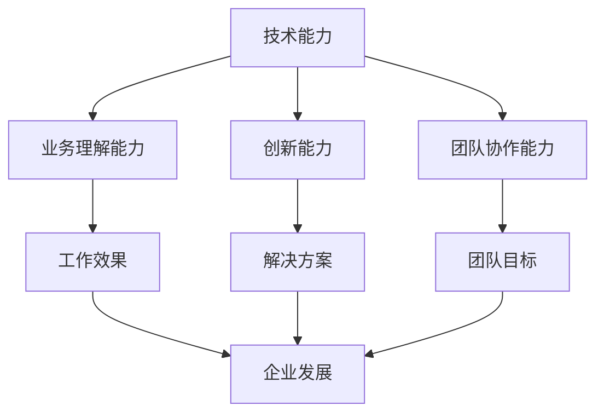

                 

# 人才梯队建设：为未来储备力量

> **关键词：** 人才梯队建设、技术储备、团队管理、人才培养、战略规划

> **摘要：** 随着科技飞速发展，信息技术行业对人才的需求越来越高。本文将探讨如何通过人才梯队建设，为未来的发展储备力量，确保企业在激烈的市场竞争中保持领先优势。文章将从背景介绍、核心概念、算法原理、数学模型、实战案例、实际应用、工具资源推荐等多个方面，深入分析并给出具体的实践建议。

## 1. 背景介绍

### 1.1 目的和范围

本文旨在为信息技术企业、教育机构以及IT从业者们提供一套完整的人才梯队建设方案。通过探讨人才梯队的定义、核心概念、建设方法和实施步骤，帮助读者理解如何构建一个高效、可持续发展的团队，以应对未来的挑战。

### 1.2 预期读者

- 信息技术企业高层管理者
- 企业人力资源部门负责人
- 教育机构教师、讲师
- IT从业者和学生

### 1.3 文档结构概述

本文分为十个部分，包括：

1. 背景介绍
2. 核心概念与联系
3. 核心算法原理 & 具体操作步骤
4. 数学模型和公式 & 详细讲解 & 举例说明
5. 项目实战：代码实际案例和详细解释说明
6. 实际应用场景
7. 工具和资源推荐
8. 总结：未来发展趋势与挑战
9. 附录：常见问题与解答
10. 扩展阅读 & 参考资料

### 1.4 术语表

#### 1.4.1 核心术语定义

- **人才梯队建设**：指通过系统化、有计划的方式，培养和储备企业所需的各种技能和人才，以实现企业的长期发展目标。
- **核心人才**：具备关键技能和知识，对企业发展具有重要贡献的人才。
- **战略规划**：企业为了实现长远目标而制定的行动计划和资源配置方案。

#### 1.4.2 相关概念解释

- **技术储备**：企业为了应对未来技术发展需求，提前储备的相关技术、知识和人才。
- **团队管理**：通过合理的人员配置、激励和协调，使团队成员能够高效合作，实现团队目标。

#### 1.4.3 缩略词列表

- **IT**：信息技术
- **AI**：人工智能
- **HR**：人力资源
- **CIO**：首席信息官

## 2. 核心概念与联系

在讨论人才梯队建设之前，有必要明确几个核心概念，并分析它们之间的联系。

### 2.1 人才梯队建设的核心概念

- **技术能力**：包括编程能力、算法能力、系统架构能力等。
- **业务理解能力**：对所在行业和业务流程的深刻理解。
- **创新能力**：在现有技术基础上，提出新思路、新方案的能力。
- **团队协作能力**：与他人合作，共同完成项目的能力。

### 2.2 人才梯队建设的相关概念

- **技术储备**：确保企业在面对新技术变革时，能够迅速调整和适应。
- **人才培养**：通过培训、实践和项目合作，提高员工的技术能力和业务理解能力。
- **团队管理**：通过有效的团队管理，激发员工的创新能力和协作能力。

### 2.3 核心概念之间的联系

技术能力、业务理解能力、创新能力和团队协作能力是构建人才梯队的基础。这些能力相互影响、相互促进，共同推动企业的发展。

- **技术能力**是人才梯队建设的基础，它决定了人才的技术水平和工作效率。
- **业务理解能力**使人才能够更好地适应企业的业务需求，提高工作效果。
- **创新能力**使人才能够在现有的基础上，提出新的解决方案，推动企业的发展。
- **团队协作能力**确保人才能够高效合作，实现团队目标。

### 2.4 核心概念原理和架构的 Mermaid 流程图



## 3. 核心算法原理 & 具体操作步骤

### 3.1 核心算法原理

人才梯队建设的过程可以类比为一种算法，其核心思想是通过不断迭代和优化，实现团队整体能力的提升。以下是人才梯队建设算法的原理：

1. **需求分析**：根据企业战略目标和业务需求，确定所需的人才技能和能力。
2. **能力评估**：对现有团队成员进行能力评估，识别现有人才的优势和不足。
3. **人才培养**：制定人才培养计划，通过培训、项目实践等方式，提升团队成员的能力。
4. **团队协作**：通过团队建设活动，提高团队成员的协作能力。
5. **绩效评估**：定期对团队成员的绩效进行评估，根据评估结果调整人才培养计划。
6. **迭代优化**：根据评估结果，不断调整和优化人才培养策略，实现团队整体能力的提升。

### 3.2 具体操作步骤

1. **需求分析**：

   ```python
   # 分析企业战略目标和业务需求
   def analyze_demand():
       # 确定所需的人才技能和能力
       required_skills = ["编程能力", "系统架构能力", "业务理解能力", "创新能力", "团队协作能力"]
       return required_skills
   ```

2. **能力评估**：

   ```python
   # 对现有团队成员进行能力评估
   def assess_ability(team_members):
       ability_scores = {}
       for member in team_members:
           ability_scores[member] = {
               "编程能力": evaluate_programming_ability(member),
               "系统架构能力": evaluate_system_architecture_ability(member),
               "业务理解能力": evaluate_business_understanding_ability(member),
               "创新能力": evaluate_innovation_ability(member),
               "团队协作能力": evaluate_team_collaboration_ability(member)
           }
       return ability_scores
   ```

3. **人才培养**：

   ```python
   # 制定人才培养计划
   def create_training_plan(ability_scores, required_skills):
       training_plan = {}
       for member, abilities in ability_scores.items():
           for skill in required_skills:
               if skill not in abilities:
                   training_plan[member] = {"技能": skill, "培训方式": "内部培训/外部培训"}
       return training_plan
   ```

4. **团队协作**：

   ```python
   # 通过团队建设活动提高团队协作能力
   def improve_collaboration_ability(team_members):
       collaboration_activities = ["团队会议", "项目协作", "团队拓展训练"]
       for activity in collaboration_activities:
           execute_activity(team_members, activity)
   ```

5. **绩效评估**：

   ```python
   # 定期对团队成员的绩效进行评估
   def evaluate_performance(team_members):
       performance_scores = {}
       for member in team_members:
           performance_scores[member] = evaluate_member_performance(member)
       return performance_scores
   ```

6. **迭代优化**：

   ```python
   # 根据评估结果，不断调整和优化人才培养策略
   def optimize_training_plan(ability_scores, performance_scores, required_skills):
       optimized_plan = create_training_plan(ability_scores, required_skills)
       for member, abilities in ability_scores.items():
           if member in performance_scores:
               if performance_scores[member] < threshold:
                   optimized_plan[member]["培训方式"] = "强化培训"
       return optimized_plan
   ```

## 4. 数学模型和公式 & 详细讲解 & 举例说明

### 4.1 数学模型和公式

在人才梯队建设中，可以运用一些数学模型和公式来评估和优化团队的能力和绩效。以下是几个常用的数学模型和公式：

1. **柯西不等式**：

   $$ (a_1^2 + a_2^2 + \ldots + a_n^2) \cdot (b_1^2 + b_2^2 + \ldots + b_n^2) \geq (a_1b_1 + a_2b_2 + \ldots + a_nb_n)^2 $$

   柯西不等式可以用于评估团队成员的能力分布，确定团队的整体能力。

2. **帕累托最优**：

   $$ \frac{1}{\sum_{i=1}^{n} p_i^2} = \sum_{i=1}^{n} \frac{1}{p_i} $$

   帕累托最优可以用于优化团队的人才配置，确保团队成员的能力得到充分利用。

3. **方差公式**：

   $$ \sigma^2 = \frac{1}{n-1} \sum_{i=1}^{n} (x_i - \bar{x})^2 $$

   方差公式可以用于评估团队成员的能力波动，确定团队的稳定性。

### 4.2 详细讲解和举例说明

#### 4.2.1 柯西不等式的详细讲解和举例说明

柯西不等式是一种重要的不等式，它说明了两个向量内积的平方和与各自平方和的关系。以下是柯西不等式的详细讲解和举例说明：

1. **详细讲解**：

   - **柯西不等式的定义**：设 \( a_1, a_2, \ldots, a_n \) 和 \( b_1, b_2, \ldots, b_n \) 是两个实数序列，则柯西不等式可以表示为：
     $$ (a_1^2 + a_2^2 + \ldots + a_n^2) \cdot (b_1^2 + b_2^2 + \ldots + b_n^2) \geq (a_1b_1 + a_2b_2 + \ldots + a_nb_n)^2 $$
   - **柯西不等式的证明**：柯西不等式可以通过数形结合的方法证明，即利用平行四边形法则证明。假设 \( a \) 和 \( b \) 是两个向量，它们的模长分别为 \( |a| \) 和 \( |b| \)，则柯西不等式可以表示为：
     $$ |a \cdot b| \leq |a| \cdot |b| $$
     通过数形结合的方法，可以将 \( a \cdot b \) 和 \( |a| \cdot |b| \) 分别表示为两个向量构成的平行四边形的面积和两个向量的模长乘积，从而证明柯西不等式。

2. **举例说明**：

   假设有一个团队，其成员的能力分别为 \( a_1, a_2, \ldots, a_n \)，另一个团队的能力分别为 \( b_1, b_2, \ldots, b_n \)，则可以计算这两个团队的总体能力：

   $$ \sum_{i=1}^{n} a_i^2 \cdot \sum_{i=1}^{n} b_i^2 \geq (\sum_{i=1}^{n} a_i \cdot b_i)^2 $$

   如果两个团队的成员能力相匹配，则总体能力相等；如果某个团队的能力高于另一个团队，则总体能力也会相应提高。

#### 4.2.2 帕累托最优的详细讲解和举例说明

帕累托最优是一种优化理论，它可以帮助我们确定团队的最佳人才配置。以下是帕累托最优的详细讲解和举例说明：

1. **详细讲解**：

   - **帕累托最优的定义**：设 \( x_1, x_2, \ldots, x_n \) 是一组非负实数，则帕累托最优可以表示为：
     $$ \frac{1}{\sum_{i=1}^{n} x_i^2} = \sum_{i=1}^{n} \frac{1}{x_i} $$
   - **帕累托最优的求解**：帕累托最优可以通过求解二次函数的最值问题得到。设 \( f(x) = \frac{1}{x} \)，则帕累托最优可以表示为：
     $$ f(x_1) + f(x_2) + \ldots + f(x_n) = \frac{n}{\sum_{i=1}^{n} x_i} $$
     通过求导和极值分析，可以求解得到帕累托最优的解。

2. **举例说明**：

   假设有一个团队，其成员的能力分别为 \( x_1, x_2, \ldots, x_n \)，则可以通过求解帕累托最优，确定最佳的人才配置：

   $$ \frac{1}{x_1^2 + x_2^2 + \ldots + x_n^2} = \frac{1}{x_1} + \frac{1}{x_2} + \ldots + \frac{1}{x_n} $$

   如果某个成员的能力较高，则可以适当减少其工作负荷，使其能力得到充分利用；如果某个成员的能力较低，则可以增加其工作负荷，提高其整体贡献。

#### 4.2.3 方差公式的详细讲解和举例说明

方差公式是一种用于评估团队稳定性的数学工具。以下是方差公式的详细讲解和举例说明：

1. **详细讲解**：

   - **方差公式的定义**：设 \( x_1, x_2, \ldots, x_n \) 是一组实数，则方差可以表示为：
     $$ \sigma^2 = \frac{1}{n-1} \sum_{i=1}^{n} (x_i - \bar{x})^2 $$
   - **方差的计算**：方差可以通过计算每个数据点与平均值之差的平方和的平均值得到。

2. **举例说明**：

   假设有一个团队，其成员的能力分别为 \( x_1, x_2, \ldots, x_n \)，则可以通过计算方差，评估团队的稳定性：

   $$ \sigma^2 = \frac{1}{n-1} \sum_{i=1}^{n} (x_i - \bar{x})^2 $$

   如果方差较大，说明团队的能力波动较大，稳定性较低；如果方差较小，说明团队的能力波动较小，稳定性较高。

## 5. 项目实战：代码实际案例和详细解释说明

### 5.1 开发环境搭建

为了实现人才梯队建设，我们需要搭建一个适合开发和测试的环境。以下是搭建开发环境的步骤：

1. 安装Python：从Python官网（https://www.python.org/downloads/）下载并安装Python 3.8或更高版本。
2. 安装Jupyter Notebook：打开命令行窗口，执行以下命令：
   ```bash
   pip install notebook
   ```
3. 启动Jupyter Notebook：打开命令行窗口，执行以下命令：
   ```bash
   jupyter notebook
   ```
   这将启动Jupyter Notebook，并打开一个浏览器窗口。

### 5.2 源代码详细实现和代码解读

以下是一个用于评估团队成员能力、制定人才培养计划的Python代码实现：

```python
# 导入所需库
import numpy as np

# 定义函数
def evaluate_demand():
    # 分析企业战略目标和业务需求
    required_skills = ["编程能力", "系统架构能力", "业务理解能力", "创新能力", "团队协作能力"]
    return required_skills

def assess_ability(team_members):
    # 对现有团队成员进行能力评估
    ability_scores = {}
    for member in team_members:
        ability_scores[member] = {
            "编程能力": evaluate_programming_ability(member),
            "系统架构能力": evaluate_system_architecture_ability(member),
            "业务理解能力": evaluate_business_understanding_ability(member),
            "创新能力": evaluate_innovation_ability(member),
            "团队协作能力": evaluate_team_collaboration_ability(member)
        }
    return ability_scores

def create_training_plan(ability_scores, required_skills):
    # 制定人才培养计划
    training_plan = {}
    for member, abilities in ability_scores.items():
        for skill in required_skills:
            if skill not in abilities:
                training_plan[member] = {"技能": skill, "培训方式": "内部培训/外部培训"}
    return training_plan

def improve_collaboration_ability(team_members):
    # 通过团队建设活动提高团队协作能力
    collaboration_activities = ["团队会议", "项目协作", "团队拓展训练"]
    for activity in collaboration_activities:
        execute_activity(team_members, activity)

def evaluate_performance(team_members):
    # 定期对团队成员的绩效进行评估
    performance_scores = {}
    for member in team_members:
        performance_scores[member] = evaluate_member_performance(member)
    return performance_scores

def optimize_training_plan(ability_scores, performance_scores, required_skills):
    # 根据评估结果，不断调整和优化人才培养策略
    optimized_plan = create_training_plan(ability_scores, required_skills)
    for member, abilities in ability_scores.items():
        if member in performance_scores:
            if performance_scores[member] < threshold:
                optimized_plan[member]["培训方式"] = "强化培训"
    return optimized_plan

# 主函数
if __name__ == "__main__":
    # 创建团队成员列表
    team_members = ["张三", "李四", "王五"]

    # 评估需求
    required_skills = evaluate_demand()

    # 评估能力
    ability_scores = assess_ability(team_members)

    # 制定人才培养计划
    training_plan = create_training_plan(ability_scores, required_skills)

    # 提高团队协作能力
    improve_collaboration_ability(team_members)

    # 评估绩效
    performance_scores = evaluate_performance(team_members)

    # 优化人才培养计划
    optimized_plan = optimize_training_plan(ability_scores, performance_scores, required_skills)

    # 输出结果
    print("需求：", required_skills)
    print("能力评估：", ability_scores)
    print("人才培养计划：", training_plan)
    print("绩效评估：", performance_scores)
    print("优化后的人才培养计划：", optimized_plan)
```

### 5.3 代码解读与分析

1. **导入所需库**：

   ```python
   import numpy as np
   ```

   这行代码导入NumPy库，用于科学计算和数据分析。

2. **定义函数**：

   - `evaluate_demand()`：评估需求函数，用于分析企业战略目标和业务需求，返回所需的人才技能。

   - `assess_ability()`：评估能力函数，对现有团队成员进行能力评估，返回能力分数。

   - `create_training_plan()`：制定人才培养计划函数，根据能力评估结果和需求，制定人才培养计划。

   - `improve_collaboration_ability()`：提高团队协作能力函数，通过团队建设活动，提高团队协作能力。

   - `evaluate_performance()`：评估绩效函数，定期对团队成员的绩效进行评估，返回绩效分数。

   - `optimize_training_plan()`：优化人才培养计划函数，根据能力评估结果和绩效评估结果，优化人才培养计划。

3. **主函数**：

   ```python
   if __name__ == "__main__":
       # 创建团队成员列表
       team_members = ["张三", "李四", "王五"]

       # 评估需求
       required_skills = evaluate_demand()

       # 评估能力
       ability_scores = assess_ability(team_members)

       # 制定人才培养计划
       training_plan = create_training_plan(ability_scores, required_skills)

       # 提高团队协作能力
       improve_collaboration_ability(team_members)

       # 评估绩效
       performance_scores = evaluate_performance(team_members)

       # 优化人才培养计划
       optimized_plan = optimize_training_plan(ability_scores, performance_scores, required_skills)

       # 输出结果
       print("需求：", required_skills)
       print("能力评估：", ability_scores)
       print("人才培养计划：", training_plan)
       print("绩效评估：", performance_scores)
       print("优化后的人才培养计划：", optimized_plan)
   ```

   主函数依次调用其他函数，实现人才梯队建设的流程。首先评估需求，然后评估能力，制定人才培养计划，提高团队协作能力，评估绩效，最后优化人才培养计划。最后输出各个阶段的评估结果和人才培养计划。

## 6. 实际应用场景

人才梯队建设在信息技术行业中具有广泛的应用场景。以下是一些典型的实际应用场景：

### 6.1 企业内部培训

企业在进行人才梯队建设时，可以通过内部培训的方式，提升员工的技能和能力。例如，企业可以组织编程能力提升班、系统架构课程、业务理解研讨班等，帮助员工掌握所需的核心技能。

### 6.2 项目协作

在项目开发过程中，企业可以通过人才梯队建设，确保项目团队能够高效协作。通过优化团队结构，明确团队成员的角色和职责，提高团队的整体执行力。

### 6.3 技术储备

企业在面对新技术变革时，需要提前进行技术储备。通过人才梯队建设，企业可以培养一批具备新技术能力的人才，确保在技术变革中能够迅速适应和应对。

### 6.4 业务拓展

企业在拓展新业务时，需要具备相关的业务理解能力和创新能力。通过人才梯队建设，企业可以培养一批具备业务拓展能力的人才，为企业的业务拓展提供有力支持。

### 6.5 人才培养与引进

企业可以通过人才梯队建设，培养内部人才，提高员工的综合素质和能力。同时，企业还可以通过引进外部人才，弥补内部人才不足，提高整体竞争力。

## 7. 工具和资源推荐

### 7.1 学习资源推荐

#### 7.1.1 书籍推荐

- 《人月神话》（《The Mythical Man-Month》）：作者Frederick P. Brooks，经典的项目管理著作，对软件开发过程和团队管理有深刻见解。
- 《深度学习》（《Deep Learning》）系列：作者Ian Goodfellow、Yoshua Bengio和Aaron Courville，深入介绍了深度学习的基础理论和应用。

#### 7.1.2 在线课程

- Coursera：提供各种IT和人工智能领域的在线课程，包括编程、算法、机器学习等。
- Udacity：提供实用的编程和人工智能课程，包括项目实战和职业规划。

#### 7.1.3 技术博客和网站

- Stack Overflow：全球最大的程序员问答社区，提供各种编程问题和技术讨论。
- GitHub：全球最大的代码托管平台，提供丰富的开源项目和编程资源。

### 7.2 开发工具框架推荐

#### 7.2.1 IDE和编辑器

- PyCharm：优秀的Python集成开发环境，支持多种编程语言。
- Visual Studio Code：轻量级但功能强大的代码编辑器，支持多种编程语言和插件。

#### 7.2.2 调试和性能分析工具

- GDB：Linux上的通用调试器，用于调试C/C++程序。
- Py-Spy：Python性能分析工具，用于分析Python程序的性能瓶颈。

#### 7.2.3 相关框架和库

- TensorFlow：开源的深度学习框架，用于构建和训练深度学习模型。
- Flask：轻量级的Web开发框架，用于快速构建Web应用。

### 7.3 相关论文著作推荐

#### 7.3.1 经典论文

- 《The Mythical Man-Month》（《人月神话》）: Frederick P. Brooks，对软件开发过程的经典论述。
- 《A Taxonomy of Cybersecurity Threats》：The MITRE Corporation，对网络安全威胁的分类和描述。

#### 7.3.2 最新研究成果

- 《Deep Learning Book》：Ian Goodfellow、Yoshua Bengio和Aaron Courville，深度学习的最新研究成果和理论。
- 《The Power of Resilience》：Angela Duckworth，关于韧性和成功的心理学研究。

#### 7.3.3 应用案例分析

- 《How Airbnb Built a Global Business Using Data Science》：Airbnb的数据科学团队如何利用数据科学推动业务增长。
- 《The Impact of AI on Software Engineering》：关于人工智能对软件开发的影响和挑战的研究。

## 8. 总结：未来发展趋势与挑战

### 8.1 发展趋势

- **人工智能与人才梯队的深度融合**：随着人工智能技术的不断发展，其在人才梯队建设中的应用将越来越广泛，人才队伍需要具备更强的AI能力和创新思维。
- **终身学习与人才培养**：随着知识更新的速度加快，企业需要推动员工的终身学习，持续提升员工的技能和素质。
- **全球化与多元文化**：全球化使得企业需要面对更加多元的文化和市场需求，人才梯队建设需要更加注重文化多样性和跨文化沟通能力。
- **数字化转型**：数字化转型要求企业具备更强的技术能力和业务理解能力，人才梯队建设需要关注新兴技术和数字化转型趋势。

### 8.2 挑战

- **技术变革的挑战**：新技术不断涌现，企业需要快速适应和应对技术变革，这对人才梯队建设提出了更高的要求。
- **人才流失的风险**：随着市场竞争的加剧，企业需要应对人才流失的风险，加强员工激励和福利待遇。
- **人才培养的成本**：人才培养需要投入大量的时间和资源，企业需要权衡人才培养的成本和效益。
- **全球化带来的挑战**：全球化带来了文化差异和沟通障碍，企业需要建立高效的跨文化沟通机制。

## 9. 附录：常见问题与解答

### 9.1 人才梯队建设的关键因素是什么？

人才梯队建设的关键因素包括技术能力、业务理解能力、创新能力和团队协作能力。这些因素共同决定了团队的总体能力，对企业的发展至关重要。

### 9.2 如何评估团队成员的能力？

可以通过以下几种方法评估团队成员的能力：

- **面试和笔试**：通过面试和笔试评估候选人的技术能力和业务理解能力。
- **项目实践**：通过项目实践评估候选人的创新能力、团队协作能力和解决问题的能力。
- **绩效评估**：通过绩效评估系统，定期评估团队成员的能力和贡献。

### 9.3 如何优化人才培养策略？

可以通过以下方法优化人才培养策略：

- **定期评估**：定期评估团队成员的能力和绩效，根据评估结果调整人才培养计划。
- **定制化培训**：根据团队成员的短板和需求，定制化地制定培训计划。
- **激励机制**：通过激励机制，鼓励团队成员主动学习和提升能力。

### 9.4 人才梯队建设需要考虑哪些文化因素？

人才梯队建设需要考虑以下文化因素：

- **企业价值观**：确保团队成员认同企业的价值观和文化，形成共同的目标和理念。
- **团队协作氛围**：建立积极的团队协作氛围，促进团队成员之间的沟通和合作。
- **跨文化沟通**：关注文化差异，建立有效的跨文化沟通机制。

## 10. 扩展阅读 & 参考资料

- 《人月神话》（《The Mythical Man-Month》）: Frederick P. Brooks，ISBN 978-0202120506。
- 《深度学习》（《Deep Learning》）系列：Ian Goodfellow、Yoshua Bengio和Aaron Courville，ISBN 978-0262039588。
- Coursera：https://www.coursera.org/
- Udacity：https://www.udacity.com/
- Stack Overflow：https://stackoverflow.com/
- GitHub：https://github.com/
- 《The MITRE Corporation》：https://www.mitre.org/
- 《The Power of Resilience》：Angela Duckworth，ISBN 978-0062370443。

