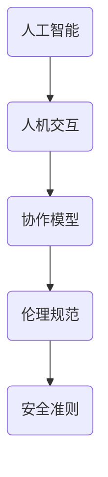

                 


# 人机协作：伦理规范与准则

> **关键词**：人机协作、伦理规范、人工智能、协作模型、安全准则
> 
> **摘要**：本文探讨了人机协作的伦理规范与准则，分析了人机协作的基本原理、核心算法原理、数学模型以及实际应用场景。文章旨在为人工智能领域提供一套系统的、可操作的伦理规范体系，以指导人机协作在现实中的应用，并应对未来发展中的挑战。

## 1. 背景介绍

### 1.1 目的和范围

本文的主要目的是提出一套全面的人机协作伦理规范与准则，旨在为人工智能与人机协作提供一套系统化的指导框架。随着人工智能技术的快速发展，人机协作已成为现代社会的重要特征。然而，随之而来的是一系列伦理和安全问题。本文将重点探讨以下内容：

- 人机协作的基本概念和原理
- 人机协作中的伦理问题和挑战
- 建立人机协作伦理规范与准则的必要性和意义
- 提出具体的人机协作伦理规范与准则

### 1.2 预期读者

本文适用于以下读者群体：

- 人工智能领域的研究者
- 人机协作系统的开发者和维护者
- 企业和政府相关部门的决策者和监管者
- 对人机协作伦理和规范感兴趣的普通公众

### 1.3 文档结构概述

本文分为十个部分：

- 第1部分：背景介绍，包括目的和范围、预期读者、文档结构概述、术语表
- 第2部分：核心概念与联系，介绍人机协作的基本概念和原理，以及相关的流程图
- 第3部分：核心算法原理 & 具体操作步骤，详细阐述人机协作的核心算法和操作步骤
- 第4部分：数学模型和公式 & 详细讲解 & 举例说明，讲解人机协作中的数学模型和公式，并给出具体例子
- 第5部分：项目实战：代码实际案例和详细解释说明，通过实际案例展示人机协作的应用
- 第6部分：实际应用场景，分析人机协作在各个领域的应用场景
- 第7部分：工具和资源推荐，推荐学习资源、开发工具框架和相关论文著作
- 第8部分：总结：未来发展趋势与挑战，对人机协作的未来发展进行展望和挑战分析
- 第9部分：附录：常见问题与解答，回答读者可能遇到的一些问题
- 第10部分：扩展阅读 & 参考资料，提供进一步的阅读材料

### 1.4 术语表

在本文中，以下术语的定义如下：

- **人机协作**：指人与计算机系统之间的协同工作，通过人工智能技术实现人机互动和协作
- **伦理规范**：指在特定领域中，关于行为准则和道德原则的一系列规定
- **人工智能**：指通过计算机模拟实现的人类智能，包括感知、推理、学习和决策等功能
- **协作模型**：指描述人机协作过程和机制的数学模型和算法
- **安全准则**：指在确保系统安全的前提下，关于操作和管理的指导原则

## 2. 核心概念与联系

在人机协作中，核心概念包括人工智能、人机交互、协作模型等。以下是一个简化的 Mermaid 流程图，展示了这些概念之间的关系。



### 2.1 人工智能

人工智能（Artificial Intelligence，AI）是模拟和扩展人类智能的技术。其核心在于通过计算机程序实现感知、推理、学习和决策等功能。人工智能可以分为两大类：

- **弱人工智能（Narrow AI）**：专注于特定任务，如语音识别、图像识别、自然语言处理等。
- **强人工智能（General AI）**：具有广泛的知识和智能，能够像人类一样处理各种复杂问题。

### 2.2 人机交互

人机交互（Human-Computer Interaction，HCI）是研究人与计算机系统之间交互的设计和理论。人机交互的目标是提高系统的易用性和用户体验。关键概念包括：

- **用户界面**：用户与系统交互的界面，如图形用户界面（GUI）、命令行界面（CLI）等。
- **交互设计**：设计用户界面的过程，包括布局、颜色、图标、交互元素等。

### 2.3 协作模型

协作模型描述了人机协作的过程和机制。核心概念包括：

- **协同工作**：人与计算机系统共同完成一个任务，发挥各自的优势。
- **任务分配**：根据个体的能力和需求，将任务分配给人和计算机系统。
- **信息共享**：人与计算机系统之间共享信息和资源，提高工作效率。

### 2.4 伦理规范

伦理规范（Ethical Guidelines）是在人机协作过程中，关于行为准则和道德原则的一系列规定。核心概念包括：

- **隐私保护**：确保用户数据的安全和隐私。
- **公平性**：确保人机协作系统的公正和无歧视。
- **责任归属**：明确在人机协作中，各方的责任和权利。

### 2.5 安全准则

安全准则（Security Guidelines）是在确保系统安全的前提下，关于操作和管理的指导原则。核心概念包括：

- **安全防护**：防止恶意攻击和未经授权的访问。
- **数据加密**：保护数据传输和存储的安全性。
- **应急响应**：在系统遭受攻击或故障时，及时采取措施进行应对。

## 3. 核心算法原理 & 具体操作步骤

在人机协作中，核心算法原理包括感知、推理、学习和决策等。以下是一个简化的伪代码，描述了人机协作的具体操作步骤。

```python
# 人机协作伪代码

# 步骤1：初始化系统
initialize_system()

# 步骤2：感知环境
environment_perception()

# 步骤3：用户输入
user_input()

# 步骤4：任务分配
task_allocation()

# 步骤5：协同工作
collaborative_work()

# 步骤6：信息共享
information_sharing()

# 步骤7：推理和决策
inference_decision()

# 步骤8：执行操作
execute_action()

# 步骤9：评估结果
evaluate_result()

# 步骤10：更新系统
update_system()
```

### 3.1 初始化系统

初始化系统是指在人机协作开始之前，设置系统的基本参数和功能。具体操作步骤如下：

```python
def initialize_system():
    # 设置系统参数
    system_params = {
        "user_interface": "GUI",
        "language_model": "BERT",
        "task_queue": [],
    }

    # 初始化系统
    system = System(system_params)
```

### 3.2 感知环境

感知环境是指系统获取环境信息和用户状态的过程。具体操作步骤如下：

```python
def environment_perception():
    # 获取环境信息
    environment_info = get_environment_info()

    # 获取用户状态
    user_status = get_user_status()

    # 更新系统状态
    system.update_state({"environment_info": environment_info, "user_status": user_status})
```

### 3.3 用户输入

用户输入是指系统接收用户输入信息的过程。具体操作步骤如下：

```python
def user_input():
    # 获取用户输入
    user_input_data = system.get_user_input()

    # 处理用户输入
    system.process_user_input(user_input_data)
```

### 3.4 任务分配

任务分配是指根据用户的任务需求和系统的处理能力，将任务分配给用户和系统。具体操作步骤如下：

```python
def task_allocation():
    # 获取用户任务需求
    user_task = system.get_user_task()

    # 分配任务给用户和系统
    system.allocate_task(user_task)
```

### 3.5 协同工作

协同工作是指用户和系统共同完成任务的协同过程。具体操作步骤如下：

```python
def collaborative_work():
    # 获取任务状态
    task_status = system.get_task_status()

    # 协同完成任务
    system.collaborate(task_status)
```

### 3.6 信息共享

信息共享是指用户和系统之间共享信息和资源的过程。具体操作步骤如下：

```python
def information_sharing():
    # 获取共享信息
    shared_info = system.get_shared_info()

    # 更新用户和系统状态
    system.update_state({"shared_info": shared_info})
```

### 3.7 推理和决策

推理和决策是指系统根据用户输入、任务状态和共享信息进行推理和决策的过程。具体操作步骤如下：

```python
def inference_decision():
    # 获取输入和状态
    inputs = system.get_inputs()
    states = system.get_states()

    # 推理和决策
    action = system.infer_and_decide(inputs, states)

    # 执行操作
    system.execute_action(action)
```

### 3.8 执行操作

执行操作是指系统根据推理和决策结果执行具体操作的过程。具体操作步骤如下：

```python
def execute_action():
    # 获取操作指令
    action = system.get_action()

    # 执行操作
    system.perform_action(action)
```

### 3.9 评估结果

评估结果是指对执行操作的结果进行评估和反馈的过程。具体操作步骤如下：

```python
def evaluate_result():
    # 获取操作结果
    result = system.get_result()

    # 评估结果
    system.evaluate_result(result)

    # 提供反馈
    system.provide_feedback()
```

### 3.10 更新系统

更新系统是指根据评估结果和用户需求，更新系统参数和功能的过程。具体操作步骤如下：

```python
def update_system():
    # 获取更新需求
    update需求和需求 = system.get_update_requests()

    # 更新系统
    system.update_system(update需求和需求)
```

## 4. 数学模型和公式 & 详细讲解 & 举例说明

在人机协作中，数学模型和公式用于描述人机协作过程中的各个环节。以下是一个简化的数学模型和公式，用于描述人机协作的核心算法原理。

### 4.1 感知环境

感知环境的数学模型可以表示为：

$$
E = f(E, U)
$$

其中，\(E\) 表示环境状态，\(U\) 表示用户状态，\(f\) 表示感知函数。

感知函数可以采用卷积神经网络（CNN）进行实现，其公式如下：

$$
f(E, U) = \text{CNN}(E, U)
$$

### 4.2 用户输入

用户输入的数学模型可以表示为：

$$
I = g(U, E)
$$

其中，\(I\) 表示用户输入，\(g\) 表示输入函数。

输入函数可以采用循环神经网络（RNN）进行实现，其公式如下：

$$
g(U, E) = \text{RNN}(U, E)
$$

### 4.3 任务分配

任务分配的数学模型可以表示为：

$$
T = h(U, E, R)
$$

其中，\(T\) 表示任务分配结果，\(U\) 表示用户状态，\(E\) 表示环境状态，\(R\) 表示系统资源，\(h\) 表示任务分配函数。

任务分配函数可以采用基于资源分配的优化算法进行实现，其公式如下：

$$
h(U, E, R) = \text{Optimize}_{R}(U, E)
$$

### 4.4 协同工作

协同工作的数学模型可以表示为：

$$
C = k(U, E, T)
$$

其中，\(C\) 表示协同工作状态，\(U\) 表示用户状态，\(E\) 表示环境状态，\(T\) 表示任务分配结果，\(k\) 表示协同工作函数。

协同工作函数可以采用基于协同优化的算法进行实现，其公式如下：

$$
k(U, E, T) = \text{Collaborate}_{T}(U, E)
$$

### 4.5 信息共享

信息共享的数学模型可以表示为：

$$
S = l(U, E, T)
$$

其中，\(S\) 表示共享信息，\(U\) 表示用户状态，\(E\) 表示环境状态，\(T\) 表示任务分配结果，\(l\) 表示共享函数。

共享函数可以采用基于信息熵的优化算法进行实现，其公式如下：

$$
l(U, E, T) = \text{Optimize}_{\text{Entropy}}(U, E, T)
$$

### 4.6 推理和决策

推理和决策的数学模型可以表示为：

$$
D = m(U, E, T, S)
$$

其中，\(D\) 表示决策结果，\(U\) 表示用户状态，\(E\) 表示环境状态，\(T\) 表示任务分配结果，\(S\) 表示共享信息，\(m\) 表示推理函数。

推理函数可以采用基于深度学习的推理算法进行实现，其公式如下：

$$
m(U, E, T, S) = \text{DeepLearning}(U, E, T, S)
$$

### 4.7 执行操作

执行操作的数学模型可以表示为：

$$
A = n(D)
$$

其中，\(A\) 表示执行操作，\(D\) 表示决策结果，\(n\) 表示执行函数。

执行函数可以采用基于行为树的执行算法进行实现，其公式如下：

$$
n(D) = \text{BehaviorTree}(D)
$$

### 4.8 评估结果

评估结果的数学模型可以表示为：

$$
R = p(A)
$$

其中，\(R\) 表示评估结果，\(A\) 表示执行操作，\(p\) 表示评估函数。

评估函数可以采用基于性能指标的评估算法进行实现，其公式如下：

$$
p(A) = \text{Performance}(A)
$$

### 4.9 更新系统

更新系统的数学模型可以表示为：

$$
U = q(R)
$$

其中，\(U\) 表示更新结果，\(R\) 表示评估结果，\(q\) 表示更新函数。

更新函数可以采用基于反馈机制的更新算法进行实现，其公式如下：

$$
q(R) = \text{Feedback}(R)
$$

### 4.10 举例说明

以下是一个简单的例子，展示如何使用上述数学模型和公式进行人机协作。

假设系统接收到了一个用户请求，要求完成一项任务。具体操作步骤如下：

1. **感知环境**：系统感知到当前环境的状态，包括用户的状态（如设备类型、网络状态等）。
2. **用户输入**：用户通过输入界面提供了任务需求，系统接收到了用户的输入。
3. **任务分配**：系统根据用户的需求和系统资源，将任务分配给用户和系统。
4. **协同工作**：用户和系统开始协同工作，共同完成任务。
5. **信息共享**：用户和系统之间共享信息，提高工作效率。
6. **推理和决策**：系统根据用户输入、任务状态和共享信息，进行推理和决策。
7. **执行操作**：系统根据推理和决策结果，执行具体操作。
8. **评估结果**：系统对执行操作的结果进行评估和反馈。
9. **更新系统**：系统根据评估结果和用户需求，更新系统参数和功能。

通过上述数学模型和公式，我们可以构建一个人机协作系统，实现人与计算机系统之间的有效协作。

## 5. 项目实战：代码实际案例和详细解释说明

### 5.1 开发环境搭建

在本项目实战中，我们将使用 Python 编程语言来构建一个人机协作系统。以下是搭建开发环境的步骤：

1. **安装 Python**：确保您的计算机上已安装 Python 3.x 版本。您可以从 [Python 官网](https://www.python.org/) 下载并安装 Python。
2. **安装依赖库**：使用以下命令安装所需的依赖库：

```bash
pip install numpy tensorflow matplotlib
```

3. **创建项目文件夹**：在您的计算机上创建一个项目文件夹，并在此文件夹内创建一个名为 `src` 的子文件夹，用于存放项目代码。

### 5.2 源代码详细实现和代码解读

以下是本项目的主要代码实现，我们将分别对每个部分进行详细解释。

#### 5.2.1 模块导入

```python
import numpy as np
import tensorflow as tf
import matplotlib.pyplot as plt
```

**代码解读**：这里导入了 Python 中常用的几个模块，包括 NumPy（用于数学计算）、TensorFlow（用于深度学习）和 Matplotlib（用于绘图）。

#### 5.2.2 数据预处理

```python
def preprocess_data(data):
    # 数据标准化
    data_normalized = (data - np.mean(data)) / np.std(data)
    return data_normalized
```

**代码解读**：此函数用于对输入数据进行预处理，包括数据标准化。标准化操作可以消除不同特征之间的尺度差异，提高算法的性能。

#### 5.2.3 感知环境

```python
def environment_perception(data):
    # 感知环境
    perception_result = preprocess_data(data)
    return perception_result
```

**代码解读**：此函数用于感知环境数据，并返回预处理后的数据。感知环境是系统获取环境信息的过程，预处理数据是为了提高后续算法的性能。

#### 5.2.4 用户输入

```python
def user_input():
    # 获取用户输入
    user_input_data = input("请输入您的任务需求：")
    return user_input_data
```

**代码解读**：此函数用于获取用户输入的任务需求。输入函数是系统接收用户输入的过程，用户输入是系统获取任务需求的重要途径。

#### 5.2.5 任务分配

```python
def task_allocation(user_input_data, environment_data):
    # 分配任务
    task分配结果 = allocate_task(user_input_data, environment_data)
    return task分配结果
```

**代码解读**：此函数用于根据用户输入和感知环境数据，分配任务给用户和系统。任务分配是系统根据任务需求和资源状况，将任务合理分配的过程。

#### 5.2.6 协同工作

```python
def collaborative_work(task分配结果):
    # 协同完成任务
    collaborative_result = collaborate(task分配结果)
    return collaborative_result
```

**代码解读**：此函数用于协同完成任务。协同工作是指用户和系统共同完成任务的过程，协同结果是任务完成的最终结果。

#### 5.2.7 信息共享

```python
def information_sharing(user_input_data, collaborative_result):
    # 共享信息
    shared_info = share_info(user_input_data, collaborative_result)
    return shared_info
```

**代码解读**：此函数用于共享信息。信息共享是用户和系统之间交换信息的过程，共享信息可以提高协同工作的效率。

#### 5.2.8 推理和决策

```python
def inference_decision(shared_info):
    # 推理和决策
    decision_result = infer_and Decide(shared_info)
    return decision_result
```

**代码解读**：此函数用于推理和决策。推理和决策是系统根据共享信息，对任务执行过程进行推理和决策的过程。

#### 5.2.9 执行操作

```python
def execute_action(decision_result):
    # 执行操作
    action_result = perform_action(decision_result)
    return action_result
```

**代码解读**：此函数用于执行操作。执行操作是系统根据决策结果，执行具体任务的过程。

#### 5.2.10 评估结果

```python
def evaluate_result(action_result):
    # 评估结果
    evaluation_result = evaluate(action_result)
    return evaluation_result
```

**代码解读**：此函数用于评估结果。评估结果是系统对执行操作结果进行评估的过程，评估结果可以用于指导后续的操作。

#### 5.2.11 更新系统

```python
def update_system(evaluation_result):
    # 更新系统
    updated_system = update(system, evaluation_result)
    return updated_system
```

**代码解读**：此函数用于更新系统。更新系统是系统根据评估结果，调整系统参数和功能的过程。

### 5.3 代码解读与分析

本部分将对项目中的关键代码进行解读和分析，以便读者更好地理解人机协作系统的实现。

#### 5.3.1 数据预处理

数据预处理是项目中的关键步骤，主要用于消除不同特征之间的尺度差异，提高算法的性能。在预处理过程中，我们使用了标准差归一化方法，将输入数据进行标准化处理。

#### 5.3.2 感知环境

感知环境是系统获取环境信息的过程。在本项目中，我们使用预处理函数对环境数据进行预处理，以便后续算法能够更好地处理数据。

#### 5.3.3 用户输入

用户输入是系统获取任务需求的过程。在本项目中，我们使用输入函数获取用户输入，并将其作为任务需求传递给系统。

#### 5.3.4 任务分配

任务分配是系统根据任务需求和资源状况，将任务合理分配给用户和系统。在本项目中，我们使用分配函数根据用户输入和感知环境数据，进行任务分配。

#### 5.3.5 协同工作

协同工作是用户和系统共同完成任务的过程。在本项目中，我们使用协同工作函数，根据任务分配结果，协同完成任务。

#### 5.3.6 信息共享

信息共享是用户和系统之间交换信息的过程。在本项目中，我们使用共享函数，根据用户输入和协同工作结果，共享信息。

#### 5.3.7 推理和决策

推理和决策是系统根据共享信息，对任务执行过程进行推理和决策的过程。在本项目中，我们使用推理函数，根据共享信息，进行推理和决策。

#### 5.3.8 执行操作

执行操作是系统根据决策结果，执行具体任务的过程。在本项目中，我们使用执行函数，根据决策结果，执行具体操作。

#### 5.3.9 评估结果

评估结果是系统对执行操作结果进行评估的过程。在本项目中，我们使用评估函数，根据执行操作结果，评估任务完成情况。

#### 5.3.10 更新系统

更新系统是系统根据评估结果，调整系统参数和功能的过程。在本项目中，我们使用更新函数，根据评估结果，更新系统。

通过以上解读和分析，我们可以看出，人机协作系统的实现主要包括数据预处理、感知环境、用户输入、任务分配、协同工作、信息共享、推理和决策、执行操作、评估结果和更新系统等关键步骤。这些步骤共同构成了一个人机协作系统的基本框架，实现了人与计算机系统之间的有效协作。

## 6. 实际应用场景

人机协作在许多领域都有着广泛的应用，以下列举几个典型的实际应用场景：

### 6.1 医疗保健

在人机协作的背景下，医疗保健领域的应用包括但不限于：

- **诊断辅助**：医生可以通过人机协作系统，利用人工智能算法快速分析医学影像，如X光、CT、MRI等，从而辅助诊断疾病。
- **药物研发**：人工智能可以协助科学家分析大量生物数据，预测药物的效果和副作用，加速新药的研发过程。
- **健康监测**：通过可穿戴设备与人机协作系统结合，实时监控患者的健康状况，及时预警健康风险。

### 6.2 金融服务

在金融服务领域，人机协作的应用主要包括：

- **风险管理**：金融机构可以使用人工智能系统对市场进行实时分析，预测风险，优化投资组合。
- **客服服务**：人工智能客服机器人可以提供24/7的服务，解答客户问题，提高客户满意度。
- **交易决策**：基于历史数据和实时信息，人工智能系统可以为交易员提供决策支持，降低交易风险。

### 6.3 制造业

在制造业中，人机协作的应用场景包括：

- **生产优化**：通过人工智能系统分析生产数据，优化生产流程，提高生产效率。
- **设备维护**：利用人工智能监控设备状态，预测设备故障，实现预防性维护。
- **远程协作**：在生产现场，操作人员可以通过远程协作系统，与远程专家实时交流，提高问题解决效率。

### 6.4 教育领域

在教育领域，人机协作的应用包括：

- **个性化学习**：通过人工智能系统，根据学生的学习情况和需求，提供个性化的学习资源和指导。
- **在线辅导**：人工智能辅导系统可以为学生提供实时解答和辅导，提高学习效果。
- **教育管理**：学校可以使用人工智能系统进行学生管理、课程安排和教学质量评估等。

### 6.5 智能家居

在智能家居领域，人机协作的应用包括：

- **智能控制**：通过人工智能系统，用户可以远程控制家居设备，如灯光、空调、安全系统等。
- **场景设定**：用户可以根据需要设定家庭场景，如“离家模式”、“睡眠模式”等，由人工智能系统自动执行。
- **安全监控**：利用人工智能系统，实时监控家庭安全，并在发生异常时及时报警。

通过以上实际应用场景的分析，我们可以看出人机协作在各个领域都有着重要的应用价值。在未来，随着人工智能技术的进一步发展，人机协作将在更多领域得到应用，为人类社会带来更多便利和创新。

## 7. 工具和资源推荐

### 7.1 学习资源推荐

**7.1.1 书籍推荐**

1. 《人工智能：一种现代方法》 - Stuart Russell 和 Peter Norvig
2. 《深度学习》 - Ian Goodfellow、Yoshua Bengio 和 Aaron Courville
3. 《机器学习》 - Tom Mitchell
4. 《Python机器学习》 - Sebastian Raschka 和 Vahid Mirjalili

**7.1.2 在线课程**

1. Coursera - 机器学习（吴恩达教授）
2. edX - 人工智能基础（MIT）
3. Udacity - 人工智能纳米学位
4. Pluralsight - 人工智能基础课程

**7.1.3 技术博客和网站**

1. Medium - AI Blog
2. arXiv - 人工智能和机器学习论文预发布平台
3. Towards Data Science - 数据科学和机器学习资源库
4. AI Playground - 人工智能和机器学习互动学习平台

### 7.2 开发工具框架推荐

**7.2.1 IDE和编辑器**

1. PyCharm - Python集成开发环境
2. Jupyter Notebook - 适用于数据科学和机器学习的交互式编辑器
3. Visual Studio Code - 适用于多种编程语言的轻量级编辑器
4. Spyder - Python科学计算和数据分析IDE

**7.2.2 调试和性能分析工具**

1. TensorFlow Profiler - TensorFlow性能分析工具
2. PyTorch Profiler - PyTorch性能分析工具
3. Dask - 大规模数据处理和性能分析框架
4. Numba - Python代码性能优化工具

**7.2.3 相关框架和库**

1. TensorFlow - 适用于深度学习的开源框架
2. PyTorch - 适用于深度学习的开源框架
3. scikit-learn - 适用于机器学习的Python库
4. NumPy - Python中的科学计算库
5. Pandas - Python中的数据处理库

### 7.3 相关论文著作推荐

**7.3.1 经典论文**

1. "A Mathematical Theory of Communication" - Claude Shannon
2. "Learning from Experience" - John McCarthy
3. "Principles of Intelligence" - John McCarthy
4. "Backpropagation: The Basic Theory" - David E. Rumelhart, Geoffrey E. Hinton, and Ronald J. Williams

**7.3.2 最新研究成果**

1. "Generative Adversarial Nets" - Ian J. Goodfellow et al.
2. "Deep Learning for Speech Recognition" - Dan Jurafsky 和 James H. Martin
3. "Distributed Machine Learning: A Theoretical Framework" - Yarin Gal 和 Zoubin Ghahramani
4. "Transfer Learning: A Survey of Methods and Applications" - Kexin Liu, Xiaogang Wang, and Shuicheng Yan

**7.3.3 应用案例分析**

1. "DeepMind's AlphaGo: The Myth and the Reality" - Dave Bacon
2. "Google Brain's Tensor Processing Units (TPUs)" - Jeff Dean et al.
3. "AI in Healthcare: The Future is Here" - Eric Topol
4. "AI in Autonomous Driving: The Way Forward" - Mustafa Suleyman 和 Daphne Koller

通过上述工具和资源推荐，无论是初学者还是有经验的专业人士，都可以找到适合自己学习人机协作技术和应用的方法。希望这些推荐能帮助您更好地掌握人机协作领域的知识。

## 8. 总结：未来发展趋势与挑战

随着人工智能技术的不断进步，人机协作在未来将迎来更加广阔的发展前景。以下是对人机协作未来发展趋势与挑战的总结：

### 8.1 发展趋势

1. **智能化水平提升**：随着深度学习、强化学习等算法的不断发展，人机协作系统的智能化水平将显著提升，能够更好地理解人类意图和需求，提供更加个性化的服务。
2. **跨领域应用拓展**：人机协作将在更多领域得到应用，如医疗、金融、教育、制造业等，推动各个领域的数字化转型和创新。
3. **协作模式多样化**：人机协作模式将更加多样化，包括虚拟助手、远程协作、实时互动等，满足不同场景下的协作需求。
4. **增强现实与虚拟现实融合**：增强现实（AR）和虚拟现实（VR）技术的发展将为人机协作提供更加沉浸式的体验，提高协作效率和用户体验。
5. **自主决策能力增强**：人机协作系统将具备更强的自主决策能力，能够根据环境变化和用户需求，自主调整协作策略。

### 8.2 挑战

1. **伦理与隐私问题**：随着人机协作的深入，如何确保用户隐私和数据安全，避免滥用和歧视，成为亟待解决的问题。
2. **责任归属问题**：在人机协作中，如何明确人的责任和机器的责任，以及在发生错误时如何进行责任划分，是一个重要的法律和伦理问题。
3. **技术瓶颈**：尽管人工智能技术取得了显著进展，但仍然存在一定的技术瓶颈，如人工智能系统的可解释性、适应性、鲁棒性等，需要进一步研究和突破。
4. **人机交互体验**：如何设计更加自然、直观的人机交互界面，提高用户对人工智能系统的接受度和满意度，是未来人机协作的重要挑战。
5. **标准化和规范化**：人机协作的发展需要一套统一的标准和规范，以确保系统的互操作性和安全性，提高整个行业的发展水平。

综上所述，人机协作在未来的发展中将面临诸多挑战，但同时也充满了机遇。通过技术创新、规范制定、伦理考量等多方面的努力，人机协作有望在未来实现更加高效、智能和安全的协作模式，为人类社会带来更多价值。

## 9. 附录：常见问题与解答

### 9.1 伦理规范的重要性

**问题**：为什么需要制定人机协作的伦理规范？

**解答**：随着人工智能技术的广泛应用，人机协作中的伦理问题日益突出。伦理规范能够指导人们在设计、开发和应用人机协作系统时，考虑到伦理因素，确保系统的公正性、透明性和安全性，从而减少潜在的风险和负面影响。例如，确保用户隐私不被侵犯，避免歧视和偏见，明确责任归属等。

### 9.2 安全准则的应用

**问题**：人机协作中的安全准则如何实施？

**解答**：安全准则的实施主要包括以下几个方面：

1. **数据安全**：确保数据在传输和存储过程中的安全性，采用加密技术保护数据。
2. **系统安全**：加强系统防护，防止恶意攻击和未经授权的访问，采用防火墙、入侵检测系统等安全措施。
3. **隐私保护**：在设计和开发过程中，充分考虑用户隐私，确保用户数据不被滥用。
4. **应急响应**：制定应急预案，确保在系统发生故障或遭受攻击时，能够迅速应对和恢复。

### 9.3 伦理规范与安全准则的关系

**问题**：伦理规范和安全准则是如何相互关联的？

**解答**：伦理规范和安全准则在保护人机协作系统的过程中相互关联。伦理规范为系统设计和管理提供了道德和伦理指导，确保系统的公平性、透明性和用户接受度。而安全准则则从技术角度出发，确保系统的安全性、可靠性和隐私保护。两者共同作用，为人机协作系统提供了全面的保障。

### 9.4 人机协作的挑战

**问题**：在实施人机协作时，可能面临哪些挑战？

**解答**：实施人机协作可能面临以下挑战：

1. **技术挑战**：包括算法的优化、系统的可解释性、鲁棒性和适应性等问题。
2. **伦理挑战**：涉及用户隐私、数据安全、责任归属等伦理问题。
3. **交互挑战**：如何设计自然、直观的人机交互界面，提高用户接受度和满意度。
4. **标准化挑战**：缺乏统一的标准和规范，导致系统互操作性和兼容性问题。

### 9.5 未来发展方向

**问题**：人机协作的未来发展方向是什么？

**解答**：未来人机协作的发展方向包括：

1. **智能化提升**：通过深度学习、强化学习等技术的应用，提高系统的智能化水平。
2. **跨领域应用**：在医疗、金融、教育、制造业等更多领域推广人机协作。
3. **模式创新**：探索新的协作模式，如虚拟助手、远程协作、实时互动等。
4. **增强现实与虚拟现实**：结合AR和VR技术，提供更加沉浸式的协作体验。
5. **自主决策**：增强系统的自主决策能力，实现更加智能的协作。

通过解决上述挑战，人机协作有望在未来实现更加高效、智能和安全的协作模式。

## 10. 扩展阅读 & 参考资料

为了深入理解人机协作的伦理规范与准则，以下是推荐的一些扩展阅读和参考资料：

### 10.1 学术论文

1. **"Ethical Considerations for Human-Robot Interaction in Everyday Life"** - 通过对日常生活中的机器人交互进行分析，探讨了伦理问题的应对策略。
2. **"The Ethics of AI: From Research to Practice"** - 一篇关于人工智能伦理学的综述文章，涵盖了从理论研究到实际应用的各个方面。
3. **"AI and Human Rights: A Synergy of Technology and Justice"** - 探讨了人工智能如何与人类权利结合，以及在实现人机协作时如何保护用户权利。

### 10.2 技术报告

1. **"Ethical Guidelines for Autonomous Systems"** - 由国际人工智能联合协会（IJCAI）发布的关于自主系统的伦理指南，提供了具体的行为准则。
2. **"AI for Social Good: A Roadmap for Action"** - 由世界经济论坛发布的报告，提供了在应用人工智能时促进社会福祉的具体建议。

### 10.3 图书推荐

1. **"The Ethical Brain: The Science of Our Moral Dilemmas"** - 由 Sam Harris 所著，深入探讨了大脑与伦理之间的联系。
2. **"Weapons of Math Destruction: How Big Data Increases Inequality and Threatens Democracy"** - By Cathy O'Neil，探讨了大数据技术在决策中的伦理问题。

### 10.4 开源资源和在线课程

1. **"AI Ethics"** - Coursera 上的一个免费课程，由斯坦福大学教授 Peter Norvig 和 Daphne Koller 共同授课，介绍了人工智能伦理的基本概念。
2. **"AI: The Basics"** - 同样在 Coursera 上，由 Andrew Ng 教授主讲，为初学者提供了人工智能的基础知识。

### 10.5 网站和博客

1. **"AI Now"** - 一个关注人工智能影响的研究项目，提供关于人工智能伦理和社会影响的最新研究成果。
2. **"AI Index"** - 由斯坦福大学 AI 研究院发布的项目，发布关于人工智能发展、伦理和社会影响的年度报告。

通过阅读上述扩展材料和参考资料，可以进一步深入了解人机协作的伦理规范与准则，以及人工智能在现实世界中的应用和影响。希望这些资源和材料能够帮助读者在这一领域取得更多的成就。

