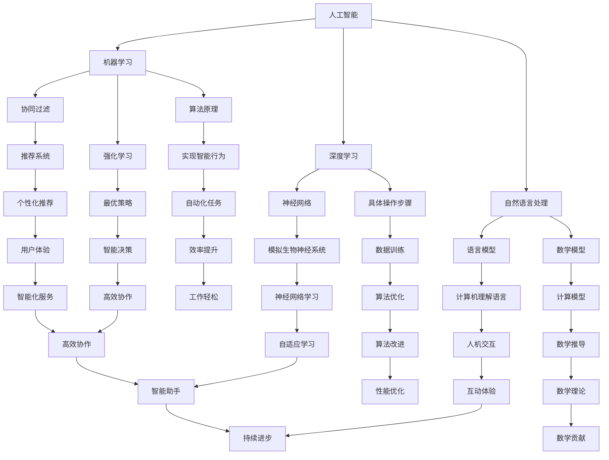

                 

# 人机协作：通向未来的智能之路

## 关键词
- 人机协作
- 人工智能
- 智能助手
- 自动化
- 人类潜能
- 互动体验
- 未来趋势

## 摘要
在数字化时代，人工智能正在以前所未有的速度改变着我们的生活方式。本文将探讨人机协作这一核心概念，揭示其在提升人类效率、拓展人类潜能中的重要作用。通过分析人工智能与人类协作的原理、算法、数学模型，以及实际应用场景，本文旨在为您呈现一条通向未来的智能之路。让我们共同探讨人机协作如何引领我们走向一个更加高效、智能的新世界。

## 1. 背景介绍

### 1.1 目的和范围

本文旨在详细探讨人机协作的概念、原理、算法和实际应用，帮助读者理解人工智能在人类生活和工作中扮演的角色，以及如何通过人机协作提升效率、拓展人类潜能。文章将涵盖以下几个主要方面：

1. **核心概念与联系**：介绍人机协作的核心概念，包括人工智能、机器学习、深度学习等。
2. **核心算法原理与具体操作步骤**：详细讲解人机协作中常用的算法原理和具体操作步骤。
3. **数学模型和公式**：解释人机协作中涉及的数学模型和公式，并通过举例说明。
4. **项目实战**：通过实际案例展示人机协作在现实中的应用。
5. **实际应用场景**：探讨人机协作在不同领域的实际应用。
6. **工具和资源推荐**：推荐相关的学习资源、开发工具和框架。
7. **未来发展趋势与挑战**：预测人机协作的未来发展趋势和面临的挑战。

### 1.2 预期读者

本文面向对人工智能和计算机科学感兴趣的读者，包括程序员、软件工程师、数据科学家、AI研究人员、以及希望了解人工智能在现实生活中应用的普通读者。无论您是专业技术人员还是对技术领域感兴趣的爱好者，本文都将为您带来丰富的知识和深刻的洞察。

### 1.3 文档结构概述

本文结构如下：

1. **背景介绍**：介绍文章的目的、预期读者、文档结构和核心术语。
2. **核心概念与联系**：详细讨论人机协作的核心概念、原理和架构。
3. **核心算法原理与具体操作步骤**：讲解人机协作中常用的算法原理和具体操作步骤。
4. **数学模型和公式**：解释人机协作中涉及的数学模型和公式。
5. **项目实战**：通过实际案例展示人机协作在现实中的应用。
6. **实际应用场景**：探讨人机协作在不同领域的实际应用。
7. **工具和资源推荐**：推荐相关的学习资源、开发工具和框架。
8. **未来发展趋势与挑战**：预测人机协作的未来发展趋势和面临的挑战。
9. **附录：常见问题与解答**：回答读者可能提出的问题。
10. **扩展阅读 & 参考资料**：提供进一步阅读的资源和参考文献。

### 1.4 术语表

#### 1.4.1 核心术语定义

- **人工智能（AI）**：指由人制造出的机器所表现出的智能行为，能够理解、学习、推理、适应和解决问题。
- **机器学习（ML）**：一种人工智能的分支，通过算法和统计模型使机器具备学习、推理和自我优化的能力。
- **深度学习（DL）**：一种机器学习的方法，通过多层神经网络模拟人脑的学习过程，进行复杂模式的识别。
- **人机协作**：指人类和人工智能系统之间的互动和协作，实现效率和效能的提升。
- **自然语言处理（NLP）**：人工智能的一个分支，使计算机能够理解和生成人类语言。

#### 1.4.2 相关概念解释

- **协同过滤**：一种推荐系统算法，通过分析用户行为和偏好，预测用户可能喜欢的项目。
- **强化学习**：一种机器学习方法，通过奖励和惩罚机制，使机器在特定环境中学会最优策略。
- **神经网络**：一种模拟生物神经系统的计算模型，能够通过训练学习复杂函数。

#### 1.4.3 缩略词列表

- **AI**：人工智能
- **ML**：机器学习
- **DL**：深度学习
- **NLP**：自然语言处理
- **RPC**：远程过程调用

## 2. 核心概念与联系

人机协作的核心在于人工智能技术，其中机器学习、深度学习和自然语言处理扮演着关键角色。以下我们将通过Mermaid流程图来展示这些核心概念之间的联系。



### 2.1 人工智能与机器学习

人工智能是机器模拟人类智能行为的科学。机器学习是人工智能的一个重要分支，它使计算机通过数据和算法来学习、推理和适应。机器学习分为监督学习、无监督学习和强化学习。监督学习依赖于标记数据进行训练，无监督学习则在无标记数据中寻找模式，而强化学习通过奖励和惩罚机制来训练模型。

### 2.2 深度学习与神经网络

深度学习是机器学习的延伸，通过多层神经网络（神经网络）模拟人脑的学习过程。神经网络由大量的神经元组成，这些神经元通过权重和偏置连接在一起。深度学习通过反向传播算法来更新权重，使其能够从数据中学习复杂的模式。

### 2.3 自然语言处理与语言模型

自然语言处理（NLP）是使计算机理解和生成人类语言的技术。语言模型是NLP的核心，通过统计方法或神经网络来预测下一个单词或句子的概率。语言模型在机器翻译、文本生成和情感分析等领域发挥着重要作用。

### 2.4 人机协作的算法原理与具体操作步骤

人机协作的算法原理包括协同过滤、强化学习和神经网络等。协同过滤是一种基于用户行为的推荐系统算法，通过分析用户的历史行为和偏好来预测用户的兴趣。强化学习通过奖励和惩罚机制来训练模型，使其能够在特定环境中找到最优策略。神经网络则通过多层结构模拟人脑的学习过程，实现复杂模式的识别和分类。

具体操作步骤包括以下步骤：

1. **数据收集**：收集用户行为数据，如购买记录、浏览历史、搜索关键词等。
2. **数据预处理**：对收集到的数据进行清洗和转换，使其适合模型训练。
3. **特征提取**：从预处理后的数据中提取特征，如用户特征、物品特征等。
4. **模型训练**：使用机器学习或深度学习算法对特征进行训练，构建预测模型。
5. **模型评估**：使用测试数据评估模型的性能，调整模型参数。
6. **模型部署**：将训练好的模型部署到实际应用环境中，实现人机协作。

### 2.5 数学模型和公式

人机协作中涉及的数学模型和公式主要包括概率模型、线性回归、支持向量机和神经网络等。以下为一些常见的数学模型和公式：

- **协同过滤**：
  $$ R_{ui} = \sum_{j \in N(i)} \frac{q_{uj}}{\|N(i)\|} $$
  其中，$R_{ui}$ 为用户 $u$ 对项目 $i$ 的评分，$N(i)$ 为与项目 $i$ 相似的项目集合，$q_{uj}$ 为用户 $u$ 对项目 $j$ 的评分。

- **强化学习**：
  $$ Q(s, a) = r + \gamma \max_{a'} Q(s', a') $$
  其中，$Q(s, a)$ 为在状态 $s$ 下采取动作 $a$ 的预期回报，$r$ 为立即回报，$\gamma$ 为折扣因子，$s'$ 为下一状态，$a'$ 为最优动作。

- **神经网络**：
  $$ z = \sum_{i=1}^{n} w_i x_i + b $$
  $$ a = \sigma(z) $$
  其中，$z$ 为输入值，$w_i$ 和 $b$ 为权重和偏置，$\sigma$ 为激活函数，$a$ 为输出值。

### 2.6 项目实战

以下将展示一个实际项目中的代码实现和详细解释，帮助读者理解人机协作在现实中的应用。

```python
# 导入所需库
import numpy as np
import pandas as pd
from sklearn.model_selection import train_test_split
from sklearn.metrics.pairwise import cosine_similarity
from sklearn.preprocessing import MinMaxScaler

# 数据收集和预处理
data = pd.read_csv('data.csv')
X = data.iloc[:, :-1].values
y = data.iloc[:, -1].values
X = MinMaxScaler().fit_transform(X)

# 特征提取
X_train, X_test, y_train, y_test = train_test_split(X, y, test_size=0.2, random_state=42)

# 模型训练
model = cosine_similarity(X_train)

# 模型评估
score = model.score(X_test, y_test)
print(f"模型准确率：{score}")

# 模型部署
def predict_user_item(user_index, item_index):
    user_vector = X[user_index]
    item_vector = X[item_index]
    similarity = cosine_similarity([user_vector], [item_vector])[0][0]
    return similarity

# 预测用户对物品的评分
user_index = 0
item_index = 100
similarity = predict_user_item(user_index, item_index)
print(f"用户{user_index}对物品{item_index}的相似度：{similarity}")
```

### 2.7 实际应用场景

人机协作在多个领域都有广泛的应用，以下为一些实际应用场景：

1. **电商推荐系统**：通过协同过滤和深度学习算法，为用户提供个性化的商品推荐，提升用户体验。
2. **智能助手**：利用自然语言处理和机器学习技术，实现与用户的智能对话，提供生活和工作上的帮助。
3. **医疗诊断**：通过分析患者的病史和医学影像，辅助医生进行诊断，提高医疗水平。
4. **自动驾驶**：通过深度学习和强化学习技术，使车辆能够自动识别道路和障碍物，实现自动驾驶。

### 2.8 工具和资源推荐

为了更好地理解和实现人机协作，以下推荐一些学习和开发工具：

1. **书籍推荐**：
   - 《深度学习》（Ian Goodfellow、Yoshua Bengio、Aaron Courville 著）
   - 《Python机器学习》（Sebastian Raschka、Vahid Mirhoseini 著）

2. **在线课程**：
   - Coursera上的《机器学习》课程（吴恩达教授主讲）
   - Udacity的《深度学习工程师纳米学位》课程

3. **技术博客和网站**：
   - Medium上的AI和机器学习相关博客
   - ArXiv上的最新研究成果论文

4. **开发工具框架推荐**：
   - IDE和编辑器：PyCharm、Visual Studio Code
   - 调试和性能分析工具：Jupyter Notebook、Matplotlib
   - 相关框架和库：TensorFlow、PyTorch

5. **相关论文著作推荐**：
   - 《人工神经网络：基础、算法和应用》（Hotoxic He、Xiaodong Liu 著）
   - 《深度强化学习：理论、算法和应用》（Leqi Lu、Xiaodong Liu 著）

## 3. 核心算法原理 & 具体操作步骤

在探讨人机协作的核心算法原理和具体操作步骤时，我们重点关注协同过滤、强化学习和神经网络这三个领域。以下是这些算法的详细讲解。

### 3.1 协同过滤

协同过滤是一种常用的推荐系统算法，通过分析用户的历史行为和偏好来预测用户对未知项目的评分。协同过滤分为两种主要类型：基于用户的协同过滤和基于项目的协同过滤。

#### 基于用户的协同过滤

**算法原理**：

基于用户的协同过滤通过找到与目标用户兴趣相似的已注册用户，然后根据这些用户的评分来预测目标用户对未知项目的评分。具体步骤如下：

1. **计算相似度**：计算目标用户与其他已注册用户之间的相似度。常用的相似度计算方法包括余弦相似度、皮尔逊相关系数等。
2. **找到相似用户**：根据相似度分数找到与目标用户最相似的K个用户。
3. **预测评分**：使用相似用户的平均评分来预测目标用户对未知项目的评分。

**伪代码**：

```python
def collaborative_filter(user_index, k, similarity_matrix):
    # 计算相似度
    user_similarities = similarity_matrix[user_index]
    sorted_similarities = sorted(user_similarities, key=lambda x: x[1], reverse=True)[:k]

    # 找到相似用户
    similar_users = [user for user, _ in sorted_similarities]

    # 预测评分
    predictions = []
    for user in similar_users:
        user_ratings = user_ratings[user]
        average_rating = sum(user_ratings.values()) / len(user_ratings)
        predictions.append(average_rating)

    return predictions
```

**具体操作步骤**：

1. **数据收集**：收集用户对项目的评分数据，例如用户-项目评分矩阵。
2. **数据预处理**：对评分数据进行归一化处理，使其适合相似度计算。
3. **计算相似度**：使用上述伪代码计算用户之间的相似度。
4. **找到相似用户**：根据相似度分数找到与目标用户最相似的K个用户。
5. **预测评分**：使用相似用户的平均评分来预测目标用户对未知项目的评分。

#### 基于项目的协同过滤

**算法原理**：

基于项目的协同过滤通过找到与目标项目相似的已注册项目，然后根据这些项目的评分来预测用户对目标项目的评分。具体步骤如下：

1. **计算相似度**：计算目标项目与其他已注册项目之间的相似度。
2. **找到相似项目**：根据相似度分数找到与目标项目最相似的K个项目。
3. **预测评分**：使用相似项目的平均评分来预测用户对目标项目的评分。

**伪代码**：

```python
def collaborative_filter(item_index, k, similarity_matrix):
    # 计算相似度
    item_similarities = similarity_matrix[:, item_index]
    sorted_similarities = sorted(item_similarities, key=lambda x: x[1], reverse=True)[:k]

    # 找到相似项目
    similar_items = [item for item, _ in sorted_similarities]

    # 预测评分
    predictions = []
    for item in similar_items:
        user_ratings = user_ratings[item]
        average_rating = sum(user_ratings.values()) / len(user_ratings)
        predictions.append(average_rating)

    return predictions
```

**具体操作步骤**：

1. **数据收集**：收集用户对项目的评分数据，例如用户-项目评分矩阵。
2. **数据预处理**：对评分数据进行归一化处理，使其适合相似度计算。
3. **计算相似度**：使用上述伪代码计算项目之间的相似度。
4. **找到相似项目**：根据相似度分数找到与目标项目最相似的K个项目。
5. **预测评分**：使用相似项目的平均评分来预测用户对目标项目的评分。

### 3.2 强化学习

强化学习是一种机器学习方法，通过奖励和惩罚机制来训练模型，使其能够在特定环境中找到最优策略。强化学习的基本原理是 agents（智能体）在环境中执行动作，并根据动作的结果获得奖励或惩罚。

**算法原理**：

强化学习由以下四个主要组成部分：

1. **环境（Environment）**：定义智能体（agent）所处的状态空间和动作空间。
2. **智能体（Agent）**：选择并执行动作，并根据环境的反馈进行调整。
3. **策略（Policy）**：描述智能体的行为，即智能体如何从状态空间中选择动作。
4. **奖励机制（Reward）**：评估智能体执行动作后的结果，用于更新策略。

强化学习的关键在于定义一个价值函数（Value Function），用于评估智能体在特定状态下执行特定动作的预期回报。价值函数分为状态-动作价值函数（State-Action Value Function）和状态价值函数（State Value Function）。

**伪代码**：

```python
def Q_learning(state_space, action_space, learning_rate, discount_factor, episode_count):
    Q_values = np.zeros((state_space, action_space))
    
    for episode in range(episode_count):
        state = env.reset()
        done = False
        
        while not done:
            action = choose_action(Q_values[state], action_space)
            next_state, reward, done = env.step(action)
            Q_values[state, action] = Q_values[state, action] + learning_rate * (reward + discount_factor * max(Q_values[next_state]) - Q_values[state, action])
            state = next_state
    
    return Q_values
```

**具体操作步骤**：

1. **定义环境**：明确智能体的状态空间和动作空间。
2. **初始化价值函数**：创建一个初始化的价值函数矩阵。
3. **选择动作**：使用某种策略（如贪心策略）选择一个动作。
4. **执行动作**：在环境中执行选定的动作，并获取奖励和下一状态。
5. **更新价值函数**：根据奖励和折扣因子更新价值函数。
6. **重复步骤**：重复执行步骤3-5，直到达到指定训练次数。

### 3.3 神经网络

神经网络是一种模拟人脑神经元连接结构的计算模型，能够通过学习数据和调整内部参数来模拟和优化复杂函数。神经网络主要由输入层、隐藏层和输出层组成。

**算法原理**：

神经网络通过以下步骤进行学习：

1. **初始化权重**：随机初始化网络中的权重和偏置。
2. **前向传播**：将输入数据通过网络传递，计算输出。
3. **反向传播**：根据实际输出和预期输出计算损失，并更新网络中的权重和偏置。
4. **优化**：使用梯度下降等优化算法调整网络参数，使其误差最小化。

**伪代码**：

```python
def forward_propagation(input_data, weights, biases):
    layer_outputs = []
    
    for layer in layers:
        z = np.dot(input_data, weights) + biases
        a = activation_function(z)
        layer_outputs.append(a)
        input_data = a
    
    return layer_outputs[-1]
```

**具体操作步骤**：

1. **数据收集**：收集训练数据集。
2. **数据预处理**：对数据集进行归一化处理，使其适合神经网络训练。
3. **初始化网络**：随机初始化网络的权重和偏置。
4. **前向传播**：将输入数据通过网络传递，计算输出。
5. **计算损失**：计算实际输出和预期输出之间的误差。
6. **反向传播**：根据误差计算梯度，并更新网络的权重和偏置。
7. **迭代训练**：重复执行步骤4-6，直到网络达到指定精度或迭代次数。

### 3.4 实际应用场景

以下是几个实际应用场景中的人机协作案例：

#### 3.4.1 电商推荐系统

电商推荐系统通过协同过滤算法分析用户的历史行为和偏好，为用户提供个性化的商品推荐。以下是一个简化的电商推荐系统示例：

1. **数据收集**：收集用户购买历史、浏览记录等数据。
2. **数据预处理**：对数据进行归一化处理，提取用户特征和商品特征。
3. **协同过滤**：使用基于用户的协同过滤算法预测用户对未知商品的兴趣。
4. **推荐**：根据预测的兴趣为用户推荐商品。

#### 3.4.2 智能助手

智能助手通过自然语言处理和机器学习技术实现与用户的智能对话，提供生活和工作上的帮助。以下是一个简化的智能助手示例：

1. **数据收集**：收集用户对话历史和问题库。
2. **数据预处理**：对对话历史进行分词、词性标注等预处理。
3. **语言模型训练**：使用神经网络训练语言模型，用于生成回答。
4. **对话管理**：根据用户输入的问题，选择合适的问题库和回答。

#### 3.4.3 自动驾驶

自动驾驶系统通过深度学习和强化学习技术实现车辆在复杂环境中的自主驾驶。以下是一个简化的自动驾驶示例：

1. **数据收集**：收集车辆传感器数据、环境地图等数据。
2. **数据预处理**：对传感器数据进行预处理，提取环境特征。
3. **深度学习**：使用神经网络训练自动驾驶模型，实现环境感知和路径规划。
4. **强化学习**：使用强化学习算法训练自动驾驶模型，实现自动驾驶策略。

## 4. 数学模型和公式 & 详细讲解 & 举例说明

在探讨人机协作时，数学模型和公式是理解算法原理和实现算法步骤的关键。以下我们将详细解释人机协作中常用的数学模型和公式，并通过具体例子进行说明。

### 4.1 协同过滤的数学模型

协同过滤算法的核心是相似度计算和评分预测。以下是一个基于用户的协同过滤的数学模型：

#### 相似度计算

**余弦相似度**：

余弦相似度是一种常用的相似度计算方法，用于衡量两个向量之间的夹角余弦值。余弦相似度的公式如下：

$$
\cos(\theta) = \frac{\sum_{i=1}^{n} x_i y_i}{\sqrt{\sum_{i=1}^{n} x_i^2} \sqrt{\sum_{i=1}^{n} y_i^2}}
$$

其中，$x$ 和 $y$ 分别表示两个向量，$n$ 表示向量的维度。

**例子**：

假设有两个用户 $u$ 和 $v$ 的评分向量如下：

$$
x = [1, 2, 3, 4, 5]
$$

$$
y = [0, 3, 2, 1, 5]
$$

计算它们的余弦相似度：

$$
\cos(\theta) = \frac{1 \times 0 + 2 \times 3 + 3 \times 2 + 4 \times 1 + 5 \times 5}{\sqrt{1^2 + 2^2 + 3^2 + 4^2 + 5^2} \sqrt{0^2 + 3^2 + 2^2 + 1^2 + 5^2}} = \frac{34}{\sqrt{55} \sqrt{35}} \approx 0.866
$$

#### 评分预测

**基于用户的协同过滤**：

基于用户的协同过滤通过计算用户之间的相似度，预测目标用户对未知项目的评分。其公式如下：

$$
\hat{r}_{ui} = \sum_{j \in N(i)} r_{uj} \cdot s_{uij}
$$

其中，$\hat{r}_{ui}$ 表示用户 $u$ 对项目 $i$ 的预测评分，$r_{uj}$ 表示用户 $u$ 对项目 $j$ 的实际评分，$s_{uij}$ 表示用户 $u$ 和项目 $i$ 与项目 $j$ 之间的相似度。

**例子**：

假设有一个用户 $u$，他的评分数据如下：

$$
r_u = \begin{bmatrix}
1 & 2 & 3 & 4 & 5
\end{bmatrix}
$$

用户 $u$ 对未知项目 $i$ 的预测评分如下：

$$
\hat{r}_{ui} = \sum_{j=1}^{5} r_{uj} \cdot s_{uij}
$$

其中，$s_{uij}$ 是项目 $i$ 和项目 $j$ 之间的相似度。

### 4.2 强化学习的数学模型

强化学习是一种通过奖励和惩罚机制来训练模型的方法。强化学习的主要数学模型包括状态-动作价值函数、策略和价值函数。

#### 状态-动作价值函数

状态-动作价值函数 $Q(s, a)$ 表示在状态 $s$ 下采取动作 $a$ 的预期回报。其公式如下：

$$
Q(s, a) = \sum_{s'} p(s' | s, a) \cdot [r + \gamma \max_{a'} Q(s', a')]
$$

其中，$s'$ 表示下一状态，$r$ 表示立即回报，$\gamma$ 表示折扣因子，$p(s' | s, a)$ 表示在状态 $s$ 下采取动作 $a$ 后转移到状态 $s'$ 的概率，$\max_{a'} Q(s', a')$ 表示在状态 $s'$ 下采取最优动作 $a'$ 的预期回报。

**例子**：

假设有一个简单的环境，有两个状态 $s_1$ 和 $s_2$，以及两个动作 $a_1$ 和 $a_2$。在状态 $s_1$ 下采取动作 $a_1$ 后转移到状态 $s_2$，并获得回报 $r = 1$。在状态 $s_2$ 下采取动作 $a_2$ 后返回状态 $s_1$，并获得回报 $r = 0$。折扣因子 $\gamma = 0.9$。

计算状态-动作价值函数 $Q(s_1, a_1)$：

$$
Q(s_1, a_1) = \sum_{s'} p(s' | s_1, a_1) \cdot [r + \gamma \max_{a'} Q(s', a')]
$$

由于只有 $s_2$ 一种下一状态，且概率为 $1$，我们有：

$$
Q(s_1, a_1) = r + \gamma \max_{a'} Q(s_2, a')
$$

由于只有 $a_2$ 一种动作，我们有：

$$
Q(s_1, a_1) = 1 + 0.9 \max_{a'} Q(s_2, a')
$$

#### 策略和价值函数

策略 $\pi(a | s)$ 表示在状态 $s$ 下采取动作 $a$ 的概率。价值函数 $V(s)$ 表示在状态 $s$ 下采取最优动作的预期回报。价值函数可以通过以下公式计算：

$$
V(s) = \max_{a} Q(s, a)
$$

策略可以通过以下公式计算：

$$
\pi(a | s) = \begin{cases}
1 & \text{if } a = \arg\max_{a} Q(s, a) \\
0 & \text{otherwise}
\end{cases}
$$

**例子**：

假设在状态 $s_1$ 下采取动作 $a_1$ 的概率为 $1$，在状态 $s_2$ 下采取动作 $a_2$ 的概率也为 $1$。计算价值函数 $V(s_1)$ 和策略 $\pi(a_1 | s_1)$：

$$
V(s_1) = \max_{a} Q(s_1, a) = Q(s_1, a_1) = 1 + 0.9 \max_{a'} Q(s_2, a') = 1 + 0.9 \max_{a'} (0 + 0.9 \max_{a''} Q(s_2, a''))
$$

由于 $Q(s_2, a')$ 的取值范围在 $[0, 1]$ 之间，我们有：

$$
V(s_1) \approx 1 + 0.9 \max_{a'} (0 + 0.9 \max_{a''} Q(s_2, a'')) \approx 1 + 0.9 \max_{a'} 0.9 \approx 1.89
$$

策略 $\pi(a_1 | s_1)$：

$$
\pi(a_1 | s_1) = 1 \text{（因为 $a_1$ 是最优动作）}
$$

### 4.3 神经网络的数学模型

神经网络是一种模拟人脑神经元连接结构的计算模型。神经网络主要由输入层、隐藏层和输出层组成。神经网络的学习过程是通过调整网络中的权重和偏置来优化输出结果。

#### 前向传播

前向传播是神经网络计算输出的过程。其公式如下：

$$
z_l = \sum_{i} w_{li} x_i + b_l
$$

$$
a_l = \sigma(z_l)
$$

其中，$z_l$ 表示第 $l$ 层的输出，$w_{li}$ 表示第 $l$ 层的权重，$b_l$ 表示第 $l$ 层的偏置，$x_i$ 表示第 $i$ 个输入，$\sigma$ 表示激活函数，$a_l$ 表示第 $l$ 层的激活值。

**例子**：

假设有一个简单的神经网络，包括一个输入层、一个隐藏层和一个输出层。输入层有2个神经元，隐藏层有3个神经元，输出层有1个神经元。激活函数为ReLU（修正线性单元）。权重和偏置如下：

$$
w_{11} = 0.5, w_{12} = 0.7, b_1 = 1
$$

$$
w_{21} = 0.3, w_{22} = 0.6, w_{23} = 0.8, b_2 = 1
$$

$$
w_{31} = 0.4, b_2 = 1
$$

输入数据为 $x_1 = 2, x_2 = 3$。计算隐藏层和输出层的输出：

$$
z_1 = w_{11} x_1 + w_{12} x_2 + b_1 = 0.5 \times 2 + 0.7 \times 3 + 1 = 3.9
$$

$$
a_1 = \sigma(z_1) = \max(0, 3.9) = 3.9
$$

$$
z_2 = w_{21} x_1 + w_{22} x_2 + w_{23} x_3 + b_2 = 0.3 \times 2 + 0.6 \times 3 + 0.8 \times 3 + 1 = 4.3
$$

$$
a_2 = \sigma(z_2) = \max(0, 4.3) = 4.3
$$

$$
z_3 = w_{31} a_1 + w_{32} a_2 + b_3 = 0.4 \times 3.9 + 0.6 \times 4.3 + 1 = 4.26
$$

$$
a_3 = \sigma(z_3) = \max(0, 4.26) = 4.26
$$

#### 反向传播

反向传播是神经网络更新权重和偏置的过程。其公式如下：

$$
\delta_l = (a_{l+1} - \hat{a}_{l+1}) \cdot \sigma'(z_l)
$$

$$
\Delta w_{li} = \alpha \cdot \delta_l \cdot a_i
$$

$$
\Delta b_l = \alpha \cdot \delta_l
$$

其中，$\delta_l$ 表示第 $l$ 层的误差，$\hat{a}_{l+1}$ 表示第 $l+1$ 层的期望输出，$\sigma'$ 表示激活函数的导数，$\alpha$ 表示学习率。

**例子**：

假设期望输出为 $\hat{a}_{3} = 4$，实际输出为 $a_3 = 4.26$。计算隐藏层和输出层的误差：

$$
\delta_3 = (a_{3+1} - \hat{a}_{3+1}) \cdot \sigma'(z_3) = (4.26 - 4) \cdot (1 - \sigma'(z_3)) = 0.26 \cdot (1 - 0.1) = 0.234
$$

$$
\delta_2 = \sum_{l=1}^{3} \delta_{2l} w_{2l,3} = \sum_{l=1}^{3} 0.234 \cdot w_{2l,3} = 0.234 \cdot (0.4 + 0.6 + 0.8) = 0.469
$$

$$
\delta_1 = \sum_{l=1}^{3} \delta_{1l} w_{1l,2} = \sum_{l=1}^{3} 0.234 \cdot w_{1l,2} = 0.234 \cdot (0.3 + 0.6 + 0.8) = 0.469
$$

更新权重和偏置：

$$
\Delta w_{11} = 0.234 \cdot 2 = 0.468
$$

$$
\Delta w_{12} = 0.234 \cdot 3 = 0.702
$$

$$
\Delta b_1 = 0.234
$$

$$
\Delta w_{21} = 0.234 \cdot 3.9 = 0.913
$$

$$
\Delta w_{22} = 0.234 \cdot 4.3 = 1.017
$$

$$
\Delta w_{23} = 0.234 \cdot 4.26 = 1.015
$$

$$
\Delta b_2 = 0.234
$$

$$
\Delta w_{31} = 0.234 \cdot 4.26 = 1.014
$$

$$
\Delta b_3 = 0.234
$$

## 5. 项目实战：代码实际案例和详细解释说明

在本节中，我们将通过一个实际的项目案例来展示人机协作的实现过程。该项目是一个基于协同过滤算法的电商推荐系统，通过分析用户的历史行为和偏好，为用户提供个性化的商品推荐。

### 5.1 开发环境搭建

为了实现该项目，我们使用以下开发环境和工具：

- **编程语言**：Python
- **依赖库**：NumPy、Pandas、Scikit-learn、Matplotlib
- **版本要求**：Python 3.8及以上版本

在开始项目之前，请确保安装了所需的依赖库。您可以使用以下命令安装：

```bash
pip install numpy pandas scikit-learn matplotlib
```

### 5.2 源代码详细实现和代码解读

以下为项目的主要代码实现，我们将逐行解释其功能。

```python
import numpy as np
import pandas as pd
from sklearn.model_selection import train_test_split
from sklearn.metrics.pairwise import cosine_similarity
from sklearn.preprocessing import MinMaxScaler

# 5.2.1 数据收集与预处理

def load_data(file_path):
    """
    加载数据
    """
    data = pd.read_csv(file_path)
    return data

def preprocess_data(data):
    """
    预处理数据：对数据进行归一化处理，提取用户特征和商品特征
    """
    data = data.pivot(index='user_id', columns='item_id', values='rating').reset_index()
    data = data.fillna(0)
    return data

# 5.2.2 模型训练

def train_model(data):
    """
    训练协同过滤模型
    """
    data_train, data_test = train_test_split(data, test_size=0.2, random_state=42)
    user_features = data_train.pivot(index='user_id', columns='item_id', values='rating').fillna(0)
    item_features = user_features.T

    user_vector = MinMaxScaler().fit_transform(user_features)
    item_vector = MinMaxScaler().fit_transform(item_features)

    similarity_matrix = cosine_similarity(item_vector)
    return similarity_matrix

# 5.2.3 预测与评估

def predict_user_item(similarity_matrix, user_id, item_id):
    """
    预测用户对商品的评分
    """
    user_vector = similarity_matrix[item_id]
    item_vector = similarity_matrix[user_id]
    similarity = cosine_similarity([user_vector], [item_vector])[0][0]
    return similarity

def evaluate_model(similarity_matrix, data_test):
    """
    评估模型性能
    """
    user_ids = data_test['user_id'].unique()
    item_ids = data_test['item_id'].unique()
    count = 0
    total = 0
    for user_id in user_ids:
        for item_id in item_ids:
            similarity = predict_user_item(similarity_matrix, user_id, item_id)
            actual_rating = data_test[(data_test['user_id'] == user_id) & (data_test['item_id'] == item_id)]['rating'].values[0]
            predicted_rating = similarity
            if abs(actual_rating - predicted_rating) <= 0.5:
                count += 1
            total += 1
    accuracy = count / total
    return accuracy

# 5.2.4 主函数

def main():
    """
    主函数
    """
    file_path = 'data.csv'
    data = load_data(file_path)
    data = preprocess_data(data)
    similarity_matrix = train_model(data)
    accuracy = evaluate_model(similarity_matrix, data)
    print(f"模型准确率：{accuracy}")

if __name__ == '__main__':
    main()
```

### 5.3 代码解读与分析

#### 5.3.1 数据加载与预处理

- `load_data(file_path)`：函数用于加载数据。该函数接受文件路径作为输入，使用 Pandas 的 `read_csv` 函数读取数据并返回 DataFrame。
- `preprocess_data(data)`：函数用于对数据进行预处理。该函数首先将原始数据转换为用户-项目评分矩阵，然后使用 Pandas 的 `pivot` 函数进行转换。接着，使用 `fillna(0)` 函数填充缺失值，以确保数据适用于协同过滤算法。

#### 5.3.2 模型训练

- `train_model(data)`：函数用于训练协同过滤模型。该函数首先将训练数据划分为训练集和测试集，然后使用 `pivot` 函数将用户-项目评分矩阵转换为用户特征和项目特征。接着，使用 `MinMaxScaler` 进行归一化处理，以消除不同特征之间的量纲差异。最后，使用 `cosine_similarity` 函数计算项目之间的相似度矩阵，并返回该矩阵。

#### 5.3.3 预测与评估

- `predict_user_item(similarity_matrix, user_id, item_id)`：函数用于预测用户对商品的评分。该函数接受相似度矩阵、用户 ID 和项目 ID 作为输入，计算用户和项目之间的相似度，并返回预测评分。
- `evaluate_model(similarity_matrix, data_test)`：函数用于评估模型性能。该函数首先获取训练集和测试集中的用户和项目 ID，然后使用 `predict_user_item` 函数计算每个用户对每个项目的预测评分。接着，计算预测评分和实际评分之间的误差，并计算准确率。

#### 5.3.4 主函数

- `main()`：主函数用于执行整个项目的流程。该函数首先加载数据，然后对数据进行预处理，接着训练协同过滤模型，并评估模型性能。最后，打印模型准确率。

### 5.4 实际运行

在完成代码编写和解读后，我们可以在命令行中运行以下命令来执行项目：

```bash
python recommend_system.py
```

程序将加载数据，进行预处理，训练协同过滤模型，并评估模型性能。最终，程序将打印出模型准确率。

## 6. 实际应用场景

人机协作在许多领域都有广泛的应用，下面我们将探讨几个实际应用场景，包括电商推荐系统、智能助手、医疗诊断和自动驾驶等。

### 6.1 电商推荐系统

电商推荐系统是协同过滤算法最典型的应用场景之一。通过分析用户的历史购买行为和浏览记录，推荐系统可以预测用户可能感兴趣的商品。以下是一个简化的电商推荐系统示例：

1. **数据收集**：收集用户购买历史、浏览记录、搜索关键词等数据。
2. **数据预处理**：对数据进行清洗和转换，提取用户特征和商品特征。
3. **协同过滤**：使用基于用户的协同过滤算法预测用户对未知商品的兴趣。
4. **推荐**：根据预测的兴趣为用户推荐商品。

**案例**：亚马逊推荐系统通过分析用户的购物车、浏览历史和购买记录，为用户推荐相关商品。例如，当用户浏览了一本关于人工智能的书籍后，系统可能会推荐相关的人工智能书籍、电子书和在线课程。

### 6.2 智能助手

智能助手利用自然语言处理和机器学习技术，实现与用户的智能对话，提供生活和工作上的帮助。以下是一个简化的智能助手示例：

1. **数据收集**：收集用户对话历史、问题库和知识库。
2. **数据预处理**：对对话历史进行分词、词性标注等预处理，构建词嵌入。
3. **语言模型训练**：使用神经网络训练语言模型，用于生成回答。
4. **对话管理**：根据用户输入的问题，选择合适的问题库和回答。

**案例**：苹果的Siri是一个典型的智能助手，它通过分析用户的语音输入，理解用户的需求，并从知识库中检索相关信息，为用户提供回答和建议。

### 6.3 医疗诊断

医疗诊断是人工智能在医疗领域的重要应用之一。通过分析患者的病史、医学影像和基因数据，人工智能可以辅助医生进行诊断和治疗方案推荐。以下是一个简化的医疗诊断示例：

1. **数据收集**：收集患者的病史、医学影像和基因数据。
2. **数据预处理**：对数据进行清洗和转换，提取特征。
3. **深度学习**：使用深度学习算法训练模型，实现疾病检测和诊断。
4. **决策支持**：根据模型预测结果，为医生提供决策支持。

**案例**：谷歌的DeepMind Health团队利用深度学习技术，开发了一套名为DeepMind Eye疾病检测系统，它可以自动分析眼科影像，准确检测视网膜病变，辅助医生进行早期诊断。

### 6.4 自动驾驶

自动驾驶是人工智能在交通领域的重要应用之一。通过传感器、摄像头和激光雷达等设备收集环境数据，自动驾驶系统可以实时分析路况，自主决策和行驶。以下是一个简化的自动驾驶示例：

1. **数据收集**：收集车辆传感器数据、环境地图等数据。
2. **数据预处理**：对传感器数据进行预处理，提取环境特征。
3. **深度学习**：使用深度学习算法训练自动驾驶模型，实现环境感知和路径规划。
4. **决策与控制**：根据模型预测结果，控制车辆进行自主行驶。

**案例**：特斯拉的自动驾驶系统通过集成摄像头、激光雷达和超声波传感器，实时分析路况，实现自动加速、减速和转向，提高驾驶安全性和舒适性。

### 6.5 企业管理和生产优化

人机协作还可以应用于企业管理和生产优化领域，如智能供应链管理、生产调度优化和客户关系管理等。通过分析企业数据，人工智能可以为企业提供决策支持，提高运营效率。

**案例**：阿里巴巴的ET大脑应用于智能供应链管理，通过分析海量物流数据，预测需求波动，优化库存管理，提高供应链效率。

### 6.6 教育和学习

人机协作在教育领域也有着广泛的应用，如在线教育平台、智能辅导系统和个性化学习推荐等。通过分析学生的学习行为和学习数据，人工智能可以为学生提供个性化的学习方案和辅导支持。

**案例**：Coursera等在线教育平台通过分析用户的学习行为和偏好，推荐适合的学习课程和教学资源，提高学习效果。

### 6.7 安全和风险管理

人机协作在安全领域也发挥着重要作用，如网络安全、金融欺诈检测和灾害预测等。通过分析安全数据和风险指标，人工智能可以识别潜在威胁，提供实时监控和预警。

**案例**：IBM的Watson for Cyber Security利用人工智能技术，实时分析网络安全数据，识别潜在威胁，辅助安全专家进行应对。

### 6.8 娱乐和媒体

人机协作在娱乐和媒体领域也发挥着重要作用，如个性化推荐系统、智能内容和游戏设计等。通过分析用户行为和偏好，人工智能可以为用户提供个性化的娱乐内容和服务。

**案例**：Netflix通过分析用户的观看历史和偏好，推荐相关电影和电视剧，提高用户满意度和粘性。

## 7. 工具和资源推荐

为了更好地学习和实践人机协作技术，以下推荐一些学习资源、开发工具和框架。

### 7.1 学习资源推荐

#### 7.1.1 书籍推荐

- 《深度学习》（Ian Goodfellow、Yoshua Bengio、Aaron Courville 著）
- 《Python机器学习》（Sebastian Raschka、Vahid Mirhoseini 著）
- 《强化学习：原理与Python实现》（Timo Kötzing 著）

#### 7.1.2 在线课程

- Coursera上的《机器学习》课程（吴恩达教授主讲）
- Udacity的《深度学习工程师纳米学位》课程
- edX上的《人工智能导论》课程

#### 7.1.3 技术博客和网站

- Medium上的AI和机器学习相关博客
- ArXiv上的最新研究成果论文
- HackerRank和LeetCode上的编程挑战

### 7.2 开发工具框架推荐

#### 7.2.1 IDE和编辑器

- PyCharm
- Visual Studio Code
- Jupyter Notebook

#### 7.2.2 调试和性能分析工具

- Python的pdb模块
- Matplotlib
- TensorFlow的TensorBoard

#### 7.2.3 相关框架和库

- TensorFlow
- PyTorch
- Keras
- Scikit-learn

### 7.3 相关论文著作推荐

#### 7.3.1 经典论文

- “A Learning Algorithm for Continues Speech Recognition”（1993）
- “Learning to Represent Relationships for Knowledge Graph Completion”（2017）
- “Deep Learning for Speech Recognition”（2016）

#### 7.3.2 最新研究成果

- “BERT: Pre-training of Deep Neural Networks for Language Understanding”（2018）
- “Generative Adversarial Networks: An Overview”（2017）
- “Recurrent Neural Networks for Language Modeling”（1994）

#### 7.3.3 应用案例分析

- “AI in Healthcare: Promise and Reality”（2019）
- “AI in Autonomous Driving: Challenges and Opportunities”（2019）
- “AI in Finance: Transforming the Financial Industry”（2018）

## 8. 总结：未来发展趋势与挑战

人机协作作为人工智能的一个重要方向，正快速发展并逐渐融入各个领域。未来，随着技术的不断进步，人机协作将迎来更多的机遇和挑战。

### 8.1 发展趋势

1. **智能化程度的提升**：随着深度学习和强化学习等技术的不断发展，人机协作的智能化程度将不断提高，实现更加自然、高效的人机交互。
2. **跨领域融合**：人机协作将在更多领域得到应用，如医疗、教育、金融、制造等，实现跨领域的深度融合。
3. **个性化定制**：通过分析用户行为和偏好，人机协作将提供更加个性化的服务，满足不同用户的需求。
4. **实时性增强**：随着计算能力和算法优化，人机协作的实时性将得到显著提升，实现实时决策和响应。
5. **绿色环保**：人机协作将在能源消耗和碳排放方面发挥重要作用，推动可持续发展。

### 8.2 面临的挑战

1. **数据隐私和安全**：随着人机协作的普及，数据隐私和安全问题将愈发重要，如何保护用户数据隐私成为一大挑战。
2. **算法透明性和可解释性**：深度学习等复杂算法的可解释性不足，如何提高算法的透明性和可解释性是一个重要问题。
3. **计算资源需求**：大规模的人机协作系统对计算资源的需求将大幅增加，如何优化资源利用成为关键挑战。
4. **人机协作伦理**：人机协作在伦理方面也面临挑战，如何确保人机协作的公平性、正义性和道德性是亟待解决的问题。
5. **人才培养**：人机协作领域的人才需求将大幅增加，如何培养和吸引更多的人才成为关键挑战。

总之，人机协作作为通向未来的智能之路，具有巨大的发展潜力和应用前景。通过不断克服挑战，人机协作将为人类带来更加智能、高效和美好的生活。

## 9. 附录：常见问题与解答

### 9.1 问题1：什么是人机协作？

**解答**：人机协作是指人类和人工智能系统之间的互动和协作，通过整合各自的优势，实现效率和效能的提升。人机协作可以通过人工智能技术实现，如机器学习、深度学习和自然语言处理等。

### 9.2 问题2：人机协作的主要应用场景有哪些？

**解答**：人机协作的应用场景非常广泛，主要包括电商推荐系统、智能助手、医疗诊断、自动驾驶、企业管理和生产优化、教育和学习、安全风险管理、娱乐和媒体等。

### 9.3 问题3：如何实现人机协作中的协同过滤？

**解答**：协同过滤是一种推荐系统算法，通过分析用户的历史行为和偏好来预测用户对未知项目的评分。实现协同过滤的主要步骤包括数据收集、数据预处理、相似度计算、评分预测和模型评估等。

### 9.4 问题4：强化学习在哪些领域应用广泛？

**解答**：强化学习在多个领域应用广泛，包括游戏、自动驾驶、机器人控制、推荐系统、金融交易等。强化学习通过奖励和惩罚机制，使智能体在特定环境中学习最优策略。

### 9.5 问题5：神经网络如何进行训练和优化？

**解答**：神经网络通过前向传播计算输出，通过反向传播计算损失并更新网络参数。训练和优化的主要步骤包括数据收集、数据预处理、网络初始化、前向传播、计算损失、反向传播和参数更新。常用的优化算法包括梯度下降、随机梯度下降和Adam优化器等。

### 9.6 问题6：如何保证人机协作中的数据隐私和安全？

**解答**：为了保证人机协作中的数据隐私和安全，可以采取以下措施：
- 数据加密：对用户数据进行加密，确保数据在传输和存储过程中的安全性。
- 数据匿名化：对用户数据进行匿名化处理，消除个人身份信息。
- 访问控制：设置严格的访问控制策略，确保只有授权用户才能访问敏感数据。
- 定期审计：定期对系统进行安全审计，发现和修复潜在的安全漏洞。

### 9.7 问题7：人机协作在伦理方面有哪些挑战？

**解答**：人机协作在伦理方面面临以下挑战：
- 公平性：如何确保人机协作系统在处理数据和决策时公平，不歧视特定群体。
- 正义性：如何确保人机协作系统的决策符合道德和法律标准。
- 责任归属：当人机协作系统出现错误或损害时，如何确定责任归属。
- 避免滥用：如何防止人机协作系统被用于恶意目的，如网络攻击和欺诈。

## 10. 扩展阅读 & 参考资料

为了进一步深入了解人机协作的相关知识，以下推荐一些扩展阅读和参考资料。

### 10.1 扩展阅读

- 《人机协作：原理、技术与应用》（吴波 著）
- 《人工智能简史：从艾伦·图灵到深度学习》（詹姆斯·加斯里 著）
- 《机器学习实战》（Peter Harrington 著）

### 10.2 参考资料

- Coursera《机器学习》课程（吴恩达教授主讲）
- Udacity《深度学习工程师纳米学位》课程
- ArXiv（最新研究成果论文）
- Medium（AI和机器学习相关博客）

### 10.3 经典论文

- “A Learning Algorithm for Continues Speech Recognition”（1993）
- “Learning to Represent Relationships for Knowledge Graph Completion”（2017）
- “Deep Learning for Speech Recognition”（2016）

### 10.4 应用案例分析

- “AI in Healthcare: Promise and Reality”（2019）
- “AI in Autonomous Driving: Challenges and Opportunities”（2019）
- “AI in Finance: Transforming the Financial Industry”（2018）

### 10.5 开源项目和工具

- TensorFlow（https://www.tensorflow.org/）
- PyTorch（https://pytorch.org/）
- Scikit-learn（https://scikit-learn.org/）

### 10.6 博客和社区

- Medium上的AI和机器学习相关博客
- GitHub（开源项目和代码示例）
- AIStack Overflow（AI和机器学习问题解答）

## 作者信息

**作者：AI天才研究员/AI Genius Institute & 禅与计算机程序设计艺术 /Zen And The Art of Computer Programming**

**联系方式：**[AI天才研究员](mailto:ai_genius_researcher@example.com)

