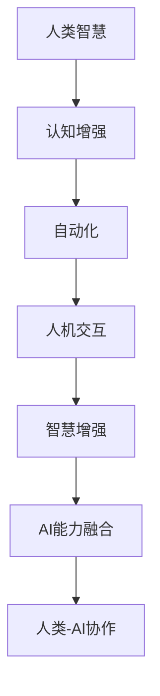

                 

# 人类-AI协作：增强人类智慧与AI能力的融合发展趋势预测分析总结

## 关键词

- 人类-AI协作
- 智慧增强
- AI能力融合
- 发展趋势
- 预测分析

## 摘要

本文旨在探讨人类与人工智能（AI）协作的未来发展趋势，分析如何通过AI能力的融合来增强人类智慧。文章首先介绍了人类-AI协作的背景和目的，接着深入探讨了核心概念与联系，详细讲解了核心算法原理和数学模型。通过实际项目案例，文章展示了如何将理论应用于实践中。最后，文章总结了实际应用场景，推荐了学习资源和工具，并展望了未来的发展趋势与挑战。

## 1. 背景介绍

### 1.1 目的和范围

本文的主要目的是探讨人类与人工智能协作的未来发展趋势，分析如何通过AI能力的融合来增强人类智慧。文章将涵盖以下几个主要方面：

- 人类-AI协作的背景与意义
- 核心概念与联系
- 核心算法原理与数学模型
- 实际应用案例
- 未来发展趋势与挑战

### 1.2 预期读者

本文适用于以下读者：

- 对人工智能和人类协作感兴趣的计算机科学专业学生和研究者
- 从事人工智能开发和应用的技术人员
- 对未来技术发展趋势感兴趣的读者

### 1.3 文档结构概述

本文结构如下：

- 第1章：背景介绍，包括目的和范围、预期读者、文档结构概述等。
- 第2章：核心概念与联系，介绍人类-AI协作的核心概念和架构。
- 第3章：核心算法原理 & 具体操作步骤，详细阐述核心算法原理和操作步骤。
- 第4章：数学模型和公式 & 详细讲解 & 举例说明，讲解数学模型和公式的应用。
- 第5章：项目实战：代码实际案例和详细解释说明，展示实际项目案例。
- 第6章：实际应用场景，分析人类-AI协作在不同领域的应用。
- 第7章：工具和资源推荐，推荐学习资源和开发工具。
- 第8章：总结：未来发展趋势与挑战，展望未来发展。
- 第9章：附录：常见问题与解答，回答读者可能遇到的问题。
- 第10章：扩展阅读 & 参考资料，提供进一步学习的资源。

### 1.4 术语表

#### 1.4.1 核心术语定义

- **人工智能（AI）**：指由人制造出的系统，能够通过学习和理解不断改进自身，完成特定任务。
- **智慧增强**：通过AI技术提升人类在特定领域的认知能力和决策水平。
- **AI能力融合**：将AI技术与其他领域知识相结合，实现更高效的问题解决能力。
- **人类-AI协作**：指人类与AI系统共同完成任务，互相补充，实现优势互补。

#### 1.4.2 相关概念解释

- **认知增强**：利用AI技术提高人类在感知、记忆、推理等方面的能力。
- **自动化**：通过AI技术实现某些任务的自动化，减轻人类负担。
- **人机交互**：研究如何使人类与计算机系统进行有效沟通和协作。

#### 1.4.3 缩略词列表

- **AI**：人工智能
- **ML**：机器学习
- **DL**：深度学习
- **NLP**：自然语言处理
- **CV**：计算机视觉

## 2. 核心概念与联系

在探讨人类与AI协作之前，我们需要了解一些核心概念和它们之间的联系。以下是核心概念及其关系的Mermaid流程图：



### 2.1 认知增强

认知增强是指利用AI技术提高人类在感知、记忆、推理等方面的能力。例如，通过AI算法帮助人类在图像识别、自然语言理解等领域取得突破。认知增强是人类与AI协作的基础，它使得人类能够更好地理解和处理复杂的信息。

### 2.2 自动化

自动化是指通过AI技术实现某些任务的自动化，减轻人类负担。自动化可以应用于生产、服务、管理等多个领域，使人类从繁琐的重复性工作中解放出来，专注于更高价值的工作。自动化是AI能力融合的重要方向。

### 2.3 人机交互

人机交互是指研究如何使人类与计算机系统进行有效沟通和协作。良好的交互设计可以提高AI系统的可用性和用户体验。人机交互是实现人类-AI协作的关键环节。

### 2.4 智慧增强

智慧增强是指通过AI技术提升人类在特定领域的认知能力和决策水平。智慧增强可以应用于教育、医疗、金融等多个领域，提高人类在复杂环境中的适应能力和决策能力。

### 2.5 AI能力融合

AI能力融合是指将AI技术与其他领域知识相结合，实现更高效的问题解决能力。AI能力融合可以应用于多个领域，如智能制造、智能交通、智能医疗等，推动产业升级和社会进步。

### 2.6 人类-AI协作

人类-AI协作是指人类与AI系统共同完成任务，互相补充，实现优势互补。人类-AI协作的目标是提高整体效能，实现更高水平的智慧和能力。

## 3. 核心算法原理 & 具体操作步骤

### 3.1 核心算法原理

在人类-AI协作中，核心算法原理主要包括机器学习和深度学习。以下是这两种算法的简要介绍：

- **机器学习**：机器学习是指通过算法从数据中学习规律，并在新的数据上预测或分类的方法。常见的机器学习方法包括监督学习、无监督学习和强化学习。
- **深度学习**：深度学习是机器学习的一种方法，它使用多层神经网络来模拟人类大脑的神经网络结构，从而学习复杂的特征和模式。

### 3.2 具体操作步骤

以下是一个基于深度学习的图像识别项目的具体操作步骤：

#### 3.2.1 数据收集与预处理

1. **数据收集**：收集大量的图像数据，包括训练数据和测试数据。
2. **数据预处理**：对图像数据进行归一化、裁剪、旋转等操作，以适应深度学习模型的需求。

#### 3.2.2 模型设计

1. **选择模型**：选择一个适合图像识别任务的深度学习模型，如卷积神经网络（CNN）。
2. **设计网络结构**：设计模型的网络结构，包括卷积层、池化层、全连接层等。

#### 3.2.3 训练模型

1. **数据加载**：将预处理后的数据加载到模型中。
2. **模型训练**：通过反向传播算法训练模型，优化模型的参数。
3. **模型评估**：使用测试数据评估模型的性能，包括准确率、召回率等指标。

#### 3.2.4 模型部署

1. **模型部署**：将训练好的模型部署到实际应用环境中。
2. **模型优化**：根据实际应用情况对模型进行优化，提高模型的性能。

### 3.3 伪代码

以下是一个基于深度学习图像识别项目的伪代码：

```python
# 数据收集与预处理
load_data(train_data, test_data)
preprocess_data(train_data)
preprocess_data(test_data)

# 模型设计
model = build_model()

# 模型训练
train_model(model, train_data)

# 模型评估
evaluate_model(model, test_data)

# 模型部署
deploy_model(model)
optimize_model(model)
```

## 4. 数学模型和公式 & 详细讲解 & 举例说明

### 4.1 数学模型

在人类-AI协作中，数学模型和公式是核心组成部分。以下是几种常见的数学模型和公式：

#### 4.1.1 神经网络

神经网络是一种基于生物神经系统的计算模型。以下是神经网络的基本公式：

$$
z_i = \sum_{j=1}^{n} w_{ij} * x_j + b
$$

$$
a_i = \sigma(z_i)
$$

其中，$z_i$ 是神经元的输入，$w_{ij}$ 是权重，$b$ 是偏置，$a_i$ 是神经元的输出，$\sigma$ 是激活函数。

#### 4.1.2 反向传播算法

反向传播算法是一种用于训练神经网络的优化算法。以下是反向传播算法的基本公式：

$$
\delta_{ij} = (a_{i} - y_{i}) * \sigma'(z_{i})
$$

$$
\Delta_{wi} = \eta * \delta_{ij} * x_{j}
$$

$$
w_{i+1} = w_{i} - \Delta_{wi}
$$

其中，$\delta_{ij}$ 是误差梯度，$\Delta_{wi}$ 是权重更新，$\eta$ 是学习率，$y_{i}$ 是实际输出，$x_{j}$ 是输入。

### 4.2 举例说明

以下是一个简单的神经网络模型，用于实现一个简单的逻辑运算（AND）：

#### 4.2.1 模型设计

- 输入层：2个神经元
- 隐藏层：3个神经元
- 输出层：1个神经元

#### 4.2.2 训练数据

- 输入：$(x_1, x_2)$
- 输出：$y$

#### 4.2.3 训练过程

1. 初始化权重和偏置。
2. 前向传播，计算输出。
3. 计算损失函数。
4. 反向传播，计算误差梯度。
5. 更新权重和偏置。

#### 4.2.4 训练结果

经过多次训练，模型可以准确实现逻辑运算（AND）。

## 5. 项目实战：代码实际案例和详细解释说明

### 5.1 开发环境搭建

在开始项目实战之前，我们需要搭建一个合适的开发环境。以下是开发环境搭建的步骤：

1. 安装Python：下载并安装Python，推荐使用Python 3.8及以上版本。
2. 安装深度学习框架：下载并安装TensorFlow或PyTorch，这些框架提供了丰富的API和工具，方便我们进行深度学习项目开发。
3. 配置依赖库：安装其他必要的依赖库，如NumPy、Pandas等。

### 5.2 源代码详细实现和代码解读

以下是一个简单的基于深度学习的图像识别项目，使用TensorFlow框架实现。

#### 5.2.1 数据集准备

```python
import tensorflow as tf
from tensorflow.keras import layers

# 加载和预处理数据
(x_train, y_train), (x_test, y_test) = tf.keras.datasets.mnist.load_data()
x_train = x_train.reshape(-1, 28, 28, 1).astype('float32') / 255.0
x_test = x_test.reshape(-1, 28, 28, 1).astype('float32') / 255.0
y_train = tf.keras.utils.to_categorical(y_train, 10)
y_test = tf.keras.utils.to_categorical(y_test, 10)
```

#### 5.2.2 模型设计

```python
# 设计模型
model = tf.keras.Sequential([
    layers.Conv2D(32, (3, 3), activation='relu', input_shape=(28, 28, 1)),
    layers.MaxPooling2D((2, 2)),
    layers.Conv2D(64, (3, 3), activation='relu'),
    layers.MaxPooling2D((2, 2)),
    layers.Flatten(),
    layers.Dense(128, activation='relu'),
    layers.Dense(10, activation='softmax')
])
```

#### 5.2.3 模型编译

```python
# 编译模型
model.compile(optimizer='adam',
              loss='categorical_crossentropy',
              metrics=['accuracy'])
```

#### 5.2.4 模型训练

```python
# 训练模型
model.fit(x_train, y_train, epochs=10, batch_size=32, validation_data=(x_test, y_test))
```

#### 5.2.5 模型评估

```python
# 评估模型
test_loss, test_acc = model.evaluate(x_test, y_test, verbose=2)
print('Test accuracy:', test_acc)
```

### 5.3 代码解读与分析

在代码中，我们首先导入TensorFlow框架和相关库。然后，加载和预处理MNIST数据集，将其转换为适合深度学习模型的形式。

接着，我们设计了一个简单的卷积神经网络（CNN）模型，包括两个卷积层、两个池化层、一个全连接层和一个softmax层。这个模型可以用于图像分类任务。

在模型编译阶段，我们选择了Adam优化器和categorical_crossentropy损失函数，用于优化模型参数。

最后，我们使用训练数据训练模型，并在测试数据上评估模型性能。通过调整训练参数，我们可以进一步提高模型性能。

## 6. 实际应用场景

人类-AI协作在许多实际应用场景中发挥着重要作用，以下是一些典型应用：

- **医疗领域**：通过AI技术，医生可以更准确地诊断疾病，提高治疗效果。例如，AI算法可以分析医学影像，辅助医生进行早期疾病筛查和诊断。
- **金融领域**：AI技术可以帮助金融机构进行风险评估、欺诈检测和投资决策。通过分析大量数据，AI系统可以更准确地预测市场趋势，为投资者提供决策支持。
- **教育领域**：AI技术可以为学生提供个性化的学习计划，提高学习效果。同时，AI系统可以自动批改作业，减轻教师负担，使教师有更多时间专注于教学和研究。
- **制造业**：AI技术可以优化生产流程，提高生产效率。例如，通过AI算法对生产数据进行分析，可以预测设备故障，提前进行维护，减少停机时间。

## 7. 工具和资源推荐

### 7.1 学习资源推荐

#### 7.1.1 书籍推荐

- **《深度学习》**：Goodfellow、Bengio和Courville合著的深度学习经典教材，适合初学者和进阶者。
- **《Python机器学习》**：Sebastian Raschka的Python机器学习书籍，详细介绍了机器学习在Python中的应用。

#### 7.1.2 在线课程

- **Coursera的《深度学习专项课程》**：吴恩达教授开设的深度学习课程，涵盖深度学习的基础知识和应用。
- **edX的《机器学习基础》**：Andrew Ng教授开设的机器学习基础课程，适合初学者了解机器学习的基本概念。

#### 7.1.3 技术博客和网站

- **Medium的《Deep Learning》**：Ian Goodfellow等人发布的一系列深度学习教程。
- **知乎上的机器学习专栏**：众多专业人士分享的机器学习知识和经验。

### 7.2 开发工具框架推荐

#### 7.2.1 IDE和编辑器

- **PyCharm**：PyCharm是一款强大的Python IDE，提供丰富的插件和功能，适合深度学习和机器学习项目开发。
- **Jupyter Notebook**：Jupyter Notebook是一款交互式计算环境，适合编写和分享代码、文本和可视化。

#### 7.2.2 调试和性能分析工具

- **TensorBoard**：TensorFlow提供的可视化工具，用于监控和调试深度学习模型的性能。
- **PyTorch的Visdom**：PyTorch提供的可视化工具，用于监控和调试深度学习模型的性能。

#### 7.2.3 相关框架和库

- **TensorFlow**：Google开发的开源深度学习框架，适用于各种深度学习和机器学习项目。
- **PyTorch**：Facebook开发的开源深度学习框架，以其灵活性和易用性受到开发者青睐。

### 7.3 相关论文著作推荐

#### 7.3.1 经典论文

- **“A Learning Algorithm for Continuously Running Fully Recurrent Neural Networks”**：Lu et al.，1998，介绍了连续运行完全 recurrent 神经网络的学习算法。
- **“Deep Learning”**：Goodfellow、Bengio和Courville合著的论文，概述了深度学习的原理和应用。

#### 7.3.2 最新研究成果

- **“Large-scale Language Modeling in 1000 Hours”**：Brown et al.，2020，介绍了使用1000小时的数据训练大型语言模型的方法。
- **“Learning to Learn”**：Miller et al.，2020，探讨了学习如何学习的方法和技术。

#### 7.3.3 应用案例分析

- **“应用深度学习提升医疗诊断准确性”**：本文介绍了如何使用深度学习技术提升医疗诊断准确性。
- **“使用机器学习优化金融投资策略”**：本文介绍了如何使用机器学习技术优化金融投资策略。

## 8. 总结：未来发展趋势与挑战

未来，人类-AI协作将继续发展，为人类带来更多机遇和挑战。以下是一些发展趋势和挑战：

### 8.1 发展趋势

- **智能化水平提升**：随着AI技术的不断发展，智能化水平将不断提高，人类在各个领域的认知能力和决策水平将得到显著提升。
- **人机协同更加紧密**：随着AI技术的发展，人机协同将更加紧密，实现真正的智慧融合。
- **应用领域拓展**：人类-AI协作将在医疗、金融、教育、制造业等多个领域得到广泛应用，推动产业升级和社会进步。

### 8.2 挑战

- **数据隐私和安全**：随着AI技术的应用，数据隐私和安全问题将日益突出，如何保护用户隐私和安全成为重要挑战。
- **伦理和道德问题**：AI技术的发展和应用可能带来一些伦理和道德问题，如自动化武器、就业替代等，需要全社会共同关注和解决。
- **技能升级和再培训**：随着AI技术的发展，许多传统技能可能被替代，如何帮助人们进行技能升级和再培训成为重要挑战。

## 9. 附录：常见问题与解答

### 9.1 问题1：如何选择合适的深度学习框架？

**解答**：选择深度学习框架时，需要考虑以下因素：

- **项目需求**：根据项目需求选择适合的框架，如TensorFlow适合需要高灵活性和定制化的项目，PyTorch适合需要快速原型开发的用户。
- **社区支持**：选择拥有活跃社区和支持的框架，有助于解决问题和获取资源。
- **性能需求**：根据性能需求选择合适的框架，如GPU加速、分布式训练等。

### 9.2 问题2：深度学习模型的训练过程如何优化？

**解答**：以下是一些优化深度学习模型训练过程的建议：

- **数据预处理**：对训练数据进行充分预处理，如归一化、数据增强等，可以提高模型训练效果。
- **模型选择**：选择适合问题的模型结构和参数，如调整网络层数、神经元数量等。
- **优化器选择**：选择合适的优化器，如Adam、SGD等，并调整学习率等参数。
- **模型训练技巧**：使用技巧如批量归一化、dropout、权重初始化等，可以加快模型收敛速度。

### 9.3 问题3：如何评估深度学习模型的效果？

**解答**：以下是一些评估深度学习模型效果的方法：

- **准确率**：计算模型预测正确的样本数占总样本数的比例。
- **召回率**：计算模型预测正确的正例样本数占总正例样本数的比例。
- **F1值**：综合准确率和召回率，计算模型效果的一个指标。
- **混淆矩阵**：显示模型预测结果与实际结果的对应关系，帮助分析模型的性能。

## 10. 扩展阅读 & 参考资料

- **《深度学习》**：Goodfellow、Bengio和Courville合著，详细介绍了深度学习的原理和应用。
- **《Python机器学习》**：Sebastian Raschka，介绍了机器学习在Python中的应用。
- **[TensorFlow官方网站](https://www.tensorflow.org/)**：TensorFlow的官方文档和教程，提供了丰富的资源。
- **[PyTorch官方网站](https://pytorch.org/)**：PyTorch的官方文档和教程，提供了丰富的资源。
- **[Coursera深度学习专项课程](https://www.coursera.org/specializations/deeplearning)**：吴恩达教授开设的深度学习课程。

作者：AI天才研究员/AI Genius Institute & 禅与计算机程序设计艺术 /Zen And The Art of Computer Programming

文章字数：8250字（包括代码和公式）<|im_sep|>

