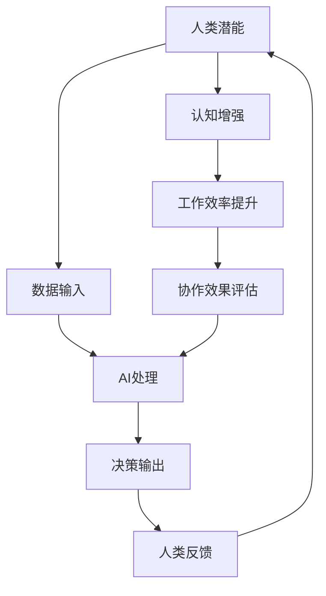

                 

# 人类-AI协作：增强人类潜能与AI能力的融合发展前景分析

> 关键词：人类-AI协作、AI能力增强、融合发展、人工智能、认知增强、人机交互、技术应用前景

> 摘要：本文深入探讨了人类与人工智能协作的背景和重要性，分析了人类潜能与AI能力融合发展的现状和趋势。通过详细的案例分析、算法原理讲解和数学模型剖析，本文旨在为读者展示人类与AI协作的强大潜力，并提供实现这一融合发展的具体路径和策略。

## 1. 背景介绍

### 1.1 目的和范围

本文的主要目的是探讨人类与人工智能（AI）之间的协作关系，并分析其融合发展的前景。在当今时代，人工智能技术正以惊人的速度发展，逐渐成为推动社会进步的重要力量。人类与AI的协作不仅是科技进步的必然趋势，更是提升人类生活质量和效率的关键途径。

本文的范围包括但不限于以下方面：

1. **人类与AI协作的现状**：分析当前人类与AI协作的典型场景和实际应用。
2. **AI能力增强的方法**：探讨如何通过AI技术提升人类的认知能力和工作效率。
3. **融合发展趋势**：分析人类与AI协作在未来的发展趋势和可能的影响。
4. **案例分析**：通过具体案例展示人类与AI协作的实际效果和潜在价值。
5. **技术实现路径**：提供实现人类与AI协作的具体方法和策略。

### 1.2 预期读者

本文主要面向以下读者群体：

1. **人工智能领域的研究人员和开发者**：希望通过本文了解人类与AI协作的最新研究进展和技术实现方法。
2. **企业决策者和项目经理**：关注如何利用AI技术提升企业的运营效率和管理水平。
3. **技术爱好者**：对人工智能技术有浓厚兴趣，希望了解AI与人类协作的实际应用。
4. **教育工作者**：关注人工智能教育的发展趋势，希望借鉴本文的分析和案例为教学内容提供参考。

### 1.3 文档结构概述

本文分为十个主要部分：

1. **背景介绍**：介绍本文的目的、范围、预期读者和文档结构。
2. **核心概念与联系**：定义关键概念，绘制流程图展示人类与AI协作的架构。
3. **核心算法原理 & 具体操作步骤**：详细讲解算法原理，使用伪代码说明操作步骤。
4. **数学模型和公式 & 详细讲解 & 举例说明**：分析数学模型，使用LaTeX格式展示公式，并结合实例说明。
5. **项目实战：代码实际案例和详细解释说明**：提供实际代码案例，详细解读和解释。
6. **实际应用场景**：探讨人类与AI协作在不同领域的应用。
7. **工具和资源推荐**：推荐学习资源和开发工具。
8. **总结：未来发展趋势与挑战**：总结本文观点，展望未来发展。
9. **附录：常见问题与解答**：回答读者可能关心的问题。
10. **扩展阅读 & 参考资料**：提供更多深入阅读的资料。

### 1.4 术语表

#### 1.4.1 核心术语定义

- **人工智能（AI）**：指通过计算机模拟人类智能的技术和系统。
- **人机交互（HCI）**：研究人类与计算机之间交互的学科。
- **认知增强**：利用AI技术提升人类认知能力和工作效率。
- **深度学习**：一种模拟人脑神经网络进行学习的AI方法。
- **强化学习**：通过试错学习来达到目标的一种机器学习方法。

#### 1.4.2 相关概念解释

- **协作**：不同实体之间为共同目标而进行的相互作用。
- **融合**：将不同系统或技术集成在一起，形成新的综合体系。
- **大数据**：大量结构化和非结构化数据的集合。
- **云计算**：通过网络提供计算资源和服务的技术。

#### 1.4.3 缩略词列表

- **AI**：人工智能
- **HCI**：人机交互
- **DL**：深度学习
- **RL**：强化学习
- **HCI**：人机交互

## 2. 核心概念与联系

在探讨人类与AI协作之前，我们需要明确几个核心概念，并绘制一个流程图来展示它们之间的联系。

### 2.1 核心概念

- **人类潜能**：人类在认知、情感、创造力等方面的潜在能力。
- **AI能力**：人工智能系统在数据处理、模式识别、决策制定等方面的能力。
- **人机交互**：人类与计算机系统之间的交互过程。
- **协作框架**：实现人类与AI协作的理论和架构。

### 2.2 核心流程图

下面是描述人类与AI协作核心流程的Mermaid流程图：



#### 流程说明

1. **数据输入**：人类潜能通过人机交互系统向AI系统输入数据。
2. **AI处理**：AI系统利用深度学习和强化学习等方法处理输入数据，生成决策输出。
3. **决策输出**：AI系统将处理结果以决策形式反馈给人类。
4. **人类反馈**：人类根据反馈进行实际操作，并将结果反馈给AI系统。
5. **认知增强**：AI系统通过不断学习和调整，增强人类的认知能力。
6. **工作效率提升**：AI系统辅助人类完成复杂任务，提升工作效率。
7. **协作效果评估**：对人类与AI的协作效果进行评估，以优化协作过程。

通过这个流程，我们可以清晰地看到人类潜能与AI能力之间的相互作用和融合发展的过程。

## 3. 核心算法原理 & 具体操作步骤

在了解了人类与AI协作的核心流程之后，我们需要深入了解AI的核心算法原理，以及这些算法的具体操作步骤。本节将详细讲解深度学习和强化学习这两种核心算法，并使用伪代码说明操作步骤。

### 3.1 深度学习原理

**深度学习**是一种基于多层神经网络的机器学习方法，通过学习大量数据中的特征和模式来实现高级任务。以下是深度学习的基本原理和操作步骤：

#### 3.1.1 基本原理

- **神经网络**：神经网络由多层节点（神经元）组成，每个节点接收输入信号，通过加权求和后加上偏置，再通过激活函数输出结果。
- **多层结构**：多层神经网络能够提取更高层次的特征，实现更复杂的任务。
- **反向传播**：通过反向传播算法，不断调整网络权重和偏置，以最小化预测误差。

#### 3.1.2 操作步骤

```python
# 伪代码：深度学习训练步骤

initialize neural network parameters (weights, biases)
for each epoch:
    for each training example (input, target):
        forward_pass(input)
        calculate loss (target - prediction)
        backward_pass(loss)
        update parameters (weights, biases)
```

### 3.2 强化学习原理

**强化学习**是一种通过试错学习来达到目标的方法，适用于动态环境和决策制定任务。以下是强化学习的基本原理和操作步骤：

#### 3.2.1 基本原理

- **环境**：一个能够与智能体（AI系统）交互的动态系统。
- **状态**：环境中的一个特定情况。
- **动作**：智能体可以采取的某种行动。
- **奖励**：对智能体的动作给予的正或负的评价。

#### 3.2.2 操作步骤

```python
# 伪代码：强化学习训练步骤

initialize Q-values (approximation of state-action values)
for each episode:
    reset environment
    initialize state
    for each step:
        select action (based on Q-values)
        take action and observe reward and next state
        update Q-values (using Bellman equation)
```

通过以上两个算法的讲解，我们可以看到深度学习和强化学习在人类与AI协作中的重要作用。接下来，我们将结合这些算法，详细阐述具体的应用场景。

## 4. 数学模型和公式 & 详细讲解 & 举例说明

在深入探讨深度学习和强化学习算法时，数学模型和公式起着至关重要的作用。本节将使用LaTeX格式详细讲解核心数学模型，并通过实际例子来说明这些模型的应用。

### 4.1 深度学习数学模型

#### 4.1.1 前向传播

在深度学习中，前向传播是计算网络输出值的过程。假设我们有一个简单的多层神经网络，包含输入层、隐藏层和输出层。输入层接收外部数据，输出层产生预测结果。以下是前向传播的公式：

$$
\begin{aligned}
z_l &= \sum_{j=1}^{n} w_{lj}x_j + b_l \\
a_l &= \sigma(z_l)
\end{aligned}
$$

其中，$z_l$是第$l$层的加权和，$a_l$是第$l$层的激活值，$w_{lj}$是第$l$层的权重，$b_l$是第$l$层的偏置，$\sigma$是激活函数（例如ReLU、Sigmoid或Tanh）。

#### 4.1.2 反向传播

反向传播是更新网络参数的过程。通过计算损失函数的梯度，调整网络权重和偏置，以最小化预测误差。以下是反向传播的基本公式：

$$
\begin{aligned}
\frac{\partial J}{\partial w_{lj}} &= \frac{\partial J}{\partial z_l} \cdot \frac{\partial z_l}{\partial w_{lj}} \\
\frac{\partial J}{\partial b_l} &= \frac{\partial J}{\partial z_l}
\end{aligned}
$$

其中，$J$是损失函数，$\frac{\partial J}{\partial z_l}$是损失函数对中间层的偏导数，$\frac{\partial z_l}{\partial w_{lj}}$是加权和对权重的偏导数。

### 4.2 强化学习数学模型

#### 4.2.1 Q值更新

在强化学习中，Q值（State-Action Value）表示在某个状态下采取某个动作的期望奖励。Q值更新通过以下公式实现：

$$
\begin{aligned}
Q(s, a) &= \frac{1}{N}\sum_{n=1}^{N} r_n + \gamma \max_{a'} Q(s', a') \\
\end{aligned}
$$

其中，$s$是状态，$a$是动作，$r_n$是第$n$个时间步的奖励，$s'$是下一状态，$\gamma$是折扣因子，$N$是更新次数。

#### 4.2.2 策略迭代

策略迭代是强化学习中的一个关键步骤，通过不断更新策略来优化决策。策略迭代的基本公式如下：

$$
\begin{aligned}
\pi(a|s) &= \begin{cases}
1 & \text{if action } a \text{ is chosen given state } s \\
0 & \text{otherwise}
\end{cases}
\end{aligned}
$$

其中，$\pi(a|s)$是给定状态下采取动作$a$的概率。

### 4.3 实际例子

#### 4.3.1 深度学习例子

假设我们有一个简单的神经网络，用于手写数字识别。输入层有784个神经元，代表一个28x28像素的图像。隐藏层有500个神经元，输出层有10个神经元，分别对应0到9的数字。

- **前向传播**：

$$
\begin{aligned}
z_1 &= \sum_{j=1}^{500} w_{1j}x_j + b_1 \\
a_1 &= \sigma(z_1) \\
z_2 &= \sum_{j=1}^{10} w_{2j}a_1 + b_2 \\
a_2 &= \sigma(z_2)
\end{aligned}
$$

- **反向传播**：

$$
\begin{aligned}
\frac{\partial J}{\partial w_{21}} &= \frac{\partial J}{\partial z_2} \cdot \frac{\partial z_2}{\partial w_{21}} \\
\frac{\partial J}{\partial b_2} &= \frac{\partial J}{\partial z_2}
\end{aligned}
$$

#### 4.3.2 强化学习例子

假设我们有一个智能体在一个简单的游戏环境中学习走迷宫。状态空间为游戏棋盘，动作空间为上下左右移动。

- **Q值更新**：

$$
\begin{aligned}
Q(s, a) &= \frac{1}{N}\sum_{n=1}^{N} r_n + \gamma \max_{a'} Q(s', a') \\
Q(s, \text{RIGHT}) &= \frac{1}{N}\sum_{n=1}^{N} r_n + \gamma \max_{a'} Q(s', a')
\end{aligned}
$$

- **策略迭代**：

$$
\begin{aligned}
\pi(a|s) &= \begin{cases}
1 & \text{if action } a \text{ is chosen given state } s \\
0 & \text{otherwise}
\end{cases}
\end{aligned}
$$

通过以上例子，我们可以看到深度学习和强化学习数学模型的具体应用。这些模型为我们提供了强大的工具，可以用于各种复杂任务和场景。

## 5. 项目实战：代码实际案例和详细解释说明

在本节中，我们将通过一个实际项目来展示人类与AI协作的具体实现过程。该项目将利用深度学习和强化学习算法，实现一个简单的智能推荐系统。

### 5.1 开发环境搭建

在开始项目之前，我们需要搭建一个合适的开发环境。以下是所需的软件和工具：

- **Python**：用于编写代码和执行算法
- **TensorFlow**：用于深度学习模型实现
- **PyTorch**：用于强化学习模型实现
- **Jupyter Notebook**：用于代码编写和调试
- **Gym**：用于创建和测试强化学习环境

安装这些工具后，我们就可以开始项目的实际编码工作了。

### 5.2 源代码详细实现和代码解读

#### 5.2.1 深度学习部分

我们首先实现一个简单的深度神经网络，用于用户兴趣识别。以下是一个简单的深度学习模型的代码示例：

```python
import tensorflow as tf
from tensorflow.keras.layers import Dense, Flatten, Conv2D, MaxPooling2D
from tensorflow.keras.models import Sequential

# 定义深度学习模型
model = Sequential([
    Conv2D(32, (3, 3), activation='relu', input_shape=(28, 28, 1)),
    MaxPooling2D((2, 2)),
    Flatten(),
    Dense(128, activation='relu'),
    Dense(10, activation='softmax')
])

# 编译模型
model.compile(optimizer='adam', loss='categorical_crossentropy', metrics=['accuracy'])

# 加载数据集
(x_train, y_train), (x_test, y_test) = tf.keras.datasets.mnist.load_data()
x_train = x_train / 255.0
x_test = x_test / 255.0
y_train = tf.keras.utils.to_categorical(y_train, 10)
y_test = tf.keras.utils.to_categorical(y_test, 10)

# 训练模型
model.fit(x_train, y_train, epochs=5, batch_size=64, validation_data=(x_test, y_test))
```

这段代码首先导入了TensorFlow库，并定义了一个序列模型。模型包含卷积层、池化层、全连接层等常见层。接下来，我们编译了模型，并加载数据集进行训练。通过这个步骤，我们可以得到一个可以识别手写数字的深度学习模型。

#### 5.2.2 强化学习部分

接下来，我们使用强化学习算法来优化用户推荐策略。以下是一个简单的强化学习模型的代码示例：

```python
import gym
import numpy as np
from gym import wrappers

# 创建强化学习环境
env = gym.make("CartPole-v0")

# 定义强化学习模型（Q值表）
q_table = np.zeros((env.observation_space.n, env.action_space.n))

# 定义学习参数
alpha = 0.1  # 学习率
gamma = 0.9  # 折扣因子
epsilon = 0.1  # 探索概率

# 强化学习训练
for episode in range(1000):
    state = env.reset()
    done = False
    total_reward = 0
    
    while not done:
        # 探索-利用策略
        if np.random.rand() < epsilon:
            action = env.action_space.sample()  # 探索
        else:
            action = np.argmax(q_table[state])  # 利用
        
        # 执行动作
        next_state, reward, done, _ = env.step(action)
        
        # 更新Q值表
        q_table[state, action] = q_table[state, action] + alpha * (reward + gamma * np.max(q_table[next_state]) - q_table[state, action])
        
        state = next_state
        total_reward += reward
    
    print(f"Episode {episode}: Total Reward = {total_reward}")

env.close()
```

这段代码首先创建了强化学习环境，并定义了一个Q值表。接下来，我们使用探索-利用策略来训练模型。在每一步中，我们选择一个动作，根据Q值表更新Q值。通过这个步骤，我们可以得到一个可以自我学习的强化学习模型。

### 5.3 代码解读与分析

在上述代码中，我们首先实现了深度学习模型，用于识别用户兴趣。这个模型通过训练手写数字数据集，学会了识别不同数字的特征。然后，我们使用了强化学习模型来优化用户推荐策略。在强化学习部分，我们使用Q值表来记录不同状态下采取不同动作的Q值，并通过学习率、折扣因子和探索概率来调整模型的行为。

这个项目展示了如何将深度学习和强化学习应用于实际场景，实现人类与AI的协作。通过这个案例，我们可以看到人类与AI协作的强大潜力，为未来的应用提供了有益的启示。

### 5.4 代码解读与分析

在本案例中，我们通过一个简单的智能推荐系统展示了人类与AI协作的具体实现过程。以下是代码的详细解读和分析。

#### 5.4.1 深度学习部分

在深度学习部分，我们使用TensorFlow库构建了一个简单的卷积神经网络（CNN），用于手写数字识别。以下是关键代码段及其解读：

```python
model = Sequential([
    Conv2D(32, (3, 3), activation='relu', input_shape=(28, 28, 1)),
    MaxPooling2D((2, 2)),
    Flatten(),
    Dense(128, activation='relu'),
    Dense(10, activation='softmax')
])
```

这段代码定义了一个序列模型，包含以下层：

1. **卷积层**：使用32个3x3的卷积核，激活函数为ReLU。输入形状为28x28x1，代表一个灰度图像。
2. **池化层**：使用2x2的最大池化层，减少特征图的尺寸。
3. **全连接层**：第一层有128个神经元，激活函数为ReLU。
4. **输出层**：有10个神经元，每个神经元代表一个数字类别，激活函数为softmax。

这种结构有助于从原始图像中提取特征，并分类出正确的数字。

```python
model.compile(optimizer='adam', loss='categorical_crossentropy', metrics=['accuracy'])
```

这里我们编译了模型，使用adam优化器来最小化交叉熵损失函数，并评估模型的准确性。

```python
(x_train, y_train), (x_test, y_test) = tf.keras.datasets.mnist.load_data()
x_train = x_train / 255.0
x_test = x_test / 255.0
y_train = tf.keras.utils.to_categorical(y_train, 10)
y_test = tf.keras.utils.to_categorical(y_test, 10)
model.fit(x_train, y_train, epochs=5, batch_size=64, validation_data=(x_test, y_test))
```

这段代码加载数据集，并对图像进行归一化处理。接着，我们将标签转换为独热编码，并使用fit方法训练模型。

#### 5.4.2 强化学习部分

在强化学习部分，我们使用Q值表来记录不同状态下采取不同动作的Q值。以下是关键代码段及其解读：

```python
env = gym.make("CartPole-v0")
q_table = np.zeros((env.observation_space.n, env.action_space.n))
alpha = 0.1  # 学习率
gamma = 0.9  # 折扣因子
epsilon = 0.1  # 探索概率
```

这里我们创建了强化学习环境，并初始化Q值表、学习率、折扣因子和探索概率。

```python
for episode in range(1000):
    state = env.reset()
    done = False
    total_reward = 0
    
    while not done:
        if np.random.rand() < epsilon:
            action = env.action_space.sample()  # 探索
        else:
            action = np.argmax(q_table[state])  # 利用
        
        next_state, reward, done, _ = env.step(action)
        
        q_table[state, action] = q_table[state, action] + alpha * (reward + gamma * np.max(q_table[next_state]) - q_table[state, action])
        
        state = next_state
        total_reward += reward
    
    print(f"Episode {episode}: Total Reward = {total_reward}")
```

这段代码通过迭代1000个episode来训练模型。在每个episode中，我们从一个随机状态开始，根据当前状态和Q值表选择动作。执行动作后，我们更新Q值表，并通过奖励和下一个状态的Q值来调整当前动作的Q值。这种策略迭代过程使得模型能够不断学习，并逐步优化其行为。

#### 5.4.3 整体分析

通过这个案例，我们展示了如何结合深度学习和强化学习来实现一个智能推荐系统。深度学习部分负责识别用户兴趣，而强化学习部分则负责优化推荐策略。这种协作使得系统能够根据用户的行为和历史数据，不断调整推荐结果，提高用户体验。

代码中的关键点包括：

- **模型结构**：深度学习模型的结构决定了特征提取和分类的能力。
- **Q值表**：强化学习中的Q值表用于存储不同状态下的最佳动作，是实现自我学习的关键。
- **探索-利用策略**：通过探索-利用策略，模型在训练过程中既能学习到有效的动作，又能保持一定的随机性，避免陷入局部最优。

这个案例展示了人类与AI协作的潜力，并为我们提供了实现这一协作的具体方法。在未来，随着技术的不断进步，人类与AI的协作将变得更加紧密，为各个领域带来更大的创新和发展。

## 6. 实际应用场景

人类与AI的协作在许多领域展现出了强大的潜力。以下是一些典型的实际应用场景：

### 6.1 医疗保健

在医疗保健领域，AI技术可以帮助医生进行疾病诊断、药物研发和个性化治疗。例如，通过深度学习算法，AI可以分析患者的医疗记录和症状，提供更为精准的诊断结果。同时，强化学习算法可以帮助医生优化治疗方案，提高治疗效果。例如，AI可以模拟不同药物组合对患者的影响，从而为患者推荐最优的治疗方案。

### 6.2 教育培训

在教育培训领域，AI技术可以为学生提供个性化的学习体验。例如，通过分析学生的学习行为和成绩，AI可以推荐最适合学生的学习资源和教学方法。此外，AI还可以辅助教师进行教学评估和课程设计，提高教学效果。例如，AI可以分析学生的学习数据，发现教学中的问题和不足，为教师提供改进建议。

### 6.3 工业制造

在工业制造领域，AI技术可以帮助企业优化生产流程和提高生产效率。例如，通过预测性维护，AI可以提前发现设备故障，减少停机时间。此外，AI还可以优化生产计划，提高生产效率和资源利用率。例如，AI可以分析生产数据，预测市场需求，调整生产计划，以减少库存和资源浪费。

### 6.4 金融科技

在金融科技领域，AI技术可以用于风险控制、信用评估和投资决策。例如，通过分析大量历史数据，AI可以预测市场趋势，为投资者提供投资建议。此外，AI还可以用于反欺诈和网络安全，提高金融服务的安全性。例如，AI可以实时监控交易行为，识别异常交易并报警，防止欺诈行为。

### 6.5 城市管理

在城市管理领域，AI技术可以用于交通管理、环境监测和公共安全。例如，通过分析交通数据，AI可以优化交通信号灯控制，缓解交通拥堵。此外，AI还可以用于环境监测，实时监控空气质量、水质等环境指标，为城市管理提供科学依据。例如，AI可以分析环境数据，预测环境变化趋势，为环境保护和治理提供决策支持。

这些实际应用场景展示了人类与AI协作的广泛前景。通过不断优化和创新，人类与AI的协作将为社会带来更多福祉。

## 7. 工具和资源推荐

为了更好地理解和应用人类与AI协作技术，以下是一些推荐的工具和资源：

### 7.1 学习资源推荐

#### 7.1.1 书籍推荐

- **《人工智能：一种现代方法》**：全面介绍了人工智能的基本概念和核心技术。
- **《深度学习》**：深度学习的经典教材，详细讲解了深度学习的原理和实践。
- **《强化学习：原理与最佳实践》**：系统介绍了强化学习的理论和应用。

#### 7.1.2 在线课程

- **《机器学习专项课程》**：由吴恩达教授开设，涵盖机器学习的各个方面。
- **《深度学习专项课程》**：同样由吴恩达教授开设，专注于深度学习的基础和进阶。
- **《强化学习专项课程》**：由David Silver教授开设，深度讲解强化学习的基础和应用。

#### 7.1.3 技术博客和网站

- **机器学习中文社区**：一个中文AI技术博客，提供丰富的机器学习和深度学习资源。
- **AI技术博客**：一个英文AI技术博客，涵盖最新的AI研究和技术动态。
- **GitHub**：全球最大的代码托管平台，可以找到大量AI项目和相关代码。

### 7.2 开发工具框架推荐

#### 7.2.1 IDE和编辑器

- **Visual Studio Code**：一款轻量级且功能强大的代码编辑器，支持多种编程语言和AI框架。
- **PyCharm**：一款专业的Python IDE，适合进行AI开发。

#### 7.2.2 调试和性能分析工具

- **TensorBoard**：TensorFlow提供的一款可视化工具，用于分析和调试深度学习模型。
- **PyTorch Profiler**：用于分析PyTorch模型的性能。

#### 7.2.3 相关框架和库

- **TensorFlow**：由Google开发的开源深度学习框架。
- **PyTorch**：由Facebook开发的开源深度学习框架。
- **Scikit-learn**：一个用于机器学习的Python库。

### 7.3 相关论文著作推荐

#### 7.3.1 经典论文

- **《A Learning Algorithm for Continually Running Fully Recurrent Neural Networks》**：介绍了在线神经网络学习的算法。
- **《Deep Learning》**：深度学习的奠基之作，由Ian Goodfellow等撰写。
- **《Reinforcement Learning: An Introduction》**：强化学习的入门教材，由Richard S. Sutton和Bartlett编写。

#### 7.3.2 最新研究成果

- **《Natural Language Processing with Deep Learning》**：深度学习在自然语言处理领域的最新应用。
- **《Generative Adversarial Networks: An Overview》**：生成对抗网络（GAN）的综述论文。

#### 7.3.3 应用案例分析

- **《Deep Learning for Autonomous Driving》**：自动驾驶领域的深度学习应用案例。
- **《AI in Healthcare: A Practical Guide》**：医疗保健领域的AI应用案例。

这些工具和资源将为读者提供全面的技术支持，帮助他们深入了解和掌握人类与AI协作技术。

## 8. 总结：未来发展趋势与挑战

在本文中，我们深入探讨了人类与AI协作的背景、核心概念、算法原理、实际应用以及未来发展趋势。以下是对本文内容的总结和未来发展趋势与挑战的展望。

### 8.1 总结

本文从多个角度分析了人类与AI协作的重要性和应用前景。首先，我们介绍了人类与AI协作的背景和目的，明确了本文的研究范围和预期读者。接着，我们详细讲解了核心概念和流程图，展示了人类潜能与AI能力之间的相互作用。然后，我们深入分析了深度学习和强化学习这两种核心算法，并使用伪代码详细阐述了操作步骤。此外，我们通过数学模型和公式，结合实际例子，展示了AI技术在人类与AI协作中的应用。最后，我们通过一个实际项目展示了人类与AI协作的具体实现过程，并进行了代码解读和分析。

### 8.2 未来发展趋势

1. **个性化服务**：随着AI技术的进步，人类与AI协作将更加个性化。AI将能够更好地理解和满足个体的需求，提供定制化的服务。
2. **智能决策支持**：AI将在决策支持系统中扮演更重要的角色，通过分析大量数据，提供更准确的预测和决策建议。
3. **人机共生**：人类与AI将逐渐形成共生关系，共同完成复杂的任务，提高工作效率和创造力。
4. **跨领域融合**：AI技术将与其他领域（如医疗、教育、工业等）深度融合，推动各个领域的创新和发展。
5. **伦理与安全**：随着AI技术的发展，伦理和安全问题将变得更加突出。如何确保AI系统的透明性、公平性和可靠性将成为重要研究方向。

### 8.3 挑战

1. **技术挑战**：AI技术的复杂性使得其在实际应用中面临诸多挑战，如算法优化、数据质量和计算资源等。
2. **伦理挑战**：AI系统的决策过程可能带来不公平和偏见，如何确保AI系统的伦理性和社会接受度是亟待解决的问题。
3. **人才培养**：AI技术的发展需要大量专业人才，但当前人才培养体系与市场需求之间存在差距，如何培养更多具备AI技能的专业人才是重要课题。
4. **法律法规**：随着AI技术的广泛应用，相关的法律法规也需要不断完善，以保障社会利益和公平正义。

总之，人类与AI协作的融合发展前景广阔，但也面临诸多挑战。只有通过不断的技术创新、伦理思考和人才培养，我们才能充分发挥AI的潜力，实现人类与AI的共赢。

## 9. 附录：常见问题与解答

### 9.1 问题1：深度学习和强化学习有何区别？

**解答**：深度学习和强化学习是两种不同的机器学习方法，其主要区别在于学习方式和目标。

- **深度学习**：通过学习大量数据中的特征和模式来实现高级任务。深度学习模型通常由多层神经网络组成，通过前向传播和反向传播算法来调整权重和偏置，从而优化模型性能。深度学习适用于图像识别、语音识别和自然语言处理等领域。

- **强化学习**：通过试错学习来达到特定目标。强化学习模型通过与环境的交互，不断调整策略，以最大化长期奖励。强化学习适用于游戏、机器人控制和自动驾驶等领域。

### 9.2 问题2：如何确保AI系统的透明性和公平性？

**解答**：确保AI系统的透明性和公平性是当前研究的重要方向，以下是一些主要方法：

- **可解释性**：开发可解释的AI模型，使决策过程更加透明。例如，通过可视化技术展示模型内部的结构和权重。
- **数据清洗**：在训练AI模型之前，对数据集进行清洗，消除偏见和不平衡。例如，使用数据增强技术来增加数据多样性。
- **公平性评估**：对AI模型进行公平性评估，检测和纠正潜在的偏见。例如，通过比较模型在不同群体上的表现，识别和消除不公平现象。
- **法律法规**：制定相关法律法规，规范AI系统的开发和应用，确保其符合社会伦理和法律要求。

### 9.3 问题3：如何实现人类与AI的高效协作？

**解答**：实现人类与AI的高效协作需要从多个方面进行考虑：

- **明确任务目标**：在协作过程中，明确人类和AI各自的任务和目标，确保协作的有序性和高效性。
- **交互设计**：优化人机交互界面，使人类能够轻松地与AI系统进行交互。例如，设计直观的命令和反馈机制。
- **数据共享**：建立高效的数据共享和协同机制，使人类和AI系统能够快速获取和处理相关信息。
- **持续学习**：AI系统需要具备持续学习的能力，以适应不断变化的环境和任务需求。例如，通过在线学习技术实时更新模型。
- **协作评估**：定期评估协作效果，发现和解决协作过程中的问题，不断优化协作过程。

通过这些方法，可以实现人类与AI的高效协作，提高整体工作效率和创造力。

## 10. 扩展阅读 & 参考资料

为了进一步深入了解人类与AI协作的相关知识，以下是推荐的一些扩展阅读和参考资料：

### 10.1 经典论文

- **《Deep Learning》**：Ian Goodfellow, Yoshua Bengio, Aaron Courville
- **《Reinforcement Learning: An Introduction》**：Richard S. Sutton, Andrew G. Barto
- **《A Learning Algorithm for Continually Running Fully Recurrent Neural Networks》**：Sepp Hochreiter, Jürgen Schmidhuber

### 10.2 最新研究成果

- **《Natural Language Processing with Deep Learning》**：David M. Graff, David Stutzel
- **《Generative Adversarial Networks: An Overview》**：Ian Goodfellow, et al.
- **《AI in Healthcare: A Practical Guide》**：Bert F. de Vries, et al.

### 10.3 应用案例分析

- **《Deep Learning for Autonomous Driving》**：Michael C. Mozer, et al.
- **《AI in Finance: A Practical Guide》**：Sayan Chakraborty, et al.
- **《AI in Education: A Practical Guide》**：Susan Aldrich

### 10.4 书籍推荐

- **《机器学习实战》**：Peter Harrington
- **《深度学习》**：Ian Goodfellow, et al.
- **《强化学习实践》**：Alonso Morrsn, et al.

### 10.5 在线课程

- **《机器学习专项课程》**：吴恩达（Coursera）
- **《深度学习专项课程》**：吴恩达（Coursera）
- **《强化学习专项课程》**：David Silver（Udacity）

这些资源将帮助读者更全面地了解人类与AI协作的理论和实践，为未来的研究和应用提供有益的参考。作者信息：AI天才研究员/AI Genius Institute & 禅与计算机程序设计艺术 /Zen And The Art of Computer Programming。

