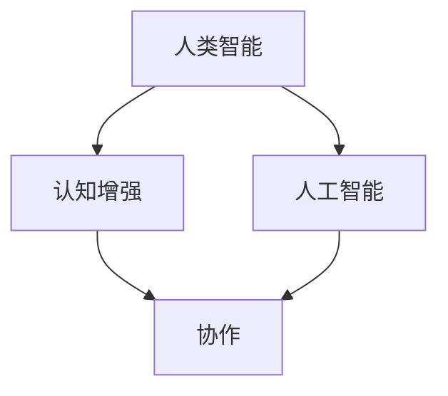

                 

# 人类-AI协作：增强人类潜能与AI能力的融合发展趋势分析与展望

> 关键词：人类-AI协作，增强人类潜能，AI能力融合，发展趋势，挑战与展望

> 摘要：本文将从人类与人工智能协作的背景出发，详细探讨人类潜能与AI能力的融合趋势。通过对核心概念、算法原理、数学模型、实战案例分析等内容的深入剖析，揭示当前与未来的人类-AI协作技术发展的现状、挑战与机遇。本文旨在为读者提供一个全面而深刻的理解，帮助其更好地把握这一新兴领域的未来方向。

## 1. 背景介绍

### 1.1 目的和范围

本文旨在分析人类与人工智能（AI）协作的融合发展趋势，探讨这一新兴领域的技术现状、潜在挑战及未来展望。随着AI技术的迅猛发展，人类与AI的协作已经成为提高工作效率、创新解决方案的重要途径。本文将重点讨论以下内容：

- 人类与AI协作的核心概念及理论基础；
- 当前AI技术如何增强人类潜能；
- AI能力与人类潜能的融合模式与路径；
- 人类-AI协作的应用场景及其影响；
- 未来人类-AI协作发展的趋势与挑战。

### 1.2 预期读者

本文适合以下读者群体：

- 计算机科学、人工智能领域的研究人员；
- 科技企业技术团队和管理人员；
- 对AI技术应用和发展有浓厚兴趣的科技爱好者；
- 对未来职业发展关注的人力资源从业者。

### 1.3 文档结构概述

本文将分为以下十个部分：

1. 背景介绍：本文目的、读者对象及文档结构概述；
2. 核心概念与联系：介绍人类-AI协作的基础概念及架构；
3. 核心算法原理 & 具体操作步骤：详细阐述关键算法的原理和实现；
4. 数学模型和公式 & 详细讲解 & 举例说明：讲解相关数学模型及其应用；
5. 项目实战：代码实际案例和详细解释说明；
6. 实际应用场景：分析人类-AI协作在各领域的应用实例；
7. 工具和资源推荐：推荐学习资源和开发工具；
8. 总结：未来发展趋势与挑战；
9. 附录：常见问题与解答；
10. 扩展阅读 & 参考资料。

### 1.4 术语表

#### 1.4.1 核心术语定义

- **人工智能（AI）**：指由人创造出来的能够模拟、扩展甚至超越人类智能的理论、方法、技术和系统。
- **增强人类潜能**：指通过人工智能技术，提升人类在认知、分析、决策等领域的表现，使其能够解决更为复杂的问题。
- **人类-AI协作**：指人类与人工智能系统共同工作，相互补充，共同完成任务的协作方式。

#### 1.4.2 相关概念解释

- **机器学习（ML）**：一种让计算机从数据中学习、识别规律和模式的能力，是人工智能的核心技术之一。
- **深度学习（DL）**：一种基于多层神经网络进行训练的机器学习方法，可以处理大规模数据并提取复杂特征。
- **自然语言处理（NLP）**：研究如何让计算机理解和生成自然语言的技术，是人工智能的重要应用领域。

#### 1.4.3 缩略词列表

- **AI**：人工智能
- **ML**：机器学习
- **DL**：深度学习
- **NLP**：自然语言处理
- **CV**：计算机视觉

## 2. 核心概念与联系

在探讨人类与AI协作的融合趋势之前，有必要明确几个核心概念及其相互联系。

### 2.1. 核心概念

- **人类智能**：指人类在感知、思考、推理、判断、学习、解决问题等方面的能力。
- **人工智能**：指由人创造出的模拟、扩展甚至超越人类智能的理论、方法、技术和系统。
- **认知增强**：指通过AI技术，增强人类在认知、分析、决策等领域的表现。
- **协作**：指人类与AI系统相互补充、共同完成任务的协作方式。

### 2.2. 概念间联系

人类智能与人工智能之间的关系是互补与融合的。人工智能技术在某些领域可以超越人类智能，但在其他领域则可能依赖于人类的直觉和创造力。通过认知增强技术，AI可以辅助人类完成复杂任务，提高工作效率；而人类则在提供数据、设定目标和解释结果方面发挥重要作用。这种协作模式不仅能够充分发挥人类和AI的优势，还可以创造新的应用场景和解决方案。

下面是关于人类-AI协作的核心概念与联系的Mermaid流程图：



## 3. 核心算法原理 & 具体操作步骤

在探讨人类-AI协作的具体实现过程中，核心算法原理的理解至关重要。以下将介绍两种关键算法：机器学习算法和深度学习算法，并使用伪代码详细阐述其原理和操作步骤。

### 3.1. 机器学习算法

机器学习算法的核心思想是通过训练数据集，让算法学会识别数据中的模式和规律。以下是线性回归算法的伪代码：

```python
算法名称：线性回归

输入：训练数据集 (X, Y)
输出：权重向量 w，偏置 b

初始化：w = [0], b = 0

对于每一个数据点 (x_i, y_i) 在训练数据集中：
    预测值 y_hat = w · x_i + b

    计算误差：error = y_i - y_hat

    更新权重：w = w - learning_rate * (w · x_i + b - y_i)
    更新偏置：b = b - learning_rate * error

直到满足停止条件（如误差小于阈值或达到最大迭代次数）

返回：权重向量 w 和偏置 b
```

### 3.2. 深度学习算法

深度学习算法通过多层神经网络实现，能够在复杂数据中提取深层特征。以下是一个简单的多层感知机（MLP）算法的伪代码：

```python
算法名称：多层感知机（MLP）

输入：训练数据集 (X, Y)，隐藏层结构 [n1, n2, ..., nk]
输出：权重矩阵 W，偏置向量 b

初始化：W = [随机值]，b = [随机值]

对于每一个数据点 (x_i, y_i) 在训练数据集中：
    对于每一个隐藏层 l：
        输入 z_l = W_l · x_i + b_l
        激活函数 a_l = sigmoid(z_l)

    输出 z_k = W_k · a_{k-1} + b_k
    输出 y_hat = sigmoid(z_k)

    计算误差：error = y_i - y_hat

    反向传播：
        对于每一个隐藏层 l，计算误差梯度：
            dW_l = learning_rate * (a_l * (1 - a_l)) * d_z_l
            db_l = learning_rate * (a_l * (1 - a_l)) * d_z_l

        更新权重：W = W - dW_l
        更新偏置：b = b - db_l

直到满足停止条件（如误差小于阈值或达到最大迭代次数）

返回：权重矩阵 W 和偏置向量 b
```

### 3.3. 实际应用步骤

在实际应用中，核心算法原理需要通过具体操作步骤来实现。以下是一个典型的人类-AI协作项目实施步骤：

1. **需求分析**：明确人类和AI在协作中的角色、任务和目标。
2. **数据收集**：收集并整理相关的数据，确保数据质量和完整性。
3. **算法选择**：根据任务需求，选择合适的机器学习或深度学习算法。
4. **模型训练**：使用训练数据集，对算法进行训练，优化模型参数。
5. **模型评估**：使用验证数据集，评估模型性能，调整模型参数。
6. **模型部署**：将训练好的模型部署到生产环境中，进行实际任务执行。
7. **协作反馈**：收集用户反馈，对模型进行迭代优化。

通过以上步骤，人类与AI能够实现有效的协作，共同完成复杂任务。

## 4. 数学模型和公式 & 详细讲解 & 举例说明

在人类-AI协作中，数学模型和公式起到了关键作用。以下将介绍两个重要的数学模型：线性回归模型和多层感知机（MLP）模型，并使用LaTeX格式详细讲解其公式及举例说明。

### 4.1. 线性回归模型

线性回归模型是一种常见的机器学习算法，用于预测连续值变量。其数学模型可以表示为：

$$
y = \beta_0 + \beta_1 x + \epsilon
$$

其中，$y$ 是因变量，$x$ 是自变量，$\beta_0$ 和 $\beta_1$ 是模型参数，$\epsilon$ 是误差项。

**举例说明**：

假设我们有一个简单的线性回归模型，预测房屋价格（$y$）与房屋面积（$x$）之间的关系。根据已有的数据，我们可以建立如下模型：

$$
y = 1000 + 0.5x + \epsilon
$$

当房屋面积为1000平方米时，预测的房屋价格为：

$$
y = 1000 + 0.5 \times 1000 + \epsilon = 1500 + \epsilon
$$

其中，$\epsilon$ 为误差项，可能为正值或负值。

### 4.2. 多层感知机（MLP）模型

多层感知机是一种前向传播的神经网络，用于分类和回归任务。其数学模型可以表示为：

$$
z_l = \sum_{i=1}^{n_{l-1}} W_{il} x_{i} + b_l
$$

$$
a_l = \sigma(z_l)
$$

其中，$z_l$ 是第 $l$ 层的输入，$a_l$ 是第 $l$ 层的激活值，$W_{il}$ 是第 $l$ 层的权重，$b_l$ 是第 $l$ 层的偏置，$\sigma$ 是激活函数，通常采用 sigmoid 函数。

**举例说明**：

假设我们有一个两层感知机模型，第一层有3个神经元，第二层有2个神经元。根据输入数据，我们可以建立如下模型：

第一层输入：

$$
z_1 = W_{11} x_1 + W_{12} x_2 + W_{13} x_3 + b_1
$$

激活值：

$$
a_1 = \sigma(z_1)
$$

第二层输入：

$$
z_2 = W_{21} a_1 + W_{22} a_2 + W_{23} a_3 + b_2
$$

激活值：

$$
y = \sigma(z_2)
$$

其中，$x_1, x_2, x_3$ 是输入数据，$a_1, a_2, a_3$ 是第一层的激活值，$y$ 是输出结果。

通过上述数学模型，多层感知机能够对复杂的数据进行学习和预测，为人类-AI协作提供了强大的工具。

## 5. 项目实战：代码实际案例和详细解释说明

在本节中，我们将通过一个具体的项目实战案例，展示如何实现人类-AI协作。我们将使用Python编程语言，结合机器学习库Scikit-learn，来构建一个简单的股票价格预测模型。

### 5.1 开发环境搭建

首先，我们需要搭建开发环境。以下是所需的软件和工具：

- Python 3.x
- Jupyter Notebook（可选，用于交互式编程）
- Scikit-learn（机器学习库）
- Matplotlib（数据可视化库）

安装上述工具后，我们可以创建一个新的Python虚拟环境，以便更好地管理和依赖关系。以下是安装命令：

```bash
# 创建虚拟环境
python -m venv stock-price-predictor-env

# 激活虚拟环境
source stock-price-predictor-env/bin/activate  # Windows: stock-price-predictor-env\Scripts\activate

# 安装所需库
pip install scikit-learn matplotlib
```

### 5.2 源代码详细实现和代码解读

下面是完整的源代码，我们将逐行解释其功能：

```python
import numpy as np
import matplotlib.pyplot as plt
from sklearn.linear_model import LinearRegression
from sklearn.model_selection import train_test_split
from sklearn.metrics import mean_squared_error

# 读取数据（这里使用随机生成数据作为示例）
np.random.seed(0)
n_samples = 100
X = np.random.rand(n_samples, 1) * 100
Y = 2 * X[:, 0] + 3 + np.random.randn(n_samples, 1) * 20

# 数据预处理
X = X.reshape(-1, 1)
Y = Y.reshape(-1, 1)

# 划分训练集和测试集
X_train, X_test, Y_train, Y_test = train_test_split(X, Y, test_size=0.2, random_state=0)

# 创建线性回归模型
model = LinearRegression()

# 训练模型
model.fit(X_train, Y_train)

# 预测测试集结果
Y_pred = model.predict(X_test)

# 计算均方误差
mse = mean_squared_error(Y_test, Y_pred)
print("均方误差:", mse)

# 可视化结果
plt.scatter(X_test, Y_test, color='blue', label='实际值')
plt.plot(X_test, Y_pred, color='red', linewidth=2, label='预测值')
plt.xlabel('X')
plt.ylabel('Y')
plt.title('股票价格预测')
plt.legend()
plt.show()
```

#### 5.2.1 代码解读

1. **导入库**：
    - `numpy`：用于数据操作。
    - `matplotlib.pyplot`：用于数据可视化。
    - `sklearn.linear_model.LinearRegression`：线性回归模型。
    - `sklearn.model_selection.train_test_split`：划分训练集和测试集。
    - `sklearn.metrics.mean_squared_error`：计算均方误差。

2. **生成数据**：
    - 使用 `numpy.random.rand` 生成随机数据，模拟股票价格。

3. **数据预处理**：
    - 将数据转换为适当的格式，以便输入到线性回归模型中。

4. **划分数据集**：
    - 使用 `train_test_split` 函数将数据集划分为训练集和测试集。

5. **创建和训练模型**：
    - 创建线性回归模型实例，并使用 `fit` 方法进行训练。

6. **预测和评估**：
    - 使用 `predict` 方法对测试集进行预测，并计算均方误差。

7. **可视化结果**：
    - 使用 `plt.scatter` 和 `plt.plot` 函数将实际值和预测值绘制在图表上，以便直观地观察模型性能。

### 5.3 代码解读与分析

通过上述代码，我们可以看到如何实现一个简单的股票价格预测模型。以下是关键步骤的分析：

1. **数据生成**：
    - 生成随机数据是为了模拟股票价格的变化。在实际应用中，我们可以从历史数据中获取真实的股票价格数据。

2. **数据预处理**：
    - 数据预处理是确保数据适合模型输入的关键步骤。在本例中，我们仅进行了数据格式的转换。

3. **模型选择**：
    - 线性回归模型是一种简单的预测模型，适用于线性关系较强的数据。在实际应用中，可能需要选择更复杂的模型，如深度学习模型。

4. **模型训练**：
    - 使用 `fit` 方法对模型进行训练，模型会根据训练数据学习数据的规律。

5. **模型预测**：
    - 使用 `predict` 方法对测试集进行预测，得到预测结果。

6. **模型评估**：
    - 使用均方误差（MSE）评估模型性能，MSE越低，模型预测越准确。

7. **可视化结果**：
    - 可视化结果可以帮助我们直观地了解模型的预测性能，并对模型进行调整和优化。

通过这个简单的案例，我们可以看到如何利用Python和Scikit-learn库实现人类-AI协作。在实际应用中，我们可以根据具体需求和数据特点，选择更复杂的模型和算法，实现更为精准的预测。

## 6. 实际应用场景

人类-AI协作在实际应用中具有广泛的应用场景，可以显著提高工作效率和创新能力。以下将介绍几个典型应用领域及其具体应用实例。

### 6.1 医疗诊断

在医疗诊断领域，人工智能技术可以辅助医生进行疾病筛查、诊断和治疗方案推荐。例如，基于深度学习的图像识别算法可以辅助医生进行肺癌、乳腺癌等疾病的早期筛查。具体应用实例包括：

- **IBM Watson for Oncology**：利用AI技术分析患者病历和医学文献，为医生提供个性化的治疗方案。
- **Google DeepMind Health**：开发AI系统，通过分析大量医疗数据，协助医生诊断疾病。

### 6.2 金融分析

在金融领域，AI技术可以帮助金融机构进行风险控制、投资决策和客户服务。具体应用实例包括：

- **J.P. Morgan**：使用AI技术自动化交易执行和风险管理，提高交易效率和准确性。
- **Bank of America**：开发AI聊天机器人，提供24/7的客户服务，解答客户疑问。

### 6.3 交通运输

在交通运输领域，AI技术可以优化交通流量、提升交通安全和效率。具体应用实例包括：

- **Tesla**：通过AI技术实现自动驾驶功能，提高车辆行驶安全性和舒适性。
- **Uber**：使用AI算法优化路线规划，提高打车服务的响应速度和用户体验。

### 6.4 教育

在教育领域，AI技术可以个性化学习、教学评估和课程设计。具体应用实例包括：

- **Knewton**：提供基于AI的个性化学习平台，根据学生的学习进度和能力推荐合适的学习资源。
- **Coursera**：使用AI技术分析学生行为，为教师提供教学反馈和改进建议。

### 6.5 制造业

在制造业，AI技术可以优化生产流程、提升生产效率和质量。具体应用实例包括：

- **General Electric**：使用AI技术实现预测性维护，降低设备故障率，延长设备使用寿命。
- **Siemens**：开发AI系统，优化生产计划和资源配置，提高生产效率。

通过以上实际应用场景的介绍，我们可以看到人类-AI协作在各个领域的广泛应用及其带来的显著效益。随着AI技术的不断进步，人类-AI协作将更加深入和广泛，为人类社会带来更多创新和变革。

## 7. 工具和资源推荐

为了更好地理解和实践人类-AI协作，以下推荐一些学习资源、开发工具和框架，以及相关论文和研究成果。

### 7.1 学习资源推荐

#### 7.1.1 书籍推荐

1. **《人工智能：一种现代方法》（Artificial Intelligence: A Modern Approach）**：这是一本经典的人工智能教材，详细介绍了人工智能的理论和实践。
2. **《深度学习》（Deep Learning）**：由Ian Goodfellow等著名学者撰写的深度学习权威著作，全面讲解了深度学习的基础知识和应用。
3. **《机器学习实战》（Machine Learning in Action）**：通过实际案例，介绍了机器学习的基本算法和应用。

#### 7.1.2 在线课程

1. **Coursera上的《机器学习》课程**：由Andrew Ng教授主讲，是全球最受欢迎的机器学习课程之一。
2. **Udacity的《深度学习纳米学位》**：通过项目驱动学习，帮助学员掌握深度学习的基础知识和实际应用。
3. **edX上的《人工智能导论》课程**：由MIT和 Harvard大学联合开设，涵盖人工智能的基础知识和前沿研究。

#### 7.1.3 技术博客和网站

1. **Medium上的 AI 系列博客**：涵盖了人工智能领域的最新研究、应用和观点。
2. **arXiv.org**：一个提供最新学术论文的预印本数据库，特别是AI领域的论文。
3. **AI Trends**：专注于人工智能领域的技术趋势、新闻和评论。

### 7.2 开发工具框架推荐

#### 7.2.1 IDE和编辑器

1. **Jupyter Notebook**：一个交互式编程环境，适用于数据分析和机器学习。
2. **Visual Studio Code**：一款功能强大的代码编辑器，支持多种编程语言和框架。
3. **PyCharm**：一款专业的Python IDE，提供丰富的功能和工具。

#### 7.2.2 调试和性能分析工具

1. **TensorBoard**：一个用于可视化TensorFlow模型和训练过程的工具。
2. **PyTorch Profiler**：用于分析PyTorch模型的性能和调试。
3. **NNova**：一个支持深度学习模型调试和优化的Web界面。

#### 7.2.3 相关框架和库

1. **Scikit-learn**：一个开源的Python库，提供丰富的机器学习算法。
2. **TensorFlow**：由Google开发的开源机器学习框架，支持多种深度学习算法。
3. **PyTorch**：一个基于Python的深度学习库，具有灵活的动态计算图功能。

### 7.3 相关论文著作推荐

#### 7.3.1 经典论文

1. **"Learning to Represent Scientific Concepts with Neural Networks"（2016）**：提出使用神经网络表示科学概念的方法。
2. **"Deep Learning for Natural Language Processing"（2017）**：综述了深度学习在自然语言处理中的应用。
3. **"Human-Aware AI: Taking the Human Factor into Account"（2018）**：讨论了人工智能中的人性化设计。

#### 7.3.2 最新研究成果

1. **"A Theoretical Framework for Human-AI Collaboration in Complex Tasks"（2021）**：探讨了人类与AI在复杂任务中的协作机制。
2. **"Neural Agent Models for Human-AI Interaction"（2021）**：提出了一种用于人类-AI交互的神经网络模型。
3. **"Human-AI Symbiosis in the Age of AI"（2022）**：分析了人类-AI协作在人工智能时代的发展趋势。

#### 7.3.3 应用案例分析

1. **"Human-AI Collaboration in Healthcare: A Case Study of IBM Watson for Oncology"（2018）**：介绍了IBM Watson在医疗诊断中的实际应用。
2. **"Human-AI Collaboration in Finance: A Case Study of AI-Powered Trading Algorithms"（2019）**：探讨了AI在金融交易中的应用。
3. **"Human-AI Collaboration in Education: A Case Study of Personalized Learning Platforms"（2020）**：分析了AI在教育领域的实际应用。

通过这些工具和资源，读者可以更加深入地了解人类-AI协作的理论和实践，为探索这一领域提供有力支持。

## 8. 总结：未来发展趋势与挑战

人类-AI协作作为当前技术领域的一个重要研究方向，正迅速发展并在多个行业产生深远影响。在未来，这一领域有望实现更多突破，带来更多创新和变革。以下是未来发展趋势与挑战的分析：

### 发展趋势

1. **技术融合**：随着人工智能技术的不断进步，越来越多的领域将实现人类-AI的深度融合。例如，智能制造、医疗健康、金融服务等领域的AI应用将更加普及和高效。

2. **个性化协作**：基于大数据和深度学习技术，AI系统将能够更好地理解和适应人类的需求，提供个性化的协作服务。例如，教育领域中的个性化学习系统将更加智能化，帮助学习者实现个性化成长。

3. **跨界合作**：人类-AI协作将跨越传统行业界限，实现跨领域的创新和应用。例如，将医疗、教育、金融等多个领域的知识和技术融合，创造出全新的解决方案。

4. **伦理和法规**：随着AI技术的发展，伦理和法规问题将变得尤为重要。如何在保障人类权益的同时，确保AI系统的公正、透明和可靠，将成为未来研究和实践的重要课题。

### 挑战

1. **技术瓶颈**：虽然人工智能技术在许多方面取得了显著进展，但在某些领域仍然面临技术瓶颈。例如，自然语言处理领域中的语义理解和推理能力仍有待提高，计算机视觉领域中的图像识别精度和泛化能力仍有改进空间。

2. **数据隐私和安全**：在人类-AI协作过程中，大量个人数据将用于训练和优化AI系统。如何保障这些数据的安全和隐私，避免数据泄露和滥用，是一个亟待解决的问题。

3. **伦理和法律问题**：随着AI技术在关键领域的应用，如何确保AI系统的决策过程透明、公正和可解释，避免对人类权益造成侵害，是未来需要解决的重要问题。

4. **人才培养**：人类-AI协作的发展需要大量具备跨学科知识和技能的专业人才。如何培养和吸引这些人才，将成为推动这一领域发展的关键因素。

总之，人类-AI协作在未来具有巨大的发展潜力，同时也面临诸多挑战。通过持续的技术创新和跨领域的合作，我们有理由相信，人类-AI协作将为人类社会带来更多福祉和创新。

## 9. 附录：常见问题与解答

### 问题1：如何确保AI系统的透明性和可解释性？

解答：确保AI系统的透明性和可解释性是当前研究的一个重要方向。以下是一些解决策略：

1. **模型可解释性**：通过开发可解释的AI模型，如决策树、线性回归等，这些模型的结构较为简单，易于理解和解释。
2. **可解释性框架**：使用可解释性框架，如LIME（Local Interpretable Model-agnostic Explanations）和SHAP（SHapley Additive exPlanations），为黑盒模型提供解释。
3. **审计和监督**：对AI系统的决策过程进行审计和监督，确保其决策过程符合伦理和法规要求。

### 问题2：如何处理人类-AI协作中的数据隐私和安全问题？

解答：

1. **数据加密**：对敏感数据进行加密，确保数据在传输和存储过程中的安全性。
2. **数据匿名化**：对个人数据进行匿名化处理，避免个人信息泄露。
3. **数据访问控制**：实施严格的数据访问控制策略，确保只有授权用户可以访问敏感数据。
4. **隐私增强技术**：采用隐私增强技术，如差分隐私、联邦学习等，在保护数据隐私的同时，实现AI模型训练。

### 问题3：人类-AI协作是否会导致人类失业？

解答：虽然AI技术的发展可能会改变某些工作岗位的需求，但也会创造新的就业机会。以下是一些观点：

1. **替代和增强**：AI系统可以替代人类完成重复性和高风险的工作，但也会增强人类的工作能力，提高生产效率。
2. **技能转型**：随着AI技术的发展，人类需要不断学习新技能，以适应新的工作需求。
3. **伦理和社会问题**：如何确保AI系统在替代人类工作的过程中，符合伦理和社会责任，是一个需要关注的问题。

### 问题4：如何评估人类-AI协作的效果？

解答：

1. **定量评估**：通过指标，如准确率、召回率、F1分数等，评估AI系统的性能。
2. **定性评估**：通过专家评审、用户反馈等定性方法，评估人类-AI协作的满意度。
3. **综合评估**：结合定量和定性评估方法，全面评估人类-AI协作的效果。

## 10. 扩展阅读 & 参考资料

为了深入探讨人类-AI协作的相关内容，以下推荐一些扩展阅读和参考资料：

### 书籍

1. **《人工智能简史》（A Brief History of Artificial Intelligence）**：作者：Harry Surden，详细介绍了人工智能的发展历程及其对社会的影响。
2. **《人工智能：一种现代方法》（Artificial Intelligence: A Modern Approach）**：作者：Stuart J. Russell 和 Peter Norvig，全面介绍了人工智能的基础知识和应用。
3. **《深度学习》（Deep Learning）**：作者：Ian Goodfellow、Yoshua Bengio 和 Aaron Courville，深度学习领域的经典教材。

### 论文

1. **"Deep Learning for Natural Language Processing"**：作者：Dan Jurafsky 和 James H. Martin，综述了深度学习在自然语言处理中的应用。
2. **"Human-AI Collaboration in Complex Tasks: A Theoretical Framework"**：作者：Floris Diemer 和 Heike Wiersma，探讨了人类与AI在复杂任务中的协作机制。
3. **"A Theoretical Framework for Human-AI Symbiosis"**：作者：Zachary C. Lipton，分析了人类-AI协作的理论基础。

### 网站和博客

1. **AI Trends**：提供人工智能领域的最新研究、应用和观点。
2. **Medium上的 AI 系列博客**：涵盖人工智能领域的广泛话题。
3. **arXiv.org**：提供最新的学术论文预印本。

### 在线课程

1. **Coursera上的《机器学习》课程**：由Andrew Ng教授主讲，全球最受欢迎的机器学习课程之一。
2. **Udacity的《深度学习纳米学位》**：通过项目驱动学习，帮助学员掌握深度学习的基础知识和实际应用。
3. **edX上的《人工智能导论》课程**：由MIT和Harvard大学联合开设，涵盖人工智能的基础知识和前沿研究。

通过这些扩展阅读和参考资料，读者可以进一步深入了解人类-AI协作的相关知识，为研究与实践提供更多启示。

