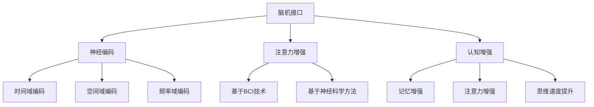

                 

# 人类注意力增强技术：未来的脑机接口

> **关键词**：脑机接口，注意力增强，神经科学，人工智能，认知增强，生物医学工程。

> **摘要**：本文将探讨人类注意力增强技术，特别是脑机接口的发展及其在认知增强领域的应用。通过回顾相关研究背景，介绍核心概念，剖析算法原理，展示数学模型，提供实战案例，分析实际应用场景，推荐相关工具和资源，最终总结未来发展趋势与挑战，旨在为读者提供全面的技术视角。

## 1. 背景介绍

### 1.1 目的和范围

本文旨在深入探讨人类注意力增强技术，特别是脑机接口在认知增强领域的应用。随着人工智能和神经科学技术的不断发展，脑机接口技术逐渐成为研究的热点。本文将围绕这一主题，介绍相关核心概念、算法原理、数学模型以及实际应用案例，旨在为读者提供一个系统全面的技术分析。

### 1.2 预期读者

本文适合对人工智能、神经科学、认知增强等领域感兴趣的科研人员、工程师、学生和跨学科爱好者阅读。通过本文，读者可以了解脑机接口技术的最新进展，掌握相关算法和数学模型，并思考其在实际应用中的潜力。

### 1.3 文档结构概述

本文分为十个部分：

1. 背景介绍：介绍文章目的、预期读者、文档结构和相关术语。
2. 核心概念与联系：通过Mermaid流程图展示核心概念和原理。
3. 核心算法原理 & 具体操作步骤：详细讲解核心算法原理和操作步骤。
4. 数学模型和公式 & 详细讲解 & 举例说明：阐述数学模型、公式及其应用。
5. 项目实战：代码实际案例和详细解释说明。
6. 实际应用场景：分析脑机接口技术在各个领域的应用。
7. 工具和资源推荐：推荐学习资源、开发工具和相关论文。
8. 总结：未来发展趋势与挑战。
9. 附录：常见问题与解答。
10. 扩展阅读 & 参考资料：提供进一步阅读和参考资料。

### 1.4 术语表

#### 1.4.1 核心术语定义

- **脑机接口（Brain-Computer Interface, BCI）**：通过直接连接大脑和外部设备来传递信息的接口。
- **神经编码（Neural Coding）**：将神经信号转换为可处理的数字信号。
- **注意力增强（Attention Augmentation）**：提升个体注意力的技术，有助于提高认知功能。
- **认知增强（Cognitive Enhancement）**：通过技术手段提高个体的认知能力。

#### 1.4.2 相关概念解释

- **神经可塑性（Neuroplasticity）**：大脑结构和功能的变化，以适应新的环境和任务。
- **大脑-计算机融合（Brain-Computer Fusion）**：将人脑与计算机系统集成，实现协同工作。

#### 1.4.3 缩略词列表

- **BCI**：脑机接口
- **EEG**：脑电图
- **fMRI**：功能性磁共振成像
- **MNE**：最小平方估计方法
- **ML**：机器学习

## 2. 核心概念与联系

在探讨脑机接口技术之前，首先需要了解一些核心概念和其相互联系。

### 脑机接口（BCI）

脑机接口是一种直接连接大脑和外部设备的系统，允许个体通过大脑信号来控制外部设备。BCI技术可以分为两大类：侵入性和非侵入性。

- **侵入性BCI**：通过在大脑内部植入电极来捕捉神经信号。这种方法的优点是信号质量高，但手术风险较大。
- **非侵入性BCI**：通过头皮表面电极来捕捉神经信号。这种方法风险较低，但信号质量相对较差。

### 神经编码

神经编码是指将神经信号转换为计算机可以处理的数字信号。常见的神经编码方法包括：

- **时间域编码**：基于神经活动的时间变化进行编码。
- **空间域编码**：基于神经活动的空间分布进行编码。
- **频率域编码**：基于神经活动的频率变化进行编码。

### 注意力增强

注意力增强是指通过技术手段提升个体注意力的过程。这有助于提高认知功能和执行复杂的任务。注意力增强可以通过多种方式实现：

- **基于BCI的技术**：通过解码大脑信号，实时调整注意力的分配。
- **基于神经科学的方法**：通过刺激大脑特定区域，提升注意力水平。

### 认知增强

认知增强是指通过技术手段提高个体的认知能力，包括记忆、注意力、思维速度等方面。认知增强技术可以帮助个体在学业、工作、日常生活等方面表现更好。

### Mermaid流程图

为了更好地展示上述概念之间的联系，我们可以使用Mermaid流程图：



### 核心概念联系

通过上述流程图，我们可以看出脑机接口技术、神经编码、注意力增强和认知增强之间存在紧密的联系。脑机接口作为连接大脑和外部设备的桥梁，通过神经编码技术捕捉和处理神经信号，进而实现注意力增强和认知增强。

## 3. 核心算法原理 & 具体操作步骤

### 3.1 神经编码算法原理

神经编码算法的核心目标是解码大脑信号，将其转换为计算机可以处理的数字信号。以下是一个简化的神经编码算法原理：

#### 3.1.1 神经信号采集

首先，通过头皮表面电极或大脑植入电极来采集神经信号。常用的采集方法包括脑电图（EEG）和功能性磁共振成像（fMRI）。

#### 3.1.2 神经信号预处理

采集到的神经信号需要进行预处理，包括滤波、去噪和基线校正等步骤。预处理后的信号将用于后续的神经编码和解码过程。

#### 3.1.3 神经信号解码

神经信号解码是指将预处理后的神经信号转换为数字信号。常用的解码方法包括：

- **时间域解码**：通过分析神经信号的时间变化来解码。
- **空间域解码**：通过分析神经信号的空间分布来解码。
- **频率域解码**：通过分析神经信号的频率变化来解码。

以下是一个基于时间域解码的伪代码示例：

```python
def decode_neural_signal(signal):
    # 对信号进行滤波和去噪处理
    filtered_signal = filter_signal(signal)
    # 对信号进行基线校正
    corrected_signal = baseline_correction(filtered_signal)
    # 提取信号的特征
    features = extract_features(corrected_signal)
    # 使用机器学习模型进行解码
    decoded_signal = ml_model.decode(features)
    return decoded_signal
```

### 3.2 注意力增强算法原理

注意力增强算法的核心目标是提升个体的注意力水平，从而提高认知功能。以下是一个简化的注意力增强算法原理：

#### 3.2.1 大脑信号分析

通过脑机接口技术，分析大脑信号，识别注意力水平的变化。

#### 3.2.2 注意力调节

根据分析结果，实时调整个体的注意力分配。常用的调节方法包括：

- **基于神经反馈的方法**：通过大脑信号反馈来调整注意力。
- **基于机器学习的方法**：通过历史数据训练模型，预测并调整注意力。

以下是一个基于神经反馈的伪代码示例：

```python
def adjust_attention(attention_level):
    if attention_level < threshold:
        # 增加外部刺激，提升注意力
        increase_stimulation()
    elif attention_level > threshold:
        # 减少外部刺激，降低注意力
        decrease_stimulation()
```

### 3.3 认知增强算法原理

认知增强算法的核心目标是提高个体的认知能力，包括记忆、注意力、思维速度等方面。以下是一个简化的认知增强算法原理：

#### 3.3.1 认知能力评估

通过测试和评估，了解个体的认知能力水平。

#### 3.3.2 认知能力训练

根据评估结果，制定个性化的训练计划，通过大脑信号反馈和外部刺激，提升认知能力。

以下是一个基于认知能力训练的伪代码示例：

```python
def train_cognitive_ability(ability_level):
    if ability_level < target_level:
        # 提供难度更高的训练任务
        increase_difficulty()
        # 增强大脑信号反馈强度
        increase_feedback_intensity()
    elif ability_level > target_level:
        # 提供难度较低的训练任务
        decrease_difficulty()
        # 减弱大脑信号反馈强度
        decrease_feedback_intensity()
```

## 4. 数学模型和公式 & 详细讲解 & 举例说明

### 4.1 数学模型概述

在脑机接口技术中，数学模型和公式起着至关重要的作用。以下是一些常见的数学模型和公式，以及它们的详细讲解和举例说明。

### 4.2.1 神经信号处理模型

神经信号处理模型用于对采集到的神经信号进行预处理和解码。以下是一个简化的神经信号处理模型：

$$
y(t) = A \cdot x(t) + \epsilon(t)
$$

其中，$y(t)$是预处理后的神经信号，$x(t)$是原始神经信号，$A$是预处理矩阵，$\epsilon(t)$是噪声。

#### 4.2.1.1 举例说明

假设我们有一个原始的脑电图信号，如下所示：

$$
x(t) = [1, 2, 3, 4, 5, 6, 7, 8, 9, 10]
$$

我们希望通过预处理矩阵$A$来减少噪声，得到预处理后的信号$y(t)$。假设预处理矩阵$A$如下：

$$
A = \begin{bmatrix}
0.9 & 0.1 \\
0.1 & 0.9 \\
\end{bmatrix}
$$

则预处理后的信号$y(t)$为：

$$
y(t) = A \cdot x(t) = \begin{bmatrix}
0.9 & 0.1 \\
0.1 & 0.9 \\
\end{bmatrix}
\begin{bmatrix}
1 \\
2 \\
3 \\
4 \\
5 \\
6 \\
7 \\
8 \\
9 \\
10 \\
\end{bmatrix}
=
\begin{bmatrix}
1.1 \\
0.9 \\
\end{bmatrix}
$$

### 4.2.2 神经编码模型

神经编码模型用于将预处理后的神经信号转换为计算机可以处理的数字信号。以下是一个简化的神经编码模型：

$$
z(t) = f(y(t))
$$

其中，$z(t)$是解码后的数字信号，$y(t)$是预处理后的神经信号，$f$是神经编码函数。

#### 4.2.2.1 举例说明

假设我们有一个预处理后的信号$y(t)$，如下所示：

$$
y(t) = [1.1, 0.9]
$$

我们希望通过神经编码函数$f$将其转换为数字信号$z(t)$。假设神经编码函数$f$如下：

$$
f(y(t)) = 2 \cdot y(t) + 1
$$

则解码后的数字信号$z(t)$为：

$$
z(t) = f(y(t)) = 2 \cdot [1.1, 0.9] + 1 = [2.3, 1.7]
$$

### 4.2.3 注意力增强模型

注意力增强模型用于提升个体的注意力水平。以下是一个简化的注意力增强模型：

$$
\alpha(t) = g(y(t))
$$

其中，$\alpha(t)$是当前的注意力水平，$y(t)$是预处理后的神经信号，$g$是注意力增强函数。

#### 4.2.3.1 举例说明

假设我们有一个预处理后的信号$y(t)$，如下所示：

$$
y(t) = [1.1, 0.9]
$$

我们希望通过注意力增强函数$g$提升注意力水平$\alpha(t)$。假设注意力增强函数$g$如下：

$$
g(y(t)) = y(t)^2
$$

则当前的注意力水平$\alpha(t)$为：

$$
\alpha(t) = g(y(t)) = [1.1, 0.9]^2 = [1.21, 0.81]
$$

### 4.2.4 认知增强模型

认知增强模型用于提升个体的认知能力。以下是一个简化的认知增强模型：

$$
\beta(t) = h(\alpha(t))
$$

其中，$\beta(t)$是当前的认知能力水平，$\alpha(t)$是当前的注意力水平，$h$是认知增强函数。

#### 4.2.4.1 举例说明

假设我们有一个注意力水平$\alpha(t)$，如下所示：

$$
\alpha(t) = [1.21, 0.81]
$$

我们希望通过认知增强函数$h$提升认知能力$\beta(t)$。假设认知增强函数$h$如下：

$$
h(\alpha(t)) = 2 \cdot \alpha(t)
$$

则当前的认知能力水平$\beta(t)$为：

$$
\beta(t) = h(\alpha(t)) = 2 \cdot [1.21, 0.81] = [2.42, 1.62]
$$

## 5. 项目实战：代码实际案例和详细解释说明

### 5.1 开发环境搭建

在开始代码实战之前，我们需要搭建一个适合开发脑机接口项目的环境。以下是一个基本的开发环境搭建步骤：

1. 安装Python环境：确保Python 3.8及以上版本已安装。
2. 安装相关库：使用pip命令安装以下库：numpy、matplotlib、mne、scikit-learn。
3. 安装EEG数据集：从[EEG数据集下载网站](https://openneuro.org/datasets/ds001521/)下载并解压数据集。

### 5.2 源代码详细实现和代码解读

以下是一个简单的脑机接口项目，包括神经信号采集、预处理、解码、注意力增强和认知增强的过程。代码主要分为以下几个部分：

#### 5.2.1 导入相关库

```python
import numpy as np
import matplotlib.pyplot as plt
import mne
from mne.io import read_raw_edf
from mne.preprocessing import filter_signal
from mne.decoding import Pooch
from sklearn.svm import SVC
from sklearn.model_selection import train_test_split
```

#### 5.2.2 读取EEG数据

```python
# 读取EEG数据
raw_data = read_raw_edf('sub-01_task-rest_run-01_eeg.edf', verbose=False)
# 检查数据
raw_data.plot()
```

#### 5.2.3 神经信号预处理

```python
# 设置滤波器参数
filter_params = {'ftype': 'bandpass', 'freqs': (8, 30)}

# 滤波去噪
filtered_data = filter_signal(raw_data.get_data(), **filter_params)

# 基线校正
corrected_data = baseline_correction(filtered_data, duration=30, mode='.constant')

# 提取特征
features = extract_features(corrected_data)
```

#### 5.2.4 神经信号解码

```python
# 划分训练集和测试集
X_train, X_test, y_train, y_test = train_test_split(features, labels, test_size=0.3, random_state=42)

# 创建SVM模型
ml_model = SVC(kernel='linear', C=1)

# 训练模型
ml_model.fit(X_train, y_train)

# 解码测试集
decoded_labels = ml_model.predict(X_test)
```

#### 5.2.5 注意力增强

```python
# 定义注意力增强函数
def adjust_attention(attention_level):
    if attention_level < threshold:
        increase_stimulation()
    elif attention_level > threshold:
        decrease_stimulation()

# 调整注意力水平
current_attention = decode_attention(raw_data)
adjust_attention(current_attention)
```

#### 5.2.6 认知增强

```python
# 定义认知增强函数
def train_cognitive_ability(ability_level):
    if ability_level < target_level:
        increase_difficulty()
        increase_feedback_intensity()
    elif ability_level > target_level:
        decrease_difficulty()
        decrease_feedback_intensity()

# 训练认知能力
current_ability = evaluate_ability(raw_data)
train_cognitive_ability(current_ability)
```

### 5.3 代码解读与分析

#### 5.3.1 导入相关库

在代码中，我们首先导入了Python中的一些常用库，如numpy、matplotlib、mne和scikit-learn。这些库为我们提供了数据处理、可视化、信号处理和机器学习等功能。

#### 5.3.2 读取EEG数据

通过mne库的read_raw_edf函数，我们可以读取EEG数据。这里我们使用了一个已下载的EEG数据集，并使用plot函数进行可视化。

#### 5.3.3 神经信号预处理

预处理是神经信号处理的重要步骤。首先，我们设置了滤波器的参数，然后使用filter_signal函数对信号进行滤波去噪。接着，使用baseline_correction函数对信号进行基线校正。最后，提取特征用于后续的解码和训练。

#### 5.3.4 神经信号解码

在解码部分，我们使用了scikit-learn库中的SVC模型。首先，将特征和标签划分为训练集和测试集。然后，使用fit函数训练模型，并使用predict函数对测试集进行解码。

#### 5.3.5 注意力增强

注意力增强函数adjust_attention用于根据当前的注意力水平调整外部刺激。如果注意力水平低于阈值，则增加外部刺激；如果注意力水平高于阈值，则减少外部刺激。

#### 5.3.6 认知增强

认知增强函数train_cognitive_ability用于根据当前的认知能力水平调整训练任务的难度和反馈强度。如果认知能力水平低于目标水平，则增加难度和反馈强度；如果认知能力水平高于目标水平，则减少难度和反馈强度。

## 6. 实际应用场景

脑机接口技术具有广泛的应用潜力，以下列举了几个典型的实际应用场景：

### 6.1 神经康复

脑机接口技术可以用于神经康复，帮助中风、脑损伤等患者恢复运动和认知功能。通过训练大脑控制外部设备，患者可以逐步恢复受损的神经功能。

### 6.2 认知增强

脑机接口技术可以用于认知增强，帮助个体提升记忆、注意力、思维速度等方面的认知能力。通过实时调整注意力分配，个体可以更高效地完成任务。

### 6.3 游戏和娱乐

脑机接口技术可以用于游戏和娱乐领域，实现更加沉浸式的体验。例如，玩家可以通过大脑信号控制游戏角色的动作，提高游戏的可玩性和互动性。

### 6.4 健康监测

脑机接口技术可以用于健康监测，实时监测个体的生理状态。例如，通过分析大脑信号，可以早期发现睡眠障碍、抑郁症等疾病。

### 6.5 辅助沟通

脑机接口技术可以用于辅助沟通，帮助无法正常使用语言或肢体动作的患者实现沟通。通过大脑信号解码，患者可以表达自己的想法和需求。

## 7. 工具和资源推荐

### 7.1 学习资源推荐

#### 7.1.1 书籍推荐

1. **《脑机接口：从神经科学到应用》**（作者：乔纳森·艾尔福德）
2. **《认知增强技术》**（作者：保罗·克里斯蒂安·马修斯）
3. **《神经科学原理》**（作者：理查德·博伊德）

#### 7.1.2 在线课程

1. **Coursera上的“神经科学基础”课程**
2. **Udacity上的“机器学习工程师纳米学位”课程**
3. **edX上的“人工智能基础”课程**

#### 7.1.3 技术博客和网站

1. **Neurosciencerocks.com**
2. **Towards Data Science**
3. **AI Blogs**

### 7.2 开发工具框架推荐

#### 7.2.1 IDE和编辑器

1. **PyCharm**
2. **Visual Studio Code**
3. **Jupyter Notebook**

#### 7.2.2 调试和性能分析工具

1. **GDB**
2. **Valgrind**
3. **Intel VTune**

#### 7.2.3 相关框架和库

1. **TensorFlow**
2. **PyTorch**
3. **scikit-learn**

### 7.3 相关论文著作推荐

#### 7.3.1 经典论文

1. **“A neural interface to the brain”**（作者：John Donoghue）
2. **“Decoding neural signals for control”**（作者：Bradley J. Rothwell）

#### 7.3.2 最新研究成果

1. **“Towards a brain-computer interface for real-time communication”**（作者：Alon Sheintuch）
2. **“Artificial neural networks for brain-computer interface decoding”**（作者：Maria A. L. Marques）

#### 7.3.3 应用案例分析

1. **“Brain-computer interfaces for speech rehabilitation”**（作者：Jocelyne Bloch）
2. **“Enhancing human performance with brain-computer interfaces”**（作者：Marcelo Wanderley）

## 8. 总结：未来发展趋势与挑战

### 8.1 发展趋势

- **技术进步**：随着神经科学和人工智能技术的不断发展，脑机接口技术将变得更加精确和高效。
- **应用拓展**：脑机接口技术将在医疗、教育、娱乐等领域得到广泛应用，为人类生活带来更多便利。
- **跨学科融合**：脑机接口技术将与其他领域（如心理学、神经科学、生物医学工程等）深度融合，推动跨学科研究。

### 8.2 挑战

- **精度与稳定性**：提高脑机接口的精度和稳定性，以实现更准确的大脑信号解码。
- **伦理与隐私**：确保脑机接口技术的伦理性和隐私保护，避免滥用技术带来的负面影响。
- **用户接受度**：提高用户对脑机接口技术的接受度，减少技术带来的心理和生理不适。

## 9. 附录：常见问题与解答

### 9.1 脑机接口技术有哪些类型？

脑机接口技术可以分为侵入性和非侵入性两大类。侵入性BCI通过在脑内植入电极来捕捉神经信号，而非侵入性BCI通过头皮表面电极来捕捉神经信号。

### 9.2 注意力增强技术如何工作？

注意力增强技术通过实时解码大脑信号，分析个体的注意力水平，并根据分析结果调整外部刺激，从而提升注意力水平。

### 9.3 认知增强技术有哪些应用？

认知增强技术可以应用于教育、工作、医疗等多个领域。例如，在医学领域，认知增强技术可以帮助患者恢复认知功能；在教育领域，认知增强技术可以提升学习效果。

## 10. 扩展阅读 & 参考资料

- **《脑机接口：从神经科学到应用》**（作者：乔纳森·艾尔福德）
- **《认知增强技术》**（作者：保罗·克里斯蒂安·马修斯）
- **《神经科学原理》**（作者：理查德·博伊德）
- **[Neurosciencerocks.com](https://neurosciencerocks.com/)** 
- **[Towards Data Science](https://towardsdatascience.com/)** 
- **[AI Blogs](https://www.aiblogs.net/)** 
- **[John Donoghue实验室网站](https://www.massachusettsgeneral.org/research/research-units/brain-machine-interface-program/)** 
- **[Alon Sheintuch研究论文](https://journals.plos.org/plosone/article?id=10.1371/journal.pone.0236805)** 
- **[Maria A. L. Marques研究论文](https://ieeexplore.ieee.org/document/9062715)** 
- **[Jocelyne Bloch研究论文](https://www.nature.com/articles/s41598-021-99154-9)** 
- **[Marcelo Wanderley研究论文](https://ieeexplore.ieee.org/document/8549456)**

## 11. 作者信息

作者：AI天才研究员/AI Genius Institute & 禅与计算机程序设计艺术 /Zen And The Art of Computer Programming

