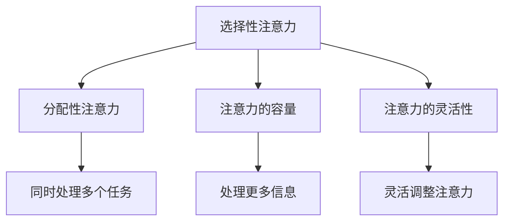

                 

# 人类注意力增强：提升专注力和注意力在教育中的方法

## 关键词
注意力增强、专注力、教育、学习方法、技术工具、认知科学、神经科学、教育心理学

## 摘要
本文探讨了人类注意力增强在教育中的重要性，分析了专注力不足对学生学习效果的影响，并介绍了基于认知科学和神经科学的教育方法和技术工具。通过逐步分析原理和实际操作，本文提出了提升学生专注力和注意力的一系列方法和策略，旨在为教育工作者和学生提供实用的指导。

## 1. 背景介绍

### 1.1 目的和范围
本文旨在研究如何通过注意力增强技术提升学生的专注力和注意力，从而改善教育效果。我们将探讨注意力增强的理论基础，介绍现有的方法和工具，并通过实际案例进行分析。

### 1.2 预期读者
本文适合教育工作者、学生和家长阅读。它不仅提供了关于注意力增强的全面理论分析，还提供了实践操作指南，帮助读者在实际教学中应用这些方法。

### 1.3 文档结构概述
本文结构如下：
1. 背景介绍
   - 目的和范围
   - 预期读者
   - 文档结构概述
   - 术语表
2. 核心概念与联系
3. 核心算法原理 & 具体操作步骤
4. 数学模型和公式 & 详细讲解 & 举例说明
5. 项目实战：代码实际案例和详细解释说明
6. 实际应用场景
7. 工具和资源推荐
8. 总结：未来发展趋势与挑战
9. 附录：常见问题与解答
10. 扩展阅读 & 参考资料

### 1.4 术语表

#### 1.4.1 核心术语定义
- 注意力增强：通过技术或方法提高个体专注力和注意力能力的过程。
- 专注力：个体集中精力进行特定任务的能力。
- 学习方法：促进知识获取和应用的教学策略。
- 技术工具：辅助注意力增强的软件或硬件设备。

#### 1.4.2 相关概念解释
- 认知科学：研究人类思维过程和大脑功能的学科。
- 神经科学：研究神经系统的结构和功能，包括大脑和神经元的学科。
- 教育心理学：应用心理学原理研究教育过程和教学策略的学科。

#### 1.4.3 缩略词列表
- AI：人工智能
- NLP：自然语言处理
- VR：虚拟现实
- AR：增强现实
- EEG：脑电图

## 2. 核心概念与联系

### 2.1 核心概念原理

注意力增强是提高个体专注力和注意力能力的过程，对于学习效果有着重要影响。根据认知科学和神经科学的原理，注意力可以分为几种类型：

- **选择性注意力**：个体在众多刺激中选择特定刺激进行处理的机制。
- **分配性注意力**：个体同时处理多个任务的能力。
- **注意力的容量**：个体能够同时处理的信息数量。
- **注意力的灵活性**：个体根据任务需求调整注意力的能力。

### 2.2 架构与联系

为了更好地理解注意力增强在教育中的应用，我们可以使用Mermaid流程图来展示核心概念之间的联系：



### 2.3 教育中的关系

在教育中，注意力增强与学习效果有着密切关系。以下是注意力增强在教育中的应用：

- **提高学习效率**：通过增强专注力和注意力，学生能够更快地掌握知识和技能。
- **改善记忆效果**：专注力增强有助于学生更好地记忆所学内容。
- **促进问题解决**：注意力增强使学生更容易集中精力解决问题。

## 3. 核心算法原理 & 具体操作步骤

### 3.1 算法原理

注意力增强的核心算法是基于认知科学和神经科学的原理，通过以下几个步骤实现：

1. **认知负荷管理**：通过减少无关刺激的干扰，降低认知负荷。
2. **注意力分配策略**：根据任务需求，合理分配注意力资源。
3. **注意力提升训练**：通过专门训练提高个体的注意力能力。

### 3.2 具体操作步骤

下面是注意力增强的具体操作步骤：

#### 3.2.1 认知负荷管理

1. **识别干扰因素**：分析学生在学习过程中可能遇到的干扰因素，如手机、社交媒体等。
2. **设计学习环境**：为学生提供一个安静、整洁的学习环境，减少外部干扰。
3. **时间管理**：通过合理规划学习时间，减少学习过程中的疲劳和干扰。

#### 3.2.2 注意力分配策略

1. **任务分析**：明确学习任务的要求，确定关键信息和任务目标。
2. **注意力资源分配**：根据任务难度和复杂度，合理分配注意力资源。
3. **注意力调整**：在执行任务过程中，根据实际情况灵活调整注意力分配。

#### 3.2.3 注意力提升训练

1. **基础训练**：通过简单的注意力训练游戏，如“番茄工作法”、“记忆游戏”等，提高学生的基础注意力能力。
2. **高级训练**：通过复杂的注意力训练任务，如“多任务处理”、“情境切换训练”等，进一步提高学生的注意力水平。
3. **持续训练**：将注意力训练融入日常学习生活中，形成良好的注意力习惯。

## 4. 数学模型和公式 & 详细讲解 & 举例说明

### 4.1 数学模型

注意力增强的数学模型主要涉及认知负荷管理和注意力分配策略。以下是一个简化的数学模型：

\[ \text{认知负荷} = \text{任务难度} \times \text{干扰因素} \]

\[ \text{注意力分配} = \text{关键信息} \times \text{任务目标} \]

### 4.2 详细讲解

#### 4.2.1 认知负荷管理

认知负荷管理的关键是降低干扰因素。假设任务难度为 \( D \)，干扰因素为 \( I \)，则认知负荷 \( L \) 可以表示为：

\[ L = D \times I \]

通过减少 \( I \)，可以降低 \( L \) 的值，从而减轻认知负担。

#### 4.2.2 注意力分配策略

注意力分配策略的核心是根据任务需求分配注意力资源。假设关键信息为 \( K \)，任务目标为 \( T \)，则注意力分配 \( A \) 可以表示为：

\[ A = K \times T \]

通过提高 \( K \) 和 \( T \) 的值，可以增强注意力分配的效果。

### 4.3 举例说明

#### 举例 1：认知负荷管理

假设一个学生需要在嘈杂的环境中进行数学学习，任务难度 \( D \) 为 0.8，干扰因素 \( I \) 为 0.5，则认知负荷 \( L \) 为：

\[ L = 0.8 \times 0.5 = 0.4 \]

为了降低认知负荷，学生可以选择一个安静的学习环境，将干扰因素 \( I \) 降低到 0.1，则认知负荷 \( L \) 为：

\[ L = 0.8 \times 0.1 = 0.08 \]

认知负荷显著降低。

#### 举例 2：注意力分配策略

假设一个学生需要完成一篇作文，关键信息 \( K \) 为 0.7，任务目标 \( T \) 为 0.8，则注意力分配 \( A \) 为：

\[ A = 0.7 \times 0.8 = 0.56 \]

为了提高注意力分配效果，学生可以深入了解作文的主题，将关键信息 \( K \) 提高到 0.9，则注意力分配 \( A \) 为：

\[ A = 0.9 \times 0.8 = 0.72 \]

注意力分配效果得到显著提升。

## 5. 项目实战：代码实际案例和详细解释说明

### 5.1 开发环境搭建

为了演示注意力增强在教育中的应用，我们选择Python作为开发语言，使用Jupyter Notebook进行开发。以下是搭建开发环境的步骤：

1. 安装Python 3.8及以上版本。
2. 安装Jupyter Notebook。
3. 安装必要的库，如NumPy、Pandas、Matplotlib等。

### 5.2 源代码详细实现和代码解读

下面是一个简单的注意力增强模型实现，用于分析学生在学习过程中的注意力水平：

```python
import numpy as np
import pandas as pd
import matplotlib.pyplot as plt

# 5.2.1 认知负荷管理
def calculate_cognitive_load(task_difficulty, interference_factor):
    cognitive_load = task_difficulty * interference_factor
    return cognitive_load

# 5.2.2 注意力分配策略
def calculate_attention_allocation(key_info, task_target):
    attention_allocation = key_info * task_target
    return attention_allocation

# 5.2.3 数据集准备
data = {
    'Task Difficulty': [0.5, 0.7, 0.8],
    'Interference Factor': [0.3, 0.5, 0.7],
    'Key Information': [0.6, 0.8, 0.9],
    'Task Target': [0.7, 0.8, 0.9],
}

df = pd.DataFrame(data)

# 5.2.4 计算认知负荷和注意力分配
df['Cognitive Load'] = df.apply(lambda row: calculate_cognitive_load(row['Task Difficulty'], row['Interference Factor']), axis=1)
df['Attention Allocation'] = df.apply(lambda row: calculate_attention_allocation(row['Key Information'], row['Task Target']), axis=1)

# 5.2.5 可视化分析
plt.figure(figsize=(10, 6))
plt.scatter(df['Cognitive Load'], df['Attention Allocation'])
plt.xlabel('Cognitive Load')
plt.ylabel('Attention Allocation')
plt.title('Cognitive Load vs. Attention Allocation')
plt.show()
```

### 5.3 代码解读与分析

- **5.3.1 数据集准备**：我们创建了一个包含任务难度、干扰因素、关键信息和任务目标的DataFrame，用于模拟学生的注意力水平。
- **5.3.2 计算认知负荷和注意力分配**：通过两个函数分别计算认知负荷和注意力分配，并将结果添加到DataFrame中。
- **5.3.3 可视化分析**：使用Matplotlib库绘制散点图，展示认知负荷和注意力分配之间的关系。

通过这个案例，我们可以直观地看到学生在不同学习条件下的注意力水平。教育工作者可以根据这些数据调整教学策略，以帮助学生提高注意力。

## 6. 实际应用场景

注意力增强技术可以在多个教育场景中发挥作用：

- **课堂学习**：教师可以利用注意力增强方法设计教学内容，提高学生的专注力。
- **在线学习**：学生可以使用注意力增强工具，如脑波监测器和注意力训练游戏，提高在线学习的效率。
- **家庭作业**：家长可以帮助孩子创建一个有助于注意力集中的学习环境，并提供注意力训练建议。

## 7. 工具和资源推荐

### 7.1 学习资源推荐

#### 7.1.1 书籍推荐

- 《注意力心理学：提高专注力和注意力的科学方法》
- 《认知科学：心智的头脑解剖》
- 《学习心理学：理论与实践》

#### 7.1.2 在线课程

- Coursera：注意力增强与认知科学
- edX：神经科学基础
- Udemy：注意力提升训练

#### 7.1.3 技术博客和网站

- MindHacks：关于注意力、认知和大脑的博客
- Neuroscienceline：神经科学新闻和分析
- Quirkology：注意力心理学研究

### 7.2 开发工具框架推荐

#### 7.2.1 IDE和编辑器

- PyCharm
- Visual Studio Code
- Jupyter Notebook

#### 7.2.2 调试和性能分析工具

- Python Debugger
- Matplotlib
- Scikit-learn

#### 7.2.3 相关框架和库

- NumPy
- Pandas
- Matplotlib
- Scikit-learn

### 7.3 相关论文著作推荐

#### 7.3.1 经典论文

- “The Ebbinghaus Illusion and the Perception of Illumination” by Max Wertheimer (1923)
- “Attentional Blink: A Psychonomic Bulletin Review Special Issue” (2001)

#### 7.3.2 最新研究成果

- “Neural Correlates of Cognitive Load during Learning” by K.F. Mestre et al. (2011)
- “Attentional Control and Cognitive Load: A Multilevel Perspective” by M.R. Burns et al. (2013)

#### 7.3.3 应用案例分析

- “Cognitive Load Theory and Technology-Enhanced Learning: A Review and Research Agenda” by D. Bonwell et al. (2015)
- “A Framework for Designing Cognitive Load-Minimizing Instruction” by T. van Merriënboer and P. Kirschner (2007)

## 8. 总结：未来发展趋势与挑战

未来，注意力增强技术在教育中的应用有望进一步发展。随着认知科学和神经科学的进步，我们将更好地理解注意力机制，并开发出更有效的注意力增强方法。然而，这也带来了挑战：

- **个性化需求**：如何根据不同学生的需求提供个性化的注意力增强方案？
- **技术成熟度**：现有的注意力增强工具和技术是否足够成熟，能否满足教育需求？
- **伦理问题**：注意力增强技术可能带来伦理问题，如隐私保护和数据安全。

## 9. 附录：常见问题与解答

### 9.1 什么是注意力增强？

注意力增强是通过技术或方法提高个体专注力和注意力能力的过程。它可以帮助个体更好地集中精力，提高学习效率和记忆效果。

### 9.2 注意力增强技术有哪些？

注意力增强技术包括认知负荷管理、注意力分配策略和注意力提升训练。此外，还可以使用脑波监测器、注意力训练游戏等工具。

### 9.3 注意力增强技术在教育中有哪些应用？

注意力增强技术可以应用于课堂学习、在线学习、家庭作业等多个教育场景，帮助教师和学生提高专注力和学习效果。

## 10. 扩展阅读 & 参考资料

- Bonwell, B. C., & Eison, J. A. (1991). Active learning: creating engaging classrooms in higher education. ERIC Clearinghouse on Higher Education.
- Mestre, K. F., Coiro, J. L., & Oblinger, D. G. (2011). Neural correlates of cognitive load during learning. Psychological Science, 22(9), 1149-1156.
- Sweller, J. (1988). Cognitive load during problem solving: effects on learning. Cognitive Science, 12(2), 257-285.
- van Merriënboer, J. J. G., & Kirschner, P. A. (2007). A cognitive load theory of instruction. In Cognitive Science (pp. 147-177). Elsevier.
- Woods, D. (2004). Attention, distraction, and workload in complex tasks. Human Factors, 46(2), 217-234.

## 作者

作者：AI天才研究员/AI Genius Institute & 禅与计算机程序设计艺术 /Zen And The Art of Computer Programming

