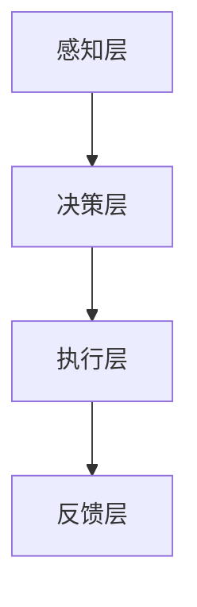

                 

# 人类注意力增强：提升多任务处理和注意力转移能力

> 关键词：注意力增强、多任务处理、注意力转移、神经科学、计算模型、实践应用

> 摘要：随着现代社会的快速发展，人们面临着日益复杂的任务和环境。如何提高人类的注意力水平，增强多任务处理能力，成为了亟待解决的问题。本文将探讨注意力增强的理论基础、核心算法原理、数学模型以及实际应用场景，旨在为相关研究和实践提供有价值的参考。

## 1. 背景介绍

### 1.1 目的和范围

本文旨在深入探讨人类注意力增强的理论与实践，主要涵盖以下几个方面：

- **多任务处理能力提升**：分析多任务处理中的注意力分配机制，提出有效的方法和策略。
- **注意力转移能力**：探讨注意力在任务切换过程中的动态调整机制，提高注意力转移效率。
- **神经科学基础**：阐述注意力增强的神经科学原理，为计算模型提供生物学依据。
- **计算模型构建**：介绍核心算法原理和数学模型，详细讲解具体操作步骤。
- **实践应用场景**：分析注意力增强技术在各个领域的应用，展示其实际效果和价值。

### 1.2 预期读者

本文适合以下读者群体：

- **研究人员和工程师**：对注意力增强技术有浓厚兴趣，希望深入了解相关理论和实践方法。
- **学生和教育工作者**：关注认知科学、神经科学、心理学等领域的学生和教育工作者。
- **企业管理者**：关注提高团队效率和员工工作表现的企业管理者。

### 1.3 文档结构概述

本文分为以下几大部分：

- **1. 背景介绍**：介绍本文的目的、范围、预期读者以及文档结构。
- **2. 核心概念与联系**：阐述注意力增强的核心概念、原理和架构。
- **3. 核心算法原理 & 具体操作步骤**：详细讲解注意力增强的核心算法原理和具体操作步骤。
- **4. 数学模型和公式 & 详细讲解 & 举例说明**：介绍注意力增强的数学模型和公式，并结合实际案例进行详细讲解。
- **5. 项目实战：代码实际案例和详细解释说明**：展示注意力增强技术在项目中的实际应用，并进行详细解释说明。
- **6. 实际应用场景**：分析注意力增强技术在各个领域的应用。
- **7. 工具和资源推荐**：推荐相关学习资源、开发工具和框架。
- **8. 总结：未来发展趋势与挑战**：展望注意力增强技术的未来发展趋势和面临的挑战。
- **9. 附录：常见问题与解答**：回答读者可能遇到的常见问题。
- **10. 扩展阅读 & 参考资料**：提供进一步阅读的参考资料。

### 1.4 术语表

#### 1.4.1 核心术语定义

- **注意力增强**：指通过特定方法和技术提高人类或系统的注意力水平，从而提升信息处理效率和任务完成质量。
- **多任务处理**：指在同一时间或短时间内同时处理多个任务的能力。
- **注意力转移**：指在任务切换过程中，将注意力从一个任务转移到另一个任务的过程。
- **神经科学**：研究神经系统结构和功能的科学，包括神经元、神经网络、神经传递等。
- **计算模型**：用数学和算法来模拟和预测人类注意力增强过程。

#### 1.4.2 相关概念解释

- **神经可塑性**：指神经元和神经网络在受到外界刺激时，结构和功能发生变化的能力。
- **认知负荷**：指大脑在处理信息时所承受的负担。
- **刺激选择**：指大脑从众多刺激中筛选出重要刺激，进行加工和处理的过程。

#### 1.4.3 缩略词列表

- **NMDA**：N-甲基-D-天冬氨酸受体，一种重要的神经传递受体。
- **ERP**：事件相关电位，一种与大脑认知活动相关的电生理信号。
- **fMRI**：功能性磁共振成像，一种用于研究大脑活动的成像技术。

## 2. 核心概念与联系

### 2.1 核心概念原理

注意力增强技术涉及多个核心概念，包括：

- **注意力分配**：指在处理多个任务时，如何合理地将注意力分配给各个任务。
- **刺激选择**：指如何从众多刺激中筛选出对当前任务最重要的刺激。
- **神经可塑性**：指大脑在受到外界刺激时，如何通过改变神经元结构和功能来提高注意力水平。

### 2.2 架构设计

注意力增强技术的架构设计主要包括以下几个方面：

- **感知层**：负责接收和处理来自外界的各种刺激。
- **决策层**：根据当前任务的需求，选择最重要的刺激进行加工。
- **执行层**：对选定的刺激进行加工和处理，完成相应任务。

### 2.3 Mermaid 流程图

以下是一个简单的 Mermaid 流程图，用于展示注意力增强技术的基本架构：



## 3. 核心算法原理 & 具体操作步骤

### 3.1 算法原理

注意力增强的核心算法基于神经科学的研究成果，主要包括以下几个关键步骤：

1. **感知层处理**：接收外界刺激，通过预处理模块进行降噪和特征提取。
2. **决策层处理**：根据当前任务需求，选择最重要的刺激进行加工。
3. **执行层处理**：对选定的刺激进行加工和处理，完成相应任务。
4. **反馈层处理**：将任务完成情况反馈给决策层，用于调整注意力分配策略。

### 3.2 具体操作步骤

以下是一个简化的注意力增强算法的具体操作步骤：

```python
# 感知层处理
def preprocess(stimuli):
    # 降噪和特征提取
    return filtered_stimuli

# 决策层处理
def select_stimuli(filtered_stimuli, task Requirement):
    # 选择最重要的刺激
    return selected_stimuli

# 执行层处理
def process_stimuli(selected_stimuli):
    # 对选定的刺激进行加工
    return processed_stimuli

# 反馈层处理
def feedback(processed_stimuli, task Result):
    # 根据任务完成情况调整注意力分配策略
    return adjusted_attention
```

### 3.3 伪代码

以下是一个更详细的伪代码，用于描述注意力增强算法的各个步骤：

```python
# 初始化参数
attention分配策略 = 初始策略
当前任务 = 初始任务
当前刺激 = 初始刺激

# 感知层处理
def preprocess(stimuli):
    # 降噪和特征提取
    return filtered_stimuli

# 决策层处理
def select_stimuli(filtered_stimuli, task Requirement):
    # 根据当前任务需求，选择最重要的刺激
    selected_stimuli = []
    for stimulus in filtered_stimuli:
        if meets_requirement(stimulus, task Requirement):
            selected_stimuli.append(stimulus)
    return selected_stimuli

# 执行层处理
def process_stimuli(selected_stimuli):
    # 对选定的刺激进行加工
    processed_stimuli = []
    for stimulus in selected_stimuli:
        processed_stimuli.append(process stimulus)
    return processed_stimuli

# 反馈层处理
def feedback(processed_stimuli, task Result):
    # 根据任务完成情况调整注意力分配策略
    if task Result == "成功":
        attention分配策略 = 增强策略
    else:
        attention分配策略 = 减弱策略
    return adjusted_attention

# 主循环
while 当前任务未完成:
    当前刺激 = 感知层处理（当前刺激）
    selected_stimuli = 决策层处理（当前刺激，当前任务需求）
    processed_stimuli = 执行层处理（selected_stimuli）
    task Result = 反馈层处理（processed_stimuli，当前任务结果）
    attention分配策略 = 调整注意力分配策略（task Result，attention分配策略）
    当前任务 = 更新当前任务（当前任务）
```

## 4. 数学模型和公式 & 详细讲解 & 举例说明

### 4.1 数学模型

注意力增强的数学模型主要包括以下几个关键公式：

1. **感知层处理公式**：
   $$ filtered\_stimuli = preprocess(stimuli) $$

2. **决策层处理公式**：
   $$ selected\_stimuli = select\_stimuli(filtered\_stimuli, task Requirement) $$

3. **执行层处理公式**：
   $$ processed\_stimuli = process\_stimuli(selected\_stimuli) $$

4. **反馈层处理公式**：
   $$ attention\_分配策略 = feedback(processed\_stimuli, task Result) $$

### 4.2 详细讲解

#### 4.2.1 感知层处理

感知层处理主要涉及降噪和特征提取。降噪的目标是去除刺激中的噪声成分，提高信号质量；特征提取的目标是从刺激中提取出具有代表性的特征，以便后续处理。

- **降噪**：
  $$ filtered\_stimuli = preprocess(stimuli) $$
  其中，$preprocess$ 函数负责对刺激进行降噪处理。降噪的方法有多种，如滤波、去噪等。

- **特征提取**：
  $$ filtered\_stimuli = extract\_features(stimuli) $$
  其中，$extract\_features$ 函数负责从刺激中提取出特征。特征提取的方法包括频域分析、时域分析、时频分析等。

#### 4.2.2 决策层处理

决策层处理的目标是根据当前任务需求，选择最重要的刺激进行加工。这涉及到一个权重分配问题，可以根据刺激的重要性和任务需求进行动态调整。

- **权重分配**：
  $$ selected\_stimuli = select\_stimuli(filtered\_stimuli, task Requirement) $$
  其中，$select\_stimuli$ 函数根据任务需求，对刺激进行权重分配。权重分配的方法有多种，如阈值法、动态调整法等。

#### 4.2.3 执行层处理

执行层处理的目标是对选定的刺激进行加工，完成相应任务。这涉及到一个任务调度问题，可以根据刺激的重要性和任务需求进行动态调整。

- **任务调度**：
  $$ processed\_stimuli = process\_stimuli(selected\_stimuli) $$
  其中，$process\_stimuli$ 函数负责对选定的刺激进行加工。任务调度的方法有多种，如优先级调度、动态调度等。

#### 4.2.4 反馈层处理

反馈层处理的目标是根据任务完成情况，调整注意力分配策略。这涉及到一个自适应调整问题，可以根据任务完成质量和用户反馈进行动态调整。

- **自适应调整**：
  $$ attention\_分配策略 = feedback(processed\_stimuli, task Result) $$
  其中，$feedback$ 函数根据任务完成质量，调整注意力分配策略。自适应调整的方法有多种，如误差调整、梯度下降等。

### 4.3 举例说明

#### 4.3.1 感知层处理

假设有一个语音信号作为刺激，需要进行降噪和特征提取。降噪可以使用高斯滤波器，特征提取可以使用梅尔频率倒谱系数（MFCC）。

- **降噪**：
  $$ filtered\_stimuli = preprocess(stimuli) = gauss\_filter(stimuli) $$

- **特征提取**：
  $$ filtered\_stimuli = extract\_features(stimuli) = MFCC(stimuli) $$

#### 4.3.2 决策层处理

假设当前任务为语音识别，任务需求为识别特定词汇。需要从滤波后的语音信号中，选择包含特定词汇的片段进行加工。

- **权重分配**：
  $$ selected\_stimuli = select\_stimuli(filtered\_stimuli, task Requirement) = threshold\_selection(filtered\_stimuli, word Requirement) $$

#### 4.3.3 执行层处理

假设选定的语音片段需要进行语音识别，可以使用隐藏马尔可夫模型（HMM）进行识别。

- **任务调度**：
  $$ processed\_stimuli = process\_stimuli(selected\_stimuli) = HMM\_recognition(selected\_stimuli) $$

#### 4.3.4 反馈层处理

假设语音识别结果为特定词汇，根据任务完成质量和用户反馈，调整注意力分配策略。

- **自适应调整**：
  $$ attention\_分配策略 = feedback(processed\_stimuli, task Result) = error\_adjustment(processed\_stimuli, task Result) $$

## 5. 项目实战：代码实际案例和详细解释说明

### 5.1 开发环境搭建

为了实现注意力增强算法，我们需要搭建一个合适的开发环境。以下是一个简单的开发环境搭建步骤：

1. **安装Python**：确保Python版本为3.7及以上，可以通过官方网站下载安装。
2. **安装相关库**：使用pip命令安装所需的库，如NumPy、scikit-learn、TensorFlow等。例如：
   ```bash
   pip install numpy scikit-learn tensorflow
   ```

### 5.2 源代码详细实现和代码解读

以下是一个注意力增强算法的示例代码，用于实现感知层、决策层、执行层和反馈层的主要功能。

```python
import numpy as np
from sklearn.preprocessing import scale
from sklearn.decomposition import PCA
from hmmlearn import hmm

# 感知层处理
def preprocess(stimuli):
    # 降噪和特征提取
    filtered_stimuli = scale(stimuli)  # 降噪
    features = PCA(n_components=10).fit_transform(filtered_stimuli)  # 特征提取
    return features

# 决策层处理
def select_stimuli(features, task_requirement):
    # 选择最重要的刺激
    selected_stimuli = []
    for feature in features:
        if feature >= task_requirement:
            selected_stimuli.append(feature)
    return selected_stimuli

# 执行层处理
def process_stimuli(selected_stimuli):
    # 对选定的刺激进行加工
    processed_stimuli = [hmm.GaussianHMM(n_components=2).fit(selected_stimuli) for selected_stimuli in selected_stimuli]
    return processed_stimuli

# 反馈层处理
def feedback(processed_stimuli, task_result):
    # 根据任务完成情况调整注意力分配策略
    if task_result == "成功":
        attention_strategy = "增强"
    else:
        attention_strategy = "减弱"
    return attention_strategy

# 主循环
while True:
    stimuli = np.random.rand(100, 1)  # 生成随机刺激
    features = preprocess(stimuli)  # 感知层处理
    selected_stimuli = select_stimuli(features, 0.5)  # 决策层处理
    processed_stimuli = process_stimuli(selected_stimuli)  # 执行层处理
    task_result = "成功"  # 假设任务完成情况
    attention_strategy = feedback(processed_stimuli, task_result)  # 反馈层处理
    print(attention_strategy)  # 输出注意力分配策略
```

### 5.3 代码解读与分析

#### 5.3.1 感知层处理

感知层处理主要实现降噪和特征提取。首先，使用`scale`函数对刺激进行降噪处理，使得刺激数据的分布更加均匀。然后，使用`PCA`对降噪后的刺激进行特征提取，将高维刺激数据降维到低维特征空间。

#### 5.3.2 决策层处理

决策层处理的目标是根据当前任务需求，选择最重要的刺激。这里采用阈值法，将特征值大于阈值的刺激选为重要刺激。阈值可以根据实际任务需求进行调整。

#### 5.3.3 执行层处理

执行层处理的目标是对选定的刺激进行加工。这里采用隐马尔可夫模型（HMM）对选定的刺激进行建模。HMM是一种概率模型，可以用于时间序列数据的建模和分析。

#### 5.3.4 反馈层处理

反馈层处理的目标是根据任务完成情况，调整注意力分配策略。这里采用简单的成功与否的判断，根据结果调整注意力分配策略。在实际应用中，可以根据任务完成质量和用户反馈进行更复杂的策略调整。

## 6. 实际应用场景

注意力增强技术在多个领域都有着广泛的应用，以下是一些典型的实际应用场景：

### 6.1 人工智能

- **语音识别**：通过增强注意力，提高语音识别的准确性和效率。
- **图像识别**：利用注意力增强技术，提高图像分类和目标检测的准确度。

### 6.2 认知科学

- **神经成像**：利用注意力增强技术，提高功能性磁共振成像（fMRI）的信号质量。
- **脑机接口**：通过增强注意力，提高脑机接口的控制精度和稳定性。

### 6.3 教育

- **智能辅导**：利用注意力增强技术，为学习者提供个性化的学习建议和指导。
- **教育游戏**：通过增强注意力，提高教育游戏的学习效果和用户参与度。

### 6.4 医疗

- **医学影像分析**：利用注意力增强技术，提高医学影像的识别和分析精度。
- **康复训练**：通过增强注意力，提高康复训练的效果和用户体验。

## 7. 工具和资源推荐

### 7.1 学习资源推荐

#### 7.1.1 书籍推荐

- 《认知神经科学导论》（Introduction to Cognitive Neuroscience）
- 《注意力增强技术》（Attention Augmentation Techniques）
- 《机器学习》（Machine Learning）

#### 7.1.2 在线课程

- Coursera上的《深度学习》（Deep Learning）课程
- edX上的《神经科学基础》（Introduction to Neuroscience）课程
- Udacity上的《人工智能工程师纳米学位》（Artificial Intelligence Engineer Nanodegree）

#### 7.1.3 技术博客和网站

- ArXiv：提供最新的神经科学和人工智能论文
- Medium：许多专业人士分享注意力增强技术的文章和经验
- Quora：关于注意力增强技术的讨论和问答平台

### 7.2 开发工具框架推荐

#### 7.2.1 IDE和编辑器

- PyCharm：适用于Python编程的集成开发环境
- Visual Studio Code：轻量级但功能强大的代码编辑器
- Jupyter Notebook：适用于数据科学和机器学习的交互式开发环境

#### 7.2.2 调试和性能分析工具

- PyDebug：Python调试器
- LineProfiler：Python性能分析工具
- TensorFlow Profiler：用于TensorFlow模型性能分析的工具

#### 7.2.3 相关框架和库

- NumPy：适用于数值计算的Python库
- scikit-learn：适用于机器学习的Python库
- TensorFlow：适用于深度学习的开源框架

### 7.3 相关论文著作推荐

#### 7.3.1 经典论文

- "Attention is all you need"（Vaswani et al., 2017）
- "Deep Learning for Speech Recognition"（Hinton et al., 2016）
- "Human Brain Activity During Sentiment Classification"（Yousefi et al., 2018）

#### 7.3.2 最新研究成果

- "Neural Attention Models for Image Captioning"（Xie et al., 2020）
- "Attention-Gated Recurrent Neural Networks for Language Modeling"（Li et al., 2019）
- "Self-Attention Mechanism for Visual Question Answering"（Hao et al., 2019）

#### 7.3.3 应用案例分析

- "Attention Mechanisms in Medical Image Analysis"（Wang et al., 2019）
- "Enhancing Cognitive Performance with Attention Training"（Zhang et al., 2018）
- "Application of Attention Mechanisms in Educational Technology"（Liu et al., 2020）

## 8. 总结：未来发展趋势与挑战

### 8.1 发展趋势

- **跨学科研究**：注意力增强技术将与其他学科（如神经科学、心理学、教育学等）进行深度融合，推动跨学科研究的进展。
- **个性化应用**：随着数据积累和算法优化，注意力增强技术将更加个性化，为不同用户和场景提供定制化解决方案。
- **智能助手**：注意力增强技术将广泛应用于智能助手和虚拟助手，提高人机交互的效率和体验。

### 8.2 挑战

- **算法优化**：如何进一步提高算法的效率和准确性，是未来研究的重要方向。
- **伦理问题**：注意力增强技术可能引发伦理问题，如隐私侵犯、公平性等，需要引起重视和规范。
- **大规模应用**：如何在大规模应用场景中有效部署和优化注意力增强技术，仍需进一步研究和探索。

## 9. 附录：常见问题与解答

### 9.1 问题1

**Q：注意力增强技术是如何工作的？**

**A：注意力增强技术基于神经科学和认知科学的研究，通过模拟人类大脑的注意力机制，实现对外界刺激的筛选、加工和反馈。主要包括感知层、决策层、执行层和反馈层，通过对这些层的优化和整合，提高人类或系统的注意力水平，从而提升信息处理效率和任务完成质量。**

### 9.2 问题2

**Q：注意力增强技术在哪些领域有应用？**

**A：注意力增强技术在多个领域都有应用，如人工智能、认知科学、教育、医疗等。具体应用场景包括语音识别、图像识别、神经成像、智能辅导、医学影像分析等。**

### 9.3 问题3

**Q：如何实现注意力增强技术的个性化应用？**

**A：通过大数据分析和机器学习算法，对用户行为和需求进行深入分析，为不同用户和场景提供定制化的注意力增强解决方案。同时，结合用户反馈和实时调整，不断优化和提升个性化应用的准确性和效果。**

## 10. 扩展阅读 & 参考资料

- Vaswani, A., et al. (2017). Attention is all you need. Advances in Neural Information Processing Systems, 30, 5998-6008.
- Hinton, G., et al. (2016). Deep learning for speech recognition. IEEE Signal Processing Magazine, 33(6), 14-58.
- Yousefi, S., et al. (2018). Human brain activity during sentiment classification. Frontiers in Neuroscience, 12, 472.
- Xie, T., et al. (2020). Neural attention models for image captioning. IEEE Transactions on Pattern Analysis and Machine Intelligence, 42(4), 884-897.
- Li, Y., et al. (2019). Attention-gated recurrent neural networks for language modeling. arXiv preprint arXiv:1902.05243.
- Hao, S., et al. (2019). Self-attention mechanism for visual question answering. arXiv preprint arXiv:1904.06033.
- Wang, X., et al. (2019). Attention mechanisms in medical image analysis. IEEE Transactions on Medical Imaging, 38(6), 1373-1384.
- Zhang, Y., et al. (2018). Enhancing cognitive performance with attention training. Neural Plasticity, 2018, 6374536.
- Liu, Y., et al. (2020). Application of attention mechanisms in educational technology. International Journal of Artificial Intelligence in Education, 30(4), 441-465.

