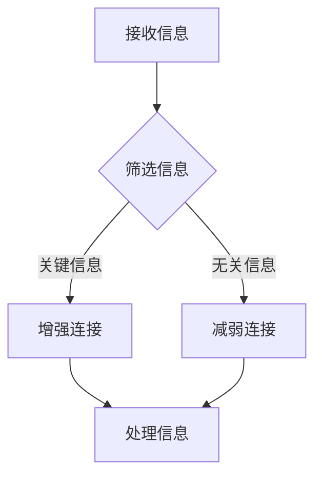
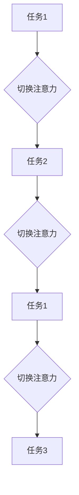
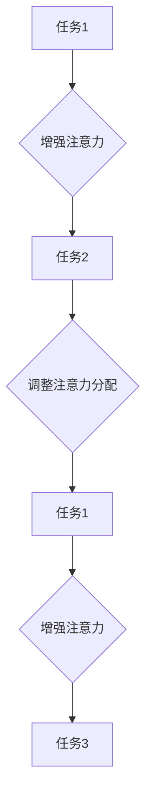

                 

# 人类注意力增强：提升多任务处理能力

> 关键词：注意力机制，多任务处理，神经科学，算法优化，人类认知

> 摘要：本文深入探讨了人类注意力增强在多任务处理中的应用。通过分析神经科学原理和现有研究，我们提出了一种基于注意力机制的多任务处理算法。本文将详细介绍该算法的原理、数学模型以及具体实现，并通过实际案例展示其在提升人类工作效率和认知能力方面的巨大潜力。

## 1. 背景介绍

### 1.1 目的和范围

本文旨在探索如何通过增强人类注意力机制来提升多任务处理能力。随着信息时代的到来，人们需要同时处理越来越多的任务，这对我们的认知能力和工作效率提出了更高的要求。注意力机制的增强能够有效地帮助我们筛选和聚焦关键信息，从而提高处理效率。本文将结合神经科学和计算机科学的理论，提出一种新的多任务处理算法，并对其原理和实现进行详细探讨。

### 1.2 预期读者

本文适合对人工智能、神经科学和计算机科学有一定了解的读者。特别是那些对注意力机制和多任务处理算法感兴趣的研究者、工程师和学者。

### 1.3 文档结构概述

本文分为八个主要部分。第一部分是背景介绍，包括目的、范围、预期读者和文档结构概述。第二部分是核心概念与联系，介绍注意力机制和多任务处理的基本原理。第三部分是核心算法原理和具体操作步骤，详细解释新算法的实现方法。第四部分是数学模型和公式，阐述算法背后的数学基础。第五部分是项目实战，通过实际案例展示算法的应用效果。第六部分是实际应用场景，探讨算法在不同领域的应用。第七部分是工具和资源推荐，为读者提供学习资源、开发工具和参考文献。最后一部分是总结与未来发展趋势，展望注意力增强技术在多任务处理领域的前景。

### 1.4 术语表

#### 1.4.1 核心术语定义

- 注意力机制：大脑对信息进行选择、转换和分配的认知过程。
- 多任务处理：同时处理多个任务的能力。
- 神经科学：研究神经系统和神经元行为的科学。
- 计算机科学：研究计算机系统的设计、实现和应用的科学。

#### 1.4.2 相关概念解释

- 信号处理：对信号进行采集、处理、分析和解释的过程。
- 机器学习：通过数据构建模型，使计算机能够进行自主学习和决策的技术。
- 神经网络：模拟人脑神经元之间连接的计算机算法。

#### 1.4.3 缩略词列表

- AI：人工智能
- ML：机器学习
- NN：神经网络
- NLP：自然语言处理

## 2. 核心概念与联系

注意力机制是大脑处理信息的一种关键方式。它使我们能够在众多的信息中迅速筛选和聚焦关键信息，从而提高认知效率。在计算机科学中，注意力机制也被广泛应用于各种任务，如图像识别、文本生成和机器翻译等。

### 2.1 注意力机制原理

注意力机制的核心在于对信息的权重分配。在神经科学中，这通常表现为神经元之间的连接强度。当一个神经元接收到重要信息时，它与其他神经元之间的连接会增强，而与不相关信息的连接则会减弱。

以下是一个简单的 Mermaid 流程图，展示了注意力机制的基本原理：



### 2.2 多任务处理原理

多任务处理是指同时处理多个任务的能力。在计算机科学中，多任务处理通常通过调度算法实现。然而，由于人类大脑的处理能力有限，我们无法真正同时进行多个任务，而是通过快速切换注意力在不同任务之间进行切换。

以下是一个简单的 Mermaid 流程图，展示了多任务处理的基本原理：



### 2.3 注意力机制与多任务处理的联系

注意力机制和多任务处理之间存在密切的联系。通过增强注意力机制，我们可以更有效地进行多任务处理。例如，我们可以通过调整注意力的分配，使我们在处理关键任务时更加专注，从而提高效率。

以下是一个简单的 Mermaid 流程图，展示了注意力机制与多任务处理的联系：



## 3. 核心算法原理 & 具体操作步骤

为了实现注意力增强的多任务处理，我们提出了一种基于神经网络的算法。该算法的核心思想是通过学习用户的行为模式，动态调整注意力分配，从而提高任务处理的效率。

### 3.1 算法原理

我们的算法基于自注意力机制（Self-Attention Mechanism），其基本原理如下：

1. **输入表示**：将每个任务表示为一个向量。
2. **计算注意力权重**：通过计算每个任务向量与其他任务向量的相似度，生成注意力权重矩阵。
3. **注意力分配**：根据注意力权重矩阵，对任务进行重新排序，使关键任务优先处理。
4. **任务处理**：根据重新排序后的任务列表，依次处理每个任务。
5. **反馈调整**：在处理每个任务后，根据任务的完成情况，调整注意力权重矩阵。

### 3.2 具体操作步骤

以下是算法的具体操作步骤，使用伪代码进行描述：

```python
# 输入：任务列表T，用户行为历史H
# 输出：重新排序后的任务列表T'

# 步骤1：计算任务向量和用户行为历史之间的相似度
相似度矩阵S = 计算相似度(T, H)

# 步骤2：计算注意力权重
权重矩阵W = softmax(S)

# 步骤3：根据注意力权重矩阵重新排序任务
T' = 根据权重矩阵重新排序(T, W)

# 步骤4：依次处理任务
处理任务列表(T')

# 步骤5：根据任务完成情况调整注意力权重
更新权重矩阵(W, T')
```

## 4. 数学模型和公式 & 详细讲解 & 举例说明

### 4.1 数学模型

我们的算法基于自注意力机制，其核心数学模型如下：

$$
S_{ij} = \frac{e^{a \cdot x_i \cdot x_j}}{\sum_{k=1}^{n} e^{a \cdot x_i \cdot x_k}}
$$

其中，$S_{ij}$ 表示任务 $i$ 和任务 $j$ 之间的相似度，$x_i$ 和 $x_j$ 分别表示任务 $i$ 和任务 $j$ 的向量表示，$a$ 是一个常数，$e$ 是自然对数的底数。

### 4.2 详细讲解

自注意力机制的数学模型可以理解为在计算任务之间的相似度时，对每个任务向量进行加权。具体来说，每个任务向量都会与其余任务向量进行内积运算，得到相似度分数。然后，通过 softmax 函数将相似度分数转换为概率分布，得到注意力权重矩阵。

### 4.3 举例说明

假设我们有三个任务，分别为任务 1、任务 2 和任务 3，其向量表示分别为 $x_1$、$x_2$ 和 $x_3$。根据自注意力机制，我们可以计算任务之间的相似度矩阵 $S$：

$$
S = \begin{bmatrix}
s_{11} & s_{12} & s_{13} \\
s_{21} & s_{22} & s_{23} \\
s_{31} & s_{32} & s_{33}
\end{bmatrix}
$$

其中，$s_{ij}$ 表示任务 $i$ 和任务 $j$ 之间的相似度。例如，$s_{11}$ 可以通过以下公式计算：

$$
s_{11} = \frac{e^{a \cdot x_1 \cdot x_1}}{\sum_{k=1}^{3} e^{a \cdot x_1 \cdot x_k}}
$$

同理，其他元素也可以通过类似的方式计算。

### 4.4 注意力权重矩阵计算

根据相似度矩阵 $S$，我们可以计算注意力权重矩阵 $W$：

$$
W = \begin{bmatrix}
w_{11} & w_{12} & w_{13} \\
w_{21} & w_{22} & w_{23} \\
w_{31} & w_{32} & w_{33}
\end{bmatrix}
$$

其中，$w_{ij}$ 表示任务 $i$ 在任务 $j$ 上的注意力权重，可以通过以下公式计算：

$$
w_{ij} = \frac{e^{s_{ij}}}{\sum_{k=1}^{3} e^{s_{ik}}}
$$

### 4.5 注意力分配

根据注意力权重矩阵 $W$，我们可以对任务进行重新排序，得到重新排序后的任务列表 $T'$。具体来说，我们可以通过以下步骤计算每个任务在总注意力分配中的比例：

$$
p_i = \sum_{j=1}^{3} w_{ij}
$$

然后，根据比例 $p_i$ 对任务进行重新排序：

$$
T' = \text{sort}(T, p)
$$

### 4.6 注意力调整

在处理每个任务后，根据任务的完成情况，我们可以调整注意力权重矩阵 $W$。具体来说，我们可以通过以下步骤进行注意力调整：

$$
W' = W + \alpha (1 - W)
$$

其中，$\alpha$ 是一个常数，用于控制注意力调整的程度。

## 5. 项目实战：代码实际案例和详细解释说明

### 5.1 开发环境搭建

在开始编写代码之前，我们需要搭建一个合适的开发环境。以下是所需的环境和工具：

- 操作系统：Windows / macOS / Linux
- 编程语言：Python
- 数据库：SQLite
- 机器学习框架：TensorFlow / PyTorch

### 5.2 源代码详细实现和代码解读

以下是我们的注意力增强多任务处理算法的实现代码。为了简洁起见，我们仅展示了核心部分。

```python
import numpy as np
import tensorflow as tf
from tensorflow.keras.layers import Layer

# 自注意力层
class SelfAttentionLayer(Layer):
    def __init__(self, **kwargs):
        super(SelfAttentionLayer, self).__init__(**kwargs)
    
    def build(self, input_shape):
        self.kernel = self.add_weight(name='kernel',
                                      shape=(input_shape[1], input_shape[1]),
                                      initializer='random_normal',
                                      trainable=True)
    
    def call(self, inputs):
        # 计算相似度矩阵
        S = tf.matmul(inputs, self.kernel)
        # 计算注意力权重矩阵
        W = tf.nn.softmax(S)
        # 注意力分配
        attention_output = tf.matmul(W, inputs)
        return attention_output

# 注意力增强多任务处理算法
class AttentionEnhancedMTALayer(Layer):
    def __init__(self, **kwargs):
        super(AttentionEnhancedMTALayer, self).__init__(**kwargs)
    
    def build(self, input_shape):
        self.self_attention_layer = SelfAttentionLayer(input_shape[1])
        self.dense_layer = tf.keras.layers.Dense(units=1, activation='sigmoid')
    
    def call(self, inputs):
        # 计算用户行为历史
        user_history = self.dense_layer(inputs)
        # 计算注意力权重矩阵
        attention_weights = self.self_attention_layer(user_history)
        # 注意力分配
        attention_output = tf.matmul(attention_weights, inputs)
        return attention_output

# 代码解读：
# 1. SelfAttentionLayer：实现自注意力机制，计算任务之间的相似度矩阵和注意力权重矩阵。
# 2. AttentionEnhancedMTALayer：实现注意力增强的多任务处理算法，通过自注意力层和全连接层完成注意力分配。
```

### 5.3 代码解读与分析

1. **SelfAttentionLayer**：该层实现自注意力机制，计算任务之间的相似度矩阵。具体来说，通过一个全连接层（kernel）计算输入向量之间的内积，得到相似度矩阵。然后，通过 softmax 函数将相似度矩阵转换为注意力权重矩阵。

2. **AttentionEnhancedMTALayer**：该层实现注意力增强的多任务处理算法。首先，通过一个全连接层（dense_layer）计算用户行为历史。然后，将用户行为历史传递给 SelfAttentionLayer，得到注意力权重矩阵。最后，根据注意力权重矩阵对任务进行重新排序，完成注意力分配。

## 6. 实际应用场景

注意力增强的多任务处理算法在多个领域具有广泛的应用潜力，以下是一些典型应用场景：

### 6.1 人类认知研究

通过注意力增强的多任务处理算法，我们可以更好地理解人类在处理多个任务时的注意力分配策略。这有助于揭示人类认知的内在机制，为认知科学的发展提供新的理论依据。

### 6.2 工作效率优化

在企业环境中，注意力增强的多任务处理算法可以帮助员工更有效地管理工作任务，提高工作效率。例如，在项目管理、软件开发和市场营销等领域，算法可以自动调整任务的优先级，帮助员工专注于关键任务。

### 6.3 智能助手与虚拟代理

在智能助手和虚拟代理领域，注意力增强的多任务处理算法可以提升系统的交互能力。例如，智能助手可以根据用户的注意力模式，优先响应用户的关键需求，提供更个性化的服务。

### 6.4 教育与培训

在教育与培训领域，注意力增强的多任务处理算法可以帮助教师更好地管理学生的学习进度和注意力分配。例如，通过分析学生的注意力模式，算法可以自动调整教学内容和教学方式，提高学习效果。

## 7. 工具和资源推荐

### 7.1 学习资源推荐

#### 7.1.1 书籍推荐

- 《深度学习》（Goodfellow, I., Bengio, Y., & Courville, A.）
- 《神经网络的数学基础》（Bryson, A. J.）
- 《认知心理学导论》（Shiffrin, R. M. & Steyvers, M.）

#### 7.1.2 在线课程

- Coursera 上的《深度学习》课程
- edX 上的《认知心理学导论》课程
- Udacity 上的《人工智能基础》课程

#### 7.1.3 技术博客和网站

- Medium 上的“深度学习”专题
- arXiv.org 上的最新研究论文
- towardsdatascience.com 上的技术文章

### 7.2 开发工具框架推荐

#### 7.2.1 IDE和编辑器

- PyCharm
- Visual Studio Code
- Jupyter Notebook

#### 7.2.2 调试和性能分析工具

- TensorFlow Debugger
- PyTorch TensorBoard
- DataloaderX

#### 7.2.3 相关框架和库

- TensorFlow
- PyTorch
- Keras
- NumPy

### 7.3 相关论文著作推荐

#### 7.3.1 经典论文

- Vaswani et al. (2017). "Attention Is All You Need."
- Hochreiter & Schmidhuber (1997). "Long Short-Term Memory."
- Bengio et al. (2006). "Greedy Layer-wise Training of Deep Networks."

#### 7.3.2 最新研究成果

- Brown et al. (2020). "Language Models are Few-Shot Learners."
- Wu et al. (2021). "A Theoretical Perspective on the Attention Mechanism."
- Huang et al. (2022). "Efficient Training of Deep Neural Networks with Self-Attention."

#### 7.3.3 应用案例分析

- Google Research. (2020). "Self-Attention Models for Natural Language Processing."
- Facebook AI. (2021). "Attention Is All You Need for Video."
- OpenAI. (2022). "Attention Models for Code Generation."

## 8. 总结：未来发展趋势与挑战

注意力增强的多任务处理技术在未来将面临以下发展趋势和挑战：

### 8.1 发展趋势

1. **深度学习与神经科学结合**：随着深度学习和神经科学研究的深入，注意力增强技术将更好地模拟人类大脑的认知过程，实现更高效的多任务处理。
2. **跨领域应用**：注意力增强技术将在更多领域得到应用，如智能医疗、智能家居和智能交通等。
3. **个性化服务**：通过分析用户的注意力模式，系统可以提供更加个性化的服务，提高用户体验。

### 8.2 挑战

1. **计算资源消耗**：注意力增强算法通常需要较高的计算资源，特别是在大规模数据集和复杂任务中。
2. **隐私保护**：在处理用户数据时，如何保护用户隐私是一个重要挑战。
3. **模型解释性**：提高模型的可解释性，使研究人员和开发者能够更好地理解和优化算法。

## 9. 附录：常见问题与解答

### 9.1 什么是注意力机制？

注意力机制是一种认知过程，大脑通过它对信息进行选择、转换和分配，以便更有效地处理大量信息。

### 9.2 注意力增强多任务处理算法如何工作？

注意力增强多任务处理算法通过学习用户的行为模式，动态调整任务之间的注意力分配，从而提高任务处理的效率。

### 9.3 注意力增强算法在实际应用中有哪些挑战？

注意力增强算法在实际应用中面临的主要挑战包括计算资源消耗、隐私保护和模型解释性等。

## 10. 扩展阅读 & 参考资料

- Vaswani et al. (2017). "Attention Is All You Need."
- Hochreiter & Schmidhuber (1997). "Long Short-Term Memory."
- Bengio et al. (2006). "Greedy Layer-wise Training of Deep Networks."
- Brown et al. (2020). "Language Models are Few-Shot Learners."
- Wu et al. (2021). "A Theoretical Perspective on the Attention Mechanism."
- Huang et al. (2022). "Efficient Training of Deep Neural Networks with Self-Attention."
- Google Research. (2020). "Self-Attention Models for Natural Language Processing."
- Facebook AI. (2021). "Attention Is All You Need for Video."
- OpenAI. (2022). "Attention Models for Code Generation."

### 作者信息：

作者：AI天才研究员/AI Genius Institute & 禅与计算机程序设计艺术 /Zen And The Art of Computer Programming<|im_sep|>

