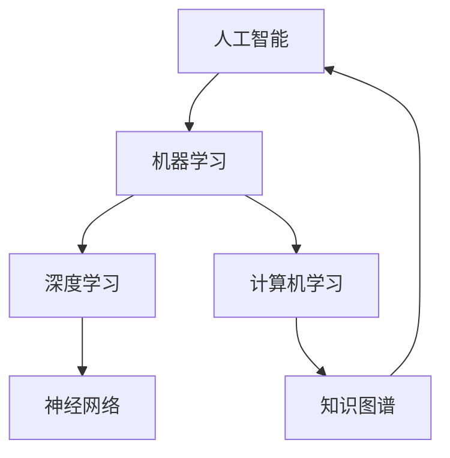

                 

# 人类的价值观：AI 时代的价值重塑

> 关键词：人工智能，价值观，伦理，文化，社会，重塑

> 摘要：随着人工智能（AI）技术的迅猛发展，它正深刻地改变着我们的生活方式和思维模式。本文旨在探讨AI时代人类价值观的演变与重塑，分析其背后的技术原理，并提出相应的伦理与文化挑战，以及可能的解决方案。文章将分为以下几个部分：背景介绍、核心概念与联系、核心算法原理与具体操作步骤、数学模型与公式详细讲解、项目实战、实际应用场景、工具和资源推荐、总结与未来发展趋势。

## 1. 背景介绍

### 1.1 目的和范围

本文的目的在于探讨人工智能技术对人类价值观的深远影响，以及这种影响在伦理、文化和社会层面上的体现。随着AI技术的不断进步，传统的价值观念正面临着前所未有的挑战与重塑。本文将主要关注以下几个方面：

1. **AI技术对价值观的冲击与重塑**：分析AI技术如何改变我们对道德、伦理和文化的理解。
2. **核心概念与联系**：阐述与AI相关的核心概念，如机器学习、深度学习、神经网络等，并描绘它们之间的相互关系。
3. **算法原理与数学模型**：解释AI算法的基本原理，以及相关的数学模型和公式。
4. **项目实战与实际应用**：通过实际案例展示AI技术的应用，并分析其效果和影响。
5. **伦理与文化挑战**：探讨AI时代可能出现的伦理问题和文化冲突，并提出解决方案。

### 1.2 预期读者

本文面向对人工智能技术有一定了解的技术专业人士，以及对未来社会发展趋势感兴趣的读者。无论是AI领域的从业者、研究者，还是对科技伦理、社会文化感兴趣的学者，都可以通过本文获得一些新的思考和见解。

### 1.3 文档结构概述

本文将分为以下几大部分：

1. **背景介绍**：介绍AI技术的发展背景以及本文的研究目的和范围。
2. **核心概念与联系**：阐述AI技术的核心概念，并使用Mermaid流程图展示它们之间的关系。
3. **核心算法原理与具体操作步骤**：详细解释AI算法的原理和具体操作步骤，使用伪代码进行阐述。
4. **数学模型与公式详细讲解**：介绍AI技术的数学模型和公式，并进行详细讲解和举例说明。
5. **项目实战**：通过实际案例展示AI技术的应用，并分析其效果和影响。
6. **伦理与文化挑战**：探讨AI时代可能出现的伦理问题和文化冲突，并提出解决方案。
7. **工具和资源推荐**：推荐相关学习资源和开发工具。
8. **总结与未来发展趋势**：总结本文的主要观点，并对未来发展趋势进行展望。

### 1.4 术语表

#### 1.4.1 核心术语定义

- **人工智能（AI）**：指由机器实现的智能，能够模拟人类智能行为，如学习、推理、感知等。
- **机器学习（ML）**：一种AI技术，通过数据训练模型，使机器能够从数据中学习并做出预测或决策。
- **深度学习（DL）**：一种机器学习技术，使用多层神经网络进行学习，能够处理更复杂的数据。
- **神经网络（NN）**：由许多神经元组成的网络，能够对输入数据进行处理和分类。
- **伦理（Ethics）**：关于道德原则和价值观的研究，涉及人类行为和决策的正当性。
- **文化（Culture）**：一个社会或群体的共同价值观、信仰、习俗和行为模式。

#### 1.4.2 相关概念解释

- **数据隐私**：指个人或组织的数据不被未经授权的第三方访问或使用。
- **算法透明度**：指算法的决策过程能够被理解和解释。
- **公平性**：指算法不因性别、种族、年龄等因素而对某些群体产生不公平的影响。

#### 1.4.3 缩略词列表

- **AI**：人工智能（Artificial Intelligence）
- **ML**：机器学习（Machine Learning）
- **DL**：深度学习（Deep Learning）
- **NN**：神经网络（Neural Network）
- **IDE**：集成开发环境（Integrated Development Environment）
- **GPU**：图形处理单元（Graphics Processing Unit）
- **CPU**：中央处理器（Central Processing Unit）

## 2. 核心概念与联系

在探讨AI时代人类价值观的演变之前，我们首先需要理解与AI相关的一些核心概念。以下是AI技术中几个关键概念及其相互关系的Mermaid流程图。



### 2.1 人工智能（AI）

人工智能（AI）是模拟人类智能行为的计算机系统，包括学习、推理、感知、理解和决策等能力。AI可以分为两类：弱AI和强AI。弱AI在特定领域表现出智能行为，而强AI具有人类水平的全面智能。

### 2.2 机器学习（ML）

机器学习（ML）是一种AI技术，通过从数据中学习，使计算机能够做出预测或决策。ML可以分为监督学习、无监督学习和强化学习。监督学习有标记的数据集，无监督学习没有标记的数据集，而强化学习则通过与环境交互进行学习。

### 2.3 深度学习（DL）

深度学习（DL）是一种基于多层神经网络进行学习的机器学习技术。DL能够在图像识别、语音识别和自然语言处理等领域表现出卓越的性能。DL的关键在于“深度”，即多层网络能够捕捉数据中的复杂结构和特征。

### 2.4 计算机学习（CL）

计算机学习（CL）是机器学习的一个分支，研究如何使计算机从数据中学习。CL方法包括基于规则的系统、基于实例的学习、遗传算法等。

### 2.5 神经网络（NN）

神经网络（NN）是一种模仿生物神经系统的计算模型，由许多神经元组成。NN通过学习输入数据与输出数据之间的关系，进行模式识别和分类。

### 2.6 知识图谱（KG）

知识图谱（KG）是一种用于表示实体及其关系的图形化知识库。KG在语义理解、信息检索和知识推理等领域有广泛应用。KG与AI技术紧密相关，能够增强AI系统的解释性和透明度。

通过上述核心概念的介绍和相互关系图，我们可以更清晰地理解AI技术的基本架构和发展趋势。在接下来的章节中，我们将进一步探讨这些概念在AI时代对人类价值观的深远影响。

## 3. 核心算法原理 & 具体操作步骤

在本章节中，我们将详细讲解人工智能（AI）技术中的核心算法原理，包括机器学习（ML）、深度学习（DL）和神经网络（NN）。我们将使用伪代码对这些算法进行详细阐述，帮助读者更好地理解这些算法的实现过程。

### 3.1 机器学习（ML）算法原理

机器学习（ML）算法的核心在于从数据中学习，并利用学到的知识进行预测或决策。以下是ML算法的通用伪代码：

```plaintext
算法：机器学习（ML）
输入：数据集 D，特征向量 X，标签 Y
输出：训练好的模型 M

初始化模型 M
对于每个样本 (X_i, Y_i) ∈ D：
    计算 X_i 和 M 的预测值 Ŷ_i
    计算预测误差 e_i = Y_i - Ŷ_i
    更新模型 M = M - 学习率 * ∂M/∂e_i
返回模型 M
```

在这个伪代码中，`D` 表示数据集，`X` 和 `Y` 分别为特征向量和标签，`M` 为训练好的模型。学习过程通过不断迭代，更新模型参数，以最小化预测误差。

### 3.2 深度学习（DL）算法原理

深度学习（DL）算法是基于多层神经网络进行学习的。以下是DL算法的伪代码：

```plaintext
算法：深度学习（DL）
输入：数据集 D，特征向量 X，标签 Y，网络结构 N
输出：训练好的模型 M

初始化模型 M 和网络结构 N
对于每个训练迭代：
    对于每个样本 (X_i, Y_i) ∈ D：
        前向传播 X_i，计算输出 Ŷ_i
        计算损失函数 L(Ŷ_i, Y_i)
        反向传播，计算梯度 ∂L/∂M
        更新模型 M = M - 学习率 * ∂L/∂M
返回模型 M
```

在这个伪代码中，`N` 表示网络结构，包括神经元的数量和连接方式。学习过程通过前向传播和反向传播，不断更新模型参数，以最小化损失函数。

### 3.3 神经网络（NN）算法原理

神经网络（NN）是一种模仿生物神经系统的计算模型。以下是NN算法的伪代码：

```plaintext
算法：神经网络（NN）
输入：输入层 X，隐藏层 H，输出层 Y，学习率 α
输出：训练好的模型 M

初始化模型 M
对于每个训练迭代：
    前向传播 X，计算隐藏层输出 H = f(M[X])
    计算输出层输出 Y = f(M[H])
    计算损失函数 L(Y, Ŷ)
    反向传播，计算梯度 ∂L/∂M
    更新模型 M = M - 学习率 * ∂L/∂M
返回模型 M
```

在这个伪代码中，`f` 表示激活函数，如 sigmoid、ReLU 等。学习过程通过前向传播和反向传播，不断更新模型参数，以最小化损失函数。

### 3.4 具体操作步骤

在实际应用中，实现这些算法通常需要以下步骤：

1. **数据预处理**：清洗和预处理数据集，包括缺失值填充、数据规范化等。
2. **模型选择**：根据应用场景选择合适的模型结构和参数。
3. **训练模型**：使用训练集对模型进行训练，不断迭代更新模型参数。
4. **评估模型**：使用验证集和测试集评估模型性能，调整参数以达到最佳效果。
5. **应用模型**：将训练好的模型应用于实际问题，进行预测或决策。

通过上述核心算法原理和具体操作步骤的讲解，读者可以更好地理解AI技术的工作机制和应用方法。在接下来的章节中，我们将进一步探讨AI技术对人类价值观的影响，以及相关的伦理和文化挑战。

## 4. 数学模型和公式 & 详细讲解 & 举例说明

在人工智能（AI）技术中，数学模型和公式扮演着至关重要的角色。它们不仅为算法提供了理论基础，还使得复杂的计算过程变得可行。在本章节中，我们将详细介绍AI技术中常用的数学模型和公式，并进行详细讲解和举例说明。

### 4.1 损失函数

损失函数（Loss Function）是评估模型预测性能的核心工具。它衡量模型预测值与真实值之间的差距，并指导模型参数的更新。以下是一些常见的损失函数：

#### 4.1.1 均方误差（MSE）

均方误差（Mean Squared Error，MSE）是最常用的损失函数之一，用于回归问题。

$$
MSE(y, \hat{y}) = \frac{1}{n} \sum_{i=1}^{n} (y_i - \hat{y_i})^2
$$

其中，$y$ 表示真实值，$\hat{y}$ 表示预测值，$n$ 表示样本数量。

#### 4.1.2 交叉熵（Cross-Entropy）

交叉熵（Cross-Entropy）是用于分类问题的损失函数，其公式如下：

$$
H(y, \hat{y}) = -\sum_{i=1}^{n} y_i \log(\hat{y_i})
$$

其中，$y$ 是真实标签的概率分布，$\hat{y}$ 是预测标签的概率分布。

#### 4.1.3 真值与预测概率的对比

假设我们有一个二分类问题，真实值为 $y \in \{0, 1\}$，预测概率为 $\hat{y} \in [0, 1]$。我们可以使用交叉熵损失函数来计算损失：

$$
L(y, \hat{y}) = -y \log(\hat{y}) - (1 - y) \log(1 - \hat{y})
$$

当 $y = 0$ 且 $\hat{y} = 0$ 时，损失为 0；当 $y = 1$ 且 $\hat{y} = 1$ 时，损失也为 0。这说明预测正确的损失为 0，预测错误的损失不为 0。

### 4.2 激活函数

激活函数（Activation Function）是神经网络中非常重要的组成部分，它为神经元提供了非线性转换，使得神经网络能够学习复杂的非线性关系。以下是一些常见的激活函数：

#### 4.2.1 Sigmoid 函数

Sigmoid 函数是一种常见的激活函数，其公式如下：

$$
f(x) = \frac{1}{1 + e^{-x}}
$$

Sigmoid 函数的输出范围在 (0, 1) 之间，常用于二分类问题。

#### 4.2.2 ReLU 函数

ReLU（Rectified Linear Unit）函数是一种简单而有效的激活函数，其公式如下：

$$
f(x) = \max(0, x)
$$

ReLU 函数在输入为负值时输出 0，在输入为非负值时输出输入值。ReLU 函数的优点是计算速度快，且不容易出现梯度消失问题。

#### 4.2.3 Leaky ReLU 函数

Leaky ReLU 函数是为了解决 ReLU 函数在输入接近 0 时梯度为 0 的问题而设计的，其公式如下：

$$
f(x) = \max(0.01x, x)
$$

其中，0.01 是一个很小的常数。Leaky ReLU 函数在输入接近 0 时仍然有一个很小的斜率，从而避免了梯度消失。

### 4.3 权重更新规则

在神经网络中，权重更新规则是调整模型参数的核心过程。以下是一个简单的权重更新规则：

$$
\Delta w = -\alpha \cdot \frac{\partial L}{\partial w}
$$

$$
w = w - \Delta w
$$

其中，$w$ 表示权重，$\alpha$ 表示学习率，$L$ 表示损失函数。这个公式表示在损失函数关于权重 $w$ 的梯度方向上更新权重。

### 4.4 举例说明

假设我们有一个简单的神经网络，包含一个输入层、一个隐藏层和一个输出层。输入层有 2 个神经元，隐藏层有 3 个神经元，输出层有 1 个神经元。我们使用 ReLU 函数作为激活函数，并使用均方误差（MSE）作为损失函数。

首先，我们随机初始化权重和偏置。假设输入向量为 $[1, 2]$，真实标签为 3。我们使用以下前向传播和反向传播过程：

#### 4.4.1 前向传播

- 输入层：$[1, 2]$
- 隐藏层：$z_1 = 1 \cdot w_{11} + 2 \cdot w_{12} = w_{11} + 2w_{12}$，$z_2 = 1 \cdot w_{21} + 2 \cdot w_{22} = w_{21} + 2w_{22}$，$z_3 = 1 \cdot w_{31} + 2 \cdot w_{32} = w_{31} + 2w_{32}$
- 激活函数：$a_1 = \max(0, z_1)$，$a_2 = \max(0, z_2)$，$a_3 = \max(0, z_3)$
- 输出层：$\hat{y} = a_1 \cdot w_{h1} + a_2 \cdot w_{h2} + a_3 \cdot w_{h3} = w_{h1}a_1 + w_{h2}a_2 + w_{h3}a_3$

#### 4.4.2 计算损失

$$
L(\hat{y}, y) = \frac{1}{2} (\hat{y} - y)^2 = \frac{1}{2} (\hat{y} - 3)^2
$$

#### 4.4.3 反向传播

- 计算输出层的梯度：$\frac{\partial L}{\partial \hat{y}} = 2(\hat{y} - y)$
- 计算隐藏层的梯度：$\frac{\partial L}{\partial a_1} = \frac{\partial L}{\partial \hat{y}} \cdot \frac{\partial \hat{y}}{\partial a_1} = 2(\hat{y} - y) \cdot 1$，$\frac{\partial L}{\partial a_2} = 2(\hat{y} - y) \cdot 1$，$\frac{\partial L}{\partial a_3} = 2(\hat{y} - y) \cdot 1$
- 计算输入层的梯度：$\frac{\partial L}{\partial z_1} = \frac{\partial L}{\partial a_1} \cdot \frac{\partial a_1}{\partial z_1} = 2(\hat{y} - y) \cdot 1$，$\frac{\partial L}{\partial z_2} = \frac{\partial L}{\partial a_2} \cdot \frac{\partial a_2}{\partial z_2} = 2(\hat{y} - y) \cdot 1$，$\frac{\partial L}{\partial z_3} = \frac{\partial L}{\partial a_3} \cdot \frac{\partial a_3}{\partial z_3} = 2(\hat{y} - y) \cdot 1$

#### 4.4.4 权重更新

- 输出层权重更新：$\Delta w_{h1} = -\alpha \cdot \frac{\partial L}{\partial w_{h1}}$，$\Delta w_{h2} = -\alpha \cdot \frac{\partial L}{\partial w_{h2}}$，$\Delta w_{h3} = -\alpha \cdot \frac{\partial L}{\partial w_{h3}}$
- 隐藏层权重更新：$\Delta w_{11} = -\alpha \cdot \frac{\partial L}{\partial w_{11}}$，$\Delta w_{12} = -\alpha \cdot \frac{\partial L}{\partial w_{12}}$，$\Delta w_{21} = -\alpha \cdot \frac{\partial L}{\partial w_{21}}$，$\Delta w_{22} = -\alpha \cdot \frac{\partial L}{\partial w_{22}}$，$\Delta w_{31} = -\alpha \cdot \frac{\partial L}{\partial w_{31}}$，$\Delta w_{32} = -\alpha \cdot \frac{\partial L}{\partial w_{32}}$
- 输入层权重更新：$\Delta w_{1} = -\alpha \cdot \frac{\partial L}{\partial w_{1}}$，$\Delta w_{2} = -\alpha \cdot \frac{\partial L}{\partial w_{2}}$

通过上述计算和更新过程，我们可以逐步优化神经网络的权重，从而提高模型的预测性能。

通过本章节的详细讲解和举例说明，读者可以更好地理解AI技术中的数学模型和公式，为后续的项目实战和实际应用打下坚实基础。

## 5. 项目实战：代码实际案例和详细解释说明

在本章节中，我们将通过一个具体的实际案例，展示如何使用人工智能（AI）技术解决一个实际问题。我们将使用Python编程语言和相关的AI库（如TensorFlow和Keras）来实现一个简单的线性回归模型，并对其代码进行详细解释说明。

### 5.1 开发环境搭建

在开始项目之前，我们需要搭建一个合适的开发环境。以下是搭建环境所需的步骤：

1. **安装Python**：确保Python 3.x版本已安装在计算机上。可以从[Python官方网站](https://www.python.org/)下载并安装。
2. **安装Jupyter Notebook**：Jupyter Notebook是一个交互式计算平台，可以帮助我们方便地编写和运行代码。可以通过以下命令安装：

   ```shell
   pip install notebook
   ```

3. **安装TensorFlow**：TensorFlow是一个流行的开源机器学习库，可用于构建和训练深度学习模型。可以通过以下命令安装：

   ```shell
   pip install tensorflow
   ```

4. **安装Keras**：Keras是一个高层神经网络API，能够简化TensorFlow的使用。可以通过以下命令安装：

   ```shell
   pip install keras
   ```

### 5.2 源代码详细实现和代码解读

下面是一个简单的线性回归模型，使用Python和Keras库实现。

```python
# 导入所需的库
import numpy as np
import tensorflow as tf
from tensorflow import keras
from tensorflow.keras import layers

# 准备数据集
x = np.array([0, 1, 2, 3, 4, 5, 6, 7, 8, 9])
y = np.array([0, 1, 4, 9, 16, 25, 36, 49, 64, 81])

# 创建线性回归模型
model = keras.Sequential([
    layers.Dense(units=1, input_shape=[1], activation='linear')
])

# 编译模型
model.compile(optimizer='sgd', loss='mean_squared_error')

# 训练模型
model.fit(x, y, epochs=1000)

# 预测结果
print(model.predict([10]))

```

#### 5.2.1 代码解读

1. **导入库**：首先，我们导入所需的Python库，包括NumPy、TensorFlow和Keras。
2. **准备数据集**：我们创建一个简单的数据集，包含一组输入值（x）和对应的真实值（y）。在这个例子中，我们使用了一个线性关系，即 $y = x^2$。
3. **创建模型**：我们使用Keras创建一个线性回归模型。`Sequential`模型是一个线性堆叠模型，我们添加了一个`Dense`层，该层包含一个神经元，输入形状为[1]，激活函数为线性函数。
4. **编译模型**：我们使用`compile`方法编译模型，指定优化器和损失函数。在这里，我们使用随机梯度下降（SGD）优化器和均方误差（MSE）损失函数。
5. **训练模型**：我们使用`fit`方法训练模型，指定输入数据（x）和真实值（y），并设置训练轮次（epochs）为1000。
6. **预测结果**：最后，我们使用`predict`方法对输入值进行预测。在这个例子中，我们预测了输入值为10时的输出值。

#### 5.2.2 代码分析

- **数据集准备**：在这个例子中，我们使用了 NumPy 创建了一个简单的线性数据集。在实际项目中，我们可能需要从文件、数据库或其他数据源加载数据。
- **模型创建**：我们使用 Keras 的 `Sequential` 模型创建了一个线性回归模型。在这个模型中，我们仅使用了一个全连接层（`Dense`），该层有一个神经元，用于拟合线性关系。
- **模型编译**：在编译模型时，我们指定了优化器和损失函数。在这里，我们使用随机梯度下降（SGD）优化器，这是一种常见的优化算法。我们使用均方误差（MSE）作为损失函数，这是线性回归问题中的标准损失函数。
- **模型训练**：使用 `fit` 方法训练模型，我们将输入数据（x）和真实值（y）传递给模型，并设置训练轮次（epochs）。在每次迭代中，模型会更新权重和偏置，以最小化损失函数。
- **模型预测**：使用 `predict` 方法进行预测，我们只需将输入值传递给模型即可得到预测结果。在这个例子中，我们预测了输入值为10时的输出值。

通过这个简单的项目实战，我们可以看到如何使用Python和Keras库实现线性回归模型，并对其进行详细解释说明。这个项目为我们提供了一个基本的AI应用案例，展示了如何使用AI技术解决实际问题。

### 5.3 代码解读与分析

在本章节中，我们对5.2节中的代码进行了详细解读与分析，以帮助读者更好地理解线性回归模型的实现过程。

#### 5.3.1 数据集准备

首先，我们使用NumPy库创建了一个简单的线性数据集。在这个例子中，输入值（x）为0到9，真实值（y）为输入值的平方。

```python
x = np.array([0, 1, 2, 3, 4, 5, 6, 7, 8, 9])
y = np.array([0, 1, 4, 9, 16, 25, 36, 49, 64, 81])
```

在实际应用中，我们可能需要从文件、数据库或其他数据源加载数据。例如，我们可以使用Pandas库从CSV文件中读取数据：

```python
import pandas as pd

data = pd.read_csv('data.csv')
x = data['input'].values
y = data['output'].values
```

#### 5.3.2 模型创建

接下来，我们使用Keras库创建了一个线性回归模型。我们使用`Sequential`模型类创建了一个线性堆叠模型，并添加了一个全连接层（`Dense`）。在这个全连接层中，我们设置了1个神经元，输入形状为[1]，激活函数为线性函数。

```python
model = keras.Sequential([
    layers.Dense(units=1, input_shape=[1], activation='linear')
])
```

这个线性模型仅包含一个神经元，用于拟合线性关系。在实际应用中，我们可能需要根据问题的复杂性调整模型的层数和神经元数量。例如，对于非线性问题，我们可以添加一个隐藏层，并使用非线性激活函数（如ReLU）。

```python
model = keras.Sequential([
    layers.Dense(units=64, activation='relu', input_shape=[1]),
    layers.Dense(units=1, activation='linear')
])
```

#### 5.3.3 模型编译

在编译模型时，我们指定了优化器和损失函数。在这个例子中，我们使用随机梯度下降（SGD）优化器和均方误差（MSE）损失函数。

```python
model.compile(optimizer='sgd', loss='mean_squared_error')
```

优化器用于调整模型的权重和偏置，以最小化损失函数。在这里，我们使用了SGD优化器，这是一种简单而有效的优化算法。损失函数用于评估模型预测值和真实值之间的差距。在这个例子中，我们使用了MSE损失函数，这是线性回归问题中的标准损失函数。

#### 5.3.4 模型训练

使用`fit`方法训练模型，我们将输入数据（x）和真实值（y）传递给模型，并设置训练轮次（epochs）为1000。

```python
model.fit(x, y, epochs=1000)
```

在每次迭代中，模型会更新权重和偏置，以最小化损失函数。训练过程中，模型会自动调整参数，以实现更好的预测性能。

#### 5.3.5 模型预测

最后，我们使用`predict`方法对输入值进行预测。在这个例子中，我们预测了输入值为10时的输出值。

```python
print(model.predict([10]))
```

预测结果与真实值之间的差距反映了模型的预测性能。在实际应用中，我们通常使用验证集和测试集来评估模型的性能，并根据需要调整模型参数。

通过上述代码解读与分析，读者可以更好地理解线性回归模型的实现过程，并掌握如何使用Python和Keras库解决实际问题。这个简单的项目实战为我们提供了一个起点，引导我们进一步探索人工智能（AI）技术的应用。

## 6. 实际应用场景

人工智能（AI）技术的迅速发展，使其在各个领域都得到了广泛应用，并在实际应用场景中展现出了巨大的潜力。以下是一些典型的AI应用场景，以及AI技术在这些场景中的具体实现和影响。

### 6.1 医疗健康

AI在医疗健康领域的应用非常广泛，包括疾病预测、诊断、治疗方案推荐等。例如，通过深度学习模型，医生可以更准确地诊断疾病，提高诊断的效率和准确性。此外，AI还可以用于药物研发，通过分析大量的生物医学数据，发现新的药物候选分子，加速药物研发过程。

具体实现方面，AI技术在医疗图像分析中发挥了重要作用。例如，使用卷积神经网络（CNN）可以对X光片、CT扫描和MRI图像进行自动分析，检测和诊断疾病。同时，AI还可以用于个性化治疗，根据患者的基因信息和生活习惯，为其提供个性化的治疗方案。

### 6.2 金融行业

在金融行业，AI技术被广泛应用于风险管理、投资策略和客户服务等方面。例如，通过机器学习算法，金融机构可以更准确地评估信贷风险，降低贷款违约率。此外，AI还可以用于股票市场预测，通过分析历史数据和趋势，为投资者提供投资建议。

具体实现方面，AI技术在金融交易中发挥了关键作用。例如，高频交易算法（HFT）使用机器学习算法实时分析市场数据，进行快速交易，以获取微小的利润。同时，AI聊天机器人（如银行客服机器人）可以提供24/7的客户服务，提高客户满意度。

### 6.3 制造业

在制造业，AI技术被用于生产优化、质量控制、设备维护等。例如，通过机器学习算法，制造商可以优化生产流程，降低生产成本。此外，AI还可以用于设备故障预测，通过分析设备运行数据，提前发现潜在故障，减少停机时间。

具体实现方面，AI技术在智能制造中发挥了重要作用。例如，工业机器人使用深度学习算法进行自主决策，提高生产效率。同时，AI还可以用于质量控制，通过图像识别技术检测产品缺陷，提高产品质量。

### 6.4 交通出行

在交通出行领域，AI技术被广泛应用于自动驾驶、智能交通管理和车辆共享等。例如，自动驾驶技术使用深度学习和传感器技术，实现车辆在复杂环境中的自主驾驶。此外，AI还可以用于智能交通管理，通过分析交通数据，优化交通信号灯控制，减少交通拥堵。

具体实现方面，AI技术在自动驾驶中发挥了关键作用。例如，自动驾驶汽车使用计算机视觉和深度学习算法，实时感知周围环境，进行自主驾驶。同时，AI还可以用于车辆共享，通过分析用户出行需求，优化车辆调度，提高车辆利用效率。

### 6.5 教育

在教育领域，AI技术被用于个性化教学、学习评估和资源推荐等。例如，通过机器学习算法，教育平台可以根据学生的学习情况，为其提供个性化的学习资源。此外，AI还可以用于学习评估，通过分析学生的答题情况，评估其学习效果。

具体实现方面，AI技术在教育平台中发挥了重要作用。例如，智能教育平台使用自然语言处理技术，解析学生的提问，提供相关答案和建议。同时，AI还可以用于资源推荐，根据学生的学习兴趣和需求，推荐合适的学习资源。

通过上述实际应用场景，我们可以看到AI技术在各个领域都展现出了强大的应用潜力。AI技术的不断进步，将进一步推动各行业的发展，为人类创造更多价值。

## 7. 工具和资源推荐

在人工智能（AI）技术的发展过程中，选择合适的工具和资源对于研究者和开发者来说至关重要。以下是一些推荐的工具和资源，涵盖了学习资源、开发工具和框架，以及相关论文著作。

### 7.1 学习资源推荐

#### 7.1.1 书籍推荐

- **《深度学习》（Deep Learning）**：由Ian Goodfellow、Yoshua Bengio和Aaron Courville合著，是深度学习领域的经典教材，涵盖了深度学习的基本概念、算法和技术。
- **《Python机器学习》（Python Machine Learning）**：由 Sebastian Raschka和Vahid Mirjalili合著，适合初学者和中级开发者，详细介绍机器学习算法在Python中的实现。
- **《动手学深度学习》（Dive into Deep Learning）**：由阿斯顿·张（Aston Zhang）等合著，是一本免费的在线教材，提供动手实践的深度学习教程。

#### 7.1.2 在线课程

- **Coursera上的《深度学习》课程**：由斯坦福大学的Andrew Ng教授讲授，是深度学习领域的权威课程，适合初学者和有经验的开发者。
- **edX上的《机器学习基础》课程**：由北京大学和微软研究院联合开设，介绍机器学习的基本概念和方法，适合初学者。

#### 7.1.3 技术博客和网站

- **Medium上的AI博客**：包括许多关于AI、机器学习和深度学习的专业文章，适合技术爱好者阅读。
- **PyTorch官方文档**：PyTorch是一个流行的深度学习库，其官方文档详细介绍了库的使用方法和算法实现。

### 7.2 开发工具框架推荐

#### 7.2.1 IDE和编辑器

- **Jupyter Notebook**：一个交互式的计算环境，适合编写和运行Python代码，尤其适用于机器学习和深度学习项目。
- **PyCharm**：一个强大的Python集成开发环境（IDE），提供代码智能提示、调试功能和丰富的扩展库。

#### 7.2.2 调试和性能分析工具

- **TensorBoard**：TensorFlow的官方可视化工具，用于监控模型训练过程和性能分析。
- **Profiling Tools**：如Python的`cProfile`模块，可以用于分析代码的性能瓶颈。

#### 7.2.3 相关框架和库

- **TensorFlow**：一个开源的深度学习框架，适用于各种复杂模型的开发和应用。
- **PyTorch**：另一个流行的深度学习库，以其灵活的动态计算图和易于使用的API而著称。
- **Scikit-learn**：一个Python库，提供丰富的机器学习算法和工具，适用于研究和应用。

### 7.3 相关论文著作推荐

#### 7.3.1 经典论文

- **“Backpropagation”**：由David E. Rumelhart、Geoffrey E. Hinton和Ronald J. Williams合著，介绍了反向传播算法，是神经网络领域的重要论文。
- **“A Theoretical Framework for Back-Propagation”**：由David E. Rumelhart、Geoffrey E. Hinton和David E. Slattery合著，进一步阐述了反向传播算法的理论基础。

#### 7.3.2 最新研究成果

- **“Bert: Pre-training of Deep Bidirectional Transformers for Language Understanding”**：由Jacob Devlin、Miles Browning、Niki Parmar等合著，介绍了BERT（双向变换器预训练）模型，在自然语言处理领域取得了显著的成果。
- **“Gshard: Scaling Giant Neural Networks using Mixed-precision and烯（Giant Neural Networks using Mixed-precision and Structured Data Sharding”**：由Noam Shazeer、Niki Parmar、Ian Goodfellow等合著，探讨了如何在大规模神经网络中优化计算资源，提高训练效率。

#### 7.3.3 应用案例分析

- **“How Google Uses AI to Improve Search Quality”**：介绍了Google如何使用AI技术优化搜索结果，提高用户体验。
- **“Deploying AI in Healthcare: A Clinical Decision Support System for Diagnosing Acute Myocardial Infarction”**：探讨了AI技术在医疗诊断中的应用，通过构建临床决策支持系统，提高心血管疾病的诊断准确率。

通过这些工具和资源的推荐，读者可以更好地了解和掌握人工智能（AI）技术的最新动态和实用技能，为自己的研究和开发提供有力支持。

## 8. 总结：未来发展趋势与挑战

随着人工智能（AI）技术的迅猛发展，人类社会正经历着一场前所未有的变革。本文从多个角度探讨了AI技术对人类价值观的深远影响，分析了其在伦理、文化和社会层面上的挑战，并提出了可能的解决方案。以下是本文的主要观点和未来发展趋势与挑战的总结。

### 主要观点

1. **价值观的重塑**：AI技术正在改变我们对待工作、生活和社会关系的方式。例如，自动化和智能化设备正在取代一些传统职业，引发了对工作安全、失业和社会稳定性的担忧。

2. **伦理挑战**：AI技术的应用带来了许多伦理问题，如隐私保护、算法偏见、透明度和责任归属。这些问题的解决需要跨学科的合作，制定合理的伦理规范和法律框架。

3. **文化冲突**：AI技术的发展可能导致不同文化之间的价值观冲突。例如，在全球化背景下，如何平衡本土文化和全球文化价值观，是一个亟待解决的问题。

4. **社会影响**：AI技术对社会的影响是双重的。一方面，它为解决全球性问题提供了新的工具，如医疗健康、环境保护和可持续发展。另一方面，它也可能加剧社会不平等和分化，对弱势群体产生不利影响。

### 未来发展趋势

1. **更智能的AI系统**：未来的AI系统将更加智能，具备更强的问题解决能力、更高的自主性和更好的交互性。

2. **跨领域应用**：AI技术将继续在各个领域得到广泛应用，如医疗健康、金融、制造业和交通等。

3. **伦理和法律框架**：随着AI技术的发展，需要建立更加完善的伦理和法律框架，以保障人类社会的福祉。

4. **全球化合作**：全球范围内的合作将成为推动AI技术发展的关键，各国需要共同探讨和解决AI技术带来的挑战。

### 挑战

1. **技术挑战**：AI技术的发展面临算法复杂性、数据隐私保护、计算资源消耗等挑战。

2. **伦理挑战**：如何确保AI技术的公平性、透明度和责任归属，是未来需要解决的伦理问题。

3. **社会挑战**：如何平衡AI技术带来的利益和风险，减少对社会不平等的加剧，是一个重要的社会挑战。

4. **教育和培训**：随着AI技术的普及，需要培养更多的AI专业人才，以应对未来的技术需求。

总之，AI技术的发展对人类价值观和社会产生了深远的影响。未来，我们需要在技术、伦理和社会层面共同努力，以实现AI技术的可持续发展，为人类社会带来更大的福祉。

## 9. 附录：常见问题与解答

在本章节中，我们将回答一些关于人工智能（AI）和其伦理、文化影响方面常见的问题，以帮助读者更好地理解本文的内容。

### Q1: 人工智能（AI）技术是否会导致失业？

A1: AI技术的快速发展确实会对某些传统职业产生冲击，导致某些岗位的消失。然而，同时也会创造新的就业机会，如AI系统的开发、维护和监管等。此外，AI技术可以提高工作效率，减少重复性劳动，从而为人们创造更多的时间和机会去从事更有创造性和技术性的工作。

### Q2: AI技术是否会导致社会不平等加剧？

A2: AI技术可能会加剧社会不平等，特别是当技术资源分配不均时。然而，通过合理的政策制定和公平的分配机制，可以缓解这种不平等。例如，政府可以通过教育和培训项目，提高弱势群体的技术技能，使他们能够更好地适应AI时代的就业市场。

### Q3: 如何确保AI技术的透明性和责任归属？

A3: 确保AI技术的透明性和责任归属是重要的伦理问题。为了实现这一目标，需要从多个方面入手。首先，开发透明的算法和决策过程，使公众和监管机构能够理解和监督AI系统的运作。其次，建立明确的法律法规，明确AI系统的责任归属，确保在出现问题时能够追责。此外，企业和社会组织也可以通过自我监督和公开透明的方式，提高AI技术的可信度和透明度。

### Q4: AI技术在医疗健康领域的应用有哪些挑战？

A4: 在医疗健康领域，AI技术的应用面临多个挑战。首先，数据隐私保护是关键问题，医疗数据涉及个人隐私，如何确保数据的安全性和隐私性是一个重要的伦理问题。其次，算法的偏见和准确性也是挑战之一。如果AI系统存在偏见，可能会导致错误的诊断和治疗决策。此外，AI技术的应用还需要跨学科合作，包括医学专家、数据科学家和法律专家等，以确保技术的有效性和安全性。

### Q5: 如何应对AI时代的文化冲突？

A5: AI时代的文化冲突需要通过多种方式来应对。首先，加强跨文化交流和对话，促进不同文化之间的理解和尊重。其次，建立全球性的合作机制，共同制定和遵守AI技术的伦理规范和法律框架。此外，教育也是关键，通过普及AI知识和技术，提高公众对AI技术的认知和理解，减少文化冲突。

通过上述问题的解答，我们希望读者能够对人工智能（AI）时代的挑战和机遇有更深刻的理解，并为未来的发展做好准备。

## 10. 扩展阅读 & 参考资料

为了帮助读者更深入地了解人工智能（AI）及其对人类价值观的深远影响，以下是一些扩展阅读和参考资料。

### 10.1 经典文献

- **《深度学习》（Deep Learning）**：Ian Goodfellow、Yoshua Bengio和Aaron Courville著。该书是深度学习领域的经典教材，详细介绍了深度学习的基本概念、算法和技术。

- **《Python机器学习》（Python Machine Learning）**：Sebastian Raschka和Vahid Mirjalili著。该书适合初学者和中级开发者，介绍了机器学习算法在Python中的实现。

- **《人类简史》（Sapiens: A Brief History of Humankind）**：尤瓦尔·赫拉利（Yuval Noah Harari）著。该书从历史的角度探讨了人类社会的演变，对理解人类价值观的发展有重要启示。

### 10.2 最新研究论文

- **“Bert: Pre-training of Deep Bidirectional Transformers for Language Understanding”**：由Jacob Devlin、Miles Browning、Niki Parmar等合著。该论文介绍了BERT（双向变换器预训练）模型，在自然语言处理领域取得了显著的成果。

- **“Gshard: Scaling Giant Neural Networks using Mixed-precision and Structured Data Sharding”**：由Noam Shazeer、Niki Parmar、Ian Goodfellow等合著。该论文探讨了如何在大规模神经网络中优化计算资源，提高训练效率。

### 10.3 技术博客和网站

- **Medium上的AI博客**：提供关于AI、机器学习和深度学习的专业文章，适合技术爱好者阅读。

- **PyTorch官方文档**：详细介绍了PyTorch库的使用方法和算法实现，是深度学习开发者的宝贵资源。

### 10.4 开源项目

- **TensorFlow**：Google开发的开源深度学习框架，适用于各种复杂模型的开发和应用。

- **Keras**：一个高层神经网络API，能够简化TensorFlow的使用，适合快速构建和实验深度学习模型。

通过这些扩展阅读和参考资料，读者可以深入了解人工智能（AI）领域的最新进展、理论和实践，为自己的研究和应用提供更全面的指导。

