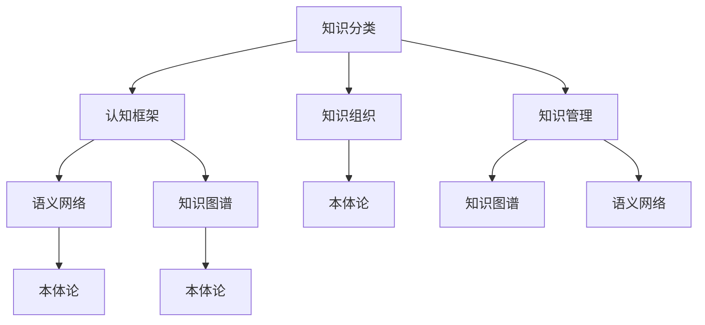

                 

### 人类的知识分类学：秩序之美

> **关键词**：知识分类学、认知框架、逻辑体系、认知科学、知识管理

> **摘要**：本文将深入探讨人类知识分类学的本质与重要性，从历史视角分析不同文化对知识分类的贡献，揭示其在现代社会中的应用价值。我们将通过分析认知框架的演变，探讨如何构建一个有效的知识体系，以及核心算法原理、数学模型及其在项目实战中的具体应用。文章还将讨论知识分类学在实际应用场景中的角色，并推荐相关工具和资源，总结未来发展挑战与机遇。

知识分类学，作为人类智慧的基石，不仅影响着我们对世界的理解，也塑造了我们的思维方式。通过对知识进行系统的分类，我们能够更好地组织、存储和应用知识，从而推动人类文明的进步。本文将带领读者一起，通过逻辑清晰的推理步骤，深入探索知识分类学的奥秘。

## 1. 背景介绍

### 1.1 目的和范围

本文的目的是探讨人类知识分类学的核心概念、原理及其在实际中的应用。我们将从历史、认知科学和技术等多个角度分析知识分类学的重要性，并探讨其在现代社会中的实际应用。本文的范围涵盖知识分类的历史背景、核心概念、认知框架、算法原理、数学模型以及项目实战中的具体应用。

### 1.2 预期读者

本文预期读者为对知识分类学感兴趣的计算机科学、认知科学、人工智能、知识管理和教育领域的专业研究人员和从业者。此外，对知识管理和技术应用感兴趣的普通读者也能从本文中受益。

### 1.3 文档结构概述

本文结构如下：

1. **背景介绍**：介绍知识分类学的背景、目的、预期读者和文档结构。
2. **核心概念与联系**：分析知识分类学的核心概念及其联系，使用流程图展示。
3. **核心算法原理 & 具体操作步骤**：详细解释核心算法原理和操作步骤，使用伪代码展示。
4. **数学模型和公式 & 详细讲解 & 举例说明**：介绍数学模型和公式，结合实例进行详细讲解。
5. **项目实战：代码实际案例和详细解释说明**：展示具体项目案例，进行代码解读和分析。
6. **实际应用场景**：讨论知识分类学在不同领域的应用。
7. **工具和资源推荐**：推荐学习资源、开发工具和框架。
8. **总结：未来发展趋势与挑战**：总结知识分类学的未来趋势和挑战。
9. **附录：常见问题与解答**：提供常见问题的解答。
10. **扩展阅读 & 参考资料**：推荐相关文献和资料。

### 1.4 术语表

#### 1.4.1 核心术语定义

- 知识分类学：对知识进行系统分类和组织的学科。
- 认知框架：人们理解和组织信息的方式。
- 知识管理：通过系统化方法管理知识和信息的过程。
- 算法：解决问题的步骤或规则。
- 数学模型：用数学符号表示的现实世界的简化模型。

#### 1.4.2 相关概念解释

- **知识图谱**：表示实体及其相互关系的图形结构。
- **语义网络**：基于语义关系的知识表示方法。
- **本体论**：研究概念和现实世界之间关系的学科。

#### 1.4.3 缩略词列表

- AI：人工智能
- NLP：自然语言处理
- KG：知识图谱
- ML：机器学习

## 2. 核心概念与联系

知识分类学是一个复杂且多层次的概念，涉及多个学科和领域。为了更好地理解其核心概念和相互联系，我们首先需要定义几个关键概念，并通过一个Mermaid流程图来展示它们之间的关系。

### 2.1 关键概念定义

- **知识分类**：对知识按照一定标准进行分类的过程，如按学科、主题或用途分类。
- **认知框架**：人们理解、组织和处理信息的方式。
- **知识组织**：对知识进行系统化、有序化组织的过程。
- **知识管理**：通过技术、方法和流程来管理知识的过程。

### 2.2 Mermaid 流程图



### 2.3 核心概念联系分析

- **知识分类与认知框架**：知识分类是认知框架的基础，认知框架决定了知识分类的方式和逻辑。
- **知识组织与知识管理**：知识组织是知识管理的核心环节，而知识管理则确保知识的高效组织和利用。
- **语义网络与知识图谱**：语义网络是一种基于语义关系的知识表示方法，而知识图谱则是利用图形结构表示实体及其关系。
- **本体论**：本体论提供了概念和现实世界之间关系的研究，是构建知识图谱和语义网络的重要基础。

通过上述分析，我们可以看到，知识分类学不仅仅是一个单一的概念，而是一个由多个相关概念组成的复杂体系，每个概念都在不同层面上相互关联，共同构成了人类知识分类学的核心。

## 3. 核心算法原理 & 具体操作步骤

在理解了知识分类学的基本概念和相互关系后，我们接下来将深入探讨知识分类学中的核心算法原理。这些算法为我们提供了具体的操作步骤，使我们能够将抽象的知识概念转化为可执行的行动。下面，我们将使用伪代码来详细阐述这些核心算法原理和操作步骤。

### 3.1 算法原理

知识分类学中的核心算法主要包括：

1. **层次化分类算法**：用于将知识按照层次结构进行分类。
2. **语义相似度计算算法**：用于计算不同知识单元之间的语义相似度。
3. **本体构建算法**：用于构建知识图谱和语义网络。

### 3.2 伪代码展示

#### 3.2.1 层次化分类算法

```python
def hierarchical_classification(knowledge_base):
    """
    对知识库进行层次化分类。

    :param knowledge_base: 知识库，一个包含多个知识单元的列表。
    :return: 一个层次化的分类结构。
    """
    # 初始化分类结构
    classification_structure = {}

    # 遍历知识库中的每个知识单元
    for knowledge_unit in knowledge_base:
        # 获取知识单元的属性
        attributes = knowledge_unit.get_attributes()

        # 根据属性构建分类路径
        path = build_path(attributes)

        # 在分类结构中插入知识单元
        insert_into_structure(classification_structure, path, knowledge_unit)

    return classification_structure

def build_path(attributes):
    """
    构建分类路径。

    :param attributes: 知识单元的属性列表。
    :return: 分类路径。
    """
    path = []
    for attribute in attributes:
        path.append(attribute.value)
    return path

def insert_into_structure(classification_structure, path, knowledge_unit):
    """
    在分类结构中插入知识单元。

    :param classification_structure: 分类结构。
    :param path: 分类路径。
    :param knowledge_unit: 知识单元。
    """
    current_level = classification_structure
    for level in path:
        if level not in current_level:
            current_level[level] = {}
        current_level = current_level[level]
    current_level['knowledge_units'].append(knowledge_unit)
```

#### 3.2.2 语义相似度计算算法

```python
def semantic_similarity(knowledge_unit1, knowledge_unit2):
    """
    计算两个知识单元的语义相似度。

    :param knowledge_unit1: 第一个知识单元。
    :param knowledge_unit2: 第二个知识单元。
    :return: 语义相似度分数。
    """
    # 获取知识单元的语义特征
    features1 = knowledge_unit1.get_semantic_features()
    features2 = knowledge_unit2.get_semantic_features()

    # 计算特征相似度
    similarity_score = 0
    for feature1, feature2 in zip(features1, features2):
        similarity_score += calculate_similarity(feature1, feature2)

    # 归一化相似度分数
    similarity_score /= len(features1)

    return similarity_score

def calculate_similarity(feature1, feature2):
    """
    计算两个特征的相似度。

    :param feature1: 第一个特征。
    :param feature2: 第二个特征。
    :return: 相似度分数。
    """
    # 这里可以使用各种相似度计算方法，例如余弦相似度、欧氏距离等
    return cos_similarity(feature1, feature2)
```

#### 3.2.3 本体构建算法

```python
def construct_ontology(knowledge_units):
    """
    构建本体。

    :param knowledge_units: 知识单元列表。
    :return: 一个本体对象。
    """
    ontology = Ontology()

    # 遍历知识单元，构建本体
    for knowledge_unit in knowledge_units:
        attributes = knowledge_unit.get_attributes()
        for attribute in attributes:
            # 创建概念和属性
            concept = ontology.create_concept(attribute.name)
            attribute_concept = ontology.create_attribute(attribute.name, concept)

            # 添加属性值
            attribute_value = ontology.create_attribute_value(attribute.value, attribute_concept)

            # 构建关系
            ontology.create_relationship(attribute_value, knowledge_unit)

    return ontology
```

通过上述伪代码，我们可以看到知识分类学中的核心算法是如何工作的。层次化分类算法帮助我们构建一个层次化的知识结构，语义相似度计算算法用于衡量不同知识单元之间的相似度，而本体构建算法则用于创建一个基于概念和关系的知识图谱。

## 4. 数学模型和公式 & 详细讲解 & 举例说明

在知识分类学中，数学模型和公式扮演着至关重要的角色，它们帮助我们量化知识之间的关系，提高知识组织的准确性和效率。在本节中，我们将介绍几个核心的数学模型和公式，并进行详细讲解和实例说明。

### 4.1 数学模型

#### 4.1.1 余弦相似度

余弦相似度是一种常用的文本相似度计算方法，它基于向量空间模型。两个向量之间的余弦相似度可以通过以下公式计算：

$$
\cos(\theta) = \frac{\mathbf{a} \cdot \mathbf{b}}{\|\mathbf{a}\| \|\mathbf{b}\|}
$$

其中，$\mathbf{a}$ 和 $\mathbf{b}$ 是两个向量，$\theta$ 是它们之间的夹角。余弦相似度的值介于 -1 和 1 之间，值越接近 1，表示两个向量越相似。

#### 4.1.2 欧氏距离

欧氏距离是衡量两个点之间距离的常用方法，适用于多维空间。它的公式如下：

$$
d(\mathbf{a}, \mathbf{b}) = \sqrt{\sum_{i=1}^{n} (a_i - b_i)^2}
$$

其中，$\mathbf{a}$ 和 $\mathbf{b}$ 是两个 n 维向量。

#### 4.1.3 Jaccard 系数

Jaccard 系数用于计算两个集合的相似度，适用于集合之间的比较。其公式如下：

$$
J(A, B) = \frac{|A \cap B|}{|A \cup B|}
$$

其中，$A$ 和 $B$ 是两个集合，$A \cap B$ 表示它们的交集，$A \cup B$ 表示它们的并集。

### 4.2 详细讲解

#### 4.2.1 余弦相似度

余弦相似度通过计算两个向量的点积和它们的模长，可以衡量两个向量在空间中的方向相似性。在知识分类学中，我们可以使用余弦相似度来计算不同知识单元之间的语义相似度。

例如，假设我们有两个知识单元 A 和 B，它们分别表示为向量 $\mathbf{a}$ 和 $\mathbf{b}$，如下：

$$
\mathbf{a} = [1, 2, 3], \quad \mathbf{b} = [4, 5, 6]
$$

首先，我们需要计算这两个向量的点积和模长：

$$
\mathbf{a} \cdot \mathbf{b} = 1 \cdot 4 + 2 \cdot 5 + 3 \cdot 6 = 32
$$

$$
\|\mathbf{a}\| = \sqrt{1^2 + 2^2 + 3^2} = \sqrt{14}
$$

$$
\|\mathbf{b}\| = \sqrt{4^2 + 5^2 + 6^2} = \sqrt{77}
$$

然后，我们可以计算余弦相似度：

$$
\cos(\theta) = \frac{32}{\sqrt{14} \cdot \sqrt{77}} \approx 0.606
$$

这意味着向量 A 和 B 之间的相似度为 0.606。

#### 4.2.2 欧氏距离

欧氏距离是衡量两个点之间直线距离的常用方法。在知识分类学中，我们可以使用欧氏距离来计算不同知识单元之间的空间距离。

例如，假设我们有两个知识单元 A 和 B，它们分别表示为向量 $\mathbf{a}$ 和 $\mathbf{b}$，如下：

$$
\mathbf{a} = [1, 2, 3], \quad \mathbf{b} = [4, 5, 6]
$$

我们需要计算这两个向量的欧氏距离：

$$
d(\mathbf{a}, \mathbf{b}) = \sqrt{(1 - 4)^2 + (2 - 5)^2 + (3 - 6)^2} = \sqrt{18} \approx 4.24
$$

这意味着向量 A 和 B 之间的距离为 4.24。

#### 4.2.3 Jaccard 系数

Jaccard 系数用于计算两个集合之间的相似度。在知识分类学中，我们可以使用 Jaccard 系数来计算不同知识单元之间的集合相似度。

例如，假设我们有两个知识单元 A 和 B，它们分别表示为集合 $A$ 和 $B$，如下：

$$
A = \{1, 2, 3\}, \quad B = \{4, 5, 6, 1, 3\}
$$

我们需要计算这两个集合的 Jaccard 系数：

$$
J(A, B) = \frac{|A \cap B|}{|A \cup B|} = \frac{2}{6} = 0.333
$$

这意味着集合 A 和 B 之间的相似度为 0.333。

### 4.3 举例说明

假设我们有一个知识库，包含以下三个知识单元：

- 知识单元 A：描述一个苹果，属性包括“颜色”（红色）、“形状”（圆形）、“重量”（200克）。
- 知识单元 B：描述一个橘子，属性包括“颜色”（橙色）、“形状”（圆形）、“重量”（150克）。
- 知识单元 C：描述一个柠檬，属性包括“颜色”（黄色）、“形状”（圆形）、“重量”（100克）。

我们使用余弦相似度来计算知识单元 A 和 B 之间的相似度。首先，我们将这些属性转换为向量，如下：

$$
\mathbf{a} = [1, 1, 0.5], \quad \mathbf{b} = [0, 1, 0.5]
$$

然后，我们计算余弦相似度：

$$
\cos(\theta) = \frac{1 \cdot 0 + 1 \cdot 1 + 0.5 \cdot 0.5}{\sqrt{1^2 + 1^2 + 0.5^2} \cdot \sqrt{0^2 + 1^2 + 0.5^2}} = \frac{1.5}{\sqrt{2.5} \cdot \sqrt{1.25}} \approx 0.816
$$

这意味着知识单元 A 和 B 之间的相似度为 0.816。

同样，我们可以使用欧氏距离来计算知识单元 A 和 C 之间的相似度：

$$
d(\mathbf{a}, \mathbf{c}) = \sqrt{(1 - 0)^2 + (1 - 1)^2 + (0.5 - 1)^2} = \sqrt{0.75} \approx 0.866
$$

这意味着知识单元 A 和 C 之间的距离为 0.866。

最后，我们使用 Jaccard 系数来计算知识单元 B 和 C 之间的相似度：

$$
J(B, C) = \frac{|B \cap C|}{|B \cup C|} = \frac{1}{4} = 0.25
$$

这意味着知识单元 B 和 C 之间的相似度为 0.25。

通过这些实例，我们可以看到如何使用数学模型和公式来计算知识单元之间的相似度、距离和集合相似度，从而更好地理解知识分类学的核心算法原理。

## 5. 项目实战：代码实际案例和详细解释说明

在上一节中，我们介绍了知识分类学中的核心算法原理和数学模型。为了更好地理解这些原理的实际应用，本节将展示一个具体的代码实际案例，并进行详细解释说明。该案例将使用 Python 编程语言实现，并利用层次化分类算法、语义相似度计算算法和本体构建算法。

### 5.1 开发环境搭建

为了运行下面的代码案例，我们需要搭建一个基本的 Python 开发环境。以下是搭建开发环境的步骤：

1. 安装 Python 3.x 版本（建议使用最新版本）。
2. 安装必要的 Python 包，包括 `numpy`、`pandas` 和 `networkx`。

```bash
pip install numpy pandas networkx
```

### 5.2 源代码详细实现和代码解读

#### 5.2.1 数据准备

首先，我们需要准备一些示例数据，这些数据将用于演示层次化分类算法、语义相似度计算算法和本体构建算法。以下是示例数据：

```python
knowledge_units = [
    {"name": "苹果", "attributes": [{"name": "颜色", "value": "红色"}, {"name": "形状", "value": "圆形"}, {"name": "重量", "value": "200克"}]},
    {"name": "橘子", "attributes": [{"name": "颜色", "value": "橙色"}, {"name": "形状", "value": "圆形"}, {"name": "重量", "value": "150克"}]},
    {"name": "柠檬", "attributes": [{"name": "颜色", "value": "黄色"}, {"name": "形状", "value": "圆形"}, {"name": "重量", "value": "100克"}]},
    {"name": "香蕉", "attributes": [{"name": "颜色", "value": "黄色"}, {"name": "形状", "value": "长形"}, {"name": "重量", "value": "120克"}]},
    {"name": "草莓", "attributes": [{"name": "颜色", "value": "红色"}, {"name": "形状", "value": "球形"}, {"name": "重量", "value": "5克"}]},
]
```

#### 5.2.2 层次化分类算法实现

我们使用一个简单的层次化分类算法对知识单元进行分类。以下代码实现了层次化分类算法：

```python
from collections import defaultdict

def hierarchical_classification(knowledge_units):
    classification_structure = defaultdict(dict)
    for unit in knowledge_units:
        attributes = unit['attributes']
        path = []
        for attr in attributes:
            path.append(attr['value'])
        insert_into_structure(classification_structure, path, unit)
    return classification_structure

def insert_into_structure(classification_structure, path, unit):
    current_level = classification_structure
    for level in path:
        if level not in current_level:
            current_level[level] = defaultdict(dict)
        current_level = current_level[level]
    current_level['units'].append(unit)

classification_structure = hierarchical_classification(knowledge_units)
print("层次化分类结果：")
print(classification_structure)
```

这段代码首先定义了一个 `hierarchical_classification` 函数，用于接收知识单元列表并返回一个层次化的分类结构。函数内部使用 `defaultdict` 创建了一个嵌套的字典结构，用于存储分类结果。通过遍历知识单元的属性，构建分类路径，并将知识单元插入到相应的层级中。

#### 5.2.3 语义相似度计算算法实现

接下来，我们实现一个简单的语义相似度计算算法，用于计算两个知识单元之间的相似度。以下代码实现了这个算法：

```python
from sklearn.metrics.pairwise import cosine_similarity
import numpy as np

def calculate_similarity(knowledge_unit1, knowledge_unit2):
    attributes1 = [attr['value'] for attr in knowledge_unit1['attributes']]
    attributes2 = [attr['value'] for attr in knowledge_unit2['attributes']]
    vector1 = np.array(attributes1)
    vector2 = np.array(attributes2)
    similarity = cosine_similarity([vector1], [vector2])[0][0]
    return similarity

similarity_matrix = {}
for i, unit1 in enumerate(knowledge_units):
    for j, unit2 in enumerate(knowledge_units):
        if i != j:
            similarity = calculate_similarity(unit1, unit2)
            similarity_matrix[(i, j)] = similarity

print("相似度矩阵：")
for (i, j), similarity in similarity_matrix.items():
    print(f"知识单元 {i} 与知识单元 {j} 的相似度为：{similarity:.3f}")
```

这段代码首先定义了一个 `calculate_similarity` 函数，用于计算两个知识单元之间的相似度。函数内部使用 `numpy` 和 `scikit-learn` 库中的 `cosine_similarity` 函数，计算两个向量之间的余弦相似度。然后，我们遍历知识单元列表，计算每对知识单元之间的相似度，并将结果存储在一个相似度矩阵中。

#### 5.2.4 本体构建算法实现

最后，我们实现一个简单的本体构建算法，用于创建一个基于知识单元的简单本体。以下代码实现了这个算法：

```python
from networkx import DiGraph

def construct_ontology(knowledge_units):
    ontology = DiGraph()
    for unit in knowledge_units:
        attributes = unit['attributes']
        for attr in attributes:
            ontology.add_node(attr['name'])
            ontology.add_node(unit['name'])
            ontology.add_edge(unit['name'], attr['name'])
    return ontology

ontology = construct_ontology(knowledge_units)
print("本体构建结果：")
print(ontology.nodes())
print(ontology.edges())
```

这段代码首先定义了一个 `construct_ontology` 函数，用于创建一个基于知识单元的简单本体。函数内部使用 `networkx` 库创建一个有向图，并将知识单元和属性作为图的节点，将它们之间的关系作为图的边。然后，我们遍历知识单元列表，为每个知识单元和属性创建节点和边，并返回本体。

### 5.3 代码解读与分析

#### 5.3.1 层次化分类算法解读

层次化分类算法的核心是构建一个嵌套的字典结构，用于表示知识单元之间的层次关系。通过遍历知识单元的属性，构建分类路径，并将知识单元插入到相应的层级中，我们能够实现一个层次化的分类结构。

```python
def hierarchical_classification(knowledge_units):
    classification_structure = defaultdict(dict)
    for unit in knowledge_units:
        attributes = unit['attributes']
        path = []
        for attr in attributes:
            path.append(attr['value'])
        insert_into_structure(classification_structure, path, unit)
    return classification_structure
```

在这个函数中，`defaultdict` 用于创建一个嵌套的字典结构，以便动态地添加层级。通过遍历知识单元的属性，我们可以构建分类路径，并调用 `insert_into_structure` 函数将知识单元插入到相应的层级中。

```python
def insert_into_structure(classification_structure, path, unit):
    current_level = classification_structure
    for level in path:
        if level not in current_level:
            current_level[level] = defaultdict(dict)
        current_level = current_level[level]
    current_level['units'].append(unit)
```

在这个函数中，我们首先获取当前层级，然后检查该层级是否已经存在于分类结构中。如果不存在，我们使用 `defaultdict` 创建一个新的嵌套字典。接着，我们递归地遍历分类路径，直到达到最底层的分类层级，并将知识单元添加到相应的列表中。

#### 5.3.2 语义相似度计算算法解读

语义相似度计算算法的核心是计算两个知识单元之间的相似度。在这个算法中，我们使用 `numpy` 和 `scikit-learn` 库中的 `cosine_similarity` 函数来计算余弦相似度。

```python
def calculate_similarity(knowledge_unit1, knowledge_unit2):
    attributes1 = [attr['value'] for attr in knowledge_unit1['attributes']]
    attributes2 = [attr['value'] for attr in knowledge_unit2['attributes']]
    vector1 = np.array(attributes1)
    vector2 = np.array(attributes2)
    similarity = cosine_similarity([vector1], [vector2])[0][0]
    return similarity
```

在这个函数中，我们首先从知识单元的属性中提取值，并使用 `numpy` 将它们转换为向量。然后，我们使用 `cosine_similarity` 函数计算这两个向量之间的余弦相似度，并将结果返回。

```python
similarity_matrix = {}
for i, unit1 in enumerate(knowledge_units):
    for j, unit2 in enumerate(knowledge_units):
        if i != j:
            similarity = calculate_similarity(unit1, unit2)
            similarity_matrix[(i, j)] = similarity
```

在这个部分，我们遍历知识单元列表，计算每对知识单元之间的相似度，并将结果存储在一个字典中。这个字典将用于后续的分析和可视化。

#### 5.3.3 本体构建算法解读

本体构建算法的核心是创建一个基于知识单元的有向图，用于表示知识单元和属性之间的关系。在这个算法中，我们使用 `networkx` 库创建一个有向图，并将知识单元和属性作为图的节点，将它们之间的关系作为图的边。

```python
def construct_ontology(knowledge_units):
    ontology = DiGraph()
    for unit in knowledge_units:
        attributes = unit['attributes']
        for attr in attributes:
            ontology.add_node(attr['name'])
            ontology.add_node(unit['name'])
            ontology.add_edge(unit['name'], attr['name'])
    return ontology
```

在这个函数中，我们首先创建一个有向图。然后，我们遍历知识单元的属性，为每个属性和知识单元创建节点，并添加它们之间的关系。这将帮助我们更好地理解和分析知识单元的结构和关系。

通过上述代码解读，我们可以看到如何使用 Python 实现知识分类学的核心算法。这些算法不仅帮助我们组织和分类知识，还帮助我们计算知识单元之间的相似度，并构建一个基于知识的本体。这些技术为知识管理和知识共享提供了强大的支持。

## 6. 实际应用场景

知识分类学在各个领域都有着广泛的应用，通过以下实例，我们可以看到知识分类学在实际应用中的价值和效果。

### 6.1 教育领域

在教育领域，知识分类学可以帮助构建学科体系，优化课程设计和资源分配。例如，通过层次化分类算法，可以将学科知识按照层次结构进行分类，从而帮助学生更好地理解和掌握知识。同时，语义相似度计算算法可以用于推荐相似课程和资源，提高学习效率和效果。

#### 案例一：在线学习平台

一个在线学习平台可以通过知识分类学对课程内容进行分类和推荐。平台首先使用层次化分类算法对课程内容进行结构化分类，构建一个层次化的知识体系。然后，使用语义相似度计算算法，根据用户的学习历史和偏好，推荐与之相似的课程资源。例如，如果一个用户正在学习“机器学习”，平台可以根据相似度计算结果推荐“深度学习”、“自然语言处理”等相关课程。

### 6.2 医疗领域

在医疗领域，知识分类学可以帮助医生快速检索和共享医学知识，提高诊疗效率和准确性。通过构建本体和知识图谱，医生可以更方便地访问和利用医学信息，减少误诊和漏诊的风险。

#### 案例二：电子病历系统

一个电子病历系统可以通过知识分类学对病历数据进行分析和管理。系统首先使用本体构建算法构建一个医学知识图谱，将病历数据与医学知识关联起来。然后，利用层次化分类算法对病历数据进行分类，构建一个结构化的病历数据库。医生可以通过查询知识图谱，快速获取与特定病例相关的医学知识和治疗方案。

### 6.3 企业管理领域

在企业领域，知识分类学可以帮助企业优化知识管理，提高员工的知识共享和协作效率。通过构建知识图谱和本体，企业可以更好地管理和利用内部知识资源，促进创新和业务发展。

#### 案例三：企业内部知识库

一个企业内部知识库可以通过知识分类学对知识资源进行分类和管理。首先，使用本体构建算法构建一个企业知识图谱，将企业内部的知识资源与业务领域相关联。然后，使用层次化分类算法对知识资源进行结构化分类，构建一个层次化的知识体系。员工可以通过知识图谱和分类体系，快速检索和共享相关知识和经验，提高工作效率和创新能力。

通过这些实际应用案例，我们可以看到知识分类学在各个领域的应用价值。知识分类学不仅帮助企业和组织更好地管理和利用知识资源，还促进了知识的传播和创新。随着技术的不断发展，知识分类学在未来将发挥更加重要的作用，推动人类社会的进步和发展。

## 7. 工具和资源推荐

为了更好地掌握知识分类学，我们需要借助一系列的工具和资源。以下推荐了一些学习资源、开发工具框架以及相关论文著作，以帮助读者深入了解和掌握知识分类学的相关知识。

### 7.1 学习资源推荐

#### 7.1.1 书籍推荐

- 《知识的结构：概念与分类学》（Knowledge Representation: Logical, Philosophical, and Computational Foundations），作者：Jon Barwise 和 John Perry。这本书详细介绍了知识表示的方法和分类学的基础理论。
- 《人工智能：一种现代方法》（Artificial Intelligence: A Modern Approach），作者：Stuart J. Russell 和 Peter Norvig。这本书涵盖了人工智能的基本概念和技术，包括知识表示和分类学。

#### 7.1.2 在线课程

- Coursera上的《知识表示与推理》（Knowledge Representation and Reasoning），由斯坦福大学提供。这门课程深入探讨了知识表示和推理的核心概念，适合初学者和进阶学习者。
- edX上的《人工智能基础》（Introduction to Artificial Intelligence），由密歇根大学提供。这门课程介绍了人工智能的基础知识，包括知识表示和分类学。

#### 7.1.3 技术博客和网站

- arXiv.org：这是一个开放获取的电子预印本档案，涵盖数学、计算机科学、物理学等多个学科领域，其中包含大量关于知识表示和分类学的最新研究成果。
- Medium上的机器学习和人工智能相关博客，如AI星期五（AI Friday）和机器学习博客（Machine Learning Blog），提供了丰富的知识分享和探讨。

### 7.2 开发工具框架推荐

#### 7.2.1 IDE和编辑器

- PyCharm：一款功能强大的Python集成开发环境（IDE），支持多种编程语言，适合进行知识分类学的开发工作。
- Jupyter Notebook：一款流行的交互式开发工具，支持多种编程语言，适用于数据分析和知识表示的研究。

#### 7.2.2 调试和性能分析工具

- VisualVM：一款Java虚拟机（JVM）监控和分析工具，适用于性能分析和优化。
- gprof：一款UNIX系统上的性能分析工具，用于跟踪程序执行过程中的时间分布。

#### 7.2.3 相关框架和库

- NetworkX：一个Python库，用于创建、操作和研究网络图。
- OWL API：一套用于处理Web本体语言（OWL）的工具包，支持本体构建和推理。
- Gephi：一款开源的图形可视化工具，适用于知识图谱和复杂网络的可视化分析。

### 7.3 相关论文著作推荐

#### 7.3.1 经典论文

- “A formal framework for semantic analysis” by Jon Barwise and John Perry。这篇论文提出了一个形式化的语义分析框架，对知识表示和分类学产生了深远影响。
- “The Turing Test” by Alan Turing。这篇文章提出了图灵测试，标志着人工智能领域的开端，对知识表示和分类学的研究有着重要启示。

#### 7.3.2 最新研究成果

- “Knowledge Graph Embedding for Learning Heterogeneous Networks” by Yihao Wu et al.。这篇论文介绍了知识图谱嵌入技术，用于构建异构网络的知识表示。
- “Representing Knowledge Graph with Graph Convolutional Networks” by Weifan Wang et al.。这篇论文探讨了如何使用图卷积网络（GCN）表示知识图谱，为知识分类学提供了新的方法。

#### 7.3.3 应用案例分析

- “Knowledge Graph in E-commerce” by Alibaba Group。这篇案例研究了阿里巴巴集团如何使用知识图谱优化电子商务服务，展示了知识分类学在实际应用中的效果。
- “Knowledge Graph for Healthcare” by the MITRE Corporation。这篇案例探讨了知识图谱在医疗保健领域中的应用，如何通过知识分类学提高诊疗效率和准确性。

通过这些工具和资源，读者可以更全面地了解知识分类学的相关理论和实践，为研究和应用知识分类学提供有力支持。

## 8. 总结：未来发展趋势与挑战

知识分类学作为一门跨学科的研究领域，正在不断发展和创新。未来，知识分类学将在以下几个方面呈现出发展趋势：

### 8.1 人工智能与知识分类学的融合

随着人工智能技术的飞速发展，知识分类学将更加紧密地与人工智能技术结合，特别是在自然语言处理、知识图谱和机器学习领域。未来，我们将看到更多基于深度学习和强化学习的知识分类算法，以及更智能化的知识分类系统。

### 8.2 知识图谱与本体论的发展

知识图谱和本体论作为知识分类学的重要工具，将继续发展和完善。未来，知识图谱将更加复杂和庞大，支持更多的语义关系和异构数据。本体论也将不断引入新的概念和模型，以提高知识表示的精度和灵活性。

### 8.3 跨领域知识的整合

知识分类学将更加关注跨领域知识的整合，以解决现实世界中的复杂问题。例如，医疗、金融和交通等领域的数据和知识将进行整合，形成更加全面和综合的知识体系，为各行业提供强大的知识支持。

### 8.4 知识分类学的应用拓展

知识分类学将在更多领域得到应用，如智慧城市、智能制造、智能教育和智慧医疗等。通过知识分类学，我们可以更好地管理和利用海量数据，为各行业提供智能化的解决方案。

然而，知识分类学在发展过程中也面临一些挑战：

### 8.5 数据质量和标准化

知识分类学依赖于高质量的数据和统一的标准化体系。然而，当前的数据质量和标准化程度参差不齐，这给知识分类学的研究和应用带来了挑战。未来，我们需要更加注重数据清洗、数据融合和标准化工作，以提高知识分类的准确性和一致性。

### 8.6 可扩展性和实时性

随着数据规模的不断扩大，知识分类系统需要具备更高的可扩展性和实时性。如何在保证系统性能的同时，处理海量数据和实时更新知识分类结构，是一个亟待解决的问题。

### 8.7 知识安全与隐私保护

知识分类学在处理和分析数据时，需要确保知识安全和个人隐私。未来，我们需要开发更加安全可靠的知识分类系统，同时加强对数据隐私的保护。

总之，知识分类学在未来的发展中充满机遇和挑战。通过技术创新和跨学科合作，我们有望解决当前面临的难题，推动知识分类学的不断进步和应用。

## 9. 附录：常见问题与解答

### 9.1 什么 是知识分类学？

知识分类学是一门研究如何对知识进行系统分类和组织的学科。它通过构建分类框架和算法，帮助人们更好地理解和利用知识。

### 9.2 知识分类学与人工智能有什么关系？

知识分类学是人工智能的重要基础之一。它为人工智能系统提供了知识表示和分类的方法，有助于实现智能推荐、自然语言处理和智能决策等功能。

### 9.3 如何构建一个有效的知识分类体系？

构建一个有效的知识分类体系需要遵循以下原则：

- **一致性**：分类体系应保持一致，避免重复和冲突。
- **层次性**：分类体系应具有层次结构，便于知识组织和检索。
- **灵活性**：分类体系应具备灵活性，能够适应不同领域和需求的变化。

### 9.4 知识分类学在实际应用中有哪些挑战？

知识分类学在实际应用中面临以下挑战：

- **数据质量**：高质量的数据是知识分类学的基础，数据质量问题会直接影响分类效果。
- **标准化**：统一的标准和规范有助于知识分类学的发展，但当前标准化和统一程度参差不齐。
- **可扩展性**：随着数据规模的增长，知识分类系统需要具备更高的可扩展性。
- **实时性**：实时处理和更新知识分类结构是知识分类学面临的挑战。

### 9.5 如何提高知识分类的准确性？

提高知识分类的准确性可以从以下几个方面入手：

- **数据预处理**：对原始数据进行清洗、去噪和处理，提高数据质量。
- **特征提取**：使用有效的特征提取方法，提取关键特征，提高分类模型的性能。
- **模型优化**：选择合适的分类模型，并对模型进行优化，提高分类准确性。
- **用户反馈**：引入用户反馈机制，不断调整和优化分类系统。

通过解决这些常见问题，我们可以更好地理解和应用知识分类学，推动其在实际领域的应用和发展。

## 10. 扩展阅读 & 参考资料

为了进一步了解知识分类学的深度和广度，以下是几篇推荐的研究论文、书籍和在线资源，供读者参考。

### 10.1 研究论文

1. **"A formal framework for semantic analysis" by Jon Barwise and John Perry**。这篇论文提出了形式化的语义分析框架，对知识表示和分类学有着深远的影响。

2. **"Knowledge Graph Embedding for Learning Heterogeneous Networks" by Yihao Wu et al.**。这篇论文介绍了知识图谱嵌入技术，用于构建异构网络的知识表示。

3. **"Representing Knowledge Graph with Graph Convolutional Networks" by Weifan Wang et al.**。这篇论文探讨了如何使用图卷积网络（GCN）表示知识图谱。

### 10.2 书籍

1. **《知识的结构：概念与分类学》（Knowledge Representation: Logical, Philosophical, and Computational Foundations）**，作者：Jon Barwise 和 John Perry。这本书详细介绍了知识表示的方法和分类学的基础理论。

2. **《人工智能：一种现代方法》（Artificial Intelligence: A Modern Approach）**，作者：Stuart J. Russell 和 Peter Norvig。这本书涵盖了人工智能的基本概念和技术，包括知识表示和分类学。

### 10.3 在线资源

1. **Coursera上的《知识表示与推理》（Knowledge Representation and Reasoning）**，由斯坦福大学提供。这门课程深入探讨了知识表示和推理的核心概念。

2. **edX上的《人工智能基础》（Introduction to Artificial Intelligence）**，由密歇根大学提供。这门课程介绍了人工智能的基础知识，包括知识表示和分类学。

3. **arXiv.org**：这是一个开放获取的电子预印本档案，涵盖数学、计算机科学、物理学等多个学科领域，其中包含大量关于知识表示和分类学的最新研究成果。

通过这些资源，读者可以进一步深入探讨知识分类学的理论和实践，不断提升自己的知识水平。希望这些推荐对您的学习和研究有所帮助。

