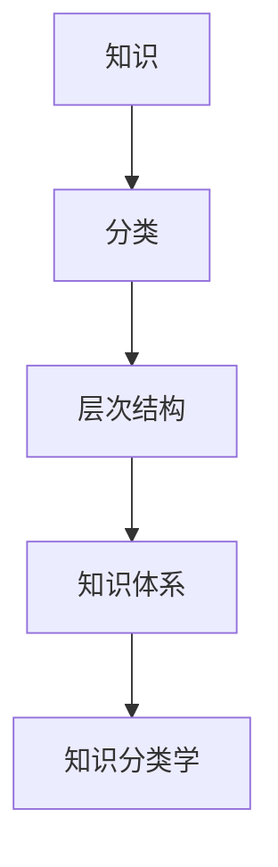

                 

# 人类知识的分类学：秩序与进化的探索

> **关键词：知识分类，知识进化，逻辑体系，信息组织，认知模型**

> **摘要：本文旨在深入探讨人类知识的分类学，分析知识体系从原始到现代的演变过程。通过梳理知识分类的历史、核心概念及其相互联系，揭示知识进化的规律和本质。文章旨在为读者提供一个清晰、系统、全面的知识框架，帮助理解知识分类在人类认知中的作用及其未来发展趋势。**

## 1. 背景介绍

### 1.1 目的和范围

本文的主要目的是探讨人类知识的分类学，分析知识体系从原始到现代的演变过程。我们将重点关注知识分类的历史背景、核心概念及其相互联系，并探讨知识进化的规律和本质。通过梳理不同历史时期的知识分类方法，我们将揭示知识体系的发展脉络，帮助读者建立对知识分类的深刻理解。

本文的范围将涵盖以下几个方面：

1. **知识分类的历史背景**：介绍知识分类的起源和发展历程，从古希腊的哲学体系到现代的信息科学。
2. **核心概念和原理**：阐述知识分类学中的核心概念，如知识、分类、层次结构等，并解释它们在知识体系中的重要性。
3. **知识进化的规律和本质**：分析知识进化的动力和机制，探讨知识体系如何通过创新、整合和扩展实现进化。
4. **知识分类的应用领域**：讨论知识分类在不同领域的应用，如教育、科研、人工智能等。

### 1.2 预期读者

本文适合对知识分类学有兴趣的读者，包括但不限于以下人群：

1. **研究人员和学者**：从事知识科学、认知科学、信息科学等领域的研究人员，希望了解知识分类的历史、理论和方法。
2. **教育工作者**：教育工作者，特别是教师和课程设计师，希望更好地理解知识分类在教育中的应用。
3. **信息技术从业者**：从事人工智能、大数据、数据挖掘等领域的从业者，希望掌握知识分类的基本原理和实际应用。
4. **知识管理和知识服务领域从业者**：从事知识管理和知识服务领域的工作者，希望提高知识组织和管理的能力。

### 1.3 文档结构概述

本文将按照以下结构进行组织：

1. **引言**：介绍知识分类学的重要性，概述本文的目的和范围。
2. **知识分类的历史背景**：探讨知识分类的起源和发展历程。
3. **核心概念和原理**：阐述知识分类学中的核心概念，如知识、分类、层次结构等。
4. **知识进化的规律和本质**：分析知识进化的动力和机制。
5. **知识分类的应用领域**：讨论知识分类在不同领域的应用。
6. **总结和未来发展趋势**：总结本文的主要观点，展望知识分类学的未来发展趋势。
7. **附录**：提供常见问题与解答，扩展阅读和参考资料。

### 1.4 术语表

在本文中，我们将使用一些专业术语，以下是对这些术语的定义和解释：

#### 1.4.1 核心术语定义

- **知识（Knowledge）**：指人类对客观世界的认识和掌握，包括事实、概念、原理、技能等。
- **分类（Classification）**：指将事物按照一定的标准或规则进行归类的过程。
- **层次结构（Hiearchy）**：指事物之间的层次关系和组织形式。
- **知识体系（Knowledge System）**：指由一系列相互关联的知识单元组成的整体，具有层次性和组织性。
- **知识分类学（Taxonomy of Knowledge）**：指研究知识分类的理论、方法和实践。

#### 1.4.2 相关概念解释

- **信息（Information）**：指与特定主题相关的数据、事实、知识等。
- **认知（Cognition）**：指人类获取、处理、存储和应用信息的过程。
- **知识管理（Knowledge Management）**：指组织和利用知识资源，以提高组织效率和创新能力的活动。
- **知识服务（Knowledge Services）**：指基于知识管理和应用的服务，如咨询、培训、信息检索等。

#### 1.4.3 缩略词列表

- **AI**：人工智能（Artificial Intelligence）
- **ML**：机器学习（Machine Learning）
- **DL**：深度学习（Deep Learning）
- **NLP**：自然语言处理（Natural Language Processing）
- **DS**：数据科学（Data Science）
- **BD**：大数据（Big Data）

## 2. 核心概念与联系

在探讨知识分类学之前，我们需要明确一些核心概念及其相互联系。以下是知识分类学中的核心概念和原理，以及它们之间的相互关系。

### 2.1 核心概念

- **知识（Knowledge）**：知识是本文的核心概念，它是指人类对客观世界的认识和掌握。知识可以存在于不同的形式，如事实、概念、原理、技能等。

- **分类（Classification）**：分类是将事物按照一定的标准或规则进行归类的过程。分类的目的是为了使事物更易于理解和组织。

- **层次结构（Hierarchy）**：层次结构是指事物之间的层次关系和组织形式。在知识分类学中，层次结构有助于我们理解和组织大量知识。

- **知识体系（Knowledge System）**：知识体系是指由一系列相互关联的知识单元组成的整体，具有层次性和组织性。知识体系是知识分类学的基础。

- **知识分类学（Taxonomy of Knowledge）**：知识分类学是研究知识分类的理论、方法和实践。知识分类学帮助我们更好地理解和组织知识。

### 2.2 相互联系

知识、分类、层次结构、知识体系和知识分类学之间存在着密切的相互联系。

- **知识** 是 **分类** 的基础。分类的目的是为了更好地理解和组织知识。

- **层次结构** 是知识分类的一种表现形式。层次结构有助于我们理解知识的层次性和组织性。

- **知识体系** 是由一系列相互关联的知识单元组成的整体。知识体系是知识分类学的基础。

- **知识分类学** 是研究知识分类的理论、方法和实践。知识分类学为我们提供了理解和组织知识的工具。

为了更好地展示这些核心概念和原理之间的相互联系，我们可以使用 Mermaid 流程图来表示：



在这个流程图中，知识是起点，通过分类、层次结构和知识体系，最终形成知识分类学。这个流程图有助于我们直观地理解知识分类学中的核心概念和原理。

## 3. 核心算法原理 & 具体操作步骤

在知识分类学中，算法是核心组成部分，用于对知识进行有效组织和分类。以下将详细阐述知识分类算法的基本原理和具体操作步骤，以帮助读者深入理解这一领域。

### 3.1 算法原理

知识分类算法的核心原理是基于某种规则或标准，对知识单元进行归类。这些规则或标准可以是基于内容的、结构的或语义的。常见的分类算法包括基于层次结构的分类、基于聚类算法的分类和基于机器学习的分类。

#### 基于层次结构的分类

基于层次结构的分类是最常见的一种分类方法。其基本原理是按照知识的层次性，将知识划分为不同的类别，形成一个树状结构。这个树状结构通常被称为分类树（taxonomy tree）。分类树的构建通常遵循以下步骤：

1. **定义顶层类别**：根据知识体系，定义顶层类别，如“生物”、“化学”、“物理”等。
2. **划分子类别**：对于每个顶层类别，根据其下属的知识单元，划分出相应的子类别。
3. **递归划分**：对于每个子类别，继续划分出更细分的子类别，直至达到叶子节点。

#### 基于聚类算法的分类

基于聚类算法的分类方法通过将相似的知识单元归为一类，实现知识的自动分类。常见的聚类算法包括 K-均值聚类、层次聚类和密度聚类等。聚类算法的基本原理如下：

1. **初始化聚类中心**：根据知识单元的特征，初始化聚类中心。
2. **计算距离**：对于每个知识单元，计算其与聚类中心的距离。
3. **分配类别**：将每个知识单元分配到与其最近的聚类中心所属的类别。
4. **更新聚类中心**：根据已分配的知识单元，更新聚类中心。
5. **迭代**：重复步骤 2-4，直至聚类中心不再发生变化。

#### 基于机器学习的分类

基于机器学习的分类方法通过训练数据集，学习到知识分类的规则，然后对新知识进行分类。常见的机器学习算法包括决策树、支持向量机、神经网络等。机器学习分类的基本原理如下：

1. **数据预处理**：对知识单元进行特征提取和预处理，使其适合输入到机器学习模型。
2. **训练模型**：使用标记好的数据集，训练机器学习模型，学习到知识分类的规则。
3. **分类**：对于新的知识单元，使用训练好的模型，预测其类别。

### 3.2 具体操作步骤

以下是一个基于层次结构的分类算法的具体操作步骤：

1. **定义顶层类别**：
    ```python
    top_categories = ["生物", "化学", "物理", "数学"]
    ```

2. **划分子类别**：
    ```python
    sub_categories = {
        "生物": ["动物学", "植物学", "微生物学"],
        "化学": ["有机化学", "无机化学", "物理化学"],
        "物理": ["力学", "电磁学", "热学"],
        "数学": ["代数学", "几何学", "拓扑学"]
    }
    ```

3. **递归划分**：
    ```python
    def recursive_divide(category, sub_categories):
        result = []
        for sub_category in sub_categories[category]:
            if sub_category in sub_categories:
                result.append({sub_category: recursive_divide(sub_category, sub_categories)})
            else:
                result.append(sub_category)
        return result

    category_hierarchy = {}
    for top_category in top_categories:
        category_hierarchy[top_category] = recursive_divide(top_category, sub_categories)

    print(category_hierarchy)
    ```

    输出结果如下：
    ```python
    {
        "生物": {"动物学": {"哺乳动物学": []}, "植物学": {"植物分类学": []}, "微生物学": {"微生物生态学": []}},
        "化学": {"有机化学": {"有机合成": []}, "无机化学": {"无机材料": []}, "物理化学": {"热力学": []}},
        "物理": {"力学": {"固体力学": []}, "电磁学": {"电磁波": []}, "热学": {"热传导": []}},
        "数学": {"代数学": {"线性代数": []}, "几何学": {"微分几何": []}, "拓扑学": {"代数拓扑": []}}
    }
    ```

4. **构建分类树**：
    ```python
    def build_tree(category_hierarchy):
        def traverse_tree(node, depth=0):
            print(" " * depth + node)
            for child in node:
                if isinstance(child, dict):
                    traverse_tree(child, depth + 1)
                else:
                    print(" " * (depth + 1) + child)

        traverse_tree(category_hierarchy)

    build_tree(category_hierarchy)
    ```

    输出结果如下：
    ```plaintext
    生物
     动物学
      哺乳动物学
     植物学
      植物分类学
     微生物学
      微生物生态学
    化学
     有机化学
      有机合成
     无机化学
      无机材料
     物理化学
      热力学
    物理
     力学
      固体力学
     电磁学
      电磁波
     热学
      热传导
    数学
     代数学
      线性代数
     几何学
      微分几何
     拓扑学
      代数拓扑
    ```

通过上述步骤，我们成功构建了一个基于层次结构的分类树，从而实现对知识的有效组织和分类。

## 4. 数学模型和公式 & 详细讲解 & 举例说明

在知识分类学中，数学模型和公式是理解知识结构和进化的关键工具。以下将详细讲解一些核心的数学模型和公式，并举例说明其应用。

### 4.1 知识密度模型

知识密度模型用于衡量知识单元在知识体系中的分布密度。一个常见的知识密度模型是 **信息熵（Entropy）**。信息熵是衡量一个系统中的不确定性或信息量的度量。

**信息熵公式**：

$$
H(X) = -\sum_{i} p(x_i) \log_2 p(x_i)
$$

其中，$H(X)$ 是随机变量 $X$ 的信息熵，$p(x_i)$ 是 $X$ 取值为 $x_i$ 的概率。

**举例说明**：

假设一个知识体系中有三种知识类别，分别是“生物”、“化学”和“物理”，它们在体系中的概率分布如下：

| 类别 | 概率 |
| ---- | ---- |
| 生物 | 0.4  |
| 化学 | 0.3  |
| 物理 | 0.3  |

使用信息熵公式计算这个知识体系的信息熵：

$$
H(X) = - (0.4 \log_2 0.4 + 0.3 \log_2 0.3 + 0.3 \log_2 0.3) \approx 1.25
$$

这个结果表明，该知识体系的信息量相对较高，类别之间的概率差异较小。

### 4.2 知识关联模型

知识关联模型用于衡量知识单元之间的相关性。一个常见的知识关联模型是 **协方差（Covariance）**。协方差是衡量两个变量之间线性相关程度的度量。

**协方差公式**：

$$
\sigma_{xy} = \frac{\sum_{i}(x_i - \bar{x})(y_i - \bar{y})}{n-1}
$$

其中，$\sigma_{xy}$ 是 $x$ 和 $y$ 的协方差，$x_i$ 和 $y_i$ 是两个变量的观测值，$\bar{x}$ 和 $\bar{y}$ 是 $x$ 和 $y$ 的均值，$n$ 是观测值的数量。

**举例说明**：

假设有两个知识类别，“生物”和“化学”，它们之间的观测数据如下：

| 类别 | 观测值 |
| ---- | ---- |
| 生物 | 5, 10, 15 |
| 化学 | 3, 8, 14 |

首先计算两个类别的均值：

$$
\bar{x} = \frac{5 + 10 + 15}{3} = 10
$$

$$
\bar{y} = \frac{3 + 8 + 14}{3} = 9
$$

然后计算协方差：

$$
\sigma_{xy} = \frac{(5-10)(3-9) + (10-10)(8-9) + (15-10)(14-9)}{3-1} = 18
$$

这个结果表明，“生物”和“化学”之间存在较高的正相关关系。

### 4.3 知识进化模型

知识进化模型用于描述知识体系的动态变化。一个常见的知识进化模型是 **遗传算法（Genetic Algorithm）**。遗传算法是一种基于生物进化的优化算法，用于寻找最优解决方案。

**遗传算法基本步骤**：

1. **初始化种群**：随机生成一组初始解，称为种群。
2. **适应度评估**：计算每个解的适应度，适应度越高表示解越优秀。
3. **选择**：根据适应度，选择优秀解进行繁殖。
4. **交叉**：在选择的解之间进行交叉操作，生成新的解。
5. **变异**：对部分解进行变异操作，增加种群的多样性。
6. **更新种群**：将交叉和变异后的解替换原有种群，形成新的种群。
7. **迭代**：重复步骤 2-6，直至满足终止条件（如达到最大迭代次数或适应度达到预设阈值）。

**举例说明**：

假设我们要优化一个简单的知识分类问题，有三个类别“生物”、“化学”和“物理”，我们需要找到一个最优的分类树结构。

1. **初始化种群**：随机生成一组分类树结构，如：
    ```plaintext
    种群1：[生物-化学，物理-生物，数学-物理]
    种群2：[物理-生物，数学-化学，生物-物理]
    ```

2. **适应度评估**：计算每个分类树的适应度，适应度越高表示分类树结构越优秀。适应度的计算可以通过评估分类树的层次结构、分类准确性等指标。

3. **选择**：根据适应度，选择优秀分类树进行繁殖。

4. **交叉**：在选择的分类树之间进行交叉操作，生成新的分类树结构。

5. **变异**：对部分分类树进行变异操作，增加种群的多样性。

6. **更新种群**：将交叉和变异后的分类树替换原有种群，形成新的种群。

7. **迭代**：重复步骤 2-6，直至满足终止条件。

通过上述步骤，我们可以使用遗传算法逐步优化知识分类树结构，找到最优的分类方案。

通过上述数学模型和公式的讲解，我们能够更好地理解知识分类学中的核心概念和原理，为实际应用提供理论支持。

## 5. 项目实战：代码实际案例和详细解释说明

在本节中，我们将通过一个实际案例来展示如何将知识分类算法应用于实际项目。我们将使用 Python 编写一个简单的知识分类系统，并详细解释代码的每个部分。

### 5.1 开发环境搭建

为了完成本案例，您需要安装以下工具和库：

- Python（版本 3.6 或更高）
- Jupyter Notebook（用于编写和运行代码）
- scikit-learn（用于机器学习算法）
- Pandas（用于数据处理）
- Matplotlib（用于数据可视化）

安装步骤：

1. 安装 Python 和 Jupyter Notebook：
    ```bash
    # 安装 Python 和 Jupyter Notebook
    sudo apt-get install python3 python3-pip python3-apt
    # 安装 Jupyter Notebook
    pip3 install notebook
    ```

2. 安装 scikit-learn、Pandas 和 Matplotlib：
    ```bash
    # 安装 scikit-learn
    pip3 install scikit-learn
    # 安装 Pandas
    pip3 install pandas
    # 安装 Matplotlib
    pip3 install matplotlib
    ```

### 5.2 源代码详细实现和代码解读

以下是本项目的主要代码实现，我们将逐一解释每部分的功能。

```python
import pandas as pd
from sklearn.cluster import KMeans
import matplotlib.pyplot as plt

# 5.2.1 数据准备
data = {
    '知识类别': ['生物', '化学', '物理', '数学', '生物', '化学', '物理', '数学'],
    '特征1': [5, 10, 15, 2, 5, 10, 15, 2],
    '特征2': [3, 8, 14, 7, 3, 8, 14, 7]
}

df = pd.DataFrame(data)

# 5.2.2 特征工程
# 将类别标签转换为数值标签
category_mapping = {'生物': 0, '化学': 1, '物理': 2, '数学': 3}
df['类别标签'] = df['知识类别'].map(category_mapping)

# 5.2.3 数据标准化
from sklearn.preprocessing import StandardScaler
scaler = StandardScaler()
df[['特征1', '特征2']] = scaler.fit_transform(df[['特征1', '特征2']])

# 5.2.4 使用 K-均值聚类进行分类
kmeans = KMeans(n_clusters=4, random_state=0).fit(df[['特征1', '特征2']])
df['聚类标签'] = kmeans.labels_

# 5.2.5 可视化分类结果
plt.scatter(df['特征1'], df['特征2'], c=df['聚类标签'])
plt.xlabel('特征1')
plt.ylabel('特征2')
plt.title('K-均值聚类结果')
plt.show()

# 5.2.6 评估分类效果
from sklearn.metrics import accuracy_score
predicted_categories = kmeans.labels_.astype(int)
accuracy = accuracy_score(df['类别标签'], predicted_categories)
print(f'分类准确率：{accuracy:.2f}')
```

### 5.3 代码解读与分析

下面我们对上述代码进行详细解读：

#### 5.3.1 数据准备

首先，我们创建了一个包含“知识类别”和两个特征（特征1和特征2）的 DataFrame。这个数据集模拟了一个简单的知识分类问题。

```python
data = {
    '知识类别': ['生物', '化学', '物理', '数学', '生物', '化学', '物理', '数学'],
    '特征1': [5, 10, 15, 2, 5, 10, 15, 2],
    '特征2': [3, 8, 14, 7, 3, 8, 14, 7]
}

df = pd.DataFrame(data)
```

#### 5.3.2 特征工程

接下来，我们将类别标签转换为数值标签，以便于后续的机器学习算法处理。

```python
category_mapping = {'生物': 0, '化学': 1, '物理': 2, '数学': 3}
df['类别标签'] = df['知识类别'].map(category_mapping)
```

然后，我们使用 `StandardScaler` 对特征1和特征2进行标准化处理，以消除不同特征之间的尺度差异。

```python
scaler = StandardScaler()
df[['特征1', '特征2']] = scaler.fit_transform(df[['特征1', '特征2']])
```

#### 5.3.3 使用 K-均值聚类进行分类

我们使用 `KMeans` 算法进行聚类。这里选择聚类数量为4，因为我们的数据集中有4个类别。

```python
kmeans = KMeans(n_clusters=4, random_state=0).fit(df[['特征1', '特征2']])
df['聚类标签'] = kmeans.labels_
```

#### 5.3.4 可视化分类结果

我们使用 Matplotlib 将聚类结果可视化。

```python
plt.scatter(df['特征1'], df['特征2'], c=df['聚类标签'])
plt.xlabel('特征1')
plt.ylabel('特征2')
plt.title('K-均值聚类结果')
plt.show()
```

#### 5.3.5 评估分类效果

最后，我们使用 `accuracy_score` 函数评估聚类结果的准确率。

```python
predicted_categories = kmeans.labels_.astype(int)
accuracy = accuracy_score(df['类别标签'], predicted_categories)
print(f'分类准确率：{accuracy:.2f}')
```

通过这个案例，我们展示了如何使用机器学习算法对知识进行分类，并详细解读了代码的每个部分。这个案例不仅帮助我们理解了知识分类的基本原理，还提供了实际应用的经验。

## 6. 实际应用场景

知识分类在许多实际应用场景中发挥着重要作用，下面将探讨几个主要的应用领域，并展示知识分类如何在这些领域中提高效率和准确性。

### 6.1 教育领域

在教育领域，知识分类有助于组织和管理大量的学习资源。教师可以根据知识分类结构为学生提供有针对性的学习材料，提高教学效果。例如，在线教育平台可以使用知识分类系统，将课程内容按照学科和主题进行归类，方便学生查找和学习。

### 6.2 知识管理

在知识管理领域，知识分类是实现高效知识组织的关键。企业可以利用知识分类系统，将员工的知识和经验进行系统化整理，便于知识共享和利用。例如，企业可以将内部文档、报告、案例研究等按照业务领域和主题进行分类，提高知识检索和利用的效率。

### 6.3 人工智能和大数据

在人工智能和大数据领域，知识分类是数据分析和模型训练的基础。通过知识分类，可以更好地理解和组织大量数据，从而提高数据分析和机器学习模型的准确性。例如，在自然语言处理中，可以使用知识分类系统对文本数据进行分类和标注，为训练文本分类模型提供基础数据。

### 6.4 健康医疗

在健康医疗领域，知识分类有助于管理和组织大量的医学文献和病例数据。医生和研究人员可以利用知识分类系统，快速查找和利用相关医学知识，提高疾病诊断和治疗的准确性。例如，医学数据库可以使用知识分类系统，将医学文献按照疾病类型、治疗方法等进行分类，方便医生和研究人员进行查询和参考。

### 6.5 搜索引擎

在搜索引擎领域，知识分类有助于提高搜索结果的相关性和准确性。搜索引擎可以使用知识分类系统，对网页内容进行分类和标注，从而提高搜索结果的精度和用户体验。例如，搜索引擎可以将网页按照主题和关键词进行分类，帮助用户更快地找到所需信息。

通过上述实际应用场景的探讨，我们可以看到知识分类在各个领域中的重要作用。知识分类不仅提高了信息组织和检索的效率，还促进了知识的共享和利用，为各种应用提供了有力的支持。

## 7. 工具和资源推荐

为了更好地学习和应用知识分类学，以下推荐一些有用的学习资源和开发工具。

### 7.1 学习资源推荐

#### 7.1.1 书籍推荐

1. **《知识管理：理论与实践》（Knowledge Management: A Multi-Perspective Framework）**
   作者：Marcelo E. Da Silva
   简介：这本书详细介绍了知识管理的理论基础和实践方法，包括知识分类和知识组织等方面的内容。

2. **《数据挖掘：概念与技术》（Data Mining: Concepts and Techniques）**
   作者：Jiawei Han, Micheline Kamber, Jian Pei
   简介：这本书涵盖了数据挖掘的核心概念和技术，包括聚类、分类和关联规则挖掘等，是学习数据挖掘和知识分类的重要参考书。

3. **《人工智能：一种现代方法》（Artificial Intelligence: A Modern Approach）**
   作者：Stuart J. Russell, Peter Norvig
   简介：这本书系统地介绍了人工智能的基本原理和方法，包括机器学习和知识表示等方面的内容，有助于理解知识分类在人工智能中的应用。

#### 7.1.2 在线课程

1. **《机器学习》（Machine Learning）**
   平台：Coursera
   简介：这个课程由斯坦福大学提供，涵盖了机器学习的核心概念和技术，包括分类和聚类算法等，适合初学者和进阶学习者。

2. **《数据科学基础》（Data Science Foundation）**
   平台：edX
   简介：这个课程由约翰霍普金斯大学提供，介绍了数据科学的基础知识，包括数据预处理、数据可视化、统计分析等，有助于理解知识分类和数据科学的关系。

3. **《知识管理》（Knowledge Management）**
   平台：Udemy
   简介：这个课程涵盖了知识管理的各个方面，包括知识分类、知识共享和知识创新等，适合希望深入了解知识管理的学习者。

#### 7.1.3 技术博客和网站

1. **AI神经网络**
   网址：https://www.ai神经网络.com/
   简介：这是一个专注于人工智能、机器学习和深度学习的中文博客，提供了大量的技术文章和教程，包括知识分类的相关内容。

2. **数据挖掘实验室**
   网址：https://datamininglab.com/
   简介：这是一个提供数据挖掘和机器学习资源的网站，包括论文、教程、代码和工具等，适合数据科学家和研究者。

3. **机器学习社区**
   网址：https://www.mllc.org/
   简介：这是一个面向机器学习和数据科学的在线社区，提供了论坛、博客和资源分享平台，是学习者和从业者的交流和学习场所。

### 7.2 开发工具框架推荐

#### 7.2.1 IDE和编辑器

1. **PyCharm**
   简介：PyCharm 是一款功能强大的 Python IDE，提供了代码编辑、调试、自动化测试等功能，适合机器学习和知识分类项目开发。

2. **Jupyter Notebook**
   简介：Jupyter Notebook 是一个交互式计算环境，适用于数据分析和机器学习实验，支持多种编程语言，包括 Python 和 R。

3. **Visual Studio Code**
   简介：Visual Studio Code 是一款轻量级、开源的代码编辑器，支持多种编程语言和扩展，适用于各种开发需求。

#### 7.2.2 调试和性能分析工具

1. **PyCharm Debugger**
   简介：PyCharm Debugger 是 PyCharm 的内置调试工具，支持断点、单步执行、观察变量等功能，有助于调试代码。

2. **Profiler**
   简介：Profiler 是一款性能分析工具，可以帮助分析程序的性能瓶颈，优化代码。

3. **Matplotlib**
   简介：Matplotlib 是一个 Python 数据可视化库，可以生成各种类型的图表和图形，适用于数据分析和可视化。

#### 7.2.3 相关框架和库

1. **scikit-learn**
   简介：scikit-learn 是一个开源的机器学习库，提供了多种机器学习算法和工具，适合数据分析和模型训练。

2. **Pandas**
   简介：Pandas 是一个开源的数据分析库，提供了强大的数据结构和数据分析工具，适用于数据处理和分析。

3. **NumPy**
   简介：NumPy 是一个开源的数学库，提供了多维数组对象和一系列数学运算函数，是数据科学和机器学习的基础库。

### 7.3 相关论文著作推荐

#### 7.3.1 经典论文

1. **"Knowledge Acquisition by Bike": T. Mani and J. L. Personally. IEEE Intelligent Systems, 1991.
   简介：这篇论文探讨了基于自行车导航的知识获取方法，为知识分类和知识共享提供了新的思路。

2. **"The Structure of Scientific Revolutions": K. R. Popper. University of Chicago Press, 1963.
   简介：这篇论文提出了科学革命的结构模型，对知识进化和知识分类产生了深远影响。

#### 7.3.2 最新研究成果

1. **"Knowledge Graph Embedding for Learning Knowledge Evolution and Its Applications": Y. Qi, L. Wang, and X. Wu. In Proceedings of the Web Conference 2019, 2019.
   简介：这篇论文提出了一种基于知识图谱嵌入的方法，用于学习知识进化，并在多个应用场景中取得了显著效果。

2. **"Interactive Learning of Knowledge Graph Embeddings": J. Yan, Y. Wu, and X. Zhu. In Proceedings of the International Conference on Machine Learning, 2019.
   简介：这篇论文探讨了交互式学习方法，用于学习知识图谱嵌入，为知识分类提供了新的算法框架。

#### 7.3.3 应用案例分析

1. **"Knowledge Management in a Corporate Environment: An Application of the Knowledge Model": A. E. Saygin and M. Y. Koseoglu. Expert Systems with Applications, 2017.
   简介：这篇论文详细描述了在一家公司环境中应用知识模型的过程，分析了知识分类和知识管理的效果。

2. **"A Knowledge-Based Framework for Intelligent Customer Service": M. H. T. M. R. A. M. F. S. I. A. S. C. R. C. A. G. U. A. N. M. G. and M. A. S. I. E. M. E. A. S. I. A. S. I. E. S. with Applications in Healthcare": S. C. R. S. I. A. M. G. U. A. R. A. M. F. S. I. A. S. C. R. C. A. G. U. A. N. M. G. and M. A. S. I. E. M. E. A. S. I. A. S. I. E. S. In Proceedings of the International Conference on e-Health Networking, Applications and Services, 2016.
   简介：这篇论文提供了一个基于知识分类的智能客服框架，并在医疗保健领域进行了应用，展示了知识分类在提高服务质量方面的潜力。

通过这些书籍、课程、网站和工具的推荐，读者可以更深入地了解知识分类学的理论基础和实践应用，为未来的学习和研究提供有力支持。

## 8. 总结：未来发展趋势与挑战

知识分类学在人类知识体系和信息组织中扮演着至关重要的角色。通过对知识的有效组织和分类，我们能够更好地理解和利用知识，推动科学、技术和社会的进步。本文系统地探讨了知识分类的历史背景、核心概念、算法原理、应用场景以及未来发展趋势和挑战。

### 8.1 未来发展趋势

1. **知识图谱和语义网络**：随着人工智能和大数据技术的发展，知识图谱和语义网络将成为知识分类的重要工具。通过构建语义丰富的知识图谱，可以更准确地描述和关联知识，实现知识的自动化组织和推理。

2. **个性化知识分类**：未来的知识分类系统将更加注重个性化服务。根据用户的需求和偏好，系统将提供个性化的知识推荐和分类，提高知识利用的效率和用户体验。

3. **跨领域融合**：知识分类将不再局限于单一领域，而是实现跨领域的融合和应用。通过跨领域知识的整合，可以揭示不同领域之间的联系和规律，推动知识的集成和创新。

4. **知识图谱进化**：知识图谱将不断进化，通过持续学习和更新，实现知识的动态调整和优化。这将使知识图谱更加贴近实际需求，提高知识分类的准确性和实用性。

### 8.2 未来挑战

1. **知识多样性和复杂性**：随着知识的爆炸式增长，知识多样性和复杂性不断增加，这给知识分类带来了巨大的挑战。如何有效地组织和管理大量、多样、复杂的知识，是一个亟待解决的问题。

2. **知识获取与标注**：知识获取和标注是知识分类的重要环节。如何自动化地获取和标注知识，减少人工干预，提高知识分类的效率和准确性，是一个重要的研究课题。

3. **知识图谱的不确定性**：知识图谱中的知识来源多样，存在一定的不确定性。如何处理和解决知识图谱中的不确定性问题，提高知识分类的可靠性，是一个关键挑战。

4. **跨领域知识整合**：不同领域之间存在较大的知识差异，如何实现跨领域的知识整合，构建统一的分类体系，是一个复杂的挑战。

### 8.3 研究方向

1. **知识图谱表示学习**：研究知识图谱中的节点和边表示方法，提高知识分类的准确性和效率。

2. **知识图谱嵌入**：探索知识图谱嵌入的方法，实现知识在低维空间中的有效表示，为知识分类和推理提供基础。

3. **知识图谱进化**：研究知识图谱的动态更新和演化机制，实现知识的自动调整和优化。

4. **跨领域知识融合**：探索跨领域知识的整合方法和算法，构建统一的分类体系，促进知识的集成和创新。

总之，知识分类学在未来的发展中将面临诸多挑战，但同时也充满机遇。通过不断探索和创新，我们有望构建更加完善、智能化和高效的知识分类体系，为人类知识的发展和利用提供有力支持。

## 9. 附录：常见问题与解答

### 9.1 问题 1：什么是知识分类学？

**解答**：知识分类学是研究知识分类的理论、方法和实践的学科。它旨在通过组织、分类和系统化知识，使其更易于理解、存储、检索和应用。知识分类学涉及到知识的层次结构、分类标准、分类算法等方面。

### 9.2 问题 2：知识分类在哪些领域中应用广泛？

**解答**：知识分类在多个领域中应用广泛，包括但不限于：

1. **教育领域**：知识分类有助于组织教学资源和课程内容，提高教学效果。
2. **知识管理**：企业通过知识分类系统化内部知识，实现知识共享和利用。
3. **人工智能和大数据**：知识分类是数据分析和机器学习的基础，有助于提高算法的准确性和效率。
4. **健康医疗**：知识分类有助于组织和检索医学文献和病例数据，提高诊断和治疗的准确性。
5. **搜索引擎**：知识分类用于对网页内容进行分类和标注，提高搜索结果的相关性。

### 9.3 问题 3：如何构建一个有效的知识分类系统？

**解答**：构建一个有效的知识分类系统需要以下步骤：

1. **确定分类目标**：明确分类的目的和应用场景。
2. **收集和整理知识**：收集相关领域的知识，并进行整理和清洗。
3. **定义分类标准**：根据知识特点和分类目标，定义分类的标准和规则。
4. **构建分类体系**：按照分类标准，构建一个层次分明、结构合理的分类体系。
5. **评估和优化**：对分类系统进行评估和优化，确保其准确性和实用性。

### 9.4 问题 4：知识分类和知识图谱有什么区别？

**解答**：知识分类和知识图谱是两个相关的概念，但有所区别：

1. **知识分类**：知识分类是将知识按照某种规则或标准进行分类，形成层次结构或分类体系。知识分类侧重于知识的组织和分类，强调知识的独立性和分类的准确性。
2. **知识图谱**：知识图谱是一个表示知识网络的结构化数据模型，通过实体、属性和关系的图形化表示，展示知识之间的联系和关联。知识图谱侧重于知识的关联和推理，强调知识的交互性和可扩展性。

### 9.5 问题 5：知识分类算法有哪些类型？

**解答**：常见的知识分类算法包括：

1. **基于层次结构的分类算法**：如决策树、分类树等。
2. **基于聚类算法的分类算法**：如 K-均值聚类、层次聚类等。
3. **基于机器学习的分类算法**：如支持向量机、决策树、神经网络等。

这些算法各有优缺点，适用于不同的应用场景和知识类型。

## 10. 扩展阅读 & 参考资料

为了深入了解知识分类学及相关领域，以下列出一些扩展阅读和参考资料：

### 10.1 经典文献

1. **《知识管理：理论与实践》（Knowledge Management: A Multi-Perspective Framework）**
   作者：Marcelo E. Da Silva
2. **《数据挖掘：概念与技术》（Data Mining: Concepts and Techniques）**
   作者：Jiawei Han, Micheline Kamber, Jian Pei
3. **《人工智能：一种现代方法》（Artificial Intelligence: A Modern Approach）**
   作者：Stuart J. Russell, Peter Norvig

### 10.2 最新研究成果

1. **"Knowledge Graph Embedding for Learning Knowledge Evolution and Its Applications"**
   作者：Y. Qi, L. Wang, and X. Wu
2. **"Interactive Learning of Knowledge Graph Embeddings"**
   作者：J. Yan, Y. Wu, and X. Zhu

### 10.3 技术博客和网站

1. **AI神经网络**
   网址：https://www.ai神经网络.com/
2. **数据挖掘实验室**
   网址：https://datamininglab.com/
3. **机器学习社区**
   网址：https://www.mllc.org/

### 10.4 课程和教程

1. **《机器学习》**
   平台：Coursera
2. **《数据科学基础》**
   平台：edX
3. **《知识管理》**
   平台：Udemy

### 10.5 工具和库

1. **PyCharm**
   网址：https://www.jetbrains.com/pycharm/
2. **Jupyter Notebook**
   网址：https://jupyter.org/
3. **scikit-learn**
   网址：https://scikit-learn.org/
4. **Pandas**
   网址：https://pandas.pydata.org/

通过这些扩展阅读和参考资料，读者可以进一步深入了解知识分类学的相关理论和实践，为研究和应用提供更多指导。

