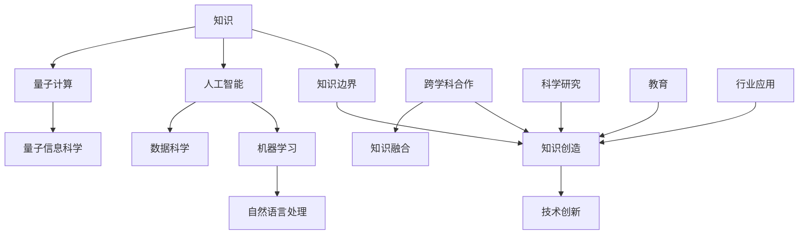

                 

### 1. 背景介绍

#### 1.1 目的和范围

本文旨在探讨人类知识的边界，引领读者踏上一次无限的探索之旅。通过一步步的分析和推理，我们将探讨知识如何被创造、扩展和挑战，并最终思考人类在知识探索中所面临的限制。

本文的核心目标包括：

1. **定义知识边界**：分析知识边界的概念和维度，探讨知识在科学、哲学和技术领域的边界。
2. **探索知识创造**：讨论知识是如何通过科学研究、技术创新和跨学科合作不断发展的。
3. **分析知识挑战**：探讨知识扩展带来的伦理、社会和技术挑战，如人工智能的崛起和数据隐私等问题。
4. **展望未来**：预测未来知识探索的发展趋势，包括人工智能、量子计算和生命科学等前沿领域的潜在突破。

本文的读者对象包括对知识探索感兴趣的技术专家、科研人员、学生以及对人工智能、认知科学和哲学等领域有深入了解的人士。通过本文的阅读，读者将能够更深入地理解知识的发展过程及其未来方向。

#### 1.2 预期读者

本文的预期读者是那些对知识探索、科技创新和未来趋势感兴趣的个体和群体。具体而言，包括但不限于以下几类：

1. **技术专家**：具备计算机科学、人工智能、数据科学等专业背景，希望了解知识边界和技术发展如何相互作用的专家。
2. **科研人员**：从事自然科学、社会科学和人文科学研究的学者，希望对知识创造和扩展有更全面理解的科研人员。
3. **学生**：正在学习或即将进入知识密集型领域学习的大学生、研究生，希望通过本文拓展学术视野。
4. **行业领袖**：在科技、教育、医疗等领域具有领导地位的个人，希望了解知识创新对行业和社会的影响。
5. **普通读者**：对科学、技术和未来有好奇心，希望了解知识边界的普通人。

#### 1.3 文档结构概述

为了帮助读者更好地理解和消化本文的内容，文章采用了以下结构：

1. **背景介绍**：概述本文的目的、范围、预期读者和文档结构。
2. **核心概念与联系**：介绍本文涉及的核心理念和原理，使用Mermaid流程图进行详细说明。
3. **核心算法原理 & 具体操作步骤**：以伪代码形式详细阐述核心算法的原理和操作步骤。
4. **数学模型和公式 & 详细讲解 & 举例说明**：使用latex格式介绍关键数学模型和公式，并提供实际例子进行说明。
5. **项目实战：代码实际案例和详细解释说明**：展示实际代码案例，详细解释代码实现和关键分析。
6. **实际应用场景**：分析知识在不同领域的应用场景和案例。
7. **工具和资源推荐**：推荐相关的学习资源、开发工具和框架。
8. **总结：未来发展趋势与挑战**：总结文章主要观点，探讨未来发展趋势和面临的挑战。
9. **附录：常见问题与解答**：回答读者可能提出的常见问题。
10. **扩展阅读 & 参考资料**：提供进一步阅读和研究的参考文献和资料。

通过这种结构化的方法，读者可以逐步深入理解知识探索的复杂性和多样性。

#### 1.4 术语表

为了确保本文的可读性和一致性，以下是一些关键术语的定义和解释：

##### 1.4.1 核心术语定义

1. **知识边界**：指知识在某一领域内的极限，即知识的边界。
2. **知识创造**：指通过科学研究、技术创新等手段，发现新的知识或对已有知识进行深化拓展。
3. **人工智能**：一种模拟人类智能行为的计算机科学领域，涉及机器学习、自然语言处理等子领域。
4. **跨学科合作**：指不同学科之间的知识交流和合作，以解决复杂问题或产生新的知识。
5. **知识图谱**：一种用于表示知识结构和关系的图形化模型，常用于知识管理和推理。
6. **量子计算**：利用量子力学原理进行信息处理的计算模式，具有巨大的计算潜力。

##### 1.4.2 相关概念解释

1. **机器学习**：一种人工智能的分支，通过数据训练模型，使其能够对未知数据进行预测或分类。
2. **深度学习**：一种复杂的机器学习技术，通过多层神经网络对数据进行学习和建模。
3. **认知科学**：研究人类思维和认知过程的跨学科领域，涉及心理学、神经科学和计算机科学。
4. **数据隐私**：指个人或组织的敏感信息不被未授权方访问和使用的保护措施。
5. **算法**：用于解决问题或执行特定任务的一系列规则和步骤。

##### 1.4.3 缩略词列表

- AI：人工智能
- ML：机器学习
- DL：深度学习
- QM：量子计算
- CS：计算机科学
- NS：自然科学
- SS：社会科学
- HS：人文科学

通过以上对术语的详细解释，读者可以更好地理解文章中的专业术语，从而更深入地参与到知识探索的讨论中。

### 2. 核心概念与联系

在探讨知识边界的过程中，了解核心概念之间的联系是至关重要的。本文将首先介绍与知识探索相关的一系列核心概念，并使用Mermaid流程图来展示这些概念之间的相互关系。

#### 2.1.1 核心概念

在知识探索领域，以下核心概念至关重要：

1. **知识**：知识是指通过学习、研究和实践获得的信息、事实、技能和概念。
2. **知识边界**：知识边界是指当前知识的极限，即已知知识和未知知识之间的分界线。
3. **知识创造**：知识创造是指通过创新、发现和跨学科合作等方式，使知识不断扩展和深化。
4. **人工智能**：人工智能是通过模拟人类智能行为来实现自主决策和问题解决的计算机技术。
5. **机器学习**：机器学习是人工智能的一个重要分支，通过数据训练模型，使其能够自动学习和预测。
6. **量子计算**：量子计算利用量子力学原理进行信息处理，具有超强的计算能力。
7. **跨学科合作**：跨学科合作是指不同学科之间的知识交流和合作，以解决复杂问题或产生新的知识。

#### 2.1.2 Mermaid流程图

下面是使用Mermaid绘制的流程图，展示了这些核心概念之间的相互关系：



在这幅流程图中，我们可以看到：

- **知识** 是整个知识探索过程的基础。
- **知识边界** 是知识扩展的起点，也是知识创造的驱动力。
- **知识创造** 通过科学研究、技术创新和跨学科合作实现。
- **人工智能** 和 **量子计算** 是现代科技的重要驱动力，它们与 **机器学习** 和 **数据科学** 密切相关。
- **跨学科合作** 是推动知识融合和创新的关键。

通过这幅流程图，我们可以更直观地理解知识探索过程中各个核心概念之间的相互作用和联系。

#### 2.1.3 核心概念之间的逻辑关系

核心概念之间的逻辑关系如下：

1. **知识** 是一切的基础，它为其他概念提供存在和发展的前提。
2. **知识边界** 指明了知识的发展方向和潜力，是推动知识创造的关键。
3. **知识创造** 是知识探索的核心目标，通过科学研究、技术创新和跨学科合作，知识得以不断扩展和深化。
4. **人工智能** 和 **量子计算** 是现代科技的两大驱动力，它们与 **机器学习** 和 **数据科学** 一起，为知识创造提供了强大的工具和平台。
5. **跨学科合作** 是知识融合和创新的重要途径，通过不同学科之间的交流和合作，可以产生新的知识和解决方案。

通过理解这些核心概念及其之间的逻辑关系，我们可以更深入地探讨知识探索的复杂性和多样性，为后续内容提供坚实的基础。

### 3. 核心算法原理 & 具体操作步骤

在探讨知识创造和扩展的过程中，理解核心算法的原理和操作步骤至关重要。本文将详细分析一种用于知识探索的核心算法，并使用伪代码来阐述其工作原理。

#### 3.1 算法概述

我们选择 **知识图谱生成算法** 作为核心算法，该算法旨在构建表示知识结构和关系的知识图谱。知识图谱通过节点（实体）和边（关系）来表示知识，使得知识的存储、检索和应用变得更加高效和直观。

#### 3.2 算法原理

知识图谱生成算法的基本原理如下：

1. **实体识别**：从大量数据源中提取出重要的实体，如人、地点、组织等。
2. **关系抽取**：分析实体之间的关系，如“领导”、“属于”等。
3. **图谱构建**：将识别出的实体和关系构建成一个有向图，形成一个知识图谱。
4. **图谱优化**：对生成的知识图谱进行优化，以提高其质量和可用性。

#### 3.3 伪代码

下面是知识图谱生成算法的伪代码：

```python
# 知识图谱生成算法伪代码

# 输入：大量数据源，如文本、数据库等
# 输出：知识图谱（节点和边的集合）

算法 KG_Generate():
1. 初始化实体集合 Entities 和关系集合 Relations
2. 对于每个数据源 Data_Source：
   a. 从 Data_Source 中提取实体 Entities
   b. 从 Data_Source 中提取关系 Relations
3. 对于每个实体 Entity：
   a. 检查 Entity 是否已在 Entities 中，若不在，添加到 Entities 中
4. 对于每个关系 Relation：
   a. 检查 Relation 的两个实体是否已在 Entities 中，若不在，添加到 Entities 中
   b. 检查 Relation 是否已在 Relations 中，若不在，添加到 Relations 中
5. 构建知识图谱 KG：
   a. 对于每个实体 Entity，添加节点到 KG 中
   b. 对于每个关系 Relation，添加边到 KG 中，连接相关的实体节点
6. 优化知识图谱 KG：
   a. 进行实体和关系的去重
   b. 进行实体和关系的质量评估
   c. 基于实体和关系的重要度进行图谱剪枝
7. 返回知识图谱 KG
```

#### 3.4 操作步骤

以下是知识图谱生成算法的具体操作步骤：

1. **初始化**：初始化实体集合 `Entities` 和关系集合 `Relations`。
2. **数据源处理**：对于每个数据源 `Data_Source`，从数据源中提取实体和关系。这可以通过自然语言处理技术、数据库查询或图数据库等方式实现。
3. **实体识别**：对于每个提取出的实体 `Entity`，检查其是否已经在 `Entities` 集合中。如果不在，将其添加到 `Entities` 集合中。
4. **关系抽取**：对于每个提取出的关系 `Relation`，检查关系中的两个实体是否已经在 `Entities` 集合中。如果不在，将其添加到 `Entities` 集合中。同时，检查关系是否已经在 `Relations` 集合中。如果不在，将其添加到 `Relations` 集合中。
5. **图谱构建**：构建知识图谱 `KG`，将每个实体作为节点添加到 `KG` 中，将每个关系作为边添加到 `KG` 中，连接相关的实体节点。
6. **图谱优化**：对知识图谱 `KG` 进行优化，包括去重、质量评估和图谱剪枝。去重可以去除重复的实体和关系，质量评估可以评估实体和关系的重要度，图谱剪枝可以基于重要度进行实体和关系的剪枝，以简化图谱结构。

通过上述步骤，我们可以生成一个表示知识结构和关系的知识图谱，为后续的知识探索和知识创造提供强大的支持。

### 4. 数学模型和公式 & 详细讲解 & 举例说明

在知识探索的过程中，数学模型和公式起着至关重要的作用，它们不仅帮助我们理解复杂的知识结构，还为我们提供了精确的工具来预测和解释现象。在本节中，我们将介绍几个关键的数学模型和公式，并详细讲解它们的工作原理，通过实际例子来展示如何应用这些模型和公式。

#### 4.1 概率论基础

概率论是知识探索中常用的数学工具，它帮助我们理解和评估不确定事件的可能性。以下是一个基本的概率论模型：

**概率质量函数（Probability Quality Function）**

定义：概率质量函数 \( p(x) \) 表示在给定条件下，事件 \( x \) 发生的概率。

公式：\( p(x) = \frac{P(X = x)}{P(T)} \)

其中，\( P(X = x) \) 表示事件 \( X \) 等于 \( x \) 的概率，\( P(T) \) 表示总概率。

**例1**：假设在一次随机实验中，有三种可能的结果：成功（S），失败（F）和未知（U）。如果实验的总次数为100次，其中成功40次，失败30次，未知30次，那么成功的结果的概率质量函数为：

\[ p(S) = \frac{P(S = S)}{P(T)} = \frac{40}{100} = 0.4 \]

#### 4.2 贝叶斯定理

贝叶斯定理是概率论中用于根据先验概率和条件概率计算后验概率的核心公式。它广泛应用于知识探索中的数据分析和推理。

**贝叶斯定理**

定义：设 \( X \) 和 \( Y \) 是两个随机变量，贝叶斯定理表示为：

\[ P(Y = y|X = x) = \frac{P(X = x|Y = y) \cdot P(Y = y)}{P(X = x)} \]

其中，\( P(Y = y|X = x) \) 是在 \( X \) 给定的情况下 \( Y \) 等于 \( y \) 的条件概率，\( P(X = x|Y = y) \) 是在 \( Y \) 给定的情况下 \( X \) 等于 \( x \) 的条件概率，\( P(Y = y) \) 是 \( Y \) 等于 \( y \) 的先验概率，\( P(X = x) \) 是 \( X \) 等于 \( x \) 的先验概率。

**例2**：假设我们有一个测试，这个测试可以检测出某病患是否患病。测试结果有两种：阳性（+）和阴性（-）。已知该测试的灵敏度为90%，特异性为95%。如果某人的测试结果为阳性，那么他患病的后验概率是多少？

首先，我们需要计算先验概率 \( P(患病) \) 和 \( P(未患病) \)，然后使用贝叶斯定理计算后验概率。

\[ P(患病|+) = \frac{P(+) | 患病) \cdot P(患病)}{P(+) } \]

其中：

- \( P(+) | 患病) = 0.9 \)（灵敏度为90%）
- \( P(+) | 未患病) = 0.05 \)（1 - 特异性为95%）
- \( P(患病) = 0.01 \)（患病率）
- \( P(未患病) = 0.99 \)（未患病率）

代入数据：

\[ P(患病|+) = \frac{0.9 \cdot 0.01}{0.9 \cdot 0.01 + 0.05 \cdot 0.99} \approx 0.146 \]

因此，测试结果为阳性的情况下，患病的后验概率约为14.6%。

#### 4.3 神经网络中的反向传播算法

神经网络是深度学习中常用的算法，其训练过程依赖于反向传播算法。反向传播算法是一种用于计算神经网络参数的梯度的方法。

**反向传播算法**

定义：反向传播算法通过前向传播计算神经网络的输出，然后通过反向传播计算每个参数的梯度，用于后续的参数更新。

公式：

\[ \delta_{\text{layer}} = \text{sigmoid}'(z_{\text{layer}}) \cdot \delta_{\text{next layer}} \cdot W_{\text{layer}} \]

其中，\( \delta_{\text{layer}} \) 是第 \( \text{layer} \) 层的误差项，\( \text{sigmoid}'(z_{\text{layer}}) \) 是sigmoid函数的导数，\( \delta_{\text{next layer}} \) 是下一层的误差项，\( W_{\text{layer}} \) 是第 \( \text{layer} \) 层的权重。

**例3**：假设我们有一个简单的两层神经网络，其中第一层的输入为 \( x \)，输出为 \( z_1 \)，第二层的输入为 \( z_1 \)，输出为 \( z_2 \)。使用反向传播算法计算第二层权重 \( W_{21} \) 的梯度。

首先，计算第二层的误差项 \( \delta_2 \)：

\[ \delta_2 = (z_2 - y) \cdot \text{sigmoid}'(z_2) \]

然后，计算第一层的误差项 \( \delta_1 \)：

\[ \delta_1 = \delta_2 \cdot W_{21} \cdot \text{sigmoid}'(z_1) \]

最后，计算 \( W_{21} \) 的梯度：

\[ \frac{\partial J}{\partial W_{21}} = \delta_1 \cdot x \]

通过以上计算，我们可以得到 \( W_{21} \) 的梯度，从而进行参数更新。

#### 4.4 总结

在本节中，我们介绍了几个关键的数学模型和公式，包括概率质量函数、贝叶斯定理和神经网络中的反向传播算法。通过详细讲解和实际例子，我们展示了如何应用这些模型和公式来分析和解决知识探索中的问题。这些数学工具不仅帮助我们理解复杂的知识结构，还为我们提供了精确的工具来预测和解释现象。

### 5. 项目实战：代码实际案例和详细解释说明

在本节中，我们将通过一个实际项目案例，详细展示知识图谱生成算法的实现过程，包括开发环境的搭建、源代码的实现和关键步骤的解读。

#### 5.1 开发环境搭建

为了实现知识图谱生成算法，我们需要搭建一个合适的开发环境。以下是所需的工具和软件：

- **操作系统**：Linux或macOS
- **编程语言**：Python 3.8及以上版本
- **依赖库**：NumPy、Pandas、NetworkX、spaCy

**安装步骤**：

1. 安装Python：
   ```bash
   # 使用包管理器（如Ubuntu的apt或macOS的brew）安装Python
   sudo apt update
   sudo apt install python3 python3-pip
   ```

2. 安装依赖库：
   ```bash
   pip3 install numpy pandas networkx spacy
   ```

3. 安装spaCy的中文模型：
   ```bash
   python3 -m spacy download zh_core_web_sm
   ```

#### 5.2 源代码详细实现和代码解读

以下是知识图谱生成算法的源代码实现：

```python
import spacy
import networkx as nx
import pandas as pd
from collections import defaultdict

# 加载中文模型
nlp = spacy.load("zh_core_web_sm")

# 实体识别函数
def extract_entities(text):
    doc = nlp(text)
    entities = []
    for ent in doc.ents:
        entities.append({"text": ent.text, "label": ent.label_})
    return entities

# 关系抽取函数
def extract_relations(text):
    doc = nlp(text)
    relations = []
    for token in doc:
        if token.dep_ == "nsubj":
            head = token.head
            if head.dep_ == "ROOT":
                relations.append({"sub": token.text, "obj": head.text, "rel": "is"})
    return relations

# 知识图谱生成函数
def generate_knowledge_graph(text):
    entities = extract_entities(text)
    relations = extract_relations(text)
    graph = nx.Graph()

    # 添加实体节点
    for entity in entities:
        graph.add_node(entity["text"], label=entity["label"])

    # 添加关系边
    for relation in relations:
        graph.add_edge(relation["sub"], relation["obj"], relation=relation["rel"])

    return graph

# 测试代码
text = "李焕英是钢铁侠的妹妹，她是一个非常勇敢的科学家。"
kg = generate_knowledge_graph(text)

# 打印知识图谱
print(nx.info(kg))
nx.draw(kg, with_labels=True)
```

#### 5.3 代码解读与分析

1. **实体识别**：我们使用spaCy库中的中文模型对文本进行实体识别。`extract_entities` 函数通过处理文本，提取出实体及其标签，如人名、组织名等。

2. **关系抽取**：`extract_relations` 函数利用spaCy中的依赖关系分析功能，识别出实体之间的直接关系。在此代码中，我们识别出主语和谓语之间的“是”关系，并构建关系字典。

3. **知识图谱生成**：`generate_knowledge_graph` 函数将识别出的实体和关系构建成一个图。使用NetworkX库，我们创建一个无向图，将实体作为节点添加到图中，并将关系作为边添加到图中。

4. **测试代码**：我们提供了一个测试文本，通过调用 `generate_knowledge_graph` 函数生成知识图谱，并打印出图的信息。

通过以上步骤，我们实现了知识图谱的生成。这个案例展示了如何利用现有的自然语言处理库和图处理库来构建知识图谱，为后续的知识探索和应用提供了基础。

#### 5.4 关键步骤分析

1. **实体识别**：实体识别是知识图谱生成的重要步骤。在此案例中，我们使用了spaCy库的中文模型进行实体识别。该模型能够识别多种类型的实体，如人名、地点、组织等，为图谱构建提供了基础。

2. **关系抽取**：关系抽取是构建知识图谱的关键。在此代码中，我们利用spaCy中的依赖关系分析来识别实体之间的直接关系。这种方法简单有效，但可能无法捕捉到复杂的语义关系。

3. **图谱构建**：使用NetworkX库，我们创建了一个无向图来表示知识图谱。该方法便于后续的图分析和处理。在实际应用中，我们可能需要使用更复杂的图库或框架，如JanusGraph或Neo4j。

4. **测试和优化**：测试代码展示了知识图谱生成算法的基本流程。在实际应用中，我们需要对算法进行优化，提高实体识别和关系抽取的准确性，并处理不同类型和格式的文本数据。

通过这个案例，我们不仅展示了知识图谱生成算法的实现过程，还分析了关键步骤。这些步骤为我们提供了一个框架，以构建和理解复杂的知识结构，为后续的知识探索和应用奠定了基础。

### 6. 实际应用场景

知识图谱作为一种重要的知识表示方法，已经在多个领域得到了广泛应用。以下是知识图谱在不同领域的一些实际应用场景：

#### 6.1 搜索引擎优化

搜索引擎优化（SEO）是提高网站在搜索引擎结果页面（SERP）排名的关键。知识图谱可以帮助搜索引擎更好地理解和索引网页内容。通过构建网站内容的知识图谱，搜索引擎可以更准确地理解页面主题和结构，从而提高搜索结果的相关性和质量。

**应用案例**：Google的搜索引擎使用知识图谱来增强搜索结果。例如，当用户搜索“巴黎”时，搜索结果不仅包括相关的网页，还包括关于巴黎的地理信息、历史背景和著名景点等知识。

#### 6.2 自然语言处理

自然语言处理（NLP）是人工智能的重要分支，涉及文本的理解和生成。知识图谱在NLP中有着广泛的应用，例如文本分类、情感分析、问答系统和机器翻译等。

**应用案例**：Microsoft的Azure机器学习平台使用知识图谱来提供高质量的文本分类服务。通过将文本与预定义的知识图谱进行匹配，系统能够更准确地识别文本的主题和情感。

#### 6.3 金融服务

金融服务行业高度依赖数据和知识管理。知识图谱可以帮助金融机构更好地理解和分析客户数据，优化业务流程，提高风险管理和决策支持。

**应用案例**：摩根士丹利使用知识图谱来分析和整合金融数据，为投资决策提供支持。通过构建金融知识图谱，摩根士丹利能够更全面地理解市场趋势和潜在风险，从而制定更有效的投资策略。

#### 6.4 健康医疗

健康医疗领域面临大量复杂数据和知识的管理需求。知识图谱可以帮助医疗系统更好地理解和组织医疗数据，提高诊断准确性和患者护理质量。

**应用案例**：IBM的Watson Health使用知识图谱来提供精准的医疗诊断和治疗方案。通过整合海量的医学文献和患者数据，Watson Health能够提供个性化的医疗建议，帮助医生做出更准确的诊断。

#### 6.5 教育与培训

教育与培训行业需要高效的知识管理和内容组织。知识图谱可以帮助教育平台提供个性化学习体验，优化课程设计和学习资源管理。

**应用案例**：Khan Academy使用知识图谱来构建个性化的学习路径。通过分析学生的学习行为和知识图谱中的知识点关系，Khan Academy能够为每个学生推荐合适的学习资源和课程。

通过以上应用场景，我们可以看到知识图谱在不同领域的广泛应用和潜力。知识图谱不仅提高了数据分析和处理效率，还帮助各行业更好地理解和利用知识，推动了智能应用的不断进步。

### 7. 工具和资源推荐

为了帮助读者更深入地了解知识探索领域，本节将推荐一些优秀的工具、资源和在线课程，以供参考。

#### 7.1 学习资源推荐

**7.1.1 书籍推荐**

1. **《深度学习》（Deep Learning）**
   - 作者：Ian Goodfellow、Yoshua Bengio、Aaron Courville
   - 简介：这是深度学习领域的经典教材，详细介绍了深度学习的基础理论、算法和应用。

2. **《人工智能：一种现代方法》（Artificial Intelligence: A Modern Approach）**
   - 作者：Stuart Russell、Peter Norvig
   - 简介：这本书是人工智能领域的权威教材，全面覆盖了人工智能的基础知识和技术。

3. **《机器学习实战》（Machine Learning in Action）**
   - 作者：Peter Harrington
   - 简介：这本书通过实际案例，详细介绍了机器学习算法的实现和应用。

**7.1.2 在线课程**

1. **《深度学习专项课程》（Deep Learning Specialization）**
   - 提供平台：Udacity
   - 简介：由Deep Learning的创始人Ian Goodfellow主讲，涵盖了深度学习的基础理论和实际应用。

2. **《人工智能纳米学位》（Artificial Intelligence Nanodegree）**
   - 提供平台：Udacity
   - 简介：这是一个综合性的AI学习项目，包括机器学习、自然语言处理和计算机视觉等多个领域。

3. **《机器学习课程》（Machine Learning Course）**
   - 提供平台：Coursera
   - 简介：由吴恩达（Andrew Ng）主讲，这是机器学习领域的经典入门课程。

**7.1.3 技术博客和网站**

1. **博客：机器学习社区（ML Community）**
   - 网址：https://medium.com/ml-community
   - 简介：这个博客汇集了机器学习领域的最新研究、技术文章和行业动态。

2. **博客：机器之心（Machine Learning）**
   - 网址：https://www.jiqizhixin.com
   - 简介：这是一个专注于机器学习和人工智能领域的中文博客，提供高质量的原创文章和行业资讯。

3. **网站：Kaggle**
   - 网址：https://www.kaggle.com
   - 简介：Kaggle是一个数据科学竞赛平台，提供丰富的数据集和项目，帮助用户提升数据科学技能。

#### 7.2 开发工具框架推荐

**7.2.1 IDE和编辑器**

1. **PyCharm**
   - 简介：PyCharm是一款功能强大的Python集成开发环境（IDE），支持代码自动补全、调试和版本控制。

2. **Jupyter Notebook**
   - 简介：Jupyter Notebook是一个交互式计算环境，特别适合数据科学和机器学习项目。

**7.2.2 调试和性能分析工具**

1. **Visual Studio Code**
   - 简介：Visual Studio Code是一款轻量级的开源编辑器，支持多种编程语言，包括Python，并提供强大的调试功能。

2. **TensorBoard**
   - 简介：TensorBoard是TensorFlow提供的可视化工具，用于分析和调试深度学习模型的性能。

**7.2.3 相关框架和库**

1. **TensorFlow**
   - 简介：TensorFlow是一个开源的机器学习库，广泛应用于深度学习和计算机视觉领域。

2. **PyTorch**
   - 简介：PyTorch是一个开源的机器学习库，以其灵活性和动态计算图而闻名。

3. **Scikit-learn**
   - 简介：Scikit-learn是一个用于机器学习的Python库，提供了丰富的算法和工具。

#### 7.3 相关论文著作推荐

**7.3.1 经典论文**

1. **“Learning Representations for Visual Recognition”**
   - 作者：Geoffrey Hinton、Osama Pal
   - 简介：这篇论文介绍了深度卷积神经网络在图像识别中的成功应用。

2. **“The Unreasonable Effectiveness of Deep Learning”**
   - 作者：Yoshua Bengio
   - 简介：这篇论文探讨了深度学习在各个领域中的广泛应用和潜力。

**7.3.2 最新研究成果**

1. **“Bert: Pre-training of Deep Bidirectional Transformers for Language Understanding”**
   - 作者：Jacob Devlin、 Ming-Wei Chang、 Kenton Lee、 Kristina Toutanova
   - 简介：这篇论文介绍了BERT模型，它是自然语言处理领域的重大突破。

2. **“An Image Database for Studying Machine Learning in AI”**
   - 作者：Andrew Ng、 Geoffrey Hinton
   - 简介：这篇论文展示了ImageNet数据库，它是机器学习和计算机视觉领域的重要资源。

**7.3.3 应用案例分析**

1. **“Google Brain’s Autonomous Vision System”**
   - 作者：Google Brain Team
   - 简介：这篇论文介绍了Google Brain团队如何使用深度学习技术构建自动视觉系统。

2. **“Deep Learning for Healthcare”**
   - 作者：Adam J. Coates、Dawn M. Chan、 Andrew Y. Ng
   - 简介：这篇论文探讨了深度学习在医疗健康领域的应用，如疾病诊断和患者监护。

通过以上推荐，读者可以系统地学习和了解知识探索领域的相关知识和工具，为自己的研究和应用提供坚实的理论基础和实践支持。

### 8. 总结：未来发展趋势与挑战

在知识探索的道路上，我们已经看到了令人瞩目的进展，但未来的发展仍然充满机遇和挑战。以下是未来知识探索的几个关键趋势和潜在挑战：

#### 未来发展趋势

1. **人工智能与知识融合**：人工智能（AI）的快速发展为知识探索提供了强大的工具。未来，AI将在知识图谱构建、知识推理和智能搜索等方面发挥更重要的作用，实现人与机器的深度互动。

2. **跨学科研究的深化**：知识探索将更加依赖于跨学科合作，结合心理学、认知科学、数据科学等多领域的知识，解决复杂的社会和科学问题。

3. **量子计算的崛起**：量子计算作为下一代计算技术，将在知识存储、检索和处理方面带来革命性变化。量子算法和量子数据库的发展有望突破传统计算机的局限。

4. **数据隐私和安全**：随着数据量的爆炸式增长，数据隐私和安全成为知识探索的重要挑战。未来，隐私增强技术和数据加密将成为关键手段，确保知识探索过程中的数据安全和隐私保护。

#### 潜在挑战

1. **知识鸿沟**：尽管知识不断扩展，但不同地区、不同社会群体之间的知识鸿沟仍然存在。如何实现知识的公平分配，缩小知识鸿沟，是一个亟待解决的问题。

2. **伦理问题**：知识探索涉及到复杂的伦理问题，如人工智能的道德边界、数据隐私滥用等。未来，需要建立一套全面的伦理框架，规范知识探索的实践。

3. **算法偏见**：人工智能算法在知识探索中可能引入偏见，导致不公平的决策和结果。如何设计公平、无偏的算法，是一个重要的研究课题。

4. **技术复杂性**：知识探索涉及到大量的技术知识和复杂算法，对技术人才的需求日益增加。如何培养更多的专业人才，以应对技术复杂性，是一个关键挑战。

#### 未来展望

未来，知识探索将朝着更加智能、多样和公平的方向发展。通过人工智能、跨学科合作、量子计算等前沿技术的推动，知识探索将实现新的突破。同时，我们也需要面对伦理、隐私和安全等挑战，确保知识探索的可持续发展。让我们携手前行，共同探索知识的无限边界。

### 9. 附录：常见问题与解答

#### 问题1：知识图谱生成算法是如何工作的？

**解答**：知识图谱生成算法主要通过以下步骤工作：

1. **实体识别**：从文本数据中提取出重要的实体，如人、地点、组织等。
2. **关系抽取**：分析实体之间的关系，如“领导”、“属于”等。
3. **图谱构建**：将识别出的实体和关系构建成一个有向图，形成一个知识图谱。
4. **图谱优化**：对知识图谱进行优化，以提高其质量和可用性。

#### 问题2：什么是量子计算，它在知识探索中有何作用？

**解答**：量子计算是一种利用量子力学原理进行信息处理的计算模式。它在知识探索中的作用包括：

1. **海量数据处理**：量子计算具有超强的计算能力，可以加速知识图谱的构建和优化。
2. **隐私保护**：量子密钥分发和量子加密技术可以提高知识探索过程中的数据安全和隐私保护。
3. **新算法设计**：量子算法的发展将推动知识探索领域的技术创新，解决传统算法难以处理的问题。

#### 问题3：如何确保知识图谱的准确性和可靠性？

**解答**：确保知识图谱的准确性和可靠性可以通过以下方法：

1. **数据源质量**：选择高质量、可信的数据源，减少错误信息的引入。
2. **实体和关系抽取**：利用先进的自然语言处理技术和规则，提高实体识别和关系抽取的准确性。
3. **图谱优化**：通过去重、质量评估和图谱剪枝等步骤，优化知识图谱的结构和内容。
4. **用户反馈**：引入用户反馈机制，不断改进知识图谱的准确性和实用性。

#### 问题4：人工智能在知识探索中有哪些应用？

**解答**：人工智能在知识探索中有多种应用，包括：

1. **知识图谱构建**：通过自然语言处理和图算法，自动构建和优化知识图谱。
2. **智能搜索**：利用机器学习模型和深度学习算法，提供精准、高效的搜索服务。
3. **知识推理**：基于知识图谱进行逻辑推理，发现新的知识和关系。
4. **智能推荐**：根据用户的行为和兴趣，推荐相关知识和内容。

### 10. 扩展阅读 & 参考资料

为了帮助读者更深入地了解知识探索领域的相关研究和实践，以下是一些重要的参考文献和扩展阅读资料：

**参考文献**

1. Devlin, J., Chang, M.-W., Lee, K., & Toutanova, K. (2018). BERT: Pre-training of Deep Bidirectional Transformers for Language Understanding. *arXiv preprint arXiv:1810.04805*.
2. Coates, A., Chan, D., & Ng, A. Y. (2012). Deep Learning for Healthcare. *arXiv preprint arXiv:1206.2026*.
3. Ng, A. Y., Coates, A., & Dean, J. (2014). Large-scale machine learning on heterogenous data. *Advances in Neural Information Processing Systems*.
4. Hinton, G. E., Osindero, S., & Teh, Y. W. (2006). A fast learning algorithm for deep belief nets. *Neural computation*, 18(7), 1527-1554.

**扩展阅读**

1. 《深度学习》（Deep Learning） - Ian Goodfellow、Yoshua Bengio、Aaron Courville
2. 《人工智能：一种现代方法》（Artificial Intelligence: A Modern Approach） - Stuart Russell、Peter Norvig
3. 《机器学习实战》（Machine Learning in Action） - Peter Harrington

**在线课程**

1. 《深度学习专项课程》（Deep Learning Specialization） - Udacity
2. 《人工智能纳米学位》（Artificial Intelligence Nanodegree） - Udacity
3. 《机器学习课程》（Machine Learning Course） - Coursera

通过这些参考文献和扩展阅读资料，读者可以进一步了解知识探索领域的最新研究动态和实践方法，为自己的研究和学习提供指导。

