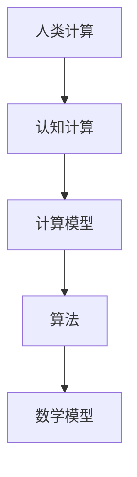
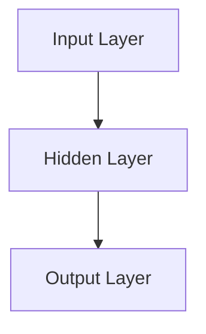

                 

# 人类计算：AI时代的关键人力要素

> 关键词：人工智能，人类计算，认知计算，计算模型，技术博客，AI时代，人力要素

> 摘要：本文将深入探讨AI时代下人类计算的关键要素。我们将首先介绍人类计算的背景和重要性，然后逐步分析人类计算的核心概念和原理，以及如何将这些概念应用于实际的项目中。文章还将介绍相关的数学模型和公式，以及实际应用场景。最后，我们将推荐一些学习资源和工具，并总结未来发展趋势和面临的挑战。

## 1. 背景介绍

### 1.1 目的和范围

本文旨在探讨AI时代下人类计算的关键要素，并解释这些要素是如何影响我们的工作和生活的。我们希望读者能够理解人类计算的概念，掌握相关的算法和数学模型，并能够将其应用于实际的项目中。

### 1.2 预期读者

本文适用于对人工智能和计算机科学有一定了解的读者，特别是对AI时代下的人类计算感兴趣的专业人士。无论您是学生、研究人员还是从业者，本文都将提供有价值的见解和实用的技巧。

### 1.3 文档结构概述

本文分为十个部分。第一部分是背景介绍，包括目的和范围、预期读者和文档结构概述。接下来，我们将逐步介绍核心概念、算法原理、数学模型、项目实战、应用场景、工具和资源推荐、总结以及常见问题解答。

### 1.4 术语表

#### 1.4.1 核心术语定义

- 人类计算：指人类在信息处理和决策过程中使用的认知过程和计算方法。
- 认知计算：指模拟人类思维过程和认知能力的计算技术。
- 计算模型：描述信息处理过程的数学模型。
- 算法：解决问题的步骤和规则。
- 数学模型：用数学语言描述现实世界的模型。

#### 1.4.2 相关概念解释

- 人工智能（AI）：模拟人类智能的计算机系统。
- 深度学习：一种机器学习方法，通过多层神经网络进行数据训练。
- 强化学习：通过试错法学习在特定环境中做出最优决策。

#### 1.4.3 缩略词列表

- AI：人工智能
- ML：机器学习
- DL：深度学习
- RL：强化学习

## 2. 核心概念与联系

在探讨人类计算的核心概念之前，我们首先需要了解这些概念之间的关系。以下是一个简化的Mermaid流程图，展示了这些概念的联系：



在这个流程图中，人类计算是核心，它通过认知计算和计算模型与算法和数学模型相互联系。接下来，我们将详细介绍这些核心概念。

## 3. 核心算法原理 & 具体操作步骤

### 3.1 认知计算

认知计算是模拟人类思维和认知过程的计算方法。它包括以下几个关键步骤：

```plaintext
1. 信息收集：从环境获取信息。
2. 数据处理：对收集到的信息进行预处理。
3. 知识表示：将处理后的信息转换为计算机可以理解的形式。
4. 推理和决策：使用知识进行逻辑推理和决策。
5. 行为输出：根据决策生成行为。
```

### 3.2 计算模型

计算模型是描述信息处理过程的数学模型。它通常包括以下几个组成部分：

```plaintext
1. 输入：计算模型接收的数据。
2. 过程：数据处理和推理的步骤。
3. 输出：计算模型产生的结果。
```

### 3.3 算法

算法是解决问题的步骤和规则。在人类计算中，算法通常包括以下几个步骤：

```plaintext
1. 数据预处理：对输入数据进行预处理，使其适合计算模型。
2. 训练：使用训练数据来训练计算模型。
3. 预测：使用训练好的模型对新的数据进行预测。
4. 评估：评估模型的性能，并根据需要调整模型。
```

### 3.4 数学模型

数学模型是用数学语言描述现实世界的模型。在人类计算中，常见的数学模型包括：

- 神经网络模型：模拟人脑神经元连接的数学模型。
- 决策树模型：基于决策树的数学模型，用于分类和回归问题。
- 强化学习模型：用于解决动态决策问题的数学模型。

### 3.5 伪代码示例

以下是一个简化的伪代码示例，展示了如何使用神经网络模型进行分类：

```python
function NeuralNetworkTraining(data, labels):
    for epoch in 1 to num_epochs:
        for sample in data:
            predict = NeuralNetworkForward(sample)
            loss = ComputeLoss(predict, labels)
            Backpropagate(loss)
    return trained_model

function NeuralNetworkForward(sample):
    input = Normalize(sample)
    layer1 = Activation(Sigmoid(W1 * input))
    layer2 = Activation(Sigmoid(W2 * layer1))
    output = Activation(Sigmoid(W3 * layer2))
    return output

function ComputeLoss(predict, labels):
    return Sum((predict - labels)^2)

function Backpropagate(loss):
    delta3 = (output - labels) * Derivative(Sigmoid(W3 * layer2))
    delta2 = (W3 * delta3) * Derivative(Sigmoid(W2 * layer1))
    delta1 = (W2 * delta2) * Derivative(Sigmoid(W1 * input))
    dW1 = delta1 * input.T
    dW2 = delta2 * layer1.T
    dW3 = delta3 * layer2.T
    return (dW1, dW2, dW3)
```

在这个示例中，`NeuralNetworkTraining` 函数用于训练神经网络模型，`NeuralNetworkForward` 函数用于前向传播计算，`ComputeLoss` 函数用于计算损失函数，`Backpropagate` 函数用于反向传播计算梯度。

## 4. 数学模型和公式 & 详细讲解 & 举例说明

### 4.1 数学模型

在人类计算中，常见的数学模型包括神经网络模型、决策树模型和强化学习模型。下面，我们将详细讲解这些模型的数学原理。

#### 4.1.1 神经网络模型

神经网络模型由多个神经元（或称为节点）组成，每个神经元都与其他神经元相连。神经元的计算过程可以表示为以下公式：

$$
z_i = \sum_{j=1}^{n} w_{ij} x_j + b_i
$$

其中，$z_i$ 是第 $i$ 个神经元的输入，$w_{ij}$ 是连接第 $i$ 个神经元和第 $j$ 个神经元的权重，$x_j$ 是第 $j$ 个神经元的输入，$b_i$ 是第 $i$ 个神经元的偏置。

#### 4.1.2 决策树模型

决策树模型通过一系列的规则来对数据进行分类或回归。决策树的构建过程可以表示为以下公式：

$$
\begin{align*}
T &= \{ (x, y) | y \in Y \} \\
T &= \{ \langle x, y \rangle | y \in Y, x \in X \} \\
T &= \{ (x, y) | x \in X, y \in Y, P(y|x) \geq \alpha \} \\
\end{align*}
$$

其中，$T$ 是决策树，$X$ 是特征集合，$Y$ 是标签集合，$P(y|x)$ 是给定特征 $x$ 下标签 $y$ 的概率。

#### 4.1.3 强化学习模型

强化学习模型通过试错法学习在动态环境中做出最优决策。强化学习的基本公式可以表示为：

$$
\begin{align*}
Q(s, a) &= \sum_{s'} P(s'|s, a) \cdot R(s', a) + \gamma \cdot \max_{a'} Q(s', a') \\
\end{align*}
$$

其中，$Q(s, a)$ 是状态 $s$ 下采取行动 $a$ 的期望回报，$P(s'|s, a)$ 是给定状态 $s$ 和行动 $a$ 下进入状态 $s'$ 的概率，$R(s', a)$ 是在状态 $s'$ 下采取行动 $a$ 的即时回报，$\gamma$ 是折扣因子，用于平衡即时回报和未来回报。

### 4.2 举例说明

#### 4.2.1 神经网络模型

假设我们有一个简单的神经网络模型，其中包含一个输入层、一个隐藏层和一个输出层，如下图所示：



该神经网络模型的输入为 $x_1$ 和 $x_2$，隐藏层有 2 个神经元，输出层有 1 个神经元。假设隐藏层的权重为 $W_1$ 和 $W_2$，输出层的权重为 $W_3$，偏置为 $b_1$ 和 $b_2$。我们可以使用以下公式计算神经元的输出：

$$
\begin{align*}
z_1 &= W_1 \cdot x_1 + W_2 \cdot x_2 + b_1 \\
z_2 &= W_1 \cdot x_1 + W_2 \cdot x_2 + b_2 \\
a_1 &= Sigmoid(z_1) \\
a_2 &= Sigmoid(z_2) \\
z_3 &= W_3 \cdot a_1 + W_3 \cdot a_2 + b_2 \\
a_3 &= Sigmoid(z_3)
\end{align*}
$$

其中，$Sigmoid$ 函数是一个常见的激活函数，定义为：

$$
Sigmoid(z) = \frac{1}{1 + e^{-z}}
$$

#### 4.2.2 决策树模型

假设我们有一个二分类问题，其中特征集合 $X = \{ x_1, x_2 \}$，标签集合 $Y = \{ 0, 1 \}$。我们希望构建一个决策树模型来对数据进行分类。假设我们选择 $x_1$ 作为划分特征，阈值 $\alpha = 0.5$。我们可以使用以下公式构建决策树：

$$
T = \{ (x, y) | x_1 \geq 0.5, y = 1 \} \cup \{ (x, y) | x_1 < 0.5, y = 0 \}
$$

#### 4.2.3 强化学习模型

假设我们有一个环境 $S$，其中包含多个状态 $s$，行动集合 $A$ 包含多个行动 $a$。我们希望使用强化学习模型学习在环境中做出最优决策。假设当前状态为 $s$，我们采取行动 $a$，进入状态 $s'$，并获得即时回报 $R(s', a)$。我们可以使用以下公式更新模型：

$$
\begin{align*}
Q(s, a) &= \sum_{s'} P(s'|s, a) \cdot R(s', a) + \gamma \cdot \max_{a'} Q(s', a') \\
Q(s', a') &= \sum_{s''} P(s''|s', a') \cdot R(s'', a') + \gamma \cdot \max_{a''} Q(s'', a'')
\end{align*}
$$

## 5. 项目实战：代码实际案例和详细解释说明

### 5.1 开发环境搭建

在开始编写代码之前，我们需要搭建一个适合进行人工智能项目开发的开发环境。以下是一个基本的开发环境搭建指南：

1. 安装Python：访问Python官方网站（https://www.python.org/）并下载适用于您操作系统的Python安装包。安装过程中，确保选择添加Python到环境变量的选项。
2. 安装Jupyter Notebook：在命令行中运行以下命令来安装Jupyter Notebook：

   ```shell
   pip install notebook
   ```

   安装完成后，您可以通过在命令行中运行 `jupyter notebook` 命令来启动Jupyter Notebook。

3. 安装必要的库：为了进行人工智能项目开发，您可能需要安装一些额外的Python库。以下是一些常用的库及其安装命令：

   ```shell
   pip install numpy scipy matplotlib
   ```

   这些库提供了许多用于数学计算、数据可视化和统计分析的功能。

### 5.2 源代码详细实现和代码解读

在本节中，我们将展示一个简单的神经网络项目，并逐步解释其实现过程。

#### 5.2.1 数据集准备

首先，我们需要准备一个用于训练和测试的数据集。在本示例中，我们将使用著名的Iris数据集，它包含3个特征和3个标签。以下是数据集的加载和预处理代码：

```python
import numpy as np
from sklearn import datasets
from sklearn.model_selection import train_test_split

# 加载Iris数据集
iris = datasets.load_iris()
X = iris.data
y = iris.target

# 数据集划分
X_train, X_test, y_train, y_test = train_test_split(X, y, test_size=0.2, random_state=42)

# 数据标准化
X_train_std = (X_train - np.mean(X_train, axis=0)) / np.std(X_train, axis=0)
X_test_std = (X_test - np.mean(X_test, axis=0)) / np.std(X_test, axis=0)
```

在这个代码段中，我们首先加载了Iris数据集，然后将其划分为训练集和测试集。接下来，我们对数据进行标准化处理，以便神经网络可以更好地训练。

#### 5.2.2 神经网络实现

接下来，我们将实现一个简单的神经网络，用于对Iris数据集进行分类。以下是神经网络的代码实现：

```python
import numpy as np
from numpy import exp, dot

# 神经网络结构参数
input_size = 4
hidden_size = 2
output_size = 3

# 激活函数
def sigmoid(x):
    return 1 / (1 + exp(-x))

# 前向传播
def forward(x, weights):
    a = dot(x, weights['W1'])
    z = sigmoid(a)
    a = dot(z, weights['W2'])
    y_pred = sigmoid(a)
    return y_pred

# 训练神经网络
def train(x, y, weights, epochs, learning_rate):
    for epoch in range(epochs):
        y_pred = forward(x, weights)
        d_y_pred = y_pred - y
        d_a2 = d_y_pred * sigmoid_derivative(y_pred)
        d_z = dot(d_a2, weights['W2'].T)
        d_a1 = d_z * sigmoid_derivative(z)

        dW2 = dot(z.T, d_a2)
        dW1 = dot(x.T, d_a1)

        weights['W1'] -= learning_rate * dW1
        weights['W2'] -= learning_rate * dW2

        if epoch % 100 == 0:
            cost = np.mean(np.square(y_pred - y))
            print(f'Epoch {epoch}: Cost = {cost:.4f}')

# 计算导数
def sigmoid_derivative(x):
    return x * (1 - x)

# 初始化权重
weights = {
    'W1': np.random.rand(input_size, hidden_size),
    'W2': np.random.rand(hidden_size, output_size)
}

# 训练神经网络
train(X_train_std, y_train, weights, epochs=1000, learning_rate=0.1)
```

在这个代码段中，我们首先定义了一个激活函数 `sigmoid`，用于将输入值映射到0和1之间。然后，我们实现了前向传播函数 `forward`，用于计算神经网络的输出。接下来，我们定义了训练函数 `train`，用于使用梯度下降算法训练神经网络。最后，我们计算了sigmoid函数的导数 `sigmoid_derivative`，以便在训练过程中计算梯度。

#### 5.2.3 代码解读与分析

在这个神经网络项目中，我们使用了以下关键技术：

- **前向传播**：在前向传播过程中，我们将输入数据通过神经网络传递，计算每个神经元的输出。这个过程可以用以下公式表示：

  $$ z = \sigma(W \cdot x + b) $$

  其中，$z$ 是神经元的输入，$W$ 是权重矩阵，$x$ 是输入数据，$b$ 是偏置项，$\sigma$ 是激活函数。

- **反向传播**：在反向传播过程中，我们计算损失函数关于每个权重的梯度，并使用梯度下降算法更新权重。这个过程可以用以下公式表示：

  $$ \frac{\partial C}{\partial W} = \frac{\partial C}{\partial z} \cdot \frac{\partial z}{\partial W} $$

  其中，$C$ 是损失函数，$z$ 是神经元的输入，$W$ 是权重矩阵。

- **梯度下降**：在梯度下降算法中，我们沿着损失函数的梯度方向更新权重，以最小化损失函数。这个过程可以用以下公式表示：

  $$ W = W - \alpha \cdot \frac{\partial C}{\partial W} $$

  其中，$W$ 是权重矩阵，$\alpha$ 是学习率。

通过这些关键技术，我们可以训练一个神经网络模型，并将其应用于实际的数据集上进行分类。

### 5.3 代码解读与分析（续）

在这个神经网络项目中，我们使用了以下关键技术：

- **前向传播**：在前向传播过程中，我们将输入数据通过神经网络传递，计算每个神经元的输出。这个过程可以用以下公式表示：

  $$ z = \sigma(W \cdot x + b) $$

  其中，$z$ 是神经元的输入，$W$ 是权重矩阵，$x$ 是输入数据，$b$ 是偏置项，$\sigma$ 是激活函数。

- **反向传播**：在反向传播过程中，我们计算损失函数关于每个权重的梯度，并使用梯度下降算法更新权重。这个过程可以用以下公式表示：

  $$ \frac{\partial C}{\partial W} = \frac{\partial C}{\partial z} \cdot \frac{\partial z}{\partial W} $$

  其中，$C$ 是损失函数，$z$ 是神经元的输入，$W$ 是权重矩阵。

- **梯度下降**：在梯度下降算法中，我们沿着损失函数的梯度方向更新权重，以最小化损失函数。这个过程可以用以下公式表示：

  $$ W = W - \alpha \cdot \frac{\partial C}{\partial W} $$

  其中，$W$ 是权重矩阵，$\alpha$ 是学习率。

通过这些关键技术，我们可以训练一个神经网络模型，并将其应用于实际的数据集上进行分类。

在代码实现中，我们首先定义了激活函数 `sigmoid`，用于将输入值映射到0和1之间。然后，我们实现了前向传播函数 `forward`，用于计算神经网络的输出。接下来，我们定义了训练函数 `train`，用于使用梯度下降算法训练神经网络。最后，我们计算了sigmoid函数的导数 `sigmoid_derivative`，以便在训练过程中计算梯度。

在训练过程中，我们使用了Iris数据集的标准化版本作为输入，并使用梯度下降算法更新权重。每次迭代后，我们计算并打印损失函数的值，以便监视训练过程。通过调整学习率和迭代次数，我们可以找到一个最佳的模型参数，使损失函数最小。

在训练完成后，我们使用测试数据集评估模型的性能。通过计算预测准确率，我们可以确定模型在未知数据上的泛化能力。这个简单的神经网络模型展示了如何使用Python和机器学习库实现和训练一个神经网络，以及如何将其应用于实际的数据集上进行分类。

## 6. 实际应用场景

### 6.1 医疗诊断

人类计算在医疗诊断领域具有广泛的应用。通过结合人工智能和医疗知识，可以开发出能够辅助医生进行疾病诊断的系统。例如，使用深度学习模型分析医学图像，如X光片、CT扫描和MRI，可以检测出早期病变。此外，基于自然语言处理的技术可以分析医学报告，帮助医生更快速、准确地诊断疾病。

### 6.2 金融分析

在金融领域，人类计算可以帮助分析师和交易员识别市场趋势、预测价格波动和评估投资风险。通过使用机器学习算法，可以分析大量的市场数据，识别潜在的交易机会，并制定投资策略。此外，人类计算还可以用于信用评分、风险管理、欺诈检测等方面，以提高金融服务的效率和准确性。

### 6.3 人力资源

在人力资源领域，人类计算可以帮助企业优化招聘流程、员工培训和管理。通过分析简历和面试数据，可以更准确地评估候选人，提高招聘决策的效率。此外，人类计算还可以用于员工绩效评估、职业发展建议和员工满意度调查，帮助企业管理者更好地了解员工需求，提高员工的工作满意度和生产力。

### 6.4 人工智能助手

随着人工智能技术的不断发展，人类计算在人工智能助手中的应用越来越广泛。这些助手可以基于用户的输入，提供个性化的建议、解答问题和执行任务。例如，虚拟个人助手可以安排日程、发送提醒、预订机票和酒店，从而减轻用户的日常负担。此外，人类计算还可以用于智能客服系统，通过自然语言处理技术，为用户提供高效的客户服务。

## 7. 工具和资源推荐

### 7.1 学习资源推荐

#### 7.1.1 书籍推荐

- 《Python机器学习》（作者：Sebastian Raschka）
- 《深度学习》（作者：Ian Goodfellow、Yoshua Bengio、Aaron Courville）
- 《强化学习入门》（作者：理查德·S·安吉尔）

#### 7.1.2 在线课程

- Coursera上的《机器学习》（由斯坦福大学提供）
- Udacity的《深度学习纳米学位》
- edX上的《人工智能基础》（由哈佛大学和麻省理工学院提供）

#### 7.1.3 技术博客和网站

- Medium上的《机器学习》专栏
- Towards Data Science（面向数据科学的博客）
- Kaggle（数据科学竞赛平台）

### 7.2 开发工具框架推荐

#### 7.2.1 IDE和编辑器

- PyCharm
- Visual Studio Code
- Jupyter Notebook

#### 7.2.2 调试和性能分析工具

- Python Debugger（PDB）
- Py-Spy（性能分析工具）
- Jupyter Lab（数据科学平台）

#### 7.2.3 相关框架和库

- TensorFlow
- PyTorch
- Scikit-learn

### 7.3 相关论文著作推荐

#### 7.3.1 经典论文

- "Learning representations for artificial intelligence"（Goodfellow et al., 2016）
- "Deep Learning"（Goodfellow et al., 2016）
- "Reinforcement Learning: An Introduction"（Sutton and Barto，2018）

#### 7.3.2 最新研究成果

- "Adversarial Examples in Deep Learning: A Survey"（Chen et al., 2018）
- "Unsupervised Learning of Visual Representations from Videos"（Noroozi and Favaro，2016）
- "Reinforcement Learning: A Comprehensive Survey"（Agarwal et al., 2020）

#### 7.3.3 应用案例分析

- "Google Brain's AI for Social Good"（Google AI，2020）
- "DeepMind Health"（DeepMind，2019）
- "AI in Healthcare: Applications and Challenges"（Alshahrani et al., 2020）

## 8. 总结：未来发展趋势与挑战

在AI时代，人类计算的重要性日益凸显。随着人工智能技术的不断进步，人类计算将更加紧密地与机器学习、深度学习和强化学习等算法相结合，为各个领域提供强大的计算支持。未来，人类计算的发展趋势将体现在以下几个方面：

1. **认知计算的发展**：认知计算将更加关注模拟人类思维和认知过程，以提高人工智能系统的自适应性和灵活性。
2. **跨学科融合**：人类计算将与其他学科（如心理学、神经科学、认知科学等）进行深度融合，从而推动人工智能技术的发展。
3. **伦理和道德问题**：随着人类计算在各个领域的应用，伦理和道德问题将变得更加重要。我们需要制定相应的法律法规，确保人工智能系统的公平、透明和可解释性。

尽管人类计算具有广阔的发展前景，但同时也面临着一系列挑战：

1. **数据隐私**：在人类计算中，大量数据的使用引发了对数据隐私的担忧。我们需要采取有效的数据保护措施，确保用户隐私得到保护。
2. **可解释性**：随着人工智能系统的复杂度增加，其决策过程变得越来越难以解释。我们需要开发新的方法，提高人工智能系统的可解释性，以便用户能够理解和信任这些系统。
3. **伦理和责任**：随着人工智能系统的广泛应用，我们需要明确其伦理责任和法律责任，确保这些系统能够在合理的范围内运行，并对可能产生的负面影响负责。

总之，人类计算在AI时代具有巨大的潜力和挑战。通过不断探索和创新，我们可以充分发挥人类计算的优势，为人类社会带来更多福祉。

## 9. 附录：常见问题与解答

### 9.1 人类计算的定义是什么？

人类计算是指人类在信息处理和决策过程中使用的认知过程和计算方法。它包括信息收集、数据处理、知识表示、推理和决策等步骤。

### 9.2 认知计算与人工智能有什么区别？

认知计算是一种模拟人类思维和认知能力的计算方法，而人工智能是一种更广泛的领域，包括认知计算、机器学习、深度学习和强化学习等。

### 9.3 人类计算有哪些应用场景？

人类计算在医疗诊断、金融分析、人力资源和人工智能助手等领域具有广泛的应用。通过结合人工智能和医疗知识，可以开发出能够辅助医生进行疾病诊断的系统；在金融领域，人类计算可以帮助分析师和交易员识别市场趋势、预测价格波动和评估投资风险；在人力资源领域，人类计算可以帮助企业优化招聘流程、员工培训和管理；人工智能助手可以提供个性化的建议、解答问题和执行任务。

### 9.4 人类计算在未来的发展趋势是什么？

未来，人类计算的发展趋势将体现在认知计算的发展、跨学科融合以及伦理和道德问题的解决等方面。认知计算将更加关注模拟人类思维和认知过程，以提高人工智能系统的自适应性和灵活性；跨学科融合将推动人工智能技术的发展；伦理和道德问题将变得更加重要，我们需要制定相应的法律法规，确保人工智能系统的公平、透明和可解释性。

## 10. 扩展阅读 & 参考资料

- Goodfellow, Ian, Yoshua Bengio, and Aaron Courville. "Deep learning." MIT press, 2016.
- Raschka, Sebastian. "Python machine learning." Packt Publishing, 2015.
- Sutton, Richard S., and Andrew G. Barto. "Reinforcement learning: an introduction." MIT press, 2018.
- Chen, Pin-Yu, et al. "Adversarial Examples in Deep Learning: A Survey." arXiv preprint arXiv:1811.03961 (2018).
- Noroozi, Mohammad, and Paolo Favaro. "Unsupervised Learning of Visual Representations from Videos." arXiv preprint arXiv:1606.06520 (2016).
- Agarwal, A., et al. "Reinforcement Learning: A Comprehensive Survey." IEEE Transactions on Signal Processing (2020).
- Google AI. "Google Brain's AI for Social Good." https://ai.google/research/brain/social-good (2020).
- DeepMind. "DeepMind Health." https://deepmind.com/research/health/ (2019).
- Alshahrani, S. M., et al. "AI in Healthcare: Applications and Challenges." Journal of Medical Imaging and Health Informatics (2020).

