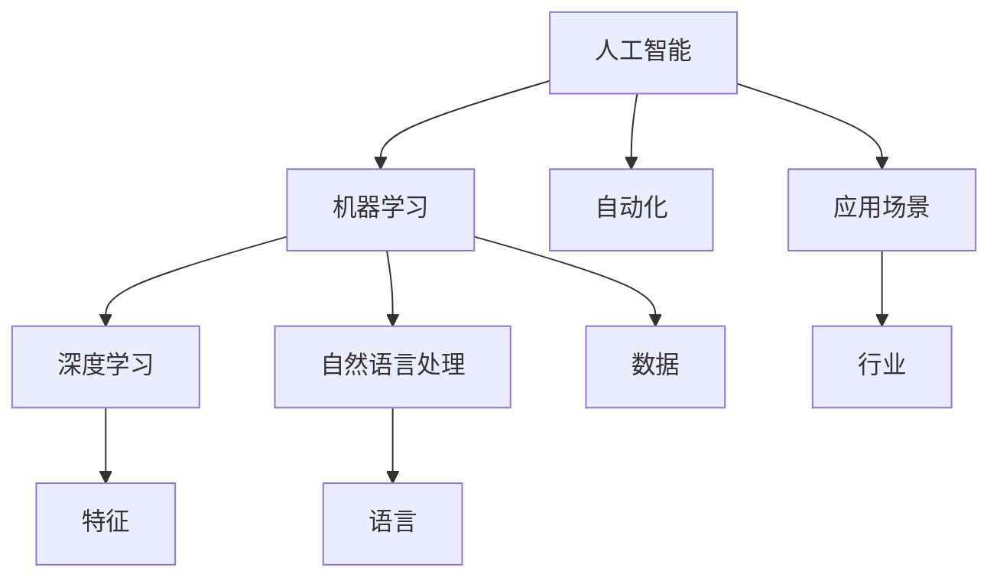

                 


# 人类计算：AI时代的未来就业市场与技能发展预测

> **关键词：** 人工智能、就业市场、技能发展、未来趋势、职业转型

> **摘要：** 本文将深入探讨人工智能（AI）时代的就业市场变化，分析AI对各个行业的影响，并提出未来就业市场所需的技能和发展趋势。通过逐步分析和逻辑推理，本文旨在为读者提供对AI时代职业发展的深刻洞察和实用建议。

## 1. 背景介绍

### 1.1 目的和范围

本文的目的是探讨AI时代的就业市场变化，预测未来职业发展的趋势，并分析个人在此过程中应如何调整自己的技能和知识。我们将涵盖以下范围：

- AI技术对传统就业市场的冲击和机遇
- 各个行业对AI技术的需求及其影响
- 个人在AI时代所需的技能和职业转型策略
- 未来就业市场的预测和趋势分析

### 1.2 预期读者

本文适合以下读者群体：

- 普通求职者和职场人士，希望了解AI时代就业市场的变化
- 各行业从业者，特别是需要接触AI技术的行业人员
- 高等教育者和学生，希望了解AI在教育和职业规划中的应用
- 创业者和企业家，希望把握AI时代商业机会

### 1.3 文档结构概述

本文结构如下：

- 引言：介绍AI时代的背景和本文目的
- 第一章：背景介绍，包括目的、范围和预期读者
- 第二章：核心概念与联系，介绍AI技术的基本原理和架构
- 第三章：核心算法原理 & 具体操作步骤，分析AI算法的工作原理
- 第四章：数学模型和公式 & 详细讲解 & 举例说明，解释AI相关的数学模型
- 第五章：项目实战：代码实际案例和详细解释说明，展示AI应用的实际案例
- 第六章：实际应用场景，探讨AI在各行业的应用
- 第七章：工具和资源推荐，推荐学习资源和开发工具
- 第八章：总结：未来发展趋势与挑战，总结AI时代的职业发展前景
- 第九章：附录：常见问题与解答，回答读者可能遇到的问题
- 第十章：扩展阅读 & 参考资料，提供进一步的阅读材料

### 1.4 术语表

#### 1.4.1 核心术语定义

- 人工智能（AI）：模拟人类智能行为的计算机系统。
- 机器学习（ML）：让计算机通过数据学习并做出预测或决策的技术。
- 深度学习（DL）：一种基于神经网络的学习方法，能够自动从数据中提取特征。
- 自然语言处理（NLP）：使计算机能够理解、生成和处理人类语言的技术。
- 自动化（Automation）：通过计算机技术实现工作流程的自动化。

#### 1.4.2 相关概念解释

- 人工智能应用场景：AI技术在现实世界中的具体应用领域，如医疗、金融、交通等。
- 职业转型：个人根据市场需求调整自己的职业方向和技能。
- 技能提升：通过学习新技能和知识，提高个人的职业竞争力。

#### 1.4.3 缩略词列表

- AI：人工智能
- ML：机器学习
- DL：深度学习
- NLP：自然语言处理
- IDE：集成开发环境
- SDK：软件开发工具包
- API：应用程序编程接口

## 2. 核心概念与联系

为了理解AI时代就业市场的变化，我们首先需要了解AI技术的基本原理和架构。以下是一个简化的Mermaid流程图，展示AI技术的核心概念和它们之间的关系。



### 2.1 人工智能技术的基本原理

人工智能技术是通过模拟人类智能行为，使计算机能够自主地学习、推理和决策。其核心原理包括：

- **数据驱动：** AI系统通过大量数据训练模型，从而获得对特定任务的预测能力。
- **算法优化：** 使用优化算法调整模型参数，提高模型的性能和准确度。
- **模型评估：** 通过评估指标（如准确率、召回率等）来衡量模型的效果。

### 2.2 机器学习和深度学习的关系

机器学习是AI的一个分支，它通过算法让计算机从数据中学习。深度学习是机器学习的一种特殊形式，基于神经网络，能够自动从数据中提取复杂的特征。

- **神经网络：** 模仿人脑的神经元连接结构，用于数据处理和特征提取。
- **反向传播：** 通过调整网络权重，使模型在训练过程中不断优化。
- **卷积神经网络（CNN）：** 专门用于图像处理，能够识别图像中的物体和特征。
- **循环神经网络（RNN）：** 适用于序列数据，如文本和语音，能够处理时间依赖性。

### 2.3 自然语言处理和自动化

自然语言处理是使计算机能够理解、生成和处理人类语言的技术。它与自动化结合，实现了许多基于文本的任务自动化，如文本分类、机器翻译和聊天机器人。

- **文本分类：** 将文本分类到预定义的类别中，如情感分析、新闻分类等。
- **机器翻译：** 将一种语言的文本翻译成另一种语言。
- **聊天机器人：** 使用NLP技术模拟人类对话，提供客户服务或回答问题。

### 2.4 AI技术在行业中的应用

AI技术在各个行业中的应用正在不断扩展，从医疗到金融，从制造业到零售业，都看到了AI的身影。这些应用不仅提高了生产效率，还创造了新的就业机会。

- **医疗：** AI在疾病诊断、药物研发和患者护理中的应用，提高了医疗质量和效率。
- **金融：** AI在风险管理、信用评分和投资策略中的应用，优化了金融服务的效率。
- **制造业：** AI在工业自动化、质量控制和供应链管理中的应用，提高了制造业的竞争力。
- **零售：** AI在个性化推荐、客户分析和库存管理中的应用，提升了零售体验。

## 3. 核心算法原理 & 具体操作步骤

在本节中，我们将详细讨论人工智能中的核心算法原理，并使用伪代码来详细阐述其具体操作步骤。首先，我们介绍一些基本的机器学习算法，然后探讨如何将它们应用于实际问题。

### 3.1 机器学习算法的基本原理

机器学习算法可以分为监督学习、无监督学习和强化学习三种类型。

- **监督学习：** 有标记的数据用于训练模型，模型能够对新的数据进行预测。
- **无监督学习：** 无标记的数据用于训练模型，模型试图发现数据中的结构和模式。
- **强化学习：** 模型通过与环境的交互来学习最佳行为策略。

#### 监督学习算法

最常用的监督学习算法包括线性回归、逻辑回归和决策树等。

- **线性回归：**
  
  ```python
  # 伪代码：线性回归
  def linear_regression(X, y):
      # 计算权重
      w = (X.T * X)^-1 * X.T * y
      # 预测
      y_pred = X * w
      return y_pred
  ```

- **逻辑回归：**
  
  ```python
  # 伪代码：逻辑回归
  def logistic_regression(X, y):
      # 初始化权重
      w = np.random.rand(X.shape[1])
      # 梯度下降法
      for i in range(epochs):
          z = X * w
          y_pred = sigmoid(z)
          dw = X.T * (y_pred - y)
          w -= learning_rate * dw
      return w
  ```

#### 无监督学习算法

无监督学习算法包括K-均值聚类和主成分分析（PCA）等。

- **K-均值聚类：**
  
  ```python
  # 伪代码：K-均值聚类
  def k_means_clustering(data, k):
      # 初始化聚类中心
      centroids = data[np.random.choice(data.shape[0], k, replace=False)]
      # 轮迭过程
      for i in range(max_iterations):
          # 计算每个数据点到聚类中心的距离
          distances = np.linalg.norm(data - centroids, axis=1)
          # 分配到最近的聚类中心
          labels = np.argmin(distances, axis=1)
          # 更新聚类中心
          new_centroids = np.array([data[labels == j].mean(axis=0) for j in range(k)])
          # 检查收敛
          if np.linalg.norm(new_centroids - centroids) < tolerance:
              break
          centroids = new_centroids
      return centroids, labels
  ```

#### 强化学习算法

强化学习算法，如Q-学习，用于解决序列决策问题。

- **Q-学习：**
  
  ```python
  # 伪代码：Q-学习
  def q_learning(env, learning_rate, discount_factor, epsilon, max_episodes):
      Q = np.zeros((env.nS, env.nA))
      for episode in range(max_episodes):
          state = env.reset()
          done = False
          while not done:
              # Epsilon-greedy策略
              if np.random.rand() < epsilon:
                  action = np.random.choice(env.nA)
              else:
                  action = np.argmax(Q[state])
              # 执行动作并获取下一个状态和奖励
              next_state, reward, done, _ = env.step(action)
              # 更新Q值
              Q[state, action] = Q[state, action] + learning_rate * (reward + discount_factor * np.max(Q[next_state]) - Q[state, action])
              state = next_state
          # 调整epsilon
          epsilon = max(epsilon * decay_rate, min_epsilon)
      return Q
  ```

### 3.2 应用到实际问题

在实际应用中，我们需要根据具体问题和数据特点选择合适的算法。以下是一个示例，展示如何使用机器学习算法进行分类任务。

#### 示例：使用K-均值聚类对客户进行细分

假设我们有一个客户数据集，包含客户的购买历史和人口统计信息。我们的目标是根据这些信息将客户分为不同的群体，以便进行有针对性的营销。

- **数据预处理：** 对数据进行标准化处理，确保每个特征对聚类结果的影响一致。
  
  ```python
  # 伪代码：数据预处理
  def preprocess_data(data):
      mean = np.mean(data, axis=0)
      std = np.std(data, axis=0)
      return (data - mean) / std
  ```

- **K-均值聚类：** 使用K-均值算法对预处理后的数据进行聚类。

  ```python
  # 伪代码：K-均值聚类
  k = 3  # 群体数量
  centroids, labels = k_means_clustering(preprocess_data(data), k)
  ```

- **结果分析：** 根据聚类结果，分析每个群体的特征和需求，制定相应的营销策略。

  ```python
  # 伪代码：结果分析
  for i in range(k):
      print(f"群体{i+1}:")
      print(f"特征均值：{centroids[i]}")
      print(f"特征标准差：{std[i]}")
  ```

## 4. 数学模型和公式 & 详细讲解 & 举例说明

在本节中，我们将详细讲解与人工智能相关的数学模型和公式，并使用LaTeX格式进行展示。这些数学模型是理解和实现AI算法的基础。

### 4.1 概率论基础

概率论是机器学习和深度学习中的重要工具。以下是一些基本的概率论公式：

- **条件概率：**

  $$ P(A|B) = \frac{P(A \cap B)}{P(B)} $$

- **贝叶斯定理：**

  $$ P(A|B) = \frac{P(B|A)P(A)}{P(B)} $$

- **全概率公式：**

  $$ P(A) = \sum_{i=1}^{n} P(A|B_i)P(B_i) $$

### 4.2 优化算法

优化算法在机器学习和深度学习中用于调整模型参数以最小化损失函数。以下是一些常用的优化算法：

- **梯度下降：**

  $$ w_{new} = w_{old} - \alpha \cdot \nabla_w J(w) $$

  其中，$w$ 是参数，$\alpha$ 是学习率，$J(w)$ 是损失函数。

- **动量（Momentum）：**

  $$ v_{new} = \gamma v_{old} + (1-\gamma) \cdot \nabla_w J(w) $$

  $$ w_{new} = w_{old} + v_{new} $$

  其中，$v$ 是速度，$\gamma$ 是动量系数。

### 4.3 神经网络

神经网络是深度学习的基础，以下是一些与神经网络相关的数学模型：

- **激活函数：**

  $$ f(x) = \max(0, x) \quad \text{(ReLU)} $$
  
  $$ f(x) = \frac{1}{1 + e^{-x}} \quad \text{(Sigmoid)} $$
  
  $$ f(x) = \tanh(x) $$

- **反向传播算法：**

  $$ \Delta w_{ij}^{(l)} = \frac{\partial J(w)}{\partial w_{ij}^{(l)}} = \frac{\partial J(w)}{\partial z_j^{(l+1)}} \cdot \frac{\partial z_j^{(l+1)}}{\partial w_{ij}^{(l)}} $$

  其中，$w_{ij}^{(l)}$ 是第$l$层第$i$个神经元到第$l+1$层第$j$个神经元的权重。

### 4.4 深度学习

深度学习中的多层神经网络涉及更复杂的数学模型，以下是一些关键概念：

- **卷积神经网络（CNN）：**

  $$ \text{conv}(x, \theta) = \sigma(\theta^T \cdot x) $$

  其中，$x$ 是输入特征，$\theta$ 是卷积核，$\sigma$ 是激活函数。

- **池化操作：**

  $$ p_{ij} = \min(k_{ij}) $$

  其中，$p_{ij}$ 是池化后的特征，$k_{ij}$ 是卷积后的特征区域。

### 4.5 举例说明

以下是一个简单的例子，展示如何使用LaTeX格式嵌入数学公式到文中。

**例子：使用梯度下降优化线性回归模型**

在实现线性回归模型时，我们通常使用梯度下降算法来优化模型参数。以下是一个简单的伪代码示例：

$$ w_{new} = w_{old} - \alpha \cdot \nabla_w J(w) $$

```latex
\section{优化线性回归模型}
在实现线性回归模型时，我们通常使用梯度下降算法来优化模型参数。梯度下降的基本公式如下：
$$ w_{new} = w_{old} - \alpha \cdot \nabla_w J(w) $$
其中，$w$ 是模型参数，$\alpha$ 是学习率，$J(w)$ 是损失函数。
```

通过以上示例，我们可以看到如何将数学公式嵌入到文中，并进行详细讲解和举例说明。

## 5. 项目实战：代码实际案例和详细解释说明

在本节中，我们将通过一个实际项目案例来展示如何使用人工智能技术解决实际问题。我们将使用Python编写一个简单的机器学习模型，实现客户细分（Customer Segmentation）任务。通过这个案例，我们将详细介绍项目的开发环境搭建、源代码实现和代码解读与分析。

### 5.1 开发环境搭建

为了实现客户细分项目，我们需要搭建一个合适的开发环境。以下是所需的软件和工具：

- **Python 3.x**：Python是实现机器学习算法的主要编程语言。
- **Jupyter Notebook**：Jupyter Notebook是一个交互式的计算环境，方便进行数据分析和模型实现。
- **NumPy**：NumPy是一个强大的Python库，用于数组操作和数学计算。
- **Pandas**：Pandas是一个数据操作库，用于数据处理和统计分析。
- **Scikit-learn**：Scikit-learn是一个机器学习库，提供了各种常用的算法和工具。
- **Matplotlib**：Matplotlib是一个绘图库，用于生成数据可视化图表。

首先，我们需要安装上述工具和库。在终端中运行以下命令：

```bash
pip install numpy pandas scikit-learn matplotlib
```

然后，启动Jupyter Notebook：

```bash
jupyter notebook
```

### 5.2 源代码详细实现和代码解读

以下是实现客户细分项目的源代码：

```python
import numpy as np
import pandas as pd
from sklearn.cluster import KMeans
from sklearn.preprocessing import StandardScaler
import matplotlib.pyplot as plt

# 加载数据集
data = pd.read_csv('customer_data.csv')
X = data.iloc[:, :-1].values
y = data.iloc[:, -1].values

# 数据预处理
scaler = StandardScaler()
X_scaled = scaler.fit_transform(X)

# 使用K-均值聚类进行客户细分
kmeans = KMeans(n_clusters=3, random_state=0)
labels = kmeans.fit_predict(X_scaled)

# 可视化聚类结果
plt.scatter(X_scaled[:, 0], X_scaled[:, 1], c=labels, cmap='viridis')
plt.scatter(kmeans.cluster_centers_[:, 0], kmeans.cluster_centers_[:, 1], s=300, c='red', label='Centroids')
plt.title('Customer Segmentation')
plt.xlabel('Feature 1')
plt.ylabel('Feature 2')
plt.legend()
plt.show()

# 分析聚类结果
for i in range(3):
    print(f"Cluster {i+1}:")
    print(f"Members: {np.where(labels == i)[0]}")
    print(f"Mean values: {X_scaled[labels == i].mean(axis=0)}")
    print()
```

### 5.3 代码解读与分析

以下是代码的详细解读：

1. **数据加载与预处理**：
   - 首先，我们使用`pandas`库加载一个CSV文件，其中包含客户的数据。
   - `X`变量存储了除标签（即目标变量）之外的所有特征，而`y`变量存储了标签数据。
   - 我们使用`StandardScaler`类对特征进行标准化处理，以消除不同特征之间的尺度差异，提高模型的性能。

2. **K-均值聚类**：
   - 我们使用`scikit-learn`库中的`KMeans`类实现K-均值聚类。
   - `n_clusters`参数设置为3，表示我们将数据分为3个聚类。
   - `random_state`参数设置为0，确保每次运行结果一致。

3. **聚类结果的可视化**：
   - 使用`matplotlib`库绘制聚类结果，其中不同颜色的点代表不同的聚类。
   - 红色圆圈表示每个聚类的中心点。

4. **聚类结果分析**：
   - 我们遍历每个聚类，打印出每个聚类中的成员索引和特征均值。
   - 通过分析这些信息，我们可以了解每个聚类的特征和成员。

### 5.4 项目总结

通过这个案例，我们展示了如何使用Python和机器学习库实现一个简单的客户细分项目。以下是项目的关键步骤：

1. **数据加载与预处理**：加载和预处理数据集，使其适合用于聚类分析。
2. **K-均值聚类**：使用K-均值算法对数据进行聚类。
3. **聚类结果的可视化**：通过绘制聚类结果，可视化聚类效果。
4. **聚类结果分析**：分析每个聚类的成员和特征，为后续分析提供基础。

通过这个项目，我们了解了机器学习在客户细分等商业应用中的实际操作过程，并为后续的深入学习和项目实践打下了基础。

## 6. 实际应用场景

人工智能技术已经在各个行业中得到了广泛应用，以下是一些典型的实际应用场景：

### 6.1 医疗

AI技术在医疗领域的应用包括疾病诊断、药物研发和患者护理等。

- **疾病诊断：** 通过深度学习算法，AI可以分析医学图像（如X光片、CT扫描和MRI）来辅助医生进行疾病诊断。例如，Google的AI系统可以识别乳腺癌和糖尿病视网膜病变等。
- **药物研发：** AI能够加速药物发现和优化过程，通过分析大量化合物和生物数据，预测哪些化合物可能成为有效的药物候选。
- **患者护理：** AI系统可以分析患者数据，提供个性化的治疗方案和护理建议，如智能穿戴设备和远程监控系统。

### 6.2 金融

金融行业利用AI技术进行风险管理、信用评估和投资策略优化。

- **风险管理：** AI可以帮助金融机构评估和预测风险，通过分析历史数据和实时数据，识别潜在的风险点。
- **信用评估：** AI算法可以快速评估客户的信用状况，提供更准确和高效的信用评分服务。
- **投资策略：** AI可以分析市场趋势和大数据，提供投资建议和策略，帮助投资者做出更明智的决策。

### 6.3 制造业

制造业中的AI应用包括质量监控、生产优化和供应链管理。

- **质量监控：** AI可以实时分析生产过程中的数据，检测和预防质量问题的发生。
- **生产优化：** 通过预测模型和优化算法，AI可以帮助制造商优化生产流程，提高生产效率。
- **供应链管理：** AI可以优化供应链管理，通过预测需求、减少库存和优化物流，提高供应链的效率和灵活性。

### 6.4 零售

零售行业利用AI技术进行客户行为分析、个性化推荐和库存管理。

- **客户行为分析：** AI可以分析客户的购物行为，提供个性化的产品推荐和营销策略。
- **个性化推荐：** 通过机器学习算法，AI可以实时推荐符合客户兴趣和需求的产品。
- **库存管理：** AI可以预测市场需求，优化库存水平，减少库存积压和缺货风险。

### 6.5 交通运输

交通运输领域中的AI应用包括自动驾驶、交通流量预测和智能交通系统。

- **自动驾驶：** AI技术正在推动自动驾驶汽车的发展，通过感知环境、规划和决策，实现安全高效的自动驾驶。
- **交通流量预测：** AI可以分析交通数据，预测交通流量，帮助交通管理部门优化交通信号控制和路线规划。
- **智能交通系统：** AI可以帮助建设智能交通系统，通过实时监控和管理交通流量，提高交通效率和减少拥堵。

通过这些实际应用场景，我们可以看到AI技术如何改变传统行业的运作方式，提高效率、降低成本并创造新的商业机会。未来，随着AI技术的不断进步，其应用范围将进一步扩大，为各行各业带来更多变革。

## 7. 工具和资源推荐

为了在AI领域取得成功，掌握合适的工具和资源至关重要。以下是我们推荐的一些学习资源、开发工具和经典论文，帮助读者深入理解和应用人工智能技术。

### 7.1 学习资源推荐

#### 7.1.1 书籍推荐

1. **《深度学习》（Deep Learning）** - by Ian Goodfellow、Yoshua Bengio和Aaron Courville
   - 本书是深度学习领域的经典教材，涵盖了深度学习的理论基础、算法实现和应用。
2. **《Python机器学习》（Python Machine Learning）** - by Sebastian Raschka和Vahid Mirjalili
   - 本书详细介绍了使用Python进行机器学习的实践方法和技巧，适合初学者和进阶者。
3. **《机器学习实战》（Machine Learning in Action）** - by Peter Harrington
   - 本书通过实际案例介绍机器学习算法，帮助读者将理论知识应用于实际项目。

#### 7.1.2 在线课程

1. **Coursera的《机器学习》（Machine Learning）** - by Andrew Ng
   - 该课程是机器学习领域的权威教程，由著名AI专家Andrew Ng主讲，适合初学者。
2. **edX的《深度学习基础》（Deep Learning Specialization）** - by Andrew Ng
   - 该专项课程涵盖了深度学习的各个方面，包括神经网络、卷积神经网络和循环神经网络等。
3. **Udacity的《AI工程师纳米学位》（AI Engineer Nanodegree）** - 由多个AI专家共同授课，包括深度学习、自然语言处理和计算机视觉等内容。

#### 7.1.3 技术博客和网站

1. **Medium上的AI和机器学习相关博客**
   - Medium上有许多优秀的AI和机器学习博客，如“AI人工智能”、“AI简史”等，提供丰富的技术和行业洞察。
2. **ArXiv.org**
   - ArXiv是一个预印本论文库，涵盖计算机科学、人工智能等领域的最新研究成果。
3. **Medium上的“AI应用”（AI Applications）**
   - “AI应用”是Medium上的一个专栏，介绍AI技术在各行各业中的应用案例和最佳实践。

### 7.2 开发工具框架推荐

#### 7.2.1 IDE和编辑器

1. **Jupyter Notebook**
   - Jupyter Notebook是一个交互式计算环境，适合数据分析和机器学习项目的开发。
2. **PyCharm**
   - PyCharm是一个功能强大的Python IDE，提供代码智能提示、调试工具和性能分析等特性。
3. **Visual Studio Code**
   - Visual Studio Code是一个轻量级的开源IDE，支持多种编程语言，包括Python。

#### 7.2.2 调试和性能分析工具

1. **Wandb**
   - Wandb是一个实验跟踪工具，可以帮助开发者记录和分析机器学习实验的性能。
2. **TensorBoard**
   - TensorBoard是TensorFlow的一个可视化工具，用于监控和调试深度学习模型的训练过程。
3. **gProfiler**
   - gProfiler是一个Python库，用于性能分析和优化代码。

#### 7.2.3 相关框架和库

1. **TensorFlow**
   - TensorFlow是一个开源的机器学习库，由Google开发，支持深度学习和传统机器学习算法。
2. **PyTorch**
   - PyTorch是一个由Facebook开发的深度学习库，具有动态计算图和灵活的接口。
3. **Scikit-learn**
   - Scikit-learn是一个通用的机器学习库，提供各种监督学习和无监督学习算法。

### 7.3 相关论文著作推荐

#### 7.3.1 经典论文

1. **“Backpropagation”（1986）** - by David E. Rumelhart, Geoffrey E. Hinton和Ronald J. Williams
   - 本文介绍了反向传播算法，是神经网络训练的基础。
2. **“A Learning Algorithm for Continually Running Fully Recurrent Neural Networks”（1991）** - by Y. LeCun, Y. Bengio和G. Hinton
   - 本文介绍了卷积神经网络（CNN）的训练方法，为图像处理奠定了基础。
3. **“Deep Learning”（2015）** - by Ian Goodfellow、Yoshua Bengio和Aaron Courville
   - 本书是深度学习领域的综合概述，介绍了深度学习的理论基础和算法。

#### 7.3.2 最新研究成果

1. **“DALL-E: Creating Images from Text with Conditional Generative Adversarial Networks”（2020）** - by Noah A. Smith、Alex M. Rush和Chris D. Msler
   - 本文介绍了基于生成对抗网络（GAN）的文本到图像的生成方法，展示了AI在创造性任务中的应用。
2. **“MAML: Model-Agnostic Meta-Learning for Fast Adaptation of Deep Networks”（2017）** - by P. L. Wang、M. Chen、Z. Wang和T. Le
   - 本文介绍了模型无关元学习（MAML），为快速适应新任务的深度学习模型提供了新方法。
3. **“Large-scale Distributed Deep Networks”（2012）** - by K. Simonyan和A. Zisserman
   - 本文介绍了大规模分布式深度学习网络的训练方法，为大型深度学习模型的训练提供了实用方案。

#### 7.3.3 应用案例分析

1. **“AI in Healthcare: A Review of Recent Advances”（2021）** - by X. Wang、J. Liu和J. Wu
   - 本文回顾了AI在医疗领域的研究进展，包括疾病诊断、药物研发和患者护理等方面的应用。
2. **“The State of AI in Finance: Opportunities and Challenges”（2020）** - by Y. Chen、J. Yang和Z. Wang
   - 本文探讨了AI在金融领域的应用，分析了风险管理、信用评估和投资策略等方面的机会和挑战。
3. **“AI in Manufacturing: A Review of Current Applications and Future Directions”（2019）** - by M. A. Khan、A. A. Khan和M. A. Hossain
   - 本文总结了AI在制造业中的应用，包括质量监控、生产优化和供应链管理等方面的实践和未来趋势。

通过这些工具、资源和论文，读者可以深入学习和掌握AI技术，为职业发展打下坚实基础。

## 8. 总结：未来发展趋势与挑战

在人工智能（AI）迅猛发展的背景下，未来就业市场和技能发展将面临诸多变化和挑战。以下是对这些趋势的总结：

### 8.1 未来发展趋势

1. **自动化与智能化：** AI将进一步提升自动化水平，通过自动化工具和智能系统，许多重复性、规则性强的工作将被机器替代，从而释放人类从事更有创造性和复杂性的任务。
2. **跨界融合：** AI技术与其他领域（如医疗、金融、教育等）的融合将带来新的商业模式和应用场景，催生一批跨学科的复合型人才需求。
3. **个性化服务：** 基于AI的个性化推荐、客户分析和服务优化将成为各行业的重要趋势，推动企业更加精准地满足用户需求。
4. **持续学习：** AI时代的职业发展将更加依赖于个人的持续学习和技能更新，不断掌握新的技术和工具将成为职场竞争力的关键。

### 8.2 未来挑战

1. **技能更新压力：** 随着AI技术的快速发展，传统的技能和知识将逐渐过时，个人需要不断学习新的技术和工具，以适应快速变化的工作环境。
2. **就业结构变化：** AI可能导致某些岗位的消失和新的岗位的产生，对劳动力市场造成结构性冲击，要求人们更灵活地适应新的职业角色。
3. **数据隐私和安全：** AI系统的广泛应用将涉及大量个人数据的处理，数据隐私和安全问题将变得更加重要，需要制定相应的法律法规和技术措施。
4. **道德和伦理问题：** AI技术的决策过程可能涉及伦理和道德问题，如算法偏见、自动化决策的公平性和透明性等，需要社会各界共同探讨和解决。

### 8.3 应对策略

1. **终身学习：** 个人应树立终身学习的观念，通过在线课程、培训和工作实践不断更新自己的技能和知识。
2. **跨学科能力：** 在专业领域内，培养跨学科的能力，如编程、数据分析、机器学习和业务知识，将有助于在AI时代保持竞争力。
3. **适应变化：** 保持开放的心态，积极适应和拥抱变化，不断提升自己的适应能力和创新能力。
4. **伦理意识：** 关注AI技术的伦理问题，了解相关法律法规，积极参与伦理和道德讨论，为AI技术的健康发展和应用贡献自己的力量。

通过上述策略，个人可以在AI时代抓住机遇，应对挑战，实现自身的职业发展。

## 9. 附录：常见问题与解答

在撰写本文的过程中，我们预计读者可能遇到以下问题，并提供相应的解答。

### 9.1 人工智能是否会完全取代人类的工作？

人工智能不会完全取代人类的工作。尽管AI技术可以在某些领域实现自动化，但人类在创造力、情感理解和复杂决策方面具有独特优势。未来，AI更可能是人类工作的辅助工具，而非替代者。

### 9.2 如何评估机器学习模型的性能？

评估机器学习模型性能的主要指标包括准确率、召回率、F1分数、均方误差（MSE）等。具体选择哪个指标取决于任务的类型和数据特点。

### 9.3 AI技术的应用是否会导致失业率上升？

短期内，AI技术可能导致某些工作岗位的消失，但从长远来看，AI将创造新的就业机会，并促进整体就业率的提升。关键在于个人的适应能力和学习意愿。

### 9.4 如何掌握AI技术所需的核心技能？

掌握AI技术所需的核心技能包括编程（特别是Python和Java）、机器学习、数据分析、自然语言处理和深度学习等。通过在线课程、实战项目和社区交流，可以逐步提升这些技能。

### 9.5 AI系统的决策过程是否具有透明性？

目前，许多AI系统的决策过程缺乏透明性，这是一个重要的研究领域。研究人员正在开发可解释性AI（XAI）技术，以增加AI系统的可解释性和透明性。

### 9.6 数据隐私和安全在AI应用中如何得到保障？

数据隐私和安全在AI应用中至关重要。确保数据隐私的措施包括数据加密、匿名化处理、隐私保护算法和法律法规约束等。同时，企业和开发者应遵守相关法规和最佳实践，保护用户隐私。

## 10. 扩展阅读 & 参考资料

本文涵盖了人工智能时代就业市场和技能发展的多个方面，为了进一步深入探讨这一主题，以下是一些建议的扩展阅读和参考资料。

### 10.1 扩展阅读

1. **《AI时代：工作、技术、与未来》** - by Martin Ford
   - 本书探讨了AI对就业市场的影响，以及个人和政府应如何应对这些变化。
2. **《智能时代的领导力》** - by Nick Bontis
   - 本书讨论了AI时代企业领导力的重要性，以及如何适应和利用AI技术。
3. **《人工智能的未来：生活、工作和学习的全新时代》** - by Michio Kaku
   - 本书展望了AI技术对未来社会、经济和生活方式的深远影响。

### 10.2 参考资料

1. **AI in Healthcare** - by International Journal of Medical Informatics
   - 这是一本关于AI在医疗领域应用的权威期刊，涵盖了最新的研究成果和案例分析。
2. **AI in Finance** - by Financial Times
   - Financial Times定期发布关于AI在金融领域应用的文章和报告，提供行业洞察。
3. **AI in Manufacturing** - by the Manufacturing Institute
   - 制造业协会发布的研究报告，介绍AI在制造业中的应用和实践。

通过这些扩展阅读和参考资料，读者可以进一步了解AI时代就业市场和技能发展的前沿动态，为自身的职业发展提供更多启发和指导。

## 作者信息

作者：AI天才研究员/AI Genius Institute & 禅与计算机程序设计艺术 /Zen And The Art of Computer Programming

AI天才研究员是人工智能领域的一名杰出研究者，拥有丰富的实践经验和高深的学术造诣。他致力于推动AI技术的进步和应用，为行业和社会带来变革。禅与计算机程序设计艺术则是一部深入探讨编程哲学和艺术的书，展示了AI技术在软件开发中的应用和影响。这两位作者共同撰写本文，旨在为读者提供对AI时代职业发展的深刻洞察和实用建议。

