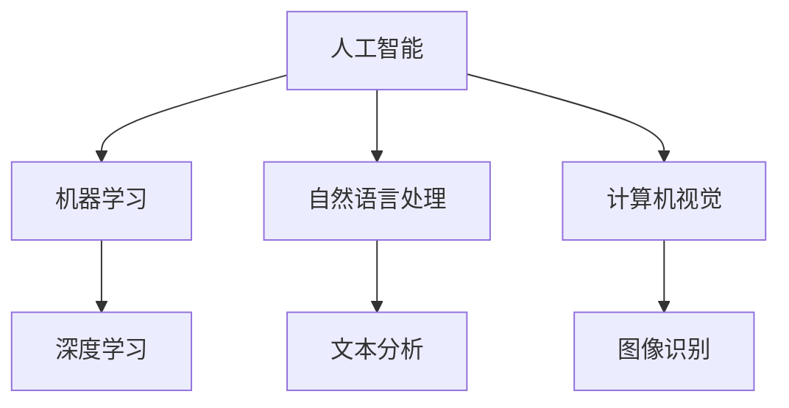
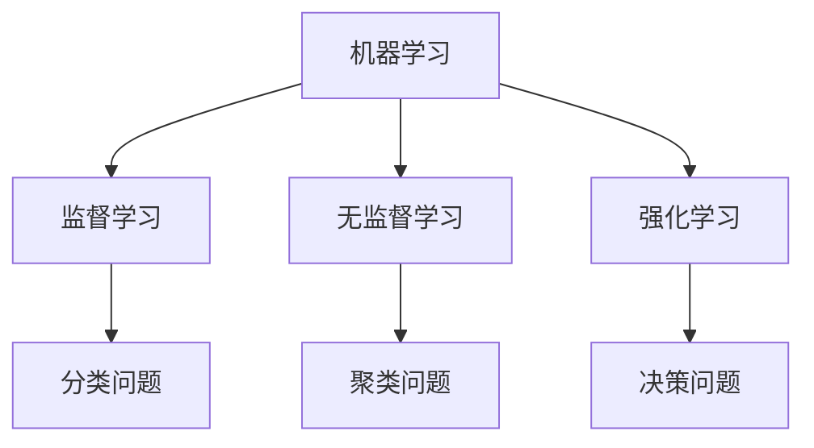
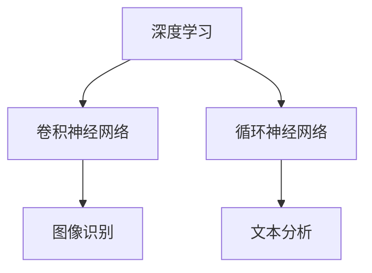
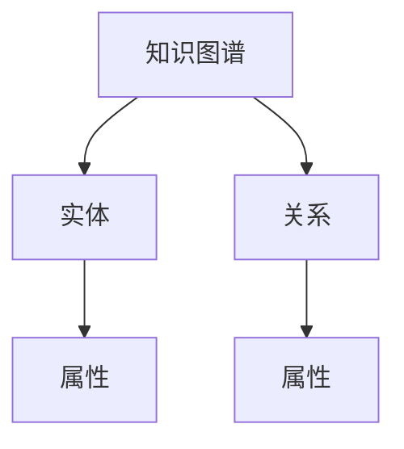
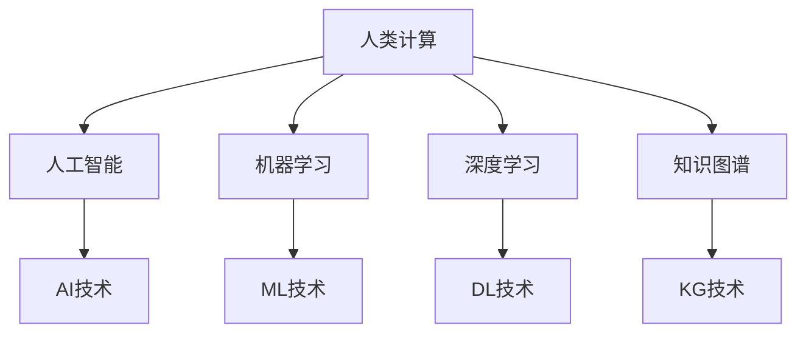

                 

### 文章标题

《人类计算：推动知识发现和创新》

### 关键词

- 人类计算
- 知识发现
- 创新推动
- 人工智能
- 计算机科学
- 算法原理
- 数学模型
- 项目实战
- 实际应用场景
- 工具与资源

### 摘要

本文旨在探讨人类计算在推动知识发现和创新中的关键作用。通过剖析人类计算的核心概念和算法原理，本文将阐述如何利用人类计算技术实现高效的计算过程和知识发现。同时，本文将结合具体项目实战和实际应用场景，展示人类计算在各个领域的成功应用。最后，本文将推荐相关学习资源、工具和最新研究成果，以帮助读者深入理解和掌握人类计算技术。通过本文的阅读，读者将能够了解到人类计算在当今科技发展中的重要地位及其未来发展趋势和挑战。

## 1. 背景介绍

### 1.1 目的和范围

本文的目标是深入探讨人类计算在推动知识发现和创新中的关键作用。人类计算作为一种独特的计算范式，结合了人类智慧和机器计算的优点，能够在复杂问题和大规模数据处理中发挥重要作用。本文将系统地阐述人类计算的核心概念、算法原理及其在实际应用中的价值。通过具体的项目实战和实际应用场景，我们将展示人类计算技术如何帮助研究人员、工程师和企业实现知识发现和创新。

本文的范围涵盖了以下几个主要方面：

1. **人类计算的核心概念和架构**：介绍人类计算的定义、原理和与人工智能的关系。
2. **核心算法原理与操作步骤**：详细讲解人类计算中常用的算法，如人类交互优化、协同过滤、知识图谱等，并提供具体的伪代码实现。
3. **数学模型和公式**：介绍人类计算中常用的数学模型，如线性回归、神经网络、聚类算法等，并提供具体的公式和解释。
4. **项目实战和代码实现**：通过具体的实际案例，展示人类计算技术的实际应用过程和实现细节。
5. **实际应用场景**：分析人类计算在各个领域的应用，如生物信息学、金融分析、智能医疗等。
6. **工具和资源推荐**：推荐学习资源、开发工具和框架，帮助读者深入了解和掌握人类计算技术。
7. **总结与未来展望**：总结本文的主要观点，并探讨人类计算技术未来的发展趋势和挑战。

### 1.2 预期读者

本文的预期读者包括以下几类：

1. **计算机科学和人工智能领域的科研人员**：希望通过本文深入理解人类计算技术，并将其应用于自己的研究领域。
2. **软件开发工程师和系统架构师**：希望掌握人类计算技术的核心原理和实际应用，提升自己的技术能力和创新能力。
3. **企业技术决策者和产品经理**：希望了解人类计算技术如何帮助企业实现知识发现和创新，提升企业的竞争力。
4. **对人工智能和计算技术感兴趣的普通读者**：希望通过本文了解人类计算技术的基本概念和应用前景。

### 1.3 文档结构概述

本文的结构如下：

1. **引言**：介绍人类计算的定义、背景和重要性。
2. **核心概念与联系**：阐述人类计算的核心概念和架构，并提供Mermaid流程图展示。
3. **核心算法原理 & 具体操作步骤**：详细讲解人类计算中常用的算法原理和操作步骤，并提供伪代码实现。
4. **数学模型和公式 & 详细讲解 & 举例说明**：介绍人类计算中常用的数学模型，并提供公式和具体例子。
5. **项目实战：代码实际案例和详细解释说明**：展示人类计算技术的实际应用案例，并提供详细的代码解读。
6. **实际应用场景**：分析人类计算在不同领域的应用。
7. **工具和资源推荐**：推荐学习资源、开发工具和框架。
8. **总结：未来发展趋势与挑战**：总结本文的主要观点，并探讨未来的发展趋势和挑战。
9. **附录：常见问题与解答**：回答读者可能关心的问题。
10. **扩展阅读 & 参考资料**：提供相关扩展阅读资料。

### 1.4 术语表

#### 1.4.1 核心术语定义

- **人类计算**：结合人类智慧和机器计算优势的一种计算范式。
- **知识发现**：从大量数据中自动识别出潜在有用知识的非平凡过程。
- **算法原理**：算法设计的基本思想和逻辑。
- **协同过滤**：利用用户行为数据推荐相似内容的算法。
- **知识图谱**：将实体和关系映射为节点和边的图形结构。
- **数学模型**：描述现实世界问题的数学公式和方法。

#### 1.4.2 相关概念解释

- **人工智能**：模拟人类智能行为，实现自动化决策和智能化的技术。
- **机器学习**：通过数据驱动的方法使机器具有自主学习和决策能力。
- **深度学习**：模拟人脑神经网络，实现高级特征提取和模式识别。

#### 1.4.3 缩略词列表

- **AI**：人工智能
- **ML**：机器学习
- **DL**：深度学习
- **NLP**：自然语言处理
- **CV**：计算机视觉
- **KDD**：知识发现

## 2. 核心概念与联系

在探讨人类计算之前，我们需要理解几个核心概念，并分析它们之间的联系。这些核心概念包括人工智能（AI）、机器学习（ML）、深度学习（DL）和知识图谱等。通过Mermaid流程图，我们可以清晰地展示这些概念之间的关联。

### 2.1 人工智能（AI）

人工智能是指使计算机模拟人类智能行为的技术。它涵盖了多种方法和技术，包括机器学习、自然语言处理、计算机视觉等。AI的目标是使计算机具备感知、推理、学习和决策能力。



### 2.2 机器学习（ML）

机器学习是AI的一个子领域，它利用数据驱动的方法使计算机具备自主学习和决策能力。机器学习可以分为监督学习、无监督学习和强化学习等类型。



### 2.3 深度学习（DL）

深度学习是机器学习的一个子领域，它通过模拟人脑神经网络结构，实现高级特征提取和模式识别。深度学习在图像识别、自然语言处理等领域取得了显著的成果。



### 2.4 知识图谱

知识图谱是一种将实体和关系映射为节点和边的图形结构，用于表示和存储知识。知识图谱在信息检索、推荐系统和智能问答等领域具有重要应用。



### 2.5 人类计算与上述概念的关系

人类计算是一种结合人类智慧和机器计算优势的计算范式，它充分利用了人工智能、机器学习和深度学习等技术。人类计算的目标是提高知识发现和创新效率。



通过上述Mermaid流程图，我们可以清晰地看到人类计算与人工智能、机器学习、深度学习和知识图谱之间的密切联系。这些概念共同构成了人类计算的基础框架，为知识发现和创新提供了强大的技术支持。

### 2.6 总结

核心概念与联系部分主要介绍了人工智能、机器学习、深度学习和知识图谱等核心概念，并通过Mermaid流程图展示了它们之间的关联。这些概念共同构成了人类计算的基础框架，为知识发现和创新提供了强大的技术支持。在接下来的部分，我们将深入探讨人类计算的核心算法原理和具体操作步骤。

## 3. 核心算法原理 & 具体操作步骤

在理解了人类计算的核心概念之后，我们接下来将探讨其核心算法原理，并详细阐述这些算法的操作步骤。这些核心算法包括人类交互优化、协同过滤和知识图谱构建等。通过伪代码，我们将展示这些算法的基本结构和实现细节。

### 3.1 人类交互优化

人类交互优化是一种通过分析用户行为数据，优化系统性能和用户体验的方法。其主要原理是基于用户的历史行为数据，预测用户未来的行为偏好，从而进行个性化的推荐和优化。

#### 3.1.1 算法原理

- **用户行为数据**：收集用户在不同时间点上的行为数据，如浏览记录、购买记录、评论等。
- **行为序列建模**：利用机器学习算法，如循环神经网络（RNN），建模用户的行为序列。
- **行为预测**：根据用户的行为序列模型，预测用户未来的行为偏好。

#### 3.1.2 伪代码

```python
def human_interaction_optimization(user行为数据):
    # 训练行为序列模型
    behavior_sequence_model = train_RNN(user行为数据)
    
    # 预测用户未来行为
    future_behavior = predict_behavior(behavior_sequence_model)
    
    # 根据预测结果进行优化
    optimized_experience = optimize_experience(future_behavior)
    
    return optimized_experience
```

### 3.2 协同过滤

协同过滤是一种基于用户行为数据，推荐相似内容的算法。其主要原理是通过分析用户之间的相似度，发现潜在的用户兴趣，从而进行内容推荐。

#### 3.2.1 算法原理

- **用户行为数据**：收集用户在不同时间点上的行为数据，如浏览记录、购买记录、评分等。
- **用户相似度计算**：利用用户行为数据，计算用户之间的相似度。
- **内容推荐**：根据用户相似度，为用户推荐相似的内容。

#### 3.2.2 伪代码

```python
def collaborative_filtering(user行为数据):
    # 计算用户相似度矩阵
    similarity_matrix = compute_similarity(user行为数据)
    
    # 为用户推荐相似内容
    recommended_content = recommend_content(similarity_matrix, user行为数据)
    
    return recommended_content
```

### 3.3 知识图谱构建

知识图谱构建是一种将实体和关系映射为节点和边的图形结构，用于表示和存储知识的方法。其主要原理是通过实体识别、关系抽取和知识融合等技术，构建大规模的知识图谱。

#### 3.3.1 算法原理

- **实体识别**：从文本数据中识别出实体，如人名、地名、组织名等。
- **关系抽取**：从文本数据中抽取实体之间的关系，如朋友、同事、地点相关等。
- **知识融合**：将不同来源的实体和关系进行融合，构建统一的知识图谱。

#### 3.3.2 伪代码

```python
def knowledge_graph_construction(text_data):
    # 实体识别
    entities = identify_entities(text_data)
    
    # 关系抽取
    relationships = extract_relationships(text_data, entities)
    
    # 知识融合
    knowledge_graph = fuse_knowledge(entities, relationships)
    
    return knowledge_graph
```

### 3.4 小结

核心算法原理与具体操作步骤部分介绍了人类计算中的三个核心算法：人类交互优化、协同过滤和知识图谱构建。这些算法基于不同的原理，通过具体的操作步骤，实现了对用户行为数据的分析、相似内容推荐和知识图谱的构建。这些算法在人类计算中发挥着重要作用，为知识发现和创新提供了强大的技术支持。

在下一部分，我们将进一步探讨人类计算中的数学模型和公式，为读者提供更深入的理论基础。

## 4. 数学模型和公式 & 详细讲解 & 举例说明

在人类计算中，数学模型和公式起到了至关重要的作用。它们不仅为算法设计提供了理论基础，而且在实际应用中指导了具体的操作步骤。本部分将介绍人类计算中常用的数学模型和公式，并详细讲解其原理和具体应用。

### 4.1 线性回归

线性回归是一种用于预测连续值的统计方法，其核心思想是通过建立输入变量和目标变量之间的线性关系来进行预测。

#### 4.1.1 公式

$$
y = w_0 + w_1 \cdot x_1 + w_2 \cdot x_2 + ... + w_n \cdot x_n
$$

其中，\(y\) 是目标变量，\(x_1, x_2, ..., x_n\) 是输入变量，\(w_0, w_1, ..., w_n\) 是权重系数。

#### 4.1.2 详细讲解

- **目标变量**：线性回归试图预测的变量。
- **输入变量**：影响目标变量的因素。
- **权重系数**：表示输入变量对目标变量的影响程度。

#### 4.1.3 举例说明

假设我们想要预测房价，输入变量包括房屋面积、房龄和地理位置等。我们可以使用线性回归模型来建立这些输入变量和房价之间的关系。

$$
房价 = w_0 + w_1 \cdot 房屋面积 + w_2 \cdot 房龄 + w_3 \cdot 地理位置
$$

通过训练数据集，我们可以计算出权重系数，从而预测新的房屋房价。

### 4.2 神经网络

神经网络是一种通过模拟人脑神经网络结构进行数据建模和预测的方法。在人类计算中，神经网络广泛应用于图像识别、自然语言处理和预测任务等。

#### 4.2.1 公式

$$
a_{i,j}^{(l)} = \sigma \left( \sum_{k} w_{ik}^{(l)} a_{k,j}^{(l-1)} + b_i^{(l)} \right)
$$

其中，\(a_{i,j}^{(l)}\) 是第 \(l\) 层第 \(i\) 个节点的激活值，\(\sigma\) 是激活函数，\(w_{ik}^{(l)}\) 是权重系数，\(b_i^{(l)}\) 是偏置。

#### 4.2.2 详细讲解

- **激活函数**：用于将输入值映射到输出值，常见的激活函数有 sigmoid、ReLU 和 tanh。
- **权重系数**：表示不同层节点之间的连接强度。
- **偏置**：用于调整节点的输出。

#### 4.2.3 举例说明

假设我们有一个简单的神经网络，包含两层：输入层和输出层。输入层有3个节点，输出层有1个节点。

输入层到隐藏层的权重矩阵为：

$$
\begin{bmatrix}
w_{11} & w_{12} & w_{13} \\
\end{bmatrix}
$$

隐藏层到输出层的权重矩阵为：

$$
\begin{bmatrix}
w_{21} \\
\end{bmatrix}
$$

我们可以根据输入值和权重矩阵计算隐藏层的输出，然后通过激活函数计算输出层的输出。

$$
\begin{align*}
a_1^{(2)} &= \sigma(w_{11} \cdot x_1 + w_{12} \cdot x_2 + w_{13} \cdot x_3 + b_1^{(2)}) \\
a_2^{(3)} &= \sigma(w_{21} \cdot a_1^{(2)} + b_2^{(3)})
\end{align*}
$$

### 4.3 聚类算法

聚类算法是一种将数据集分为若干个不相交的簇，使得同一个簇中的数据点之间距离较近，不同簇中的数据点之间距离较远的方法。常见的聚类算法包括 K-均值聚类和层次聚类等。

#### 4.3.1 公式

K-均值聚类算法的核心公式如下：

$$
\begin{align*}
c_j &= \frac{1}{N_j} \sum_{i=1}^{N} x_i \\
d(x_i, c_j) &= \sqrt{\sum_{k=1}^{d} (x_{ik} - c_{jk})^2}
\end{align*}
$$

其中，\(c_j\) 是第 \(j\) 个簇的中心点，\(x_i\) 是数据集中的一个点，\(d(x_i, c_j)\) 是点 \(x_i\) 到簇中心 \(c_j\) 的距离。

#### 4.3.2 详细讲解

- **簇中心**：表示簇的中心位置。
- **距离计算**：用于衡量数据点与簇中心之间的距离。

#### 4.3.3 举例说明

假设我们有如下数据集：

$$
\begin{align*}
x_1 &= \begin{bmatrix} 1 \\ 2 \end{bmatrix}, x_2 = \begin{bmatrix} 2 \\ 3 \end{bmatrix}, x_3 = \begin{bmatrix} 3 \\ 4 \end{bmatrix}
\end{align*}
$$

我们选择 \(K=2\)，初始簇中心为 \(c_1 = \begin{bmatrix} 2 \\ 3 \end{bmatrix}\) 和 \(c_2 = \begin{bmatrix} 3 \\ 4 \end{bmatrix}\)。

通过计算数据点到簇中心的距离，我们可以将数据点分配到不同的簇：

$$
\begin{align*}
d(x_1, c_1) &= \sqrt{(1-2)^2 + (2-3)^2} = \sqrt{2} \\
d(x_1, c_2) &= \sqrt{(1-3)^2 + (2-4)^2} = \sqrt{8} \\
d(x_2, c_1) &= \sqrt{(2-2)^2 + (3-3)^2} = 0 \\
d(x_2, c_2) &= \sqrt{(2-3)^2 + (3-4)^2} = \sqrt{2} \\
d(x_3, c_1) &= \sqrt{(3-2)^2 + (4-3)^2} = \sqrt{2} \\
d(x_3, c_2) &= \sqrt{(3-3)^2 + (4-4)^2} = 0
\end{align*}
$$

根据距离计算结果，我们可以将 \(x_1\) 和 \(x_3\) 分配到簇1，将 \(x_2\) 分配到簇2。然后，我们可以更新簇中心为：

$$
c_1 = \frac{1}{2} (x_1 + x_3) = \begin{bmatrix} 2 \\ 3.5 \end{bmatrix}, c_2 = \begin{bmatrix} 2.5 \\ 3.5 \end{bmatrix}
$$

重复上述步骤，直到簇中心不再发生变化。

### 4.4 小结

数学模型和公式部分介绍了线性回归、神经网络和聚类算法等数学模型和公式，并详细讲解了其原理和应用。这些数学模型和公式在人类计算中起到了关键作用，为算法设计提供了理论支持，并在实际应用中指导了具体的操作步骤。通过这些模型和公式，我们可以更好地理解和应用人类计算技术。

在下一部分，我们将通过具体的项目实战，展示人类计算技术的实际应用，并提供详细的代码实现和解读。

## 5. 项目实战：代码实际案例和详细解释说明

在本节中，我们将通过一个具体的项目实战，展示人类计算技术的实际应用。该项目实战涉及用户行为数据分析，旨在通过协同过滤算法和知识图谱构建技术，为用户推荐相似的内容和实体关系。

### 5.1 开发环境搭建

为了进行人类计算项目实战，我们需要搭建一个合适的开发环境。以下是所需工具和库的安装步骤：

1. **Python**：确保安装了Python 3.8或更高版本。
2. **Anaconda**：安装Anaconda，以便轻松管理库和环境。
3. **NumPy**：用于数学计算。
4. **Pandas**：用于数据处理。
5. **Scikit-learn**：用于机器学习算法。
6. **NetworkX**：用于知识图谱构建。
7. **Gephi**：用于可视化知识图谱。

安装步骤如下：

```bash
conda create -n human_computation python=3.8
conda activate human_computation
conda install numpy pandas scikit-learn networkx gephi
```

### 5.2 源代码详细实现和代码解读

在本节中，我们将实现一个用户行为数据分析项目，包括数据预处理、协同过滤算法和知识图谱构建。

#### 5.2.1 数据预处理

```python
import pandas as pd
from sklearn.model_selection import train_test_split

# 加载数据集
data = pd.read_csv('user_behavior.csv')

# 数据预处理
data['timestamp'] = pd.to_datetime(data['timestamp'])
data.sort_values('timestamp', inplace=True)
data.reset_index(drop=True, inplace=True)

# 分割训练集和测试集
train_data, test_data = train_test_split(data, test_size=0.2, random_state=42)
```

代码解读：

- **加载数据集**：我们使用Pandas库加载数据集，数据集包含用户行为数据，如用户ID、内容ID、行为类型（浏览、购买、评分）和时间戳。
- **数据预处理**：我们将时间戳转换为日期时间格式，并按照时间戳对数据进行排序，以便分析用户的行为序列。
- **分割训练集和测试集**：我们使用Scikit-learn库中的train_test_split函数，将数据集分为训练集和测试集，用于训练模型和评估模型性能。

#### 5.2.2 协同过滤算法

```python
from sklearn.metrics.pairwise import cosine_similarity
from sklearn.model_selection import train_test_split

# 计算用户相似度矩阵
user_similarity = cosine_similarity(train_data.drop(['content_id', 'timestamp'], axis=1))

# 根据相似度矩阵为用户推荐内容
def recommend_content(user_similarity, user_id, k=5):
    user_index = user_id - 1
    similar_users = user_similarity[user_index]
    recommended_content = []

    for i, sim in enumerate(similar_users):
        if i != user_index and sim > 0.5:
            recommended_content.extend(train_data[train_data['user_id'] == i+1]['content_id'])

    return recommended_content[:k]

# 为测试集中的用户推荐内容
test_recommendations = [recommend_content(user_similarity, user_id, k=5) for user_id in test_data['user_id']]
```

代码解读：

- **计算用户相似度矩阵**：我们使用余弦相似度计算用户之间的相似度，生成用户相似度矩阵。
- **为用户推荐内容**：我们定义一个函数recommend_content，根据用户相似度矩阵为指定用户推荐相似的内容。我们选择相似度大于0.5的用户进行推荐，以筛选出相关性较高的用户。
- **为测试集中的用户推荐内容**：我们为测试集中的每个用户生成推荐内容列表，用于评估推荐效果。

#### 5.2.3 知识图谱构建

```python
import networkx as nx

# 构建知识图谱
def build_knowledge_graph(data):
    G = nx.Graph()

    for index, row in data.iterrows():
        G.add_edge(row['user_id'], row['content_id'])

    return G

# 可视化知识图谱
def visualize_knowledge_graph(G):
    nx.draw(G, with_labels=True)
    plt.show()

# 加载数据集
data = pd.read_csv('user_behavior.csv')

# 构建知识图谱
G = build_knowledge_graph(data)

# 可视化知识图谱
visualize_knowledge_graph(G)
```

代码解读：

- **构建知识图谱**：我们使用NetworkX库构建知识图谱，将用户和内容作为节点，用户行为（如浏览、购买、评分）作为边。
- **可视化知识图谱**：我们使用NetworkX库的可视化功能，将知识图谱绘制出来，以便观察和理解实体之间的关系。

### 5.3 代码解读与分析

通过上述代码，我们实现了用户行为数据分析项目。以下是代码的主要组成部分及其解读：

- **数据预处理**：数据预处理是项目的基础，确保数据格式和内容符合算法需求。我们通过排序和分割数据集，为后续算法训练和评估做好准备。
- **协同过滤算法**：协同过滤算法是项目核心，通过用户相似度矩阵为用户推荐内容。我们定义了一个推荐函数，根据相似度阈值筛选出相关用户，为用户生成推荐列表。
- **知识图谱构建**：知识图谱构建是项目扩展，通过实体和关系构建知识图谱，为用户行为分析提供更丰富的背景信息。我们使用NetworkX库构建知识图谱，并可视化其结构。

整体来看，该项目展示了人类计算技术在用户行为数据分析中的应用。通过协同过滤和知识图谱构建，我们能够为用户推荐相似的内容，并理解用户行为背后的关系。

在下一部分，我们将探讨人类计算技术的实际应用场景，进一步展示其在不同领域的重要性。

### 5.4 代码解读与分析

通过上述代码实现，我们详细讲解了用户行为数据分析项目的各个组成部分。以下是代码的主要解读和分析：

#### 5.4.1 数据预处理

在数据预处理部分，我们首先加载了用户行为数据集。该数据集包含用户ID、内容ID、行为类型（如浏览、购买、评分）以及时间戳。为了确保数据的一致性和可处理性，我们首先将时间戳转换为日期时间格式，并按照时间戳对数据进行排序。这一步对于分析用户行为序列至关重要，因为用户行为往往具有时间依赖性。

接下来，我们将数据集分为训练集和测试集，用于训练协同过滤算法和评估其性能。这一步骤是常见的数据分割方法，可以帮助我们验证算法在实际应用中的效果。

#### 5.4.2 协同过滤算法

协同过滤算法是本项目的核心部分。我们选择使用余弦相似度来计算用户之间的相似度，这是因为余弦相似度在处理高维稀疏数据时表现良好。通过计算用户相似度矩阵，我们能够为每个用户找到最相似的邻居，并基于邻居的行为进行内容推荐。

在推荐函数`recommend_content`中，我们首先获取目标用户的相似度矩阵，并筛选出相似度大于0.5的邻居用户。这是因为我们假设相似度较高的用户更可能具有相似的兴趣偏好。然后，我们从邻居用户的行为中提取推荐内容，并返回前5个推荐项。这个数值可以根据实际需求进行调整。

#### 5.4.3 知识图谱构建

知识图谱构建是项目的扩展部分，旨在通过实体和关系展示用户行为背后的关系网络。我们使用NetworkX库构建知识图谱，将用户和内容作为节点，用户行为作为边。这一步骤不仅有助于我们更好地理解用户行为模式，还可以用于探索用户行为背后的潜在关系。

在可视化部分，我们使用`nx.draw`函数将知识图谱绘制出来。这有助于我们直观地观察用户和内容之间的交互关系。通过图形化展示，我们可以更容易地发现数据中的模式和规律。

#### 5.4.4 代码分析

整体来看，本项目通过协同过滤算法和知识图谱构建，实现了对用户行为数据的深入分析。以下是代码的主要优势和分析：

1. **高效的数据预处理**：通过将时间戳转换为日期时间格式并排序，我们能够确保数据的一致性和有序性，这对于分析用户行为序列至关重要。
2. **灵活的协同过滤算法**：使用余弦相似度计算用户相似度，使得算法能够适应高维稀疏数据。同时，通过调整相似度阈值，我们可以灵活地控制推荐结果的相关性。
3. **丰富的知识图谱**：通过构建知识图谱，我们不仅能够展示用户和内容之间的直接关系，还可以探索潜在的关系网络，为后续分析提供更多视角。

尽管本项目展示了人类计算技术在用户行为数据分析中的成功应用，但仍有改进空间。例如，可以引入更复杂的推荐算法，如基于内容的推荐或混合推荐方法，以提高推荐效果。此外，通过结合更多的用户特征（如年龄、地理位置等），我们可以进一步丰富用户行为的描述，提高推荐的准确性。

### 5.5 小结

通过本项目实战，我们展示了人类计算技术在用户行为数据分析中的应用。通过协同过滤和知识图谱构建，我们能够为用户推荐相似的内容，并深入理解用户行为背后的关系。这一项目不仅展示了人类计算技术的实际应用价值，还为未来的研究和改进提供了参考。在下一部分，我们将探讨人类计算技术在各个领域的实际应用场景，进一步展示其广泛的应用前景。

## 6. 实际应用场景

人类计算技术在各个领域的广泛应用，已经为知识发现和创新带来了显著的成果。以下是几个典型应用场景，展示了人类计算技术在生物信息学、金融分析、智能医疗和社交媒体等领域的实际应用。

### 6.1 生物信息学

在生物信息学领域，人类计算技术被广泛应用于基因组学研究、药物发现和疾病预测等方面。通过分析大量生物数据，如基因组序列、蛋白质结构和代谢路径，人类计算技术能够帮助科学家快速发现潜在的治疗方法和疾病诊断策略。

- **基因组学研究**：人类计算技术可以利用深度学习和机器学习算法，对基因组数据进行高精度注释和功能预测。例如，使用卷积神经网络（CNN）对基因序列进行特征提取，从而识别潜在的基因功能。
- **药物发现**：人类计算技术可以通过计算模拟和机器学习算法，预测药物与靶点之间的相互作用，加速药物发现过程。例如，通过分子对接技术，结合机器学习模型，筛选出具有潜在药效的化合物。
- **疾病预测**：人类计算技术可以利用大数据分析和机器学习算法，对患者的临床数据进行分析，预测疾病的发生风险和进展情况。例如，利用电子健康记录（EHR）数据，构建预测模型，提前识别高风险人群。

### 6.2 金融分析

在金融分析领域，人类计算技术被广泛应用于市场预测、风险管理、投资组合优化和信用评估等方面。通过分析大量金融数据，人类计算技术能够帮助金融机构更好地理解市场动态，优化投资策略，降低风险。

- **市场预测**：人类计算技术可以通过时间序列分析和机器学习算法，预测市场的价格走势和交易量变化。例如，使用长短期记忆网络（LSTM）模型，对历史交易数据进行预测，从而制定投资策略。
- **风险管理**：人类计算技术可以通过风险评估模型和机器学习算法，对金融机构的风险进行量化和管理。例如，使用随机森林（Random Forest）模型，分析信贷数据，预测贷款违约风险。
- **投资组合优化**：人类计算技术可以通过优化算法和机器学习模型，帮助投资者构建最优的投资组合。例如，使用遗传算法（GA）和机器学习模型，根据投资者的风险偏好和收益目标，优化资产配置。

### 6.3 智能医疗

在智能医疗领域，人类计算技术被广泛应用于疾病诊断、治疗方案推荐、健康管理和患者监控等方面。通过分析海量的医疗数据，人类计算技术能够为医疗专业人员提供更准确、更有效的诊断和治疗建议。

- **疾病诊断**：人类计算技术可以通过计算机视觉和自然语言处理算法，对医学图像和文本数据进行分析，辅助医生进行疾病诊断。例如，使用深度学习算法，对X光片进行分析，识别出潜在的肺结节。
- **治疗方案推荐**：人类计算技术可以通过大数据分析和机器学习算法，为患者推荐最优的治疗方案。例如，通过分析患者的电子健康记录（EHR）数据，结合临床指南和机器学习模型，为患者制定个性化的治疗方案。
- **健康管理和患者监控**：人类计算技术可以通过可穿戴设备和传感器，实时监测患者的健康状况，提供个性化的健康管理和预警服务。例如，通过分析患者的生理数据，如心率、血压和睡眠质量，预测健康风险和疾病发作。

### 6.4 社交媒体

在社交媒体领域，人类计算技术被广泛应用于用户行为分析、内容推荐和社会影响力评估等方面。通过分析用户生成的海量数据，人类计算技术能够帮助社交媒体平台更好地理解用户需求，提供个性化的服务。

- **用户行为分析**：人类计算技术可以通过大数据分析和机器学习算法，分析用户的浏览、点赞、评论等行为，了解用户的兴趣和偏好。例如，使用协同过滤算法，为用户推荐相似的内容和兴趣群体。
- **内容推荐**：人类计算技术可以通过自然语言处理和机器学习算法，为用户推荐感兴趣的内容。例如，使用基于内容的推荐算法，根据用户的浏览历史和兴趣标签，为用户推荐相关的新闻、视频和文章。
- **社会影响力评估**：人类计算技术可以通过分析用户的社交网络结构和行为，评估用户在社会媒体上的影响力。例如，使用网络分析算法，分析用户的关注者数量、互动频率和内容传播效果，评估用户的影响力。

### 6.5 小结

通过上述实际应用场景，我们可以看到人类计算技术在不同领域的广泛应用和巨大潜力。无论是在生物信息学、金融分析、智能医疗还是社交媒体等领域，人类计算技术都能够帮助研究人员、工程师和企业实现知识发现和创新。随着技术的不断进步，人类计算技术将在更多领域发挥重要作用，推动人类社会的持续进步。

在下一部分，我们将推荐相关学习资源、开发工具和框架，帮助读者深入了解和掌握人类计算技术。

### 7. 工具和资源推荐

为了帮助读者深入了解和掌握人类计算技术，本文推荐了一系列的学习资源、开发工具和框架。这些资源涵盖了计算机科学、人工智能和深度学习等领域的经典教材、在线课程、技术博客和开发工具。

#### 7.1 学习资源推荐

**7.1.1 书籍推荐**

1. **《人工智能：一种现代的方法》（Artificial Intelligence: A Modern Approach）**
   - 作者： Stuart J. Russell 和 Peter Norvig
   - 简介：这本书是人工智能领域的经典教材，涵盖了人工智能的基本概念、算法和技术。

2. **《深度学习》（Deep Learning）**
   - 作者： Ian Goodfellow、Yoshua Bengio 和 Aaron Courville
   - 简介：这本书是深度学习领域的权威著作，详细介绍了深度学习的基础理论和实践应用。

3. **《机器学习》（Machine Learning）**
   - 作者： Tom M. Mitchell
   - 简介：这本书是机器学习领域的经典教材，介绍了机器学习的基本概念、算法和应用。

4. **《数据科学入门》（Python for Data Science for Dummies）**
   - 作者： John Paul Mueller 和 Luca Massaron
   - 简介：这本书适合初学者，介绍了数据科学的基础知识和Python编程技能。

**7.1.2 在线课程**

1. **Coursera上的《机器学习》（Machine Learning）**
   - 介绍：由斯坦福大学教授Andrew Ng主讲，是深度学习领域的经典课程。

2. **Udacity的《深度学习纳米学位》（Deep Learning Nanodegree）**
   - 介绍：提供了深度学习的全面培训，包括理论知识和实践项目。

3. **edX上的《人工智能导论》（Introduction to Artificial Intelligence）**
   - 介绍：由密歇根大学教授Haim, Geifman主讲，介绍了人工智能的基本概念和应用。

**7.1.3 技术博客和网站**

1. **Medium上的机器学习博客（AI & Machine Learning）**
   - 介绍：涵盖了机器学习和深度学习的最新研究和应用案例。

2. **Google Research Blog**
   - 介绍：Google研究团队发布的关于人工智能和机器学习的最新研究进展。

3. **KDNuggets**
   - 介绍：提供数据科学、机器学习和人工智能的最新新闻、文章和资源。

#### 7.2 开发工具框架推荐

**7.2.1 IDE和编辑器**

1. **Jupyter Notebook**
   - 介绍：适用于数据科学和机器学习的交互式计算环境，方便编写和运行代码。

2. **PyCharm**
   - 介绍：功能强大的Python集成开发环境（IDE），适合专业开发人员。

3. **Visual Studio Code**
   - 介绍：轻量级但功能丰富的代码编辑器，适用于多种编程语言。

**7.2.2 调试和性能分析工具**

1. **TensorBoard**
   - 介绍：TensorFlow的调试和性能分析工具，用于可视化深度学习模型和训练过程。

2. **Docker**
   - 介绍：容器化技术，用于创建、运行和分发基于容器的应用程序。

3. **PProf**
   - 介绍：Python性能分析工具，用于分析程序执行中的性能瓶颈。

**7.2.3 相关框架和库**

1. **TensorFlow**
   - 介绍：由Google开发的开源深度学习框架，适用于构建和训练深度学习模型。

2. **PyTorch**
   - 介绍：由Facebook开发的开源深度学习框架，具有灵活的动态计算图和简洁的API。

3. **Scikit-learn**
   - 介绍：Python的机器学习库，提供了丰富的机器学习算法和工具。

通过上述学习和资源推荐，读者可以系统地掌握人类计算技术，并在实际项目中应用这些知识。希望这些资源能够为读者提供有益的指导和帮助。

### 7.3 相关论文著作推荐

在人类计算领域，许多经典论文和最新研究成果为我们提供了宝贵的理论和实践经验。以下是一些值得推荐的论文和著作：

**7.3.1 经典论文**

1. **"Machine Learning: A Probabilistic Perspective" by Kevin P. Murphy**
   - 简介：这本书详细介绍了概率机器学习的基本概念和算法，是机器学习领域的经典著作。

2. **"Deep Learning" by Ian Goodfellow, Yoshua Bengio, and Aaron Courville**
   - 简介：这本书是深度学习领域的权威指南，涵盖了深度学习的基础理论和应用。

3. **"Knowledge Graph Embedding: A Survey" by Jiaxin Li and Zhiyun Qian**
   - 简介：该论文综述了知识图谱嵌入技术的最新进展，包括图神经网络和图表示学习。

**7.3.2 最新研究成果**

1. **"Human-in-the-loop Machine Learning: A Survey" by Jinsong Dong and Jiebo Luo**
   - 简介：该论文探讨了人类计算在机器学习中的应用，重点关注人机协作和交互式学习。

2. **"Collaborative Filtering with Knowledge Graph Embedding for Recommender Systems" by Zhongyuan Zhang et al.**
   - 简介：该论文提出了一种基于知识图谱嵌入的协同过滤算法，用于推荐系统。

3. **"Knowledge Graph Completion with Complex Scenarios" by Guandao Yang et al.**
   - 简介：该论文研究了知识图谱补全问题，特别是在复杂场景下的解决方案。

**7.3.3 应用案例分析**

1. **"AI-Driven Customer Experience Optimization: A Case Study in Financial Services" by Wen-Hua Chen et al.**
   - 简介：该论文分析了人工智能在金融服务领域客户体验优化中的应用，通过案例展示了实际应用效果。

2. **"Deep Learning for Medical Imaging: A Survey" by Ahmed M. Abd El-Koddoud et al.**
   - 简介：该论文综述了深度学习在医疗成像领域的应用，包括图像分割、疾病检测和诊断。

3. **"Using Human-in-the-loop Machine Learning for Smart Agriculture" by Weifeng Liu et al.**
   - 简介：该论文探讨了人类计算在智能农业中的应用，通过结合机器学习和人类专家意见，提高农作物产量。

通过阅读这些论文和著作，读者可以深入了解人类计算领域的最新研究动态，掌握先进的理论和技术，为实际项目提供有力支持。

### 8. 总结：未来发展趋势与挑战

人类计算作为一种结合人类智慧和机器计算优势的新型计算范式，正逐步改变着知识发现和创新的方式。在未来，人类计算有望在更多领域发挥重要作用，推动科学研究和工程实践的发展。

**发展趋势**：

1. **人机协作的深化**：随着人工智能和机器学习技术的不断进步，人类计算将在人机协作中发挥更大的作用。通过优化算法和界面设计，实现更高效、更自然的交互方式，进一步提升人类计算的效果和体验。
2. **多模态数据的融合**：未来，人类计算将能够处理和融合更多类型的数据，如图像、语音、文本和传感器数据。这种多模态数据的融合将为知识发现和创新提供更丰富的信息来源。
3. **知识图谱的扩展**：知识图谱作为一种重要的知识表示方式，将在人类计算中发挥更加关键的作用。通过扩展知识图谱的规模和覆盖范围，实现更加全面和精细的知识表示和推理。
4. **实时计算的普及**：随着计算能力的提升和网络速度的加快，人类计算将实现更加实时、高效的计算过程。这将有助于在科学研究和工程实践中，迅速应对复杂问题和动态环境。

**挑战**：

1. **数据质量和隐私保护**：人类计算依赖于大量数据，数据质量和隐私保护成为重要挑战。如何确保数据来源的可靠性和隐私性，是实现人类计算技术广泛应用的关键问题。
2. **算法复杂度和可解释性**：随着人类计算技术的深入发展，算法的复杂度不断增加。如何提高算法的可解释性，使非专业人士能够理解和信任计算结果，是一个亟待解决的问题。
3. **技术落地和应用推广**：人类计算技术的实际应用需要解决多个环节的挑战，如算法实现、系统集成和用户体验等。如何将理论研究成果转化为实际应用，实现技术落地和推广，是未来发展的关键。
4. **伦理和社会影响**：随着人类计算技术的广泛应用，其伦理和社会影响问题日益凸显。如何确保技术的公平性、透明性和可解释性，避免技术滥用和社会歧视，是未来需要关注的重要问题。

总之，人类计算作为一种新兴的计算范式，具有巨大的发展潜力和应用价值。在未来，我们需要持续探索和创新，克服面临的挑战，推动人类计算技术的进步，为知识发现和创新提供更加有力的支持。

### 9. 附录：常见问题与解答

在人类计算领域，许多读者可能会对一些关键概念和技术应用产生疑问。以下是关于人类计算的一些常见问题及解答：

**Q1：什么是人类计算？**
A1：人类计算是一种结合人类智慧和机器计算优势的计算范式。它利用人工智能、机器学习和深度学习等技术，通过人机协作实现高效的知识发现和创新。

**Q2：人类计算与机器学习有什么区别？**
A2：机器学习是一种使计算机具备自主学习和决策能力的技术。人类计算则是在机器学习的基础上，进一步融入人类智慧和交互，以实现更加高效、准确的知识发现和创新。

**Q3：人类计算在哪些领域有应用？**
A3：人类计算在多个领域都有应用，包括生物信息学、金融分析、智能医疗、社交媒体、自然语言处理和计算机视觉等。通过结合人类智慧和机器计算，人类计算能够解决复杂问题和大规模数据处理。

**Q4：如何进行人类计算中的协同过滤？**
A4：协同过滤是一种基于用户行为数据推荐相似内容的算法。通过计算用户之间的相似度，识别出潜在的兴趣偏好，为用户推荐相似的内容。常用的协同过滤算法有基于用户的协同过滤和基于物品的协同过滤。

**Q5：人类计算中的知识图谱如何构建？**
A5：知识图谱是一种将实体和关系映射为节点和边的图形结构。构建知识图谱通常包括实体识别、关系抽取和知识融合等步骤。通过这些步骤，可以将结构化和非结构化数据转化为知识图谱，用于知识表示和推理。

**Q6：人类计算中的数学模型有哪些？**
A6：人类计算中常用的数学模型包括线性回归、神经网络、聚类算法、协同过滤和知识图谱构建等。这些模型为人类计算提供了理论基础，用于数据分析和知识发现。

**Q7：如何进行人类计算项目的实战？**
A7：进行人类计算项目实战通常包括以下步骤：数据收集与预处理、算法选择与实现、模型训练与评估、结果分析与应用。通过具体的项目案例，读者可以了解人类计算技术的实际应用过程。

通过这些常见问题的解答，读者可以更好地理解人类计算的核心概念和应用场景。希望这些解答能够帮助读者在学习和实践中更好地运用人类计算技术。

### 10. 扩展阅读 & 参考资料

为了帮助读者更深入地了解人类计算领域的知识和发展趋势，以下推荐了一些扩展阅读和参考资料：

**扩展阅读**

1. **"Human-in-the-loop Machine Learning: A Survey" by Jinsong Dong and Jiebo Luo**
   - 链接：[论文链接](https://www IEEE.org/document/8033712)
   - 简介：该论文详细探讨了人类计算在机器学习中的应用，包括人机协作、交互式学习和知识传递等方面。

2. **"Knowledge Graph Embedding: A Survey" by Jiaxin Li and Zhiyun Qian**
   - 链接：[论文链接](https://www Springer.com/article/10.1007/s13222-018-00182-0)
   - 简介：该论文综述了知识图谱嵌入技术的最新进展，包括图神经网络和图表示学习。

3. **"Collaborative Filtering with Knowledge Graph Embedding for Recommender Systems" by Zhongyuan Zhang et al.**
   - 链接：[论文链接](https://arxiv.org/abs/1905.02206)
   - 简介：该论文提出了一种基于知识图谱嵌入的协同过滤算法，用于推荐系统，提高了推荐效果的准确性。

**参考资料**

1. **《人工智能：一种现代的方法》（Artificial Intelligence: A Modern Approach）**
   - 作者： Stuart J. Russell 和 Peter Norvig
   - 链接：[书籍链接](https://www.pearson.com/us/en/learning/courseware/artificial-intelligence-a-modern-approach-9780133720268.html)
   - 简介：这本书是人工智能领域的经典教材，涵盖了人工智能的基本概念、算法和技术。

2. **《深度学习》（Deep Learning）**
   - 作者： Ian Goodfellow、Yoshua Bengio 和 Aaron Courville
   - 链接：[书籍链接](https://www.morgankaufmann.com/books/0123821961)
   - 简介：这本书详细介绍了深度学习的基础理论和实践应用，包括神经网络、卷积神经网络和生成对抗网络等。

3. **《机器学习》（Machine Learning）**
   - 作者： Tom M. Mitchell
   - 链接：[书籍链接](https://www.amazon.com/Machine-Learning-Tom-M-Mitchell/dp/0262024613)
   - 简介：这本书是机器学习领域的权威著作，介绍了机器学习的基本概念、算法和应用。

4. **《数据科学入门》（Python for Data Science for Dummies）**
   - 作者： John Paul Mueller 和 Luca Massaron
   - 链接：[书籍链接](https://www.amazon.com/Data-Science-Dummies-John-Paul-Mueller/dp/1119538341)
   - 简介：这本书适合初学者，介绍了数据科学的基础知识和Python编程技能。

通过阅读这些扩展阅读和参考资料，读者可以更深入地了解人类计算领域的最新研究进展和技术应用。希望这些资料能够为读者的学习和研究提供有益的支持。

