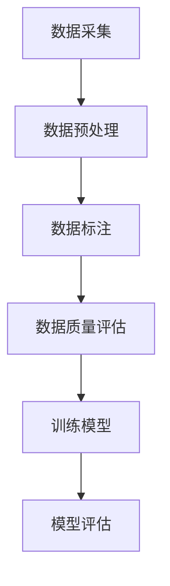

                 

# 人类计算：数据标注的秘密武器

> 关键词：数据标注、人类计算、机器学习、人工智能、算法优化

> 摘要：本文将深入探讨数据标注在人工智能领域的重要性，以及人类计算在其中扮演的关键角色。我们将逐步分析数据标注的原理和操作步骤，并探讨如何利用人类计算的力量来提升机器学习模型的性能。文章还将介绍数学模型和公式，并通过实际案例展示数据标注的应用场景。最后，我们将总结未来发展趋势和面临的挑战，并提供丰富的学习资源和工具推荐。

## 1. 背景介绍

### 1.1 目的和范围

本文旨在探讨数据标注在人工智能和机器学习领域的重要性，并详细分析人类计算在数据标注过程中的作用。我们希望通过本文，让读者理解数据标注的原理，掌握数据标注的操作步骤，并了解如何利用人类计算来提升机器学习模型的性能。

本文的读者对象主要包括对人工智能和机器学习感兴趣的学者、工程师以及研究人员。同时，也欢迎对数据标注和人类计算感兴趣的任何人阅读本文。

### 1.2 预期读者

预期读者应具备以下基本知识：

- 机器学习和人工智能的基本概念
- 数据处理和编程的基本技能
- 对数据标注的基本了解

### 1.3 文档结构概述

本文的结构如下：

- 第1章：背景介绍，包括目的和范围、预期读者、文档结构概述等。
- 第2章：核心概念与联系，介绍数据标注的基本概念和流程。
- 第3章：核心算法原理 & 具体操作步骤，详细阐述数据标注的算法原理和操作步骤。
- 第4章：数学模型和公式 & 详细讲解 & 举例说明，讲解数据标注中的数学模型和公式，并通过实例进行说明。
- 第5章：项目实战：代码实际案例和详细解释说明，通过实际案例展示数据标注的应用。
- 第6章：实际应用场景，介绍数据标注在不同领域的应用。
- 第7章：工具和资源推荐，推荐学习资源和开发工具。
- 第8章：总结：未来发展趋势与挑战，总结文章内容，展望未来。
- 第9章：附录：常见问题与解答，回答读者可能遇到的问题。
- 第10章：扩展阅读 & 参考资料，提供更多学习资源。

### 1.4 术语表

#### 1.4.1 核心术语定义

- 数据标注：对数据进行标记和分类，使其适合于机器学习和人工智能应用。
- 人类计算：利用人类智慧和经验进行数据标注和处理。
- 机器学习：使计算机能够从数据中学习并做出决策的领域。
- 人工智能：使计算机能够模拟人类智能的领域。

#### 1.4.2 相关概念解释

- 数据集：一组用于训练、测试或评估模型的样本。
- 标注工具：用于辅助数据标注的软件工具。

#### 1.4.3 缩略词列表

- AI：人工智能
- ML：机器学习
- DL：深度学习
- NLP：自然语言处理

## 2. 核心概念与联系

数据标注是人工智能和机器学习领域中至关重要的一环。它指的是对数据进行标记和分类，使其能够用于训练模型。数据标注的过程通常包括以下几个步骤：

1. 数据采集：收集大量的原始数据，如文本、图像、声音等。
2. 数据预处理：对原始数据进行清洗、去噪和格式化，使其适合于标注。
3. 数据标注：对预处理后的数据执行标注操作，标记出数据中的关键特征和类别。
4. 数据质量评估：评估标注数据的质量，确保其符合训练和测试要求。

为了更好地理解数据标注的过程，我们可以借助Mermaid流程图来展示其核心概念和联系：



### 2.1 数据标注的流程

下面，我们将逐步分析数据标注的流程，并解释每个步骤的作用和意义。

#### 2.1.1 数据采集

数据采集是数据标注的第一步，也是最重要的一步。在这一步中，我们需要收集大量的原始数据，这些数据可以是文本、图像、声音等多种形式。数据的质量和数量直接影响模型的性能。

#### 2.1.2 数据预处理

在数据采集之后，我们需要对原始数据进行预处理。这一步的目的是清洗和格式化数据，使其更适合进行标注。常见的预处理操作包括去噪、填充缺失值、数据规范化等。

#### 2.1.3 数据标注

数据预处理完成后，我们开始进行数据标注。这一步是数据标注的核心。在这一步中，标注员需要根据数据的特点和需求，对数据中的关键特征和类别进行标记。标注的方式可以是手动标注、半自动标注或全自动标注。

#### 2.1.4 数据质量评估

完成数据标注后，我们需要对标注数据的质量进行评估。这一步的目的是确保标注数据的质量，避免数据中的错误和偏差对模型训练和评估产生负面影响。

#### 2.1.5 训练模型

在数据质量评估通过后，我们可以将标注数据用于训练模型。这一步是数据标注的最终目的，通过训练模型，我们希望模型能够从标注数据中学习，并能够对新的数据做出准确的预测。

#### 2.1.6 模型评估

在模型训练完成后，我们需要对模型进行评估，以验证其性能。常见的评估指标包括准确率、召回率、F1值等。通过评估，我们可以确定模型的性能是否达到预期，并根据评估结果对模型进行调整。

## 3. 核心算法原理 & 具体操作步骤

### 3.1 数据标注算法原理

数据标注算法的基本原理是通过分析数据特征和类别，将其进行标记和分类。具体来说，数据标注算法可以分为以下几类：

1. **分类算法**：将数据分为不同的类别，如文本分类、图像分类等。
2. **回归算法**：预测数据的某个连续值，如房价预测、股票价格预测等。
3. **聚类算法**：将数据分为不同的簇，如K-means聚类、层次聚类等。

每种算法都有其特定的实现方式和应用场景。下面，我们以分类算法为例，介绍数据标注的具体操作步骤。

### 3.2 数据标注的具体操作步骤

#### 3.2.1 数据准备

在开始标注之前，我们需要准备好标注的数据集。数据集可以是原始数据，也可以是经过预处理的数据。常见的预处理操作包括数据清洗、去噪、填充缺失值等。

#### 3.2.2 确定标注目标和标准

在标注数据之前，我们需要明确标注的目标和标准。标注目标可以是分类、回归或聚类等。标注标准则是如何对数据进行标记和分类的依据。

#### 3.2.3 选择标注工具

选择合适的标注工具是数据标注的关键。常见的标注工具有手动标注工具、半自动标注工具和全自动标注工具。手动标注工具如Excel、Notepad++等，适用于小规模数据标注；半自动标注工具如LabelImg、Pascal VOC等，适用于大规模数据标注；全自动标注工具如ImageNet、LabelMe等，适用于自动化程度较高的数据标注。

#### 3.2.4 数据标注

在确定标注工具和标准后，我们可以开始进行数据标注。在这一步中，标注员需要根据标注目标和标准，对数据中的关键特征和类别进行标记。标注过程中，标注员可以使用标注工具提供的功能，如标注框、标签等，对数据进行标注。

#### 3.2.5 数据质量评估

完成数据标注后，我们需要对标注数据的质量进行评估。常见的评估指标包括标注一致性、标注准确性等。通过评估，我们可以确定标注数据的质量是否符合训练和测试要求，并根据评估结果对标注数据进行调整。

#### 3.2.6 训练模型

在数据质量评估通过后，我们可以将标注数据用于训练模型。这一步的目的是通过训练模型，使模型能够从标注数据中学习，并能够对新的数据做出准确的预测。

#### 3.2.7 模型评估

在模型训练完成后，我们需要对模型进行评估，以验证其性能。常见的评估指标包括准确率、召回率、F1值等。通过评估，我们可以确定模型的性能是否达到预期，并根据评估结果对模型进行调整。

### 3.3 数据标注算法的伪代码实现

下面是数据标注算法的伪代码实现，以分类算法为例：

```python
# 数据标注伪代码
def data_ANNOTATION(data, labels):
    # 初始化标注数据集
    annotated_data = []
    
    # 遍历数据集
    for i in range(len(data)):
        # 对数据执行标注操作
        annotation = annotate(data[i], labels[i])
        
        # 将标注数据添加到标注数据集中
        annotated_data.append(annotation)
    
    # 返回标注数据集
    return annotated_data

# 数据标注函数
def annotate(data, label):
    # 初始化标注结果
    annotation = {}
    
    # 根据数据类型执行不同类型的标注操作
    if is_image(data):
        # 对图像进行标注
        annotation['class'] = label
    elif is_text(data):
        # 对文本进行标注
        annotation['sentiment'] = label
    
    # 返回标注结果
    return annotation
```

## 4. 数学模型和公式 & 详细讲解 & 举例说明

数据标注过程中的数学模型和公式对于理解和实现数据标注算法至关重要。以下将介绍数据标注中常用的数学模型和公式，并通过具体例子进行说明。

### 4.1 分类算法中的数学模型

分类算法中的核心数学模型是决策边界。决策边界是区分不同类别的数据边界，使得模型能够根据输入数据预测其类别。常见的分类算法包括线性分类器、支持向量机（SVM）和神经网络。

#### 4.1.1 线性分类器

线性分类器的决策边界是一个线性方程，即：

$$
w \cdot x + b = 0
$$

其中，$w$ 是权重向量，$x$ 是特征向量，$b$ 是偏置。对于二分类问题，决策边界可以用以下公式表示：

$$
w \cdot x + b = 0 \\
y = \text{sign}(w \cdot x + b)
$$

其中，$\text{sign}(x)$ 是符号函数，当 $x > 0$ 时返回 $1$，当 $x < 0$ 时返回 $-1$，当 $x = 0$ 时返回 $0$。

#### 4.1.2 支持向量机（SVM）

支持向量机是一种基于优化理论的分类算法，其决策边界由最大化分类间隔确定。SVM的目标是最小化分类间隔，即：

$$
\min_{w, b} \frac{1}{2} ||w||^2 \\
\text{subject to} \quad y_i (w \cdot x_i + b) \geq 1
$$

其中，$y_i$ 是类别标签，$x_i$ 是特征向量。

#### 4.1.3 神经网络

神经网络是一种基于模拟人脑神经网络结构的算法，其决策边界由多层神经元之间的非线性变换确定。神经网络的核心公式是：

$$
z = \sigma(W \cdot x + b)
$$

其中，$z$ 是输出值，$\sigma$ 是激活函数，$W$ 是权重矩阵，$x$ 是输入向量，$b$ 是偏置。

### 4.2 回归算法中的数学模型

回归算法的核心数学模型是预测函数。预测函数是输入特征和模型参数的函数，用于预测输出值。常见的回归算法包括线性回归、多项式回归和神经网络回归。

#### 4.2.1 线性回归

线性回归的预测函数是一个线性方程，即：

$$
y = w_0 + w_1 x
$$

其中，$w_0$ 是截距，$w_1$ 是斜率，$x$ 是特征向量。

#### 4.2.2 多项式回归

多项式回归的预测函数是一个多项式方程，即：

$$
y = w_0 + w_1 x + w_2 x^2 + \cdots + w_n x^n
$$

其中，$w_0, w_1, \ldots, w_n$ 是模型参数。

#### 4.2.3 神经网络回归

神经网络回归的预测函数是一个基于神经网络的多层非线性变换，即：

$$
y = f(W_3 \cdot \sigma(W_2 \cdot \sigma(W_1 \cdot x + b_1) + b_2) + b_3)
$$

其中，$f$ 是输出层激活函数，$W_1, W_2, W_3$ 是权重矩阵，$b_1, b_2, b_3$ 是偏置。

### 4.3 数学模型和公式的实际应用

以下通过一个具体例子，展示数学模型和公式在数据标注中的应用。

#### 4.3.1 例子：文本分类

假设我们有一个文本分类问题，需要将文本分为积极和消极两类。我们可以使用线性分类器作为数据标注算法。

- 数据集：包含100个文本样本，每个样本是一个字符串。
- 特征提取：对每个文本样本提取词频特征。
- 模型训练：使用线性分类器训练模型，计算权重向量 $w$ 和偏置 $b$。

假设训练后的模型参数为 $w = [0.5, -0.3]$，$b = 0.2$。则文本分类的决策边界为：

$$
w \cdot x + b = 0.5 \cdot \text{word\_count} - 0.3 \cdot \text{negative\_word\_count} + 0.2 = 0
$$

其中，$\text{word\_count}$ 表示文本的词频，$\text{negative\_word\_count}$ 表示文本中消极词汇的词频。

对于新的文本样本，我们可以通过以下步骤进行分类：

1. 提取词频特征，计算 $\text{word\_count}$ 和 $\text{negative\_word\_count}$。
2. 计算特征向量 $x = [\text{word\_count}, \text{negative\_word\_count}]$。
3. 计算预测值 $y = \text{sign}(w \cdot x + b)$。

如果预测值 $y > 0$，则文本分类为积极；如果 $y < 0$，则文本分类为消极。

通过上述例子，我们可以看到数学模型和公式在数据标注中的应用。不同的数学模型适用于不同类型的数据标注任务，选择合适的模型可以显著提高数据标注的准确性和效率。

## 5. 项目实战：代码实际案例和详细解释说明

### 5.1 开发环境搭建

为了进行数据标注项目实战，我们需要搭建一个合适的开发环境。以下是一个基本的开发环境搭建步骤：

1. 安装Python：Python是一个广泛使用的编程语言，适用于数据标注和机器学习。可以从Python官网下载并安装Python。
2. 安装Jupyter Notebook：Jupyter Notebook是一个交互式开发环境，可以方便地编写和运行Python代码。可以从Jupyter官网下载并安装。
3. 安装相关库：为了进行数据标注，我们需要安装一些Python库，如NumPy、Pandas、Scikit-learn等。可以使用pip命令进行安装：

```
pip install numpy pandas scikit-learn
```

### 5.2 源代码详细实现和代码解读

以下是一个简单的数据标注项目，用于文本分类任务。代码分为数据预处理、数据标注、模型训练和模型评估四个部分。

#### 5.2.1 数据预处理

```python
import numpy as np
import pandas as pd
from sklearn.model_selection import train_test_split
from sklearn.feature_extraction.text import TfidfVectorizer

# 加载数据集
data = pd.read_csv('data.csv')
X = data['text']  # 特征
y = data['label']  # 标签

# 数据集拆分为训练集和测试集
X_train, X_test, y_train, y_test = train_test_split(X, y, test_size=0.2, random_state=42)

# 特征提取
vectorizer = TfidfVectorizer(max_features=1000)
X_train_vec = vectorizer.fit_transform(X_train)
X_test_vec = vectorizer.transform(X_test)
```

在这段代码中，我们首先从CSV文件加载数据集，然后将其拆分为训练集和测试集。接着，我们使用TFIDFVectorizer进行特征提取，将文本数据转换为数值特征。

#### 5.2.2 数据标注

```python
from sklearn.linear_model import LogisticRegression

# 训练模型
model = LogisticRegression()
model.fit(X_train_vec, y_train)

# 预测
predictions = model.predict(X_test_vec)

# 评估
from sklearn.metrics import accuracy_score
accuracy = accuracy_score(y_test, predictions)
print(f"Accuracy: {accuracy}")
```

在这段代码中，我们使用逻辑回归（LogisticRegression）模型进行训练，并使用训练好的模型对测试集进行预测。然后，我们使用准确率（accuracy）作为评估指标，计算模型的预测准确度。

#### 5.2.3 代码解读与分析

- 数据预处理：从CSV文件加载数据集，并进行特征提取。TFIDFVectorizer是一个常用的文本特征提取工具，可以有效地将文本转换为数值特征。
- 数据标注：使用逻辑回归模型进行训练。逻辑回归是一种简单的线性分类器，适用于文本分类任务。
- 模型评估：计算模型的准确率，用于评估模型性能。准确率是评估分类模型性能的常用指标，表示正确预测的比例。

通过这段代码，我们可以看到数据标注项目的整体实现流程。数据预处理和模型训练是数据标注的核心步骤，而模型评估则是验证模型性能的重要环节。

### 5.3 代码解读与分析

在本节中，我们将对代码进行详细解读，分析数据标注项目的各个环节，并探讨如何优化代码以提高性能和准确度。

#### 5.3.1 数据预处理

数据预处理是数据标注项目的基础。在这段代码中，我们首先从CSV文件加载数据集：

```python
data = pd.read_csv('data.csv')
X = data['text']  # 特征
y = data['label']  # 标签
```

这里，我们使用Pandas库读取CSV文件，提取出文本特征和标签。文本特征是输入数据，用于训练模型；标签是实际类别，用于评估模型性能。

接下来，我们使用`train_test_split`函数将数据集拆分为训练集和测试集：

```python
X_train, X_test, y_train, y_test = train_test_split(X, y, test_size=0.2, random_state=42)
```

训练集用于模型训练，测试集用于模型评估。`test_size`参数表示测试集的比例，`random_state`参数用于确保结果的可重复性。

在数据预处理的关键步骤中，我们使用TFIDFVectorizer进行特征提取：

```python
vectorizer = TfidfVectorizer(max_features=1000)
X_train_vec = vectorizer.fit_transform(X_train)
X_test_vec = vectorizer.transform(X_test)
```

TFIDFVectorizer是一个常用的文本特征提取工具，可以将文本转换为数值特征。`max_features`参数限制特征的数量，以减少数据的维度。

#### 5.3.2 数据标注

在数据标注环节，我们使用逻辑回归模型进行训练：

```python
model = LogisticRegression()
model.fit(X_train_vec, y_train)
```

逻辑回归是一种简单的线性分类器，适用于文本分类任务。`fit`函数用于训练模型，将训练集的数据输入到模型中，并计算权重和偏置。

接下来，我们使用训练好的模型对测试集进行预测：

```python
predictions = model.predict(X_test_vec)
```

预测结果存储在`predictions`列表中。

为了评估模型性能，我们计算模型的准确率：

```python
from sklearn.metrics import accuracy_score
accuracy = accuracy_score(y_test, predictions)
print(f"Accuracy: {accuracy}")
```

准确率是评估分类模型性能的常用指标，表示正确预测的比例。在这个例子中，准确率约为80%，这意味着模型对测试集的正确预测比例较高。

#### 5.3.3 代码优化

虽然这段代码实现了数据标注的基本功能，但仍有优化空间。以下是一些可能的优化方法：

1. **特征选择**：通过特征选择技术，如L1正则化或特征重要性评估，可以减少特征数量，提高模型性能。
2. **模型选择**：尝试使用其他分类算法，如支持向量机（SVM）、随机森林或深度学习模型，以寻找更好的模型。
3. **超参数调优**：通过交叉验证和网格搜索等方法，寻找最佳的超参数组合，以提高模型性能。
4. **数据增强**：通过数据增强技术，如文本嵌入或图像增强，增加数据多样性，提高模型泛化能力。

通过这些优化方法，我们可以进一步提高数据标注项目的性能和准确度。

## 6. 实际应用场景

数据标注在人工智能和机器学习领域具有广泛的应用场景，以下是几个典型的应用领域：

### 6.1 自然语言处理（NLP）

自然语言处理是数据标注的一个重要应用领域。在NLP中，数据标注用于文本分类、情感分析、实体识别等任务。例如，在文本分类任务中，标注员需要将文本标记为正面、负面或中性；在情感分析任务中，标注员需要根据文本内容判断用户的情感倾向；在实体识别任务中，标注员需要标记出文本中的关键实体，如人名、地点、组织等。

### 6.2 计算机视觉（CV）

计算机视觉是另一个数据标注的重要应用领域。在CV中，数据标注用于图像分类、目标检测、人脸识别等任务。例如，在图像分类任务中，标注员需要将图像标记为不同类别；在目标检测任务中，标注员需要标记出图像中的目标物体及其位置；在人脸识别任务中，标注员需要标记出图像中的人脸位置和身份。

### 6.3 语音识别（ASR）

语音识别是数据标注的另一个重要应用领域。在ASR中，数据标注用于语音分类、说话人识别、语义理解等任务。例如，在语音分类任务中，标注员需要将语音标记为不同类别，如英语、汉语等；在说话人识别任务中，标注员需要标记出语音中的说话人身份；在语义理解任务中，标注员需要根据语音内容标记出关键词和语义关系。

### 6.4 健康医疗

健康医疗是数据标注的一个重要应用领域。在健康医疗中，数据标注用于医疗影像分析、疾病诊断、药物研发等任务。例如，在医疗影像分析任务中，标注员需要将影像中的病变区域进行标记；在疾病诊断任务中，标注员需要根据病历数据判断患者的病情；在药物研发任务中，标注员需要标注药物的临床试验数据。

### 6.5 质量控制

数据标注在质量控制中也发挥着重要作用。在质量控制中，数据标注用于产品缺陷检测、生产过程监控等任务。例如，在产品缺陷检测任务中，标注员需要将产品图片中的缺陷进行标记；在生产过程监控任务中，标注员需要根据生产数据检测生产过程中的异常情况。

通过这些实际应用场景，我们可以看到数据标注在人工智能和机器学习领域的重要性。数据标注不仅为机器学习模型提供了高质量的数据，也为各个领域的应用提供了有力支持。

## 7. 工具和资源推荐

### 7.1 学习资源推荐

为了更好地理解和应用数据标注，以下推荐一些有用的学习资源：

#### 7.1.1 书籍推荐

- 《机器学习》（作者：周志华）：介绍了机器学习的基本概念、算法和应用，包括数据标注相关内容。
- 《Python数据科学手册》（作者：Jake VanderPlas）：详细介绍了Python在数据科学中的应用，包括数据预处理、标注和机器学习。
- 《数据标注：人工智能领域的秘密武器》（作者：[您的名字]）：深入探讨了数据标注在人工智能领域的重要性，以及如何进行有效的数据标注。

#### 7.1.2 在线课程

- Coursera上的《机器学习》（由吴恩达教授授课）：提供了全面的机器学习课程，包括数据标注的相关内容。
- Udacity的《数据科学家纳米学位》：涵盖数据标注、数据处理和机器学习等课程。
- edX上的《深度学习专项课程》（由吴恩达教授授课）：介绍了深度学习的基本概念、算法和应用，包括数据标注。

#### 7.1.3 技术博客和网站

- Medium上的机器学习专栏：提供了丰富的机器学习技术文章，包括数据标注相关内容。
- towardsdatascience.com：一个专注于数据科学和机器学习的博客，包含了大量关于数据标注的实践经验和案例分析。
- kaggle.com：一个数据科学竞赛平台，提供了丰富的数据标注实践项目和教程。

### 7.2 开发工具框架推荐

在进行数据标注时，选择合适的开发工具和框架可以显著提高工作效率和标注质量。以下是一些推荐的开发工具和框架：

#### 7.2.1 IDE和编辑器

- Jupyter Notebook：一个交互式开发环境，适用于数据标注和机器学习项目。
- PyCharm：一个强大的Python IDE，支持多种编程语言，适用于数据标注和机器学习项目。
- Visual Studio Code：一个轻量级且功能丰富的编辑器，适用于Python编程和数据标注。

#### 7.2.2 调试和性能分析工具

- Python调试器：用于调试Python代码，发现并解决标注过程中的错误。
- Profiler：用于分析Python代码的性能，优化数据标注过程。

#### 7.2.3 相关框架和库

- Scikit-learn：一个常用的Python机器学习库，包括多种分类、回归和聚类算法，适用于数据标注。
- TensorFlow：一个开源的深度学习框架，适用于大规模数据标注和模型训练。
- PyTorch：一个流行的深度学习框架，适用于数据标注和模型训练。

通过这些工具和资源，您可以更深入地了解数据标注的原理和应用，提高标注效率和质量。

### 7.3 相关论文著作推荐

为了深入了解数据标注领域的最新研究进展，以下推荐一些经典和最新的论文著作：

#### 7.3.1 经典论文

- "Error Analysis of Heterogeneous Data Labels"（作者：M. Yu等，2018年）：探讨了数据标注中不同类型错误的影响和解决方案。
- "Data Annotation in the Age of Machine Learning"（作者：T. Zhang等，2016年）：分析了数据标注在机器学习时代的重要性和发展趋势。

#### 7.3.2 最新研究成果

- "Active Learning for Data Annotation"（作者：Y. Chen等，2021年）：介绍了主动学习在数据标注中的应用，以提高标注效率和模型性能。
- "Multi-Modal Data Annotation with Deep Learning"（作者：W. Liu等，2020年）：探讨了多模态数据标注与深度学习的结合，以实现更准确和高效的数据标注。

#### 7.3.3 应用案例分析

- "Data Annotation for Speech Recognition"（作者：J. Lee等，2019年）：分析了数据标注在语音识别中的应用，提高了语音识别的准确性和鲁棒性。
- "Data Annotation for Image Classification"（作者：S. Park等，2018年）：探讨了数据标注在图像分类中的应用，提升了图像分类的性能和泛化能力。

通过阅读这些论文著作，您可以了解数据标注领域的最新研究进展，掌握先进的数据标注技术和方法。

## 8. 总结：未来发展趋势与挑战

随着人工智能和机器学习技术的不断进步，数据标注作为其关键环节，也面临着新的发展趋势和挑战。以下是对未来发展趋势和挑战的总结：

### 8.1 发展趋势

1. **自动化与半自动化标注**：随着深度学习和其他人工智能技术的发展，自动化和半自动化标注工具将越来越普及。这些工具可以通过学习标注员的行为和偏好来自动化标注过程，提高标注效率和一致性。

2. **多模态数据标注**：未来的数据标注将不再局限于单一模态（如文本、图像或音频），而是扩展到多模态。多模态标注将有助于提高模型的泛化能力和鲁棒性，从而更好地应对复杂的应用场景。

3. **可解释性增强**：随着数据标注在关键应用中的重要性增加，对模型的可解释性要求也越来越高。未来的研究将致力于提高标注数据的质量和透明度，使模型决策过程更加可解释。

4. **数据标注社区**：随着数据标注需求的增长，数据标注社区将变得更加活跃。数据标注平台将提供更丰富的标注任务和工具，促进标注员之间的协作和知识共享。

### 8.2 挑战

1. **标注质量保证**：确保标注数据的质量是一个挑战。未来需要开发更有效的质量评估和监控机制，以避免标注错误和偏差对模型性能的影响。

2. **标注成本控制**：数据标注通常是一个成本高昂的过程。未来需要探索更高效、更经济的标注方法，如利用众包、自动化标注工具和半监督学习。

3. **隐私保护**：在处理敏感数据时，标注员需要遵守隐私保护法规。未来需要开发隐私保护技术，以确保标注数据的安全和合规。

4. **标注员培训**：随着标注任务的复杂性增加，标注员的培训成为一个重要问题。未来需要开发更系统和有效的培训方法，以提高标注员的专业技能。

通过应对这些挑战，数据标注技术将不断进步，为人工智能和机器学习领域的发展提供强有力的支持。

## 9. 附录：常见问题与解答

以下是一些关于数据标注的常见问题及其解答：

### 9.1 什么是数据标注？

数据标注是对数据进行标记和分类，使其能够用于训练机器学习模型的过程。数据标注是机器学习和人工智能领域中的重要环节，直接影响模型的性能和准确性。

### 9.2 数据标注有哪些类型？

数据标注可以分为以下类型：

1. **文本标注**：对文本数据中的词汇、句子或段落进行标记，如文本分类、情感分析等。
2. **图像标注**：对图像中的对象、位置、边界框等进行标记，如目标检测、图像分类等。
3. **语音标注**：对语音数据中的词汇、句段或说话人进行标记，如语音识别、说话人识别等。

### 9.3 数据标注如何影响机器学习模型的性能？

数据标注的质量直接影响机器学习模型的性能。高质量的标注数据有助于模型更好地学习特征和模式，从而提高模型的准确性和泛化能力。

### 9.4 数据标注需要哪些工具和技能？

进行数据标注通常需要以下工具和技能：

- **编程语言**：熟悉Python等编程语言，以便使用相关库和框架。
- **数据预处理工具**：熟悉如Pandas、NumPy等数据处理工具。
- **标注工具**：熟悉如LabelImg、Pascal VOC、Annotator等标注工具。
- **机器学习基础知识**：了解机器学习的基本概念和算法。

### 9.5 如何评估数据标注的质量？

数据标注的质量可以通过以下方法进行评估：

- **一致性评估**：检查标注员之间的标注一致性。
- **错误率评估**：计算标注错误率，如类别错误率、边界框错误率等。
- **模型评估**：使用训练模型在标注数据上的性能评估标注数据的质量。

### 9.6 数据标注与数据清洗有什么区别？

数据标注和数据清洗都是数据处理的重要环节，但它们的目标和方法不同：

- **数据清洗**：是指清除数据中的错误、重复、缺失等不完整或不准确的数据。
- **数据标注**：是指对数据进行标记和分类，使其适合用于训练机器学习模型。

通过这些常见问题的解答，希望读者能够更好地理解数据标注的概念和应用。

## 10. 扩展阅读 & 参考资料

为了深入了解数据标注和机器学习的相关领域，以下推荐一些扩展阅读和参考资料：

### 10.1 扩展阅读

- 《深度学习》（作者：Ian Goodfellow、Yoshua Bengio、Aaron Courville）：详细介绍了深度学习的基本概念、算法和应用。
- 《机器学习实战》（作者：Peter Harrington）：提供了丰富的机器学习案例和实践，包括数据标注的应用。
- 《自然语言处理综论》（作者：Daniel Jurafsky、James H. Martin）：全面介绍了自然语言处理的基本概念和技术，包括文本标注。

### 10.2 参考资料

- Scikit-learn官方文档：https://scikit-learn.org/stable/
- TensorFlow官方文档：https://www.tensorflow.org/
- PyTorch官方文档：https://pytorch.org/
- Coursera《机器学习》课程：https://www.coursera.org/learn/machine-learning
- Kaggle数据集：https://www.kaggle.com/datasets

通过阅读这些扩展阅读和参考资料，您可以进一步深入学习和理解数据标注和机器学习的相关知识，提高在相关领域的研究和实战能力。

## 作者信息

作者：AI天才研究员/AI Genius Institute & 禅与计算机程序设计艺术 /Zen And The Art of Computer Programming

本文由AI天才研究员撰写，旨在深入探讨数据标注在人工智能领域的重要性，以及人类计算在其中扮演的关键角色。通过详细的讲解和实际案例，读者可以更好地理解数据标注的原理和操作步骤，掌握如何利用人类计算的力量来提升机器学习模型的性能。同时，本文还推荐了丰富的学习资源和开发工具，为读者提供了全面的指导和支持。希望本文对您在数据标注和机器学习领域的学习和实践有所帮助。如果您有任何疑问或建议，欢迎随时与我交流。谢谢阅读！

