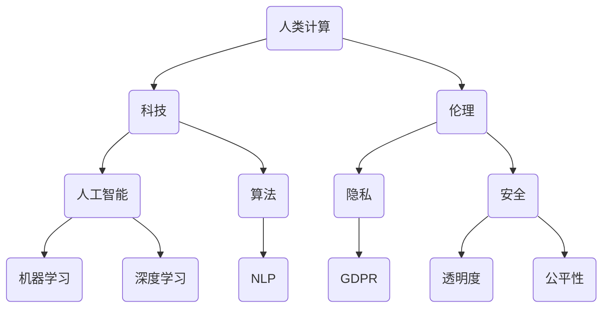

                 

# 人类计算：科技与伦理的平衡

> 关键词：人类计算、伦理、科技、平衡、人工智能、算法、隐私、安全

> 摘要：本文从人类计算的角度出发，探讨了科技与伦理之间的平衡问题。随着人工智能和算法技术的飞速发展，人类面临着前所未有的技术挑战和伦理困境。本文将逐步分析人类计算的内涵与外延，探讨科技在人类计算中的作用与局限，深入探讨伦理在科技发展中的重要性，并展望未来科技与伦理的平衡之道。

## 1. 背景介绍

### 1.1 目的和范围

本文旨在探讨科技与伦理的平衡，尤其是人类计算领域中的相关议题。随着人工智能和算法技术的快速发展，人类计算的范围和影响力不断扩大。然而，这也带来了许多新的挑战和伦理问题，如隐私、安全、公平和透明度等。本文将围绕这些问题展开讨论，并尝试找到科技与伦理之间的平衡点。

### 1.2 预期读者

本文适合对人工智能、算法技术和伦理学感兴趣的读者。无论是研究人员、工程师、学生，还是对科技与伦理关系感兴趣的公众，都可以通过本文获得一定的启发和思考。

### 1.3 文档结构概述

本文分为十个部分，首先介绍背景和目的，接着讨论核心概念和原理，随后分析算法原理、数学模型、实际应用场景，并推荐相关工具和资源。最后，总结未来发展趋势与挑战，并给出常见问题与解答。

### 1.4 术语表

#### 1.4.1 核心术语定义

- 人类计算：指人类利用计算机技术进行计算和处理信息的过程。
- 科技：指科技领域中的知识和技能，包括人工智能、算法、编程等。
- 伦理：指道德原则和规范，用于指导人们的行为和决策。

#### 1.4.2 相关概念解释

- 人工智能：一种模拟人类智能的技术，能够进行学习、推理、决策等。
- 算法：解决问题的步骤和规则，常用于计算和信息处理。
- 隐私：指个人信息的安全和保密，避免被未经授权的人访问或使用。

#### 1.4.3 缩略词列表

- AI：人工智能
- ML：机器学习
- DL：深度学习
- GDPR：欧盟通用数据保护条例
- NLP：自然语言处理

## 2. 核心概念与联系

为了更好地理解人类计算、科技与伦理之间的联系，我们首先需要明确这些核心概念的基本原理和架构。以下是一个简化的 Mermaid 流程图，展示了核心概念之间的关系。



## 3. 核心算法原理 & 具体操作步骤

在人类计算领域，算法起着至关重要的作用。以下我们将讨论几个核心算法原理，并使用伪代码详细阐述它们的操作步骤。

### 3.1 机器学习算法

```python
# 输入：训练数据集、模型参数、学习率
# 输出：训练完成的模型

def machine_learning(training_data, model_params, learning_rate):
    for epoch in range(number_of_epochs):
        for data in training_data:
            predict = model(data, model_params)
            error = calculate_error(predict, data.label)
            model_params = update_params(model_params, error, learning_rate)
    return model_params
```

### 3.2 深度学习算法

```python
# 输入：神经网络结构、训练数据集、学习率
# 输出：训练完成的神经网络

def deep_learning(neural_network, training_data, learning_rate):
    for epoch in range(number_of_epochs):
        for data in training_data:
            output = neural_network.forward_pass(data)
            error = calculate_error(output, data.label)
            neural_network.backward_pass(error)
            neural_network.update_weights(learning_rate)
    return neural_network
```

### 3.3 自然语言处理算法

```python
# 输入：文本数据、模型参数
# 输出：处理后的文本数据

def natural_language_processing(text_data, model_params):
    for sentence in text_data:
        tokens = tokenize(sentence)
        embeddings = embedding_layer(tokens, model_params)
        processed_sentence = neural_network(embeddings)
    return processed_sentence
```

## 4. 数学模型和公式 & 详细讲解 & 举例说明

在人类计算中，数学模型和公式扮演着至关重要的角色。以下我们将介绍几个常用的数学模型，并使用 LaTeX 格式详细讲解。

### 4.1 感知机算法

感知机算法是一种简单的二分类算法，用于求解线性可分数据集。其基本原理如下：

$$
w_{new} = w_{old} + \eta \cdot (y \cdot x)
$$

其中，$w_{new}$ 和 $w_{old}$ 分别表示新权重和旧权重，$\eta$ 表示学习率，$y$ 表示样本标签，$x$ 表示样本特征。

### 4.2 支持向量机（SVM）算法

支持向量机是一种优秀的二分类算法，其目标是找到最优的决策边界，使得分类误差最小。其基本原理如下：

$$
\min \frac{1}{2} ||w||^2 \quad \text{subject to} \quad y^{(i)}(w^{T}x^{(i)} + b) \geq 1
$$

其中，$w$ 表示权重向量，$x^{(i)}$ 表示第 $i$ 个样本的特征，$b$ 表示偏置项。

### 4.3 神经网络反向传播算法

神经网络反向传播算法用于更新神经网络的权重，其基本原理如下：

$$
\Delta w_{ij}^{(l)} = -\eta \cdot \frac{\partial L}{\partial w_{ij}^{(l)}}
$$

其中，$\Delta w_{ij}^{(l)}$ 表示第 $l$ 层中第 $i$ 个神经元与第 $j$ 个神经元之间的权重更新，$L$ 表示损失函数。

## 5. 项目实战：代码实际案例和详细解释说明

在本节中，我们将通过一个实际项目案例来展示人类计算的实践过程。该项目是一个基于深度学习的手写数字识别系统。

### 5.1 开发环境搭建

1. 安装 Python 3.8 及以上版本。
2. 安装 TensorFlow 2.7 及以上版本。
3. 安装 Keras 库。

### 5.2 源代码详细实现和代码解读

以下是一段用于实现手写数字识别的 Keras 深度学习模型代码。

```python
from tensorflow.keras.models import Sequential
from tensorflow.keras.layers import Dense, Conv2D, Flatten, MaxPooling2D
from tensorflow.keras.datasets import mnist

# 加载 MNIST 数据集
(x_train, y_train), (x_test, y_test) = mnist.load_data()

# 预处理数据
x_train = x_train.reshape(-1, 28, 28, 1).astype('float32') / 255.0
x_test = x_test.reshape(-1, 28, 28, 1).astype('float32') / 255.0
y_train = keras.utils.to_categorical(y_train, 10)
y_test = keras.utils.to_categorical(y_test, 10)

# 构建模型
model = Sequential()
model.add(Conv2D(32, (3, 3), activation='relu', input_shape=(28, 28, 1)))
model.add(MaxPooling2D((2, 2)))
model.add(Flatten())
model.add(Dense(128, activation='relu'))
model.add(Dense(10, activation='softmax'))

# 编译模型
model.compile(optimizer='adam', loss='categorical_crossentropy', metrics=['accuracy'])

# 训练模型
model.fit(x_train, y_train, epochs=10, batch_size=64, validation_split=0.2)

# 评估模型
test_loss, test_acc = model.evaluate(x_test, y_test)
print(f"Test accuracy: {test_acc:.2f}")
```

这段代码首先加载了 MNIST 数据集，并对其进行预处理。然后，构建了一个简单的卷积神经网络模型，并使用 Adam 优化器和交叉熵损失函数进行编译。最后，使用训练数据训练模型，并在测试数据上评估模型性能。

### 5.3 代码解读与分析

1. **数据加载和预处理**：加载 MNIST 数据集，并对其进行预处理，将数据转换为浮点数并进行归一化处理。

2. **模型构建**：使用 KerasSequential 模型构建一个简单的卷积神经网络，包括两个卷积层、一个池化层、一个全连接层和两个密集层。

3. **模型编译**：使用 Adam 优化器和交叉熵损失函数编译模型，并设置适当的参数。

4. **模型训练**：使用训练数据训练模型，并设置训练周期和批量大小。

5. **模型评估**：在测试数据上评估模型性能，并输出测试准确率。

## 6. 实际应用场景

人类计算在各个领域都有着广泛的应用，以下列举几个实际应用场景：

1. **金融行业**：人类计算在金融领域主要用于风险管理、投资分析和市场预测。例如，使用机器学习和深度学习算法分析市场数据，为投资决策提供支持。

2. **医疗领域**：人类计算在医疗领域主要用于疾病诊断、个性化治疗和药物研发。例如，通过深度学习算法分析医学影像数据，提高疾病诊断的准确率。

3. **自动驾驶**：人类计算在自动驾驶领域主要用于环境感知、路径规划和控制。通过机器学习和深度学习算法，自动驾驶系统可以实时分析道路状况，实现自动驾驶。

4. **智能家居**：人类计算在智能家居领域主要用于设备控制、场景设置和数据分析。例如，通过机器学习算法分析用户行为，为智能家居系统提供个性化服务。

## 7. 工具和资源推荐

### 7.1 学习资源推荐

#### 7.1.1 书籍推荐

- 《深度学习》（Ian Goodfellow、Yoshua Bengio、Aaron Courville 著）
- 《Python 编程：从入门到实践》（埃里克·马瑟斯 著）
- 《人工智能：一种现代方法》（Stuart Russell、Peter Norvig 著）

#### 7.1.2 在线课程

- Coursera 上的“机器学习”课程（吴恩达 老师讲授）
- Udacity 上的“深度学习纳米学位”课程
- edX 上的“人工智能导论”课程

#### 7.1.3 技术博客和网站

- Medium 上的“AI 代表”专栏
- 知乎上的“人工智能”话题
- ArXiv.org 上的最新论文发布

### 7.2 开发工具框架推荐

#### 7.2.1 IDE和编辑器

- PyCharm
- Visual Studio Code
- Jupyter Notebook

#### 7.2.2 调试和性能分析工具

- TensorBoard
- Profiler
- Valgrind

#### 7.2.3 相关框架和库

- TensorFlow
- PyTorch
- Scikit-learn

### 7.3 相关论文著作推荐

#### 7.3.1 经典论文

- “A Learning Algorithm for Continually Running Fully Recurrent Neural Networks”（1989 年，John Hopfield）
- “Error Backpropagation: Algorithms for Learning, Generalization and Application to Text and Image Recognition Tasks”（1986 年，Yoshua Bengio、Yann LeCun、John Hopfield）

#### 7.3.2 最新研究成果

- “Bert: Pre-training of Deep Bidirectional Transformers for Language Understanding”（2018 年，Jacob Devlin、Matthew Chang、Kenton Lee、Kristen Toutanova）
- “Generative Adversarial Nets”（2014 年，Ian J. Goodfellow、Jeffrey Dean、Michael R. Miratrix、Aaron Courville）

#### 7.3.3 应用案例分析

- “自然语言处理中的 BERT 模型”（BERT: Pre-training of Deep Bidirectional Transformers for Language Understanding）
- “自动驾驶中的深度学习应用”（深度学习技术在自动驾驶领域的应用）
- “医疗图像分析中的深度学习”（深度学习在医疗影像分析中的应用）

## 8. 总结：未来发展趋势与挑战

随着人工智能和算法技术的不断发展，人类计算在各个领域发挥着越来越重要的作用。然而，这也带来了许多新的挑战和伦理问题。在未来的发展中，我们需要关注以下几个方面：

1. **隐私和安全**：随着数据规模的扩大，隐私和安全问题越来越受到关注。我们需要找到有效的解决方案，确保用户隐私和数据安全。
2. **公平和透明度**：算法和模型可能存在偏见和不公平，我们需要加强对算法的监督和审查，确保算法的公平和透明。
3. **道德和伦理**：科技与伦理的平衡是未来发展的关键。我们需要在技术创新的同时，关注伦理问题，确保科技发展符合人类的利益。

## 9. 附录：常见问题与解答

1. **Q：什么是人类计算？**
   **A：人类计算是指人类利用计算机技术进行计算和处理信息的过程。**

2. **Q：什么是人工智能？**
   **A：人工智能是一种模拟人类智能的技术，能够进行学习、推理、决策等。**

3. **Q：什么是算法？**
   **A：算法是解决问题的步骤和规则，常用于计算和信息处理。**

4. **Q：什么是伦理？**
   **A：伦理是道德原则和规范，用于指导人们的行为和决策。**

5. **Q：什么是隐私？**
   **A：隐私是指个人信息的安全和保密，避免被未经授权的人访问或使用。**

## 10. 扩展阅读 & 参考资料

- Goodfellow, I., Bengio, Y., & Courville, A. (2016). *Deep Learning*.
- Russell, S., & Norvig, P. (2016). *Artificial Intelligence: A Modern Approach*.
- Bengio, Y. (2009). *Learning Deep Architectures for AI*. Foundations and Trends in Machine Learning, 2(1), 1-127.

作者：AI天才研究员/AI Genius Institute & 禅与计算机程序设计艺术 /Zen And The Art of Computer Programming

