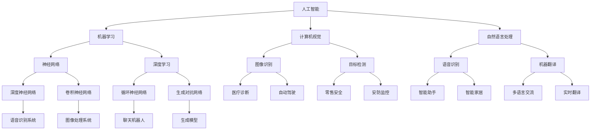

                 

## 人类认知：AI 时代的进步

> **关键词**：人工智能、认知科学、认知建模、人机交互、神经科学、进化算法、机器学习、神经网络、深度学习
>
> **摘要**：本文旨在探讨人工智能（AI）时代背景下，人类认知能力的提升和演变。通过分析人工智能的核心技术、认知科学的理论基础以及人机交互的应用场景，我们将探讨AI如何推动人类认知的进步，以及未来可能面临的挑战和机遇。

### 1. 背景介绍

#### 1.1 目的和范围

本文旨在为读者提供一个全面且深入的视角，以理解人工智能（AI）时代对人类认知的影响。我们不仅将探讨人工智能的核心技术，如机器学习、神经网络和深度学习，还将深入分析认知科学的相关理论，包括认知建模和人机交互。通过这种综合性的探讨，我们希望能够揭示AI如何不仅改变我们的生活方式，还影响我们的认知过程。

本文的范围涵盖了以下几个主要方面：

1. **人工智能技术**：介绍AI的基本概念、历史发展和当前主流技术，包括机器学习、神经网络和深度学习。
2. **认知科学理论基础**：探讨人类认知的基本原理、认知过程的模型化以及认知科学与神经科学的联系。
3. **人机交互**：分析人机交互在AI时代的重要性，包括交互界面、用户体验和人类认知的适应性。
4. **AI对认知的影响**：探讨AI如何提高人类的认知能力、改变思维模式以及促进创新。
5. **未来挑战与机遇**：讨论AI时代人类认知可能面临的挑战和未来的发展方向。

#### 1.2 预期读者

本文面向对人工智能和认知科学有兴趣的读者，特别是以下几类人群：

1. **计算机科学家和程序员**：希望通过了解AI对认知的影响来拓宽技术视野。
2. **认知科学家和心理学者**：希望深入了解AI技术在认知研究中的应用。
3. **人工智能从业者**：希望在专业领域内了解最新的技术进展和未来趋势。
4. **广大技术爱好者和科研人员**：对人工智能与认知科学的交叉领域感兴趣的读者。

#### 1.3 文档结构概述

本文将按照以下结构进行撰写：

1. **引言**：介绍本文的背景、目的和预期读者。
2. **核心概念与联系**：通过Mermaid流程图展示人工智能、认知科学和人机交互之间的联系。
3. **核心算法原理与操作步骤**：详细讲解机器学习、神经网络和深度学习的算法原理。
4. **数学模型与公式**：介绍相关的数学模型和公式，并通过具体例子进行说明。
5. **项目实战**：通过实际代码案例展示AI技术的应用。
6. **实际应用场景**：分析AI在不同领域中的应用案例。
7. **工具和资源推荐**：推荐相关的学习资源和开发工具。
8. **总结**：总结AI时代人类认知的进步与挑战。
9. **附录**：提供常见问题的解答。
10. **扩展阅读**：推荐进一步阅读的文献和资料。

#### 1.4 术语表

在本文中，我们将使用以下术语：

#### 1.4.1 核心术语定义

- **人工智能（AI）**：指能够模拟、扩展和辅助人类智能的技术系统。
- **认知科学**：研究人类认知过程和机制的学科。
- **机器学习**：使计算机通过数据和经验进行学习和预测的方法。
- **神经网络**：模拟生物神经系统的计算模型。
- **深度学习**：基于多层神经网络的学习方法。

#### 1.4.2 相关概念解释

- **人机交互**：研究人与计算机系统之间如何有效沟通和互动的领域。
- **认知建模**：建立数学模型来模拟人类认知过程的方法。

#### 1.4.3 缩略词列表

- **AI**：人工智能
- **ML**：机器学习
- **NN**：神经网络
- **DL**：深度学习

### 2. 核心概念与联系

在理解AI如何影响人类认知之前，我们需要首先明确人工智能、认知科学和人机交互这三个核心概念，并展示它们之间的内在联系。

#### 2.1 人工智能（AI）

人工智能是指通过模拟人类智能行为，使计算机系统具备智能特性的技术。它涵盖了多个子领域，包括机器学习、计算机视觉、自然语言处理等。

#### 2.2 认知科学

认知科学是研究人类认知过程的学科，涉及心理学、神经科学、认知心理学等多个领域。认知科学的目标是理解人类思维、学习、记忆、感知等认知功能。

#### 2.3 人机交互

人机交互是研究人与计算机系统之间如何有效沟通和互动的领域。它关注用户界面设计、用户体验、交互方式等多个方面。

#### 2.4 核心概念之间的联系

- **人工智能与认知科学**：人工智能技术的许多发展都受到了认知科学理论的启发。例如，神经网络模型受到了生物神经系统的启发，机器学习算法中的优化方法也与认知过程的相似性密切相关。
- **人工智能与人机交互**：人工智能技术为人机交互提供了新的可能性，如通过自然语言处理技术实现更加智能的语音交互系统，通过计算机视觉实现更加直观的图形用户界面。
- **认知科学与人机交互**：认知科学为人机交互提供了理论基础，指导我们设计出更符合人类认知习惯的交互系统。

#### 2.5 Mermaid流程图

以下是一个简化的Mermaid流程图，展示人工智能、认知科学和人机交互之间的核心联系：



通过这个流程图，我们可以清晰地看到各个子领域之间的相互关联，以及它们在AI、认知科学和人机交互中的应用。

### 3. 核心算法原理 & 具体操作步骤

在本节中，我们将深入探讨人工智能的核心算法原理，包括机器学习、神经网络和深度学习，并通过伪代码详细阐述这些算法的基本操作步骤。

#### 3.1 机器学习算法

机器学习是指通过数据和经验使计算机具备学习能力的学科。以下是机器学习的基本操作步骤：

```python
# 伪代码：机器学习算法的基本操作步骤

# 步骤1：数据预处理
def preprocess_data(data):
    # 数据清洗、归一化、特征提取等操作
    processed_data = ...
    return processed_data

# 步骤2：选择合适的算法
def select_algorithm(problem_type):
    # 根据问题类型选择合适的机器学习算法
    algorithm = ...
    return algorithm

# 步骤3：训练模型
def train_model(algorithm, training_data):
    # 使用选定的算法对训练数据集进行训练
    model = algorithm.train(training_data)
    return model

# 步骤4：评估模型
def evaluate_model(model, validation_data):
    # 使用验证数据集评估模型的性能
    performance = model.evaluate(validation_data)
    return performance

# 步骤5：模型优化
def optimize_model(model, training_data):
    # 根据评估结果对模型进行调整和优化
    optimized_model = model.optimize()
    return optimized_model

# 主函数
def main():
    data = load_data()
    processed_data = preprocess_data(data)
    algorithm = select_algorithm("分类")
    model = train_model(algorithm, processed_data)
    performance = evaluate_model(model, processed_data)
    optimized_model = optimize_model(model, processed_data)
    print("最终模型性能：", performance)

# 调用主函数
main()
```

#### 3.2 神经网络算法

神经网络是一种模拟生物神经系统的计算模型。以下是神经网络的基本操作步骤：

```python
# 伪代码：神经网络算法的基本操作步骤

# 步骤1：初始化网络结构
def initialize_network(input_size, hidden_size, output_size):
    # 初始化网络的输入层、隐藏层和输出层
    network = ...
    return network

# 步骤2：前向传播
def forward_propagation(network, input_data):
    # 进行前向传播，计算每个神经元的输出
    output = network.forward(input_data)
    return output

# 步骤3：计算损失
def compute_loss(output, target):
    # 计算预测输出与实际目标之间的损失
    loss = ...
    return loss

# 步骤4：反向传播
def backward_propagation(network, input_data, output, target):
    # 进行反向传播，更新网络参数
    network.backward(input_data, output, target)

# 步骤5：训练模型
def train_network(network, training_data):
    # 使用训练数据集对网络进行训练
    for data in training_data:
        input_data, target = data
        output = forward_propagation(network, input_data)
        loss = compute_loss(output, target)
        backward_propagation(network, input_data, output, target)

# 主函数
def main():
    input_size = 784  # 输入层大小
    hidden_size = 128  # 隐藏层大小
    output_size = 10  # 输出层大小
    network = initialize_network(input_size, hidden_size, output_size)
    training_data = load_training_data()
    train_network(network, training_data)

# 调用主函数
main()
```

#### 3.3 深度学习算法

深度学习是基于多层神经网络的机器学习方法。以下是深度学习的基本操作步骤：

```python
# 伪代码：深度学习算法的基本操作步骤

# 步骤1：初始化网络结构
def initialize_deep_network(input_size, hidden_sizes, output_size):
    # 初始化多层网络的输入层、隐藏层和输出层
    network = ...
    return network

# 步骤2：前向传播
def forward_propagation_deep(network, input_data):
    # 进行前向传播，计算每个神经元的输出
    output = network.forward(input_data)
    return output

# 步骤3：计算损失
def compute_loss_deep(output, target):
    # 计算预测输出与实际目标之间的损失
    loss = ...
    return loss

# 步骤4：反向传播
def backward_propagation_deep(network, input_data, output, target):
    # 进行反向传播，更新网络参数
    network.backward(input_data, output, target)

# 步骤5：训练模型
def train_deep_network(network, training_data):
    # 使用训练数据集对网络进行训练
    for data in training_data:
        input_data, target = data
        output = forward_propagation_deep(network, input_data)
        loss = compute_loss_deep(output, target)
        backward_propagation_deep(network, input_data, output, target)

# 主函数
def main():
    input_size = 784  # 输入层大小
    hidden_sizes = [128, 64]  # 隐藏层大小
    output_size = 10  # 输出层大小
    network = initialize_deep_network(input_size, hidden_sizes, output_size)
    training_data = load_training_data()
    train_deep_network(network, training_data)

# 调用主函数
main()
```

通过以上伪代码，我们可以看到机器学习、神经网络和深度学习的基本操作步骤。在实际应用中，这些算法通常需要更复杂的实现和优化，但上述步骤提供了一个清晰的结构，有助于我们理解这些算法的核心原理。

### 4. 数学模型和公式 & 详细讲解 & 举例说明

在本节中，我们将详细讲解人工智能中的数学模型和公式，包括机器学习中的损失函数、优化算法以及神经网络中的激活函数等。我们将通过具体的例子来说明这些公式的应用和作用。

#### 4.1 损失函数

损失函数是机器学习中用于评估模型预测结果与实际结果之间差异的重要工具。常见的损失函数包括均方误差（MSE）、交叉熵损失等。

**均方误差（MSE）**

均方误差（MSE，Mean Squared Error）是衡量预测值与实际值之间差异的一种常见损失函数。其公式如下：

$$
MSE = \frac{1}{n}\sum_{i=1}^{n}(y_i - \hat{y}_i)^2
$$

其中，$y_i$ 是实际值，$\hat{y}_i$ 是预测值，$n$ 是样本数量。

**示例**：假设我们有一个简单的线性回归模型，用于预测房价。实际房价和预测房价的数据如下：

$$
\begin{align*}
y_1 &= 200,000 \\
\hat{y}_1 &= 210,000 \\
y_2 &= 250,000 \\
\hat{y}_2 &= 240,000 \\
y_3 &= 300,000 \\
\hat{y}_3 &= 290,000 \\
\end{align*}
$$

使用MSE计算损失：

$$
MSE = \frac{1}{3}[(200,000 - 210,000)^2 + (250,000 - 240,000)^2 + (300,000 - 290,000)^2] = 50,000
$$

**交叉熵损失（Cross-Entropy Loss）**

交叉熵损失函数通常用于分类问题，其公式如下：

$$
CE = -\sum_{i=1}^{n}y_i\log(\hat{y}_i)
$$

其中，$y_i$ 是实际标签，$\hat{y}_i$ 是预测概率。

**示例**：假设我们有一个二分类问题，实际标签和预测概率如下：

$$
\begin{align*}
y_1 &= 1 \\
\hat{y}_1 &= 0.9 \\
y_2 &= 0 \\
\hat{y}_2 &= 0.1 \\
y_3 &= 1 \\
\hat{y}_3 &= 0.8 \\
\end{align*}
$$

使用交叉熵损失计算损失：

$$
CE = -[1 \times \log(0.9) + 0 \times \log(0.1) + 1 \times \log(0.8)] \approx 0.105
$$

#### 4.2 优化算法

优化算法用于在机器学习过程中更新模型参数，以最小化损失函数。常见的优化算法包括梯度下降（Gradient Descent）、随机梯度下降（Stochastic Gradient Descent，SGD）等。

**梯度下降（Gradient Descent）**

梯度下降是一种简单的优化算法，其公式如下：

$$
w_{\text{new}} = w_{\text{old}} - \alpha \cdot \nabla_w J(w)
$$

其中，$w$ 是模型参数，$\alpha$ 是学习率，$J(w)$ 是损失函数，$\nabla_w J(w)$ 是损失函数关于参数 $w$ 的梯度。

**示例**：假设我们有一个线性回归模型，参数为 $w$，损失函数为MSE，学习率为0.01。初始参数为 $w = 1$。计算一次梯度下降后的参数更新：

$$
w_{\text{new}} = 1 - 0.01 \cdot \nabla_w MSE = 1 - 0.01 \cdot (-2 \cdot (y - \hat{y})) = 1 + 0.02 \cdot (\hat{y} - y)
$$

**随机梯度下降（Stochastic Gradient Descent，SGD）**

随机梯度下降是一种改进的梯度下降算法，其公式如下：

$$
w_{\text{new}} = w_{\text{old}} - \alpha \cdot \nabla_w J(w; x_i, y_i)
$$

其中，$x_i, y_i$ 是训练数据集中的单个样本及其标签。

**示例**：假设我们有一个线性回归模型，参数为 $w$，损失函数为MSE，学习率为0.01。从训练数据集中随机选择一个样本 $(x_i, y_i)$，计算一次随机梯度下降后的参数更新：

$$
w_{\text{new}} = w_{\text{old}} - 0.01 \cdot \nabla_w MSE(x_i, y_i) = w_{\text{old}} + 0.01 \cdot (y_i - \hat{y}_i)
$$

#### 4.3 激活函数

激活函数是神经网络中的关键组件，用于引入非线性因素，使神经网络能够学习复杂的函数关系。常见的激活函数包括ReLU、Sigmoid、Tanh等。

**ReLU（Rectified Linear Unit）**

ReLU是最常用的激活函数之一，其公式如下：

$$
\text{ReLU}(x) = \max(0, x)
$$

**示例**：假设我们有一个ReLU激活函数，输入为 $x = -2$，计算输出：

$$
\text{ReLU}(-2) = \max(0, -2) = 0
$$

**Sigmoid**

Sigmoid函数是一种常见的S型激活函数，其公式如下：

$$
\text{Sigmoid}(x) = \frac{1}{1 + e^{-x}}
$$

**示例**：假设我们有一个Sigmoid激活函数，输入为 $x = 2$，计算输出：

$$
\text{Sigmoid}(2) = \frac{1}{1 + e^{-2}} \approx 0.88
$$

**Tanh**

Tanh函数是一种双曲正切函数，其公式如下：

$$
\text{Tanh}(x) = \frac{e^x - e^{-x}}{e^x + e^{-x}}
$$

**示例**：假设我们有一个Tanh激活函数，输入为 $x = 2$，计算输出：

$$
\text{Tanh}(2) = \frac{e^2 - e^{-2}}{e^2 + e^{-2}} \approx 0.96
$$

通过以上数学模型和公式的讲解，我们可以更好地理解人工智能中的核心算法和理论。这些模型和公式不仅为AI技术提供了理论基础，还为我们提供了具体的操作指南，帮助我们更好地应用这些技术。

### 5. 项目实战：代码实际案例和详细解释说明

在本节中，我们将通过一个实际的项目实战案例，展示如何使用人工智能技术来构建一个简单的机器学习模型，并进行详细解释和说明。该项目将涉及数据预处理、模型选择、训练与评估等关键步骤。

#### 5.1 开发环境搭建

首先，我们需要搭建一个合适的开发环境。以下是所需的工具和步骤：

- **工具**：Python 3.x、Jupyter Notebook、NumPy、Pandas、scikit-learn、TensorFlow或PyTorch。
- **步骤**：
  1. 安装Python 3.x。
  2. 安装Jupyter Notebook。
  3. 使用pip命令安装NumPy、Pandas、scikit-learn、TensorFlow或PyTorch。

例如：

```bash
pip install numpy pandas scikit-learn tensorflow
# 或
pip install numpy pandas scikit-learn torch torchvision
```

#### 5.2 源代码详细实现和代码解读

以下是一个使用scikit-learn库构建线性回归模型的示例代码：

```python
# 导入所需的库
import numpy as np
import pandas as pd
from sklearn.model_selection import train_test_split
from sklearn.linear_model import LinearRegression
from sklearn.metrics import mean_squared_error

# 5.2.1 数据预处理
# 加载数据集
data = pd.read_csv('data.csv')
X = data[['feature1', 'feature2']]
y = data['target']

# 数据标准化
X_std = (X - X.mean()) / X.std()

# 划分训练集和测试集
X_train, X_test, y_train, y_test = train_test_split(X_std, y, test_size=0.2, random_state=42)

# 5.2.2 模型选择
# 创建线性回归模型
model = LinearRegression()

# 5.2.3 训练模型
model.fit(X_train, y_train)

# 5.2.4 评估模型
y_pred = model.predict(X_test)
mse = mean_squared_error(y_test, y_pred)
print("测试集MSE:", mse)

# 5.2.5 模型优化
# 根据评估结果，我们可以进一步调整模型参数或选择更复杂的模型。
# 例如，使用正则化线性回归（Ridge）或岭回归（Lasso）。
from sklearn.linear_model import Ridge
model_optimized = Ridge(alpha=1.0)
model_optimized.fit(X_train, y_train)
y_pred_optimized = model_optimized.predict(X_test)
mse_optimized = mean_squared_error(y_test, y_pred_optimized)
print("优化后测试集MSE:", mse_optimized)
```

**代码解读**：

1. **数据预处理**：我们首先加载一个CSV文件作为数据集，然后提取特征和目标变量。接着，我们对特征进行标准化处理，以消除特征间的尺度差异。

2. **模型选择**：我们选择了一个简单的线性回归模型，这是一个用于回归问题的标准模型。

3. **训练模型**：使用训练数据集，我们拟合了线性回归模型，并计算了模型在训练集上的性能。

4. **评估模型**：我们使用测试数据集来评估模型的性能，并计算了测试集上的均方误差（MSE）。

5. **模型优化**：根据评估结果，我们决定使用正则化线性回归（Ridge）来优化模型。Ridge回归通过引入正则项来防止模型过拟合。

#### 5.3 代码解读与分析

以下是对代码的详细解读和分析：

- **数据预处理**：数据预处理是机器学习项目中的关键步骤。在这里，我们使用Pandas库加载CSV文件，然后提取特征和目标变量。特征标准化是为了确保每个特征在训练过程中具有相同的尺度，从而提高模型训练的效率和性能。

- **模型选择**：线性回归是一个简单的线性模型，适用于许多实际问题。然而，在实际应用中，我们可能需要根据问题的复杂性和数据特性选择更复杂的模型，如逻辑回归、支持向量机或神经网络。

- **训练模型**：`LinearRegression().fit(X_train, y_train)` 这一行代码完成了线性回归模型的训练。模型通过学习训练数据中的特征与目标变量之间的关系来构建一个预测模型。

- **评估模型**：使用`mean_squared_error(y_test, y_pred)`函数计算了模型在测试数据集上的均方误差（MSE）。MSE是一个衡量模型预测准确性的指标，值越小说明模型预测越准确。

- **模型优化**：为了进一步提高模型性能，我们引入了正则化线性回归（Ridge）。`Ridge(alpha=1.0).fit(X_train, y_train)` 这一行代码创建并训练了Ridge回归模型。通过调整正则化参数`alpha`，我们可以控制正则化的强度，从而在模型复杂度和过拟合之间找到平衡。

通过这个实际案例，我们展示了如何使用Python和scikit-learn库构建一个简单的线性回归模型，并对其进行了详细解读和分析。这个过程不仅帮助我们理解了机器学习的基本原理，还提供了一个实用的指南，帮助我们在实际项目中应用这些技术。

### 6. 实际应用场景

人工智能（AI）技术的广泛应用已经深刻地改变了各个行业，从医疗、金融到娱乐、制造业，AI正在逐步融入我们的日常生活。以下是一些典型的实际应用场景，以及AI在这些场景中的具体应用和影响：

#### 6.1 医疗

在医疗领域，AI技术被用于疾病诊断、治疗建议、药物研发等多个方面。例如：

- **疾病诊断**：通过深度学习算法，AI可以分析医学影像（如X光、MRI、CT扫描），提高疾病诊断的准确性。例如，AI系统可以检测肺癌、乳腺癌等疾病，甚至在早期阶段就能做出准确的诊断。
- **个性化治疗**：基于患者的基因组数据、病历记录和实时监测数据，AI可以帮助医生制定个性化的治疗方案，提高治疗效果。
- **药物研发**：AI可以加速药物研发过程，通过模拟分子结构、预测药物效果和毒性，减少研发时间和成本。

#### 6.2 金融

金融行业是AI技术的重要应用领域，包括风险控制、欺诈检测、市场预测等：

- **风险控制**：AI算法可以分析大量金融数据，实时监控市场变化，预测潜在风险，并采取措施进行风险控制。
- **欺诈检测**：通过机器学习算法，AI可以检测信用卡欺诈、保险欺诈等金融犯罪活动，提高金融机构的安全性能。
- **市场预测**：AI可以分析历史市场数据，预测股票价格、汇率等金融指标，帮助投资者做出更明智的投资决策。

#### 6.3 娱乐

在娱乐领域，AI技术被广泛应用于推荐系统、虚拟现实和游戏开发：

- **推荐系统**：基于用户的历史行为和喜好，AI可以推荐电影、音乐、书籍等娱乐内容，提高用户体验。
- **虚拟现实**：AI可以生成高质量的虚拟环境，实现更加沉浸式的虚拟现实体验。
- **游戏开发**：AI算法可以帮助设计更加智能的NPC（非玩家角色），提高游戏的可玩性和互动性。

#### 6.4 制造业

制造业是AI技术的重要应用领域，包括生产优化、质量控制、设备维护等：

- **生产优化**：通过预测分析，AI可以帮助工厂优化生产计划，提高生产效率和资源利用率。
- **质量控制**：AI可以实时监控生产线，检测产品质量问题，确保生产出高质量的产品。
- **设备维护**：AI可以通过传感器数据预测设备故障，提前进行维护，减少设备停机时间和维修成本。

#### 6.5 交通运输

在交通运输领域，AI技术被用于自动驾驶、交通流量管理、物流优化等方面：

- **自动驾驶**：AI技术已经实现了部分自动驾驶功能，如自动驾驶出租车、自动驾驶卡车等，未来有望实现完全自动驾驶。
- **交通流量管理**：AI可以通过分析交通数据，实时调整交通信号灯，优化交通流量，减少拥堵。
- **物流优化**：AI可以帮助物流公司优化配送路线，提高配送效率，降低物流成本。

通过这些实际应用场景，我们可以看到AI技术不仅改变了各个行业的运作方式，还极大地提升了生产效率、优化了用户体验，并在许多领域推动了创新和进步。

### 7. 工具和资源推荐

为了更好地学习和应用人工智能（AI）技术，我们需要掌握一系列的编程语言、开发工具和框架。以下是一些建议和推荐，涵盖了从基础编程到高级AI开发的各个方面。

#### 7.1 学习资源推荐

**7.1.1 书籍推荐**

- **《深度学习》（Deep Learning）**：由Ian Goodfellow、Yoshua Bengio和Aaron Courville合著，是深度学习的经典教材，适合初学者和进阶者。
- **《Python机器学习》（Python Machine Learning）**：由Sebastian Raschka和Vahid Mirjalili合著，适合对Python和机器学习感兴趣的读者。
- **《机器学习实战》（Machine Learning in Action）**：由Peter Harrington著，通过实例讲解机器学习算法的实际应用。

**7.1.2 在线课程**

- **Coursera的“机器学习”（Machine Learning）**：由斯坦福大学教授Andrew Ng讲授，适合初学者系统学习机器学习基础知识。
- **edX的“深度学习专项课程”（Deep Learning Specialization）**：由斯坦福大学教授Andrew Ng讲授，包括深度学习的理论、实践和前沿应用。
- **Udacity的“深度学习工程师纳米学位”（Deep Learning Engineer Nanodegree）**：提供全面的深度学习课程和实践项目，适合有志于从事深度学习领域工作的学习者。

**7.1.3 技术博客和网站**

- **Medium上的AI博客**：包括许多AI领域的专家和研究者分享的见解和经验。
- **AI感知（AI感知）**：提供AI和机器学习的最新新闻、技术和趋势分析。
- **Towards Data Science（走向数据科学）**：涵盖数据科学、机器学习和深度学习的广泛主题，适合技术爱好者。

#### 7.2 开发工具框架推荐

**7.2.1 IDE和编辑器**

- **Jupyter Notebook**：适用于数据科学和机器学习项目，支持多种编程语言和框架。
- **Visual Studio Code**：功能强大且灵活，适用于Python、R、Julia等多种编程语言。
- **PyCharm**：专为Python开发而设计的IDE，提供丰富的插件和工具。

**7.2.2 调试和性能分析工具**

- **TensorBoard**：TensorFlow的官方可视化工具，用于分析深度学习模型的性能。
- **Scikit-learn Inspector**：用于分析scikit-learn模型的可视化工具，帮助调试和优化模型。
- **Profiling Tools**：如Python的`cProfile`和`line_profiler`，用于性能分析。

**7.2.3 相关框架和库**

- **TensorFlow**：谷歌开发的端到端开源机器学习和深度学习平台。
- **PyTorch**：Facebook开发的开源深度学习框架，具有灵活和动态的计算图。
- **scikit-learn**：Python的机器学习库，提供多种经典的机器学习和数据挖掘算法。
- **Scapy**：网络数据包处理库，适用于网络流量分析和协议开发。
- **Fast.ai**：提供简单易用的深度学习库，适合快速原型开发和模型训练。

#### 7.3 相关论文著作推荐

**7.3.1 经典论文**

- **“Learning to Represent Text as a Sequence of Phrases”**：论文介绍了文本表示方法，对自然语言处理领域产生了深远影响。
- **“Backprop”**：Hopfield等人提出的反向传播算法，是神经网络和深度学习的基石。
- **“Deep Learning”**：Hinton等人提出的深度学习理论，推动了一系列技术创新。

**7.3.2 最新研究成果**

- **“Generative Adversarial Networks”**：Ian Goodfellow等人提出的生成对抗网络（GAN）模型，在图像生成和增强领域取得了突破性进展。
- **“Attention Is All You Need”**：Vaswani等人提出的Transformer模型，彻底改变了自然语言处理领域的算法架构。

**7.3.3 应用案例分析**

- **“AI in Healthcare: The Next Wave”**：探讨AI在医疗领域的应用，包括疾病诊断、个性化治疗和药物研发。
- **“AI in Finance: The Next Big Thing”**：分析AI在金融行业的应用，包括风险控制、欺诈检测和市场预测。

通过以上工具和资源的推荐，我们希望能够为AI学习者提供全面的指南，帮助他们在学习过程中更加高效地掌握技术和应用。

### 8. 总结：未来发展趋势与挑战

随着人工智能（AI）技术的不断进步，人类认知领域迎来了前所未有的机遇与挑战。本文通过探讨AI的核心技术、认知科学的理论基础以及人机交互的应用场景，揭示了AI如何推动人类认知的进步，并对其未来发展趋势和挑战进行了深入分析。

**未来发展趋势**：

1. **智能化人机交互**：随着自然语言处理、语音识别等技术的发展，人机交互将变得更加自然和直观，人类与AI系统之间的沟通效率将大幅提升。
2. **个性化认知增强**：通过深度学习和个性化推荐系统，AI将能够根据用户的特点和需求提供定制化的认知支持，帮助用户提高学习效率和创造力。
3. **跨学科融合**：AI与认知科学、神经科学等领域的融合将推动人类对自身认知机制的理解，从而开发出更加精准和高效的认知增强技术。
4. **自动化知识发现**：AI将能够自动分析和处理大量数据，发现新的知识和规律，推动科学研究的突破和创新。

**面临的挑战**：

1. **伦理与隐私**：随着AI技术的广泛应用，数据隐私和安全问题日益突出。如何在保护个人隐私的同时，充分利用AI技术带来的便利，是一个亟待解决的挑战。
2. **算法公平性**：AI算法的公平性和透明度问题备受关注。如何确保算法不会因为偏见或歧视而影响决策的公正性，需要进一步研究和规范。
3. **技术失业问题**：AI的广泛应用可能导致部分传统职业的失业，如何实现技术进步与就业市场的良性互动，是一个重要的社会问题。
4. **认知平衡**：随着AI技术的发展，人类对技术的依赖程度不断增加。如何在享受技术便利的同时，保持人类认知的平衡，避免过度依赖AI，是一个重要的议题。

总之，AI时代的到来不仅为人类认知带来了巨大的机遇，也带来了许多挑战。我们需要在技术发展和社会进步之间找到平衡点，充分利用AI技术推动认知能力的提升，同时确保技术的发展符合伦理和社会价值。

### 9. 附录：常见问题与解答

在本节中，我们将回答一些关于人工智能（AI）和认知科学的基本问题，以帮助读者更好地理解相关概念和技术。

**Q1**：什么是人工智能（AI）？

**A1**：人工智能是指通过模拟、扩展和辅助人类智能的技术系统。它涵盖了许多子领域，如机器学习、计算机视觉、自然语言处理等。

**Q2**：机器学习和深度学习有什么区别？

**A2**：机器学习是一种使计算机通过数据和经验进行学习和预测的方法，而深度学习是基于多层神经网络的学习方法，通常用于解决复杂的模式识别和预测问题。

**Q3**：神经网络是如何工作的？

**A3**：神经网络是一种模拟生物神经系统的计算模型，由大量简单的计算单元（神经元）组成。这些神经元通过加权连接形成网络，通过学习调整连接权重，以实现对输入数据的处理和预测。

**Q4**：什么是深度学习中的激活函数？

**A4**：激活函数是神经网络中的一个关键组件，用于引入非线性因素，使神经网络能够学习复杂的函数关系。常见的激活函数包括ReLU、Sigmoid和Tanh等。

**Q5**：什么是交叉熵损失函数？

**A5**：交叉熵损失函数是用于分类问题的损失函数，用于衡量预测输出与实际标签之间的差异。它的目标是使预测概率分布接近实际标签的概率分布。

**Q6**：什么是机器学习的梯度下降算法？

**A6**：梯度下降是一种优化算法，用于在机器学习过程中更新模型参数，以最小化损失函数。它通过计算损失函数关于参数的梯度，并沿着梯度方向更新参数，逐步减少损失。

**Q7**：什么是自然语言处理（NLP）？

**A7**：自然语言处理是人工智能的一个子领域，致力于使计算机能够理解和处理人类自然语言。它包括文本分类、命名实体识别、机器翻译等多个任务。

**Q8**：什么是认知科学？

**A8**：认知科学是研究人类认知过程和机制的学科，涉及心理学、神经科学、认知心理学等多个领域。它的目标是理解人类思维、学习、记忆、感知等认知功能。

**Q9**：什么是人机交互？

**A9**：人机交互是研究人与计算机系统之间如何有效沟通和互动的领域。它包括用户界面设计、用户体验、交互方式等多个方面。

**Q10**：什么是认知建模？

**A10**：认知建模是建立数学模型来模拟人类认知过程的方法。通过认知建模，我们可以更好地理解人类认知机制，并在人工智能系统中实现类似的认知功能。

通过回答这些常见问题，我们希望能够帮助读者更深入地理解AI和认知科学的基本概念和技术。

### 10. 扩展阅读 & 参考资料

为了帮助读者进一步了解人工智能（AI）和认知科学的深度和广度，本文推荐了一系列扩展阅读资料和参考书籍，涵盖从基础理论到最新研究的应用实践。

**基础理论**

- **《人工智能：一种现代的方法》（Artificial Intelligence: A Modern Approach）**：作者 Stuart J. Russell 和 Peter Norvig，是一本经典的人工智能教材，全面介绍了AI的基础知识。
- **《机器学习》（Machine Learning）**：作者 Tom M. Mitchell，详细介绍了机器学习的基本概念、算法和应用。

**深度学习与神经网络**

- **《深度学习》（Deep Learning）**：作者 Ian Goodfellow、Yoshua Bengio 和 Aaron Courville，深度学习领域的权威教材，适合希望深入了解深度学习技术的读者。
- **《神经网络与深度学习》（Neural Networks and Deep Learning）**：作者邱锡鹏，介绍了神经网络和深度学习的理论、算法和应用。

**认知科学与心理学**

- **《认知心理学及其启示》（Cognitive Psychology and Its Implications）**：作者 Ulric Neisser，探讨了认知心理学的基本原理和其在教育、认知增强等领域的应用。
- **《认知科学导论》（An Introduction to Cognitive Science）**：作者 Michael Anderson 和 Daniel Dennett，提供了认知科学的全面概述。

**应用与实践**

- **《AI在医疗领域的应用》（AI Applications in Healthcare）**：作者 Lee A. Gikas 和 Kevin P. Heney，探讨了AI在医疗诊断、个性化治疗等领域的实际应用。
- **《AI在金融领域的应用》（AI Applications in Finance）**：作者 Qiang Shen，介绍了AI在金融风险评估、市场预测等方面的应用。

**最新研究成果与论文**

- **《自然语言处理期刊》（Journal of Natural Language Processing）**：提供了自然语言处理领域的最新研究论文和进展。
- **《人工智能会议论文集》（Proceedings of the Conference on Artificial Intelligence）**：包括AI领域的最新研究成果和讨论。

通过这些扩展阅读资料，读者可以更深入地探索人工智能和认知科学的理论与实践，了解该领域的最新进展和前沿研究方向。这些资料不仅有助于学术研究者，也为技术爱好者和行业从业者提供了宝贵的知识资源。

