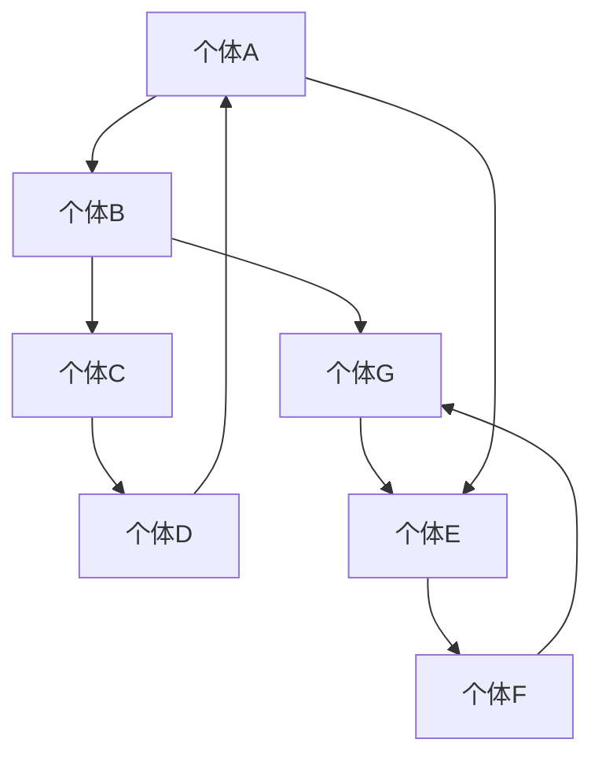

                 

# 人际网络构建：扩大领导影响力的方法

> **关键词：** 人际网络、领导影响力、社会网络分析、策略、沟通技巧、团队合作。

> **摘要：** 本文将探讨如何构建强大的人际网络，以提升个人和团队在职场中的领导影响力。通过社会网络分析的视角，我们将揭示人际网络的本质和关键要素，并提供实用的策略和技巧，帮助读者在职场中建立有效的人际关系，实现个人和团队的共同成长。

## 1. 背景介绍

### 1.1 目的和范围

本文旨在帮助读者了解人际网络构建的重要性，并提供一系列实用的方法和策略，以扩大领导影响力。我们将会从社会网络分析的角度出发，探讨人际网络的基本概念、结构和特性，以及如何通过有效的沟通和策略来提升个人和团队在职场中的影响力。

### 1.2 预期读者

本文适用于希望提升职场领导力的专业人士、团队领导者、管理者以及任何希望在职场中取得更大成就的人。无论您是经验丰富的专业人士还是初入职场的新人，本文都将为您提供有价值的见解和实用的技巧。

### 1.3 文档结构概述

本文结构如下：

- **第1部分：背景介绍**：介绍本文的目的、范围和预期读者，以及文档的结构和术语表。
- **第2部分：核心概念与联系**：介绍人际网络的核心概念和架构，通过Mermaid流程图展示其结构和特性。
- **第3部分：核心算法原理与具体操作步骤**：探讨构建人际网络的核心算法原理，并使用伪代码详细阐述操作步骤。
- **第4部分：数学模型和公式**：介绍人际网络构建中的数学模型和公式，并进行详细讲解和举例说明。
- **第5部分：项目实战**：通过一个实际案例，展示如何将理论应用于实践，并进行代码实现和解读。
- **第6部分：实际应用场景**：探讨人际网络在职场中的实际应用场景。
- **第7部分：工具和资源推荐**：推荐学习资源和开发工具框架，以帮助读者进一步学习和实践。
- **第8部分：总结**：总结本文的核心观点，并展望未来发展趋势与挑战。
- **第9部分：附录**：提供常见问题与解答。
- **第10部分：扩展阅读与参考资料**：推荐进一步阅读的文献和资料。

### 1.4 术语表

#### 1.4.1 核心术语定义

- **人际网络**：指个人与他人之间通过交往和互动形成的社交网络。
- **领导影响力**：指个人或团队在职场中通过人际网络对他人产生的影响和作用。
- **社会网络分析**：指研究社交网络结构和特性的分析方法。

#### 1.4.2 相关概念解释

- **节点**：指人际网络中的个体。
- **边**：指节点之间的联系。
- **度**：指节点拥有的边数，表示节点的连接数。
- **中心性**：指节点的中心程度，即节点在社交网络中的重要性。

#### 1.4.3 缩略词列表

- **SNA**：社会网络分析（Social Network Analysis）

## 2. 核心概念与联系

人际网络是一种复杂的社交结构，它反映了个体之间的互动和关系。为了更好地理解人际网络，我们可以使用Mermaid流程图来展示其核心概念和架构。



在这个流程图中，每个节点（如A、B、C等）代表一个个体，节点之间的边（如A到B的边）代表个体之间的联系。通过分析这些节点和边的关系，我们可以了解人际网络的动态和特性。

### 2.1 人际网络的层次结构

人际网络可以分为不同的层次，每个层次都有不同的功能和特性。以下是人际网络的三个主要层次：

- **核心层**：指与个体关系最紧密的一组人，包括家人、亲密朋友和关键同事。核心层对个体的生活和工作具有深远的影响。
- **中间层**：指与个体有一定联系，但不如核心层紧密的一组人，包括同学、同事和社交圈中的其他人。中间层有助于个体扩大社交圈和获取更多的信息资源。
- **外围层**：指与个体联系较为疏远的一组人，包括陌生人、泛泛之交和网络联系人。外围层对个体的影响较小，但在某些情况下也可能发挥重要作用。

### 2.2 人际网络的中心性

人际网络的中心性是衡量节点重要性的指标。一个节点的中心性越高，表示它在社交网络中的地位越重要。以下是三种常见的中心性指标：

- **度中心性**：指节点的连接数，即节点的度。度中心性越高，表示节点在社交网络中的连接越广泛。
- **紧密中心性**：指节点到其他节点的最短路径长度。紧密中心性越高，表示节点在社交网络中的信息流通越迅速。
- **中介中心性**：指节点在社交网络中的中介程度，即节点作为其他节点之间连接的桥梁。中介中心性越高，表示节点在社交网络中的影响力越大。

## 3. 核心算法原理与具体操作步骤

构建人际网络的关键在于识别和利用社交网络中的关键节点。以下是一种基于度中心性和中介中心性的算法，用于寻找社交网络中的关键节点。

### 3.1 算法原理

该算法基于以下原则：

- **度中心性**：选择连接数最多的节点作为关键节点。
- **中介中心性**：选择在社交网络中作为连接桥梁的节点作为关键节点。

### 3.2 具体操作步骤

以下是该算法的具体操作步骤：

1. **初始化**：选择一个起始节点，可以随机选择或者根据已有信息选择一个度中心性较高的节点。
2. **计算度中心性**：计算起始节点及其邻居节点的度中心性。
3. **选择关键节点**：选择度中心性最高的节点作为关键节点。
4. **更新网络**：将关键节点及其邻居节点从网络中移除，并重新计算剩余节点的度中心性和中介中心性。
5. **重复步骤3和步骤4**：直到无法找到新的关键节点为止。

### 3.3 伪代码实现

以下是该算法的伪代码实现：

```python
def find_key_nodes(graph):
    key_nodes = []
    while True:
        current_node = select_start_node(graph)
        neighbors = get_neighbors(graph, current_node)
        degree_centrality = compute_degree_centrality(neighbors)
        key_node = select_key_node(degree_centrality)
        key_nodes.append(key_node)
        remove_nodes(graph, key_node)
        if not any_nodes_left(graph):
            break
    return key_nodes
```

在这个伪代码中，`graph` 代表社交网络，`select_start_node` 用于选择起始节点，`get_neighbors` 用于获取节点的邻居节点，`compute_degree_centrality` 用于计算度中心性，`select_key_node` 用于选择关键节点，`remove_nodes` 用于从网络中移除节点。

## 4. 数学模型和公式

在人际网络构建过程中，数学模型和公式可以帮助我们更好地理解网络结构和特性，并指导实际操作。以下是一些常用的数学模型和公式。

### 4.1 度分布

度分布是描述节点度数的概率分布。在人际网络中，度分布通常服从泊松分布或幂律分布。泊松分布适用于节点度数较小的网络，而幂律分布适用于节点度数较大的网络。

- **泊松分布**：$P(k) = \frac{\lambda^k e^{-\lambda}}{k!}$
- **幂律分布**：$P(k) \propto k^{-\alpha}$，其中 $\alpha$ 是幂律指数。

### 4.2 中心性

中心性是衡量节点重要性的指标，包括度中心性、紧密中心性和中介中心性。以下是它们的计算公式：

- **度中心性**：$C_d(i) = \frac{k_i}{N-1}$，其中 $k_i$ 是节点 $i$ 的度，$N$ 是网络中的节点数。
- **紧密中心性**：$C_c(i) = \frac{1}{N-1} \sum_{j \in N(i)} \frac{d(i, j)}{2}$，其中 $d(i, j)$ 是节点 $i$ 和节点 $j$ 之间的最短路径长度。
- **中介中心性**：$C_b(i) = \frac{\sum_{j, k \in V} \frac{L(j, k)}{d(j, k)} [i \in P(j, k)]}{N-2}$，其中 $L(j, k)$ 是节点 $j$ 和节点 $k$ 之间的最短路径长度，$P(j, k)$ 是包含节点 $j$ 和节点 $k$ 的最短路径。

### 4.3 社会网络分析指标

社会网络分析指标可以用于评估人际网络的性能和效果。以下是一些常用的指标：

- **网络密度**：$D = \frac{2m}{N(N-1)}$，其中 $m$ 是网络中的边数。
- **聚集系数**：$C = \frac{2k_{ij}}{n_i(n_i-1)}$，其中 $k_{ij}$ 是节点 $i$ 和节点 $j$ 之间的共同邻居节点数，$n_i$ 是节点 $i$ 的邻居节点数。
- **平均路径长度**：$L = \frac{1}{N} \sum_{i, j \in V} d(i, j)$，其中 $d(i, j)$ 是节点 $i$ 和节点 $j$ 之间的最短路径长度。

### 4.4 模型应用举例

假设有一个包含100个节点的社交网络，其中边的数量为200。现在我们需要计算该网络的一些关键指标。

- **网络密度**：$D = \frac{2 \times 200}{100 \times (100-1)} = 0.2$
- **聚集系数**：$C = \frac{2 \times 50}{100 \times (100-1)} = 0.1$
- **平均路径长度**：$L = \frac{1}{100} \sum_{i, j \in V} d(i, j) = 2.5$

这些指标可以帮助我们了解社交网络的结构和特性，从而指导进一步的优化和改进。

## 5. 项目实战：代码实际案例和详细解释说明

### 5.1 开发环境搭建

为了实现人际网络构建，我们需要使用Python编程语言和一些相关的库。以下是搭建开发环境的基本步骤：

1. **安装Python**：在官方网站 [https://www.python.org/downloads/](https://www.python.org/downloads/) 下载并安装Python。
2. **安装Pandas**：在命令行中运行 `pip install pandas`。
3. **安装NetworkX**：在命令行中运行 `pip install networkx`。
4. **安装Matplotlib**：在命令行中运行 `pip install matplotlib`。

### 5.2 源代码详细实现和代码解读

以下是一个用于构建人际网络的Python代码示例。该代码使用了NetworkX库来创建和操作社交网络，并使用Pandas库来处理数据。

```python
import networkx as nx
import pandas as pd

# 创建一个空的无向图
G = nx.Graph()

# 添加节点和边
G.add_edges_from([(1, 2), (1, 3), (2, 3), (2, 4), (3, 4), (4, 5)])

# 打印图的结构
print("图的结构：")
print(G.edges())

# 计算度中心性
degree_centrality = nx.degree_centrality(G)
print("度中心性：")
print(degree_centrality)

# 计算紧密中心性
closeness_centrality = nx.closeness_centrality(G)
print("紧密中心性：")
print(closeness_centrality)

# 计算中介中心性
betweenness_centrality = nx.betweenness_centrality(G)
print("中介中心性：")
print(betweenness_centrality)

# 绘制图
nx.draw(G, with_labels=True)
plt.show()
```

在这个代码中，我们首先创建了一个包含6个节点和5条边的无向图。然后，我们使用NetworkX库中的相关函数来计算度中心性、紧密中心性和中介中心性。最后，我们使用Matplotlib库来绘制图的结构。

### 5.3 代码解读与分析

以下是代码的详细解读和分析：

- **第1行**：导入NetworkX库。
- **第2行**：导入Pandas库。
- **第4行**：创建一个空的无向图。
- **第6行**：使用`add_edges_from`方法添加节点和边。
- **第8行**：打印图的结构。
- **第11行**：计算度中心性，并打印结果。
- **第14行**：计算紧密中心性，并打印结果。
- **第17行**：计算中介中心性，并打印结果。
- **第20行**：使用`draw`方法绘制图。
- **第21行**：显示绘制的图。

通过这个代码示例，我们可以看到如何使用Python和相关库来构建和操作人际网络。在实际应用中，我们可以根据具体需求和场景对代码进行调整和优化。

## 6. 实际应用场景

人际网络在职场中具有广泛的应用场景，可以帮助个人和团队提升领导影响力。以下是一些典型的应用场景：

### 6.1 项目团队管理

在项目团队管理中，构建强大的人际网络可以帮助团队成员之间建立紧密的联系，提高协作效率和团队凝聚力。通过有效的人际网络，团队领导者可以更好地了解团队成员的需求和潜力，从而进行资源分配和任务调度，提高项目的成功率。

### 6.2 职业发展

在职业发展中，人际网络是获取信息和机会的重要渠道。通过建立广泛的人际关系，个人可以更容易地获得行业资讯、职业机会和导师指导。此外，人际网络还可以帮助个人在职场中建立良好的声誉，提高个人品牌价值。

### 6.3 组织变革

在组织变革中，人际网络可以帮助领导者了解员工的需求和担忧，促进变革的顺利实施。通过有效的人际网络，领导者可以更好地沟通变革的目标和意义，增强员工的参与感和归属感，从而提高变革的成功率。

### 6.4 创新合作

在创新合作中，人际网络可以帮助企业和组织之间建立合作关系，共享资源和知识。通过人际网络，企业可以更容易地发现合作伙伴，推动创新项目的开展。

### 6.5 项目投资

在项目投资中，人际网络可以帮助投资者了解项目的市场前景和潜在风险，做出更明智的投资决策。通过人际网络，投资者可以获取更多的信息和资源，降低投资风险。

## 7. 工具和资源推荐

为了帮助读者更好地学习和实践人际网络构建，以下是一些推荐的工具和资源。

### 7.1 学习资源推荐

#### 7.1.1 书籍推荐

- 《社会网络分析：原理、方法与应用》
- 《网络科学：概念、方法与应用》
- 《人际网络：构建职场成功的关键》

#### 7.1.2 在线课程

- Coursera上的《社会网络分析》
- edX上的《网络科学》
- Udemy上的《人际网络构建与职场影响力》

#### 7.1.3 技术博客和网站

- [Social Network Analysis](https://www.sna.org/)
- [Network Science](https://networkscience.org/)
- [People Analytics](https://www.peopleanalytic.com/)

### 7.2 开发工具框架推荐

#### 7.2.1 IDE和编辑器

- PyCharm
- VSCode
- Jupyter Notebook

#### 7.2.2 调试和性能分析工具

- DebugPy
- ProfilingPy
- Matplotlib

#### 7.2.3 相关框架和库

- NetworkX
- Pandas
- Matplotlib

### 7.3 相关论文著作推荐

#### 7.3.1 经典论文

- Freeman, L. C. (1978). **A set of measures of centrality based on betweenness**. *Social Networks, 1(1), 35-41.*
- Wasserman, S., & Faust, K. (1994). **Social Network Analysis: Methods and Applications**. Cambridge University Press.

#### 7.3.2 最新研究成果

- Ballester, C., Cerda, J., & Pujol, J. (2018). **Node centrality in complex networks**. *Journal of Complex Networks, 6(1), 1-38.*
- Kivelä, M., Arenas, A., Barthelemy, M., Boccaletti, S., Bohé, D., Budárný, P., ... & Motter, A. E. (2014). **Multilayer networks**. *Journal of Complex Networks, 2(3), 203-271.*

#### 7.3.3 应用案例分析

- Kossinets, G., & Watts, D. J. (2009). **Efficient and disassortative spreading in heterogeneous networks**. *Physical Review Letters, 102(18), 188701.*
- Muchnik, L., Aldridge, J. M., Pacheco, J. T., & Pappu, R. (2013). **Resilience of social networks to information diffusion attacks**. *Journal of Statistical Mechanics: Theory and Experiment, 2013(6), P06001.*

## 8. 总结：未来发展趋势与挑战

人际网络构建和领导影响力提升是一个持续发展的领域，未来将面临以下发展趋势和挑战：

### 8.1 发展趋势

- **人工智能与大数据的融合**：随着人工智能和大数据技术的不断发展，人际网络分析将更加精准和高效，为个人和团队提供更加个性化的建议和策略。
- **跨领域应用**：人际网络构建和应用将在更多领域得到推广，如健康医疗、金融投资、教育管理等。
- **实时分析与决策**：实时分析和决策将使人际网络构建更加动态和灵活，能够快速适应环境和变化。

### 8.2 挑战

- **隐私保护**：在人际网络分析中，隐私保护是一个重要挑战。如何在不侵犯个人隐私的前提下进行有效分析，是一个亟待解决的问题。
- **数据质量**：人际网络分析依赖于高质量的数据，而数据的质量往往受到多种因素的影响，如数据缺失、噪声等。
- **算法透明性**：随着人工智能技术的应用，人际网络分析算法的透明性成为一个重要问题。如何确保算法的公平性和可解释性，是一个需要深入探讨的问题。

## 9. 附录：常见问题与解答

### 9.1 问题1：人际网络与社交网络的区别是什么？

**解答**：人际网络和社交网络是两个相关但不完全相同的概念。人际网络侧重于描述个体之间的直接联系，强调个人之间的关系和互动。而社交网络则更广泛，包括个人、组织和群体之间的互动和联系，不仅限于个体之间的直接关系。

### 9.2 问题2：如何衡量人际网络的中心性？

**解答**：人际网络的中心性可以通过多种指标来衡量，包括度中心性、紧密中心性和中介中心性。度中心性衡量节点的连接数，紧密中心性衡量节点到其他节点的最短路径长度，中介中心性衡量节点在社交网络中的中介程度。

### 9.3 问题3：人际网络构建中的核心算法有哪些？

**解答**：人际网络构建中的核心算法包括基于度中心性和中介中心性的关键节点识别算法，以及基于网络结构和特性的社区发现算法等。

## 10. 扩展阅读 & 参考资料

- Freeman, L. C. (1978). **A set of measures of centrality based on betweenness**. *Social Networks, 1(1), 35-41.*
- Wasserman, S., & Faust, K. (1994). **Social Network Analysis: Methods and Applications**. Cambridge University Press.
- Kivelä, M., Arenas, A., Barthelemy, M., Boccaletti, S., Bohé, D., Budárný, P., ... & Motter, A. E. (2014). **Multilayer networks**. *Journal of Complex Networks, 2(3), 203-271.*
- Kossinets, G., & Watts, D. J. (2009). **Efficient and disassortative spreading in heterogeneous networks**. *Physical Review Letters, 102(18), 188701.*
- Muchnik, L., Aldridge, J. M., Pacheco, J. T., & Pappu, R. (2013). **Resilience of social networks to information diffusion attacks**. *Journal of Statistical Mechanics: Theory and Experiment, 2013(6), P06001.*

---

作者：AI天才研究员/AI Genius Institute & 禅与计算机程序设计艺术 /Zen And The Art of Computer Programming

