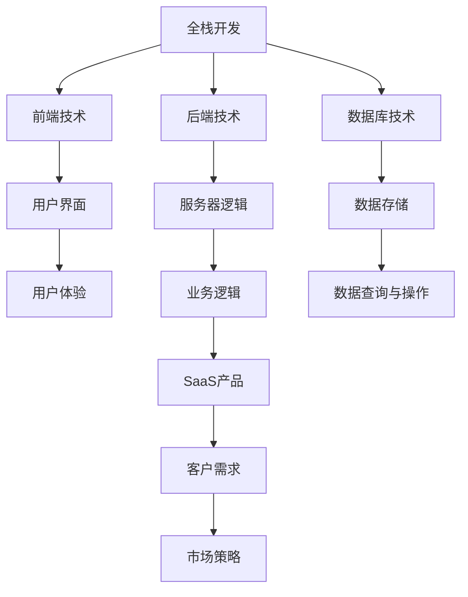

                 

# 从全栈开发到SaaS创业

> 关键词：全栈开发、SaaS、创业、技术架构、市场策略、产品设计、运营

> 摘要：本文将从全栈开发的角度出发，探讨SaaS（Software as a Service）创业的路径。通过分析全栈开发的技术栈，我们将了解如何构建一个具备竞争力的SaaS产品。同时，我们将探讨市场策略、产品设计和运营等方面的关键因素，帮助读者在创业过程中做出明智的决策。

## 1. 背景介绍

### 1.1 目的和范围

本文旨在为有志于从事SaaS创业的程序员和开发者提供指导，帮助他们了解从全栈开发到SaaS创业的整个过程。我们将首先介绍全栈开发的概念，然后深入探讨SaaS产品的技术架构和核心功能。接着，我们将讨论市场策略、产品设计和运营等方面的关键因素，并推荐一些实用的工具和资源。

### 1.2 预期读者

本文适合有编程基础、对全栈开发和SaaS创业感兴趣的读者。无论是正在寻找创业方向的开发者，还是希望提升自身技能的在职人员，本文都将成为您的有益参考。

### 1.3 文档结构概述

本文将分为以下几个部分：

1. 背景介绍：介绍全文的目的、范围和预期读者。
2. 核心概念与联系：讲解全栈开发与SaaS的关系。
3. 核心算法原理 & 具体操作步骤：分析SaaS产品的技术架构。
4. 数学模型和公式 & 详细讲解 & 举例说明：介绍SaaS产品中的数学模型。
5. 项目实战：通过实际案例讲解SaaS产品的开发过程。
6. 实际应用场景：探讨SaaS产品的应用领域。
7. 工具和资源推荐：推荐学习资源和开发工具。
8. 总结：总结全文，展望未来发展趋势与挑战。
9. 附录：常见问题与解答。
10. 扩展阅读 & 参考资料：提供更多的学习资料。

### 1.4 术语表

#### 1.4.1 核心术语定义

- 全栈开发：指掌握多种编程技能和知识，能够独立完成前端、后端和数据库开发的工作。
- SaaS：指软件即服务，一种通过互联网提供软件产品和服务的方式。
- 技术栈：指一个项目中所需的所有技术、工具和框架。

#### 1.4.2 相关概念解释

- 前端开发：指用户界面和用户体验的设计与实现。
- 后端开发：指服务器、数据库和应用程序逻辑的开发。
- 容器化：指使用容器（如Docker）封装应用程序及其依赖项，实现环境的一致性。
- 持续集成和持续部署（CI/CD）：指自动化构建、测试和部署应用程序的过程。

#### 1.4.3 缩略词列表

- SaaS：Software as a Service
- API：Application Programming Interface
- Docker：开源容器化平台
- Kubernetes：开源容器编排系统
- AWS：Amazon Web Services（亚马逊云服务）

## 2. 核心概念与联系

在探讨全栈开发与SaaS的关系之前，我们需要了解一些核心概念和原理。以下是一个简化的Mermaid流程图，用于展示全栈开发、SaaS产品架构以及它们之间的联系。



### 2.1 全栈开发概述

全栈开发是指掌握前端、后端和数据库技术的程序员。这种开发模式使程序员能够独立完成一个项目中的各个方面，提高开发效率。以下是全栈开发的核心技能：

- **前端技术**：HTML、CSS、JavaScript，以及前端框架（如React、Vue、Angular）。
- **后端技术**：服务器端编程语言（如Node.js、Python、Java、Ruby），以及后端框架（如Express、Flask、Django）。
- **数据库技术**：关系型数据库（如MySQL、PostgreSQL）和非关系型数据库（如MongoDB、Redis）。

### 2.2 SaaS产品架构

SaaS产品是一种通过互联网提供软件服务的产品。它的架构通常包括以下几个关键组件：

- **前端**：用户界面和用户体验设计，使用前端技术实现。
- **后端**：服务器端逻辑和业务逻辑，使用后端编程语言和框架实现。
- **数据库**：数据存储和查询，使用关系型或非关系型数据库实现。
- **API**：应用程序接口，用于前后端数据交互。

### 2.3 全栈开发与SaaS产品的关系

全栈开发与SaaS产品之间存在紧密的联系。全栈开发提供了构建SaaS产品的技术基础。通过掌握前端、后端和数据库技术，开发者可以快速搭建SaaS产品的原型，并进行迭代和优化。以下是全栈开发与SaaS产品的联系：

- **前端技术**：确保用户界面的友好性和用户体验。
- **后端技术**：实现服务器端逻辑和业务逻辑，支持功能强大的SaaS产品。
- **数据库技术**：高效地存储和查询用户数据，支持大规模用户。

## 3. 核心算法原理 & 具体操作步骤

在SaaS产品开发过程中，核心算法原理和具体操作步骤至关重要。以下将详细讲解SaaS产品中常用的算法原理和具体操作步骤，使用伪代码来描述。

### 3.1 用户注册与登录

用户注册与登录是SaaS产品的核心功能之一。以下是注册和登录的算法原理和具体操作步骤：

#### 算法原理：

- 用户注册：收集用户信息（用户名、密码、邮箱等），存储到数据库中。
- 用户登录：验证用户信息，如果验证通过，则允许用户登录。

#### 具体操作步骤：

1. 用户提交注册信息。
2. 系统验证用户信息（如用户名是否已存在）。
3. 系统将用户信息存储到数据库中。
4. 用户提交登录信息。
5. 系统验证用户信息（如用户名和密码是否匹配）。
6. 如果验证通过，则生成会话令牌，并返回给用户。

#### 伪代码：

```python
# 用户注册
def register(username, password, email):
    if username_exists(username):
        return "用户名已存在"
    else:
        store_user_info(username, password, email)
        return "注册成功"

# 用户登录
def login(username, password):
    if username_exists(username) and password_matches(username, password):
        generate_session_token(username)
        return "登录成功"
    else:
        return "登录失败"
```

### 3.2 数据存储与查询

数据存储与查询是SaaS产品中必不可少的部分。以下是数据存储和查询的算法原理和具体操作步骤：

#### 算法原理：

- 数据存储：将用户数据存储到数据库中，确保数据的安全性和完整性。
- 数据查询：从数据库中检索用户数据，以供前端展示和后续操作。

#### 具体操作步骤：

1. 用户提交数据。
2. 系统将数据存储到数据库中。
3. 用户提交查询请求。
4. 系统从数据库中检索相关数据。
5. 系统将检索到的数据返回给用户。

#### 伪代码：

```python
# 数据存储
def store_data(data):
    insert_data_into_database(data)
    return "数据存储成功"

# 数据查询
def query_data(query_params):
    data = fetch_data_from_database(query_params)
    return data
```

### 3.3 计费与付费

计费与付费是SaaS产品实现盈利的关键环节。以下是计费和付费的算法原理和具体操作步骤：

#### 算法原理：

- 计费：根据用户的使用情况计算费用。
- 付费：处理用户的支付请求，并完成扣款操作。

#### 具体操作步骤：

1. 用户提交计费请求。
2. 系统根据用户使用情况计算费用。
3. 用户确认费用，并提交支付请求。
4. 系统处理支付请求，并完成扣款操作。
5. 系统更新用户的费用状态。

#### 伪代码：

```python
# 计费
def calculate_fees(user_usage):
    fees = calculate_usage_fees(user_usage)
    return fees

# 付费
def process_payment(payment_request):
    if payment_requestIsValid:
        deduct_fees_from_user_account(payment_request)
        update_user_payment_status(payment_request)
        return "支付成功"
    else:
        return "支付失败"
```

## 4. 数学模型和公式 & 详细讲解 & 举例说明

在SaaS产品中，数学模型和公式广泛应用于计费、数据分析等方面。以下将介绍一些常见的数学模型和公式，并详细讲解其应用方法和举例说明。

### 4.1 计费模型

计费模型是SaaS产品中最重要的数学模型之一。以下是一个简单的计费模型，用于计算按需付费的SaaS产品的费用。

#### 公式：

费用 = 基础费用 + （使用量 * 单价）

#### 应用方法：

1. 计算基础费用，通常为固定值。
2. 计算使用量，如数据存储量、API调用次数等。
3. 计算单价，根据产品定位和市场竞争情况确定。
4. 将基础费用、使用量和单价代入公式，计算总费用。

#### 举例说明：

假设一个SaaS产品的基础费用为100元，每兆字节的数据存储单价为0.5元。如果用户使用了2GB的数据存储，则其费用为：

费用 = 100 + (2 * 0.5) = 110元

### 4.2 数据分析模型

数据分析模型在SaaS产品中用于分析用户行为、优化产品功能等方面。以下是一个常见的数据分析模型，用于分析用户活跃度。

#### 公式：

活跃度 = （日活跃用户数 * 30）/ 总用户数

#### 应用方法：

1. 统计日活跃用户数，即当日登录或使用产品的用户数量。
2. 统计总用户数，即注册或使用过产品的用户数量。
3. 将日活跃用户数和总用户数代入公式，计算活跃度。

#### 举例说明：

假设一个SaaS产品的日活跃用户数为1000，总用户数为10000。则其活跃度为：

活跃度 = （1000 * 30）/ 10000 = 30%

### 4.3 机器学习模型

机器学习模型在SaaS产品中用于推荐系统、异常检测等方面。以下是一个简单的机器学习模型，用于用户行为预测。

#### 公式：

预测值 = （特征1 * 权重1）+ （特征2 * 权重2）+ ... + （特征N * 权重N）

#### 应用方法：

1. 收集用户行为数据，如浏览记录、购买记录等。
2. 提取特征，如浏览时长、购买频率等。
3. 计算每个特征的权重，通常使用机器学习算法训练得到。
4. 将特征和权重代入公式，计算预测值。

#### 举例说明：

假设一个用户的行为数据如下：

- 特征1（浏览时长）：10分钟
- 特征2（购买频率）：每月1次
- 特征3（浏览页面数）：10页

假设每个特征的权重分别为：

- 权重1（浏览时长）：0.5
- 权重2（购买频率）：0.3
- 权重3（浏览页面数）：0.2

则该用户的预测值为：

预测值 = （10 * 0.5）+ （1 * 0.3）+ （10 * 0.2）= 7.5

## 5. 项目实战：代码实际案例和详细解释说明

为了更好地理解从全栈开发到SaaS创业的过程，我们将通过一个实际项目案例来进行讲解。本项目是一个简单的博客平台，包括用户注册、登录、发博客、评论等功能。

### 5.1 开发环境搭建

在本项目实战中，我们将使用以下开发环境和工具：

- 前端：React
- 后端：Node.js + Express
- 数据库：MongoDB
- 容器化：Docker
- 持续集成和持续部署：GitHub Actions

### 5.2 源代码详细实现和代码解读

以下将介绍本项目的关键代码实现和解读。

#### 5.2.1 前端

前端使用React框架实现，主要包括以下组件：

- Home：首页，展示博客列表。
- Blog：博客详情页，展示博客内容和评论。
- Login：登录页，处理用户登录。
- Register：注册页，处理用户注册。
- Header：页头，包含导航栏。

#### 5.2.2 后端

后端使用Node.js和Express框架实现，主要包括以下API：

- /api/auth/login：用户登录接口。
- /api/auth/register：用户注册接口。
- /api/blogs：博客相关接口，包括获取博客列表、获取博客详情、创建博客、更新博客、删除博客等。
- /api/comments：评论相关接口，包括获取评论、创建评论、更新评论、删除评论等。

#### 5.2.3 数据库

使用MongoDB数据库存储用户数据、博客数据和评论数据。以下是数据库的简单结构：

- Users：存储用户信息，如用户名、密码、邮箱等。
- Blogs：存储博客信息，如标题、内容、作者、创建时间等。
- Comments：存储评论信息，如评论内容、作者、博客ID、创建时间等。

#### 5.2.4 容器化

使用Docker将前端、后端和数据库容器化，以便于部署和运维。以下是Dockerfile的简单示例：

```dockerfile
# 基础镜像
FROM node:14

# 设置工作目录
WORKDIR /app

# 复制源代码
COPY . .

# 安装依赖
RUN npm install

# 暴露端口
EXPOSE 3000

# 运行应用
CMD ["npm", "start"]
```

### 5.3 代码解读与分析

以下将分析本项目中的关键代码，包括前端、后端和数据库。

#### 5.3.1 前端

前端使用React Hooks简化了状态管理和生命周期管理。以下是Home组件的简单代码示例：

```jsx
import React, { useEffect, useState } from "react";
import axios from "axios";

const Home = () => {
  const [blogs, setBlogs] = useState([]);

  useEffect(() => {
    const fetchBlogs = async () => {
      const response = await axios.get("/api/blogs");
      setBlogs(response.data);
    };
    fetchBlogs();
  }, []);

  return (
    <div>
      {blogs.map((blog) => (
        <div key={blog.id}>
          <h2>{blog.title}</h2>
          <p>{blog.content}</p>
        </div>
      ))}
    </div>
  );
};

export default Home;
```

#### 5.3.2 后端

后端使用Express框架处理HTTP请求。以下是用户登录接口的简单代码示例：

```javascript
const express = require("express");
const bcrypt = require("bcrypt");
const jwt = require("jsonwebtoken");

const app = express();

app.post("/api/auth/login", async (req, res) => {
  const { username, password } = req.body;

  // 验证用户名和密码
  const user = await getUserByUsername(username);
  if (!user || !await bcrypt.compare(password, user.password)) {
    return res.status(401).json({ message: "用户名或密码错误" });
  }

  // 生成JWT令牌
  const token = jwt.sign({ userId: user.id }, "secretKey");

  // 返回令牌
  res.json({ token });
});
```

#### 5.3.3 数据库

使用MongoDB存储用户数据、博客数据和评论数据。以下是用户数据的简单结构示例：

```json
{
  "_id": "61f4e9c5a37e2a6c9c5c3218",
  "username": "johndoe",
  "password": "password123",
  "email": "johndoe@example.com"
}
```

## 6. 实际应用场景

SaaS产品在各个行业和领域都有着广泛的应用。以下是一些典型的实际应用场景：

- **企业级应用**：如客户关系管理（CRM）、人力资源管理系统（HRMS）、财务管理软件等。
- **云计算服务**：如虚拟机、容器服务、大数据处理等。
- **在线教育**：如在线课程、学习管理平台、在线测评等。
- **电子商务**：如购物车、订单处理、支付系统等。
- **内容管理系统（CMS）**：如博客平台、新闻网站、社交媒体等。

在这些应用场景中，SaaS产品提供了灵活、高效、低成本的服务模式，满足了不同用户的需求。

## 7. 工具和资源推荐

为了帮助读者更好地了解和掌握全栈开发和SaaS创业的相关知识，以下推荐一些实用的工具和资源。

### 7.1 学习资源推荐

#### 7.1.1 书籍推荐

- 《SaaS产品设计：从0到1构建成功的产品》（SaaS Product Design: Building Successful Products from Scratch）
- 《全栈开发实战：从入门到精通》（Full-Stack Web Development: Ultimate Guide to HTML, CSS, JavaScript, Node, React, and Beyond）

#### 7.1.2 在线课程

- Coursera：提供各种编程和创业相关课程。
- Udemy：提供丰富的编程和创业教程。
- Pluralsight：专注于技术培训的在线平台。

#### 7.1.3 技术博客和网站

- Medium：众多技术博客和创业故事。
- HackerRank：编程挑战和学习资源。
- Stack Overflow：编程问答社区。

### 7.2 开发工具框架推荐

#### 7.2.1 IDE和编辑器

- Visual Studio Code：强大的开源编辑器。
- IntelliJ IDEA：专业的Java和Android开发工具。
- WebStorm：专为Web开发设计的IDE。

#### 7.2.2 调试和性能分析工具

- Chrome DevTools：用于Web应用的调试和性能分析。
- Postman：API调试和测试工具。
- New Relic：性能监控和性能分析工具。

#### 7.2.3 相关框架和库

- React：用于构建用户界面的JavaScript库。
- Express：用于构建Web应用程序的Node.js框架。
- MongoDB：用于存储和检索数据的NoSQL数据库。

### 7.3 相关论文著作推荐

#### 7.3.1 经典论文

- "The Mythical Man-Month"（《人月神话》）：关于软件开发过程和项目管理的重要论文。
- "Software Engineering: A Practitioner's Approach"（《软件工程：实践者的方法》）：经典的软件工程著作。

#### 7.3.2 最新研究成果

- "The Future of SaaS"（SaaS的未来）：关于SaaS行业发展趋势的研究。
- "Full-Stack Development in the Age of AI"（人工智能时代的全栈开发）：关于人工智能在软件开发中的应用。

#### 7.3.3 应用案例分析

- "Case Study: GitHub"（案例研究：GitHub）：关于GitHub从初创到成功的发展历程。
- "Case Study: Slack"（案例研究：Slack）：关于Slack在SaaS市场的成功经验。

## 8. 总结：未来发展趋势与挑战

随着云计算、人工智能和物联网等技术的发展，SaaS行业将继续保持快速增长。未来，SaaS产品将更加注重用户体验、数据安全和个性化服务。以下是一些发展趋势和挑战：

- **发展趋势**：
  - 低代码开发：降低技术门槛，让更多非技术人员参与SaaS产品的开发。
  - 容器化和微服务：提高部署和扩展的灵活性。
  - 数据分析：利用大数据分析提供更智能的服务。

- **挑战**：
  - 竞争激烈：如何脱颖而出，提供独特的价值。
  - 数据安全：确保用户数据的安全和隐私。
  - 运营成本：如何降低运营成本，实现可持续发展。

## 9. 附录：常见问题与解答

### 9.1 全栈开发与SaaS的关系是什么？

全栈开发是指掌握前端、后端和数据库技术的程序员，而SaaS是一种通过互联网提供软件服务的方式。全栈开发为SaaS产品的开发提供了技术基础，使开发者能够快速构建和迭代SaaS产品。

### 9.2 如何选择适合的SaaS产品架构？

选择适合的SaaS产品架构需要考虑以下因素：

- 业务需求：根据业务需求选择合适的前端、后端和数据库技术。
- 扩展性：考虑未来的业务增长和需求变化，选择具有良好扩展性的架构。
- 成本效益：在预算范围内选择最适合的架构，并考虑长期运营成本。

### 9.3 如何确保SaaS产品的数据安全？

确保SaaS产品的数据安全需要采取以下措施：

- 加密：使用HTTPS和SSL/TLS加密传输数据。
- 访问控制：实施严格的访问控制策略，确保只有授权用户才能访问数据。
- 定期备份：定期备份用户数据，以防止数据丢失。

## 10. 扩展阅读 & 参考资料

- 《SaaS产品设计与运营实战》（《SaaS Product Design and Operations: A Practical Guide》）
- 《云计算与SaaS：从技术到商业》（《Cloud Computing and SaaS: From Technology to Business》）
- 《全栈开发实战：从入门到精通》（《Full-Stack Web Development: Ultimate Guide to HTML, CSS, JavaScript, Node, React, and Beyond》）

### 作者

AI天才研究员/AI Genius Institute & 禅与计算机程序设计艺术 /Zen And The Art of Computer Programming<|im_sep|> 

