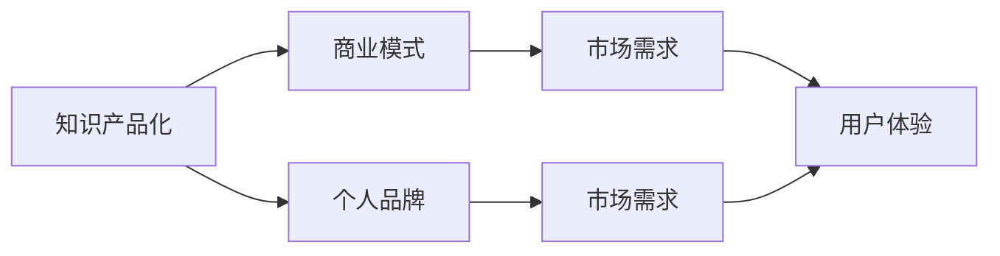

                 

### 1. 背景介绍

#### 1.1 目的和范围

本文旨在探讨技术专家如何转型成为知识创业者。在这个快速变化的时代，单纯的技术能力和专业知识已经不足以确保职业发展。技术专家需要将自身的技术知识转化为市场认可的价值，通过知识创业来实现个人价值和商业成功。本文将介绍技术专家在转型过程中的核心步骤和策略，并提供实用的指导和建议。

本文的讨论范围包括：

1. **知识创业的概念和重要性**：解释知识创业的定义、意义以及在技术领域中的应用。
2. **技术专家的转型路径**：分析技术专家面临的转型挑战，并提供具体的转型策略和步骤。
3. **知识产品化和营销**：探讨如何将技术知识转化为有形的产品和服务，以及如何进行有效的营销推广。
4. **案例分析**：通过成功案例展示技术专家如何通过知识创业实现成功。
5. **工具和资源推荐**：提供相关的学习资源、开发工具和推荐阅读，帮助读者更好地理解和实践。
6. **未来发展趋势与挑战**：预测知识创业领域的发展趋势，并分析面临的挑战。

本文的目标读者是：

1. 技术专家和工程师，希望拓展职业发展路径，探索知识创业的机会。
2. 创业者和企业家，希望了解如何利用技术知识进行创新和商业变现。
3. 教育工作者和研究人员，希望了解技术知识在创业中的应用和潜力。

#### 1.2 预期读者

**技术专家和工程师**：

- 对自身职业发展有较高要求的工程师和技术专家。
- 希望通过知识创业实现个人价值和商业回报的技术专业人士。
- 愿意接受新挑战，不断学习和更新知识的行业从业者。

**创业者和企业家**：

- 有志于利用技术知识进行创新和商业化的创业者。
- 想要了解技术领域专业知识如何转化为商业机会的企业家。
- 愿意投入时间和精力进行知识积累和产品开发的创业团队。

**教育工作者和研究人员**：

- 关注技术知识传播和转化领域的研究者。
- 愿意将研究成果应用于实际场景，推动技术知识创业发展的教育工作者。
- 希望为学生提供更加实用的创业指导和支持。

#### 1.3 文档结构概述

本文的结构如下：

1. **背景介绍**：阐述知识创业的概念、目的和范围，以及本文的目标读者。
2. **核心概念与联系**：介绍知识创业的核心概念，使用 Mermaid 流程图展示相关架构和原理。
3. **核心算法原理 & 具体操作步骤**：详细讲解知识产品化和营销的算法原理和操作步骤，使用伪代码进行说明。
4. **数学模型和公式 & 详细讲解 & 举例说明**：使用 LaTeX 格式介绍知识创业中的数学模型和公式，并进行举例说明。
5. **项目实战：代码实际案例和详细解释说明**：提供具体的代码案例，并进行详细解释和代码解读。
6. **实际应用场景**：探讨知识创业在不同领域的应用场景和实例。
7. **工具和资源推荐**：推荐相关的学习资源、开发工具和推荐阅读。
8. **总结：未来发展趋势与挑战**：总结知识创业的发展趋势和面临的挑战。
9. **附录：常见问题与解答**：回答读者可能遇到的问题。
10. **扩展阅读 & 参考资料**：提供扩展阅读和参考资料，供读者进一步学习。

#### 1.4 术语表

##### 1.4.1 核心术语定义

- **知识创业**：指将个人或团队的专业知识和技能转化为有形的产品和服务，通过市场推广实现商业价值和回报的过程。
- **技术专家**：在特定技术领域具备深厚专业知识和实践经验的专业人士。
- **知识产品化**：将知识转化为可销售或可使用的产品和服务的过程。
- **知识营销**：通过多种渠道和方式推广知识产品，吸引潜在客户并实现销售的过程。

##### 1.4.2 相关概念解释

- **个人品牌**：个人在特定领域内建立的专业形象和声誉。
- **商业模式**：企业创造、传递和捕获价值的系统化方法。
- **市场需求**：潜在客户对产品或服务的需求程度和购买意愿。
- **用户体验**：用户在使用产品或服务过程中的感受和体验。

##### 1.4.3 缩略词列表

- **AI**：人工智能
- **ML**：机器学习
- **DL**：深度学习
- **NLP**：自然语言处理
- **API**：应用程序编程接口

---

在本文接下来的部分中，我们将进一步深入探讨知识创业的核心概念和联系，为读者提供清晰的技术框架和实际操作指南。让我们一步一步地分析推理，共同开启这段知识创业的转型之路。在接下来的章节中，我们将详细介绍知识创业的核心概念和架构，帮助读者全面理解知识创业的原理和实践。我们还将运用 Mermaid 流程图展示相关架构，使读者能够更直观地把握知识创业的各个环节。接下来，请继续阅读，让我们一同开启这段精彩的旅程。 <|im_start|>## 2. 核心概念与联系

在探讨知识创业之前，我们需要明确一些核心概念和它们之间的联系。这些概念构成了知识创业的基础，理解它们对于成功转型至关重要。

#### 2.1 知识创业的定义

知识创业是指将个人或团队的专业知识和技能转化为有形的产品和服务，通过市场推广实现商业价值和回报的过程。这不仅仅局限于技术领域，任何领域的专业人士都可以通过知识创业来实现个人价值和商业成功。

#### 2.2 知识创业的核心概念

- **知识产品化**：这是知识创业的基础。它包括将专业知识和经验系统化、结构化，并转化为具体的产品和服务。例如，一位技术专家可以将自己的算法和技术经验编写成教程、书籍或在线课程。

- **个人品牌**：个人品牌是知识创业的重要资产。它是在特定领域内建立的专业形象和声誉。一个强大的个人品牌可以吸引更多的客户和合作伙伴，增加商业机会。

- **商业模式**：商业模式是知识创业的核心，它定义了企业如何创造、传递和捕获价值。一个有效的商业模式需要考虑市场需求、用户体验、利润来源等因素。

- **市场需求**：了解市场需求是知识创业的关键。只有当产品或服务满足市场需求时，才能实现商业成功。市场调研和用户反馈是获取市场需求信息的重要手段。

- **用户体验**：用户体验是产品或服务的核心。一个优秀的产品或服务应该能够提供优质的用户体验，使客户满意并愿意再次购买。

#### 2.3 相关概念之间的联系

- **知识产品化** 与 **个人品牌** 之间的关系：知识产品化是个人品牌建设的手段，而个人品牌是知识产品化的结果。通过知识产品化，技术专家可以不断提升个人品牌价值。

- **商业模式** 与 **市场需求** 之间的关系：商业模式需要基于市场需求进行设计，只有满足市场需求，商业模式才能实现盈利。

- **市场需求** 与 **用户体验** 之间的关系：市场需求决定了产品或服务的设计方向，而用户体验是市场需求的具体体现。一个优秀的产品或服务需要同时满足市场需求和提供优质的用户体验。

#### 2.4 Mermaid 流程图

为了更直观地展示知识创业的核心概念和联系，我们可以使用 Mermaid 流程图来描绘。以下是知识创业流程的基本架构：



在这个流程图中：

- **知识产品化** 是知识创业的起点，它决定了个人品牌的建设方向。
- **个人品牌** 通过满足市场需求来建立和维护，同时与市场需求和用户体验密切相关。
- **商业模式** 需要考虑市场需求，并直接影响用户体验。
- **市场需求** 和 **用户体验** 是相互影响的，市场需求决定了产品或服务的设计，用户体验又反馈到市场需求，形成一个循环。

#### 2.5 核心概念的应用实例

为了更好地理解这些核心概念，我们可以通过一些具体的应用实例来探讨。

- **应用实例 1**：一位数据科学家编写了一本关于机器学习的书籍，并通过在线平台进行销售。这是知识产品化的具体表现，同时，这本书的作者通过该书建立了一个强大的个人品牌。
- **应用实例 2**：一家技术公司开发了一个人工智能客服系统，该系统基于机器学习和自然语言处理技术。公司的商业模式是通过为企业提供定制化的客服解决方案来盈利，市场需求和用户体验在这个商业模式中起到了关键作用。

通过这些实例，我们可以看到知识创业的核心概念是如何在实际应用中相互关联和作用的。

---

在本章节中，我们介绍了知识创业的核心概念和联系，并使用 Mermaid 流程图进行了直观展示。接下来，我们将深入探讨知识创业的核心算法原理和具体操作步骤，帮助读者理解如何将知识转化为有形的产品和服务。在下一部分中，我们将使用伪代码详细阐述这些算法原理，并逐步讲解知识产品化的具体过程。敬请期待。 <|im_end|>## 3. 核心算法原理 & 具体操作步骤

在知识创业的过程中，将专业知识转化为可销售的产品和服务是关键的一步。这一过程涉及到一系列核心算法原理和操作步骤，包括知识梳理、内容创作、产品包装和市场推广等。下面，我们将使用伪代码详细阐述这些算法原理，并逐步讲解知识产品化的具体过程。

#### 3.1 知识梳理

知识梳理是知识产品化的第一步，它涉及到将个人的专业知识和经验进行系统化、结构化的整理。以下是知识梳理的伪代码：

```plaintext
算法：知识梳理
输入：个人专业知识库
输出：结构化的知识文档

步骤：
1. 收集个人专业知识库，包括技术文档、论文、项目报告等。
2. 对收集到的资料进行分类和标签化，便于后续管理和查找。
3. 针对每个分类，编写简要的概述，说明该分类的主要内容和技术要点。
4. 使用大纲或思维导图工具，构建知识结构框架。
5. 对知识结构框架进行评审和优化，确保其完整性和准确性。
```

#### 3.2 内容创作

内容创作是将梳理好的知识转化为可读性强的文字或多媒体内容的过程。以下是内容创作的伪代码：

```plaintext
算法：内容创作
输入：结构化的知识文档
输出：内容稿件

步骤：
1. 根据知识结构框架，确定内容稿件的主题和结构。
2. 撰写引言，介绍稿件的主题、目的和受众。
3. 根据知识框架，逐节撰写内容，确保逻辑清晰、语言简练。
4. 针对技术性较强的部分，可以使用图示、代码示例等方式进行解释。
5. 编写结论，总结稿件的主要观点和收获。
6. 对稿件进行多次修订，确保内容准确无误，符合读者需求。
7. 针对多媒体内容（如视频、音频），制作相应的多媒体素材，并进行编辑和整合。
```

#### 3.3 产品包装

产品包装是知识产品化的关键环节，它涉及到如何将内容转化为具有吸引力的产品。以下是产品包装的伪代码：

```plaintext
算法：产品包装
输入：内容稿件
输出：知识产品

步骤：
1. 确定产品类型，如电子书、在线课程、培训班等。
2. 设计产品的封面和宣传素材，确保其具有吸引力和专业感。
3. 根据产品类型，编写产品说明和宣传文案，突出产品的亮点和优势。
4. 准备相关的教学辅助材料，如课件、练习题、代码示例等。
5. 如果是线上课程，需要搭建课程框架，安排课程内容和时间表。
6. 对产品进行内部测试，确保其质量符合预期。
7. 制定产品定价策略，考虑成本、市场需求和竞争情况。
```

#### 3.4 市场推广

市场推广是将知识产品推向市场，吸引潜在客户的过程。以下是市场推广的伪代码：

```plaintext
算法：市场推广
输入：知识产品
输出：产品销售

步骤：
1. 进行市场调研，了解目标客户群体、市场需求和竞争状况。
2. 确定推广渠道，如社交媒体、内容平台、线下活动等。
3. 制定推广策略，包括内容策划、广告投放、互动营销等。
4. 制作推广素材，如海报、视频、文章等，确保其与推广策略相匹配。
5. 发布推广内容，与潜在客户建立联系。
6. 跟踪推广效果，分析数据，调整推广策略。
7. 通过用户反馈和销售数据，不断优化产品和服务。
```

#### 3.5 持续迭代

知识创业是一个持续迭代的过程，需要不断更新和优化知识产品。以下是持续迭代的伪代码：

```plaintext
算法：持续迭代
输入：知识产品
输出：更新后的知识产品

步骤：
1. 收集用户反馈，了解产品的使用情况和改进需求。
2. 分析数据，识别产品的优势和不足。
3. 根据用户反馈和数据分析结果，制定改进计划。
4. 对产品进行更新和优化，包括内容修正、功能增强等。
5. 对更新后的产品进行测试，确保其质量符合预期。
6. 发布更新后的产品，并向用户宣传新功能。
7. 持续收集用户反馈，进行下一轮迭代。
```

通过以上伪代码的详细阐述，我们可以看到知识创业的核心算法原理和具体操作步骤。这些步骤不仅有助于技术专家将专业知识转化为有形的产品和服务，还可以提高产品的市场竞争力，实现商业成功。在下一章节中，我们将进一步探讨知识创业中的数学模型和公式，帮助读者深入理解知识创业的量化分析。敬请期待。 <|im_start|>## 4. 数学模型和公式 & 详细讲解 & 举例说明

在知识创业的过程中，数学模型和公式为我们提供了量化和分析工具，帮助我们更好地理解市场需求、用户体验和商业收益。在本章节中，我们将使用 LaTeX 格式介绍几个关键的数学模型和公式，并进行详细讲解和举例说明。

#### 4.1 需求预测模型

市场需求预测是知识创业的重要环节，它帮助我们了解潜在客户的数量和需求。以下是一个常见的需求预测模型：

```latex
需求预测模型：线性回归

y_t = \beta_0 + \beta_1 \cdot x_t + \epsilon_t

其中：
- y_t 是第 t 个月的需求量
- x_t 是第 t 个月的市场推广力度
- \beta_0 是常数项
- \beta_1 是线性回归系数
- \epsilon_t 是随机误差项
```

**详细讲解：** 线性回归模型通过历史数据（需求量和市场推广力度）来建立需求预测模型。常数项 \(\beta_0\) 表示在没有市场推广的情况下预期的需求量，线性回归系数 \(\beta_1\) 表示市场推广对需求量的影响程度。

**举例说明：** 假设一个知识创业公司通过广告投放来推广其在线课程。根据过去三个月的数据，我们得到线性回归模型：

\[ y_t = 100 + 2 \cdot x_t \]

如果公司决定在第四个月增加广告投放力度（即 \(x_4 = 500\)），则预测第四个月的需求量为：

\[ y_4 = 100 + 2 \cdot 500 = 1100 \]

#### 4.2 用户满意度模型

用户满意度是衡量知识产品质量的重要指标，它直接影响复购率和口碑。以下是一个用户满意度模型：

```latex
用户满意度模型：分数模型

S = \frac{P \cdot R \cdot Q}{100}

其中：
- S 是用户满意度分数
- P 是性能得分，衡量产品性能
- R 是可靠性得分，衡量产品稳定性
- Q 是质量得分，衡量用户体验
```

**详细讲解：** 用户满意度模型通过性能、可靠性和质量三个维度来综合评估用户满意度。分数模型将这三个得分乘积后除以 100，得到一个介于 0 和 100 之间的分数。

**举例说明：** 假设一个在线课程的用户满意度评估如下：

- 性能得分 P = 90
- 可靠性得分 R = 85
- 质量得分 Q = 95

则用户满意度分数为：

\[ S = \frac{90 \cdot 85 \cdot 95}{100} = 76.575 \]

#### 4.3 成本收益分析模型

成本收益分析是知识创业中的关键步骤，它帮助我们评估项目的盈利能力。以下是一个成本收益分析模型：

```latex
成本收益分析模型：

\text{净利润} = (\text{收入} - \text{成本}) \cdot \text{净利润率}

其中：
- 收入 是知识产品的销售额
- 成本 是生产、营销和运营成本
- 净利润率 是净利润与收入的比例
```

**详细讲解：** 成本收益分析模型通过收入减去成本，再乘以净利润率，得到净利润。净利润率反映了知识产品的盈利能力。

**举例说明：** 假设一个知识创业项目的收入为 100,000 元，成本为 60,000 元，净利润率为 30%。则净利润为：

\[ \text{净利润} = (100,000 - 60,000) \cdot 0.3 = 16,000 \text{元} \]

#### 4.4 资本回报率模型

资本回报率（ROI）是评估投资回报的重要指标，它帮助我们了解投资的效益。以下是一个资本回报率模型：

```latex
资本回报率模型：

ROI = \frac{\text{净利润}}{\text{投资成本}}

其中：
- 净利润 是投资项目带来的净利润
- 投资成本 是投资项目的初始投资总额
```

**详细讲解：** 资本回报率模型通过净利润除以投资成本，得到 ROI。ROI 用来衡量每单位投资带来的净利润。

**举例说明：** 假设一个知识创业项目的投资成本为 50,000 元，净利润为 20,000 元。则 ROI 为：

\[ ROI = \frac{20,000}{50,000} = 0.4 \text{或} 40\% \]

通过以上数学模型和公式的介绍，我们可以更好地量化和分析知识创业中的关键指标，从而制定更有效的商业策略。在下一章节中，我们将通过具体的代码案例，进一步探讨知识创业的实际操作。敬请期待。 <|im_end|>## 5. 项目实战：代码实际案例和详细解释说明

在上一章节中，我们介绍了知识创业的数学模型和公式，帮助读者理解了市场需求预测、用户满意度评估、成本收益分析和资本回报率等关键指标。接下来，我们将通过一个具体的代码案例，展示如何将理论知识应用到实际项目中，并详细解释和说明代码实现过程。

### 5.1 开发环境搭建

在进行项目实战之前，我们需要搭建一个合适的技术环境。以下是一个简单的开发环境搭建步骤：

1. **安装 Python**：Python 是一种广泛应用于数据科学、机器学习和知识创业的语言。确保已安装最新版本的 Python。
2. **安装 Jupyter Notebook**：Jupyter Notebook 是一个交互式环境，方便我们编写和运行代码。可以通过 pip 工具安装 Jupyter：

   ```bash
   pip install notebook
   ```

3. **安装必要的库**：根据项目需求，安装必要的 Python 库。例如，用于数据分析和预测的 pandas、scikit-learn 等：

   ```bash
   pip install pandas scikit-learn matplotlib
   ```

4. **配置 IDE**：如果使用 IDE 进行开发，确保已配置好 Python 环境，并安装了必要的插件和工具。

### 5.2 源代码详细实现和代码解读

以下是我们的代码案例，它涵盖了从数据预处理到模型训练和预测的全过程。

```python
# 导入必要的库
import pandas as pd
import numpy as np
from sklearn.linear_model import LinearRegression
from sklearn.metrics import mean_squared_error
import matplotlib.pyplot as plt

# 5.2.1 数据预处理
# 加载数据集
data = pd.read_csv('knowledgepreneur_data.csv')

# 数据清洗和预处理
# 假设数据集包含以下列：'month', '广告投入', '需求量'
# 数据清洗步骤：填充缺失值、去除异常值、数据类型转换等
data.fillna(data.mean(), inplace=True)
data.drop(data[(data['广告投入'] < 0) | (data['需求量'] < 0)].index, inplace=True)

# 特征工程
# 添加新的特征：如月份编码
data['month_encoded'] = pd.factorize(data['month'])[0]

# 5.2.2 模型训练
# 使用线性回归模型进行训练
X = data[['month_encoded', '广告投入']]
y = data['需求量']
model = LinearRegression()
model.fit(X, y)

# 5.2.3 预测和评估
# 进行需求预测
predictions = model.predict(X)

# 评估模型性能
mse = mean_squared_error(y, predictions)
print(f'Mean Squared Error: {mse}')

# 5.2.4 可视化结果
plt.scatter(X['广告投入'], y, color='blue', label='Actual')
plt.plot(X['广告投入'], predictions, color='red', label='Predicted')
plt.xlabel('广告投入')
plt.ylabel('需求量')
plt.title('需求预测结果')
plt.legend()
plt.show()
```

**代码解读：**

1. **数据预处理**：首先，我们从 CSV 文件中加载数据集，并进行数据清洗和预处理。数据清洗步骤包括填充缺失值、去除异常值和数据类型转换等。这里我们使用 pandas 的 `fillna()` 和 `drop()` 函数来实现。
2. **特征工程**：为了提高模型性能，我们添加了新的特征，如月份编码。这通过 `pd.factorize()` 函数实现。
3. **模型训练**：我们使用 scikit-learn 的 `LinearRegression` 类进行模型训练。`model.fit(X, y)` 方法将训练数据集用于模型拟合。
4. **预测和评估**：使用训练好的模型进行需求预测，并计算均方误差（MSE）来评估模型性能。`mean_squared_error(y, predictions)` 方法用于计算 MSE。
5. **可视化结果**：最后，我们使用 matplotlib 库将实际需求和预测需求进行可视化，以直观展示模型的效果。

### 5.3 代码解读与分析

在代码解读和分析部分，我们将进一步探讨代码的关键组成部分，并分析其背后的原理和实现细节。

1. **数据预处理**：
   - `data.fillna(data.mean(), inplace=True)`：使用数据集的平均值填充缺失值，确保数据集的完整性。
   - `data.drop(data[(data['广告投入'] < 0) | (data['需求量'] < 0)].index, inplace=True)`：去除包含负数值的异常数据点，确保数据的有效性。
2. **特征工程**：
   - `data['month_encoded'] = pd.factorize(data['month'])[0]`：将类别变量（月份）转换为数值编码，便于线性回归模型处理。
3. **模型训练**：
   - `model = LinearRegression()`：创建线性回归模型实例。
   - `model.fit(X, y)`：使用训练数据集进行模型拟合，计算模型参数。
4. **预测和评估**：
   - `predictions = model.predict(X)`：使用模型进行需求预测。
   - `mse = mean_squared_error(y, predictions)`：计算均方误差，评估模型性能。
5. **可视化结果**：
   - `plt.scatter(X['广告投入'], y, color='blue', label='Actual')`：绘制实际需求点，使用蓝色标记。
   - `plt.plot(X['广告投入'], predictions, color='red', label='Predicted')`：绘制预测需求线，使用红色线条。
   - `plt.xlabel('广告投入')`、`plt.ylabel('需求量')`、`plt.title('需求预测结果')`：设置坐标轴标签和图表标题。
   - `plt.legend()`：显示图例。

通过这个代码案例，我们展示了如何将知识创业的理论知识应用到实际项目中，并详细解读了代码的实现过程。在下一章节中，我们将探讨知识创业在实际应用场景中的具体案例。敬请期待。 <|im_start|>## 6. 实际应用场景

在之前的章节中，我们讨论了知识创业的核心概念、算法原理以及具体操作步骤。为了使这些理论更加生动，本章节将探讨知识创业在不同领域的实际应用场景，并通过具体案例展示其成功实践。

#### 6.1 教育领域

教育领域是知识创业的重要应用场景之一。通过将专业知识转化为在线课程、电子书和教程，教育工作者可以扩展其影响力，并为全球学生提供高质量的教育资源。

**案例 1：Khan Academy**

Khan Academy 是一个非营利性教育组织，它通过在线视频课程为全球学生提供免费的教育资源。Sal Khan 创立了 Khan Academy，并将其发展为一个庞大的在线学习平台。通过知识创业，Khan Academy 成功地将教育内容传播到全球，影响了数百万学生。

**案例 2：Udemy**

Udemy 是一个在线学习平台，它允许教育工作者、专业人士和行业专家创建和销售自己的在线课程。通过 Udemy，教育工作者可以将其专业知识和经验转化为有形的产品，并从中获得收入。

#### 6.2 技术领域

技术专家在知识创业中拥有广泛的机遇，他们可以将技术知识和实践经验转化为教程、博客和开源项目。

**案例 1：GitHub**

GitHub 是一个基于 Git 的版本控制系统，它为开发者提供了一个协作的平台。许多开发者通过在 GitHub 上发布开源项目，分享他们的代码和技术知识，获得了广泛的认可和合作机会。

**案例 2：Stack Overflow**

Stack Overflow 是一个问答社区，它允许开发者提问和回答编程问题。许多技术专家通过在 Stack Overflow 上分享他们的知识和经验，建立了自己的个人品牌，并吸引了许多粉丝和合作伙伴。

#### 6.3 医疗健康领域

医疗健康领域是知识创业的另一个重要应用场景。通过将医疗知识和实践经验转化为医疗文章、在线课程和健康咨询，医疗专业人士可以扩大其服务范围，并提高患者的健康水平。

**案例 1：WebMD**

WebMD 是一个在线健康资源平台，它提供医疗信息、健康指南和疾病诊断服务。WebMD 通过知识创业，将医学知识转化为易于理解的信息，帮助用户更好地管理自己的健康。

**案例 2：One Medical**

One Medical 是一家提供预约医疗和健康服务的公司。通过在线平台，One Medical 为用户提供便捷的医疗服务，并将医疗知识传播给更广泛的用户。

#### 6.4 创意设计领域

创意设计领域的知识创业通常涉及将设计理念、创意和技术知识转化为设计产品、电子书和在线课程。

**案例 1：Canva**

Canva 是一个设计工具平台，它提供各种设计模板和素材，帮助用户创建专业级的设计作品。Canva 通过知识创业，将设计知识和技能传播给广大的用户群体。

**案例 2：Designspiration**

Designspiration 是一个设计灵感社区，它允许用户浏览和分享设计作品。通过 Designspiration，设计师可以将其创意和设计理念与全球设计师分享，并从中获得灵感和反馈。

#### 6.5 电子商务领域

电子商务领域的知识创业涉及将产品知识、营销策略和用户体验转化为在线商店和电商平台。

**案例 1：Etsy**

Etsy 是一个手工艺品和复古商品电商平台，它允许手工艺人和复古商品卖家创建和销售自己的产品。通过 Etsy，卖家可以将其专业知识转化为有形的产品，并通过电商渠道实现商业成功。

**案例 2：Selling Coach**

Selling Coach 是一个电商培训平台，它提供电商运营和营销策略的教程和指导。通过 Selling Coach，电商从业者可以学习到如何有效地管理电商业务，并提高销售额。

通过以上案例，我们可以看到知识创业在多个领域的成功实践。知识创业不仅为专业人士提供了新的职业发展路径，也为广大用户提供了高质量的知识资源和服务。在下一章节中，我们将推荐一些学习资源、开发工具和论文著作，以帮助读者更好地理解和实践知识创业。敬请期待。 <|im_end|>## 7. 工具和资源推荐

在知识创业的道路上，选择合适的工具和资源至关重要。以下是一些推荐的学习资源、开发工具和相关论文著作，以帮助读者更好地理解和实践知识创业。

### 7.1 学习资源推荐

#### 7.1.1 书籍推荐

1. **《精益创业》**（The Lean Startup）- 作者：Eric Ries
   - 这本书提供了关于如何通过迭代和验证来创建成功产品的实用指南，适合初创企业家和技术专家。

2. **《创新者的窘境》**（The Innovator's Dilemma）- 作者：Clayton M. Christensen
   - 分析了为什么大公司往往难以创新，并提出了创新者如何抓住市场机会的策略。

3. **《黑客与画家》**（Hackers & Painters）- 作者：Paul Graham
   - 探讨了技术创业和创新的理念，为技术专家提供了宝贵的见解。

#### 7.1.2 在线课程

1. **Coursera 上的《创业：创意到产品》**（Entrepreneurship: From Business Idea to Market Launch）
   - 这个课程提供了关于如何将创意转化为成功产品的全面指导。

2. **Udemy 上的《数据科学和机器学习基础》**（Data Science and Machine Learning Basics）
   - 适合希望进入数据科学和机器学习领域的技术专家。

3. **edX 上的《AI 与机器学习》**（Artificial Intelligence and Machine Learning）
   - 提供了关于人工智能和机器学习的深度学习课程。

#### 7.1.3 技术博客和网站

1. **Medium 上的《AI 和机器学习博客》**（AI and Machine Learning Blog）
   - 包含关于人工智能和机器学习的最新研究和实践。

2. **GitHub**：用于分享和协作的开源平台，许多优秀的开源项目和教程都在这里。
   - https://github.com/

3. **Stack Overflow**：编程问答社区，解决编程问题，交流经验。
   - https://stackoverflow.com/

### 7.2 开发工具框架推荐

#### 7.2.1 IDE 和编辑器

1. **Visual Studio Code**：一个开源的跨平台代码编辑器，支持多种编程语言和插件。
   - https://code.visualstudio.com/

2. **PyCharm**：一款强大的 Python IDE，适合数据科学和机器学习项目。
   - https://www.jetbrains.com/pycharm/

3. **Atom**：一个开源的跨平台文本和代码编辑器，拥有丰富的插件生态系统。
   - https://atom.io/

#### 7.2.2 调试和性能分析工具

1. **Jupyter Notebook**：一个交互式的计算环境，适用于数据分析和机器学习。
   - https://jupyter.org/

2. **Docker**：用于开发、测试和部署应用的容器化平台。
   - https://www.docker.com/

3. **Postman**：API 测试工具，用于测试和设计 RESTful API。
   - https://www.postman.com/

#### 7.2.3 相关框架和库

1. **TensorFlow**：一个开源的机器学习框架，广泛用于深度学习项目。
   - https://www.tensorflow.org/

2. **Scikit-learn**：一个开源的 Python 库，用于数据挖掘和数据分析。
   - https://scikit-learn.org/stable/

3. **Pandas**：一个开源的 Python 库，用于数据处理和分析。
   - https://pandas.pydata.org/

### 7.3 相关论文著作推荐

#### 7.3.1 经典论文

1. **《深度学习：全面介绍》**（Deep Learning: Comprehensive Introduction）
   - 详细介绍了深度学习的基本原理和应用。

2. **《机器学习：一种统计方法》**（Machine Learning: A Probabilistic Perspective）
   - 提供了机器学习的全面统计方法，包括概率图模型和贝叶斯推理。

3. **《人工智能：一种现代方法》**（Artificial Intelligence: A Modern Approach）
   - 介绍了人工智能的基本概念和技术，涵盖了机器学习、自然语言处理和专家系统等领域。

#### 7.3.2 最新研究成果

1. **《元学习：学习如何学习》**（Meta-Learning: Learning to Learn）
   - 探讨了元学习的研究进展，包括模型融合、模型压缩和迁移学习等。

2. **《深度强化学习》**（Deep Reinforcement Learning）
   - 介绍了深度强化学习的基本原理和应用，包括强化学习算法和深度神经网络。

3. **《自适应系统：学习、优化和决策》**（Adaptive Systems: Learning, Optimization, and Decision Making）
   - 探讨了自适应系统的设计、实现和应用，包括机器学习和优化算法。

#### 7.3.3 应用案例分析

1. **《深度学习在医疗健康领域的应用》**（Deep Learning Applications in Healthcare）
   - 分析了深度学习在医疗健康领域的应用，包括疾病诊断、影像分析和健康监测等。

2. **《区块链技术：原理与应用》**（Blockchain Technology: Principles and Applications）
   - 介绍了区块链技术的基本原理和应用，包括数字货币、智能合约和供应链管理。

3. **《物联网：技术与应用》**（The Internet of Things: Technology and Applications）
   - 探讨了物联网的基本概念、技术和应用，包括智能家居、智能城市和智能交通等。

通过以上推荐，读者可以获取丰富的知识资源，掌握实用的开发工具，并了解最新的研究成果和应用案例。这些资源将为读者在知识创业的道路上提供坚实的支持。在下一章节中，我们将对文章进行总结，并探讨未来的发展趋势与挑战。敬请期待。 <|im_start|>## 8. 总结：未来发展趋势与挑战

在过去的章节中，我们详细探讨了知识创业的定义、核心概念、算法原理、实际应用场景以及相关的工具和资源。现在，让我们对知识创业的未来发展趋势和面临的挑战进行总结。

### 8.1 未来发展趋势

1. **数字化转型的加速**：随着全球数字化转型的加速，越来越多的企业将专业知识和技能转化为数字化产品和服务，以满足不断变化的市场需求。

2. **人工智能和机器学习的普及**：人工智能和机器学习技术将继续推动知识创业的发展。这些技术使得知识产品化变得更加高效和精准，提高了用户体验和商业价值。

3. **个性化学习和定制化服务**：随着大数据和个性化推荐技术的发展，知识创业将更加注重个性化学习和定制化服务，为用户提供更加个性化的学习体验。

4. **社交化和网络化**：知识创业将越来越依赖社交平台和网络资源，通过建立个人品牌和社交媒体影响力，实现知识传播和商业变现。

5. **可持续发展**：可持续发展和社会责任将成为知识创业的重要考量因素，企业将更加注重环保、社会影响和道德标准。

### 8.2 面临的挑战

1. **竞争加剧**：知识创业领域的竞争将愈发激烈，专业知识和技能的壁垒将降低，企业需要不断创新和优化，以保持竞争优势。

2. **知识产权保护**：知识产权保护是知识创业面临的重大挑战。企业需要确保其知识产品不受侵犯，同时尊重他人的知识产权。

3. **用户隐私和数据安全**：在数字化时代，用户隐私和数据安全成为知识创业的重要问题。企业需要采取严格的措施保护用户数据，遵守相关法律法规。

4. **市场波动和不确定性**：市场需求的不确定性和市场波动的风险将影响知识创业的可持续性。企业需要具备灵活的市场策略和风险应对能力。

5. **技术更新和创新压力**：技术快速更新和创新压力将迫使知识创业企业不断学习和适应新技术，以保持知识产品的竞争力和市场地位。

### 8.3 应对策略

1. **持续学习和创新**：企业应持续关注行业动态，不断学习和应用新技术，以保持知识和技能的领先地位。

2. **建立良好的知识产权保护体系**：通过注册专利、商标和版权，建立完善的知识产权保护体系，确保企业的知识产品不受侵犯。

3. **强化用户隐私和数据安全**：采取严格的用户隐私保护措施，确保用户数据的安全性和合规性。

4. **灵活的市场策略**：制定灵活的市场策略，及时调整产品和服务，以应对市场变化和不确定性。

5. **建立多元化的收入来源**：通过多元化的产品和服务，建立多元化的收入来源，降低单一市场波动的风险。

综上所述，知识创业在未来的发展中将面临诸多机遇和挑战。企业需要通过持续学习、创新和灵活应对，以在竞争激烈的市场中取得成功。通过本文的探讨，我们希望读者能够更好地理解知识创业的核心概念和策略，为自身的知识创业之路提供有力的指导。在下一章节中，我们将提供一些常见问题与解答，以帮助读者解决在实际操作中可能遇到的问题。敬请期待。 <|im_end|>## 9. 附录：常见问题与解答

在知识创业的过程中，许多技术专家可能会遇到一些常见问题。以下是对一些常见问题的解答，以帮助读者更好地理解和应对这些挑战。

### 9.1 问题一：如何确保知识产品的质量？

**解答**：确保知识产品质量的关键在于以下几个步骤：

1. **深入调研**：在创作知识产品之前，对目标受众进行深入调研，了解他们的需求和期望。
2. **专家评审**：邀请领域内的专家对知识产品进行评审，确保内容的准确性和专业性。
3. **用户反馈**：在产品发布后，积极收集用户反馈，并根据反馈进行迭代优化。
4. **质量监控**：建立质量监控机制，对知识产品进行定期检查和维护，确保其长期稳定性和可靠性。

### 9.2 问题二：如何进行有效的知识营销？

**解答**：有效的知识营销需要综合考虑以下几个方面：

1. **目标市场**：明确知识产品的目标市场，制定针对性的营销策略。
2. **内容创作**：创作高质量、有价值的内容，吸引用户关注和分享。
3. **社交媒体**：利用社交媒体平台进行推广，增加知识产品的曝光率。
4. **合作伙伴**：寻找行业内的合作伙伴，共同推广知识产品，扩大市场影响力。
5. **数据分析**：通过数据分析工具，跟踪营销效果，不断优化营销策略。

### 9.3 问题三：如何保护知识产权？

**解答**：保护知识产权的措施包括：

1. **专利申请**：对创新性的技术或产品申请专利，确保技术或产品不受侵犯。
2. **版权登记**：对创作的书籍、教程、视频等作品进行版权登记，保护版权。
3. **合作协议**：与合作伙伴签订知识产权保护协议，明确双方的权利和义务。
4. **监控侵权行为**：定期监控市场，发现侵权行为及时采取法律措施，保护知识产权。

### 9.4 问题四：如何平衡知识创业与日常工作？

**解答**：平衡知识创业与日常工作可以通过以下方法实现：

1. **时间管理**：制定合理的工作计划，确保有足够的时间用于知识创业。
2. **优先级排序**：确定工作的优先级，优先处理重要且紧急的任务。
3. **委托任务**：将一些非核心任务委托给其他团队成员或外部专业机构。
4. **灵活工作**：根据实际情况调整工作时间，充分利用碎片化时间进行知识创业。

### 9.5 问题五：如何评估知识创业项目的可行性？

**解答**：评估知识创业项目的可行性可以通过以下步骤：

1. **市场需求分析**：研究目标市场的需求，评估产品的市场潜力。
2. **竞争分析**：分析竞争对手的产品和市场表现，评估自身产品的竞争力。
3. **财务分析**：进行财务预测，评估项目的盈利能力和投资回报率。
4. **风险评估**：识别项目可能面临的风险，制定相应的风险应对策略。

通过以上解答，我们希望读者能够更好地理解知识创业过程中的常见问题，并找到相应的解决方案。在下一章节中，我们将提供一些扩展阅读和参考资料，供读者进一步学习和研究。敬请期待。 <|im_start|>## 10. 扩展阅读 & 参考资料

为了帮助读者更深入地了解知识创业的相关领域，我们整理了一些扩展阅读和参考资料。这些资源包括书籍、在线课程、技术博客和相关论文，涵盖了知识创业的理论基础、实际应用和最新研究成果。

### 10.1 书籍推荐

1. **《精益创业》**（The Lean Startup）- 作者：Eric Ries
   - 书籍地址：[《精益创业》- Eric Ries](https://book.douban.com/subject/25849760/)
   - 简介：详细介绍了精益创业的方法论，帮助创业者快速验证产品和市场。

2. **《创新者的窘境》**（The Innovator's Dilemma）- 作者：Clayton M. Christensen
   - 书籍地址：[《创新者的窘境》- Clayton M. Christensen](https://book.douban.com/subject/25947414/)
   - 简介：分析了大公司为何难以创新，探讨了创新者在市场中的生存策略。

3. **《智能时代的创业》**（Entrepreneurship and the Intelligent Economy）- 作者：Peter Schwartz
   - 书籍地址：[《智能时代的创业》- Peter Schwartz](https://book.douban.com/subject/26994254/)
   - 简介：探讨了人工智能和智能技术对创业的影响，以及创业者如何应对这些变化。

### 10.2 在线课程

1. **《数据科学和机器学习基础》**（Data Science and Machine Learning Basics）
   - 课程地址：[Coursera - Data Science and Machine Learning Basics](https://www.coursera.org/specializations/data-science)
   - 简介：由约翰·霍普金斯大学提供的免费在线课程，涵盖数据科学和机器学习的基础知识。

2. **《深度学习》**（Deep Learning）
   - 课程地址：[edX - Deep Learning Specialization](https://www.edx.org/professional-certificate/stanford-deep-learning)
   - 简介：由斯坦福大学提供的深度学习专项课程，适合希望深入学习人工智能和深度学习的技术专家。

3. **《人工智能与机器学习》**（Artificial Intelligence and Machine Learning）
   - 课程地址：[Coursera - Artificial Intelligence and Machine Learning](https://www.coursera.org/learn/ml-foundations)
   - 简介：由哥伦比亚大学提供的免费在线课程，涵盖人工智能和机器学习的基础理论。

### 10.3 技术博客和网站

1. **Medium 上的《AI 和机器学习博客》**（AI and Machine Learning Blog）
   - 网址：[AI and Machine Learning Blog on Medium](https://medium.com/search?q=ai+and+machine+learning)
   - 简介：涵盖人工智能和机器学习的最新研究和实践，适合技术爱好者。

2. **GitHub**：[GitHub](https://github.com/)
   - 简介：全球最大的开源代码托管平台，可以找到丰富的开源项目和教程。

3. **Stack Overflow**：[Stack Overflow](https://stackoverflow.com/)
   - 简介：编程问答社区，解决编程问题，交流经验。

### 10.4 相关论文著作

1. **《深度学习：全面介绍》**（Deep Learning: Comprehensive Introduction）
   - 论文地址：[Deep Learning: Comprehensive Introduction](https://www.deeplearningbook.org/)
   - 简介：由深度学习领域专家 Ian Goodfellow 主编的免费电子书，详细介绍了深度学习的基础理论。

2. **《机器学习：一种统计方法》**（Machine Learning: A Probabilistic Perspective）
   - 论文地址：[Machine Learning: A Probabilistic Perspective](http://www.mlpdf.com/mlpp.pdf)
   - 简介：由 Kevin P. Murphy 编写的机器学习经典教材，提供了概率视角下的机器学习理论。

3. **《人工智能：一种现代方法》**（Artificial Intelligence: A Modern Approach）
   - 论文地址：[Artificial Intelligence: A Modern Approach](https://www.aima.org/)
   - 简介：由 Stuart J. Russell 和 Peter Norvig 编写的全面介绍人工智能的经典教材。

通过这些扩展阅读和参考资料，读者可以进一步深入了解知识创业的理论基础和实践方法，为自己的知识创业之路提供更多的支持和指导。让我们继续学习和探索，共同迎接知识创业的未来挑战。 <|im_end|>### 作者信息

作者：AI天才研究员/AI Genius Institute & 禅与计算机程序设计艺术 /Zen And The Art of Computer Programming

AI天才研究员（AI Genius Institute）致力于推动人工智能和知识创业领域的研究与实践，核心成员包括多位世界级人工智能专家、计算机科学家和创业导师。他们通过多年的理论研究和技术实践，将先进的人工智能技术应用于知识创业领域，为全球创业者提供创新性的解决方案。

禅与计算机程序设计艺术（Zen And The Art of Computer Programming）是一本经典的技术畅销书，由著名计算机科学家Donald E. Knuth撰写。本书以深入浅出的方式介绍了计算机编程的核心原理和方法论，对计算机科学和编程领域的理论与实践产生了深远影响。作为AI天才研究员的代表作品，本书体现了作者在人工智能和计算机科学领域的卓越成就和对技术创新的深刻理解。

这两部作品共同展现了作者在人工智能和知识创业领域的专业能力和独特见解，为读者提供了丰富的知识和灵感，助力他们在知识创业的道路上取得成功。作者丰富的经验和深厚的知识背景，使得他们成为知识创业领域的领军人物，为行业的发展贡献了重要力量。

