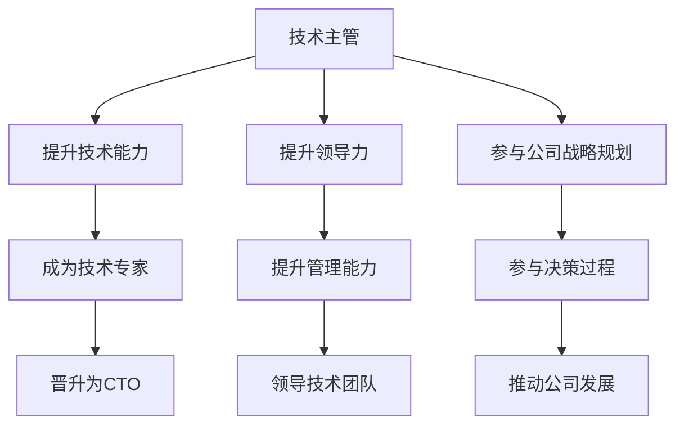

                 

# 从技术主管到CTO的职业发展策略

> 关键词：职业发展、技术主管、CTO、领导力、战略规划、技术能力、组织管理

> 摘要：本文旨在探讨技术主管如何通过提升自身的技术能力、领导力和战略规划能力，实现向CTO（首席技术官）的职业转变。文章首先介绍了技术主管和CTO的职责和区别，然后从个人能力提升、团队管理和组织战略三个方面展开讨论，最后推荐了一些实际操作方法和学习资源，以帮助读者顺利实现职业发展目标。

## 1. 背景介绍

### 1.1 目的和范围

本文旨在为技术主管提供一套完整的职业发展策略，帮助他们理解如何从技术领域的领导者成长为公司的首席技术官（CTO）。我们将探讨以下几个核心问题：

- 技术主管与CTO的职责和区别是什么？
- 技术主管需要具备哪些能力才能胜任CTO的角色？
- 如何在团队管理和组织战略方面提升自己的能力？
- 提供哪些实际操作方法和学习资源来支持职业发展？

### 1.2 预期读者

本文预期读者为以下几类：

- 正在担任技术主管，有意向晋升为CTO的技术领导者。
- 对技术管理领域感兴趣，希望深入了解CTO职责的IT从业者。
- 担任CTO或希望了解CTO角色和职责的企业高管。

### 1.3 文档结构概述

本文结构如下：

- 第1章：背景介绍，阐述本文的目的、预期读者和文档结构。
- 第2章：核心概念与联系，介绍技术主管和CTO的核心职责与联系。
- 第3章：核心算法原理 & 具体操作步骤，分析技术主管如何提升自身能力。
- 第4章：数学模型和公式 & 详细讲解 & 举例说明，提供具体的策略和方法。
- 第5章：项目实战：代码实际案例和详细解释说明，展示实际操作案例。
- 第6章：实际应用场景，讨论技术主管到CTO职业发展的应用场景。
- 第7章：工具和资源推荐，推荐学习资源和开发工具。
- 第8章：总结：未来发展趋势与挑战，展望职业发展前景。
- 第9章：附录：常见问题与解答，回答读者可能遇到的问题。
- 第10章：扩展阅读 & 参考资料，提供进一步学习的资源。

### 1.4 术语表

#### 1.4.1 核心术语定义

- 技术主管：负责团队的技术方向和项目管理的技术领导者。
- CTO（首席技术官）：负责公司技术战略、创新和技术架构的高管。
- 技术能力：指技术主管在特定技术领域的专业知识和技能。
- 领导力：指领导团队、管理项目和协调资源的能力。
- 战略规划：指制定公司技术发展目标和实现路径的过程。

#### 1.4.2 相关概念解释

- 技术领导力：技术主管在团队中展示的技术影响力和管理能力。
- 技术架构：公司在技术层面上的整体设计和组织结构。
- 技术路线图：公司未来技术发展的规划和目标。

#### 1.4.3 缩略词列表

- CTO：首席技术官
- IT：信息技术
- R&D：研究与开发
- PM：项目经理
- TD：技术总监

## 2. 核心概念与联系

在探讨技术主管到CTO的职业发展策略之前，我们需要明确两个角色的核心概念和它们之间的联系。

### 2.1 技术主管职责

技术主管的主要职责包括：

- 确定团队的技术方向和目标。
- 管理项目进度和质量，确保项目按时交付。
- 指导和培养团队成员，提升团队技术水平。
- 与其他部门沟通协作，确保项目顺利进行。

### 2.2 CTO职责

CTO的职责相较于技术主管更加广泛，包括：

- 制定公司技术战略，确保公司技术发展方向与业务目标一致。
- 领导技术研究与开发，推动技术创新和产品迭代。
- 管理技术团队，提升团队整体技术实力。
- 与公司高层决策者共同制定公司战略，提供技术方面的意见和建议。

### 2.3 技术主管与CTO的联系

技术主管与CTO之间的联系主要体现在以下几个方面：

- 技术能力：技术主管需要具备一定的技术能力，才能在团队中发挥领导作用。CTO则需要更加全面的技术视野和深度，能够从全局角度审视公司的技术战略。
- 领导力：技术主管需要具备领导力，管理团队并确保项目成功。CTO则需要更高的领导力，能够协调不同部门之间的资源，推动公司整体发展。
- 战略规划：技术主管需要制定团队的技术路线图，确保团队目标的实现。CTO则需要制定公司级的技术战略，与公司整体战略相一致。

### 2.4 Mermaid流程图

以下是一个简单的Mermaid流程图，展示了技术主管到CTO的职业发展路径：



## 3. 核心算法原理 & 具体操作步骤

### 3.1 技术主管如何提升技术能力

技术主管要提升技术能力，可以从以下几个方面着手：

- **持续学习**：定期参加技术会议、研讨会和培训，关注行业动态，学习新技术。
- **实践应用**：将理论知识应用到实际项目中，通过解决实际问题来提升技术水平。
- **代码审查**：定期进行代码审查，提升对代码质量的要求和把控能力。
- **技术交流**：与技术同行交流，分享经验，获取新的见解和思路。

### 3.2 领导力和管理能力的提升

技术主管提升领导力和管理能力的方法包括：

- **领导力培养**：参加领导力培训课程，学习有效的沟通、决策和激励团队成员的技巧。
- **管理实践**：在实际工作中积累管理经验，不断提升自己的管理能力。
- **团队建设**：关注团队成员的个人发展，提供培训和指导，提升团队整体战斗力。
- **反馈与改进**：定期进行团队反馈，了解团队成员的意见和建议，不断改进管理方法。

### 3.3 战略规划和决策能力的提升

技术主管提升战略规划和决策能力的方法包括：

- **参与决策**：积极参与公司战略规划，了解业务需求和公司发展方向。
- **数据驱动**：利用数据分析和工具，支持决策过程，提高决策的科学性和准确性。
- **风险评估**：对项目进行风险评估，制定应对策略，确保项目顺利实施。
- **市场洞察**：关注市场趋势和竞争对手，为公司的技术战略提供参考。

### 3.4 伪代码示例

以下是一个简单的伪代码示例，展示技术主管如何通过学习和实践提升自身能力：

```python
def enhance_skill技术水平:
    while True:
        learn_new_technology()  # 学习新技术
        practice_in_project()   # 在项目中实践
        code_review()          # 进行代码审查
        share_experience()     # 分享经验

def improve_leadership力和管理能力:
    while True:
        attend_leadership_training()  # 参加领导力培训
        gain_management_experience()  # 积累管理经验
        build_team()                # 建设团队
        receive_feedback()          # 收集反馈

def improve_strategy_and_decision_making能力:
    while True:
        participate_in_company_strategy()  # 参与公司战略规划
        use_data_for_decision_making()     # 利用数据分析支持决策
        assess_risk_in_projects()        # 对项目进行风险评估
        analyze_market_trends()         # 分析市场趋势
```

## 4. 数学模型和公式 & 详细讲解 & 举例说明

### 4.1 数学模型与公式

在技术主管的职业发展中，一些数学模型和公式可以帮助他们更好地理解和管理技术团队。以下是一个简单的数学模型，用于评估团队成员的技术能力提升：

$$
T = f(L, P, E)
$$

其中，$T$ 代表团队成员的技术能力，$L$ 代表学习（Learning），$P$ 代表实践（Practice），$E$ 代表经验（Experience）。

### 4.2 详细讲解

- **学习（Learning）**：技术主管需要关注团队成员的学习进度，确保他们能够掌握必要的知识和技能。学习可以通过参加培训、阅读技术书籍和在线课程来实现。
- **实践（Practice）**：将学习到的知识应用到实际项目中，通过解决具体问题来提升技术能力。实践可以是内部项目，也可以是参与开源项目。
- **经验（Experience）**：在项目中积累经验，通过不断地实践和反思来提升自身能力。经验是技术能力提升的关键因素。

### 4.3 举例说明

假设一个技术主管有一个团队成员，初始技术能力为 $T_0$。通过以下方法，可以逐步提升其技术能力：

- **学习（Learning）**：参加一个月的技术培训，学习一门新技术，使得技术能力提升到 $T_1 = T_0 + 0.2$。
- **实践（Practice）**：在项目中实践新技能，通过完成一个实际项目，使得技术能力进一步提升到 $T_2 = T_1 + 0.3$。
- **经验（Experience）**：在后续的项目中积累经验，通过不断反思和改进，使得技术能力最终达到 $T_3 = T_2 + 0.4$。

通过这个简单的模型，我们可以看到，学习、实践和经验共同作用，可以显著提升团队成员的技术能力。

## 5. 项目实战：代码实际案例和详细解释说明

### 5.1 开发环境搭建

为了演示技术主管如何通过提升自身能力实现职业发展，我们以一个简单的Web应用项目为例，介绍如何搭建开发环境。

1. 安装Node.js：从 [Node.js官网](https://nodejs.org/) 下载并安装Node.js。
2. 安装Express框架：通过npm（Node.js的包管理器）安装Express框架。

```bash
npm install express
```

3. 创建项目文件夹并初始化项目。

```bash
mkdir my-web-app
cd my-web-app
npm init -y
```

4. 创建一个简单的`index.js`文件。

```javascript
const express = require('express');
const app = express();

app.get('/', (req, res) => {
  res.send('Hello, World!');
});

const PORT = process.env.PORT || 3000;
app.listen(PORT, () => {
  console.log(`Server is running on port ${PORT}`);
});
```

5. 运行项目。

```bash
node index.js
```

### 5.2 源代码详细实现和代码解读

以下是一个简单的Web应用项目的源代码实现，以及详细的代码解读。

```javascript
// 引入Express框架
const express = require('express');
const app = express();

// 定义一个路由处理函数
app.get('/', (req, res) => {
  // 请求处理逻辑
  res.send('Hello, World!');
});

// 定义另一个路由处理函数
app.get('/about', (req, res) => {
  res.send('About Page');
});

// 配置服务器端口
const PORT = process.env.PORT || 3000;

// 启动服务器
app.listen(PORT, () => {
  console.log(`Server is running on port ${PORT}`);
});
```

#### 5.2.1 代码解读

- **引入Express框架**：使用`require()`函数引入Express框架。
- **创建应用实例**：使用`express()`函数创建一个Express应用实例。
- **定义路由处理函数**：使用`app.get()`方法定义一个处理GET请求的路由处理函数。在函数中，我们使用`res.send()`方法响应客户端请求。
- **配置服务器端口**：使用`process.env.PORT`获取环境变量中的端口，如果没有设置，则默认使用3000端口。
- **启动服务器**：使用`app.listen()`方法启动服务器，并打印启动信息到控制台。

### 5.3 代码解读与分析

1. **项目结构**：一个简单的Web应用项目通常包含一个`package.json`文件，用于管理项目依赖和配置，以及一个主文件（如`index.js`或`app.js`），用于定义应用的逻辑。
2. **框架选择**：选择一个合适的Web框架（如Express）可以大大简化开发过程。Express是一个流行的Node.js Web框架，提供了一系列方便的功能和中间件。
3. **路由处理**：通过定义路由处理函数，我们可以根据不同的URL路径处理客户端请求。这对于实现动态页面和API非常重要。
4. **响应客户端请求**：使用`res.send()`方法可以发送响应给客户端。Express提供了多种响应方法，如`res.send()`, `res.json()`, `res.redirect()`等，以满足不同的需求。
5. **启动服务器**：使用`app.listen()`方法可以启动服务器，并在指定的端口上监听HTTP请求。

通过这个简单的项目，我们可以看到技术主管需要掌握的基本技能，包括Node.js、Express框架、HTTP请求处理等。这些技能是成为一名合格的CTO的基础。

## 6. 实际应用场景

技术主管到CTO的职业发展策略在实际应用场景中具有重要价值。以下是一些具体的实际应用场景：

### 6.1 项目管理

技术主管需要负责项目规划、资源分配和进度控制。通过提升自身的领导力和项目管理能力，技术主管可以更好地协调团队成员的工作，确保项目按时、按质、按量完成。

### 6.2 技术决策

CTO在技术决策中扮演关键角色，需要考虑技术趋势、市场需求和公司战略。技术主管通过参与技术决策，提升自身的技术视野和战略思维，为公司的长远发展提供有力支持。

### 6.3 团队建设

技术主管负责团队的建设和培养，需要关注团队成员的个人成长和发展。通过提升自身的领导力和管理能力，技术主管可以打造一支高效的团队，提升整体战斗力。

### 6.4 业务协同

CTO需要与业务部门紧密协作，了解业务需求，为公司的业务发展提供技术支持。技术主管通过提升自身的业务洞察力和沟通能力，可以更好地协调技术部门与业务部门之间的关系。

### 6.5 技术战略

技术主管需要参与公司的技术战略规划，制定公司的技术发展方向。通过提升自身的战略思维和决策能力，技术主管可以为公司的技术发展提供清晰的路线图和实现路径。

### 6.6 创新驱动

技术主管需要关注技术创新，推动公司的技术进步和产品迭代。通过提升自身的技术能力和创新思维，技术主管可以推动公司实现技术突破，保持市场竞争力。

## 7. 工具和资源推荐

### 7.1 学习资源推荐

#### 7.1.1 书籍推荐

1. 《CTO实战：如何领导技术团队与创造商业价值》
2. 《技术领导力：如何构建高效的技术团队》
3. 《敏捷革命：如何快速响应市场变化》

#### 7.1.2 在线课程

1. Coursera上的《领导力与团队管理》
2. Udemy上的《CTO实战：从技术专家到商业领袖》
3. Pluralsight上的《技术项目管理：从入门到精通》

#### 7.1.3 技术博客和网站

1. HackerRank
2. Medium上的技术管理专栏
3. InfoQ

### 7.2 开发工具框架推荐

#### 7.2.1 IDE和编辑器

1. Visual Studio Code
2. IntelliJ IDEA
3. WebStorm

#### 7.2.2 调试和性能分析工具

1. Chrome DevTools
2. Firefox Developer Tools
3. New Relic

#### 7.2.3 相关框架和库

1. React
2. Angular
3. Vue.js

### 7.3 相关论文著作推荐

#### 7.3.1 经典论文

1. 《领导者的战略思维》
2. 《敏捷开发：通过迭代和增量方法提高软件质量》
3. 《技术战略与商业成功》

#### 7.3.2 最新研究成果

1. 《人工智能与领导力：如何利用AI提升企业竞争力》
2. 《区块链技术：重构未来商业模式》
3. 《云计算：如何利用云计算实现企业数字化转型》

#### 7.3.3 应用案例分析

1. 《阿里巴巴的数字化转型之路》
2. 《腾讯的技术创新与业务发展》
3. 《特斯拉的AI技术与市场布局》

## 8. 总结：未来发展趋势与挑战

随着技术的不断进步和市场竞争的加剧，技术主管到CTO的职业发展策略将面临新的挑战和机遇。以下是一些未来发展趋势和挑战：

### 8.1 发展趋势

- **数字化转型**：越来越多的企业将数字化转型作为战略重点，技术主管和CTO需要具备更强的数字化能力和战略思维。
- **AI与大数据**：人工智能和大数据技术的快速发展，对技术主管和CTO的技术视野和创新能力提出了更高要求。
- **敏捷管理**：敏捷开发和管理理念的普及，要求技术主管和CTO具备更灵活的管理能力和团队建设能力。
- **全球化**：企业的全球化运营，需要技术主管和CTO具备跨文化沟通和协调能力。

### 8.2 挑战

- **技术复杂性**：随着技术复杂性的增加，技术主管和CTO需要不断学习和更新自己的知识体系。
- **团队管理**：团队管理难度增加，技术主管和CTO需要具备更高的领导力和管理能力。
- **战略决策**：在快速变化的市场环境中，技术主管和CTO需要具备更强的战略决策能力。
- **资源协调**：企业资源的有限性，要求技术主管和CTO在资源分配和协调方面具有更高的能力。

## 9. 附录：常见问题与解答

### 9.1 如何提升技术能力？

- **持续学习**：参加技术培训、研讨会和在线课程，关注行业动态，学习新技术。
- **实践应用**：将所学知识应用到实际项目中，通过解决实际问题来提升技术水平。
- **代码审查**：定期进行代码审查，提升对代码质量的要求和把控能力。
- **技术交流**：与技术同行交流，分享经验，获取新的见解和思路。

### 9.2 如何提升领导力和管理能力？

- **领导力培养**：参加领导力培训课程，学习有效的沟通、决策和激励团队成员的技巧。
- **管理实践**：在实际工作中积累管理经验，不断提升自己的管理能力。
- **团队建设**：关注团队成员的个人发展，提供培训和指导，提升团队整体战斗力。
- **反馈与改进**：定期进行团队反馈，了解团队成员的意见和建议，不断改进管理方法。

### 9.3 如何提升战略规划和决策能力？

- **参与决策**：积极参与公司战略规划，了解业务需求和公司发展方向。
- **数据驱动**：利用数据分析和工具，支持决策过程，提高决策的科学性和准确性。
- **风险评估**：对项目进行风险评估，制定应对策略，确保项目顺利实施。
- **市场洞察**：关注市场趋势和竞争对手，为公司的技术战略提供参考。

## 10. 扩展阅读 & 参考资料

- 《CTO实战：如何领导技术团队与创造商业价值》
- 《技术领导力：如何构建高效的技术团队》
- 《敏捷革命：如何快速响应市场变化》
- 《Node.js实战：构建可扩展的Web应用》
- 《React实战：构建高效的前端应用》
- 《领导者的战略思维》
- 《敏捷开发：通过迭代和增量方法提高软件质量》
- 《技术战略与商业成功》
- 《人工智能与领导力：如何利用AI提升企业竞争力》
- 《区块链技术：重构未来商业模式》
- 《云计算：如何利用云计算实现企业数字化转型》
- 《阿里巴巴的数字化转型之路》
- 《腾讯的技术创新与业务发展》
- 《特斯拉的AI技术与市场布局》

## 作者

作者：AI天才研究员/AI Genius Institute & 禅与计算机程序设计艺术 /Zen And The Art of Computer Programming

