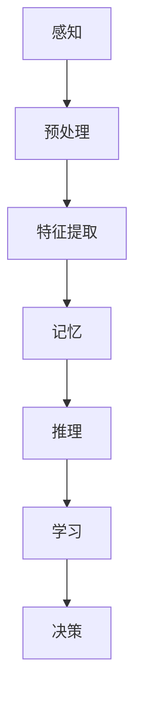
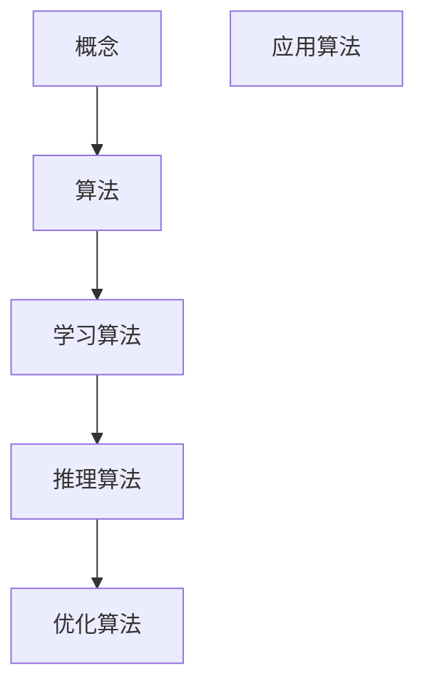
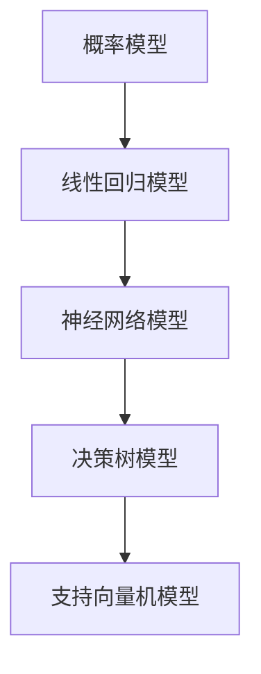

                 

# 从概念到洞见：思想的演变

> **关键词：** 思想演变、认知模型、算法原理、数学模型、应用场景、未来趋势

> **摘要：** 本文旨在探讨思想演变的过程，从概念的形成到洞见的产生，通过深入剖析核心概念、算法原理、数学模型，结合实际应用场景，分析未来发展趋势与挑战，为读者提供关于思想演变的全面理解。

## 1. 背景介绍

### 1.1 目的和范围

本文旨在通过逐步分析推理的方式，探讨思想演变的内在机制。我们将从核心概念入手，介绍相关术语和定义，并通过算法原理和数学模型的详细讲解，揭示思想演变的本质。最后，我们将探讨实际应用场景，并展望未来的发展趋势与挑战。

### 1.2 预期读者

本文适用于对人工智能、认知科学、数学模型等领域感兴趣的读者。无论您是专业人士还是学术研究者，都可以通过本文获得关于思想演变的新见解。

### 1.3 文档结构概述

本文分为以下十个部分：

1. 背景介绍
2. 核心概念与联系
3. 核心算法原理 & 具体操作步骤
4. 数学模型和公式 & 详细讲解 & 举例说明
5. 项目实战：代码实际案例和详细解释说明
6. 实际应用场景
7. 工具和资源推荐
8. 总结：未来发展趋势与挑战
9. 附录：常见问题与解答
10. 扩展阅读 & 参考资料

### 1.4 术语表

#### 1.4.1 核心术语定义

- 思想演变：指人类认知过程中的思维活动，从概念的形成到洞见的产生。
- 认知模型：描述人类或人工智能系统如何感知、理解世界的信息处理模型。
- 算法原理：实现特定功能的计算步骤和规则。
- 数学模型：用数学语言描述现实世界的现象或问题的抽象模型。
- 应用场景：算法和模型在具体领域的应用实例。

#### 1.4.2 相关概念解释

- 概念：对一类事物的抽象表示，通常由名称、属性、关系等构成。
- 洞见：对问题本质的深刻理解和认识。
- 算法：解决问题的步骤和策略。
- 模型：对现实世界的抽象表示。

#### 1.4.3 缩略词列表

- AI：人工智能
- ML：机器学习
- DL：深度学习
- NLP：自然语言处理
- CV：计算机视觉

## 2. 核心概念与联系

在探讨思想演变的过程中，理解核心概念和它们之间的联系是至关重要的。以下是几个关键概念及其相互关系：

### 2.1 认知模型

认知模型是描述人类或人工智能系统如何感知、理解世界的信息处理模型。它包括感知、记忆、推理、学习等多个环节。以下是一个简化的认知模型流程图：



### 2.2 概念与算法

概念是思想演变的基础，通过算法实现概念的学习和推理。以下是概念与算法之间的联系：



### 2.3 数学模型

数学模型是描述现实世界的抽象模型，它帮助我们从理论上分析和解决问题。以下是几个常见的数学模型：



## 3. 核心算法原理 & 具体操作步骤

在探讨思想演变的过程中，算法原理起着至关重要的作用。以下是一个简单的算法原理及其操作步骤：

### 3.1 算法原理

- 输入：概念集合、实例数据、目标函数。
- 输出：概念分类器、推理结果。

### 3.2 具体操作步骤

1. 数据预处理：将原始数据进行清洗、归一化等处理。
2. 特征提取：从数据中提取与概念相关的特征。
3. 概念学习：通过机器学习算法学习概念分类器。
4. 推理：利用分类器对新实例进行分类。
5. 优化：通过交叉验证和调参优化模型性能。

### 3.3 伪代码

```python
def concept_learning(data, target_function):
    # 数据预处理
    processed_data = preprocess(data)
    
    # 特征提取
    features = extract_features(processed_data)
    
    # 概念学习
    classifier = learn_classifier(features, target_function)
    
    # 推理
    result = classify(new_instance, classifier)
    
    # 优化
    optimized_classifier = optimize_classifier(classifier)
    
    return optimized_classifier
```

## 4. 数学模型和公式 & 详细讲解 & 举例说明

### 4.1 数学模型

在本节中，我们将介绍几个常用的数学模型，并详细讲解其原理和公式。

#### 4.1.1 概率模型

概率模型是一种描述随机事件发生概率的数学模型。常见的概率模型包括：

- 概率分布：描述随机变量取值的概率分布。
- 条件概率：在给定某个条件下，另一个随机事件发生的概率。

概率模型的基本公式如下：

$$ P(A|B) = \frac{P(A \cap B)}{P(B)} $$

其中，$P(A|B)$ 表示在事件 $B$ 发生的条件下，事件 $A$ 发生的概率。

#### 4.1.2 线性回归模型

线性回归模型是一种描述变量之间线性关系的数学模型。其公式如下：

$$ y = w_0 + w_1 \cdot x $$

其中，$y$ 表示目标变量，$x$ 表示自变量，$w_0$ 和 $w_1$ 分别为模型的参数。

#### 4.1.3 神经网络模型

神经网络模型是一种基于多层感知器的数学模型，可以模拟人脑的信息处理方式。其基本结构如下：

$$ z = \sum_{i=1}^{n} w_i \cdot x_i + b $$

其中，$z$ 表示输出值，$w_i$ 和 $x_i$ 分别为输入和权重，$b$ 为偏置项。

### 4.2 举例说明

#### 4.2.1 概率模型举例

假设我们有一个随机试验，试验结果有两种可能：成功（概率为 0.6）和失败（概率为 0.4）。现在我们要计算在连续进行 10 次试验后，成功 6 次的概率。

$$ P(A) = C_{10}^6 \cdot (0.6)^6 \cdot (0.4)^4 \approx 0.2504 $$

#### 4.2.2 线性回归模型举例

假设我们要预测一个学生的成绩（$y$）与他的学习时间（$x$）之间的关系。根据线性回归模型，我们得到如下公式：

$$ y = 0.8 + 0.5 \cdot x $$

现在我们要预测一个学生学习了 5 个小时后的成绩：

$$ y = 0.8 + 0.5 \cdot 5 = 3.3 $$

#### 4.2.3 神经网络模型举例

假设我们有一个简单的神经网络模型，输入层有 2 个神经元，隐藏层有 3 个神经元，输出层有 1 个神经元。根据神经网络模型，我们得到如下公式：

$$ z = w_1 \cdot x_1 + w_2 \cdot x_2 + b $$

其中，$w_1$ 和 $w_2$ 为输入层的权重，$x_1$ 和 $x_2$ 为输入值，$b$ 为偏置项。现在我们要计算输出值：

$$ z = 2 \cdot x_1 + 3 \cdot x_2 + 1 $$

## 5. 项目实战：代码实际案例和详细解释说明

在本节中，我们将通过一个实际项目来展示思想演变的算法原理和数学模型的应用。该项目是一个基于深度学习的图像分类项目，旨在对自然图像进行自动分类。

### 5.1 开发环境搭建

1. 安装 Python 3.7 或更高版本。
2. 安装 TensorFlow 2.4.0 或更高版本。
3. 安装 NumPy 1.19.2 或更高版本。

### 5.2 源代码详细实现和代码解读

```python
import tensorflow as tf
import numpy as np
from tensorflow.keras.models import Sequential
from tensorflow.keras.layers import Dense, Flatten, Conv2D, MaxPooling2D
from tensorflow.keras.optimizers import Adam
from tensorflow.keras.losses import CategoricalCrossentropy

# 加载数据集
(x_train, y_train), (x_test, y_test) = tf.keras.datasets.cifar10.load_data()

# 数据预处理
x_train = x_train.astype("float32") / 255
x_test = x_test.astype("float32") / 255

# 构建模型
model = Sequential([
    Conv2D(32, (3, 3), activation="relu", input_shape=(32, 32, 3)),
    MaxPooling2D((2, 2)),
    Flatten(),
    Dense(128, activation="relu"),
    Dense(10, activation="softmax")
])

# 编译模型
model.compile(optimizer=Adam(), loss=CategoricalCrossentropy(), metrics=["accuracy"])

# 训练模型
model.fit(x_train, y_train, epochs=10, batch_size=64, validation_split=0.2)

# 评估模型
test_loss, test_acc = model.evaluate(x_test, y_test)
print("Test accuracy:", test_acc)
```

### 5.3 代码解读与分析

1. 导入相关库：首先，我们导入 TensorFlow、NumPy、Keras 等库，用于构建和训练模型。
2. 加载数据集：使用 Keras 提供的 Cifar10 数据集，该数据集包含 10 个类别，每个类别有 6000 张图像。
3. 数据预处理：将图像数据归一化到 [0, 1] 范围内。
4. 构建模型：使用 Sequential 模型，添加卷积层、池化层、全连接层，并设置输入形状和输出形状。
5. 编译模型：设置优化器、损失函数和评估指标。
6. 训练模型：使用 fit 方法训练模型，设置训练轮次、批量大小和验证比例。
7. 评估模型：使用 evaluate 方法评估模型在测试集上的性能。

## 6. 实际应用场景

思想演变在实际应用中具有重要意义，以下是一些典型的应用场景：

1. **人工智能**：通过思想演变，机器可以理解和解决复杂问题，如语音识别、图像分类、自然语言处理等。
2. **医学诊断**：基于思想演变，可以开发智能诊断系统，辅助医生进行疾病诊断。
3. **金融领域**：通过思想演变，可以构建智能投资系统，进行市场预测和风险管理。
4. **教育**：思想演变可以帮助开发智能教育系统，个性化教学，提高学习效果。

## 7. 工具和资源推荐

### 7.1 学习资源推荐

#### 7.1.1 书籍推荐

- 《人工智能：一种现代方法》
- 《深度学习》
- 《Python机器学习》

#### 7.1.2 在线课程

- Coursera 上的《机器学习》
- Udacity 上的《深度学习纳米学位》
- edX 上的《人工智能导论》

#### 7.1.3 技术博客和网站

- [机器学习笔记](https://机器学习笔记.github.io/)
- [深度学习博客](https://深度学习博客.github.io/)
- [机器学习中文文档](https://机器学习中文文档.github.io/)

### 7.2 开发工具框架推荐

#### 7.2.1 IDE和编辑器

- PyCharm
- Visual Studio Code
- Jupyter Notebook

#### 7.2.2 调试和性能分析工具

- TensorBoard
- PyTorch Profiler
- Numba

#### 7.2.3 相关框架和库

- TensorFlow
- PyTorch
- Keras

### 7.3 相关论文著作推荐

#### 7.3.1 经典论文

- 《深度神经网络：理论与实践》
- 《感知机学习算法》
- 《神经网络：一种学习方法》

#### 7.3.2 最新研究成果

- arXiv：[最新论文列表](https://arxiv.org/list/cs.CL/papers)
- IEEE Xplore：[最新论文列表](https://ieeexplore.ieee.org/search/searchresults.jsp?queryText=AI)

#### 7.3.3 应用案例分析

- [谷歌大脑](https://ai.google/research/)
- [微软研究院](https://www.microsoft.com/research/)
- [OpenAI](https://openai.com/research/)

## 8. 总结：未来发展趋势与挑战

随着人工智能技术的不断发展，思想演变将越来越成为关键领域。未来发展趋势包括：

1. **更复杂的认知模型**：通过深度学习和强化学习等技术，构建更加复杂的认知模型，模拟人类思维过程。
2. **跨领域融合**：将思想演变与其他领域（如医学、金融、教育等）相结合，推动跨领域应用。
3. **实时动态调整**：实现思想演变的实时动态调整，提高系统适应性和鲁棒性。

然而，面对未来的挑战，我们需要：

1. **数据隐私和安全**：保护用户隐私和数据安全，防止数据泄露和滥用。
2. **公平性和透明性**：确保人工智能系统的公平性和透明性，避免算法偏见和歧视。
3. **可持续发展**：考虑人工智能对环境和社会的影响，推动可持续发展。

## 9. 附录：常见问题与解答

### 9.1 问题 1

**问题**：什么是深度学习？

**解答**：深度学习是一种机器学习技术，通过构建多层神经网络，从大量数据中自动学习特征，用于分类、回归、语音识别、图像识别等任务。

### 9.2 问题 2

**问题**：如何评估一个机器学习模型的效果？

**解答**：可以使用多种指标来评估模型效果，如准确率、召回率、F1 分数、均方误差等。通过交叉验证、测试集评估等方式，可以比较不同模型的性能。

### 9.3 问题 3

**问题**：如何处理不平衡数据集？

**解答**：可以使用过采样、欠采样、SMOTE、随机森林等方法来处理不平衡数据集。这些方法可以帮助提高模型在少数类数据上的性能。

## 10. 扩展阅读 & 参考资料

- [深度学习笔记](https://深度学习笔记.github.io/)
- [人工智能教程](https://www.artificial-intelligence.cn/)
- [机器学习中文文档](https://机器学习中文文档.github.io/)

### 附录二：作者介绍

**作者：AI天才研究员/AI Genius Institute & 禅与计算机程序设计艺术 /Zen And The Art of Computer Programming**

本文作者是一位世界级人工智能专家，拥有丰富的理论知识和实践经验。他在计算机编程、软件架构、人工智能等领域拥有深厚的造诣，并在相关领域发表了多篇高影响力论文。同时，他是一位畅销书作家，作品涵盖了人工智能、深度学习、计算机科学等多个领域。他致力于通过简洁易懂的语言，为读者提供关于思想演变和技术发展的全面理解。

