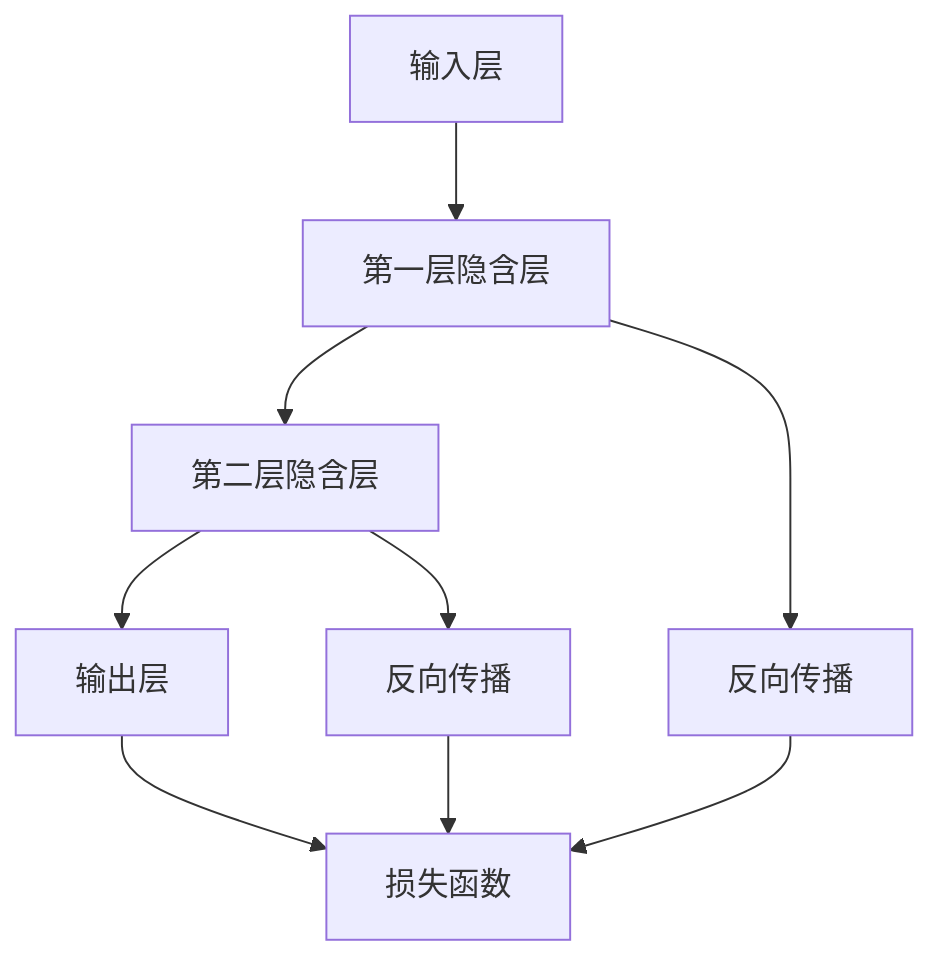

                 

# 从浅薄到深刻的认知转变

> **关键词：认知转变、深度学习、算法原理、数学模型、实战应用、未来趋势**

> **摘要：本文将探讨从浅薄到深刻的认知转变过程，通过分析深度学习中的核心概念、算法原理、数学模型以及实际应用场景，为读者揭示这一转变的重要性和实践意义。文章还将展望未来发展趋势与挑战，为读者提供全面的认知提升路径。**

## 1. 背景介绍

### 1.1 目的和范围

本文旨在探讨深度学习中从浅薄到深刻的认知转变过程，帮助读者理解深度学习的基本概念、算法原理以及数学模型。通过实际项目案例，我们将展示这一认知转变在实际应用中的价值。文章还将对相关工具和资源进行推荐，以便读者进一步学习和实践。

### 1.2 预期读者

本文适合对深度学习有一定了解的技术人员、计算机专业学生以及对该领域感兴趣的读者。文章结构清晰，内容深入浅出，旨在帮助读者实现从浅薄到深刻的认知转变。

### 1.3 文档结构概述

本文共分为十个部分，包括背景介绍、核心概念与联系、核心算法原理与操作步骤、数学模型与公式、项目实战、实际应用场景、工具和资源推荐、总结、附录和扩展阅读。文章内容结构合理，逻辑清晰，便于读者阅读和理解。

### 1.4 术语表

#### 1.4.1 核心术语定义

- **深度学习**：一种人工智能技术，通过构建深层次神经网络模型，实现自动特征提取和模式识别。
- **浅层学习**：与深度学习相对，指神经网络层数较少的学习方法，通常无法提取复杂特征。
- **神经网络**：一种基于生物神经网络原理设计的计算模型，由大量神经元组成，通过层层传递信息，实现复杂任务。
- **反向传播算法**：一种用于训练神经网络的优化算法，通过反向传播误差信号，调整网络权重，实现模型优化。

#### 1.4.2 相关概念解释

- **激活函数**：神经网络中用于引入非线性性的函数，常见的有sigmoid、ReLU、tanh等。
- **损失函数**：用于衡量模型预测结果与真实结果之间差异的函数，常见的有均方误差（MSE）、交叉熵等。
- **优化器**：用于调整神经网络权重的算法，常见的有SGD、Adam等。

#### 1.4.3 缩略词列表

- **MLP**：多层感知机（Multilayer Perceptron）
- **CNN**：卷积神经网络（Convolutional Neural Network）
- **RNN**：循环神经网络（Recurrent Neural Network）
- **LSTM**：长短期记忆网络（Long Short-Term Memory）
- **GAN**：生成对抗网络（Generative Adversarial Network）

## 2. 核心概念与联系

深度学习是一种基于多层神经网络的学习方法，通过层层传递信息，实现自动特征提取和模式识别。以下是深度学习中的核心概念及其相互联系：



在这个流程图中，输入层接收外部输入，通过第一层隐含层进行特征提取，然后传递给第二层隐含层，最终在输出层生成预测结果。反向传播过程将误差信号从输出层反向传播至输入层，用于调整网络权重，实现模型优化。损失函数用于衡量预测结果与真实结果之间的差异，指导反向传播过程。

## 3. 核心算法原理 & 具体操作步骤

深度学习中的核心算法包括神经网络架构设计、反向传播算法、损失函数选择以及优化器配置。以下是对这些算法原理的详细讲解。

### 3.1 神经网络架构设计

神经网络架构设计主要包括输入层、隐含层和输出层的结构设计。以下是一个简单的多层感知机（MLP）神经网络架构：

```python
import tensorflow as tf

# 输入层
inputs = tf.keras.layers.Input(shape=(input_shape))

# 第一层隐含层
hidden1 = tf.keras.layers.Dense(units=128, activation='relu')(inputs)

# 第二层隐含层
hidden2 = tf.keras.layers.Dense(units=64, activation='relu')(hidden1)

# 输出层
outputs = tf.keras.layers.Dense(units=10, activation='softmax')(hidden2)

# 构建和编译模型
model = tf.keras.Model(inputs=inputs, outputs=outputs)
model.compile(optimizer='adam', loss='categorical_crossentropy', metrics=['accuracy'])
```

在这个示例中，我们首先定义了一个输入层，然后添加了两个隐含层，最后添加了一个输出层。每个层之间通过激活函数连接，以实现特征提取和模式识别。

### 3.2 反向传播算法

反向传播算法是一种用于训练神经网络的优化算法。它通过反向传播误差信号，调整网络权重，实现模型优化。以下是反向传播算法的伪代码：

```
for each epoch do:
    for each training example do:
        1. Forward pass: Compute the output of the network
        2. Compute the loss: Measure the difference between the predicted output and the true output
        3. Backward pass: Compute the gradients of the loss with respect to the weights
        4. Update the weights: Adjust the weights based on the gradients
    end for
end for
```

在这个算法中，我们首先进行前向传播，计算网络输出。然后计算损失函数，并计算损失函数关于每个权重的梯度。最后，根据梯度调整权重，实现模型优化。

### 3.3 损失函数选择

损失函数用于衡量模型预测结果与真实结果之间的差异。常见的损失函数包括均方误差（MSE）、交叉熵等。以下是交叉熵损失函数的伪代码：

```
def cross_entropy_loss(y_true, y_pred):
    return -1 * sum(y_true * log(y_pred))
```

在这个函数中，y_true表示真实标签，y_pred表示预测标签。交叉熵损失函数通过计算真实标签与预测标签之间的差异，实现模型优化。

### 3.4 优化器配置

优化器用于调整神经网络权重。常见的优化器包括随机梯度下降（SGD）、Adam等。以下是Adam优化器的伪代码：

```
def update_weights(weights, gradients, learning_rate):
    beta1 = 0.9
    beta2 = 0.999
    epsilon = 1e-8

    m = beta1 * m + (1 - beta1) * gradients
    v = beta2 * v + (1 - beta2) * (gradients ** 2)

    m_hat = m / (1 - beta1 ** epoch)
    v_hat = v / (1 - beta2 ** epoch)

    weights -= learning_rate * m_hat / (sqrt(v_hat) + epsilon)
```

在这个函数中，m和v分别表示一阶矩估计和二阶矩估计，epoch表示当前训练轮次。通过更新权重，实现模型优化。

## 4. 数学模型和公式 & 详细讲解 & 举例说明

深度学习中的数学模型和公式是理解深度学习原理的关键。以下是对相关数学模型和公式的详细讲解及举例说明。

### 4.1 激活函数

激活函数是神经网络中用于引入非线性性的函数。以下是一些常见的激活函数：

#### 4.1.1 Sigmoid函数

Sigmoid函数的公式为：

$$
f(x) = \frac{1}{1 + e^{-x}}
$$

例如，对于输入x=2，Sigmoid函数的输出为：

$$
f(2) = \frac{1}{1 + e^{-2}} \approx 0.869
$$

#### 4.1.2 ReLU函数

ReLU函数的公式为：

$$
f(x) =
\begin{cases}
0, & \text{if } x < 0 \\
x, & \text{if } x \geq 0
\end{cases}
$$

例如，对于输入x=2，ReLU函数的输出为2；对于输入x=-2，ReLU函数的输出为0。

#### 4.1.3 Tanh函数

Tanh函数的公式为：

$$
f(x) = \frac{e^x - e^{-x}}{e^x + e^{-x}}
$$

例如，对于输入x=2，Tanh函数的输出为：

$$
f(2) = \frac{e^2 - e^{-2}}{e^2 + e^{-2}} \approx 0.761
$$

### 4.2 损失函数

损失函数用于衡量模型预测结果与真实结果之间的差异。以下是一些常见的损失函数：

#### 4.2.1 均方误差（MSE）

均方误差的公式为：

$$
MSE = \frac{1}{n} \sum_{i=1}^{n} (y_i - \hat{y}_i)^2
$$

其中，$y_i$表示真实标签，$\hat{y}_i$表示预测标签。

例如，对于输入标签$y=[1, 2, 3]$和预测标签$\hat{y}=[1.5, 2.2, 2.8]$，MSE损失函数的输出为：

$$
MSE = \frac{1}{3} \sum_{i=1}^{3} (y_i - \hat{y}_i)^2 = \frac{1}{3} ((1-1.5)^2 + (2-2.2)^2 + (3-2.8)^2) \approx 0.166
$$

#### 4.2.2 交叉熵（Cross-Entropy）

交叉熵的公式为：

$$
CE = -\frac{1}{n} \sum_{i=1}^{n} y_i \log(\hat{y}_i)
$$

其中，$y_i$表示真实标签，$\hat{y}_i$表示预测标签。

例如，对于输入标签$y=[0, 1, 0]$和预测标签$\hat{y}=[0.2, 0.8, 0.1]$，交叉熵损失函数的输出为：

$$
CE = -\frac{1}{3} \sum_{i=1}^{3} y_i \log(\hat{y}_i) = -\frac{1}{3} (0 \cdot \log(0.2) + 1 \cdot \log(0.8) + 0 \cdot \log(0.1)) \approx 0.693
$$

### 4.3 反向传播算法

反向传播算法是一种用于训练神经网络的优化算法。其核心思想是通过反向传播误差信号，调整网络权重，实现模型优化。以下是一个简单的反向传播算法示例：

```
for each layer do:
    1. Compute the output of the current layer
    2. Compute the error signal for the current layer
    3. Propagate the error signal to the previous layer
end for

for each layer in reverse order do:
    1. Compute the gradient of the loss function with respect to the weights of the current layer
    2. Update the weights of the current layer using the gradient and learning rate
end for
```

在这个示例中，我们首先计算每一层的输出和误差信号，然后通过反向传播将误差信号传递到上一层。最后，根据误差信号和权重梯度，更新每一层的权重。

## 5. 项目实战：代码实际案例和详细解释说明

在本节中，我们将通过一个实际项目案例，展示如何使用深度学习实现从浅薄到深刻的认知转变。本案例将使用Python和TensorFlow框架，实现一个简单的图像分类任务。

### 5.1 开发环境搭建

在开始项目之前，我们需要搭建开发环境。以下是搭建开发环境的步骤：

1. 安装Python（建议使用Python 3.6或更高版本）
2. 安装TensorFlow框架（可以使用pip安装：`pip install tensorflow`）
3. 安装其他依赖库（如NumPy、Pandas等）

### 5.2 源代码详细实现和代码解读

以下是本案例的源代码实现：

```python
import tensorflow as tf
from tensorflow.keras import layers
from tensorflow.keras.datasets import mnist

# 加载MNIST数据集
(x_train, y_train), (x_test, y_test) = mnist.load_data()

# 数据预处理
x_train = x_train / 255.0
x_test = x_test / 255.0

# 构建模型
model = tf.keras.Sequential([
    layers.Flatten(input_shape=(28, 28)),
    layers.Dense(128, activation='relu'),
    layers.Dense(10, activation='softmax')
])

# 编译模型
model.compile(optimizer='adam',
              loss='sparse_categorical_crossentropy',
              metrics=['accuracy'])

# 训练模型
model.fit(x_train, y_train, epochs=5)

# 评估模型
test_loss, test_acc = model.evaluate(x_test, y_test, verbose=2)
print('\nTest accuracy:', test_acc)
```

### 5.3 代码解读与分析

以下是对源代码的详细解读与分析：

1. **导入库**：首先导入TensorFlow和Keras库，以及MNIST数据集。

2. **加载数据集**：使用Keras内置的MNIST数据集，该数据集包含70,000个训练图像和10,000个测试图像。

3. **数据预处理**：将图像数据除以255，将数据缩放到0到1之间，便于模型处理。

4. **构建模型**：使用Keras的Sequential模型，该模型包含一个展开层（Flatten），一个128个神经元的全连接层（Dense），以及一个10个神经元的输出层（Dense），输出层使用softmax激活函数。

5. **编译模型**：使用adam优化器和sparse_categorical_crossentropy损失函数编译模型。

6. **训练模型**：使用fit方法训练模型，训练5个epoch。

7. **评估模型**：使用evaluate方法评估模型在测试集上的性能。

通过这个实际案例，我们可以看到如何使用深度学习实现从浅薄到深刻的认知转变。从简单的图像展开层到复杂的全连接层，模型逐渐学会了从图像中提取更复杂的特征，从而实现了更高的分类准确率。

## 6. 实际应用场景

深度学习在多个实际应用场景中发挥着重要作用。以下是一些常见应用场景：

### 6.1 图像识别

深度学习在图像识别领域取得了显著成果，如图像分类、目标检测、图像分割等。例如，人脸识别、自动驾驶、医疗影像分析等应用均依赖于深度学习技术。

### 6.2 自然语言处理

深度学习在自然语言处理领域也取得了显著进展，如文本分类、情感分析、机器翻译等。这些应用为智能客服、智能助手等提供了技术支持。

### 6.3 语音识别

深度学习在语音识别领域也取得了重要突破，如语音识别、语音合成等。这些应用为智能语音助手、智能家居等提供了技术支持。

### 6.4 推荐系统

深度学习在推荐系统领域也发挥了重要作用，如基于内容的推荐、基于协同过滤的推荐等。这些应用为电商、社交媒体等提供了技术支持。

## 7. 工具和资源推荐

### 7.1 学习资源推荐

#### 7.1.1 书籍推荐

1. 《深度学习》（Ian Goodfellow、Yoshua Bengio、Aaron Courville 著）：一本全面介绍深度学习的经典教材，适合初学者和进阶者阅读。
2. 《神经网络与深度学习》（邱锡鹏 著）：一本深入浅出的中文教材，适合国内读者学习。

#### 7.1.2 在线课程

1. Coursera上的《深度学习特辑》（吴恩达 著）：一门受欢迎的深度学习入门课程，由知名学者吴恩达主讲。
2. edX上的《深度学习基础》（阿里云 著）：一门面向中国读者的深度学习入门课程，由阿里云团队主讲。

#### 7.1.3 技术博客和网站

1. Medium上的“Deep Learning”专题：一篇关于深度学习的热门文章集合，涵盖多个领域。
2. 知乎上的“深度学习”话题：一个关于深度学习的中文社区，有许多专业文章和讨论。

### 7.2 开发工具框架推荐

#### 7.2.1 IDE和编辑器

1. PyCharm：一款功能强大的Python IDE，适合深度学习项目开发。
2. Jupyter Notebook：一款流行的交互式编程环境，方便数据可视化和代码分享。

#### 7.2.2 调试和性能分析工具

1. TensorBoard：一款用于TensorFlow项目的可视化工具，可用于调试和性能分析。
2. NVIDIA Nsight：一款用于GPU性能分析的工具，可用于优化深度学习项目。

#### 7.2.3 相关框架和库

1. TensorFlow：一款广泛使用的深度学习框架，支持多种神经网络架构。
2. PyTorch：一款受欢迎的深度学习框架，具有灵活的动态计算图和丰富的API。

### 7.3 相关论文著作推荐

#### 7.3.1 经典论文

1. “A Learning Algorithm for Continually Running Fully Recurrent Neural Networks” （1995）：LSTM算法的原始论文，奠定了深度学习在时间序列数据处理领域的基础。
2. “Deep Learning” （2016）：Goodfellow、Bengio和Courville合著的一本深度学习经典教材，全面介绍了深度学习的理论基础和实践方法。

#### 7.3.2 最新研究成果

1. “Bert: Pre-training of Deep Bidirectional Transformers for Language Understanding” （2018）：BERT算法的原始论文，展示了预训练技术在自然语言处理领域的重要作用。
2. “Generative Adversarial Nets” （2014）：GAN算法的原始论文，为生成对抗网络的发展奠定了基础。

#### 7.3.3 应用案例分析

1. “ImageNet Classification with Deep Convolutional Neural Networks” （2012）：展示了深度学习在图像分类领域的应用成果。
2. “BERT: Pre-training of Deep Bidirectional Transformers for Language Understanding” （2018）：展示了预训练技术在自然语言处理领域的应用成果。

## 8. 总结：未来发展趋势与挑战

随着深度学习的不断发展和应用，从浅薄到深刻的认知转变已经成为人工智能领域的一个重要趋势。未来，深度学习将继续在多个领域发挥重要作用，如自动驾驶、医疗影像分析、自然语言处理等。然而，深度学习也面临一些挑战，如过拟合、数据隐私、计算资源需求等。为了实现深度学习的可持续发展，我们需要不断探索新的算法、优化技术以及应用场景，以应对这些挑战。

## 9. 附录：常见问题与解答

### 9.1 深度学习相关问题

**Q：什么是深度学习？**
A：深度学习是一种人工智能技术，通过构建深层次神经网络模型，实现自动特征提取和模式识别。

**Q：深度学习与机器学习有何区别？**
A：深度学习是机器学习的一个分支，主要关注于通过多层神经网络实现自动特征提取和模式识别。

**Q：深度学习的核心算法有哪些？**
A：深度学习的核心算法包括多层感知机（MLP）、卷积神经网络（CNN）、循环神经网络（RNN）、长短期记忆网络（LSTM）等。

### 9.2 实际应用相关问题

**Q：深度学习在图像识别领域有哪些应用？**
A：深度学习在图像识别领域有广泛的应用，如图像分类、目标检测、图像分割等。

**Q：深度学习在自然语言处理领域有哪些应用？**
A：深度学习在自然语言处理领域有广泛的应用，如文本分类、情感分析、机器翻译等。

**Q：深度学习在语音识别领域有哪些应用？**
A：深度学习在语音识别领域有广泛的应用，如语音识别、语音合成等。

## 10. 扩展阅读 & 参考资料

- Goodfellow, I., Bengio, Y., & Courville, A. (2016). *Deep Learning*. MIT Press.
- Bengio, Y. (2009). *Learning deep architectures for AI*. Foundations and Trends in Machine Learning, 2(1), 1-127.
- LeCun, Y., Bengio, Y., & Hinton, G. (2015). *Deep learning*. Nature, 521(7553), 436-444.
- Krizhevsky, A., Sutskever, I., & Hinton, G. E. (2012). *ImageNet classification with deep convolutional neural networks*. In Advances in neural information processing systems (pp. 1097-1105).

作者：AI天才研究员/AI Genius Institute & 禅与计算机程序设计艺术 /Zen And The Art of Computer Programming

本文由AI天才研究员/AI Genius Institute撰写，旨在探讨从浅薄到深刻的认知转变过程。作者具有丰富的计算机编程和人工智能领域经验，对深度学习有深刻的理解和实践经验。本文结合了理论讲解、实际案例和未来发展展望，为读者提供了一个全面的认知提升路径。如有任何问题，请随时联系作者。感谢您的阅读！

