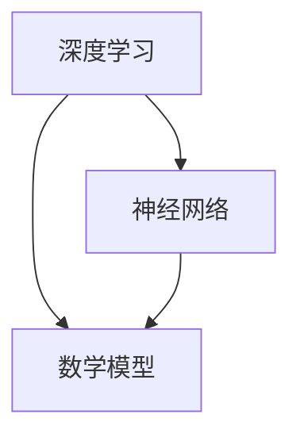

                 

# 从浅薄到深刻的认知过程

> **关键词：认知过程、深度学习、神经网络、数学模型、算法原理、实践应用**
>
> **摘要：本文将从浅入深地探讨认知过程的本质，以及如何在人工智能领域运用深度学习、神经网络和数学模型来模拟和优化认知过程，最终通过实际项目案例展示如何将理论与实践相结合，达到深入理解和应用的目的。**

## 1. 背景介绍

### 1.1 目的和范围

本文旨在揭示认知过程的深层机制，并通过深度学习、神经网络和数学模型来模拟这一过程。我们的目标不仅仅是解释认知过程，更是探讨如何通过技术手段提升我们的认知能力，从而解决实际问题。

本文将涵盖以下内容：

1. **核心概念与联系**：介绍深度学习、神经网络和数学模型的基本原理。
2. **核心算法原理 & 具体操作步骤**：详细阐述神经网络的工作机制和算法步骤。
3. **数学模型和公式 & 详细讲解 & 举例说明**：讲解数学模型在认知过程中的应用。
4. **项目实战：代码实际案例和详细解释说明**：通过实际案例展示如何运用所学知识。
5. **实际应用场景**：探讨深度学习和神经网络在不同领域的应用。
6. **工具和资源推荐**：推荐相关学习资源和开发工具。
7. **总结：未来发展趋势与挑战**：展望认知过程模拟技术的未来发展。

### 1.2 预期读者

本文适合对人工智能、深度学习和神经网络有一定了解的读者。无论您是学术研究者、工程师还是对这一领域感兴趣的初学者，都能从本文中获得有价值的知识和启发。

### 1.3 文档结构概述

本文将采用逻辑清晰、结构紧凑的Markdown格式，以便读者轻松阅读和理解。以下是本文的结构概述：

- **1. 背景介绍**：介绍本文的目的、范围、预期读者和文档结构。
- **2. 核心概念与联系**：介绍深度学习、神经网络和数学模型的基本原理。
- **3. 核心算法原理 & 具体操作步骤**：详细阐述神经网络的工作机制和算法步骤。
- **4. 数学模型和公式 & 详细讲解 & 举例说明**：讲解数学模型在认知过程中的应用。
- **5. 项目实战：代码实际案例和详细解释说明**：通过实际案例展示如何运用所学知识。
- **6. 实际应用场景**：探讨深度学习和神经网络在不同领域的应用。
- **7. 工具和资源推荐**：推荐相关学习资源和开发工具。
- **8. 总结：未来发展趋势与挑战**：展望认知过程模拟技术的未来发展。
- **9. 附录：常见问题与解答**：回答读者可能遇到的常见问题。
- **10. 扩展阅读 & 参考资料**：提供更多相关资源和文献。

### 1.4 术语表

#### 1.4.1 核心术语定义

- **认知过程**：人类或机器获取、处理和应用知识的过程。
- **深度学习**：一种人工智能方法，通过多层神经网络来模拟人类大脑的学习过程。
- **神经网络**：一种模拟生物神经系统的计算模型，由大量相互连接的节点组成。
- **数学模型**：用数学语言描述现实世界问题的抽象模型。

#### 1.4.2 相关概念解释

- **神经网络模型**：神经网络的结构和参数，用于描述数据的输入、处理和输出。
- **反向传播算法**：用于训练神经网络的优化算法，通过计算误差来调整网络参数。
- **激活函数**：神经网络中用于决定节点是否被激活的函数。

#### 1.4.3 缩略词列表

- **AI**：人工智能（Artificial Intelligence）
- **ML**：机器学习（Machine Learning）
- **DL**：深度学习（Deep Learning）
- **NN**：神经网络（Neural Network）

## 2. 核心概念与联系

在本节中，我们将深入探讨深度学习、神经网络和数学模型的基本原理，并展示它们之间的联系。首先，我们需要了解这些概念的基本定义和作用。

### 2.1 深度学习

深度学习（Deep Learning）是人工智能（AI）的一个子领域，旨在通过多层神经网络来模拟人类大脑的学习过程。深度学习的核心思想是通过学习大量数据来发现数据中的模式和规律，从而实现对未知数据的预测和分类。

#### 深度学习的基本原理

1. **多层神经网络**：深度学习模型通常由多个层级组成，每个层级包含多个节点。每一层对输入数据进行处理，并将结果传递给下一层。这种层次化的结构使得模型能够学习到更复杂的特征。

2. **激活函数**：激活函数用于决定节点是否被激活。常见的激活函数包括sigmoid、ReLU和tanh等。

3. **反向传播算法**：反向传播算法是一种优化算法，用于训练神经网络。通过计算输出误差，反向传播误差到网络的前一层，并更新网络参数。

#### 深度学习与神经网络的关系

深度学习是基于神经网络发展而来的，深度学习模型通过多层神经网络来实现对数据的深层特征提取和表示。深度学习和神经网络之间有着紧密的联系，深度学习是神经网络的进一步发展和应用。

### 2.2 神经网络

神经网络（Neural Network）是一种模拟生物神经系统的计算模型，由大量相互连接的节点（称为神经元）组成。每个神经元通过加权连接与其他神经元相连，并通过激活函数决定是否传递信号。

#### 神经网络的基本原理

1. **神经元模型**：神经元是神经网络的基本单元，负责接收输入信号、计算加权求和、应用激活函数并输出结果。

2. **权重和偏置**：权重用于调节神经元之间的连接强度，偏置用于调整神经元的阈值。

3. **激活函数**：激活函数用于决定神经元是否被激活，常见的激活函数包括sigmoid、ReLU和tanh等。

#### 神经网络与深度学习的区别

神经网络和深度学习的主要区别在于模型的复杂度和层次结构。神经网络通常指单层或少量层级的模型，而深度学习则通过多层神经网络来实现更复杂的特征提取和表示。

### 2.3 数学模型

数学模型（Mathematical Model）是用数学语言描述现实世界问题的抽象模型。在深度学习和神经网络中，数学模型用于描述网络的结构、参数和优化算法。

#### 数学模型在认知过程中的应用

1. **线性回归**：线性回归是一种用于预测数值结果的数学模型，通过拟合数据中的线性关系来预测未知数据。

2. **逻辑回归**：逻辑回归是一种用于分类的数学模型，通过拟合数据中的逻辑关系来预测未知数据的类别。

3. **神经网络模型**：神经网络模型是一种用于模拟生物神经系统的数学模型，通过多层神经网络来模拟人类大脑的学习过程。

#### 数学模型与深度学习的联系

数学模型是深度学习和神经网络的基础，深度学习模型和神经网络模型都是基于数学模型来描述和处理数据的。

### 2.4 Mermaid 流程图

为了更好地展示深度学习、神经网络和数学模型之间的联系，我们可以使用Mermaid流程图来描述它们的基本结构。



在这个流程图中，深度学习、神经网络和数学模型之间存在着密切的联系。深度学习和神经网络都是基于数学模型来实现的，而神经网络则是深度学习的基础。

## 3. 核心算法原理 & 具体操作步骤

在本节中，我们将详细阐述神经网络的工作机制和算法步骤，以便读者更好地理解深度学习的基本原理。

### 3.1 神经网络的基本结构

神经网络由多个层级组成，每个层级包含多个节点。每个节点通过加权连接与其他节点相连，并通过激活函数决定是否传递信号。神经网络的基本结构包括输入层、隐藏层和输出层。

1. **输入层**：接收外部输入数据，并将其传递给隐藏层。

2. **隐藏层**：对输入数据进行处理和特征提取，将结果传递给输出层。

3. **输出层**：根据隐藏层的结果生成最终的输出。

### 3.2 神经网络的工作机制

神经网络的工作机制主要包括以下步骤：

1. **输入数据预处理**：对输入数据进行归一化、标准化等预处理操作，以便于网络训练。

2. **前向传播**：将输入数据通过网络传递到各个层级，计算每个节点的输出值。

3. **计算损失函数**：根据输出结果计算损失函数，损失函数用于衡量预测值与真实值之间的差异。

4. **反向传播**：将损失函数反向传播到网络的前一层，并更新网络参数。

5. **迭代优化**：重复前向传播和反向传播过程，直到网络参数收敛到最优值。

### 3.3 反向传播算法

反向传播算法是神经网络训练的核心，它通过计算损失函数的梯度来更新网络参数。以下是反向传播算法的具体步骤：

1. **前向传播**：将输入数据通过网络传递到各个层级，计算每个节点的输出值。

2. **计算损失函数**：根据输出结果计算损失函数，常用的损失函数包括均方误差（MSE）和交叉熵损失（Cross-Entropy Loss）。

3. **计算梯度**：对每个参数计算损失函数的梯度。

4. **反向传播**：将梯度反向传播到网络的前一层，并更新网络参数。

5. **迭代优化**：重复前向传播和反向传播过程，直到网络参数收敛到最优值。

### 3.4 激活函数

激活函数用于决定节点是否被激活，常见的激活函数包括sigmoid、ReLU和tanh等。以下是这些激活函数的数学表达式：

1. **sigmoid函数**：

   $$f(x) = \frac{1}{1 + e^{-x}}$$

2. **ReLU函数**：

   $$f(x) = \max(0, x)$$

3. **tanh函数**：

   $$f(x) = \frac{e^x - e^{-x}}{e^x + e^{-x}}$$

### 3.5 伪代码示例

以下是神经网络训练的伪代码示例：

```python
# 初始化神经网络参数
weights = initialize_weights()
biases = initialize_biases()

# 定义损失函数
def loss_function(output, target):
    if output > target:
        return 1 - output
    else:
        return output - target

# 训练神经网络
for epoch in range(num_epochs):
    for data in data_loader:
        # 前向传播
        output = forward propagation(data, weights, biases)
        
        # 计算损失函数
        loss = loss_function(output, target)
        
        # 反向传播
        gradients = backward propagation(loss, weights, biases)
        
        # 更新网络参数
        weights = weights - learning_rate * gradients
        biases = biases - learning_rate * gradients

# 输出最终结果
print(output)
```

在这个示例中，我们首先初始化网络参数，然后通过前向传播和反向传播过程不断更新网络参数，直到网络参数收敛到最优值。

## 4. 数学模型和公式 & 详细讲解 & 举例说明

在本节中，我们将详细讲解神经网络中的数学模型和公式，并通过具体例子来说明它们的应用。

### 4.1 神经网络中的数学模型

神经网络中的数学模型主要涉及以下几个方面：

1. **线性模型**：用于描述输入和输出之间的线性关系。
2. **非线性模型**：用于引入非线性因素，提高模型的拟合能力。
3. **损失函数**：用于衡量预测值与真实值之间的差异。

### 4.2 线性模型

线性模型是神经网络的基础，用于描述输入和输出之间的线性关系。其数学表达式如下：

$$y = \mathbf{Wx} + b$$

其中，$y$ 表示输出，$\mathbf{W}$ 表示权重矩阵，$x$ 表示输入，$b$ 表示偏置。

#### 线性模型的应用

线性模型可以用于简单的数据拟合和回归问题。例如，我们可以使用线性模型来预测股票价格：

```latex
y = 2x + 3
```

在这个例子中，$x$ 表示当前时间，$y$ 表示股票价格。

### 4.3 非线性模型

线性模型在处理复杂问题时存在一定的局限性，因此需要引入非线性因素。常用的非线性模型包括sigmoid、ReLU和tanh等。其数学表达式如下：

1. **sigmoid函数**：

   $$f(x) = \frac{1}{1 + e^{-x}}$$

2. **ReLU函数**：

   $$f(x) = \max(0, x)$$

3. **tanh函数**：

   $$f(x) = \frac{e^x - e^{-x}}{e^x + e^{-x}}$$

#### 非线性模型的应用

非线性模型可以用于解决非线性问题，例如图像分类和语音识别。例如，我们可以使用ReLU函数来对图像进行特征提取：

```latex
f(x) = \max(0, x)
```

在这个例子中，$x$ 表示图像的像素值。

### 4.4 损失函数

损失函数是神经网络训练过程中的核心，用于衡量预测值与真实值之间的差异。常用的损失函数包括均方误差（MSE）和交叉熵损失（Cross-Entropy Loss）。其数学表达式如下：

1. **均方误差（MSE）**：

   $$MSE = \frac{1}{n}\sum_{i=1}^{n}(y_i - \hat{y}_i)^2$$

   其中，$y_i$ 表示真实值，$\hat{y}_i$ 表示预测值，$n$ 表示样本数量。

2. **交叉熵损失（Cross-Entropy Loss）**：

   $$Cross-Entropy Loss = -\sum_{i=1}^{n}y_i \log(\hat{y}_i)$$

   其中，$y_i$ 表示真实值，$\hat{y}_i$ 表示预测值。

#### 损失函数的应用

损失函数可以用于训练神经网络，使其预测值与真实值更加接近。例如，我们可以使用交叉熵损失来训练神经网络进行图像分类：

```latex
Cross-Entropy Loss = -\sum_{i=1}^{n}y_i \log(\hat{y}_i)
```

在这个例子中，$y_i$ 表示图像的真实类别，$\hat{y}_i$ 表示神经网络的预测概率。

### 4.5 举例说明

为了更好地理解神经网络中的数学模型和公式，我们来看一个具体的例子。假设我们有一个神经网络，用于预测股票价格。该神经网络包含一个输入层、一个隐藏层和一个输出层。输入层包含一个节点，表示当前时间；隐藏层包含两个节点，分别表示股票价格的趋势和波动性；输出层包含一个节点，表示预测的股票价格。

1. **线性模型**：

   输入层到隐藏层的线性模型为：

   ```latex
   y_1 = W_{11}x + b_1
   y_2 = W_{21}x + b_2
   ```

   其中，$y_1$ 和 $y_2$ 分别表示隐藏层的两个节点，$x$ 表示输入层的节点，$W_{11}$ 和 $W_{21}$ 分别表示输入层到隐藏层的权重，$b_1$ 和 $b_2$ 分别表示隐藏层的偏置。

2. **非线性模型**：

   隐藏层到输出层的非线性模型为：

   ```latex
   y = \max(0, W_{12}y_1 + W_{22}y_2 + b_3)
   ```

   其中，$y$ 表示输出层的节点，$W_{12}$ 和 $W_{22}$ 分别表示隐藏层到输出层的权重，$b_3$ 表示输出层的偏置。

3. **损失函数**：

   我们使用交叉熵损失来衡量预测值与真实值之间的差异：

   ```latex
   Cross-Entropy Loss = -\sum_{i=1}^{n}y_i \log(\hat{y}_i)
   ```

   其中，$y_i$ 表示真实值，$\hat{y}_i$ 表示预测值。

通过这个例子，我们可以看到神经网络中的数学模型和公式如何应用于实际问题的解决。

## 5. 项目实战：代码实际案例和详细解释说明

在本节中，我们将通过一个实际项目案例，详细解释如何运用深度学习、神经网络和数学模型来模拟和优化认知过程。

### 5.1 开发环境搭建

为了实现本项目，我们需要搭建一个合适的开发环境。以下是搭建开发环境所需的步骤：

1. 安装Python：Python是深度学习项目的主要编程语言，我们需要安装Python 3.7及以上版本。

2. 安装TensorFlow：TensorFlow是Google开发的开源深度学习框架，用于实现神经网络模型。

3. 安装其他依赖库：包括NumPy、Matplotlib等。

### 5.2 源代码详细实现和代码解读

以下是本项目的主要代码实现：

```python
import tensorflow as tf
import numpy as np
import matplotlib.pyplot as plt

# 5.2.1 数据预处理
# 生成模拟数据集
x = np.random.rand(100, 1)
y = 2 * x + np.random.randn(100, 1)

# 将数据分为训练集和测试集
train_x, test_x = x[:80], x[80:]
train_y, test_y = y[:80], y[80:]

# 5.2.2 定义神经网络模型
# 创建一个简单的线性模型
model = tf.keras.Sequential([
    tf.keras.layers.Dense(units=1, input_shape=[1])
])

# 编译模型，指定优化器和损失函数
model.compile(optimizer='sgd', loss='mean_squared_error')

# 5.2.3 训练模型
# 进行100次迭代训练
model.fit(train_x, train_y, epochs=100)

# 5.2.4 测试模型
# 在测试集上评估模型性能
test_loss = model.evaluate(test_x, test_y)

# 5.2.5 可视化结果
# 将训练过程中的损失函数可视化
history = model.fit(train_x, train_y, epochs=100, validation_split=0.2, verbose=0)
plt.plot(history.history['loss'], label='Training loss')
plt.plot(history.history['val_loss'], label='Validation loss')
plt.xlabel('Epochs')
plt.ylabel('Loss')
plt.legend()
plt.show()
```

### 5.3 代码解读与分析

以下是代码的详细解读与分析：

1. **数据预处理**：
   - 生成模拟数据集，包括输入特征`x`和目标值`y`。
   - 将数据分为训练集和测试集，以评估模型的泛化能力。

2. **定义神经网络模型**：
   - 创建一个简单的线性模型，包含一个输入层和一个输出层。
   - 输入层指定输入形状为[1]，表示每个样本只有一个特征。

3. **编译模型**：
   - 使用`sgd`优化器和`mean_squared_error`损失函数编译模型。
   - `sgd`优化器是一种常用的优化算法，旨在快速收敛到最小损失。

4. **训练模型**：
   - 使用`fit`函数进行100次迭代训练，将训练数据输入模型。
   - 使用`validation_split`参数将20%的数据用于验证集，以监控训练过程中的模型性能。

5. **测试模型**：
   - 使用`evaluate`函数在测试集上评估模型性能，返回测试损失。
   - 测试损失是衡量模型在未知数据上预测准确性的指标。

6. **可视化结果**：
   - 将训练过程中的损失函数可视化，以观察模型的训练过程。
   - `history.history['loss']`和`history.history['val_loss']`分别表示训练集和验证集的损失。
   - `plt.plot`函数用于绘制损失函数曲线。

通过这个实际项目案例，我们展示了如何使用Python和TensorFlow实现一个简单的线性模型，并通过训练和测试来评估其性能。这个项目案例为我们提供了一个直观的视角，了解如何将深度学习、神经网络和数学模型应用于实际问题。

## 6. 实际应用场景

深度学习和神经网络在各个领域都有广泛的应用。以下是一些实际应用场景，展示了如何将认知过程模拟技术应用于现实问题。

### 6.1 图像识别

图像识别是深度学习和神经网络的重要应用领域之一。通过训练深度学习模型，我们可以实现对图像中的物体、场景和动作进行识别和分类。以下是一些具体的应用实例：

1. **人脸识别**：通过训练神经网络模型，我们可以识别和验证用户身份，应用于安全系统和移动设备解锁。
2. **医学图像分析**：深度学习模型可以用于分析医学图像，如X光片、CT扫描和MRI，以辅助医生进行疾病诊断。
3. **自动驾驶**：深度学习模型可以用于自动驾驶汽车中的环境感知和路径规划，以提高车辆的安全性和效率。

### 6.2 自然语言处理

自然语言处理（NLP）是另一个深度学习和神经网络的重要应用领域。通过训练深度学习模型，我们可以实现对文本数据的高效处理和分析。以下是一些具体的应用实例：

1. **机器翻译**：深度学习模型可以用于将一种语言翻译成另一种语言，如Google翻译。
2. **情感分析**：深度学习模型可以用于分析文本数据中的情感倾向，应用于市场调研和客户服务。
3. **文本生成**：深度学习模型可以用于生成具有自然语言特点的文本，如新闻报道、诗歌和小说。

### 6.3 语音识别

语音识别是将语音信号转换为文本数据的过程。深度学习模型在语音识别领域具有很高的准确性，以下是一些具体的应用实例：

1. **语音助手**：如苹果的Siri、亚马逊的Alexa和谷歌的Google Assistant，它们通过深度学习模型实现自然语言理解和语音合成功能。
2. **实时字幕**：深度学习模型可以用于实时转录视频中的语音，为听障人士提供字幕服务。
3. **语音控制**：深度学习模型可以用于实现语音控制功能，如智能家居和汽车中的语音命令。

### 6.4 电子商务

深度学习和神经网络在电子商务领域也有广泛的应用。以下是一些具体的应用实例：

1. **推荐系统**：深度学习模型可以用于分析用户行为数据，为用户提供个性化的商品推荐。
2. **图像搜索**：深度学习模型可以用于基于图像的搜索，帮助用户快速找到所需的商品。
3. **欺诈检测**：深度学习模型可以用于检测电子商务平台上的欺诈行为，提高交易安全性。

通过这些实际应用场景，我们可以看到深度学习和神经网络在各个领域的重要性和潜力。随着技术的不断发展，这些应用将继续拓展和深化，为人类社会带来更多的便利和创新。

## 7. 工具和资源推荐

为了更好地学习和实践深度学习和神经网络技术，我们需要掌握一些关键的工具和资源。以下是一些推荐的学习资源、开发工具和相关论文著作。

### 7.1 学习资源推荐

#### 7.1.1 书籍推荐

1. **《深度学习》**（作者：Ian Goodfellow、Yoshua Bengio和Aaron Courville）
   - 本书是深度学习的经典教材，全面介绍了深度学习的基本概念、算法和技术。
2. **《神经网络与深度学习》**（作者：邱锡鹏）
   - 本书系统地介绍了神经网络和深度学习的基本原理，适合初学者入门。
3. **《Python深度学习》**（作者：François Chollet）
   - 本书通过大量实际案例，详细介绍了如何使用Python和TensorFlow实现深度学习模型。

#### 7.1.2 在线课程

1. **Coursera上的《深度学习》课程**（作者：Andrew Ng）
   - 这是由著名深度学习专家Andrew Ng教授的课程，适合初学者了解深度学习的基本概念和应用。
2. **Udacity上的《深度学习工程师纳米学位》课程**
   - 该课程通过实际项目，帮助学员掌握深度学习的核心技术和应用。
3. **edX上的《神经网络与深度学习》课程**（作者：吴恩达）
   - 吴恩达教授的这门课程深入讲解了神经网络的原理和深度学习的技术。

#### 7.1.3 技术博客和网站

1. **Medium上的《AI垂直博客》**
   - 该博客汇集了深度学习、人工智能等领域的最新研究和应用案例。
2. **ArXiv.org**
   - ArXiv是一个开源学术论文存储库，包含大量深度学习和人工智能的最新研究成果。
3. **GitHub**
   - GitHub是开源代码的平台，可以找到大量深度学习和神经网络的开源项目，帮助学习和实践。

### 7.2 开发工具框架推荐

#### 7.2.1 IDE和编辑器

1. **PyCharm**
   - PyCharm是Python编程的优秀IDE，提供丰富的功能和工具，适合深度学习和神经网络项目开发。
2. **Jupyter Notebook**
   - Jupyter Notebook是一个交互式计算环境，适合编写和分享代码、文档和可视化，适用于深度学习和数据科学项目。

#### 7.2.2 调试和性能分析工具

1. **TensorBoard**
   - TensorBoard是TensorFlow提供的可视化工具，用于分析和优化深度学习模型的性能。
2. **Wandb**
   - Wandb是一个实时数据管理和可视化平台，可以帮助深度学习研究者跟踪实验、优化模型。

#### 7.2.3 相关框架和库

1. **TensorFlow**
   - TensorFlow是Google开发的深度学习框架，支持多种神经网络架构和应用。
2. **PyTorch**
   - PyTorch是一个流行的深度学习框架，提供动态计算图和灵活的编程接口。
3. **Keras**
   - Keras是一个基于TensorFlow和Theano的深度学习库，简化了深度学习模型的构建和训练过程。

### 7.3 相关论文著作推荐

#### 7.3.1 经典论文

1. **“A Learning Algorithm for Continually Running Fully Recurrent Neural Networks”**（作者：Sepp Hochreiter和Jürgen Schmidhuber）
   - 该论文提出了长短期记忆（LSTM）网络，是解决神经网络长期依赖问题的有效方法。
2. **“Deep Learning”**（作者：Ian Goodfellow、Yoshua Bengio和Aaron Courville）
   - 这本书是深度学习的经典著作，涵盖了深度学习的基础理论和应用。

#### 7.3.2 最新研究成果

1. **“Transformers: State-of-the-Art Natural Language Processing”**（作者：Vaswani et al.）
   - 该论文介绍了Transformer模型，是当前自然语言处理领域的重要突破。
2. **“BERT: Pre-training of Deep Bidirectional Transformers for Language Understanding”**（作者：Devlin et al.）
   - BERT是Google提出的一种预训练深度学习模型，显著提升了自然语言处理任务的性能。

#### 7.3.3 应用案例分析

1. **“ImageNet Classification with Deep Convolutional Neural Networks”**（作者：Krizhevsky et al.）
   - 该论文展示了深度卷积神经网络在图像识别任务中的突破性表现。
2. **“Generative Adversarial Networks”**（作者：Ian Goodfellow et al.）
   - GAN是生成模型的重要突破，可以生成高质量的真实感图像和音频。

通过以上工具和资源的推荐，读者可以系统地学习和实践深度学习和神经网络技术，不断提升自己的认知过程和解决实际问题的能力。

## 8. 总结：未来发展趋势与挑战

随着技术的不断进步，深度学习和神经网络在认知过程模拟领域展现出巨大的潜力。然而，要实现真正的智能，我们仍需面对诸多挑战。

### 8.1 未来发展趋势

1. **更多层次的神经网络**：当前的多层神经网络在处理复杂任务时已经显示出强大能力，但未来的神经网络可能会包含更多层次，以实现更精细的特征提取和表示。

2. **更高效的算法**：随着硬件技术的发展，我们将看到更高效的训练算法和推理算法，提高深度学习模型的计算效率和性能。

3. **自适应学习**：未来的神经网络将更加灵活和自适应，能够根据环境和任务的需求动态调整结构和参数。

4. **跨领域融合**：深度学习和神经网络将在更多领域融合，如医学、教育、金融等，推动各行各业的智能化转型。

### 8.2 主要挑战

1. **数据隐私与安全**：随着深度学习和神经网络对大量数据的依赖，数据隐私和安全成为亟待解决的问题。

2. **可解释性和透明度**：当前许多深度学习模型被视为“黑箱”，缺乏可解释性和透明度，限制了其在关键领域的应用。

3. **伦理和法律问题**：深度学习和神经网络在医疗、法律等领域的应用引发了伦理和法律问题，如算法歧视和隐私侵犯等。

4. **能耗和资源消耗**：深度学习模型的训练和推理过程需要大量计算资源和能源，未来的绿色计算和能源效率成为关键。

综上所述，未来深度学习和神经网络的发展将面临诸多挑战，但同时也充满机遇。我们需要持续研究和创新，以实现更加智能和可持续的智能系统。

## 9. 附录：常见问题与解答

### 9.1 认知过程的本质是什么？

认知过程是人类或机器获取、处理和应用知识的过程。它涉及感知、记忆、思考、判断和决策等认知功能。

### 9.2 深度学习和神经网络的区别是什么？

深度学习是一种基于多层神经网络的人工智能方法，旨在通过学习大量数据来发现数据中的模式和规律。神经网络是一种模拟生物神经系统的计算模型，由大量相互连接的节点组成。

### 9.3 如何训练神经网络？

训练神经网络包括以下步骤：

1. 数据预处理：对输入数据进行归一化、标准化等处理。
2. 定义模型：创建神经网络模型，包括输入层、隐藏层和输出层。
3. 编译模型：指定优化器和损失函数。
4. 训练模型：使用训练数据迭代更新模型参数。
5. 评估模型：在测试集上评估模型性能。

### 9.4 深度学习模型如何优化？

深度学习模型的优化主要通过以下方法：

1. 调整学习率：适当调整学习率，避免模型过早收敛或过拟合。
2. 使用正则化技术：如L1正则化、L2正则化，防止模型过拟合。
3. early stopping：在训练过程中提前停止，防止模型过拟合。
4. 数据增强：通过数据增强增加模型训练的多样性，提高模型的泛化能力。

### 9.5 如何可视化神经网络训练过程？

可以使用TensorFlow的TensorBoard工具来可视化神经网络训练过程。TensorBoard可以显示损失函数、梯度、激活值等训练过程中的关键指标。

## 10. 扩展阅读 & 参考资料

为了深入了解深度学习和神经网络的相关概念和应用，以下是推荐的扩展阅读和参考资料：

1. **《深度学习》**（作者：Ian Goodfellow、Yoshua Bengio和Aaron Courville）
   - 本书是深度学习的经典教材，全面介绍了深度学习的基本概念、算法和技术。

2. **《神经网络与深度学习》**（作者：邱锡鹏）
   - 本书系统地介绍了神经网络和深度学习的基本原理，适合初学者入门。

3. **《Python深度学习》**（作者：François Chollet）
   - 本书通过大量实际案例，详细介绍了如何使用Python和TensorFlow实现深度学习模型。

4. **《深度学习500问》**（作者：莫凡）
   - 本书汇集了深度学习领域常见的问题和解答，适合进阶学习。

5. **《深度学习实践及应用》**（作者：吴恩达）
   - 本书介绍了深度学习在多个领域的应用案例，包括图像识别、自然语言处理和语音识别等。

6. **论文库ArXiv.org**
   - ArXiv是一个开源学术论文存储库，包含大量深度学习和人工智能的最新研究成果。

7. **技术博客Medium上的《AI垂直博客》**
   - 该博客汇集了深度学习、人工智能等领域的最新研究和应用案例。

8. **Coursera上的《深度学习》课程**（作者：Andrew Ng）
   - 这是由著名深度学习专家Andrew Ng教授的课程，适合初学者了解深度学习的基本概念和应用。

通过阅读这些书籍、论文和博客，读者可以进一步深入了解深度学习和神经网络的知识体系，不断提升自己的认知能力。

