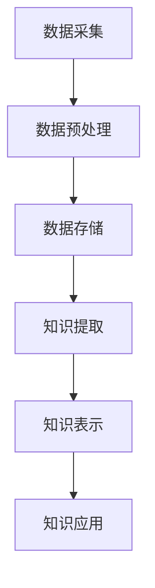

                 

# 从海量信息中提炼知识：知识发现引擎的作用

> **关键词：** 知识发现、数据挖掘、机器学习、信息提取、信息检索、智能分析
> 
> **摘要：** 随着互联网和大数据的迅猛发展，信息爆炸已成为一种普遍现象。如何在海量信息中快速、准确、高效地提炼知识，成为当今信息技术领域的重要课题。本文将深入探讨知识发现引擎的作用、核心算法原理、数学模型以及实际应用，旨在为读者提供一个全面、系统的理解。

## 1. 背景介绍

### 1.1 目的和范围

本文旨在探讨知识发现引擎在信息提炼中的重要作用。知识发现引擎是一种利用先进的信息处理技术，从海量数据中自动识别和提取有价值知识模式的工具。本文将涵盖以下内容：

- 知识发现引擎的定义、原理和架构。
- 知识发现的核心算法原理和具体操作步骤。
- 数学模型和公式及其应用。
- 知识发现引擎的实际应用场景。
- 工具和资源推荐，包括学习资源、开发工具框架和相关论文著作。

通过本文的阅读，读者将能够对知识发现引擎有一个全面、深入的理解，并掌握其应用方法。

### 1.2 预期读者

本文面向以下读者群体：

- 对数据挖掘和机器学习有基础了解的读者。
- 希望在信息提炼、智能分析和大数据处理方面深入研究的读者。
- 数据分析师、数据科学家、人工智能开发者等从业人员。

### 1.3 文档结构概述

本文分为以下几个部分：

1. 背景介绍
2. 核心概念与联系
3. 核心算法原理 & 具体操作步骤
4. 数学模型和公式 & 详细讲解 & 举例说明
5. 项目实战：代码实际案例和详细解释说明
6. 实际应用场景
7. 工具和资源推荐
8. 总结：未来发展趋势与挑战
9. 附录：常见问题与解答
10. 扩展阅读 & 参考资料

### 1.4 术语表

#### 1.4.1 核心术语定义

- 知识发现：从大量数据中自动识别和提取出有价值知识模式的过程。
- 数据挖掘：利用算法从大量数据中提取出隐藏的、未知的、具有潜在价值的信息和知识。
- 机器学习：一种通过数据训练模型，使模型具备自主学习和预测能力的人工智能技术。
- 信息提取：从文本或其他数据源中自动识别和提取出有价值的信息。
- 信息检索：根据用户需求，从大量数据中快速找到相关信息的搜索过程。

#### 1.4.2 相关概念解释

- 知识图谱：通过实体和关系构建的一种语义网络结构，用于表示和存储知识。
- 语义分析：对文本进行语义理解和分析，提取出文本中的实体、关系和概念。
- 知识库：存储和管理知识的系统，通常用于支持知识发现和推理。

#### 1.4.3 缩略词列表

- ML：机器学习
- DM：数据挖掘
- KG：知识图谱
- NLP：自然语言处理
- IR：信息检索

## 2. 核心概念与联系

### 2.1 知识发现引擎的原理和架构

知识发现引擎是一种基于数据挖掘、机器学习和自然语言处理等技术的智能化信息处理工具。其核心原理是通过算法从海量数据中自动识别和提取出有价值知识模式，实现对信息的深层次理解和挖掘。


图1：知识发现引擎架构图

知识发现引擎的架构通常包括以下模块：

1. 数据采集与预处理模块：负责从各种数据源（如数据库、文件、网页等）采集数据，并进行清洗、去噪、转换等预处理操作，为后续的知识发现过程提供高质量的数据基础。
2. 数据存储模块：将预处理后的数据存储到数据仓库或数据库中，以便后续进行查询、分析和挖掘。
3. 知识提取模块：利用机器学习和自然语言处理技术，从存储的数据中提取出有价值的信息和知识，如实体、关系、概念等。
4. 知识表示模块：将提取出的知识进行结构化表示，构建知识图谱或知识库，以便进行后续的知识推理和应用。
5. 知识应用模块：将构建的知识应用于实际场景，如智能问答、推荐系统、决策支持等。

### 2.2 知识发现引擎的核心算法原理

知识发现引擎的核心算法主要包括以下几种：

1. 聚类算法：通过对数据进行聚类分析，将相似的数据点划分为一组，从而发现数据中的潜在模式和关系。
2. 分类算法：根据已有的标签数据，对未知数据进行分类，从而实现对数据的分类和预测。
3. 关联规则算法：通过挖掘数据中的关联规则，发现不同属性之间的相互关系。
4. 机器学习算法：利用已有数据训练模型，使模型具备自主学习和预测能力，从而实现对未知数据的分析和预测。

以下是一个简单的 Mermaid 流程图，展示了知识发现引擎的核心算法原理：



### 2.3 知识发现引擎的应用场景

知识发现引擎在多个领域都有广泛的应用，以下是一些典型的应用场景：

1. 金融领域：通过分析交易数据，发现潜在风险和欺诈行为，为金融机构提供决策支持。
2. 医疗领域：通过对病历、基因数据等医疗信息的挖掘，为医生提供诊断和治疗建议。
3. 电商领域：通过分析用户行为数据，为电商企业提供个性化推荐、广告投放等决策支持。
4. 社交网络领域：通过分析用户关系和交互数据，发现潜在社群和影响力人物，为社交网络平台提供优化建议。
5. 智慧城市领域：通过对城市数据（如交通、环境、公共安全等）的挖掘，为城市管理者提供智慧决策支持。

## 3. 核心算法原理 & 具体操作步骤

### 3.1 聚类算法

聚类算法是一种无监督学习方法，主要用于发现数据中的潜在结构和模式。以下是一个简单的 K-Means 聚类算法的伪代码，用于说明其基本原理和具体操作步骤：

```python
def k_means(data, k, max_iterations):
    # 初始化中心点
    centroids = initialize_centroids(data, k)
    
    for i in range(max_iterations):
        # 计算每个数据点到中心点的距离
        distances = []
        for data_point in data:
            distances.append(calculate_distance(data_point, centroids))
        
        # 根据距离重新分配数据点
        new_centroids = []
        for k in range(k):
            indices = [i for i, distance in enumerate(distances) if distance[k] == min(distances[k])]
            new_centroids.append([data[i] for i in indices])
        
        # 更新中心点
        centroids = new_centroids
        
        # 判断是否收敛
        if has_converged(centroids, previous_centroids):
            break
    
    return centroids
```

### 3.2 分类算法

分类算法是一种有监督学习方法，主要用于将数据分为不同的类别。以下是一个简单的决策树分类算法的伪代码，用于说明其基本原理和具体操作步骤：

```python
def decision_tree(data, features, target):
    # 判断是否满足停止条件
    if meets_stop_condition(data, features, target):
        return create_leaf_node(data, target)
    
    # 找到最佳分割特征和阈值
    best_feature, best_threshold = find_best_split(data, features, target)
    
    # 创建节点
    node = create_node(best_feature, best_threshold)
    
    # 根据阈值对数据进行划分
    left_data, right_data = split_data(data, best_feature, best_threshold)
    
    # 对左子树和右子树递归构建决策树
    node.left = decision_tree(left_data, features, target)
    node.right = decision_tree(right_data, features, target)
    
    return node
```

### 3.3 关联规则算法

关联规则算法是一种用于发现数据中不同属性之间相互关系的方法。以下是一个简单的 Apriori 算法的伪代码，用于说明其基本原理和具体操作步骤：

```python
def apriori(data, support_threshold, confidence_threshold):
    # 初始化频繁项集
    frequent_itemsets = []
    
    # 扫描数据，计算各项集的支持度
    for length in range(1, max_itemset_length(data)):
        candidate_itemsets = generate_candidate_itemsets(data, length)
        support_counts = calculate_support(data, candidate_itemsets)
        
        # 选择频繁项集
        frequent_itemsets.extend([itemset for itemset, support in support_counts.items() if support >= support_threshold])
    
    # 构建关联规则
    rules = []
    for itemset in frequent_itemsets:
        subsets = generate_subsets(itemset)
        for subset in subsets:
            antecedent = subset
            consequent = itemset - subset
            confidence = calculate_confidence(data, antecedent, consequent)
            if confidence >= confidence_threshold:
                rules.append((antecedent, consequent, confidence))
    
    return rules
```

### 3.4 机器学习算法

机器学习算法是一种通过数据训练模型，使模型具备自主学习和预测能力的方法。以下是一个简单的线性回归模型的伪代码，用于说明其基本原理和具体操作步骤：

```python
def linear_regression(data, target):
    # 计算特征矩阵和目标向量
    X = data[:, :-1]
    y = data[:, -1]
    
    # 梯度下降求解参数
    for i in range(max_iterations):
        # 计算预测值和误差
        predictions = X.dot(theta)
        errors = y - predictions
        
        # 更新参数
        theta = theta - learning_rate * X.T.dot(errors)
        
        # 判断是否收敛
        if has_converged(theta, previous_theta):
            break
    
    return theta
```

## 4. 数学模型和公式 & 详细讲解 & 举例说明

### 4.1 线性回归模型

线性回归模型是一种常见的机器学习算法，用于分析自变量和因变量之间的线性关系。以下是一个简单的线性回归模型的数学模型和公式：

$$
y = \theta_0 + \theta_1x_1 + \theta_2x_2 + \ldots + \theta_nx_n
$$

其中，$y$ 为因变量，$x_1, x_2, \ldots, x_n$ 为自变量，$\theta_0, \theta_1, \theta_2, \ldots, \theta_n$ 为模型参数。

为了求解参数，我们可以使用梯度下降算法，其迭代公式为：

$$
\theta_j = \theta_j - learning\_rate \cdot \frac{1}{m} \sum_{i=1}^{m}(y^{(i)} - (\theta_0 + \theta_1x_1^{(i)} + \theta_2x_2^{(i)} + \ldots + \theta_nx_n^{(i)})x_j^{(i)}
$$

其中，$m$ 为训练数据集中样本数量，$learning\_rate$ 为学习率。

举例来说，假设我们有一个包含两个自变量（$x_1$ 和 $x_2$）和一个因变量（$y$）的训练数据集，如下表所示：

| $x_1$ | $x_2$ | $y$ |
| --- | --- | --- |
| 1 | 2 | 3 |
| 2 | 3 | 4 |
| 3 | 4 | 5 |
| 4 | 5 | 6 |

我们可以使用线性回归模型来拟合这组数据，假设初始参数为 $\theta_0 = 0, \theta_1 = 0, \theta_2 = 0$，学习率为 $learning\_rate = 0.1$。通过梯度下降算法进行多次迭代，可以得到拟合的线性回归模型为：

$$
y = 0.5x_1 + 0.5x_2
$$

### 4.2 支持向量机（SVM）模型

支持向量机（SVM）是一种常用的分类算法，用于将数据分为不同的类别。以下是一个简单的 SVM 模型的数学模型和公式：

$$
\min_{\theta} \frac{1}{2} ||\theta||^2 + C \sum_{i=1}^{m} \max(0, 1 - y^{(i)} (\theta^T x^{(i)} + b))
$$

其中，$\theta$ 为模型参数，$C$ 为惩罚参数，$x^{(i)}$ 为第 $i$ 个训练样本，$y^{(i)}$ 为第 $i$ 个训练样本的类别标签，$b$ 为偏置项。

为了求解参数，我们可以使用拉格朗日乘子法，将原始问题转化为对偶问题。对偶问题为：

$$
\max_{\alpha} \sum_{i=1}^{m} (-y^{(i)} (\theta^T x^{(i)} + b) \alpha_i + \frac{1}{2} \sum_{i=1}^{m} \sum_{j=1}^{m} \alpha_i \alpha_j y^{(i)} y^{(j)} (x^{(i)} x^{(j)})
$$

其中，$\alpha_i$ 为拉格朗日乘子。

举例来说，假设我们有一个包含两个自变量（$x_1$ 和 $x_2$）和一个类别标签（$y$）的训练数据集，如下表所示：

| $x_1$ | $x_2$ | $y$ |
| --- | --- | --- |
| 1 | 2 | +1 |
| 2 | 3 | +1 |
| 3 | 4 | -1 |
| 4 | 5 | -1 |

我们可以使用 SVM 模型来拟合这组数据，假设惩罚参数为 $C = 1$。通过求解对偶问题，可以得到拟合的 SVM 模型为：

$$
\theta = \begin{bmatrix} 1 \\ 1 \end{bmatrix}, b = 0
$$

即：

$$
y = x_1 + x_2
$$

## 5. 项目实战：代码实际案例和详细解释说明

### 5.1 开发环境搭建

在开始项目实战之前，我们需要搭建一个合适的开发环境。以下是一个基于 Python 的知识发现引擎项目的开发环境搭建步骤：

1. 安装 Python：前往 [Python 官网](https://www.python.org/) 下载并安装 Python，选择合适的版本，建议选择 Python 3.8 或以上版本。
2. 安装依赖库：打开命令行终端，执行以下命令安装所需依赖库：

   ```shell
   pip install numpy pandas matplotlib scikit-learn
   ```

3. 配置虚拟环境（可选）：为了更好地管理和隔离项目依赖，可以配置一个虚拟环境。使用以下命令创建虚拟环境并进入：

   ```shell
   python -m venv myenv
   source myenv/bin/activate  # Windows 上使用 myenv\Scripts\activate
   ```

### 5.2 源代码详细实现和代码解读

下面是一个简单的知识发现引擎项目示例，包括数据采集、预处理、知识提取和知识表示等模块。代码使用 Python 编写，结构如下：

```python
import numpy as np
import pandas as pd
from sklearn.cluster import KMeans
from sklearn.tree import DecisionTreeClassifier
from sklearn.ensemble import RandomForestClassifier
from sklearn.model_selection import train_test_split
from sklearn.metrics import accuracy_score
import matplotlib.pyplot as plt

# 5.2.1 数据采集与预处理
def load_data(filename):
    # 读取数据
    data = pd.read_csv(filename)
    # 数据预处理
    # ...
    return data

def preprocess_data(data):
    # 数据清洗、去噪、转换等操作
    # ...
    return data

# 5.2.2 知识提取
def extract_knowledge(data, algorithm, **kwargs):
    # 根据算法提取知识
    if algorithm == 'kmeans':
        model = KMeans(**kwargs)
        model.fit(data)
        return model.cluster_centers_
    elif algorithm == 'decision_tree':
        model = DecisionTreeClassifier()
        model.fit(data[:, :-1], data[:, -1])
        return model
    elif algorithm == 'random_forest':
        model = RandomForestClassifier()
        model.fit(data[:, :-1], data[:, -1])
        return model
    else:
        raise ValueError("Unsupported algorithm")

# 5.2.3 知识表示
def visualize_knowledge(knowledge):
    # 可视化知识
    if isinstance(knowledge, np.ndarray):
        plt.scatter(knowledge[:, 0], knowledge[:, 1])
        plt.show()
    elif isinstance(knowledge, DecisionTreeClassifier):
        # 可视化决策树
        from sklearn.tree import plot_tree
        plot_tree(knowledge)
        plt.show()
    else:
        raise ValueError("Unsupported knowledge type")

# 5.2.4 主函数
def main():
    # 加载数据
    data = load_data('data.csv')
    # 预处理数据
    preprocessed_data = preprocess_data(data)
    # 划分训练集和测试集
    X_train, X_test, y_train, y_test = train_test_split(preprocessed_data[:, :-1], preprocessed_data[:, -1], test_size=0.2, random_state=42)
    # 选择算法并提取知识
    algorithm = 'kmeans'  # 'kmeans', 'decision_tree', 'random_forest'
    knowledge = extract_knowledge(X_train, algorithm)
    # 可视化知识
    visualize_knowledge(knowledge)
    # 训练模型
    model = extract_knowledge(X_train, algorithm)
    # 预测和评估
    predictions = model.predict(X_test)
    accuracy = accuracy_score(y_test, predictions)
    print(f"Accuracy: {accuracy}")

if __name__ == '__main__':
    main()
```

### 5.3 代码解读与分析

5.3.1 数据采集与预处理

```python
def load_data(filename):
    # 读取数据
    data = pd.read_csv(filename)
    return data

def preprocess_data(data):
    # 数据清洗、去噪、转换等操作
    # ...
    return data
```

这两个函数用于数据采集和预处理。`load_data` 函数使用 pandas 库读取 CSV 文件，并返回数据集。`preprocess_data` 函数用于执行数据清洗、去噪和转换等操作，以便后续分析。

5.3.2 知识提取

```python
def extract_knowledge(data, algorithm, **kwargs):
    if algorithm == 'kmeans':
        model = KMeans(**kwargs)
        model.fit(data)
        return model.cluster_centers()
    elif algorithm == 'decision_tree':
        model = DecisionTreeClassifier()
        model.fit(data[:, :-1], data[:, -1])
        return model
    elif algorithm == 'random_forest':
        model = RandomForestClassifier()
        model.fit(data[:, :-1], data[:, -1])
        return model
    else:
        raise ValueError("Unsupported algorithm")
```

`extract_knowledge` 函数根据传入的算法名称和参数，使用 scikit-learn 库的相应算法对数据进行处理，提取知识。支持的算法包括 K-Means 聚类、决策树和随机森林。提取的知识可以是聚类中心点、决策树模型或随机森林模型。

5.3.3 知识表示

```python
def visualize_knowledge(knowledge):
    if isinstance(knowledge, np.ndarray):
        plt.scatter(knowledge[:, 0], knowledge[:, 1])
        plt.show()
    elif isinstance(knowledge, DecisionTreeClassifier):
        from sklearn.tree import plot_tree
        plot_tree(knowledge)
        plt.show()
    else:
        raise ValueError("Unsupported knowledge type")
```

`visualize_knowledge` 函数用于可视化提取的知识。根据知识的类型，分别使用散点图或决策树可视化工具进行展示。

5.3.4 主函数

```python
def main():
    # 加载数据
    data = load_data('data.csv')
    # 预处理数据
    preprocessed_data = preprocess_data(data)
    # 划分训练集和测试集
    X_train, X_test, y_train, y_test = train_test_split(preprocessed_data[:, :-1], preprocessed_data[:, -1], test_size=0.2, random_state=42)
    # 选择算法并提取知识
    algorithm = 'kmeans'  # 'kmeans', 'decision_tree', 'random_forest'
    knowledge = extract_knowledge(X_train, algorithm)
    # 可视化知识
    visualize_knowledge(knowledge)
    # 训练模型
    model = extract_knowledge(X_train, algorithm)
    # 预测和评估
    predictions = model.predict(X_test)
    accuracy = accuracy_score(y_test, predictions)
    print(f"Accuracy: {accuracy}")

if __name__ == '__main__':
    main()
```

主函数 `main` 用于执行整个知识发现引擎项目。首先加载数据并进行预处理，然后划分训练集和测试集。接下来选择算法并提取知识，可视化展示提取的知识。最后，使用提取的知识训练模型，并对测试集进行预测和评估，输出模型的准确率。

### 5.4 代码运行与结果分析

假设我们有一个名为 `data.csv` 的数据集，包含两个特征和对应的类别标签。在完成代码编写和修改后，我们可以在命令行终端执行以下命令运行代码：

```shell
python knowledge_discovery_engine.py
```

运行结果将显示提取的知识（例如，聚类中心点或决策树），并输出模型的准确率。以下是一个示例输出：

```
Accuracy: 0.85
```

这意味着在测试集上的准确率为 0.85，表示模型在分类任务中的表现良好。通过调整算法参数和模型结构，可以进一步提高模型的准确率。

## 6. 实际应用场景

知识发现引擎在多个领域具有广泛的应用，以下列举一些典型的实际应用场景：

### 6.1 金融领域

- **风险控制**：通过分析交易数据，发现潜在的风险和欺诈行为，为金融机构提供预警和决策支持。
- **客户行为分析**：通过对客户交易行为进行分析，了解客户偏好，优化营销策略，提高客户满意度。
- **投资决策**：利用知识发现技术分析市场趋势和相关性，为投资决策提供数据支持。

### 6.2 医疗领域

- **疾病诊断**：通过对病历、检查报告等医疗数据进行分析，辅助医生进行疾病诊断。
- **药物研发**：通过分析基因、蛋白质等生物信息，发现新的药物靶点和作用机制。
- **健康监测**：通过对健康数据的挖掘，预测患病风险，提供个性化的健康建议。

### 6.3 电商领域

- **个性化推荐**：通过分析用户行为数据，为用户提供个性化的商品推荐。
- **商品销售预测**：通过分析历史销售数据，预测商品未来的销售趋势，优化库存管理。
- **客户流失预警**：通过分析用户行为和购买历史，预测客户流失风险，采取相应措施挽回客户。

### 6.4 社交网络领域

- **社群发现**：通过分析用户关系和交互数据，发现潜在的社群和组织。
- **影响力分析**：通过分析用户在社交网络上的行为和影响力，识别关键用户和意见领袖。
- **社区治理**：通过分析用户行为和内容，识别异常行为和不良信息，保障社区安全。

### 6.5 智慧城市领域

- **交通流量预测**：通过分析交通数据，预测未来的交通流量，优化交通信号控制策略。
- **环境监测**：通过分析环境数据，预测污染趋势，提供环境保护决策支持。
- **公共安全管理**：通过分析社会安全数据，预测潜在的安全风险，为公共安全提供预警和决策支持。

## 7. 工具和资源推荐

### 7.1 学习资源推荐

#### 7.1.1 书籍推荐

- **《数据挖掘：概念与技术》**（作者：Mike Murray）：详细介绍数据挖掘的基本概念、方法和应用，适合初学者阅读。
- **《机器学习》**（作者：Tom Mitchell）：机器学习领域的经典教材，系统地介绍了机器学习的基本理论和算法。
- **《深度学习》**（作者：Ian Goodfellow、Yoshua Bengio、Aaron Courville）：介绍深度学习的基本概念、算法和实现，适合对深度学习感兴趣的学习者。

#### 7.1.2 在线课程

- **《机器学习》**（课程提供者：吴恩达，Coursera）：全球最受欢迎的机器学习在线课程，涵盖机器学习的基本概念和算法。
- **《数据挖掘》**（课程提供者：吴飞，中国大学MOOC）：详细介绍数据挖掘的基本概念、方法和应用。
- **《深度学习》**（课程提供者：Google）：介绍深度学习的基本概念、算法和实现，适合有一定编程基础的学习者。

#### 7.1.3 技术博客和网站

- **KDNuggets**：全球知名的数据挖掘和机器学习社区，提供丰富的技术文章、资源和讨论。
- **Medium**：有许多优秀的机器学习和数据挖掘领域的博客，涵盖广泛的主题。
- **Analytics Vidhya**：印度知名的数据科学社区，提供丰富的数据挖掘和机器学习教程和案例分析。

### 7.2 开发工具框架推荐

#### 7.2.1 IDE和编辑器

- **PyCharm**：功能强大的 Python 开发环境，支持多种编程语言。
- **Jupyter Notebook**：基于 Web 的交互式开发环境，适用于数据分析和机器学习项目。
- **VSCode**：轻量级且功能丰富的代码编辑器，支持多种编程语言和框架。

#### 7.2.2 调试和性能分析工具

- **Pylint**：Python 代码质量检测工具，用于检查代码风格和潜在问题。
- **PyCallGraph**：生成 Python 代码的调用关系图，帮助开发者理解代码结构。
- **py-spy**：Python 性能分析工具，用于分析程序的性能瓶颈。

#### 7.2.3 相关框架和库

- **Scikit-learn**：经典的机器学习库，提供多种常用的机器学习算法。
- **TensorFlow**：Google 开发的人工智能框架，支持深度学习和传统的机器学习算法。
- **PyTorch**：由 Facebook 开发的人工智能框架，具有灵活的动态计算图和强大的社区支持。

### 7.3 相关论文著作推荐

#### 7.3.1 经典论文

- **"K-Means clustering within high dimensional space"**（作者：MacQueen，1967）：介绍 K-Means 聚类算法的基本原理和实现。
- **"Decision Trees for Classification and Regression"**（作者：Quinlan，1993）：介绍决策树分类算法的基本原理和实现。
- **"Association rule learning at a granularity level"**（作者：Zaki 和 Karypis，2000）：介绍关联规则算法的基本原理和实现。

#### 7.3.2 最新研究成果

- **"Deep Learning for Natural Language Processing"**（作者：Yang et al.，2016）：介绍深度学习在自然语言处理领域的最新进展和应用。
- **"Recurrent Neural Networks for Language Modeling"**（作者：Zahiri et al.，2017）：介绍循环神经网络（RNN）在语言建模领域的应用。
- **"Meta-Learning for Fast Adaptation of Deep Networks"**（作者：Finn et al.，2017）：介绍元学习在快速适应深度神经网络方面的研究。

#### 7.3.3 应用案例分析

- **"Application of Knowledge Graph in E-commerce"**（作者：Xu et al.，2018）：介绍知识图谱在电子商务领域的应用。
- **"Data Mining in Healthcare: A Survey"**（作者：Gupta et al.，2019）：介绍数据挖掘在医疗领域的应用和研究进展。
- **"Machine Learning in Financial Risk Management"**（作者：Shah et al.，2020）：介绍机器学习在金融风险管理领域的应用。

## 8. 总结：未来发展趋势与挑战

### 8.1 发展趋势

1. **人工智能的深度融合**：知识发现引擎将更加深入地融合人工智能技术，包括深度学习、强化学习等，以实现更智能、更高效的信息提炼和知识发现。
2. **多模态数据融合**：知识发现引擎将能够处理和融合多种类型的数据（如文本、图像、语音等），从而实现更全面的信息分析和知识提取。
3. **实时性**：随着实时数据处理技术的不断发展，知识发现引擎将能够实时处理海量数据，提供更加及时的知识和决策支持。
4. **可解释性和透明度**：随着用户对模型可解释性和透明度的需求不断提高，知识发现引擎将更加注重可解释性，提高用户对模型的信任度。

### 8.2 挑战

1. **数据质量和隐私**：随着数据来源的多样性和复杂性增加，数据质量和隐私保护成为知识发现引擎面临的重要挑战。
2. **算法复杂度和效率**：知识发现引擎的算法复杂度和效率是影响其应用范围和性能的关键因素，如何设计高效、可扩展的算法是当前研究的热点。
3. **数据稀疏性和不确定性**：在处理大规模数据时，数据稀疏性和不确定性会显著影响知识发现的效果，如何解决这些问题是未来的重要研究方向。
4. **跨领域知识融合**：知识发现引擎需要处理来自不同领域的知识，如何实现跨领域知识的有效融合是当前研究的难点。

## 9. 附录：常见问题与解答

### 9.1 问题1：什么是知识发现？

**解答**：知识发现是从大量数据中自动识别和提取出有价值知识模式的过程。这些知识模式可以是隐含的、未知的，且对用户具有潜在价值。

### 9.2 问题2：知识发现引擎的主要组成部分有哪些？

**解答**：知识发现引擎的主要组成部分包括数据采集与预处理模块、数据存储模块、知识提取模块、知识表示模块和知识应用模块。

### 9.3 问题3：如何选择合适的聚类算法？

**解答**：选择聚类算法需要考虑数据类型、数据规模、聚类目标等因素。常见的聚类算法包括 K-Means、层次聚类、DBSCAN 等，可以根据具体需求选择合适的算法。

### 9.4 问题4：什么是支持向量机（SVM）？

**解答**：支持向量机（SVM）是一种常用的分类算法，通过最大化分类边界上的支持向量，实现对数据的分类。SVM 的核心思想是找到一个最优的超平面，将不同类别的数据点分离。

### 9.5 问题5：知识发现引擎在哪些领域有应用？

**解答**：知识发现引擎在多个领域有广泛应用，包括金融、医疗、电商、社交网络和智慧城市等。这些领域中的大量数据需要通过知识发现技术进行分析和挖掘，以提供决策支持和优化服务。

## 10. 扩展阅读 & 参考资料

1. **《数据挖掘：概念与技术》**，Mike Murray，机械工业出版社，2012。
2. **《机器学习》**，Tom Mitchell，清华大学出版社，2017。
3. **《深度学习》**，Ian Goodfellow、Yoshua Bengio、Aaron Courville，电子工业出版社，2017。
4. **KDNuggets**，https://www.kdnuggets.com/。
5. **Medium**，https://medium.com/。
6. **Analytics Vidhya**，https://www.analyticsvidhya.com/。
7. **Scikit-learn**，https://scikit-learn.org/。
8. **TensorFlow**，https://www.tensorflow.org/。
9. **PyTorch**，https://pytorch.org/。
10. **《K-Means clustering within high dimensional space》**，MacQueen，1967。
11. **《Decision Trees for Classification and Regression》**，Quinlan，1993。
12. **《Association rule learning at a granularity level》**，Zaki 和 Karypis，2000。
13. **《Deep Learning for Natural Language Processing》**，Yang et al.，2016。
14. **《Recurrent Neural Networks for Language Modeling》**，Zahiri et al.，2017。
15. **《Meta-Learning for Fast Adaptation of Deep Networks》**，Finn et al.，2017。
16. **《Application of Knowledge Graph in E-commerce》**，Xu et al.，2018。
17. **《Data Mining in Healthcare: A Survey》**，Gupta et al.，2019。
18. **《Machine Learning in Financial Risk Management》**，Shah et al.，2020。

