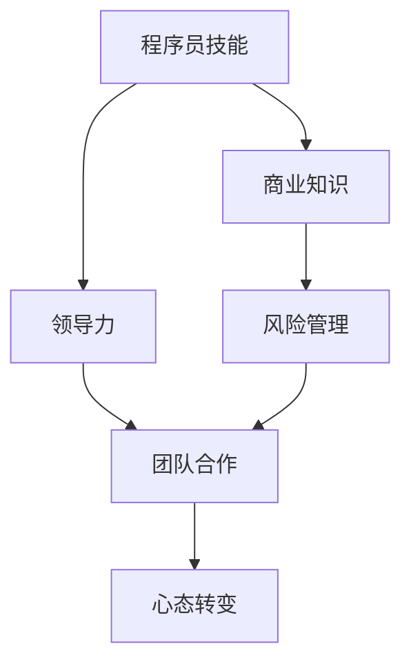
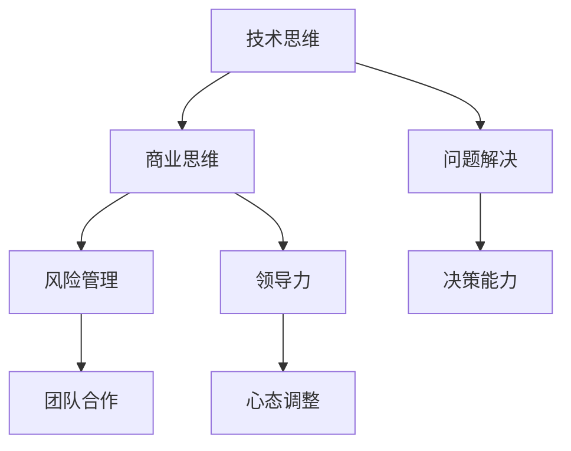

                 

# 从程序员到创业者的心态转变

> **关键词：** 程序员，创业者，心态转变，个人成长，团队协作，风险管理

> **摘要：** 本文章将探讨程序员在转型成为创业者过程中所需经历的心态转变。从专业技能到领导力的提升，从个体思维到团队合作，本文将深入剖析这些变化，并提供实用的建议，帮助程序员顺利实现从技术专家到创业者的角色转变。

## 1. 背景介绍

### 1.1 目的和范围

本文旨在探讨程序员在向创业者转型的过程中，如何调整心态，以适应新的角色和挑战。我们将分析从技术专家到商业领袖的角色转变，探讨心态变化的核心要素，并提供实用的策略和案例，帮助读者顺利过渡。

### 1.2 预期读者

本文适用于希望成为创业者的程序员，特别是那些已经在技术领域有所成就，但对商业和创业领域不熟悉的读者。同时，对于已经在创业路上的程序员，本文也将提供一些有益的反思和启示。

### 1.3 文档结构概述

本文结构如下：

1. **背景介绍**：阐述文章的目的、预期读者和结构。
2. **核心概念与联系**：介绍从程序员到创业者角色转变所需的核心概念。
3. **核心算法原理 & 具体操作步骤**：分析心态转变的具体方法和实践。
4. **数学模型和公式 & 详细讲解 & 举例说明**：使用数学模型和公式来阐述心态转变的原理。
5. **项目实战：代码实际案例和详细解释说明**：通过实际案例展示心态转变的应用。
6. **实际应用场景**：探讨心态转变在创业中的具体应用。
7. **工具和资源推荐**：推荐学习资源和开发工具。
8. **总结：未来发展趋势与挑战**：总结文章要点，探讨未来趋势和挑战。
9. **附录：常见问题与解答**：解答读者可能遇到的问题。
10. **扩展阅读 & 参考资料**：提供更多学习资源。

### 1.4 术语表

#### 1.4.1 核心术语定义

- **程序员**：从事软件编程、开发和维护的专业人员。
- **创业者**：创立新公司或业务，承担风险，寻求利润的人。
- **心态转变**：个体在角色变化过程中所需的心理适应和调整。

#### 1.4.2 相关概念解释

- **领导力**：影响和激励他人达成目标的能力。
- **团队合作**：多人合作共同完成任务的协作过程。
- **风险管理**：识别、评估和控制潜在风险的过程。

#### 1.4.3 缩略词列表

- **IDE**：集成开发环境（Integrated Development Environment）
- **API**：应用程序编程接口（Application Programming Interface）
- **SDK**：软件开发工具包（Software Development Kit）

## 2. 核心概念与联系

在探讨程序员到创业者的心态转变之前，我们需要明确一些核心概念和它们之间的联系。以下是一个简要的 Mermaid 流程图，展示了这些概念的关系：



### 2.1 程序员技能

程序员技能是创业者转型的基础。这些技能包括编程语言、算法、数据结构、系统设计和开发流程等。一个优秀的程序员通常具备以下特点：

- **专业技能**：熟练掌握至少一门编程语言，如 Python、Java、C++等。
- **解决问题的能力**：能够快速定位并解决编程中的问题。
- **代码质量**：编写可读、可维护、高效和健壮的代码。

### 2.2 商业知识

商业知识是创业者必须掌握的另一个核心技能。这些知识包括市场分析、营销策略、财务管理和商业模式等。以下是一些关键点：

- **市场分析**：了解目标市场和客户需求，以便为产品和服务定位。
- **营销策略**：制定有效的营销计划，提高品牌知名度。
- **财务管理**：管理资金流动，确保公司财务健康。
- **商业模式**：确定公司的盈利模式和长期战略。

### 2.3 领导力

领导力是创业者成功的关键因素。一个有领导力的创业者能够激励团队、制定战略和应对挑战。以下是一些关键点：

- **愿景和目标**：明确公司的愿景和目标，使团队保持动力。
- **决策能力**：在复杂和不确定的环境中做出明智的决策。
- **沟通技巧**：有效传达信息，确保团队内部沟通顺畅。

### 2.4 风险管理

风险管理是创业者必须面对的现实问题。通过识别、评估和控制风险，创业者可以降低潜在的损失。以下是一些关键点：

- **风险识别**：识别可能影响公司运营的风险。
- **风险评估**：评估风险的可能性和影响。
- **风险控制**：采取行动减轻或消除风险。

### 2.5 团队合作

团队合作是创业成功的关键因素之一。一个高效的团队可以共同解决问题，实现目标。以下是一些关键点：

- **分工合作**：明确团队成员的角色和职责。
- **信任与支持**：建立信任，为团队成员提供支持。
- **有效沟通**：确保信息在团队内部有效传达。

### 2.6 心态转变

心态转变是从程序员到创业者角色转变的核心。以下是一个简单的 Mermaid 流程图，展示了心态转变的过程：



- **技术思维**：注重技术实现和代码质量。
- **商业思维**：关注市场和商业模式。
- **问题解决**：寻求高效的解决方案。
- **风险管理**：识别和控制潜在风险。
- **领导力**：激励和指导团队。
- **决策能力**：在不确定的环境中做出决策。
- **团队合作**：与团队成员共同实现目标。
- **心态调整**：适应新的角色和挑战。

## 3. 核心算法原理 & 具体操作步骤

心态转变是一个复杂的过程，需要一系列具体的操作步骤。以下是一个简单的伪代码，用于描述心态转变的核心算法：

```python
def心态转变(程序员):
    1. 学习商业知识
    2. 提升领导力和决策能力
    3. 培养团队合作精神
    4. 适应风险管理
    5. 调整心态，适应新角色
    6. 反馈与改进
```

### 3.1 学习商业知识

商业知识是心态转变的基础。程序员可以通过以下步骤学习商业知识：

1. **阅读相关书籍**：阅读有关商业策略、市场营销、财务管理和创业指导的书籍。
2. **参加在线课程**：参加在线课程，学习市场分析、营销策略和商业模式等。
3. **实践**：通过实际项目或创业经验，将商业知识应用于实践。

### 3.2 提升领导力和决策能力

领导力和决策能力是创业者成功的关键。以下是一些提升这些能力的建议：

1. **参加领导力培训**：参加领导力培训课程，学习领导技巧和团队管理。
2. **反思和自我提升**：定期反思自己的行为和决策，找出改进之处。
3. **实践**：在实际工作中，尝试担任领导角色，指导团队并做出决策。

### 3.3 培养团队合作精神

团队合作精神是高效团队的基础。以下是一些培养团队合作精神的建议：

1. **建立信任**：与团队成员建立信任关系，确保团队成员之间相互支持。
2. **沟通与协作**：确保团队成员之间的沟通畅通，共同解决问题。
3. **分工合作**：明确团队成员的角色和职责，确保每个成员都能发挥自己的优势。

### 3.4 适应风险管理

风险管理是创业过程中不可避免的一部分。以下是一些适应风险管理的建议：

1. **识别风险**：识别可能影响公司运营的风险，包括市场风险、技术风险和财务风险等。
2. **评估风险**：评估风险的可能性和影响，确定优先级。
3. **制定应对策略**：制定应对策略，降低风险的影响。

### 3.5 调整心态，适应新角色

心态转变是成功的关键。以下是一些调整心态的建议：

1. **积极心态**：保持积极的心态，相信自己能够适应新角色。
2. **接受挑战**：接受新的挑战，勇敢面对困难。
3. **持续学习**：不断学习新的知识和技能，适应不断变化的环境。

### 3.6 反馈与改进

心态转变是一个持续的过程。以下是一些反馈与改进的建议：

1. **定期反思**：定期反思自己的行为和决策，找出改进之处。
2. **寻求反馈**：向团队成员和导师寻求反馈，了解自己的优点和不足。
3. **持续改进**：根据反馈进行改进，不断提高自己的能力。

## 4. 数学模型和公式 & 详细讲解 & 举例说明

心态转变可以被视为一个动态过程，其中涉及到多个因素和变量。以下是一个简化的数学模型，用于描述心态转变的原理：

### 4.1 心态转变模型

假设心态转变过程可以用以下公式表示：

\[ \Delta P = f(C, L, T, R) \]

其中：

- \( \Delta P \) 表示心态变化量。
- \( C \) 表示商业知识水平。
- \( L \) 表示领导力和决策能力。
- \( T \) 表示团队合作精神。
- \( R \) 表示风险管理能力。

### 4.2 公式详细解释

- **商业知识水平 \( C \)**：商业知识是心态转变的基础。较高的商业知识水平有助于程序员更好地理解商业环境和市场需求。

- **领导力和决策能力 \( L \)**：领导力和决策能力是创业者成功的关键。一个有领导力的创业者能够更好地激励团队和应对挑战。

- **团队合作精神 \( T \)**：团队合作精神是高效团队的基础。良好的团队合作精神有助于提高团队的效率和创造力。

- **风险管理能力 \( R \)**：风险管理能力是适应创业过程中的不确定性。较高的风险管理能力有助于降低潜在的风险。

### 4.3 举例说明

假设一个程序员具备以下特征：

- 商业知识水平 \( C = 5 \)
- 领导力和决策能力 \( L = 6 \)
- 团队合作精神 \( T = 7 \)
- 风险管理能力 \( R = 5 \)

根据心态转变模型，我们可以计算出心态变化量：

\[ \Delta P = f(5, 6, 7, 5) = 5 + 6 + 7 + 5 = 23 \]

这意味着这个程序员的总体心态变化量为 23。如果所有因素都达到最优水平，那么心态变化量将会更大。

### 4.4 模型的应用

这个模型可以用于评估和改进程序员的创业心态。例如：

1. **评估当前心态**：通过计算公式，可以评估程序员的当前心态水平。
2. **制定改进计划**：根据评估结果，制定针对性的改进计划，提升各因素的水平和心态变化量。

## 5. 项目实战：代码实际案例和详细解释说明

为了更好地理解心态转变的过程，我们通过一个实际的代码案例来展示这一过程。以下是一个简单的项目，用于展示从程序员到创业者的心态转变。

### 5.1 项目背景

我们假设一个程序员（张三）正在开发一款名为“智能助手”的应用程序。这个应用程序的目标是帮助用户解决日常生活中的一些问题。张三作为一个有多年编程经验的程序员，希望通过这个项目实现从技术专家到创业者的转变。

### 5.2 开发环境搭建

在开始项目之前，张三首先需要搭建一个适合开发的应用程序环境。他选择了以下工具和框架：

- **编程语言**：Python
- **Web框架**：Flask
- **数据库**：SQLite
- **前端框架**：Bootstrap
- **集成开发环境**：PyCharm

### 5.3 源代码详细实现和代码解读

以下是一个简单的“智能助手”应用程序的代码实现：

```python
# smart_helper.py
from flask import Flask, request, jsonify
import sqlite3

app = Flask(__name__)

# 数据库连接
def get_db_connection():
    conn = sqlite3.connect('smart_helper.db')
    conn.row_factory = sqlite3.Row
    return conn

# 创建数据库表
def create_tables():
    conn = get_db_connection()
    conn.execute('''CREATE TABLE IF NOT EXISTS questions (
                        id INTEGER PRIMARY KEY AUTOINCREMENT,
                        question TEXT NOT NULL
                    )''')
    conn.execute('''CREATE TABLE IF NOT EXISTS answers (
                        id INTEGER PRIMARY KEY AUTOINCREMENT,
                        answer TEXT NOT NULL
                    )''')
    conn.commit()
    conn.close()

# 添加问题
@app.route('/add_question', methods=['POST'])
def add_question():
    data = request.json
    question = data['question']
    conn = get_db_connection()
    conn.execute("INSERT INTO questions (question) VALUES (?)", (question,))
    conn.commit()
    conn.close()
    return jsonify({"status": "success", "question": question})

# 获取答案
@app.route('/get_answer', methods=['GET'])
def get_answer():
    question = request.args.get('question')
    conn = get_db_connection()
    result = conn.execute("SELECT answer FROM answers WHERE question=?", (question,))
    answer = result.fetchone()
    conn.close()
    return jsonify({"status": "success", "answer": answer['answer']})

if __name__ == '__main__':
    create_tables()
    app.run(debug=True)
```

这个应用程序包括两个主要功能：

1. **添加问题**：通过 `/add_question` 接口接收用户提交的问题，并将问题存储在数据库中。
2. **获取答案**：通过 `/get_answer` 接口根据用户提交的问题获取相应的答案。

### 5.4 代码解读与分析

1. **数据库连接**：应用程序使用 SQLite 数据库存储问题和答案。`get_db_connection` 函数负责建立数据库连接。
2. **创建数据库表**：`create_tables` 函数创建两个数据库表，一个用于存储问题，另一个用于存储答案。
3. **添加问题**：`add_question` 函数接收用户提交的问题，并将其存储在数据库中。
4. **获取答案**：`get_answer` 函数根据用户提交的问题从数据库中获取相应的答案。

### 5.5 心态转变的应用

在这个项目中，张三需要经历以下心态转变：

1. **从技术思维转向商业思维**：张三需要考虑如何将技术解决方案与市场需求相结合，确保应用程序能够解决用户的问题。
2. **提升领导力和决策能力**：在开发过程中，张三需要做出一系列决策，如选择合适的编程语言、数据库和前端框架等。他还需要管理团队，确保项目按时交付。
3. **培养团队合作精神**：张三需要与团队成员协作，共同完成项目。这包括与前端开发人员、数据库管理员和测试人员等合作。
4. **适应风险管理**：在开发过程中，张三需要识别和应对各种潜在的风险，如技术实现中的问题、项目进度的延迟和资源限制等。

通过这个项目，张三不仅实现了从程序员到创业者的角色转变，还提高了自己的商业知识、领导力和风险管理能力。

## 6. 实际应用场景

心态转变在创业过程中的实际应用场景非常广泛。以下是一些典型的应用场景：

### 6.1 创业初期

在创业初期，程序员需要从技术专家的角色转变为商业领袖。以下是一些关键应用场景：

- **市场调研**：程序员需要通过市场调研了解目标客户的需求和偏好，以便为产品定位。
- **制定商业模式**：程序员需要与商业团队合作，制定可行的商业模式，确保公司能够盈利。
- **风险评估**：程序员需要识别和评估潜在的风险，如技术实现中的问题、资金短缺和市场变化等。

### 6.2 团队管理

在团队管理中，心态转变至关重要。以下是一些关键应用场景：

- **分工合作**：程序员需要根据团队成员的技能和兴趣，为他们分配合适的任务，确保团队高效运作。
- **沟通与协作**：程序员需要建立有效的沟通机制，确保团队成员之间的信息共享和协作。
- **激励与支持**：程序员需要激励团队成员，提供必要的支持，确保团队士气高涨。

### 6.3 项目管理

在项目管理中，心态转变有助于提高项目的成功概率。以下是一些关键应用场景：

- **进度管理**：程序员需要制定合理的项目计划，确保项目按时交付。
- **风险管理**：程序员需要识别和应对项目中的潜在风险，确保项目顺利推进。
- **决策能力**：程序员需要在不确定的环境中做出明智的决策，确保项目达到预期目标。

### 6.4 营销与推广

在营销与推广中，心态转变有助于提高产品的市场影响力。以下是一些关键应用场景：

- **市场定位**：程序员需要根据市场需求和目标客户，为产品制定合适的定位策略。
- **营销策略**：程序员需要制定有效的营销策略，提高品牌知名度和市场占有率。
- **数据分析**：程序员需要利用数据分析工具，了解市场需求和客户反馈，不断优化营销策略。

### 6.5 风险管理

在风险管理中，心态转变有助于降低潜在的风险。以下是一些关键应用场景：

- **风险识别**：程序员需要识别项目中的潜在风险，如技术实现中的问题、项目进度的延迟和资金短缺等。
- **风险评估**：程序员需要评估风险的可能性和影响，确定优先级。
- **风险控制**：程序员需要制定应对策略，降低风险的影响，确保项目的顺利进行。

通过在这些实际应用场景中不断调整心态，程序员可以更好地适应创业过程中的各种挑战，提高创业成功率。

## 7. 工具和资源推荐

### 7.1 学习资源推荐

#### 7.1.1 书籍推荐

1. **《创业维艰》（Hard Things About Hard Things）**：作者本·霍洛维茨，讲述了创业过程中的各种挑战和应对策略。
2. **《精益创业》（The Lean Startup）**：作者埃里克·莱斯，介绍了如何通过精益创业方法降低风险，提高创业成功率。
3. **《从优秀到卓越》（Good to Great）**：作者吉姆·柯林斯，探讨了如何将一个优秀企业转变为卓越企业。

#### 7.1.2 在线课程

1. **Coursera 上的《创业管理》（Entrepreneurship: Success, Failure, and Innovation）**：这门课程涵盖了创业过程中的关键要素，包括市场调研、商业模式、团队管理等。
2. **edX 上的《创业与领导力》（Entrepreneurship and Leadership）**：这门课程介绍了创业过程中所需的关键技能，如领导力、沟通技巧和团队管理。
3. **Udemy 上的《精益创业实战》（Lean Startup for Entrepreneurs）**：这门课程介绍了如何通过精益创业方法降低风险，提高创业成功率。

#### 7.1.3 技术博客和网站

1. **TechCrunch**：一个关于科技、创业和创新的博客，提供了大量关于创业的最新动态和成功案例。
2. **Silicon Valley Insider**：一个专注于硅谷创业和创新的博客，分享了创业者的经验和见解。
3. **Product Hunt**：一个产品发现平台，展示了最新的创意产品和创业项目。

### 7.2 开发工具框架推荐

#### 7.2.1 IDE和编辑器

1. **Visual Studio Code**：一个免费且强大的跨平台代码编辑器，支持多种编程语言和开发框架。
2. **PyCharm**：一个专业的Python开发环境，提供了丰富的功能和工具。
3. **Eclipse**：一个适用于Java开发的跨平台IDE，支持多种Java框架和工具。

#### 7.2.2 调试和性能分析工具

1. **Postman**：一个API调试和测试工具，适用于各种API开发。
2. **JMeter**：一个开源的性能测试工具，适用于Web应用程序和服务的负载测试。
3. **New Relic**：一个云端性能监控工具，提供了实时性能分析和异常检测。

#### 7.2.3 相关框架和库

1. **Django**：一个高层次的Python Web框架，适用于快速开发和部署Web应用程序。
2. **Flask**：一个轻量级的Python Web框架，适用于小型和实验性的Web应用程序。
3. **Spring Boot**：一个基于Java的Web框架，提供了丰富的功能和工具，适用于企业级Web应用程序。

### 7.3 相关论文著作推荐

#### 7.3.1 经典论文

1. **“Entrepreneurship: The Theory and Practice of Creating the New”**：作者Shapira和Chase，探讨了创业的本质和创业者的角色。
2. **“The Lean Startup”**：作者埃里克·莱斯，介绍了精益创业方法的核心原则和实践。
3. **“The Innovator's Dilemma”**：作者克里斯坦森，讲述了创新者在市场中面临的挑战和应对策略。

#### 7.3.2 最新研究成果

1. **“Entrepreneurship and Innovation in the Digital Economy”**：作者Mithas和Srivastava，探讨了数字时代创业和创新的趋势和挑战。
2. **“The Power of the Network: How Social Networks Shape Business Opportunities”**：作者Dyson和Mayer-Schönberger，讲述了社交网络对创业和商业机会的影响。
3. **“Innovation and the Digital Economy”**：作者Swamidass和Zuboff，探讨了数字化对创新和创业的影响。

#### 7.3.3 应用案例分析

1. **“Airbnb: Building a Global Community through Local Connections”**：案例研究了Airbnb如何通过本地连接打造全球社区，并成功实现商业创新。
2. **“Uber: Reinventing the Taxi Industry with Technology”**：案例研究了Uber如何利用技术革新传统出租车行业，并实现快速扩张。
3. **“Walmart Labs: Innovating in a Traditional Retailer”**：案例研究了Walmart如何通过创新实验室在传统零售业中保持竞争力。

这些工具、资源和案例将为程序员在创业过程中提供宝贵的经验和启示。

## 8. 总结：未来发展趋势与挑战

从程序员到创业者的心态转变是一个长期而复杂的过程。随着技术的发展和商业环境的不断变化，未来这一过程将面临新的趋势和挑战。

### 8.1 发展趋势

1. **数字化转型**：随着数字技术的迅猛发展，创业者需要具备更强的数字化能力，以应对市场需求和客户期望的变化。
2. **跨界合作**：未来的创业成功越来越依赖于跨界合作，创业者需要具备跨学科的知识和技能，以实现不同领域之间的整合和创新。
3. **数据驱动决策**：数据将成为创业决策的重要依据，创业者需要掌握数据分析技能，利用大数据和人工智能技术优化商业策略。

### 8.2 挑战

1. **技术快速迭代**：技术的快速发展带来了新的机遇，同时也增加了创业者的学习和适应成本。
2. **市场竞争加剧**：随着市场竞争的加剧，创业者需要不断创新，提高产品和服务质量，以保持竞争优势。
3. **团队管理复杂度**：随着团队的扩张，创业者需要面对更复杂的管理挑战，包括团队沟通、协作和激励等问题。

### 8.3 应对策略

1. **持续学习**：保持持续学习的态度，跟上技术发展的步伐，不断提高自己的专业能力和商业素养。
2. **搭建跨界团队**：搭建跨学科团队，发挥团队成员的不同专长，实现优势互补。
3. **数据驱动创新**：利用数据分析工具，深入了解市场需求和用户行为，为决策提供有力支持。

通过积极应对这些趋势和挑战，程序员可以更好地实现从技术专家到创业者的心态转变，实现创业成功。

## 9. 附录：常见问题与解答

### 9.1 问题1：如何平衡技术发展和商业知识？

**解答**：平衡技术发展和商业知识的关键在于合理安排时间。建议制定学习计划，将商业知识的学习纳入日常工作中。例如，每天抽出一定时间阅读商业书籍、参加在线课程或与行业专家交流。此外，可以通过参与创业社区或加入创业孵化器，与创业者互动，了解行业动态和市场需求。

### 9.2 问题2：如何在创业过程中管理团队？

**解答**：管理团队的关键在于建立信任和明确分工。首先，与团队成员建立良好的沟通渠道，确保信息畅通。其次，明确团队成员的角色和职责，确保每个人都能发挥自己的优势。此外，建立激励机制，鼓励团队成员积极参与项目，提高团队凝聚力。

### 9.3 问题3：如何应对创业过程中的风险？

**解答**：应对风险的关键在于提前识别和评估潜在风险，并制定应对策略。建议在项目启动前进行全面的风险评估，识别可能影响项目进展的风险。然后，根据风险评估结果，制定相应的应对策略，如调整项目计划、增加资源投入或寻找合作伙伴等。此外，保持灵活性和适应能力，以便在面临突发情况时能够迅速应对。

## 10. 扩展阅读 & 参考资料

### 10.1 扩展阅读

1. **《创业者的思维》**：作者史蒂夫·布兰克，探讨了创业者的思维方式和方法，提供了实用的创业建议。
2. **《技术创业》**：作者唐·塔普斯科特，讲述了技术创业的现状和未来趋势，分析了技术对创业的影响。

### 10.2 参考资料

1. **创业研究数据库（ Entrepreneurship Research Database）**：提供全球创业研究的数据库，包括论文、报告和书籍等。
2. **创业研究中心网站（Center for Entrepreneurship）**：提供关于创业的最新研究、案例分析和行业报告。
3. **创业论坛和社区**：如创业家论坛（Entrepreneur Forum）、创业社区（Startup Community）等，提供创业者之间的交流和资源分享。

通过这些扩展阅读和参考资料，读者可以深入了解创业领域的最新动态和研究成果，为自己的创业之路提供更多支持和指导。

**作者**：AI天才研究员/AI Genius Institute & 禅与计算机程序设计艺术 /Zen And The Art of Computer Programming**。

